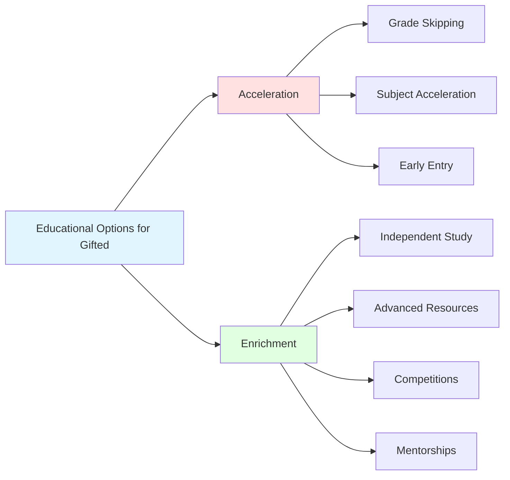

Understanding giftedness and implementing effective inclusive education are essential for meeting the needs of all exceptional children.

---

**Source PDFs**: 
- 📄 [Block-2/Unit-4.pdf - Pages 58-61](/pdfs/MPC-002%20Life%20Span%20Psychology/Block-2/Unit-4.pdf)
- 📚 MPC-002 Life Span Psychology

---

## Defining Giftedness and Talent

### Historical Perspective: Terman's Longitudinal Study

**Lewis Terman (1925)**: Conducted landmark study following 1,500+ children with IQs in "genius range" (>135) from childhood through adulthood.

**Key Findings:**
- Gifted children generally became successful, well-adjusted adults
- High IQ correlated with career achievement, life satisfaction
- Debunked myth that gifted individuals are socially maladjusted
- Challenged stereotype of "mad genius" or "eccentric intellectual"

**Study Limitations:**
- Selected only on IQ (missed creatively, artistically, or otherwise gifted)
- Sample predominantly white, middle-class (selection bias)
- Neglected role of motivation, personality, opportunity

### Contemporary Definition of Giftedness

Giftedness extends far beyond high IQ scores. Modern definitions recognize **multiple domains of exceptional ability**:

**Six Areas of Giftedness:**

**1. General Intellectual Ability**
- **High IQ scores**: Typically 130+ on standardized tests
- **Advanced reasoning**: Abstract thinking, pattern recognition
- **Rapid learning**: Quickly grasps new concepts
- **Exceptional memory**: Both retention and retrieval

**2. Specific Academic Aptitude**
- **Excellence in particular subjects**: Mathematics, science, literature, history
- **Uneven profile**: May be gifted in one area, average in others
- **Early mastery**: Achieves advanced skills beyond grade level

**3. Creative or Productive Thinking**
- **Originality**: Generates unique, novel ideas
- **Divergent thinking**: Sees multiple solutions, perspectives
- **Innovation**: Creates new products, solutions, artistic works
- **Risk-taking**: Willing to try unconventional approaches

**4. Leadership Ability**
- **Influence**: Inspires, motivates others
- **Organization**: Coordinates group activities effectively
- **Decision-making**: Makes sound judgments
- **Responsibility**: Takes initiative, follows through

**5. Visual or Performing Arts**
- **Artistic talent**: Drawing, painting, sculpture
- **Musical ability**: Performance, composition
- **Dance, drama**: Exceptional performance skills
- **Advanced technique**: Beyond typical for age

**6. Psychomotor Ability**
- **Athletic excellence**: Superior coordination, strength, endurance
- **Sports achievement**: High-level competitive performance
- **Physical prowess**: Exceptional motor skills

> **Inclusive Definition**: Giftedness manifests across **all socioeconomic levels, races, and ethnic groups**. Cultural, linguistic, and economic barriers can mask giftedness, requiring culturally responsive identification methods.

### Characteristics of Gifted Children

**Cognitive Characteristics:**
- **Advanced vocabulary**: Uses sophisticated language
- **Deep curiosity**: Asks profound, probing questions
- **Exceptional memory**: Recalls details, facts easily
- **Rapid learning**: Masters new material quickly
- **Complex thinking**: Understands abstract concepts early
- **Intense concentration**: Extended focus on interests

**Social-Emotional Characteristics:**
- **Heightened sensitivity**: Strong emotional responses
- **Perfectionism**: High standards for self, others
- **Asynchronous development**: Advanced cognitively, age-appropriate socially/emotionally
- **Existential concerns**: Questions meaning, purpose, justice early
- **Social isolation**: May feel "different" from peers

**Learning Characteristics:**
- **Self-directed**: Prefers independent study
- **Intrinsic motivation**: Drives from within, not external rewards
- **Divergent thinking**: Generates multiple solutions
- **Meta-cognition**: Aware of own learning processes
- **Transfer of learning**: Applies concepts across domains

### Unique Challenges Faced by Gifted Children

**Academic Boredom:**
- **Unchallenging curriculum**: Already knows grade-level content
- **Repetitive practice**: Doesn't need extensive drill
- **Slow pace**: Instruction moves too slowly
- **Disengagement**: May "tune out," underachieve

**Social Difficulties:**
- **Peer acceptance**: May be labeled "teacher's pet," "nerd"
- **Asynchronous development**: Cognitive age ≠ social age
- **Different interests**: Peers don't share intellectual passions
- **Hiding abilities**: May "dumb down" to fit in

**Perfectionism and Anxiety:**
- **Unrealistic standards**: Expects perfection from self
- **Fear of failure**: Avoids challenges to protect self-image
- **Stress**: Pressure from self, parents, teachers
- **Gifted underachievement**: Performs below potential

**Misdiagnosis:**
- **ADHD confusion**: Boredom looks like inattention
- **Behavioral problems**: Acting out from lack of challenge
- **Twice-exceptional**: Gifted WITH learning disability, ADHD, autism

> **Critical Issue**: Without appropriate enrichment, gifted children's potential may remain undeveloped. Society loses contributions they could make; individuals miss fulfilling, successful lives they could lead.

---

## Educational Options for Gifted Students

### Acceleration

**Definition**: Moving students through curriculum at faster pace or advancing to higher grade level

**Types of Acceleration:**

**1. Grade Skipping (Whole-Grade Acceleration)**
- **Skip entire grade**: E.g., move from 3rd to 5th grade
- **Considerations**: Academic, social, emotional readiness
- **Research**: Generally positive outcomes for carefully selected students

**2. Subject Acceleration**
- **Advanced in specific subject**: E.g., 5th grader takes 7th grade math
- **Maintains age-appropriate grade**: For most subjects
- **Flexible**: Can accelerate in multiple subjects as appropriate

**3. Early Entry**
- **Kindergarten**: Start before typical age (under 5 years old)
- **College**: Attend university courses while in high school; early college entrance

**4. Curriculum Compacting**
- **Pre-assess**: Test out of already-known material
- **Eliminate redundancy**: Skip unnecessary practice
- **Advanced content**: Use "freed" time for enrichment or acceleration

**5. Credit by Examination**
- **Test out**: Demonstrate mastery without taking course (e.g., AP exams, CLEP)
- **Earn credit**: Move ahead in subject sequence

**Advantages:**
- Matches instruction to ability level
- Prevents boredom, maintains engagement
- Cost-effective (uses existing courses)

**Disadvantages:**
- Social concerns (age differences with classmates)
- Curriculum gaps if acceleration uneven
- Teacher resistance, inflexible school policies

### Enrichment

**Definition**: Broadening and deepening learning experiences while remaining with age peers

**Enrichment Strategies:**

**1. Independent Study Projects**
- **Student-selected topics**: Based on interests
- **In-depth investigation**: Research, experimentation, creation
- **Product/presentation**: Share learning with others
- **Teacher as facilitator**: Guides rather than directs

**2. Advanced Texts and Resources**
- **College-level materials**: Textbooks, journal articles
- **Primary sources**: Original documents, research papers
- **Specialized resources**: Professional organizations, expert mentors

**3. Specialized Programs:**
- **Gifted resource room**: Pull-out enrichment (few hours weekly)
- **Gifted cluster classroom**: Several gifted students grouped together
- **Full-time gifted program**: Self-contained gifted class or school

**4. Competitions and Contests:**
- **Academic competitions**: Math Olympiad, Science Bowl, Geography Bee
- **Creative contests**: Writing, art, music competitions
- **Talent searches**: SAT/ACT for younger students (7th-8th grade)

**5. Mentorships and Internships:**
- **Expert mentors**: Professional in student's interest area
- **Real-world experiences**: Authentic work in field
- **Career exploration**: Understanding profession firsthand

**6. Summer Programs:**
- **Residential programs**: Duke TIP, CTY (Johns Hopkins), Davidson
- **Intensive study**: Advanced academic content
- **Social connections**: Peers with similar abilities, interests

**Critical Requirement for Success:**
- **Purpose-driven**: Clear learning objectives
- **Well-planned**: Structured, not "just busy work"
- **Appropriately challenging**: Matches student's readiness
- **Relevant**: Connects to student's interests, future goals
- **Otherwise**: Boring, meaningless enrichment activities worse than nothing

> **Research Evidence**: Studies demonstrate that both acceleration and enrichment produce positive academic and social-emotional outcomes when appropriately implemented. Neither approach is universally superior; choice depends on individual student needs ([Colangelo et al., 2023](https://doi.org/10.1177/0162353223116789)).

---

## Teacher's Role in Supporting Gifted Students

**1. Provide Abundant Resources:**
- **Reference materials**: Encyclopedias, specialized texts, journals
- **Technology access**: Computers, internet, specialized software
- **Library access**: University libraries, interlibrary loan
- **Community resources**: Museums, experts, professionals

**2. Allow Student Expression:**
- **Choice**: Student selects how to demonstrate learning
- **Creative formats**: Reports, presentations, artistic products, performances
- **Passion projects**: Pursue areas of deep interest

**3. Showcase Student Work:**
- **Class presentations**: Share research findings, projects
- **Displays**: Exhibit artistic, written work
- **Competitions**: Submit to contests, fairs, publications
- **Community sharing**: Present to parent groups, local organizations

**4. Encourage Divergent Thinking:**
- **Open-ended questions**: No single "right" answer
- **"What if" scenarios**: Explore possibilities
- **Multiple perspectives**: Encourage seeing all sides
- **Creative problem-solving**: Novel approaches welcomed

**5. Provide Depth, Not Just Breadth:**
- **In-depth study**: Explore topics thoroughly, not superficially
- **Complexity**: Advanced concepts, abstract thinking
- **Connections**: Interdisciplinary links, real-world applications
- **Authentic problems**: Real challenges, not contrived exercises

**6. Guest Speakers and Field Experiences:**
- **Experts visit**: Professionals share career experiences, knowledge
- **Field trips**: Universities, laboratories, businesses, cultural institutions
- **Internships**: Job shadowing, real work experiences
- **Virtual connections**: Video conferences with distant experts

**7. Encourage Innovation and Risk-Taking:**
- **Value novelty**: Praise original ideas, approaches
- **Accept failure**: Learning opportunity, not disaster
- **Experimentation**: "Try it and see what happens"
- **Challenging assignments**: Stretch abilities, can't do perfectly immediately

**8. Group Gifted Students:**
- **Ability grouping**: For specific subjects or projects
- **Intellectual peers**: Social connections with similar abilities
- **Collaborative projects**: Work together on advanced challenges
- **Healthy competition**: Motivating, not destructive

**9. Ensure Core Mastery:**
- **Foundation skills**: Reading, writing, math fundamentals
- **Balance**: Enrichment AND grade-level standards
- **Assessment**: Verify understanding of required curriculum
- **No skipping basics**: Even gifted students need solid foundation

**10. Differentiated Instruction:**
- **Flexible grouping**: Change groups based on topic, readiness
- **Tiered assignments**: Same concept, different complexity levels
- **Learning contracts**: Student-teacher agreement on learning goals, products
- **Compacting**: Eliminate mastered content, provide alternatives

---

## Educational Integration and Mainstreaming

### Concept and Philosophy

**Integration**: Process of providing **equal educational opportunities** to ALL children, including those with disabilities, by educating them with age-appropriate peers to the maximum extent possible.

**Historical Context:**
- **Past**: Separate schools/classes for children with disabilities
- **Problem**: Segregation, stigmatization, lower expectations
- **Movement**: From exclusion → segregation → integration → inclusion

**Underlying Assumptions:**

**1. Refined Instructional Procedures:**
- With appropriate modifications, general education can meet diverse needs
- Teaching methods can be adapted for individual learners
- Universal Design for Learning (UDL) benefits all students

**2. Individualized Educational Programs (IEPs):**
- Customized goals, accommodations, modifications for each student with disability
- Specialized services (speech therapy, occupational therapy, counseling) provided within general education context
- Assistive technology, equipment as needed

**3. Teacher Competence:**
- General education teachers trained in differentiation, accommodation strategies
- Special education teachers collaborate, co-teach, consult
- Ongoing professional development in inclusive practices

### Mainstreaming vs. Inclusion

**Mainstreaming (Earlier Model):**
- Student must "earn" placement in general education
- Focus on student changing to fit environment
- Part-time placement (some subjects only)

**Inclusion (Current Best Practice):**
- All students belong in general education from the start
- Focus on changing environment to fit students
- Full-time placement with supports brought to student
- Social integration valued equally with academic

### Legal Foundations

**Individuals with Disabilities Education Act (IDEA) - US:**
- **Free Appropriate Public Education (FAPE)**: Every child entitled to education meeting their needs
- **Least Restrictive Environment (LRE)**: Educate with non-disabled peers to maximum extent appropriate
- **Individualized Education Program (IEP)**: Written plan specifying goals, services, accommodations

**Rights of Persons with Disabilities Act (2016) - India:**
- **Inclusive education**: Right to free and appropriate education
- **Reasonable accommodations**: Schools must provide necessary supports
- **Non-discrimination**: Cannot exclude based on disability

### Benefits of Integration

**For Students with Disabilities:**
- **Higher expectations**: Exposure to grade-level curriculum
- **Peer models**: See typical behaviors, academics, social skills
- **Social connections**: Friendships with non-disabled peers
- **Community participation**: Prepared for inclusive adult life

**For Students without Disabilities:**
- **Acceptance of diversity**: Learn to interact with diverse individuals
- **Empathy and understanding**: Recognize similarities, not just differences
- **Reduced prejudice**: Personal relationships reduce stereotypes
- **Real-world preparation**: Society is diverse; school should reflect this

**For Society:**
- **Inclusive culture**: Values all members
- **Reduced stigma**: Disability seen as natural human variation
- **Economic benefits**: Individuals with disabilities contributing members
- **Social justice**: Equity, fairness, human rights

### Challenges and Solutions

**Challenge 1: Teacher Preparedness**
- **Problem**: General educators feel unprepared for students with disabilities
- **Solution**: Co-teaching, consultation, professional development, special education teacher support

**Challenge 2: Inadequate Resources**
- **Problem**: Insufficient funding, materials, personnel
- **Solution**: Advocate for adequate resources; creative use of existing supports; community partnerships

**Challenge 3: Attitudinal Barriers**
- **Problem**: Negative beliefs about disability, inclusion
- **Solution**: Awareness training, positive experiences with individuals with disabilities, administrative leadership

**Challenge 4: Academic Concerns**
- **Problem**: Fear that presence of students with disabilities lowers standards, instruction
- **Solution**: Research shows inclusion doesn't harm non-disabled students academically; benefits all when implemented well

**Challenge 5: Behavioral Challenges**
- **Problem**: Some students' behaviors disrupt learning
- **Solution**: Positive behavior supports, functional behavior assessments, appropriate placements (full inclusion not appropriate for every student in every situation)

### Keys to Successful Integration

**1. Collaborative Planning:**
- General education and special education teachers plan together
- Shared responsibility for all students
- Regular communication, coordination

**2. Differentiated Instruction:**
- Multiple means of representation (visual, auditory, kinesthetic)
- Multiple means of engagement (choice, interest, challenge level)
- Multiple means of expression (show learning various ways)

**3. Social Supports:**
- Peer buddies, circle of friends
- Social skills instruction for all students
- Anti-bullying programs

**4. Administrative Support:**
- Principal as instructional leader
- Resources allocated appropriately
- Positive school climate

**5. Family Partnerships:**
- Parents as equal team members
- Regular communication, collaboration
- Respecting family knowledge, preferences

**6. Ongoing Assessment:**
- Monitor progress on IEP goals
- Adjust instruction based on data
- Evaluate inclusion effectiveness

---

## Memory Aid: TALENT Framework for Gifted Education

**T - Think** divergently and creatively  
**A - Accelerate** when appropriate  
**L - Learn** independently with choice  
**E - Enrich** with depth and complexity  
**N - Nurture** social-emotional needs  
**T - Track** progress and adjust

## Memory Aid: INCLUDE for Integration

**I - Individualize** instruction for all  
**N - Normalize** diversity in classroom  
**C - Collaborate** across professionals  
**L - Least restrictive** environment principle  
**U - Universal Design** for Learning  
**D - Differentiate** content, process, product  
**E - Expect** success for every student

## Self-Assessment Questions

1. **Critique**: Traditional IQ-based definitions of giftedness excluded many talented individuals. How do contemporary multidimensional definitions address this limitation?

2. **Case Analysis**: A gifted 4th grader excels academically but struggles socially. The parents want grade acceleration; the teacher recommends remaining with age peers with enrichment. What factors should guide this decision? What would you recommend?

3. **Integration Application**: Design an inclusive lesson plan for a mixed-ability classroom including students with learning disabilities, typical students, and gifted students. How would you differentiate?

4. **Critical Thinking**: Some argue that separate programs for gifted students are "elitist" and harm non-gifted students. Others say gifted students have unique needs requiring specialized services. Evaluate both positions.

5. **Personal Reflection**: If you were a teacher, would you prefer to work in a fully inclusive classroom or with specialized pull-out programs for exceptional students? Explain your reasoning.

6. **Synthesis**: How can schools balance meeting the needs of students on both ends of the exceptionality spectrum (gifted and significantly disabled) within a single inclusive classroom?

## External Resources

### Organizations
- [National Association for Gifted Children (NAGC)](https://www.nagc.org/)
- [Council for Exceptional Children (CEC)](https://exceptionalchildren.org/)
- [CAST - Universal Design for Learning](http://www.cast.org/)

### Research
- [Gifted Child Quarterly](https://journals.sagepub.com/home/gcq)
- [Journal of Special Education](https://journals.sagepub.com/home/sed)
- [International Journal of Inclusive Education](https://www.tandfonline.com/toc/tied20/current)

### Videos
- [Understanding Giftedness](https://www.youtube.com/watch?v=FVlbSs76r2c) (12 min)
- [Inclusive Education in Practice](https://www.youtube.com/watch?v=7jmrPxDHhGc) (18 min)

---

## Final Reflections on Exceptional Children

**Core Principles:**

1. **All children deserve appropriate education** matched to their needs, abilities
2. **Exceptionality exists on spectrum** from significant disabilities to outstanding gifts
3. **Early identification and intervention** maximize positive outcomes
4. **Collaboration** among educators, specialists, families essential
5. **Individualization** key to meeting diverse needs
6. **High expectations** for all students, with appropriate supports
7. **Social integration** matters as much as academic achievement
8. **Continuous assessment** and adjustment of programs

**Teacher's Responsibility:**
- **Observe carefully**: Notice signs of exceptionality
- **Refer appropriately**: Connect students with needed services
- **Collaborate actively**: Work with specialists, families
- **Differentiate instruction**: Meet diverse needs within classroom
- **Advocate strongly**: Ensure students receive appropriate services
- **Expect success**: Believe in potential of every student

**The Goal**: Every child, regardless of abilities or challenges, develops to their full potential and becomes a contributing, valued member of society.

---

**Conclusion**: Understanding and meeting needs of exceptional children represents both significant challenge and immense opportunity. When educators rise to this challenge with knowledge, skill, compassion, and commitment, profound positive impacts on individual lives and society as a whole result.
