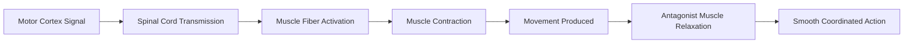

# Motor Development and Skills in Middle Childhood

## Introduction to Motor Development

Motor development during middle childhood (6-11 years) represents a period of **remarkable skill refinement and expansion**. While early childhood establishes foundational movement patterns, middle childhood transforms these basic abilities into **sophisticated, purposeful actions** that enable participation in complex sports, academic tasks, and social activities.

:::tip Defining Motor Skills
**Motor skills** are learned abilities involving fine coordination of muscles to produce smooth, controlled movements. They develop through the integration of **neurological maturation**, **physical growth**, and **practice-based learning**.
:::

### Why Middle Childhood is Ideal for Motor Learning

Middle childhood is often called the "**golden age of skill learning**" for several compelling reasons:

1. **Physical Pliability**: Children's bodies are more flexible than adolescents' and adults', making new movement patterns easier to establish

2. **Neural Plasticity**: Brain regions controlling movement show high plasticity, enabling rapid skill acquisition

3. **Minimal Interference**: Fewer previously learned skills exist to create negative transfer or conflicting movement patterns

4. **Adventurousness**: Children are naturally more willing to try new, challenging activities than older individuals

5. **Enjoyment of Repetition**: Unlike adults who find repetition tedious, children enjoy practicing the same movements repeatedly—essential for skill consolidation

6. **Temporal Advantage**: Fewer responsibilities provide extended practice time compared to adolescents and adults

---

## Understanding Muscle Types and Muscular Coordination

### Two Types of Muscles

The human musculoskeletal system contains two functionally distinct muscle groups:

**Large (Gross) Muscles:**
- Located in **arms, legs, back, and trunk**
- Control **major body movements** like running, jumping, climbing
- Develop and mature **earlier** than fine muscles
- Provide **power and endurance** for sustained activity

**Small (Fine) Muscles:**
- Located in **fingers, toes, wrists, and facial regions**
- Control **precise, delicate movements** like writing, buttoning, drawing
- Develop and mature **later**, requiring more neurological sophistication
- Enable **manipulation and dexterity** essential for tool use

### Muscular Coordination: Contraction and Relaxation

**Mechanism of Movement:**

Movement occurs through coordinated **contraction (tightening)** and **flexion/relaxation** of muscles. Some control is **automatic** (reflexive), while learned control is called **muscular coordination**.

### Types of Muscular Coordination

**1. Gross Motor Coordination**
- Involves **large muscle groups** working together
- Examples: running, jumping, balancing, climbing, swimming
- Develops **earlier** than fine motor skills
- Provides foundation for **sports and active play**

**2. Fine Motor Coordination**  
- Involves **small muscle groups** in precise movements
- Examples: writing, drawing, buttoning, using utensils, manipulating small objects
- Develops **later**, requiring greater neurological maturity
- Essential for **academic tasks and daily living skills**

:::info Developmental Sequence
**Gross motor coordination develops BEFORE fine motor coordination** in all children. This reflects the **proximal-to-distal** and **gross-to-fine** principles of motor development. Activities requiring large muscles can be taught earlier than those requiring fine manipulation.
:::

---

## Developmental Progression: An Example

Consider how children of different ages pick up a pencil from a table:

**One-Year-Old:**
- Uses **entire palm** in raking motion
- Crude, unrefined grasp
- Limited precision or control

**Three-Year-Old:**
- Uses **several fingers and thumb** together
- Shows emerging pincer development
- Some manipulation possible but imprecise

**Eleven-Year-Old:**
- Uses **refined pincer grasp** (index finger and thumb)
- Can **twirl, rotate, and manipulate** pencil with fine movements
- Applies **precise pressure** for writing tasks
- Can perform complex hand movements like pen tricks

This progression illustrates the **refinement of fine motor control** with maturation and practice.

---

## The Concept of Sensitive Periods

### Defining Sensitive Periods

**Sensitive period** refers to a **developmental window when specific skills can be learned most effectively**. During these periods, the relevant neuromuscular systems are:

- **Maturing and most plastic**
- **Highly receptive** to environmental input
- **Capable of rapid skill acquisition**
- **Optimally responsive** to practice

### Why Sensitive Periods Matter

**Optimal Learning:**
- Training during sensitive periods produces **faster mastery**
- Skills learned become **more automatic and fluent**
- **Less effort required** for equivalent proficiency

**Risks of Premature Training:**
- Forcing skills **before muscles are ready** can cause:
  - **Physical damage** to developing muscle fibers
  - **Psychological frustration** and aversion to activity
  - **Inefficient movement patterns** that persist
  - **Increased injury risk**

:::warning Critical Example
**Writing Skills**: Fine hand muscles required for writing mature between ages 4.5-5.5 years. Forcing children to write before this period can:
- Damage developing small muscles
- Create incorrect grip patterns
- Generate frustration and writing anxiety
- Establish poor handwriting habits difficult to correct later

This is a primary reason **formal schooling** typically begins after age 5.
:::

### Multiple Sensitive Periods in Middle Childhood

Ages 6-11 years contain **numerous overlapping sensitive periods** for different motor skills:

- **Ages 6-8**: Basic sports skills (throwing, catching, kicking)
- **Ages 7-9**: Balance and coordination activities (gymnastics, dance)
- **Ages 8-10**: Fine motor dexterity (musical instruments, detailed artwork)
- **Ages 9-11**: Complex team strategies and coordinated group movements

Children who receive **appropriate practice and encouragement** during these windows achieve superior proficiency compared to later training.

---

## Year-by-Year Motor Development (Ages 6-11)

### Age 6 Years

**Gross Motor Capabilities:**
- **Runs** with coordinated arm-leg opposition
- **Throws and catches** balls at estimated distances
- **Balances** on one foot briefly (few seconds)
- **Hops** on one foot with emerging control
- Learns to ride **two-wheel bicycle** with training wheels

**Fine Motor Capabilities:**
- **Draws** simple figures and shapes
- **Copies** basic geometric forms
- **Buttons and zips** clothing independently
- **Uses fork and spoon** effectively
- **Handwriting** large and uneven but readable

**Typical Activities:**
- Tag, hide-and-seek, simple playground games
- Building with blocks, simple puzzles
- Coloring within lines emerging

### Age 7 Years

**Gross Motor Capabilities:**
- **Balance** on one foot for longer periods (10+ seconds)
- **Hops and skips** with good rhythm
- **Catches** small balls reliably
- **Runs** faster with better endurance
- Rides **two-wheel bicycle** without training wheels

**Fine Motor Capabilities:**
- **Handwriting** becomes smaller and more uniform
- **Ties shoelaces** independently
- **Uses scissors** to cut complex shapes
- **Draws** recognizable figures with detail
- **Manipulates** small construction toys (LEGOs)

**Typical Activities:**
- Organized sports begin (soccer, baseball)
- Board games, card games
- Simple craft projects

### Age 8 Years

**Gross Motor Capabilities:**
- **Jumps** considerable heights and distances
- **Skips** with alternating feet smoothly
- **Plays** hopscotch with complex patterns
- **Runs hurdles** with coordinated timing
- **Swimming strokes** becoming refined

**Fine Motor Capabilities:**
- **Cursive writing** emerges
- **Uses tools** (hammer, screwdriver) with supervision
- **Detailed artwork** with shading and perspective
- **Musical instruments** (beginning lessons effective)
- **Computer/tablet** use proficient

**Typical Activities:**
- Team sports with positions and strategies
- Building complex models
- Musical instrument practice

### Ages 9-10 Years

**Gross Motor Capabilities:**
- **Runs, jumps, hurdles** in coordinated sequences
- **Advanced gymnastics** skills possible
- **Dance** with complex choreography
- **Martial arts** forms and techniques
- **Multiple sports** proficiency

**Fine Motor Capabilities:**
- **Handwriting** neat, fast, automatic
- **Detailed drawing** and painting
- **Sewing, knitting** with patterns
- **Advanced instrument playing**
- **Typing** with emerging speed

**Typical Activities:**
- Competitive sports leagues
- Performance groups (dance, music, theater)
- Complex construction projects
- Advanced craft work

### Age 11 Years

**Gross Motor Capabilities:**
- **Near-adult coordination** in many activities
- **Sports-specific** skills well-developed
- **Strength capabilities** nearly doubled since age 6
- **Endurance** for prolonged activities
- **Complex movement sequences** automatic

**Fine Motor Capabilities:**
- **Professional-quality** handwriting possible
- **Artistic** skills approaching adult levels
- **Precision tasks** (detailed model building, jewelry making)
- **Advanced computer skills** (coding, design)
- **Multiple fine motor activities** simultaneously (play instrument while reading music)

**Typical Activities:**
- Competitive sports at higher levels
- Performance excellence in chosen activities
- Independent craft/hobby projects
- Complex academic tasks

---

## Brain Development Supporting Motor Skills

### Critical Brain Region Maturation

**Right Hemisphere Development (Ages 8-10):**

During middle childhood, particularly ages 8-10, the **right cerebral hemisphere** experiences a significant growth spurt, enhancing:

**Perceptual Functions:**
- **Spatial orientation** and navigation
- **Object and face recognition**
- **Temporal perception** (timing and rhythm)
- **Music appreciation** and production

**Motor Functions:**
- **Left-side body control** refinement
- **Movement sequencing** and planning
- **Bilateral coordination** improvement
- **Organizational** skills for complex movements

**Cognitive-Emotional Functions:**
- **Attention and vigilance** capacity increases
- **Empathy** development
- **Non-verbal communication** understanding
- **Humor** appreciation

This hemispheric specialization enables the **complex coordination required for sports, music, and skilled movements** that characterize successful middle childhood motor development.

### Myelination and Processing Speed

**Myelin Sheath Development:**
- **Myelination** (insulating coating on nerve fibers) continues throughout middle childhood
- Enables **faster neural transmission** from brain to muscles
- Results in **quicker reaction times** and more rapid movement sequences
- Supports **smoother, more efficient** motor performance

**Reaction Time Improvements:**
- Age 6: Average reaction time ~350-400 milliseconds
- Age 11: Average reaction time ~250-300 milliseconds
- **30-40% improvement** enables success in fast-paced sports and activities

---

## Motor Skill Progression: Fundamental Movement Patterns

### Running

**Age 6:**
- Coordinated arm-leg opposition established
- Maintains speed for short distances
- Stops and starts with control

**Age 7-8:**
- Increased speed and endurance
- Runs longer distances without fatigue
- Navigates around obstacles while running

**Age 9-11:**
- Near-maximum running speed achieved
- Combines running with other skills (dribbling ball)
- Strategic pacing for different distance goals

### Jumping

**Age 6:**
- Jumps from low heights (1-2 feet)
- Two-foot takeoff and landing
- Limited distance in broad jump

**Age 7-8:**
- Increased jumping height and distance
- One-foot takeoff emerging
- Begins combining jump with other movements

**Age 9-11:**
- Jumps for height (can reach 12+ inches vertically)
- Sophisticated jumping variations (twisting, complex sequences)
- Uses jumping strategically in sports

### Balance

**Age 6:**
- Brief balance on one foot (few seconds)
- Walking on wide balance beam
- Static balance primarily

**Age 7-8:**
- Extended one-foot balance (10+ seconds)
- Walking narrow beam confidently
- Beginning dynamic balance activities

**Age 9-11:**
- Complex balance stunts (one-foot hops on beam)
- Dynamic balance in challenging contexts
- Balance while performing other tasks

### Throwing and Catching

**Age 6:**
- Throws underhand and overhand with moderate accuracy
- Catches large, slow-moving balls
- Limited distance throwing

**Age 7-8:**
- Improved throwing accuracy and distance
- Catches variety of ball sizes reliably
- Coordinates catch with subsequent movement

**Age 9-11:**
- Throws with power and precision
- Catches small, fast-moving objects
- Anticipates trajectory for catching
- Sport-specific throwing techniques mastered

---

## Fine Motor Skill Development

### Hand-Eye Coordination

**Progressive Refinement:**
- **Age 6**: Basic eye-hand tasks (catching large ball, basic drawing)
- **Age 8**: Planned movements increase – can anticipate where hand needs to be
- **Age 10**: Controls **speed and direction** of grasp with precision

**Practical Applications:**
- **Writing**: Progresses from large, labored letters to small, automatic script
- **Art**: From simple drawings to detailed, shaded artwork
- **Tools**: From supervised use to independent, safe handling
- **Technology**: From assisted typing to proficient keyboarding

### Handedness Establishment

**Stabilization by Age 6:**
- **Hand dominance** firmly established by middle childhood
- **Cross-dominance** (different hand for different tasks) rare but normal
- **Forcing** non-dominant hand use counterproductive and harmful

**Implications for Learning:**
- Left-handed children need appropriate **adapted materials** (scissors, desks)
- Teachers should **accommodate** both right and left-handed learners
- **Ambidexterity** for non-writing tasks develops naturally through practice

### Writing Development

**Progression:**
1. **Ages 6-7**: Print letters, large and uneven
2. **Ages 7-8**: Print becomes smaller, more uniform
3. **Ages 8-9**: Cursive introduced, initially awkward
4. **Ages 9-10**: Writing automatic, neat, personal style emerging
5. **Ages 10-11**: Speed and neatness both high, little conscious effort

**Supporting Factors:**
- **Fine muscle maturation** in fingers and wrist
- **Visual-motor integration** improvement
- **Practice and feedback** from teachers
- **Motivation** from seeing progress

### Artistic and Creative Skills

**Age-Related Capabilities:**

**Ages 6-7:**
- **Recognizable drawings** of people, houses, animals
- **Coloring** mostly within lines
- **Simple crafts** with assistance

**Ages 8-9:**
- **Perspective** begins appearing in drawings
- **Shading and detail** added
- **Independent craft projects** completed
- **Musical notation** reading emerges

**Ages 10-11:**
- **Artistic style** individualized
- **Complex projects** (detailed models, intricate artwork)
- **Performance skills** (music, dance) approaching adult quality
- **Original creations** reflect personal vision

---

## Motor Development in Sports and Physical Activities

### Benefits of Sports Participation

**Physical Benefits:**
- **Cardiovascular fitness** and endurance
- **Strength** and flexibility development
- **Coordination** and skill refinement
- **Healthy weight** maintenance
- **Bone density** increases

**Psychological Benefits:**
- **Self-efficacy** from mastery experiences
- **Perseverance** and goal-setting skills
- **Stress management** through physical activity
- **Body awareness** and appreciation

**Social Benefits:**
- **Peer relationships** and friendships
- **Teamwork** and cooperation skills
- **Communication** in group contexts
- **Sportsmanship** and fair play values

:::tip Coaching Philosophy
Emphasis should be on **learning fundamentals, improvement, and enjoyment** rather than winning. Research shows that **overemphasis on competition** leads to earlier dropout and reduced intrinsic motivation for physical activity.
:::

### Age-Appropriate Sports

**Ages 6-8:**
- **Individual skill focus**: Swimming, gymnastics, martial arts
- **Simple team games**: T-ball, soccer with modified rules
- **Low-pressure contexts**: Recreational leagues, skill clinics
- **Variety encouraged**: Try multiple activities

**Ages 9-11:**
- **Team sports**: Basketball, volleyball, baseball with standard rules
- **Individual competitions**: Track and field, tennis, golf
- **Skill specialization** begins for interested children
- **Competitive leagues** appropriate with proper coaching

### Preventing Overuse and Burnout

**Warning Signs:**
- **Declining enjoyment** of previously loved activities
- **Chronic minor injuries** (overuse injuries)
- **Resistance** to attending practice or games
- **Fatigue** and performance decline
- **Anxiety** about performance

**Preventive Strategies:**
- **Variety**: Encourage multiple sports and activities
- **Rest periods**: Planned breaks and off-seasons
- **Child-centered goals**: Focus on fun and learning, not adult ambitions
- **Balance**: Ensure time for academics, family, free play

---

## External Resources

### Educational Videos

1. **"Motor Development in Middle Childhood" - Developmental Psychology**  
   [YouTube Link](https://www.youtube.com/watch?v=RWZ3eFKjM3Q)  
   Comprehensive overview of gross and fine motor progressions

2. **"Teaching Motor Skills to Children" - National Association for Sport and Physical Education**  
   [YouTube Link](https://www.youtube.com/watch?v=dz6L4_qX4HE)  
   Evidence-based approaches to motor skill instruction

### Research Articles

1. **Clark, J. E., & Metcalfe, J. S. (2023). "The Mountain of Motor Development"**  
   *Motor Development: Research and Reviews*  
   Contemporary model of motor development emphasizing dynamic systems

2. **Robinson, L. E., et al. (2024). "Motor Competence and Physical Activity in Children"**  
   *Journal of Sport and Health Science*  
   Links between motor skill proficiency and lifelong physical activity

### Wikipedia Resources

1. [Motor Skill](https://en.wikipedia.org/wiki/Motor_skill)  
2. [Motor Coordination](https://en.wikipedia.org/wiki/Motor_coordination)  
3. [Physical Education](https://en.wikipedia.org/wiki/Physical_education)

---

## Self-Assessment Questions

### Question 1
Which type of motor coordination develops FIRST in children?

A) Fine motor coordination  
B) Gross motor coordination  
C) They develop simultaneously  
D) Varies by individual child

Click to reveal answer

**Answer: B) Gross motor coordination**

**Explanation:** Gross motor coordination involving large muscle groups **always develops before** fine motor coordination. This reflects neurological maturation patterns and the gross-to-fine developmental principle. Children master running, jumping, and climbing before precise tasks like writing or detailed drawing.

### Question 2
At what age range do fine hand muscles required for writing typically mature?

A) Ages 3-4 years  
B) Ages 4.5-5.5 years  
C) Ages 6-7 years  
D) Ages 7-8 years

Click to reveal answer

**Answer: B) Ages 4.5-5.5 years**

**Explanation:** Fine muscles needed for writing mature between ages 4.5-5.5 years, which is why **formal schooling** typically begins after age 5. Forcing writing before this period risks muscle damage, poor technique, and writing anxiety.

### Question 3
What is a "sensitive period" in motor development?

A) A time when children are emotionally sensitive about their skills  
B) A developmental window when specific skills can be learned most effectively  
C) A period when children are sensitive to criticism  
D) A time when muscles are particularly vulnerable to injury

Click to reveal answer

**Answer: B) A developmental window when specific skills can be learned most effectively**

**Explanation:** A **sensitive period** is when neuromuscular systems are optimally mature and receptive to learning specific skills. Training during these windows produces faster mastery, more automatic performance, and requires less effort for proficiency.

### Question 4
By approximately what age is handedness firmly established?

A) Age 3 years  
B) Age 4 years  
C) Age 6 years  
D) Age 8 years

Click to reveal answer

**Answer: C) Age 6 years**

**Explanation:** **Handedness is well-established by age 6** and should not be forced to change. Left-handed children need appropriate adapted materials, and both right and left-handed learners should be accommodated equally.

### Question 5
Which brain hemisphere experiences significant growth during ages 8-10, enhancing motor coordination?

A) Left hemisphere  
B) Right hemisphere  
C) Both equally  
D) Neither—brain growth complete by age 8

Click to reveal answer

**Answer: B) Right hemisphere**

**Explanation:** The **right cerebral hemisphere** experiences a growth spurt during ages 8-10, improving spatial orientation, left-side body control, sequencing, organizational skills, and bilateral coordination—all essential for complex motor activities like sports and music.

---

## Memory Aids

### PRACTICE Mnemonic: Why Middle Childhood is Ideal for Motor Learning

- **P**liability of bodies (more flexible)
- **R**epetition enjoyment (not boring to practice)
- **A**dventurousness (willing to try new things)
- **C**lean slate (few interfering old skills)
- **T**ime available (fewer responsibilities)
- **I**nherent plasticity (brain highly adaptable)
- **C**oordination improving (neurological maturation)
- **E**nergy abundant (tireless practice possible)

### Gross Before Fine

**"Big moves before tiny tricks"**

Remember: Gross motor skills (running, jumping) develop BEFORE fine motor skills (writing, detailed manipulation). This is consistent across all children and reflects the **proximal-to-distal** and **cephalocaudal** patterns of development.

### Sensitive Period Safety

**"Muscles must mature before missions"**

Never force skills before the relevant muscles and nerves are ready. Premature training causes:
- **Physical damage** to developing structures
- **Psychological frustration** and activity aversion
- **Inefficient patterns** that persist and resist correction

---

## Source PDF

**Source PDFs:**  
📄 [Block-2/Unit-1.pdf - Pages 5-18](/pdfs/MPC-002%20Life%20Span%20Psychology/Block-2/Unit-1.pdf)  
📚 MPC-002 Life Span Psychology
