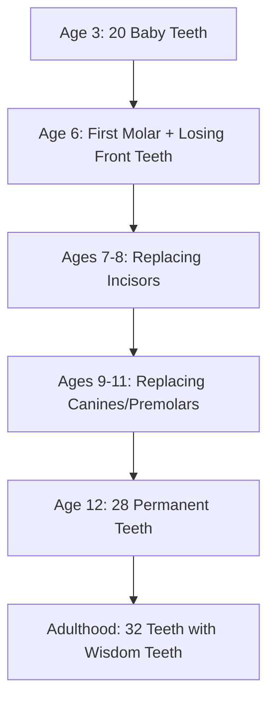

# Body Changes and Physical Systems in Middle Childhood

## Introduction to Body Transformations

Middle childhood brings **dramatic changes in body proportions, internal systems, and physical appearance** that transform children from their "baby" appearance into more adult-like forms. These changes reflect underlying maturation of skeletal, muscular, and organ systems that support the increased physical and cognitive demands of this developmental stage.

:::tip Key Concept
The transformation from "baby fat" to leaner, more proportioned bodies reflects not just fat loss but **fundamental reorganization of body composition** including bone density, muscle mass, and organ system maturation.
:::

---

## Dental Development: From Baby Teeth to Permanent Dentition

### Timeline of Dental Changes

**Primary (Baby) Teeth:**
- **Age 3**: Complete set of **20 primary teeth** present
- **Ages 6-12**: Systematic shedding and replacement occurs
- **Age 12**: All primary teeth typically replaced

**Permanent Teeth:**
- **Age 6**: First permanent molar erupts (behind baby teeth, not replacement)
- **Ages 6-8**: Central and lateral incisors replaced
- **Ages 9-11**: Canines and premolars replaced
- **Age 12**: Second molars erupt  
- **By age 12-13**: **28 permanent teeth** present (excluding wisdom teeth)
- **Adulthood**: Full **32 teeth** when third molars (wisdom teeth) erupt

### The "Toothless Smile" Period

**Characteristics:**
- **Gap-toothed appearance** extremely common ages 6-8
- Children often have **mix of baby and permanent teeth**
- **Size disparity**: Permanent teeth appear disproportionately large initially
- Face shape changes as **permanent teeth are larger** than baby teeth

**Social-Emotional Impact:**
- Source of **pride** ("I'm growing up!")
- May cause **temporary self-consciousness** about appearance
- **Tooth Fairy** tradition provides positive framing in many cultures

### Facial Structure Changes

**Mouth and Jaw:**
- **Lower face elongates** to accommodate larger permanent teeth
- **Jaw widens** and becomes more prominent
- **Chin becomes more defined**
- Overall **facial proportions shift** toward adult appearance

**Clinical Considerations:**
- **Malocclusion** (misaligned bite) often becomes evident during this transition
- **Early orthodontic evaluation** recommended around age 7
- Some issues require **early intervention**, others wait until full permanent dentition

:::info Indian Context
The [Indian Dental Association](https://en.wikipedia.org/wiki/Indian_Dental_Association) recommends first orthodontic screening by age 7, though comprehensive orthodontic treatment typically begins ages 10-14 after most permanent teeth have erupted.
:::

---

## Skeletal Development: Bone Growth and Ossification

### Bone Formation and Growth

**Complete Skeletal Structure:**
- By **middle childhood, all bones are formed**
- **Growth continues** in size and strength, not number
- **Ossification** (bone hardening) proceeds but remains incomplete

**Growth Mechanism:**
- **Growth plates** (epiphyseal plates) at bone ends allow lengthening
- **Bone cells** (osteoblasts) continuously build new bone tissue
- **Calcium deposition** increases bone density and strength

### Calcium Balance and Bone Strength

**Optimal Calcium Levels:**
- Middle childhood bones have **sufficient calcium** for strength
- **Not brittle** (too much calcium) or **too soft** (too little calcium)
- This balance enables **high activity levels** without excessive fracture risk

**Why Children Are Active:**
1. **Strong bones** provide stable skeletal framework
2. **Better anchorage** for muscle attachments
3. **Flexibility** from incomplete ossification allows safe movement
4. **Rapid healing** if minor injuries occur

**Calcium Requirements:**
- Ages 6-11: **1,000-1,300 mg daily** recommended
- Sources: Dairy products, leafy greens, fortified foods
- **Vitamin D** essential for calcium absorption (sunlight exposure, fortified milk)

### Bone Flexibility vs. Adult Bones

**Middle Childhood Advantages:**
- Bones more **flexible than adult bones**
- **Ligaments** less firmly attached, allowing greater joint mobility
- **More space between bones** at joints increases flexibility
- **Can handle pressure** better than mature bones in some ways

**However:**
- **Incomplete ossification** means bones more susceptible to certain fracture types
- **Growth plate injuries** can affect future bone growth if damaged
- Need for **age-appropriate activities** that don't overstress developing skeleton

:::warning Safety Note
While children's bones are flexible, they're still vulnerable to **growth plate injuries** from high-impact or repetitive stress. This is why **age-appropriate sports progression** and proper training techniques are crucial.
:::

### Practical Implications

**Supporting Healthy Bone Development:**
1. **Adequate calcium intake** through diet
2. **Weight-bearing exercise** stimulates bone density
3. **Vitamin D** through sunlight and diet
4. **Avoid excessive impact** on growth plates (overuse injuries)

**Warning Signs:**
- **Persistent bone/joint pain** during or after activity
- **Limping or avoiding use** of a limb
- **Pain that disrupts sleep**
- **Swelling or deformity** at joints

---

## Muscular Development: Strength and Coordination

### Muscle Growth Patterns

**Muscle Fiber Development:**
- **Number of muscle fibers** remains constant from birth
- Growth occurs through **muscle fiber enlargement** (hypertrophy)
- **Strength increases** as muscles grow in size
- Ages 6-12: **Strength capabilities approximately double**

**Sex Differences in Muscle Development:**

**Girls (Ages 7-8 onward):**
- Begin gaining **more fat than muscle** on arms, legs, trunk
- **Fat accumulation** prepares body for pubertal changes
- Overall **smoother, rounder appearance**
- Less visible muscle definition

**Boys (Ages 7-8 onward):**
- Gain **more muscle than fat** throughout middle childhood
- **Greater muscle mass** provides strength advantage
- More **visible muscle definition**
- Can generally run longer, jump higher, exhibit greater strength

### Why Boys Appear Stronger

**Biological Factors:**

1. **Greater Muscle-to-Fat Ratio**: Boys have proportionally more muscle tissue
2. **Testosterone Influence**: Even pre-puberty, boys have slightly higher testosterone levels
3. **Body Composition**: Lower body fat percentage means less weight to move
4. **Skeletal Muscle Distribution**: Muscle concentrated in areas advantageous for power activities

**Performance Implications:**
- Boys typically show advantages in **strength and power** activities
- Girls often show advantages in **flexibility and fine motor control**
- **Individual variation** within each sex exceeds average differences between sexes
- **Training and practice** can substantially modify performance regardless of sex

:::info Important Note
While average differences exist, **individual variation is enormous**. Many girls exceed average boys in strength, and many boys exceed average girls in flexibility. Avoid stereotyping individual children based on group averages.
:::

### Fat Distribution and Body Composition

**Overall Patterns:**
- Body fat accounts for approximately **15% of total body weight** in average school-age child
- Girls retain **slightly more fat** than boys even at age 6
- Ages 7-11: **Even fat accumulation rate** in both sexes absent eating differences
- **Puberty onset** dramatically changes fat distribution patterns

**Regional Fat Distribution:**
- **Subcutaneous fat** (under skin) decreases in face, producing more angular features
- **Trunk fat** maintained for energy reserves
- **Extremity fat** generally minimal, making muscles more visible

---

## Body Proportions: From Child to Pre-Adolescent

### Head-to-Body Ratio Changes

**Developmental Progression:**
- **Newborn**: Head is 1/4 of total body length
- **Age 6-8**: Head approximately 1/6 of body length
- **Age 12**: Approaching 1/8 of body length (adult ratio)

**Mechanism:**
- Head grows **slowly** compared to trunk and limbs
- **Extremities grow fastest**: arms and legs show most dramatic lengthening
- Result: Head becomes **proportionally smaller** relative to body

### Limb and Trunk Development

**Growth Patterns:**

**Extremities (Arms and Legs):**
- Show **disproportionately rapid growth**
- Arms and legs become **longer and thinner**
- **No muscle development** initially makes them appear stick-like
- **Hands and feet** grow slowly; generally **longer in boys**

**Trunk:**
- **Elongates and slims**
- Rounded abdomen of early childhood **flattens**
- **Chest broadens and flattens**, improving respiratory efficiency
- **Shoulders drop** as neck lengthens

### Facial Changes

**Transformation:**
- **Disproportion of large head** decreases
- **Lower face size increases** relative to upper face
- **Permanent teeth** change mouth shape significantly
- **Face narrows and slims** - "baby face" disappears
- **Neck lengthens**, allowing better head mobility

**Contributing Factors:**
- Permanent teeth **larger** than baby teeth
- **Jaw expands** to accommodate adult dentition
- **Facial muscles** become more defined
- **Subcutaneous fat** decreases in cheeks

### Posture Improvements

**Early Childhood Posture Issues:**
- **Rounded shoulders**
- **Slight spinal curvature** (lordosis)
- **Prominent abdomen** (potbelly)
- **Waddling gait**

**Middle Childhood Improvements:**
- **Shoulders straighten**
- **Spine straightens** toward adult alignment
- **Abdomen flattens** with muscle strengthening
- **More erect bearing** overall
- **Efficient arm and leg use** in movement

**Causes of Improvement:**
- **Core muscle strengthening**
- **Better balance** from vestibular system maturation
- **Skeletal maturation** providing better structural support
- **Reduced fat** in abdominal region

---

## Internal System Maturation

### Cardiovascular System

**Heart Development:**
- Heart grows **more slowly** during school years than other periods
- **Proportionally smallest** relative to body size of entire lifespan
- Resting heart rate **gradually decreases**: 90-100 bpm at age 6 → 70-80 bpm at age 12
- **Cardiac output** increases with heart chamber enlargement

**Blood Pressure:**
- **Systolic pressure** gradually increases with age
- Age 6: ~95/65 mmHg → Age 12: ~110/70 mmHg
- Individual variation considerable based on activity, genetics, nutrition

**Clinical Significance:**
- Small heart size means **less cardiovascular reserve** than adolescents/adults
- Children **fatigue more quickly** in sustained aerobic activities
- **Recovery** from exertion generally faster due to metabolic efficiency

### Respiratory System

**Lung Development:**
- Lungs continue growing until approximately **age 8**
- **Respiratory airways** continue developing into adolescence
- **Lung capacity** progressively increases
- **Respiratory rate** decreases: 20-30 breaths/min at age 6 → 16-20 breaths/min at age 12

**Functional Implications:**
- **Greater oxygen uptake** capacity with age
- **More efficient gas exchange**
- **Better endurance** for physical activities
- **Fewer respiratory infections** as airways mature

### Gastrointestinal System

**Maturation:**
- **Quite mature** by school age
- **Stomach capacity** increases substantially
- **More stable blood sugar** levels between meals
- **Fewer stomach upsets** compared to preschoolers

**Eating Patterns:**
- **Appetite increases** after age 6
- Can consume **larger meals** less frequently
- **Digestion more efficient**, nutrients better absorbed
- **Less sensitive** to dietary changes

**Challenges:**
- **Risk of overeating** and obesity increases
- **Junk food appeal** high with exposure to marketing
- **Family eating patterns** strongly influence long-term habits

### Urinary and Elimination Systems

**Bowel and Bladder Control:**
- **Well established** by school years
- **Nighttime continence** achieved in most children by age 6
- **Ability to delay** urination/defecation for extended periods
- **Social awareness** of appropriate times and places

**Exceptions:**
- **Enuresis** (bedwetting) persists in 5-10% of 6-7 year olds
- Usually resolves spontaneously; rarely indicates pathology
- **Stress-related regression** possible during major life changes

### Sensory Systems

**Visual System:**
- **Eyes not yet final shape/size** until ages 8-10
- Ages 6-8: Many children slightly **farsighted** (hyperopia)
- Self-corrects as **eyes reach adult size and shape**
- **Binocular vision** (both eyes working together) well-established by age 6

**Implication for Reading:**
- **Large print** recommended for early reading materials (ages 6-7)
- **Reading best delayed** until approximately age 6 when vision matures
- By age 8-10, most children can handle **standard print sizes**

**Auditory System:**
- **Ear and hearing well-developed** by school age
- **Auditory sensitivity** continues improving throughout middle childhood
- Better **sound discrimination** and **speech perception**
- Improved ability to **filter relevant sounds** from background noise

### Nervous System

**Brain Development:**
- **90% of adult brain weight** achieved by age 6-7
- **Essentially complete** by age 10-12 in terms of size
- **Myelination** continues, improving processing speed
- **Synaptic pruning** refines neural networks

**Functional Improvements:**
- **Reaction time** decreases (faster responses)
- **Processing speed** increases
- **Executive functions** (planning, inhibition) improve
- **Coordination** between brain regions enhances

---

## Summary of Physical Development

### Key Physical Changes Ages 6-12

**Growth Patterns:**
- **Slow, steady growth**: 2-2.5 inches height, 3-6 pounds weight annually
- **Girls slightly taller/heavier** than boys ages 9-12 during early growth spurt
- **Growth concentrated** in legs, arms, and face
- **Individual variation** high; each child follows unique trajectory

**Body Composition:**
- **Loss of baby fat**: Faces and bodies become leaner, more angular
- **Muscle mass increases**: Doubles in capability from age 6 to 12
- **Body proportions shift**: Head becomes proportionally smaller
- **Posture improves**: Erect bearing replaces toddler slouch

**Dental Changes:**
- **Baby teeth replaced** by permanent teeth (20 → 28 teeth by age 12)
- **"Toothless smile" period** ages 6-8 common
- **Facial structure changes** to accommodate larger permanent teeth

**System Maturation:**
- **All sensory systems mature**
- **Heart and lungs** continue developing
- **Brain growth essentially complete** by age 11-12
- **Bones and muscles** strengthen with activity

---

## External Resources

### Educational Videos

1. **"Body Systems: Skeletal and Muscular" - Crash Course Kids**  
   [YouTube Link](https://www.youtube.com/watch?v=9lo66Mbs6oE)  
   Engaging explanation of skeletal and muscular system basics

2. **"How Your Body Changes from Ages 5-12" - KidsHealth**  
   [YouTube Link](https://www.youtube.com/watch?v=8eKZsQN3Hfo)  
   Overview of physical changes during middle childhood

### Research Articles

1. **Baxter-Jones, A. D., et al. (2023). "Body Composition in Middle Childhood"**  
   *International Journal of Obesity*  
   Comprehensive analysis of body composition changes ages 6-11

2. **Sherar, L. B., et al. (2024). "Skeletal Maturation During Childhood"**  
   *Bone*  
   Contemporary understanding of bone development and ossification patterns

### Wikipedia Resources

1. [Human Tooth Development](https://en.wikipedia.org/wiki/Human_tooth_development)  
2. [Ossification](https://en.wikipedia.org/wiki/Ossification)  
3. [Body Proportions](https://en.wikipedia.org/wiki/Body_proportions)

---

## Self-Assessment Questions

### Question 1
By middle childhood, how many teeth does a child typically have (excluding wisdom teeth)?

A) 20 teeth  
B) 24 teeth  
C) 28 teeth  
D) 32 teeth

Click to reveal answer

**Answer: C) 28 teeth**

**Explanation:** By age 12-13, children typically have **28 permanent teeth** (excluding the 4 wisdom teeth that erupt later). At age 3, they had 20 baby teeth. The transition from 20 primary to 28 permanent teeth occurs throughout middle childhood.

### Question 2
What is the head-to-body proportion ratio during middle childhood (ages 6-8)?

A) 1/4 (head is 1/4 of body length)  
B) 1/6 (head is 1/6 of body length)  
C) 1/8 (head is 1/8 of body length)  
D) 1/10 (head is 1/10 of body length)

Click to reveal answer

**Answer: B) 1/6 (head is 1/6 of body length)**

**Explanation:** The head-to-body ratio shifts from **1/4 at birth** to **1/6 during middle childhood** (ages 6-8), approaching **1/8 in adulthood**. This change reflects the faster growth of trunk and extremities compared to the head.

### Question 3
Why are boys generally stronger than girls during middle childhood?

A) They have more bones  
B) They have more muscle mass relative to fat  
C) They have more calcium in their bones  
D) They practice physical activities more

Click to reveal answer

**Answer: B) They have more muscle mass relative to fat**

**Explanation:** Beginning around ages 7-8, **boys accumulate more muscle than fat** while **girls accumulate more fat than muscle**. This greater muscle-to-fat ratio gives boys advantages in strength and power activities. However, individual variation within each sex exceeds average differences between sexes.

### Question 4
At what age are the lungs considered to have completed their primary growth?

A) Age 4  
B) Age 6  
C) Age 8  
D) Age 12

Click to reveal answer

**Answer: C) Age 8**

**Explanation:** **Lungs continue growing until approximately age 8**, though respiratory airways continue developing into adolescence. This maturation supports increased lung capacity, decreased respiratory rate, and improved endurance for physical activities.

### Question 5
Which body system is proportionally SMALLEST relative to body size during middle childhood?

A) Brain  
B) Heart  
C) Lungs  
D) Liver

Click to reveal answer

**Answer: B) Heart**

**Explanation:** The **heart grows more slowly during school years** than other body systems and is **proportionally smallest relative to body size** of any period across the entire lifespan. This smaller heart size means children have less cardiovascular reserve and fatigue more quickly in sustained aerobic activities compared to adolescents and adults.

---

## Memory Aids

### TEETH Timeline Mnemonic

**"Twenty Tiny Teeth Transform To Twenty-Eight"**

- **Twenty** baby teeth by age 3
- **Tiny** teeth begin falling out at age 6
- **Teeth** (first permanent molars) arrive at age 6 behind baby teeth
- **Transform** period ages 6-12 as baby teeth replaced
- **To** age 12-13 when transformation complete
- **Twenty-Eight** permanent teeth present (excluding wisdom teeth)

### Body Proportion Rule: "Quarter-Sixth-Eighth"

**Head-to-Body Ratios:**
- **Birth**: 1/4 (quarter)
- **Age 6-8**: 1/6 (sixth)
- **Adulthood**: 1/8 (eighth)

Remember: The head becomes **proportionally smaller** as the body grows faster than the head throughout development.

### Physical Systems CLIMB Mnemonic

Remember what systems are maturing during middle childhood:

- **C**ardiovascular (heart rate decreasing, blood pressure increasing)
- **L**ungs (continue growing until age 8)
- **I**ntestinal/GI (mature, stable blood sugar, larger stomach)
- **M**uscular (strength doubles ages 6-12)
- **B**rain (90% adult weight by age 6, complete by 10-12)

---

## Source PDF

**Source PDFs:**  
📄 [Block-2/Unit-1.pdf - Pages 5-18](/pdfs/MPC-002%20Life%20Span%20Psychology/Block-2/Unit-1.pdf)  
📚 MPC-002 Life Span Psychology
