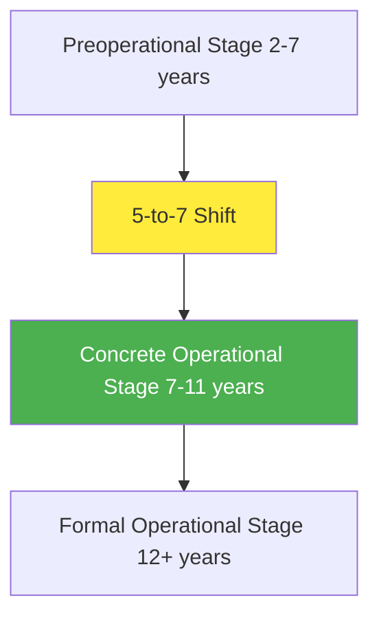

# Cognitive Development in Middle Childhood (6-11 Years)

## Introduction: The 5-to-7 Shift

Between ages 5 and 7, children's thinking undergoes **dramatic transformation** often called the **"5-to-7 shift"** - a cognitive transition from preoperational thought to logical reasoning. This period marks when children move from intuitive, perception-based thinking to systematic, logical problem-solving.

:::tip Historical Note
In medieval times, children were assigned **adult status at age 7**, considered capable of independence from mothers or nannies (Aries, 1962). This recognition reflects the profound cognitive changes occurring at this age.
:::

### Neurological Foundations

**Brain Development Supporting the Shift:**
- **Cross-modal zones** (nerve networks connecting brain regions) develop between ages 5-6
- These interconnections enable **integration of sensory information**
- Example: Children associate oranges with color, smell, flavor, and spelling simultaneously
- **Reciprocal relationship**: Brain maturation supports cognitive changes; cognitive activity accelerates brain maturation

---

## Piaget's Concrete Operational Stage

### Overview of Concrete Operations

**Concrete operational stage** (ages 7-11) is Piaget's third cognitive developmental stage, characterized by the ability to think **logically about concrete, real-world events**. 

:::info Key Definition
**Operations** are flexible mental actions that can be combined to solve problems - essentially "powerful rules that transform information from one form to another."
:::

**Characteristics:**
- **Logical thinking** about tangible objects and observable events
- **Systematic problem-solving** using rules and operations
- **Mathematical operations**: identity, addition, subtraction, multiplication
- **Relational thinking**: class inclusion, seriation, transitivity

**Limitation:**
Operations remain **"concrete"** - limited to physical objects and observable situations. **Abstract concepts** remain difficult until formal operational stage (age 12+).



---

## Decentration: Multi-Dimensional Thinking

### Understanding Decentration

**Decentration** is one of the most significant cognitive achievements of middle childhood - the ability to consider **multiple aspects of a situation simultaneously**.

**Classic Demonstration:**
Show children a picture of **7 people: 2 adults, 5 children**. Ask: "Are there more children or more people?"

**Responses:**
- **4-year-olds (preoperational)**: "More children" - can focus on only ONE dimension (child vs. adult)
- **9-year-olds (concrete operational)**: "More people" - recognize BOTH children and adults are people

### Hierarchical Thinking

Concrete operational children organize the world into **hierarchies** where objects can exist on multiple dimensions:

**Example Hierarchy:**
```
People (superordinate category)
├── Adults (subordinate)
└── Children (subordinate)
```

Children understand that:
- All children are people
- All adults are people  
- The category "people" is **larger** than either subcategory
- Same entity can belong to **multiple classifications** simultaneously

---

## Conservation Tasks

### Understanding Conservation

**Conservation** refers to understanding that certain properties remain constant despite changes in appearance. Concrete operational children recognize that **physical transformations don't alter fundamental quantities**.

### Types of Conservation and Developmental Sequence

Conservation abilities follow a **predictable developmental sequence** called **horizontal décalage** (sequential mastery within one stage):

| Conservation Type | Age Mastered | What's Conserved | Typical Task |
|-------------------|--------------|------------------|--------------|
| **Number** | 6-7 years | Quantity of items | Rearranging coins in different spacing |
| **Substance/Mass** | 7-8 years | Amount of material | Reshaping clay ball into snake |
| **Length** | 7-8 years | Distance | Moving one stick while keeping parallel |
| **Area** | 8-9 years | Surface space | Rearranging blocks on cardboard |
| **Weight** | 9-10 years | Heaviness | Changing shape of object |
| **Volume** | 14-15 years | Displacement | Changing shape of submerged object |

:::info Horizontal Décalage
**Horizontal décalage** (French: "to displace") refers to the sequential mastery of different conservation concepts within the same developmental stage. Children don't master all conservation types simultaneously.
:::

### Three Key Principles Supporting Conservation

**1. Identity**
- If **nothing added or removed**, quantity remains the same
- Example: "It's still the same clay, just a different shape"

**2. Reversibility**
- Changes can be **mentally reversed** to original state
- Example: "If I roll the snake back into a ball, it will be the same"

**3. Reciprocity**
- If mass constant, **one dimension changes = another compensates**
- Example: "The snake is longer but thinner, so it balances out"

### Impact of Conservation on Children's Confidence

Mastering conservation provides children with:
- **Stability and security** in judgments
- **Confidence** to trust reasoning over perception
- **Independence** from misleading appearances

**Anecdote:**
Piaget tried convincing a 7-year-old that tall glass contained more water. Her response: "She's just silly, that's all" - demonstrating the **certainty** conservation mastery provides.

---

## Logical Reasoning Development

### Inductive Reasoning

**Inductive reasoning** (reasoning from specific observations to general principles) emerges during concrete operations:

**Applications:**
- **Learning rules**: From examples to general patterns
- **Social understanding**: From individual interactions to social norms
- **Empathy foundation**: Understanding others' feelings from specific situations

**Example:**
- Observation: "Every time I share, my friend smiles"
- Induction: "Sharing makes people happy"

### Conditional Reasoning ("If-Then" Logic)

**Developmental Progression:**
- **Grades 3-5**: Major advances in understanding "if-then" conditions
- **Grade 8 to college**: Distinguishing "if" from "if and only if" statements

**Example Progression:**
- **Early**: "If it rains, the ground gets wet" (simple conditional)
- **Later**: "If and only if it rains, will the ground be wet" (biconditional - recognizes sprinklers)

### Limitation: Deductive Logic

**Deductive reasoning** (general principles to specific conclusions) does NOT appear until **formal operations** (age 12+). School-age children struggle with:
- Abstract hypothetical reasoning
- "What if" scenarios beyond concrete experience
- Syllogistic logic with unfamiliar content

---

## Concept Formation in Middle Childhood

### Number Concepts

**Age 6-7 Achievements:**
- **One-to-one correspondence** mastery
- Understanding **number constancy**: 6 = 5+1 = 9-3 = six stars
- **Basic arithmetic operations** with concrete objects
- **Place value** beginning to emerge

### Time Concepts

**Before Age 8:**
- Difficulty **sequencing events** temporally
- **Time units** (minutes, hours, years) have little meaning
- Past/future concepts vague and imprecise

**After Age 8:**
- **Precise understanding** of time passage
- Can **classify events** by recency accurately
- **Clock reading** and time measurement skills

### Spatial Operations

**Challenges:**
- **Before school age**: Don't comprehend distance units (miles, kilometers)
- **Young school-age**: Lose spatial sense in unfamiliar environments
- **Even age 10**: Struggle creating cognitive maps for giving directions

**Developmental Progression:**
- **Ages 6-8**: Navigate familiar spaces (home, school)
- **Ages 9-11**: Draw maps of explored areas
- **Ages 11+**: Create cognitive maps of new environments

### Classification Skills

**Class Inclusion** (understanding hierarchical categories):
- **Age 6-7**: Recognize objects belong to multiple categories
- **Example**: "Roses are flowers, and flowers are plants"

**Multiplication of Classes**:
- **Age 7-8**: Sort objects by **two dimensions simultaneously**
- **Example**: Cutouts by **shape AND color** (red circles, blue squares, etc.)

### Seriation

**Definition**: Sequencing objects along measurable dimensions (size, weight, brightness)

**Developmental Achievement:**
- Creates **ordered sequences**: smallest to largest
- Understands **transitive relations**: If A>B and B>C, then A>C
- Foundation for **number line** understanding

---

## Information Processing Approach

### Attention Development

**Improvements:**
- **Selective attention**: Focus on relevant information, ignore distractions
- **Sustained attention**: Maintain focus for longer periods
- **Divided attention**: Handle multiple tasks (though limited)

**Key Factor: Interest**
- Children **remember interesting content** with less attention allocation
- Interest is **high attention-getter** for learning

### Perception Advancements

**Figure-Ground Alternation:**
- Cannot spontaneously alternate perspectives until **ages 10-11**
- Requires **reversibility** concept
- **Embedded Figures Test**: Older children search systematically; younger children look randomly

**Visual Search Strategies:**
- **Below ages 6-7**: Quick, random scanning
- **Ages 8+**: Thorough, systematic visual search

### Memory Capacity and Strategies

**Working Memory:**
- School-age children **hold more information** in memory than younger children
- Better **mental organization** of material

**Memory Strategies:**

**1. Rehearsal**
- Occurs **more spontaneously** during school years
- **More efficiently** applied with age
- Verbal repetition to maintain information

**2. Organization**
- **Categorizing** related items improves recall
- Grouping by **semantic categories** (animals, toys, food)

**3. Elaboration**
- **Changing information form** to make meaningful
- **Creating associations** between items
- **Visual imagery** to encode information

**Metamemory:**
- **Awareness of own memory** develops
- Understanding **what helps remembering**
- **Strategy selection** based on task demands

---

## Language Development

### Vocabulary Expansion

**School Years (6-12):**
- **Continued vocabulary growth**
- Training in **word relationships** accelerates learning
- Understanding **common word structures** (prefixes, suffixes)
- **Context clues** for inferring meanings

**Common Errors:**
- Still make mistakes but **enjoy language play**
- Overgeneralizations decrease
- **Humor appreciation** increases

### Grammar Refinement

**Ages 6-7:**
- Confused by **irrelevant information** in sentences
- Struggle with **complex constructions**
- **Implied meanings** difficult

**Ages 8-11:**
- Better understanding of **sentence structure**
- Handle **embedded clauses** and complex grammar
- **Passive voice** comprehension improves

### Communication Effectiveness

**Advances:**
- **Asking for clarification** when confused
- **Persuading others** more effectively
- **Listener awareness**: adapting message to audience
- **Enhanced vocabulary** supporting precision

**Link to Behavior:**
- Children with **language difficulties** more likely to show **aggressive behavior**
- Need to express themselves verbally OR physically

---

## External Resources

### Educational Videos

1. **"Piaget's Concrete Operational Stage" - Khan Academy**  
   [YouTube Link](https://www.youtube.com/watch?v=oKdgB7Y46C8)  
   Clear explanation with conservation demonstrations

2. **"Cognitive Development Ages 7-11" - Child Development Institute**  
   [YouTube Link](https://www.youtube.com/watch?v=7DJn5cxfZk0)  
   Overview of thinking changes in middle childhood

### Research Articles

1. **Siegler, R. S. (2023). "Cognitive Variability in Middle Childhood"**  
   *Cognitive Development*  
   Contemporary understanding of thinking flexibility

2. **Bjorklund, D. F. (2024). "Memory Development: A Process Approach"**  
   *Child Development Perspectives*  
   Information processing advances ages 6-11

### Wikipedia Resources

1. [Piaget's Theory of Cognitive Development](https://en.wikipedia.org/wiki/Piaget%27s_theory_of_cognitive_development)  
2. [Conservation (Piaget)](https://en.wikipedia.org/wiki/Conservation_(psychology))  
3. [Working Memory](https://en.wikipedia.org/wiki/Working_memory)

---

## Self-Assessment Questions

### Question 1
What is "horizontal décalage" in Piaget's theory?

A) The shift from preoperational to concrete operational thinking  
B) Sequential mastery of different conservation concepts within one stage  
C) The inability to reverse mental operations  
D) Thinking about multiple dimensions simultaneously

<details>
<summary>Click to reveal answer</summary>

**Answer: B) Sequential mastery of different conservation concepts within one stage**

**Explanation:** **Horizontal décalage** (French: "to displace") refers to the observation that children don't master all types of conservation simultaneously. They typically master **number conservation** (6-7 years) before **weight** (9-10 years) and **volume** (14-15 years), even though all are conservation tasks requiring the same underlying logical principles.
</details>

### Question 2
Which principle explains that if clay is rolled into a snake, it can be rolled back into a ball?

A) Identity  
B) Reversibility  
C) Reciprocity  
D) Decentration

<details>
<summary>Click to reveal answer</summary>

**Answer: B) Reversibility**

**Explanation:** **Reversibility** is the understanding that transformations can be mentally reversed to return to the original state. This principle is crucial for conservation - children recognize that the clay snake can be rolled back into a ball, proving the amount hasn't changed despite the shape transformation.
</details>

### Question 3
At what age can most children understand "if-then" conditional logic?

A) Ages 4-5 (preoperational)  
B) Ages 6-7 (early concrete operations)  
C) Between grades 3-5 (ages 8-10)  
D) Not until formal operations (age 12+)

<details>
<summary>Click to reveal answer</summary>

**Answer: C) Between grades 3-5 (ages 8-10)**

**Explanation:** Major advances in understanding **"if-then" conditional logic** occur between **grades 3-5** (ages 8-10) during concrete operations. Further refinement continues through grade 8 to college, when students learn to distinguish "if" from "if and only if" statements. Basic conditional reasoning emerges in middle childhood, though complex hypothetical reasoning awaits formal operations.
</details>

### Question 4
What memory strategy involves creating associations and visual imagery?

A) Rehearsal  
B) Organization  
C) Elaboration  
D) Metamemory

<details>
<summary>Click to reveal answer</summary>

**Answer: C) Elaboration**

**Explanation:** **Elaboration** is a memory strategy where children transform information by creating meaningful associations, linking it to prior knowledge, and using visual imagery. This is more sophisticated than simple rehearsal (repetition) or organization (categorizing). Elaboration typically emerges during middle childhood as children's cognitive abilities mature.
</details>

### Question 5
Why can 9-year-olds answer "more people" when shown 2 adults and 5 children, while 4-year-olds say "more children"?

A) 9-year-olds have better counting skills  
B) 9-year-olds can decenter and consider multiple classifications  
C) 4-year-olds don't understand the word "people"  
D) 4-year-olds are being deliberately contrary

<details>
<summary>Click to reveal answer</summary>

**Answer: B) 9-year-olds can decenter and consider multiple classifications**

**Explanation:** This demonstrates **decentration** - the ability to consider multiple dimensions simultaneously. 4-year-olds (preoperational) focus on ONE dimension (child vs. adult), while 9-year-olds (concrete operational) recognize objects belong to MULTIPLE hierarchical categories: both children AND adults are people, so "people" is the larger category.
</details>

---

## Memory Aids

### Conservation Sequence: "Number-Mass-Weight-Volume"

Remember conservation mastery order:
- **N**umber (6-7 years) - "**N**ow I can count!"
- **M**ass/Length (7-8) - "**M**ore to learn"
- **W**eight (9-10) - "**W**aiting a bit"
- **V**olume (14-15) - "**V**ery last!"

### Three Conservation Principles: "I-R-R"

- **I**dentity: If nothing added/removed, amount stays same
- **R**eversibility: Can mentally reverse changes
- **R**eciprocity: One dimension changes, another compensates

### Information Processing: "A-P-M"

Three areas improving during concrete operations:
- **A**ttention: Selective, sustained focus
- **P**erception: Systematic visual search  
- **M**emory: Strategies (rehearsal, organization, elaboration)

---

## Source PDF

**Source PDFs:**  
📄 [Block-2/Unit-2.pdf - Pages 19-34](/pdfs/MPC-002%20Life%20Span%20Psychology/Block-2/Unit-2.pdf)  
📚 MPC-002 Life Span Psychology
