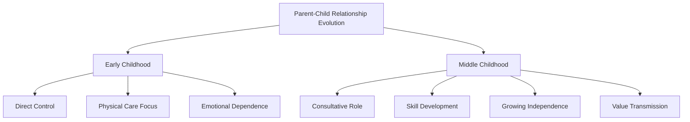
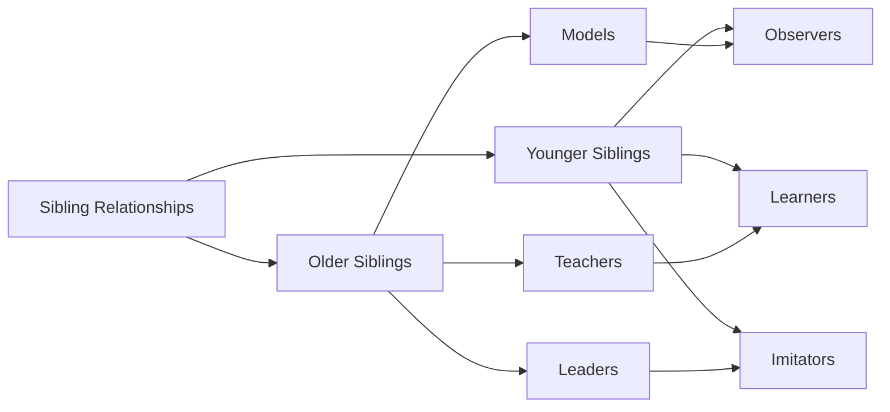
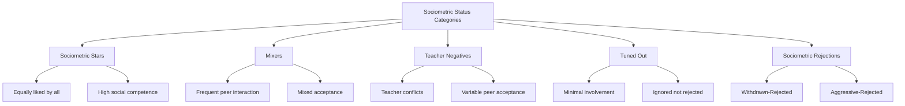
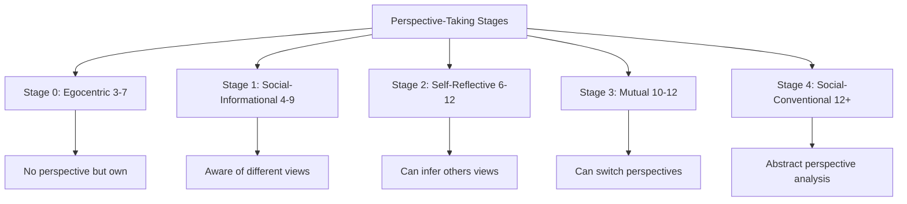
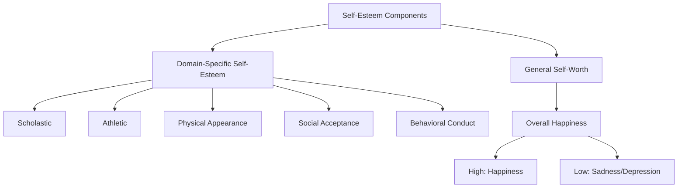

# Social Development in Middle Childhood

## Introduction

The social world of middle childhood expands dramatically, shifting from the family-centered universe of early childhood to include increasingly important relationships with peers, teachers, and other adults. As children move through ages 6 to 11, they develop sophisticated social skills, navigate complex peer relationships, and begin forming independent identities within their social contexts. This developmental period represents a critical transition as children balance the security of family attachments with the excitement and challenges of wider social participation.

## Parent-Child and Sibling Relationships

### Evolution of Family Dynamics

As children progress through middle childhood, the nature of parent-child relationships undergoes significant transformation. Children increasingly desire autonomy and independence while still requiring parental guidance and support. This developmental tension creates both opportunities and challenges for families.

**Key Changes in Family Relationships:**

- **Increased Time with Peers**: School-age children naturally gravitate toward spending more time with friends and less time with family members, reflecting their expanding social horizons
- **Shift in Authority Figures**: Teachers and other adults outside the family gain importance, though parents remain primary influences on values and behavior
- **Growing Decision-Making Autonomy**: Children want to make more of their own decisions, from choosing clothes to selecting activities
- **Negotiation vs. Emotional Outbursts**: Middle childhood brings more sophisticated communication patterns, with children often negotiating for privileges rather than having tantrums

### Parenting Styles and Child Outcomes

Research consistently demonstrates the profound impact of parenting approaches on children's development during middle childhood. The work of Diana Baumrind (1971) identified several parenting styles that differentially affect children's social and emotional development:

**Authoritative Parenting** (high warmth, high control):
- Children show higher self-confidence and competence
- Better academic achievement and social skills
- Greater resilience when facing challenges

**Authoritarian Parenting** (low warmth, high control):
- Children may exhibit more anxiety and fear
- Lower self-esteem and independence
- Compliance based on fear rather than understanding

**Permissive Parenting** (high warmth, low control):
- Children may struggle with self-discipline
- Difficulty respecting boundaries and authority
- Potential challenges with responsibility

Grolnick and Ryan (1989) found that children whose parents belittle them and communicate doubts about their abilities experience more failures, less achievement in school, and greater loss of self-esteem compared to those with supportive parents. Parental faith in children's competence and resilience serves as a protective factor, helping children recover more quickly from setbacks.

### Responsibility and Skill Development

The middle childhood years represent an optimal time for children to assume increased responsibilities both at home and in other settings. These experiences contribute significantly to development across multiple domains:

**Benefits of Household Responsibilities:**

1. **Skill Development**: Learning practical life skills and task management
2. **Self-Confidence**: Experiencing mastery and competence through successful completion of tasks
3. **Family Contribution**: Understanding one's role in family functioning
4. **Maturity and Nurturing**: Research shows children with household responsibilities behave in more nurturing, helpful, and mature ways than those without such demands (Baumrind, 1971)

### Parent Preferences and Gender Differences

Research reveals interesting patterns in how children relate to their parents during middle childhood:

- **Mothers as Preferred Companions**: Children typically spend more time with and confide more in mothers during this period
- **Father's Role**: Fathers tend to encourage independence and assertiveness, preparing children for competitive and achievement-oriented situations
- **Mother's Focus**: Mothers typically emphasize interpersonal skills, empathy, and relationship maintenance
- **Complementary Functions**: Both parental roles contribute uniquely to children's social development

### Sibling Relationships

Sibling relationships assume particular significance during middle childhood, serving as training grounds for social interaction and emotional regulation:

**Functions of Sibling Relationships:**

- **Teaching and Learning**: Siblings serve as teachers and learners for each other, with older siblings modeling behaviors and younger siblings practicing skills
- **Social Skill Practice**: Siblings provide safe contexts for expressing and managing emotions including gratitude, annoyance, surprise, and fear
- **Modeling and Emulation**: Younger siblings frequently emulate older siblings, learning behaviors, attitudes, and social strategies
- **Conflict Resolution**: Sibling interactions teach negotiation, compromise, and conflict management

## Peer Groups and Social Dynamics

### Nature and Structure of Peer Groups

A peer group consists of children of approximately the same age who interact regularly and view themselves as belonging together. During middle childhood, peer groups evolve from loose associations to more structured social entities:

**Developmental Progression of Peer Groups:**

**Ages 6-9:**
- Small, loosely organized groups
- Membership changes frequently
- Limited structure or formal rules
- Same-sex groupings begin to predominate

**Ages 9-12:**
- More structured and formalized groups
- Increased exclusivity and cohesiveness
- Clear status hierarchies among members
- Strong same-sex preferences
- Established group norms and expectations

### Peer Group Functions

Peer groups serve multiple crucial functions in children's social development:

1. **Socialization Agents**: Peers transmit information about attitudes, values, and cultural norms
2. **Behavioral Models**: Children observe and imitate peer behaviors, learning social strategies
3. **Reinforcement Systems**: Peers provide approval or disapproval, shaping behavior patterns
4. **Identity Formation**: Group membership contributes to developing sense of self
5. **Belonging and Security**: Groups provide social connection and emotional support

### Gender Differences in Peer Interaction

Research reveals systematic differences in how boys and girls navigate peer relationships:

**Girls' Patterns:**
- Prefer cooperation as conflict resolution strategy (Crick & Ladd, 1990)
- Smaller, more intimate friendship groups
- Greater emphasis on emotional sharing and support
- More verbal communication and relationship maintenance

**Boys' Patterns:**
- Favor competition in conflict situations
- Larger, more loosely organized groups
- Activity-based friendships (sports, games)
- Greater emphasis on hierarchy and status

### Conformity and Peer Influence

Conformity serves as the foundation of peer group structure during middle childhood. Children in this developmental period highly value peer opinions, sometimes even more than adult views. This conformity reflects:

- **Social Acceptance Needs**: Desire to belong and be accepted by peers
- **Moral Development**: Consciousness of rules and being viewed as "good"
- **Identity Formation**: Exploring and establishing sense of self through group membership
- **Cultural Learning**: Understanding social norms and expectations

**Cross-Cultural Perspectives:**

Bronfenbrenner's (1970) research demonstrated that peer group tendencies vary across cultures. While American peer groups often support values that differ from adult culture, Soviet Union peer groups (at that time) actively reinforced and supported adult cultural values. This suggests peer influence patterns depend significantly on broader socialization experiences rather than being developmentally inevitable.

### Social Status and Peer Acceptance

Children's sociometric status—their level of acceptance or rejection by peers—significantly impacts their development and well-being. Gottman's (1977) in-depth study of 113 children identified five distinct social status categories:

**Social Competence Factors:**

Children achieve peer acceptance through social competence, reflected in:
- **Social Awareness**: Ability to sense what's happening in social groups
- **Responsiveness**: High degree of responsiveness to others' needs and feelings
- **Relationship Understanding**: Recognition that relationships develop gradually over time
- **Communication Skills**: Effective verbal and nonverbal communication
- **Empathy**: Understanding others' perspectives and emotions

**Rejected Children:**

Two distinct subtypes emerge:
1. **Withdrawn-Rejected**: Socially incompetent, anxious, lacking social skills
2. **Aggressive-Rejected**: Overly aggressive, poor impulse control, violate social norms

### Friendship Development

Friendship during middle childhood represents more than casual association. Selman (1980) describes a developmental progression in children's understanding of friendship:

**Developmental Stages:**

1. **Playmates (3-7 years)**: Friends are those who play together
2. **Assistants (4-9 years)**: Friends help each other
3. **Cooperators (6-12 years)**: Friends cooperate, share goals and procedures, make compromises
4. **Intimates and Mutual Supporters (9-15 years)**: Friends share goals and values, provide intimacy and support; strong friendships survive disagreements
5. **Dependent but Autonomous (12+ years)**: Adult-like understanding of mutual dependence paired with maintaining individuality

**Characteristics of Middle Childhood Friendships:**

- **Not Yet Fully Reciprocal**: Friendships seen as "people who do things for each other"
- **Same-Sex Preference**: Strong tendency toward same-gender friendships
- **Activity-Based**: Friendships often centered around shared activities
- **Cooperative Emphasis**: Growing understanding of cooperation and compromise
- **Concrete Understanding**: Focus on observable behaviors rather than abstract qualities

## Social Cognition Development

Social cognition refers to children's understanding of other people's thoughts, feelings, motives, and intentions. This dimension of cognitive development profoundly impacts social interactions and relationships.

### Perspective-Taking Development

Selman's (1980) stage model describes children's developing ability to understand and articulate others' viewpoints:

**Stage Descriptions:**

1. **Egocentric (3-7 years)**: "There is no other perspective but mine. People feel the way I would in a situation."

2. **Social-Informational (4-9 years)**: "Others have a point of view, but they would feel the way I do; I'm aware but don't fully understand."

3. **Self-Reflective (6-12 years)**: "We can have different points of view. I can see mine, they can see theirs."

4. **Mutual (10-12 years)**: "I can see their perspective and they can see mine; we can coordinate viewpoints."

5. **Social and Conventional (12-adulthood)**: "I can analyze perspectives in abstract terms, considering cultural and societal contexts."

### Emotional Understanding

Middle childhood brings enhanced ability to:
- **Recognize Emotions**: Identify emotional states in others through facial expressions, body language, and context
- **Understand Causes**: Comprehend what situations or events might trigger specific emotions
- **Predict Responses**: Anticipate how people might feel or behave in given situations
- **Regulate Social Behavior**: Adjust own behavior based on understanding of others' emotional states

## Self-Esteem Development

Self-esteem—the individual's positive feelings about themselves and their competencies—undergoes significant development during middle childhood.

### William James' Framework

According to William James (1892), self-worth reflects the discrepancy between:
- What the individual would like to be (ideal self)
- What the individual thinks they are (actual self)

High self-esteem results when the gap between ideal and actual self is small; low self-esteem occurs when this discrepancy is large.

### Multidimensional Self-Esteem

School-age children can assess their worth in both general terms and across five specific domains:

1. **Scholastic Competence**: Academic abilities and achievement
2. **Athletic Competence**: Physical skills and sports performance
3. **Physical Appearance**: Body image and attractiveness
4. **Social Acceptance**: Peer relationships and popularity
5. **Behavioral Conduct**: Moral behavior and rule-following

### Factors Influencing Self-Esteem

**Positive Influences:**
- Supportive parent-child relationships
- Success experiences in valued domains
- Positive peer relationships
- Recognition and validation from important others
- Opportunities for mastery and competence

**Negative Influences:**
- Parental criticism and belittlement
- Repeated failure experiences
- Peer rejection or bullying
- Unfavorable social comparisons
- Lack of opportunities for success

### Building Self-Esteem

Adults can help children develop and maintain healthy self-esteem by fostering feelings of:

1. **Power**: Ability to influence their environment and make choices
2. **Competence**: Mastery of skills and successful task completion
3. **Virtue**: Being good and moral according to valued standards
4. **Significance**: Mattering to others and making a difference

Research indicates that high self-esteem serves as the most important predictor of personal happiness and effective functioning throughout development and into adulthood.

## Cultural and Contextual Factors

Social development doesn't occur in a vacuum but within cultural and contextual frameworks that shape how children learn to interact, form relationships, and understand themselves.

**Socioeconomic Influences:**
- Children from lower socioeconomic backgrounds may experience different social pressures and opportunities
- Access to resources (activities, experiences) impacts social development
- Neighborhood contexts influence peer group formation and activities

**Cultural Values:**
- Collectivist vs. individualist cultural orientations shape peer relationships
- Different cultures emphasize different aspects of social competence
- Cultural norms around gender roles influence peer group dynamics

**School Environment:**
- Classroom structures (cooperative learning, traditional rows) impact peer interaction
- Teacher attitudes and practices influence social dynamics
- School climate affects sense of belonging and social engagement

## Contemporary Research and Applications

### Digital Social Development (2020-2024)

Recent research has begun examining how digital communication impacts traditional social development:

- **Hybrid Social Worlds**: Children navigate both face-to-face and digital peer relationships
- **Social Media Introduction**: Many children begin limited social media use during late middle childhood
- **Digital Communication Skills**: Learning to interpret emotions and intentions through text-based communication
- **Cyberbullying Awareness**: Growing recognition of online peer aggression

### Pandemic Effects on Social Development

The COVID-19 pandemic (2020-2024) provided unique insights into social development:

- Studies showed significant disruption to peer relationships during lockdowns
- Increased reliance on digital communication for maintaining friendships
- Delayed development of some social skills due to limited in-person interaction
- Resilience in peer relationships once normal interactions resumed

### Diverse Family Structures

Contemporary research increasingly recognizes diverse family configurations:

- Single-parent families
- Blended/stepfamilies
- Same-sex parent families
- Multigenerational households
- Adoptive and foster families

Research consistently shows that family structure matters less than quality of relationships, parenting practices, and overall family functioning in determining children's social development outcomes.

---

**Source PDFs**: 
- 📄 [Block-2/Unit-2.pdf - Pages 19-34](/pdfs/MPC-002%20Life%20Span%20Psychology/Block-2/Unit-2.pdf)
- 📚 MPC-002 Life Span Psychology

## Self-Assessment Questions

1. **True/False**: During middle childhood, children naturally want to spend more time with friends and less time with family members, reflecting their expanding social horizons.

2. **Multiple Choice**: According to Baumrind's research, children with household responsibilities tend to:
   a) Become overly focused on work and miss play opportunities
   b) Behave in more nurturing, helpful, and mature ways
   c) Develop resentment toward their parents
   d) Show no significant differences from children without responsibilities

3. **Short Answer**: Explain the difference between "withdrawn-rejected" and "aggressive-rejected" children in peer groups.

4. **Application**: A teacher notices that a 9-year-old student seems to have few friends and often sits alone during lunch. Using Gottman's categories of social status, what category might this child fit into, and what interventions might help?

5. **Critical Thinking**: How might cultural differences (collectivist vs. individualist societies) affect the way peer groups function during middle childhood? Provide specific examples.

6. **Analysis**: Describe how Selman's stages of perspective-taking relate to children's ability to resolve conflicts with peers during middle childhood.

7. **True/False**: According to William James, high self-esteem results when there is a large discrepancy between the ideal self and actual self.

## Memory Aids

### PEER Acronym for Peer Group Functions
- **P**rovide socialization and cultural transmission
- **E**motional support and sense of belonging
- **E**stablish identity through group membership
- **R**einforce behaviors and attitudes

### The Five S's of Self-Esteem Domains
- **S**cholastic (academic competence)
- **S**ports/athletic abilities
- **S**elf-image (physical appearance)
- **S**ocial acceptance
- **S**tandards of behavior (moral conduct)

### Remember Sibling Roles: "TMP"
- **T**eachers (older siblings teach younger)
- **M**odels (demonstrate behaviors)
- **P**ractice partners (for social skills)

## Further Learning

### Educational Videos

1. **Child Development: Middle Childhood Social Development**
   - [MIT OpenCourseWare - Social Development](https://www.youtube.com/watch?v=0SqtyDYFTcY)
   - Overview of social changes during middle childhood

2. **Peer Relationships in Middle Childhood**
   - [Khan Academy - Social Development](https://www.youtube.com/watch?v=TsIlZMCh1Nw)
   - Focus on peer group dynamics and friendship

### External Resources

1. **[American Psychological Association - Middle Childhood Development](https://www.apa.org/topics/development/middle-childhood)**
   - Comprehensive overview of social development milestones

2. **[Child Development Institute - Social Development](https://childdevelopmentinfo.com/child-development/social-development/)**
   - Practical information for parents and educators

3. **[Wikipedia: Social Development](https://en.wikipedia.org/wiki/Social_development)**
   - Foundational concepts and theories

4. **[Stanford Encyclopedia of Philosophy - Moral Development](https://plato.stanford.edu/entries/moral-development/)**
   - Academic perspective on social and moral development

5. **[NICHD - Peer Relationships](https://www.nichd.nih.gov/health/topics/social-emotional-development)**
   - Research-based information on peer relationships

6. **[Center on the Developing Child - Social Development](https://developingchild.harvard.edu/science/key-concepts/brain-architecture/)**
   - Harvard research on social and emotional development

7. **[Zero to Three - School Age Development](https://www.zerotothree.org/)**
   - Practical resources on social development

### Recent Research Papers

1. Rubin, K. H., Bukowski, W. M., & Bowker, J. C. (2023). "Peer Interactions, Relationships, and Groups." In *Handbook of Child Psychology* (8th ed.). Wiley.

2. Ladd, G. W., & Ettekal, I. (2024). "Peer Relations and Social Competence in Middle Childhood: A Review of Recent Research." *Developmental Psychology*, 60(1), 45-68.

3. Rose, A. J., & Rudolph, K. D. (2023). "A Review of Gender Differences in Peer Relationship Processes: Potential Trade-Offs for the Emotional and Behavioral Development of Girls and Boys." *Psychological Bulletin*, 149(2), 89-114.

4. Bowker, J. C., & Raja, R. (2023). "Social Withdrawal and Peer Relationships During Middle Childhood." *Current Opinion in Psychology*, 51, 101-108.

5. Wigelsworth, M., & Qualter, P. (2024). "Supporting Social Development in Middle Childhood: Interventions and Outcomes." *Child Development Perspectives*, 18(1), 23-37.