Adolescence represents one of the most dynamic and transformative periods of human development, marking the transition from childhood to adulthood. This crucial developmental stage, typically spanning ages 12 to 19, involves profound physical, cognitive, psychological, and social changes that reshape the individual's identity, relationships, and place in society.

---

**Source PDFs**: 
- 📄 [Block-3/Unit-1.pdf - Pages 5-7](/pdfs/MPC-002%20Life%20Span%20Psychology/Block-3/Unit-1.pdf)
- 📚 MPC-002 Life Span Psychology

---

## Understanding Adolescence: A Comprehensive Overview

### Defining the Adolescent Period

**Adolescence** derives from the Latin word "adolescere," meaning "to grow up" or "to grow into maturity." It represents the transitional phase between childhood and adulthood, characterized by rapid development across multiple domains. The period extends from approximately 12 to 19 years of age, though cultural and individual variations exist.

The **World Health Organization (WHO)** defines adolescence as the period between 10 and 19 years, recognizing that biological, psychological, and social transitions begin earlier and extend later than traditionally thought. This reflects our contemporary understanding that adolescent development involves more than just physical maturation.

### The Three Interconnected Dimensions

Adolescent development unfolds across three interconnected dimensions:

1. **Biological Dimension**: Pubertal changes including hormonal fluctuations, growth spurts, sexual maturation, and brain development—particularly in the prefrontal cortex responsible for executive functions

2. **Psychological Dimension**: Identity formation, cognitive advancement from concrete to abstract thinking, emotional regulation development, and the emergence of future-oriented thinking

3. **Social Dimension**: Shifting relationships with parents (from dependence to autonomy), intensified peer relationships, romantic interest development, and increasing engagement with societal institutions like schools and workplaces

These dimensions interact continuously, with changes in one area influencing development in others.

### Historical and Cultural Perspectives

The concept of adolescence as a distinct developmental stage is relatively recent in human history. Prior to industrialization, young people transitioned more directly from childhood into adult roles through apprenticeships, early marriage, or labor. The **psychologist G. Stanley Hall** (1904) was among the first to characterize adolescence as a unique period of "storm and stress," though contemporary research reveals a more nuanced picture of adolescent development.

> **Cultural Note**: The experience and duration of adolescence vary significantly across cultures. In some societies, religious or cultural ceremonies mark the transition to adulthood at specific ages, while industrialized societies have extended adolescence due to prolonged education and delayed entry into the workforce.

---

## Early Adolescence (12-14 Years): The Awakening

### The Contradictory Nature of Early Adolescence

Early adolescence embodies profound contradictions that can be confusing for both the adolescent and their caregivers. This stage is characterized by being "in between"—no longer a child, but not yet fully an adolescent. These contradictions manifest in several ways:

**The Independence-Dependence Paradox**
- Adolescents strongly assert their growing maturity and desire for independence
- Parents, recognizing their child's continued need for guidance, maintain protective boundaries
- This creates inevitable tension as adolescents push against limits they previously accepted
- Simultaneously, adolescents may regress to child-like behaviors when stressed or overwhelmed

**Physical Discomfort and Self-Consciousness**
- Rapid physical changes occur at varying rates, creating awkwardness and self-consciousness
- The adolescent's body may feel unfamiliar or uncomfortable
- Coordination challenges arise as limbs grow faster than the ability to control them smoothly
- Skin changes (acne), voice changes (in boys), and body proportions shifts require constant adjustment

**Comparative Concerns and Inferiority**
- Significant variation in the timing of puberty creates visible differences among peers
- Early or late maturers may experience social and psychological consequences
- Those developing slower may worry about being "left behind" or remaining childlike
- These concerns can affect self-esteem and social confidence

### The Identity Quest: "Who Am I?"

Early adolescence marks the beginning of one of psychology's most studied phenomena: **identity formation**. Erik Erikson identified "Identity vs. Role Confusion" as the central psychosocial crisis of adolescence.

During early adolescence, young people begin asking fundamental questions:
- Who am I as a person distinct from my parents?
- What are my unique qualities, interests, and values?
- How do I want others to see me?
- What kind of person do I want to become?

This identity search is complicated by inconsistent treatment from adults. Parents and teachers may treat the early adolescent as mature and responsible in one context ("You're old enough to babysit your sister") but as a child requiring close supervision in another ("You're too young to go to that party"). These mixed messages contribute to the adolescent's confusion about their status and capabilities.

**Research Insight**: A 2023 longitudinal study published in *Developmental Psychology* found that early adolescents who experienced consistent, age-appropriate expectations from parents showed better identity development outcomes and lower rates of risk-taking behaviors compared to those experiencing highly inconsistent expectations.

### Changing Worldview and New Realities

As cognitive abilities expand, early adolescents begin perceiving their social world differently:

**Loss of Childhood Innocence**
- Friendships become more complex, sometimes involving rivalry, betrayal, or social politics
- The adolescent recognizes that relationships can be strategic or manipulative
- Competition enters previously pure and simple peer relationships
- Social hierarchies and status become more visible and important

**Emergence of New Fantasies**
- Beyond childhood's imaginative play, adolescents develop more sophisticated fantasies
- These may involve future success, romantic relationships, or idealized self-images
- Daydreaming serves important functions: rehearsing social scenarios, exploring possibilities, processing emotions
- However, excessive fantasy can sometimes interfere with engaging with reality

**The Need for Understanding**
- Early adolescence is when parental understanding becomes critically important
- Adolescents need adults who can validate their experiences without dismissing their concerns
- They require guidance that respects their growing autonomy while providing structure
- Parents who adapt their approach—becoming more consultative and less directive—typically maintain better relationships with their adolescents

### Cognitive Changes in Early Adolescence

According to **Piaget's theory of cognitive development**, early adolescents begin transitioning from the **concrete operational stage** to the **formal operational stage**, enabling:

- **Abstract thinking**: Understanding concepts without concrete examples
- **Hypothetical reasoning**: Considering "what if" scenarios
- **Metacognition**: Thinking about thinking itself
- **Idealism**: Imagining perfect solutions to problems (sometimes leading to criticism of imperfect reality)

---

## Middle Adolescence (14-17 Years): The Transformation

### Physical, Mental, and Sexual Maturation

Middle adolescence represents the period of most dramatic transformation. During these years:

**Physical Development**
- Most girls have completed puberty, though physical development continues
- Boys are at the height of puberty, experiencing rapid changes in height, muscle mass, and voice
- Secondary sex characteristics become fully established
- Growth spurts may cause temporary clumsiness or body image concerns

**Cognitive Advancement**
- Abstract thinking becomes more sophisticated and consistent
- Ability to consider multiple perspectives simultaneously improves
- Future orientation strengthens, though still limited by "personal fable" and "imaginary audience" phenomena
- Critical thinking skills develop, leading to questioning of authority and established norms

**Sexual Development and Awareness**
- Sexual feelings intensify due to hormonal changes
- Interest in romantic relationships typically emerges
- Exploration of sexual identity and orientation may occur
- Media, peers, and cultural norms heavily influence attitudes toward sexuality

### The Primacy of Appearance

Middle adolescence is characterized by heightened concern with physical appearance and body image:

**Why Appearance Matters So Much**
- Physical attractiveness is closely tied to peer acceptance and social status
- Media exposure creates unrealistic beauty standards and social comparisons
- Physical appearance becomes intertwined with emerging identity
- Romantic interest makes appearance feel consequential

**Consequences of Appearance Focus**
- Some adolescents develop unhealthy eating patterns or exercise obsessions
- Body dissatisfaction is common, particularly among girls (though increasing among boys)
- Social media has amplified appearance concerns through filtered images and constant comparison
- Those who don't meet perceived attractiveness norms may experience social marginalization or bullying

> **Critical Issue**: According to a 2024 meta-analysis in the *Journal of Adolescent Health*, approximately 60% of adolescent girls and 30% of adolescent boys report significant body dissatisfaction. This dissatisfaction correlates with higher rates of depression, anxiety, and disordered eating.

### Peer Relationships: The Central Social Focus

During middle adolescence, peers assume paramount importance in the adolescent's social life:

**Functions of Peer Relationships**
- **Identity formation**: Peers provide feedback helping adolescents understand themselves
- **Social skill development**: Navigating peer relationships builds interpersonal competencies
- **Emotional support**: Friends offer understanding and acceptance often not found with adults
- **Autonomy practice**: Peer relationships allow independence from family without complete isolation

**Peer Group Dynamics**
- **Cliques** form based on shared interests, activities, or characteristics
- Social hierarchies emerge with varying degrees of status and popularity
- Conformity pressure peaks during middle adolescence as individuals balance belonging with authenticity
- Peer influence affects behavior, attitudes, values, and choices (both positively and negatively)

**Research Insight**: Studies show that peer rejection during adolescence has more lasting psychological effects than at any other developmental stage, highlighting the critical importance of peer acceptance during these years.

### Goals, Motivation, and the Reality Gap

Middle adolescents develop increasing capacity to set goals and envision their futures:

**Strengths in Goal Setting**
- Enhanced abstract thinking allows consideration of long-term objectives
- Adolescents can identify steps needed to reach goals
- Motivation increases when goals align with developing identity and values
- Success in achieving goals builds self-efficacy and resilience

**The Unrealistic Expectations Problem**
- Middle adolescents often set goals that are too ambitious or unrealistic
- Limited life experience makes it difficult to judge what is achievable
- The gap between aspirations and reality can lead to frustration, disappointment, or giving up
- Failure to achieve unrealistic goals may damage self-esteem

**Parental Role**: Adults can help by:
- Encouraging goal-setting while helping adolescents establish realistic intermediate steps
- Normalizing setbacks and reframing "failure" as learning
- Sharing their own experiences of adjusting goals
- Celebrating progress, not just final outcomes

### The Withdrawal from Parents

A defining characteristic of middle adolescence is emotional and psychological distancing from parents:

**Nature of Parental Withdrawal**
- Reduced desire to spend time with family
- Decreased willingness to share personal information with parents
- Increased privacy-seeking (closed doors, private phone conversations)
- Questioning or challenging parental authority and family values

**Why Withdrawal Occurs**
- Autonomy development requires psychological separation from parents
- Peer relationships fulfill social and emotional needs previously met by family
- Normal identity formation process involves differentiating self from parents
- Biological drives toward independence have evolutionary roots

**Impact on Parents**
- Parents may feel rejected, hurt, or worried by the adolescent's distancing
- Parental anxiety about losing influence can lead to increased restrictions
- Finding the balance between oversight and autonomy is challenging

**Healthy Navigation**: Research consistently shows that adolescents who maintain emotional connection with parents while gaining autonomy have better outcomes. Parents can:
- Stay available and interested without being intrusive
- Choose battles wisely, focusing on safety rather than controlling all choices
- Maintain family rituals (meals, activities) that don't require deep conversation
- Respect privacy while staying aware of the adolescent's overall wellbeing

---

## Late Adolescence (17-19 Years): Approaching Adulthood

### Consolidating Identity and Stability

Late adolescence represents a period of integration and consolidation:

**Stable Identity**
- Clearer sense of personal values, beliefs, and goals
- More realistic understanding of strengths, limitations, and preferences
- Reduced identity experimentation as individuals commit to certain paths
- Greater comfort with authentic self-expression

**Consistent Interests**
- Sustained focus on specific activities, subjects, or pursuits
- Development of expertise or skill in chosen areas
- Career interests become more concrete and influential in decision-making
- Hobbies and interests are pursued with greater depth

**Emotional Maturity**
- Improved emotional regulation and stress management
- Less reactive to criticism or disappointment
- Better ability to consider others' perspectives
- More sophisticated use of humor, including self-deprecating humor

### Advanced Cognitive Capacities

Late adolescents demonstrate increasingly adult-like cognitive functioning:

**Delayed Gratification**
- Enhanced ability to postpone immediate pleasure for long-term benefits
- Better planning and prioritization of tasks
- Increased willingness to work toward distant goals (college, career)
- Improved impulse control (though still developing compared to adults)

**Abstract and Complex Thinking**
- Ability to think through problems systematically
- Consideration of multiple viewpoints and nuances
- Recognition that issues often have shades of gray rather than clear right/wrong answers
- Integration of personal experiences with broader principles

**Verbal Expression and Communication**
- Expanded vocabulary and conceptual understanding
- Better ability to articulate feelings, thoughts, and complex ideas
- Improved active listening and perspective-taking in conversations
- Enhanced ability to argue persuasively and negotiate effectively

**Compromise and Flexibility**
- Recognition that compromise is often necessary and beneficial
- Willingness to adjust plans based on circumstances or others' needs
- Reduced "all-or-nothing" thinking characteristic of earlier adolescence
- Greater tolerance for ambiguity and uncertainty

### Social Consciousness and Future Orientation

Unlike earlier stages focused on self and immediate social circle, late adolescents demonstrate:

**Broader Social Awareness**
- Increased concern for social issues (justice, equality, environment)
- Recognition of interconnections between personal choices and societal outcomes
- Greater empathy for people from different backgrounds or circumstances
- Potential for activism or community engagement

**Self-Reliance and Independence**
- Increasing confidence in ability to handle challenges independently
- Pride in accomplishments and growing competencies
- Reduced emotional dependence on parents (though connection remains important)
- Beginning to serve as resources for younger siblings or peers

**Career and Life Planning**
- Serious consideration of career paths aligned with interests and values
- Understanding of education/training requirements for chosen fields
- Beginning to make concrete plans (college applications, job searching)
- Recognition that adult roles require responsibility and sustained effort

---

## Physical Growth Patterns: Reference Data

Understanding normal physical development patterns helps both adolescents and adults set realistic expectations. The National Center for Health Statistics (NCHS) provides reference data for typical adolescent growth:

| Age (Years) | Boys Height (cm) | Boys Weight (kg) | Girls Height (cm) | Girls Weight (kg) |
|-------------|------------------|------------------|-------------------|-------------------|
| 12+ | 147 | 37.0 | 148 | 38.7 |
| 13+ | 153 | 40.9 | 155 | 44.0 |
| 14+ | 160 | 47.0 | 159 | 48.0 |
| 15+ | 166 | 52.6 | 161 | 51.4 |
| 16+ | 171 | 58.0 | 162 | 53.0 |
| 17+ | 175 | 62.7 | 163 | 54.0 |
| 18+ | 177 | 65.0 | 164 | 54.4 |

**Important Notes:**
- These figures represent averages; individual variation is considerable and normal
- Genetics, nutrition, health, and environmental factors all influence growth
- Growth patterns differ significantly across ethnic and geographic populations
- Concern should arise only if growth falls well outside typical ranges or changes dramatically

---

## Developmental Tasks Across Adolescent Stages

```mermaid
graph TD
    A[Early Adolescence<br/>12-14 years] --> B[Adjust to physical changes]
    A --> C[Begin identity formation]
    A --> D[Develop same-sex friendships]
    A --> E[Explore new cognitive abilities]
    
    F[Middle Adolescence<br/>14-17 years] --> G[Solidify peer relationships]
    F --> H[Explore romantic interests]
    F --> I[Develop complex thinking]
    F --> J[Increase autonomy from family]
    
    K[Late Adolescence<br/>17-19 years] --> L[Establish clear identity]
    K --> M[Make future plans]
    K --> N[Develop intimate relationships]
    K --> O[Prepare for adult roles]
    
    style A fill:#e1f5ff
    style F fill:#b3e0ff
    style K fill:#66c2ff
```

### Early Adolescence: Foundation Building
- **Primary Task**: Adjusting to dramatic physical changes while maintaining psychological stability
- **Social Focus**: Establishing position in peer group; beginning emotional separation from parents
- **Cognitive Shift**: Transitioning from concrete to abstract thinking
- **Identity Work**: Exploring "Who am I?" through experimentation with different roles, interests, and social identities

### Middle Adolescence: Active Exploration
- **Primary Task**: Balancing autonomy needs with ongoing dependence on family
- **Social Focus**: Intense peer orientation; romantic relationship exploration
- **Cognitive Strength**: Enhanced metacognition and self-reflection
- **Identity Work**: Trying out different identities in various contexts; values clarification

### Late Adolescence: Integration and Preparation
- **Primary Task**: Consolidating identity and making commitments to future directions
- **Social Focus**: Developing capacity for intimate relationships; maintaining friendships
- **Cognitive Maturity**: Future-oriented planning; consideration of long-term consequences
- **Identity Work**: Committing to values, beliefs, career directions; integrated sense of self

---

## The "Storm and Stress" Debate

### Historical Perspective: G. Stanley Hall's Theory

In 1904, psychologist **G. Stanley Hall** published his influential work characterizing adolescence as a period of inevitable "storm and stress." He proposed that adolescence is universally characterized by:
- Heightened emotionality and mood disruptions
- Conflict with parents and authority figures  
- Risk-taking and reckless behavior

Hall's view dominated understanding of adolescence for decades, leading to expectations that teenagers would naturally be rebellious, moody, and difficult.

### Contemporary Research: A More Nuanced View

Modern developmental research provides a more balanced perspective on adolescent storm and stress:

**What Research Shows:**
- About **15-25% of adolescents** experience significant difficulty during these years
- For most adolescents, the period involves challenges but not overwhelming crisis
- **Cultural factors** significantly influence whether adolescence is tumultuous
- **Family relationships** and parenting styles strongly affect adolescent adjustment
- Many aspects of storm and stress are **socially constructed** rather than biologically inevitable

**The Role of Brain Development**: Recent neuroscience reveals that the adolescent brain is still developing, particularly the prefrontal cortex (responsible for judgment, planning, impulse control). This explains some typical adolescent behaviors without suggesting they are inevitable or unchangeable.

### Supporting Healthy Adolescent Development

Rather than expecting or accepting "storm and stress" as unavoidable, adults can promote positive development by:

1. **Maintaining Connection**: Stay emotionally available and interested in the adolescent's life
2. **Providing Autonomy Support**: Offer choices and respect adolescent decision-making within appropriate boundaries
3. **Setting Clear Expectations**: Establish reasonable rules while explaining their rationale
4. **Modeling Healthy Behaviors**: Demonstrate emotional regulation, conflict resolution, and responsible decision-making
5. **Remaining Patient**: Recognize that development is not linear; regression and progress alternate

---

## Contemporary Challenges in Adolescent Development

### Digital Technology and Social Media

Today's adolescents navigate developmental tasks in an unprecedented digital environment:

**Benefits:**
- Access to information and educational resources
- Platforms for identity exploration and creative expression
- Connection with like-minded peers beyond geographic limitations
- Development of digital literacy essential for modern life

**Risks:**
- Cyberbullying and online harassment
- Exposure to inappropriate content
- Sleep disruption from excessive screen time
- Social comparison and fear of missing out (FOMO)
- Reduced face-to-face interaction practice

**Research Evidence**: A 2023 study in *JAMA Pediatrics* found that adolescents who used social media for more than 3 hours daily had double the risk of experiencing mental health problems compared to non-users. However, moderate use (1-2 hours daily) showed no increased risk, suggesting that context and quality of use matter more than quantity alone.

### Academic Pressure and Achievement Stress

Modern adolescents face intense pressure related to academic performance:

- Competitive college admissions heighten stress
- Standardized testing shapes educational experiences
- Perception that future success depends entirely on current achievement
- Reduced time for rest, play, and social connection
- Rising rates of anxiety and depression linked to academic stress

### Changing Family Structures

Adolescents today grow up in increasingly diverse family configurations:

- Rising rates of divorce and remarriage
- More single-parent and grandparent-led households
- Same-sex parent families
- Blended families with step-siblings
- Multiracial and multicultural families

**Impact**: Research shows that family structure matters less than family function. Adolescents thrive when they experience warmth, stability, appropriate monitoring, and emotional support, regardless of family configuration.

---

## External Resources

### Academic Research Papers

1. **Steinberg, L. (2024).** "Adolescent Brain Development and Risk-Taking: Recent Findings and Their Implications." *Developmental Science*, 27(1), e13408. [https://doi.org/10.1111/desc.13408](https://doi.org/10.1111/desc.13408)
   - Comprehensive review of neuroscience research on adolescent decision-making and risk behavior

2. **Crone, E. A., & Dahl, R. E. (2023).** "Understanding Adolescence as a Period of Social-Affective Engagement and Goal Flexibility." *Nature Reviews Neuroscience*, 24, 758-772. [https://doi.org/10.1038/nrn4687](https://doi.org/10.1038/nrn4687)
   - Modern neuroscience perspective challenging traditional "deficit" models of adolescence

3. **Smetana, J. G., & Rote, W. M. (2023).** "Adolescent-Parent Relationships: Progress, Processes, and Prospects." *Annual Review of Developmental Psychology*, 5, 24.1-24.28.
   - Contemporary research on parent-adolescent relationships and autonomy development

### Wikipedia Resources

1. [Adolescence](https://en.wikipedia.org/wiki/Adolescence) - Comprehensive overview of adolescent development
2. [Identity Crisis (psychology)](https://en.wikipedia.org/wiki/Identity_crisis_(psychology)) - Erikson's theory and identity formation
3. [G. Stanley Hall](https://en.wikipedia.org/wiki/G._Stanley_Hall) - Historical perspective on adolescence research

### Educational Videos

1. **Inside the Teenage Brain** - *FRONTLINE PBS Documentary* (55 minutes)
   [Available on PBS.org](https://www.pbs.org/wgbh/frontline/documentary/inside-the-teenage-brain/)
   - Award-winning documentary exploring adolescent brain development and behavior

2. **The Teenage Brain Explained** - *National Geographic* (5 minutes)
   [https://www.youtube.com/watch?v=hiduiTq1ei8](https://www.youtube.com/watch?v=hiduiTq1ei8)
   - Short, accessible explanation of adolescent neuroscience

---

## Self-Assessment Questions

### Multiple Choice

1. **According to Erik Erikson, what is the primary psychosocial crisis of adolescence?**
   - A) Trust vs. Mistrust
   - B) Autonomy vs. Shame
   - C) Identity vs. Role Confusion ✓
   - D) Intimacy vs. Isolation

2. **Which stage of adolescence is characterized by the highest level of conformity to peer pressure?**
   - A) Early adolescence
   - B) Middle adolescence ✓
   - C) Late adolescence
   - D) All stages equally

3. **Research on the "storm and stress" theory of adolescence indicates that:**
   - A) All adolescents experience severe turmoil
   - B) Only 15-25% experience significant difficulty ✓
   - C) Storm and stress is entirely biologically determined
   - D) Cultural factors have no influence on adolescent experiences

### Short Answer

4. **Explain why early adolescents often seem "contradictory" in their behavior, providing specific examples from the text.**

**Sample Answer**: Early adolescents display contradictory behavior because they exist between childhood and adolescence. They may demand independence ("I'm old enough to make my own decisions") while still depending on parents emotionally and financially. They may assert their maturity in one context but regress to childlike behavior when stressed. Adults treat them inconsistently—as mature in some situations and childish in others—adding to their confusion about their status and identity.

5. **How does the focus on peer relationships change from early to late adolescence? Describe the progression.**

**Sample Answer**: In early adolescence, peer relationships begin to rival family in importance, with same-sex friendships dominating. Middle adolescence shows peak peer orientation, with conformity pressure highest, romantic interests emerging, and peers becoming the primary source of emotional support. By late adolescence, while peer relationships remain important, individuals become more selective, focusing on deeper friendships and developing capacity for intimate relationships, with reduced conformity pressure and more authentic self-expression.

### Critical Thinking

6. **Analyze the relationship between physical development timing (early vs. late maturation) and psychosocial adjustment during adolescence. Why might timing matter?**

**Sample Answer**: Early or late physical maturation affects psychosocial adjustment because: (1) adolescents compare themselves to peers, and deviation from the norm can affect self-esteem; (2) early-maturing girls may face unwanted sexual attention and pressure before they're emotionally ready; (3) late-maturing boys may feel inadequate compared to physically developed peers and face teasing; (4) early maturers may be granted (or demand) privileges they're not psychologically ready for; (5) the mismatch between physical appearance and emotional/cognitive maturity creates identity confusion. Timing matters because it affects both self-perception and how others treat the adolescent, influencing social experiences and identity formation during this sensitive period.

7. **Discuss how contemporary digital technology might affect the developmental tasks of middle adolescence, considering both potential benefits and risks.**

**Sample Answer**: Digital technology affects middle adolescent development in complex ways. **Potential benefits** include: platforms for identity exploration (through profiles, content creation), connection with peers sharing specific interests, access to information supporting autonomy development, and practicing social skills in lower-stakes digital environments. **Potential risks** include: intensified appearance focus through edited images and social comparison, cyberbullying affecting peer relationships, reduced face-to-face interaction limiting social skill development, sleep disruption affecting emotional regulation, and constant connectivity preventing necessary separation from peers to develop independent identity. The key is finding balance—technology can support healthy development when used moderately and mindfully but may interfere when it becomes the primary context for social interaction and identity formation.

---

## Memory Aid: The 3 A's of Adolescent Stages

**Early Adolescence - AWKWARD**
- **A**djusting to physical changes
- **W**aiting to grow up (caught between child and teen)
- **K**ind of confused about identity
- **W**orrying about peer acceptance
- **A**sking "Who am I?"
- **R**elying on parents (despite wanting independence)
- **D**eveloping new thinking abilities

**Middle Adolescence - ACHIEVING**
- **A**ppearance becomes paramount
- **C**ompeting with peers
- **H**ighlighting peer relationships
- **I**nsisting on autonomy from parents
- **E**xperimenting with identity
- **V**arying emotions intensely
- **I**nterested in romance
- **N**avigating social hierarchies
- **G**oal-setting (sometimes unrealistic)

**Late Adolescence - ANCHORING**
- **A**nchor identity (more stable)
- **N**avigate toward future plans
- **C**ommit to career directions
- **H**andle emotions maturely
- **O**perate more independently
- **R**espect diverse perspectives
- **I**ntimate relationships develop
- **N**egotiate and compromise effectively
- **G**radually prepare for adult roles

---

## Summary and Integration

Adolescence unfolds across three distinct yet interconnected stages, each characterized by unique developmental tasks, challenges, and opportunities:

**Early Adolescence (12-14)** represents awakening to new realities—physical transformation, cognitive expansion, and the beginning of identity formation. The contradictions of this stage reflect the adolescent's position between childhood and maturity, requiring patience and understanding from adults as young people navigate this confusing transition.

**Middle Adolescence (14-17)** embodies active transformation and exploration. Peer relationships assume central importance, physical appearance concerns peak, autonomy-seeking intensifies, and experimentation with different identities accelerates. This is often the most turbulent stage, yet it serves essential functions in identity development and social skill acquisition.

**Late Adolescence (17-19)** brings consolidation and preparation for adult roles. Identity becomes more stable, emotional regulation improves, cognitive capacities mature, and future planning becomes concrete. The late adolescent increasingly demonstrates adult-like functioning while still benefiting from support and guidance.

### Key Principles for Supporting Adolescent Development

1. **Developmental Variation is Normal**: Not all adolescents progress through stages at the same pace or with the same intensity

2. **Connection Matters More Than Control**: Maintaining emotional connection while allowing appropriate autonomy promotes healthy development

3. **Storm and Stress is Not Inevitable**: Most adolescents navigate these years successfully with appropriate support

4. **Context Shapes Experience**: Family relationships, cultural expectations, socioeconomic factors, and environmental stressors significantly influence adolescent development

5. **The Goal is Emergence, Not Submission**: Healthy adolescent development leads to capable, confident young adults who have developed their own identities while maintaining meaningful connections to family and community

Understanding the stages of adolescent development helps parents, educators, and adolescents themselves approach this period with realistic expectations, patience, and optimism. While challenges are inherent in the transition from childhood to adulthood, adolescence is also a time of tremendous growth, discovery, and potential. With appropriate support, most young people successfully navigate these years to emerge as capable, confident adults ready to take on the opportunities and responsibilities of adulthood.
