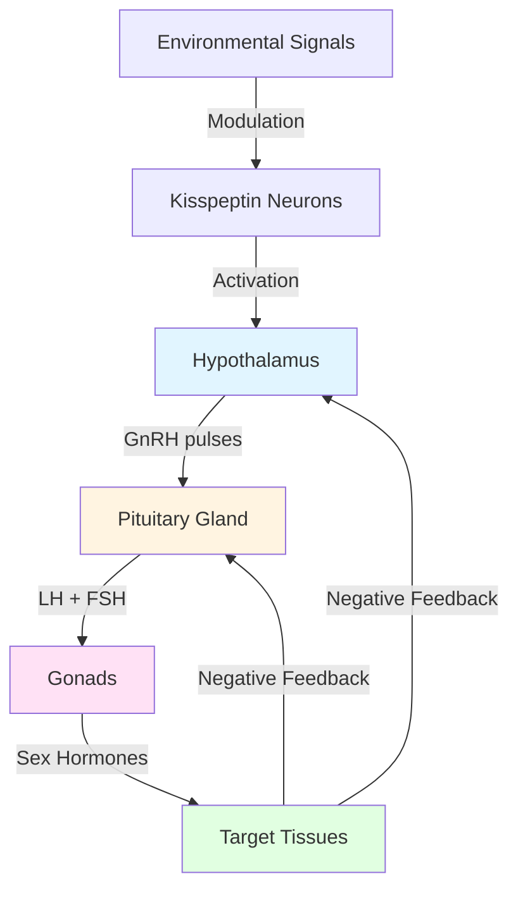

Puberty represents one of the most dramatic transformations in the human lifespan, marking the biological transition from childhood to physical maturity. This comprehensive guide explores the hormonal orchestration, physical changes, and developmental variations that characterize this pivotal period, drawing on the latest research in developmental endocrinology and adolescent medicine.

---

**Source PDFs**: 
- 📄 [Block-3/Unit-1.pdf - Pages 7-13](/pdfs/MPC-002%20Life%20Span%20Psychology/Block-3/Unit-1.pdf)
- 📚 MPC-002 Life Span Psychology

---

## Understanding Physical Development in Adolescence

### Defining Physical Development

Adolescence is characterized by **dramatic physical changes** that move the individual from childhood into physical maturity. Normal growth during adolescence encompasses two interconnected processes:

1. **Somatic Growth**: Increases in body size (height and weight)
2. **Sexual Maturation (Puberty)**: Development of reproductive capacity and secondary sexual characteristics

According to recent research, these changes are driven by the **reactivation of the hypothalamic-pituitary-gonadal (HPG) axis** after years of childhood quiescence, initiating a cascade of hormonal events that transform the body from a child's to an adult's form.

### The Nature of Adolescent Growth

The physical transformation of adolescence exhibits several key characteristics:

- **Variability**: Both genetic heredity and environmental factors (nutrition, health, stress) influence timing and pace
- **Discontinuity**: Growth spurts alternate with periods of slower development
- **Individual Timing**: Each adolescent experiences changes on their own unique schedule
- **Asynchrony**: Different body systems mature at different rates

**Growth Patterns**: Adolescents may experience dramatic changes:
- Growing several inches in just a few months
- Experiencing periods of very slow or no visible growth
- Having multiple growth spurts at unpredictable intervals

### Reaching Adult Stature

During adolescence, boys and girls attain their adult height and weight through:

1. **Growth Spurts**: Rapid increases in height over relatively short periods
2. **Sexual Maturation**: Appearance of secondary sexual characteristics
3. **Body Composition Changes**: Shifts in muscle, fat, and bone density
4. **System Maturation**: Development of adult-level organ systems

**Critical Understanding**: Changes may occur gradually over years or multiple signs may become visible simultaneously. The **tremendous variability** in timing and sequence is completely normal and reflects the complex interplay of genetic programming and environmental influences.

## The Biological Basis of Puberty

### The Hypothalamic-Pituitary-Gonadal (HPG) Axis

Puberty begins deep within the brain through the **third activation of the HPG axis** (following fetal and mini-puberty periods). This activation represents one of nature's most elegant biological systems:

### The Hormonal Cascade

The pubertal process unfolds through a precisely orchestrated sequence:

1. **Initiation**: The hypothalamus increases pulsatile secretion of **gonadotropin-releasing hormone (GnRH)**
2. **Amplification**: GnRH stimulates the anterior pituitary to release:
   - **Luteinizing Hormone (LH)**
   - **Follicle-Stimulating Hormone (FSH)**
3. **Sex Steroid Production**: LH and FSH act on the gonads:
   - **In females**: Ovaries produce estradiol and progesterone
   - **In males**: Testes produce testosterone
4. **Tissue Response**: Sex steroids trigger development of secondary sexual characteristics

### The Role of Kisspeptin

Recent research (2021-2024) has identified the **kisspeptin-neurokinin B-dynorphin (KNDy) neuronal network** as the master regulator of GnRH secretion. This discovery has revolutionized our understanding of pubertal timing and has important clinical implications for disorders of puberty.

## Hormonal Mechanisms: A Detailed View

### Sex Hormones and Their Functions

#### Testosterone

**Primary Source**: Leydig cells in testes (males); adrenal glands and ovaries (females in smaller amounts)

**Major Effects**:
- Testicular growth and sperm production (spermatogenesis)
- Penis enlargement
- Pubic, facial, and body hair growth
- Voice deepening
- Muscle mass increase
- Bone density enhancement
- Libido development

**Concentration Changes**: Testosterone levels increase approximately **45-fold** from prepuberty to adulthood in males, representing one of the most dramatic hormonal changes in human development.

#### Estradiol

**Primary Source**: Ovaries (females); peripheral conversion of testosterone (males in smaller amounts)

**Major Effects**:
- Breast development (thelarche)
- Uterine growth and reshaping (from tear-drop to pear shape)
- Female fat distribution pattern (hips, breasts, thighs)
- Long bone growth and fusion
- Menstrual cycle regulation
- Vaginal maturation

**Concentration Changes**: Estradiol levels increase **4-9 fold** from childhood to late adolescence in females.

#### Progesterone

**Primary Source**: Corpus luteum in ovaries (following ovulation)

**Major Effects**:
- Prepares endometrium for potential pregnancy
- Regulates menstrual cycle
- Contributes to breast development (lobular alveoli)
- Mood and emotion regulation

### Dehydroepiandrosterone (DHEA) and Adrenarche

**Adrenarche** (typically occurring before gonadarche) involves:
- Increased production of **DHEA** and **DHEA-sulfate (DHEA-S)** from adrenal glands
- Responsible for initial pubic and axillary hair growth
- Independent of gonadal sex steroid production
- Typically begins age 6-8 years (before visible pubertal signs)

## Physical Changes: Sex-Specific Patterns

### Female Pubertal Development

#### Tanner Stages for Females

**Age Range**: Typically 8-13 years for onset

**Stage-by-Stage Progression**:

| Tanner Stage | Breast Development | Pubic Hair | Age Range |
|--------------|-------------------|------------|-----------|
| Stage 1 | Prepubertal | None | Before 8-9 years |
| Stage 2 | Breast buds appear | Sparse, straight hair | 8-13 years |
| Stage 3 | Breast tissue enlarges beyond areola | Darker, coarser, curlier | 10-14 years |
| Stage 4 | Areola forms secondary mound | Adult-type, limited area | 11-15 years |
| Stage 5 | Adult contour, areola recesses | Adult distribution (may spread to thighs) | 12-16+ years |

#### Sequential Changes in Females

1. **First Sign: Thelarche** (Age 9-10 average)
   - Breast bud development
   - May be unilateral initially
   - Tenderness common

2. **Pubarche** (approximately 6 months after thelarche)
   - Initial pubic hair appears light and sparse
   - Gradually becomes coarse, thick, and dark
   - Adult pattern takes 2-3 years to develop

3. **Peak Height Velocity** (Age 11-12 average)
   - Maximum growth rate: 8-9 cm/year
   - Occurs relatively early in female puberty
   - Total gain: 8-10 inches (20-25 cm)

4. **Axillary Hair** (approximately 2 years after pubarche)
   - Underarm hair development
   - Testosterone-mediated
   - Around age 13

5. **Menarche** (Age 12-13 average, range 10-16.5 years)
   - First menstrual period
   - Marks established ovulation (though cycles may be anovulatory initially)
   - Typically occurs 1.5-3 years after thelarche
   - Earlier in African-American girls (3-8 months) compared to White girls

#### Internal Changes

**Uterine Transformation**:
- **Prepubertal**: Tear-drop shaped, cervix represents 2/3 of volume
- **Post-pubertal**: Pear-shaped, uterine body lengthens and thickens
- Endometrium becomes responsive to cyclical hormone changes

**Ovarian Changes**:
- Follicle maturation begins
- Estrogen production increases
- Ovulation typically begins within 1-2 years of menarche

### Male Pubertal Development

#### Tanner Stages for Males

**Age Range**: Typically 9.5-14 years for onset

**Stage-by-Stage Progression**:

| Tanner Stage | Genital Development | Pubic Hair | Age Range |
|--------------|---------------------|------------|-----------|
| Stage 1 | Prepubertal | None | Before 9-10 years |
| Stage 2 | Testicular volume >3 mL, scrotum thins | Sparse at penis base | 9-14 years |
| Stage 3 | Penis lengthens, testes continue growth | Darker, coarser, spreads | 10-15 years |
| Stage 4 | Penis widens, glans develops, testes larger | Adult-type, limited area | 11-16 years |
| Stage 5 | Adult size and shape | Adult distribution (may spread to thighs) | 12-17+ years |

#### Sequential Changes in Males

1. **First Sign: Testicular Enlargement** (Age 11-12 average)
   - Testicular volume increases beyond 3 mL
   - Driven by seminiferous tubule development
   - Scrotum thins and reddens
   - Often asymmetric initially

2. **Penile Growth** (approximately 1 year after testicular enlargement)
   - Length increases first
   - Girth increases later
   - Complete development takes 3-4 years

3. **Pubarche** (Age 13.5 average)
   - Pubic hair appears at penis base
   - Gradually becomes coarse and curly
   - Spreads to adult distribution over 2-3 years

4. **Peak Height Velocity** (Age 13-14 average)
   - Maximum growth rate: 9-10 cm/year
   - Occurs later than in females
   - Total gain: 10-12 inches (25-30 cm)
   - Boys typically grow 2 years longer than girls

5. **Additional Changes** (Age 15+ average)
   - **Axillary hair**: Underarm hair development
   - **Facial hair**: Mustache, then beard (may continue developing into 20s)
   - **Voice changes**: Larynx enlarges, vocal cords thicken (voice "cracks" during transition)
   - **Body hair**: Chest, abdomen, limbs (varies greatly by individual/ethnicity)
   - **Gynecomastia**: Temporary breast tissue development (50-60% of boys, typically resolves within 18 months)

6. **Spermarche and Nocturnal Emissions** (Age 14 average, range 11-16 years)
   - **Spermarche**: First appearance of sperm in urine
   - **Nocturnal emissions (wet dreams)**: Spontaneous ejaculation during sleep
   - Indicates reproductive maturity
   - Normal whether present or absent

#### Body Composition Changes

Males experience:
- **Muscle mass increase**: Testosterone-driven, particularly upper body
- **Shoulder broadening**: Skeletal growth pattern
- **Voice deepening**: Laryngeal growth (Adam's apple prominence)
- **Facial restructuring**: Jaw enlargement, brow ridge development

## Timing and Variation in Pubertal Development

### Factors Influencing Pubertal Timing

Research from 2020-2024 has identified multiple factors affecting when puberty begins:

1. **Genetic Factors**:
   - Account for approximately 50-80% of timing variation
   - Over 1,000 genetic variants identified affecting pubertal timing
   - Family patterns strongly predict individual timing

2. **Nutritional Status**:
   - Body mass index (BMI) significantly affects onset
   - **Leptin** (adipose tissue hormone) signals metabolic readiness
   - Both undernutrition and obesity can disrupt normal timing

3. **Socioeconomic Factors**:
   - Stress, family environment affect onset
   - Lower socioeconomic status associated with earlier puberty
   - Secure attachment may delay onset

4. **Ethnicity and Geography**:
   - African-American girls: Earlier average onset (6-8 months)
   - Hispanic girls: Earlier than non-Hispanic White girls
   - Asian populations: Generally later onset
   - Secular trend toward earlier puberty in developed nations

5. **Environmental Exposures**:
   - **Endocrine-disrupting chemicals** (EDCs) may affect timing
   - Phthalates, BPA, pesticides under investigation
   - Light exposure and circadian rhythms may play roles

6. **Psychosocial Stress**:
   - Adverse childhood experiences associated with earlier puberty
   - Father absence correlates with earlier female puberty
   - Chronic stress may accelerate reproductive maturation

### Normal Variation

The concept of "normal" pubertal timing is broad:

- **Girls**: Onset anywhere from 8-13 years is considered normal
- **Boys**: Onset anywhere from 9.5-14 years is considered normal
- **Early developers**: May begin puberty 2-3 years before peers
- **Late developers**: May begin 2-3 years after peers

**Both early and late timing are typically normal variants** unless accompanied by other signs of endocrine disorder.

### Secular Trends

Over the past 150 years, the average age of puberty has declined:

- **Menarche**: Decreased from ~17 years (1850s) to ~12.5 years (2020s)
- **Drivers**: Improved nutrition, reduced disease burden, environmental factors
- **Recent plateau**: Some evidence of stabilization in developed nations
- **Concern**: Continued decline raises questions about environmental influences

## Psychological and Social Dimensions of Pubertal Change

### The Mind-Body Connection

Physical changes don't occur in isolation; they profoundly affect psychological well-being:

1. **Body Image Concerns**:
   - Heightened self-consciousness about appearance
   - Comparing development to peers
   - May lead to eating concerns or excessive exercise
   - Gender differences in satisfaction (girls typically more critical)

2. **Emotional Volatility**:
   - **Hormonal fluctuations** affect limbic system function
   - Research shows testosterone and estradiol bind receptors in emotion-regulating brain areas
   - Result: Increased emotional intensity and impulsivity
   - Mood swings considered normal during peak pubertal change

3. **Identity Formation**:
   - Physical changes trigger questions about self
   - "Who am I becoming?"
   - Erikson's identity vs. role confusion crisis
   - Experimentation with different social identities

4. **Social Status Changes**:
   - Physical maturity affects peer relationships
   - Early-maturing girls: Increased risk for depression, early sexual activity
   - Late-maturing boys: Temporary social disadvantage
   - Timing effects often diminish by young adulthood

### The Role of Information and Support

Adolescents consistently report:
- **Inadequate preparation** for pubertal changes
- **Lack of comprehensive information** from trusted adults
- **Embarrassment** preventing questions
- **Anxiety and confusion** about what's happening

**Result**: Many adolescents rely on peers (who may have inaccurate information) or internet sources (variable quality).

**Solution**: Proactive, age-appropriate education from:
- Parents and caregivers
- School health education programs
- Healthcare providers
- Reliable online resources

## Contemporary Research and Clinical Insights

### Recent Findings (2023-2024)

1. **Pubertal Hormones and Mental Health**:
   - Systematic review (2024) of 55 population-based studies
   - Links between testosterone/estradiol and certain mental health concerns
   - Complex relationships still being elucidated
   - Not deterministic—many adolescents navigate puberty without problems

2. **HPG Axis Regulation**:
   - Refined understanding of kisspeptin neuron networks
   - Glutamatergic and GABAergic neuronal influences
   - Glial cells (tanycytes, astrocytes) play regulatory roles
   - Opens new therapeutic targets for pubertal disorders

3. **Neurological Development**:
   - Puberty triggers significant brain reorganization
   - Structural and functional changes in:
     - Prefrontal cortex (executive function)
     - Limbic system (emotion regulation)
     - Social cognition networks
   - These changes explain behavioral shifts of adolescence

4. **Environmental Influences**:
   - Growing evidence for EDC effects on timing
   - Phthalate exposure associated with altered pubertal development
   - Need for larger, long-term studies
   - Policy implications for chemical regulation

### Clinical Perspectives

#### Delayed Puberty

**Definition**:
- **Girls**: No breast development by age 13, or no menarche by age 15
- **Boys**: No testicular enlargement (>3 mL) by age 14

**Differential Diagnosis**:
- **Constitutional Delay**: "Late bloomers" (most common)
- **Hypogonadotropic Hypogonadism**: Central (brain/pituitary) cause
- **Hypergonadotropic Hypogonadism**: Primary gonadal failure
  - Males: Klinefelter syndrome (47,XXY) most common
  - Females: Turner syndrome (45,X), premature ovarian insufficiency

**Evaluation**:
- Basal LH, FSH, sex steroids
- Bone age assessment
- Sometimes: GnRH stimulation test, genetic testing

#### Precocious Puberty

**Definition**:
- **Girls**: Pubertal signs before age 8
- **Boys**: Pubertal signs before age 9

**Central (Gonadotropin-Dependent)**:
- Early activation of HPG axis
- Often idiopathic in girls
- Boys: Higher likelihood of underlying pathology

**Peripheral (Gonadotropin-Independent)**:
- Autonomous sex steroid production
- Causes: Adrenal tumors, ovarian cysts, testicular tumors, exogenous hormones

**Psychosocial Impact**:
- Short adult stature (early epiphyseal fusion)
- Psychological challenges (appearing older than chronological age)
- Increased risk for behavioral/emotional problems

**Treatment**:
- GnRH agonists (for central precocious puberty)
- Treat underlying cause (peripheral)
- Psychological support

## Practical Guidance and Support Strategies

### For Adolescents

1. **Understand the Biology**:
   - Learning about pubertal processes reduces anxiety
   - Normalizes the experience
   - Empowers informed self-care

2. **Practice Good Hygiene**:
   - Increased sebum production → daily showering
   - Deodorant/antiperspirant for body odor
   - Skin care for acne (gentle cleansers, non-comedogenic products)

3. **Maintain Healthy Habits**:
   - **Nutrition**: Support growth with balanced diet, adequate calcium/vitamin D
   - **Sleep**: 8-10 hours critical for growth hormone release
   - **Physical activity**: Supports healthy development, mood regulation
   - **Stress management**: Mindfulness, hobbies, social connection

4. **Communicate Openly**:
   - Ask trusted adults questions
   - Discuss concerns with healthcare providers
   - Connect with peers experiencing similar changes
   - Utilize reliable online resources

5. **Be Patient**:
   - Development takes years, not months
   - Comparing to peers inevitable but not helpful
   - Your timeline is uniquely yours
   - Adult maturity eventually evens out early/late differences

### For Parents and Educators

1. **Initiate Conversations Early**:
   - Don't wait for questions—they may not come
   - Start discussions before visible changes (age 7-9)
   - Make it ongoing dialogue, not one-time "talk"

2. **Provide Accurate Information**:
   - Use correct anatomical terms
   - Explain biological processes clearly
   - Address both physical and emotional aspects
   - Correct misinformation from peers/media

3. **Normalize the Experience**:
   - Share that everyone goes through puberty (just at different times)
   - Acknowledge that it can feel awkward or confusing
   - Reassure that their feelings and questions are valid
   - Share your own experiences (age-appropriately)

4. **Respect Privacy**:
   - Recognize growing need for independence
   - Don't embarrass them publicly about pubertal changes
   - Knock before entering rooms
   - Allow them to manage personal hygiene privately

5. **Monitor for Concerns**:
   - Watch for signs of distress or depression
   - Notice social withdrawal or behavioral changes
   - Check for developmentally inappropriate timing (very early/late)
   - Seek professional help when needed

6. **Model Healthy Attitudes**:
   - Demonstrate positive body image
   - Avoid negative comments about physical appearance (yours or others)
   - Discuss media's unrealistic body standards
   - Emphasize health and function over appearance

### Healthcare Perspectives

Routine healthcare visits during adolescence should include:

- **Growth monitoring**: Height, weight, BMI plotted on growth curves
- **Sexual maturity rating**: Tanner staging (with consent and privacy)
- **Menstrual history**: Regularity, duration, symptoms in females
- **Psychosocial screening**: Mood, behavior, relationships, school performance
- **Anticipatory guidance**: Age-appropriate education about upcoming changes
- **Confidential time**: Opportunity to ask questions without parents present

## Memory Aids and Key Concepts

### The "HPG Cascade" Mnemonic

**H**ypothalamus releases **G**nRH
**G**onadotropins (**L**H and **F**SH) from **P**ituitary
**G**onads produce **S**ex steroids (testosterone, estradiol, progesterone)
**S**econdary sexual characteristics develop

**Remember**: The brain starts it all!

### Timing Rules of Thumb

**"First is First"**:
- **Girls**: Breast development typically first sign
- **Boys**: Testicular enlargement typically first sign

**"Growth Spurt Timing"**:
- **Girls**: Early in puberty (often before menarche)
- **Boys**: Late in puberty (often after genital development begins)

**"Two Years"**:
- Peak female height velocity: ~2 years before peak male
- Pubarche to axillary hair: ~2 years
- Thelarche to menarche: ~1.5-3 years

### The "PUBERTY" Acronym

**P**ulsatile GnRH starts it all
**U**nique timing for each individual
**B**rain changes alongside body
**E**strogen and testosterone are key drivers
**R**eproductive maturity is the goal
**T**anner stages track progression
**Y**ears-long process (typically 3-5 years)

## Common Misconceptions Addressed

### Misconception 1: "Everyone develops at the same time"
**Reality**: The normal range spans ~5 years. You might start puberty at 9 while your friend starts at 13—both completely normal.

### Misconception 2: "Early/late development indicates a problem"
**Reality**: Unless accompanied by other symptoms or outside normal ranges, variation in timing is typically benign genetic variation.

### Misconception 3: "Physical maturity = emotional maturity"
**Reality**: Bodies mature faster than brains. A 13-year-old who looks 16 is still cognitively and emotionally 13.

### Misconception 4: "You can speed up or slow down puberty"
**Reality**: Timing is largely determined by genetics and biology. Healthy lifestyle supports optimal development but doesn't control timing.

### Misconception 5: "Puberty is just about sex"
**Reality**: Puberty encompasses comprehensive physical maturation affecting every body system, plus psychological and social development.

### Misconception 6: "It happens quickly"
**Reality**: Complete pubertal maturation typically takes 3-5 years from first signs to adult maturity.

## Self-Assessment Questions

### Multiple Choice

1. **Which structure initiates puberty by increasing pulsatile GnRH secretion?**
   - A) Pituitary gland
   - B) Hypothalamus ✓
   - C) Ovaries/testes
   - D) Adrenal glands

2. **What is typically the FIRST sign of puberty in girls?**
   - A) Menarche
   - B) Axillary hair
   - C) Breast development (thelarche) ✓
   - D) Pubic hair

3. **What is typically the FIRST sign of puberty in boys?**
   - A) Penis enlargement
   - B) Voice change
   - C) Testicular enlargement ✓
   - D) Facial hair

4. **Which hormone increases approximately 45-fold from prepuberty to adulthood in males?**
   - A) Estrogen
   - B) FSH
   - C) Testosterone ✓
   - D) Progesterone

5. **When does peak height velocity typically occur in girls relative to puberty?**
   - A) Before any signs of puberty
   - B) Early in puberty ✓
   - C) Late in puberty
   - D) After puberty is complete

### Short Answer

6. **Describe the role of kisspeptin neurons in initiating puberty.**

Sample Answer

Kisspeptin neurons in the hypothalamus regulate GnRH-producing neurons. These neurons form the KNDy (kisspeptin-neurokinin B-dynorphin) network that controls the pulsatile release of GnRH, which ultimately initiates the pubertal cascade. When kisspeptin neurons become active, they stimulate GnRH release, triggering the HPG axis and beginning puberty.

7. **Explain why girls typically experience their growth spurt earlier in puberty than boys.**

Sample Answer

In girls, the growth spurt is one of the earlier pubertal events, often occurring before or shortly after menarche. This is because estrogen stimulates linear growth but also causes epiphyseal (growth plate) closure. In boys, testosterone has a longer period of bone growth stimulation before conversion to estrogen causes eventual closure, so their growth spurt occurs later in puberty and continues for a longer duration.

8. **What are three factors (besides genetics) that can influence the timing of pubertal onset?**

Sample Answer

Any three of: (1) Nutritional status/BMI (obesity associated with earlier puberty; malnutrition with delay), (2) Psychosocial stress/adverse experiences (stress may accelerate), (3) Socioeconomic status (lower SES associated with earlier), (4) Environmental chemical exposures/endocrine disruptors, (5) Geographic/ethnic background, (6) Chronic illness

## External Resources for Deeper Learning

### Research Articles

1. **[Physiology of Puberty](https://www.ncbi.nlm.nih.gov/books/NBK534827/)** - StatPearls, NCBI (Updated 2023)
   - Comprehensive medical review of pubertal physiology
   - Detailed hormonal mechanisms
   - Clinical correlations

2. **[Interpretation of Reproductive Hormones Before, During and After Puberty](https://pmc.ncbi.nlm.nih.gov/articles/PMC9291332/)** - Howard et al., Clinical Endocrinology (2021)
   - Expert guidance on hormonal interpretation
   - Diagnostic approaches to pubertal disorders
   - Excellent figures on HPG axis

3. **[Puberty: Neurologic and Physiologic Development](https://www.frontiersin.org/journals/endocrinology/articles/10.3389/fendo.2023.1258656/full)** - Frontiers in Endocrinology (2023)
   - Recent perspectives on puberty research
   - Brain changes during adolescence
   - Environmental and genetic factors

4. **[Pubertal Hormones and Mental Health](https://www.thelancet.com/journals/eclinm/article/PIIS2589-5370(24)00407-3/fulltext)** - eClinicalMedicine (2024)
   - Systematic review of 55 studies
   - Links between hormones and mental health
   - Methodological considerations

### Educational Videos

1. **[Adolescence: Crash Course Psychology #20](https://www.youtube.com/watch?v=PzyXGUCngoU)** - CrashCourse (10:14)
   - Engaging overview of adolescent development
   - Covers Erikson's identity vs. role confusion
   - Appropriate for general audiences

2. **[Hormones, Body Odor, and Acne, Oh My! Puberty 101](https://www.pbs.org/video/hormones-body-odor-and-acne-oh-my-puberty-101-apie6l/)** - PBS Parentalogic
   - Accessible explanation of hormonal changes
   - Covers LH, FSH, testosterone, estrogen
   - Good for adolescents and parents

3. **[Endocrine System Part 1: Glands & Hormones](https://www.pbslearningmedia.org/resource/endocrine-system-glands-hormones-crashcourse-1023/)** - Crash Course A&P (2023)
   - Foundation on endocrine system function
   - Explains hormone mechanisms
   - Useful background for understanding puberty

### Wikipedia Resources

1. **[Puberty](https://en.wikipedia.org/wiki/Puberty)**
   - Comprehensive overview with global perspectives
   - Historical context and secular trends
   - Extensive references

2. **[Hypothalamic-Pituitary-Gonadal Axis](https://en.wikipedia.org/wiki/Hypothalamic%E2%80%93pituitary%E2%80%93gonadal_axis)**
   - Detailed explanation of HPG axis
   - Feedback mechanisms
   - Clinical relevance

3. **[Tanner Scale](https://en.wikipedia.org/wiki/Tanner_scale)**
   - Standard staging system for pubertal development
   - Visual reference for stages
   - Clinical applications

## Real-World Applications

### Application 1: Clinical Assessment

**Scenario**: A 15-year-old boy presents with concern about lack of pubertal development. His peers have all grown taller and developed secondary sexual characteristics.

**Application of Knowledge**:
- Check Tanner staging (if no testicular enlargement >3 mL, meets criteria for delayed puberty)
- Measure basal LH, FSH, testosterone
- If low/normal gonadotropins with low testosterone: Consider constitutional delay vs. hypogonadotropic hypogonadism
- If high gonadotropins: Suggests primary testicular failure (check for Klinefelter syndrome)
- Bone age X-ray helps differentiate constitutional delay (delayed bone age) from pathologic causes

### Application 2: Health Education

**Scenario**: Designing a school health curriculum for 5th grade (age 10-11).

**Application of Knowledge**:
- Age 10-11 is ideal timing (before most visible changes but close enough to be relevant)
- Cover both male and female development (normalize learning about all bodies)
- Include:
  - Accurate anatomy and terminology
  - Timeline of changes (emphasizing variability)
  - Hygiene recommendations
  - Emotional aspects
  - When to seek help
- Make resources available (books, websites, parent guides)
- Provide opportunity for anonymous questions

### Application 3: Supporting an Early Developer

**Scenario**: A 9-year-old girl has reached Tanner stage 3 for breasts while most peers are prepubertal.

**Application of Knowledge**:
- Recognize psychosocial challenges: May be teased, treated as older than actual age, self-conscious about body
- Provide:
  - Age-appropriate bras
  - Education about what's happening
  - Permission to set boundaries (e.g., unwanted attention to body)
  - Monitoring for signs of depression or anxiety
- Help adults understand: Physically mature ≠ emotionally mature (still needs 9-year-old appropriate expectations and activities)
- Consider medical evaluation to rule out precocious puberty if before age 8

### Application 4: Athletic Training Considerations

**Scenario**: Coaching a mixed-age youth sports team (ages 11-14).

**Application of Knowledge**:
- Recognize huge variation in size/strength due to different pubertal stages
- Safety considerations:
  - Avoid mismatches in contact sports
  - Group by size/maturity level, not just age
- Training modifications:
  - Growth plates more vulnerable during rapid growth
  - Flexibility exercises important (bones growing faster than muscles/tendons)
  - Adjust expectations based on individual development
- Psychosocial support:
  - Late developers may be temporarily less competitive (reassure it's temporary)
  - Early developers may dominate (keep challenge appropriate)

## Summary

Puberty represents a fundamental biological transformation orchestrated by the reactivation of the hypothalamic-pituitary-gonadal axis. The process unfolds through a precisely choreographed cascade:

1. **Initiation**: Hypothalamic GnRH neurons (regulated by kisspeptin) increase pulsatile secretion
2. **Amplification**: GnRH stimulates pituitary release of LH and FSH
3. **Sex Steroid Production**: Gonadotropins trigger gonadal production of testosterone, estradiol, and progesterone
4. **Physical Transformation**: Sex hormones drive development of secondary sexual characteristics and reproductive maturity
5. **Neurological Maturation**: Brain undergoes extensive reorganization affecting cognition, emotion, and behavior

**Key Principles**:
- **Universal but Individual**: Everyone experiences puberty, but timing and progression vary enormously (normal range spans ~5 years)
- **Multifactorial**: Genetic, nutritional, socioeconomic, and environmental factors all influence timing
- **Asynchronous**: Different aspects develop at different rates (body matures faster than brain)
- **Extended Process**: Complete maturation takes 3-5 years from initiation to adult form

**Contemporary Understanding**:
- Recent research has elucidated the role of kisspeptin neurons as master regulators
- Links between pubertal hormones and mental health are complex and still being explored
- Environmental chemical exposures may affect pubertal timing
- Secular trends show earlier average puberty onset in developed nations

**Support Strategies**:
- Proactive, accurate education reduces anxiety and promotes healthy adjustment
- Normalize the wide range of normal variation
- Address both physical and psychological aspects
- Provide age-appropriate resources and open communication channels

Approaching puberty not as a problem to be solved but as a natural developmental process to be understood and supported helps adolescents emerge from this transformative period with healthy bodies, positive self-concepts, and readiness for the opportunities and challenges of young adulthood.

---

**Related Topics**:
- [Adolescent Development Stages](/mpc-002/block-3/adolescent-development-stages) - Overview of early, middle, and late adolescence
- [Physical Changes in Adolescent Males](/mpc-002/block-3/physical-changes-adolescent-males) - Detailed male-specific development
- [Physical Changes in Adolescent Females](/mpc-002/block-3/physical-changes-adolescent-females) - Detailed female-specific development