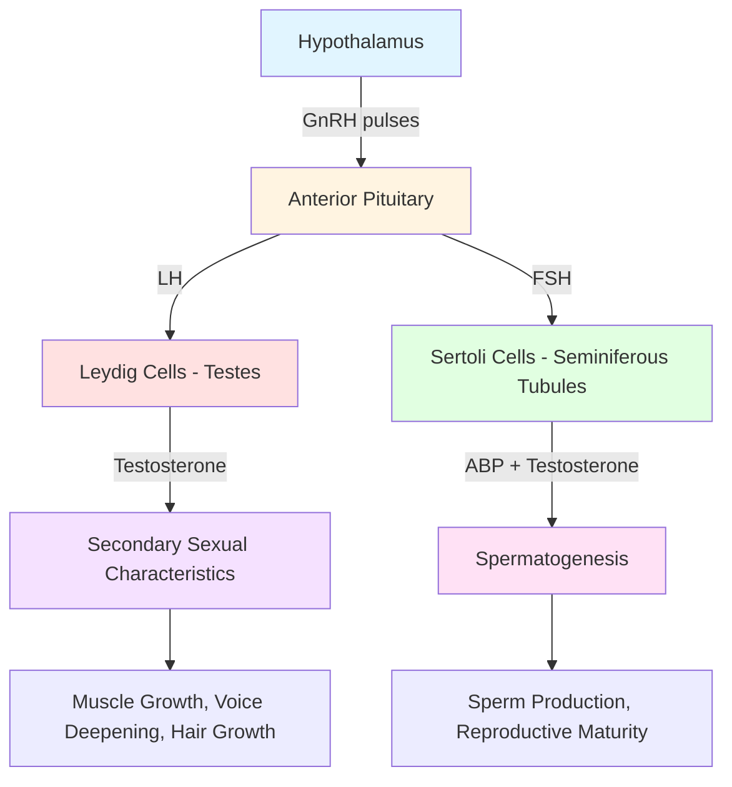

Male adolescence is marked by dramatic physical transformations driven by testosterone and other androgens. This comprehensive guide explores the biological mechanisms, sequential changes, and psychosocial dimensions of male pubertal development, drawing on recent research and clinical insights.

---

**Source PDFs**: 
- 📄 [Block-3/Unit-1.pdf - Pages 8-13](/pdfs/MPC-002%20Life%20Span%20Psychology/Block-3/Unit-1.pdf)
- 📚 MPC-002 Life Span Psychology

---

## Overview of Male Adolescent Physical Changes

### The Transformation Timeline

Male puberty typically begins between **9.5 and 14 years of age**, with the complete process taking **3-5 years**. Unlike females, where many changes are internal, most male pubertal changes are **externally visible**, making the transformation particularly conspicuous to peers and adults.

**Key Principle**: Each boy experiences puberty on his own unique timeline, reflecting individual genetic programming and environmental influences. **There is no single "standard" for comparison** – variation is the norm, not the exception.

### The Androgenic Foundation

The male transformation is orchestrated primarily by **testosterone**, a powerful androgen produced by the **Leydig cells** in the testes:

**Testosterone's Journey**:
1. **Fetal Period**: Testes secrete testosterone by week 7, differentiating male sexual organs
2. **Childhood**: Sex glands remain inactive (hypothalamic quiescence)
3. **Puberty**: Pituitary signals reactivate testicular testosterone production
4. **Transformation**: Testosterone circulates systemically, transforming boy into man over several years

**Concentration Changes**: Testosterone levels increase approximately **45-fold** from prepuberty to adulthood – one of the most dramatic hormonal increases in human development.

## The Hormonal Cascade: Understanding the Mechanism

### The HPG Axis in Males

### Hormonal Players

**1. Gonadotropin-Releasing Hormone (GnRH)**
- Source: Hypothalamus
- Pattern: Pulsatile secretion (increases at puberty)
- Function: Triggers pituitary release of LH and FSH

**2. Luteinizing Hormone (LH)**
- Source: Anterior pituitary
- Target: Leydig cells in testes
- Function: Stimulates testosterone synthesis
- Recent research (2023): LH pulses become more frequent and amplified during early puberty

**3. Follicle-Stimulating Hormone (FSH)**
- Source: Anterior pituitary
- Target: Sertoli cells in seminiferous tubules
- Function: Stimulates spermatogenesis and androgen-binding protein (ABP) production
- ABP concentrates testosterone locally, creating optimal environment for sperm production

**4. Testosterone**
- Source: Leydig cells (testes) – primary; adrenal glands – minor
- Conversion: Can be converted to:
  - **Dihydrotestosterone (DHT)** via 5-alpha-reductase (more potent)
  - **Estradiol** via aromatase (important for growth plate closure)
- Functions: Multiple (see detailed effects below)

**5. Dehydroepiandrosterone (DHEA) and DHEA-S**
- Source: Adrenal glands (zona reticularis)
- Process: **Adrenarche** (typically begins age 6-8, before visible puberty)
- Function: Early pubic hair growth, body odor, initial growth acceleration

## Primary Sexual Characteristics: Genital Development

### Testicular Growth - The First Sign

**Timeline**: Age 11-12 average (range 9.5-14 years)

**The Process**:
- Testicular enlargement is typically the **first visible sign** of male puberty
- Volume increases from prepubertal &lt;3 mL to adult 15-25 mL per testis
- Growth driven by **seminiferous tubule development** (site of sperm production)
- Testes may **double or quadruple** in size over 2-3 years

**Measurement**: Clinically assessed using **Prader orchidometer** (comparison beads) or ultrasound

**Associated Changes**:
- **Scrotal skin** becomes thinner, darker, and more wrinkled
- Temperature regulation becomes established (testes hang lower when warm)
- **Asymmetry** is common and normal (left testis typically hangs lower)

### Penile Development

**Timeline**: Begins approximately **1 year after testicular enlargement** (age 12-13 average)

**Sequence**:
1. **Length increases first** (12-18 months)
2. **Width/girth increases** (follows length)
3. **Glans penis enlarges** and becomes more defined
4. **Final adult size** typically reached by age 15-17

**Anatomy**:
- **Glans (head)**: Highly sensitive, especially rim
- **Shaft**: Main body, contains erectile tissue (corpus cavernosum and corpus spongiosum)
- **Foreskin**: Loose skin covering glans (if uncircumcised)

**Normal Variations**:
- **Curvature**: Most penises curve slightly left or right
- **Angle**: Erect angle varies (45-90 degrees from body)
- **Size**: Tremendous variation in both flaccid and erect states
- All variations within broad range are normal and functional

### The Foreskin: Development and Hygiene

**Natural Development**:
- At birth, foreskin is fused to glans
- Gradual separation occurs over childhood/adolescence
- **Full retraction** typically possible by age 18 (sometimes earlier)
- **Never force** premature retraction (can cause scarring)

**Hygiene Education** (once retractable):
- Daily gentle washing under foreskin
- Prevents **smegma** accumulation (natural secretions + shed skin cells)
- Important for preventing infections and odor
- Retract, wash gently with water, return foreskin to normal position

### Testicular Function

**Dual Role**:
1. **Endocrine**: Testosterone production (Leydig cells)
2. **Reproductive**: Sperm production (seminiferous tubules)

**Spermatogenesis**:
- Begins during puberty with testosterone stimulation
- **Process duration**: 64 days from spermatogonia to mature sperm
- **Production**: Millions of sperm produced daily after puberty
- **Temperature-dependent**: Requires 2-3°C below core body temperature (why testes are external)

**First Ejaculation (Spermarche)**:
- Typically occurs around age 13-14 (range 11-16)
- First ejaculations may not contain viable sperm
- **Fertility** typically achieved about 1 year after first ejaculation

## Sexual Functions: Erections and Ejaculation

### Erections: The Physiological Response

**Mechanism**:
1. **Neural stimulation** (physical, visual, psychological, or spontaneous)
2. Parasympathetic nervous system activates
3. **Arterial dilation** increases blood flow to penis
4. Blood fills **corpus cavernosum** (spongy erectile tissue)
5. **Veins compress**, trapping blood
6. Penis becomes **rigid, enlarged, elevated**
7. Foreskin retracts, exposing glans

**Characteristics During Puberty**:
- **Frequent and unpredictable** (especially during early-mid puberty)
- **Spontaneous erections** common (without sexual thoughts or stimulation)
- **Nocturnal erections** (3-5 per night, associated with REM sleep)
- **Morning erections** (due to full bladder pressure + final REM cycle)

**The "Inconvenient Erection" Problem**:
- Extremely common concern for adolescent boys
- Strategies: Concealment (books, sweaters), mental distraction, subtle positional adjustment
- **Normalizing message**: All males experience this; decreases with age

### Ejaculation: The Reproductive Climax

**Definition**: Emission of **semen** (sperm + glandular secretions) from penis

**Physiological Process**:
1. **Emission phase**: Semen collects in urethral bulb
2. **Expulsion phase**: 3-15 rhythmic contractions (each ~1 second)
3. First 2-3 contractions most intense
4. Accompanied by **orgasm** (intense physical/emotional pleasure)
5. Followed by **refractory period** (cannot immediately ejaculate again)

**Semen Composition**:
- **Volume**: 2-5 mL (approximately 1 teaspoon)
- **Sperm**: 40-300 million per ejaculation
- **Seminal vesicle secretions** (60-70%): Fructose (energy), prostaglandins
- **Prostate secretions** (25-30%): Alkaline fluid, enzymes
- **Bulbourethral gland** (5%): Pre-ejaculate (lubricant, pathway cleansing)

**Important Anatomy**:
- Urine and semen both exit through **urethra**
- **Internal sphincter** closes bladder during ejaculation
- **No possibility of urine mixing with semen** during ejaculation

### Wet Dreams (Nocturnal Emissions)

**Definition**: Spontaneous ejaculation during sleep

**Timing**: Common from ages 13-17, may continue into adulthood occasionally

**Mechanism**:
- Often (not always) occurs during **erotic dreams**
- Result of **semen buildup** and sexual arousal during REM sleep
- Completely involuntary process

**Experience**:
- Boy wakes to sticky/dried semen on sheets or clothing
- Initially may confuse with urination
- Can be **embarrassing or concerning** if unprepared

**Normalization**:
- Occurs in nearly all males (estimates 80-90%)
- Also normal if does NOT occur
- Frequency decreases with regular ejaculation (masturbation or sexual activity)
- Not a sign of sexual dreams necessarily
- Simple management: Wash sheets routinely, no need for comment/embarrassment

## Secondary Sexual Characteristics

### Growth Spurt and Body Composition

**Timing**: Age 13-14 average (range 11-16), **later than females**

**Growth Patterns**:
- **Peak height velocity**: 9-10 cm/year (3.5-4 inches)
- **Total gain**: 25-30 cm (10-12 inches)
- **Duration**: Continues about **2 years longer** than females
- Result: Average adult male is **13 cm (5 inches) taller** than average female

**Body Composition Changes**:
- **Muscle mass** increases dramatically (testosterone effect)
- **Upper body** development particularly pronounced
- **Shoulder broadening** (skeletal growth pattern)
- **Body fat percentage** decreases (from ~18% to ~12-15%)
- **Lean body mass** increases from ~80% to ~85-90%

**Temporary Awkwardness**:
- Hands, feet, and limbs may grow **faster** than trunk
- Results in **clumsy, gangly appearance** (age 13-15 typically)
- Coordination catches up as growth evens out
- **Reassurance**: Normal, temporary phase

### Voice Changes

**Timeline**: Age 14-15 average (range 12-17)

**Mechanism**:
- **Testosterone** stimulates **larynx** (voice box) growth
- **Vocal cords** lengthen and thicken
- **Laryngeal cartilage** enlarges (visible "Adam's apple")
- Resonance chamber increases, lowering pitch

**The "Voice Cracking" Phase**:
- **Duration**: Several months to 1-2 years
- **Cause**: Brain adjusting to new vocal cord length
- Alternates between high (childhood) and low (adult) pitches
- Can be **embarrassing** but is universal male experience
- Settles into stable **deeper voice** by late adolescence

**Final Result**: Adult male voice averages **one octave lower** than prepubertal voice

### Hair Growth: Progressive Androgenization

**Pubic Hair (Pubarche)**:
- **Timeline**: Age 13-13.5 average (begins slightly after testicular growth)
- **Progression**:
  - Stage 1: None (prepubertal)
  - Stage 2: Sparse, straight, fine hair at penis base
  - Stage 3: Darker, coarser, beginning to curl
  - Stage 4: Adult-type hair, limited to pubic region
  - Stage 5: Adult distribution, may spread to thighs and linea alba (abdominal midline)

**Facial Hair**:
- **Timeline**: Age 15-16 average (range 13-19)
- **Sequence**:
  - Fine hair on **upper lip** (mustache area) appears first
  - Spreads to **cheeks and chin**
  - **Sideburns** develop
  - Full beard capability often not until late teens or 20s
- **Ethnic variation**: Significant differences in density and pattern

**Body Hair**:
- **Axillary (underarm)**: ~2 years after pubarche (age 15 average)
- **Chest, abdomen, back**: Highly variable (age 16-25+)
- **Arms and legs**: Increases in thickness and extent
- **Ethnic variation**: Some populations have minimal body hair (normal variant)

### Skin Changes

**Sebaceous Gland Activation**:
- **Androgens** stimulate oil gland (**sebaceous gland**) growth
- Increased **sebum** (oil) production
- Pores become larger, more visible

**Acne Development**:
- **Peak age**: 15-17 years in males
- **Mechanism**: Excess sebum + dead skin cells + bacteria (*Propionibacterium acnes*) → inflammation
- **Common locations**: Face, neck, chest, back, shoulders
- **Severity**: Ranges from mild (few pimples) to severe (cysts, nodules)
- May persist into early 20s

**Body Odor**:
- **Apocrine glands** (armpits, groin) activate
- Secrete protein-rich sweat
- **Bacteria metabolize** sweat → characteristic odor
- **Management**: Daily showering, deodorant/antiperspirant essential

### Gynecomastia: Breast Tissue Development

**Incidence**: Occurs in **50-60% of adolescent males** during puberty

**Timeline**: Most common mid-puberty (Tanner stages 3-4, ages 13-15)

**Mechanism**:
- Temporary **imbalance** between testosterone and estradiol
- Estradiol (converted from testosterone via aromatase) stimulates breast tissue
- **Areola enlargement**: Typically doubles in diameter

**Characteristics**:
- Usually **bilateral** (both breasts) but can be unilateral
- **Tender** or sensitive
- Ranges from small breast buds to more noticeable enlargement

**Resolution**:
- **90% resolve spontaneously** within 1-3 years
- Reassurance and monitoring typically sufficient
- Causes significant **psychological distress** for some boys
- Surgical intervention rarely needed (only if persistent beyond age 18 or severely distressing)

## Tanner Stages: Clinical Assessment

Developed by James Tanner (1962), this system provides objective criteria for tracking pubertal progression:

| Stage | Genital Development | Pubic Hair | Typical Age |
|-------|---------------------|------------|-------------|
| **Stage 1** | Prepubertal (testis &lt;3 mL) | None | &lt;9-10 years |
| **Stage 2** | Testis enlargement (3-6 mL), scrotum thins/reddens | Sparse, straight at base of penis | 9-14 years |
| **Stage 3** | Penis lengthens, testis continues growth (6-12 mL) | Darker, coarser, spreading | 10-15 years |
| **Stage 4** | Penis widens/lengthens, glans develops, testis 12-20 mL | Adult-type, limited area | 11-16 years |
| **Stage 5** | Adult size/shape (testis >20 mL) | Adult pattern, may spread to thighs | 12-17+ years |

**Clinical Use**: Healthcare providers use Tanner staging to:
- Monitor normal progression
- Identify delayed or precocious puberty
- Guide timing of interventions
- Provide age-appropriate anticipatory guidance

## Psychological and Social Dimensions

### Body Image and Self-Consciousness

**Common Concerns**:
1. **Penis size**: Near-universal concern
   - Wide normal variation (flaccid: 7-12 cm; erect: 12-18 cm)
   - Appearance vs. function distinction important
   - Peer comparison (locker rooms) exacerbates concerns
2. **Height**: Particularly for late developers
3. **Muscle development**: Pressure to be "buff" or athletic
4. **Facial/body hair**: Both too much and too little cause concern
5. **Acne**: Significant impact on self-esteem
6. **Gynecomastia**: Severe embarrassment for affected boys

**Cultural Pressures**:
- Media portrayals of idealized male bodies
- Athletic performance expectations
- Masculine stereotypes ("size matters," "real men are muscular")

### Sexual Feelings and Identity

**Emerging Sexuality**:
- **Increased libido** driven by testosterone
- **Sexual thoughts and fantasies** become frequent
- **Masturbation** common (begins for many during puberty)
- **Attraction** to others develops (timing varies)

**Sexual Orientation**:
- Some boys become aware of same-sex attraction during puberty
- Others experience opposite-sex attraction
- Some experience both or uncertainty
- **Important**: All orientations are normal variants

**Challenges**:
- Managing sexual feelings in socially appropriate ways
- Understanding consent and healthy relationships
- Navigating peer pressure and societal expectations
- LGBTQ+ youth may face additional challenges (acceptance, coming out)

### Social Status and Peer Relationships

**Timing Effects Research**:
- **Early maturing boys**: Often experience **temporary advantages**
  - Perceived as more mature, athletic, leadership roles
  - May face pressure to engage in risky behaviors
  - Advantages typically diminish by late adolescence
- **Late maturing boys**: May face **temporary disadvantages**
  - Treated as younger, excluded from certain activities
  - May develop coping strategies (humor, academics)
  - Usually "catch up" by young adulthood with no lasting effects

**Relationship Changes**:
- Shift in peer groups (often gender-segregated → mixed gender)
- Emerging romantic interests
- Changes in family dynamics (seeking independence)

### Emotional Volatility

**Contributing Factors**:
1. **Hormonal fluctuations**: Testosterone affects limbic system (emotion regulation)
2. **Brain reorganization**: Prefrontal cortex (impulse control) still developing
3. **Social stressors**: School, peers, family expectations
4. **Identity formation**: "Who am I becoming?"

**Common Experiences**:
- **Mood swings**: Rapid shifts from elation to frustration
- **Irritability**: Increased sensitivity, quicker temper
- **Risk-taking**: Increased sensation-seeking
- **Self-consciousness**: Heightened awareness of others' perceptions

**When to Seek Help**: Persistent depression, anxiety, aggression, or social withdrawal warrant professional evaluation

## Contemporary Research and Clinical Insights

### Recent Findings (2023-2024)

**1. Testosterone and Brain Development**:
- Longitudinal MRI study (2024): Testosterone associated with subcortical brain volume changes
- Effects on **amygdala** (emotion), **basal ganglia** (movement, reward), **hippocampus** (memory)
- Explains behavioral changes beyond physical development

**2. Timing and Long-Term Health**:
- Earlier puberty associated with increased risks: obesity, type 2 diabetes, cardiovascular disease, testicular cancer
- Later puberty associated with: lower bone density, different social trajectories
- Mechanisms still being elucidated

**3. Genetic and Environmental Influences**:
- Twin studies: Testosterone heritability **~55% in males**
- Environmental factors (nutrition, stress, endocrine disruptors) also significant
- Epigenetic mechanisms being explored

**4. Spermatogenesis and Fertility**:
- Recent research on timing effects on sperm quality
- Implications for future reproductive health
- Importance of avoiding testicular heat exposure, toxins during development

## Practical Guidance and Support

### For Adolescent Boys

**1. Educate Yourself**:
- Understanding biology reduces anxiety
- Normalizes the experience
- Empowers self-care

**2. Practice Good Hygiene**:
- **Daily showering** (particularly after physical activity)
- **Genital hygiene**: Gentle washing (retract foreskin if applicable)
- **Deodorant/antiperspirant** for body odor
- **Acne care**: Gentle cleansers, avoid excessive touching

**3. Manage Erections**:
- Strategies for public situations (mental distraction, concealment)
- Understanding they're normal and will become less frequent

**4. Handle Wet Dreams**:
- Keep extra sheets/pajamas handy
- Launder independently if preferred
- Remember: completely normal

**5. Address Body Image Concerns**:
- Remember: Development continues into early 20s
- Functional capacity matters more than appearance
- Media portrayals are unrealistic
- Variation is normal

**6. Communicate**:
- Ask trusted adults questions (parents, healthcare providers, school counselors)
- Connect with peers experiencing similar changes
- Utilize reliable online resources

### For Parents and Caregivers

**1. Initiate Conversations Early**:
- Start before visible changes (age 9-11)
- Make it ongoing dialogue, not one-time "talk"
- Use correct anatomical terms

**2. Provide Accurate Information**:
- Explain biological processes clearly
- Address both physical and emotional aspects
- Correct peer-sourced misinformation

**3. Normalize the Experience**:
- Share that all males go through puberty
- Acknowledge potential awkwardness
- Emphasize individual timing is normal

**4. Respect Privacy**:
- Knock before entering rooms
- Don't publicly comment on physical changes
- Allow independent hygiene management

**5. Monitor for Concerns**:
- Watch for signs of distress, depression, excessive anxiety
- Check for extremely early (&lt;9 years) or late (>14 years with no changes) development
- Seek professional evaluation when indicated

**6. Model Healthy Attitudes**:
- Demonstrate positive body image
- Avoid negative appearance comments
- Discuss media's unrealistic standards
- Emphasize health/function over appearance

### Healthcare Provider Guidance

**Routine Adolescent Care Should Include**:
- **Growth monitoring**: Height, weight, BMI (plotted on growth curves)
- **Tanner staging**: Sexual maturity assessment (with consent, privately)
- **Testicular examination**: Screen for masses, varicocele, hernias
- **Anticipatory guidance**: Age-appropriate education about upcoming changes
- **Psychosocial screening**: Mood, behavior, relationships, school, substance use
- **Confidential time**: Opportunity for questions without parents present
- **Reproductive health**: Contraception, STI prevention (when appropriate)

## Self-Assessment Questions

1. **What is typically the FIRST visible sign of puberty in males?**
   - A) Pubic hair growth
   - B) Testicular enlargement ✓
   - C) Voice change
   - D) Facial hair growth

2. **Which cells in the testes produce testosterone?**
   - A) Sertoli cells
   - B) Spermatogonia
   - C) Leydig cells ✓
   - D) Germ cells

3. **Approximately how much does testosterone increase from prepuberty to adulthood in males?**
   - A) 5-fold
   - B) 10-fold
   - C) 25-fold
   - D) 45-fold ✓

4. **What percentage of adolescent males experience gynecomastia during puberty?**
   - A) 10-20%
   - B) 30-40%
   - C) 50-60% ✓
   - D) 80-90%

5. **Why do testes hang outside the body?**
   - A) To make room for other organs
   - B) Sperm require cooler temperature than core body temperature ✓
   - C) Easier access for testosterone delivery
   - D) Historical evolutionary accident

6. **Describe the role of FSH in male pubertal development.**

Sample Answer

FSH (follicle-stimulating hormone) acts on Sertoli cells in the seminiferous tubules of the testes. It stimulates the production of androgen-binding protein (ABP), which concentrates testosterone locally, creating the optimal environment for spermatogenesis. FSH is essential for sperm production and testicular maturation during puberty.

7. **Explain why voice "cracking" occurs during male puberty.**

Sample Answer

Voice cracking occurs because testosterone causes the larynx (voice box) and vocal cords to grow rapidly. The vocal cords lengthen and thicken, lowering the pitch of the voice. During this transition period, the brain is adjusting to the new vocal cord length, causing the voice to unpredictably alternate between high (childhood) and low (adult) pitches. This phase typically lasts several months to 1-2 years before settling into a stable, deeper adult voice.

8. **Why do late-maturing boys typically "catch up" to their peers by young adulthood?**

Sample Answer

Late-maturing boys experience their growth spurt later but it lasts longer. They have more time before their growth plates close (driven by estradiol, converted from testosterone). This extended growth period allows them to eventually reach similar heights and development as early maturers. Psychologically, the temporary disadvantages of late maturation (being smaller, less developed than peers) typically resolve once all peers complete puberty, and late developers often have developed compensatory social and cognitive skills.

## External Resources

### Research Articles

1. **[Physiology, Puberty](https://www.ncbi.nlm.nih.gov/books/NBK534827/)** - StatPearls (2023)
2. **[Normal and Abnormal Puberty](https://www.ncbi.nlm.nih.gov/books/NBK279024/)** - Endotext (2024)
3. **[Physiology, Sexual Maturity Rating](https://www.ncbi.nlm.nih.gov/books/NBK551691/)** - StatPearls (2022)
4. **[Timing of Puberty and Male Fecundity](https://www.fertstert.org/article/S0015-0282(23)00540-X/pdf)** - Fertility & Sterility (2023)

### Educational Videos

1. **[Male Reproductive System: Crash Course A&P #41](https://www.youtube.com/watch?v=-XQcnO4iX_U)** - CrashCourse
2. **[Hormones, Body Odor, and Acne: Puberty 101](https://www.pbs.org/video/hormones-body-odor-and-acne-oh-my-puberty-101-apie6l/)** - PBS Parentalogic

### Wikipedia Resources

1. **[Puberty](https://en.wikipedia.org/wiki/Puberty)** - Comprehensive overview
2. **[Testosterone](https://en.wikipedia.org/wiki/Testosterone)** - Hormone details
3. **[Tanner Scale](https://en.wikipedia.org/wiki/Tanner_scale)** - Staging system

## Summary

Male adolescent physical changes represent a comprehensive testosterone-driven transformation from child to adult. The process unfolds through predictable yet individually variable stages:

**Sequential Development**:
1. Testicular enlargement (first sign, age 11-12)
2. Penile growth (1 year after testes, age 12-13)
3. Pubic hair (age 13-13.5)
4. Growth spurt (age 13-14)
5. Voice change (age 14-15)
6. Facial/body hair (age 15+)

**Key Hormones**: GnRH → LH/FSH → Testosterone (+ conversion to DHT and estradiol)

**Universal Challenges**: Body image concerns, unpredictable erections, wet dreams, acne, emotional volatility, peer comparison

**Support Strategies**: Comprehensive education, normalization of variation, privacy/respect, monitoring for concerns, modeling healthy attitudes

Understanding these changes as normal, universal, yet individually timed helps adolescent boys navigate this transformative period with greater confidence and less anxiety.

---

**Related Topics**:
- [Puberty and Physical Development](/mpc-002/block-3/puberty-physical-development)
- [Physical Changes in Adolescent Females](/mpc-002/block-3/physical-changes-adolescent-females)