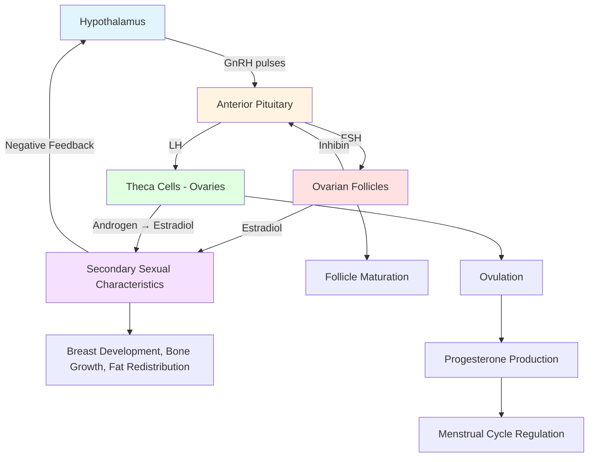

Female adolescence encompasses profound transformations—both visible external changes and invisible internal reproductive system maturation. Driven primarily by estrogen and progesterone, these changes prepare the body for adult functions while profoundly affecting psychological and social experiences. This comprehensive guide explores the biological, psychological, and social dimensions of female pubertal development.

---

**Source PDFs**: 
- 📄 [Block-3/Unit-1.pdf - Pages 8-14](/pdfs/MPC-002%20Life%20Span%20Psychology/Block-3/Unit-1.pdf)
- 📚 MPC-002 Life Span Psychology

---

## Overview of Female Adolescent Physical Changes

### The Dual Nature of Female Puberty

Female pubertal changes can be understood through two interconnected dimensions:

**Invisible Changes** (Internal):
- Ovarian maturation and follicle development
- Uterine growth and endometrial development
- Fallopian tube maturation
- Vaginal epithelial changes
- Establishment of menstrual cycling

**Visible Changes** (External):
- Breast development (thelarche)
- Body shape transformation
- Pubic and body hair growth (pubarche)
- Skin changes (acne, body odor)
- Linear growth acceleration

**Critical Understanding**: Internal hormonal changes **drive** external physical transformations. The invisible and visible are inseparably linked through the hypothalamic-pituitary-ovarian (HPO) axis.

### Timeline and Sequence

**Average Age Range**: 8-13 years onset (average 10.5 years)

**Typical Sequence**:
1. **Thelarche** (breast budding): First visible sign, age 8-13
2. **Adrenarche** (pubic hair): Shortly after thelarche, age 8-14
3. **Peak height velocity**: Age 11-12 (before menarche)
4. **Menarche** (first menstruation): Age 10-16.5 (average 12.8 years)
5. **Continued development**: 1-2 years post-menarche

**Variability**: Individual timing varies widely based on genetics, nutrition, body composition, and environmental factors—all ranges are normal.

## The Hormonal Orchestra: HPO Axis in Females

### Key Hormones

**1. Gonadotropin-Releasing Hormone (GnRH)**
- **Source**: Hypothalamus
- **Pattern**: Pulsatile secretion (increases frequency and amplitude at puberty)
- **Function**: Triggers pituitary gonadotropin release
- **Recent Discovery**: Activated by **kisspeptin** and **neurokinin B** from KNDy neurons

**2. Follicle-Stimulating Hormone (FSH)**
- **Source**: Anterior pituitary
- **Targets**: Ovarian follicles (granulosa cells)
- **Functions**:
  - Stimulates follicle maturation
  - Promotes estrogen production
  - Increases from prepubertal (<1 IU/L) to pubertal levels (5-20 IU/L)

**3. Luteinizing Hormone (LH)**
- **Source**: Anterior pituitary
- **Targets**: Theca cells in ovarian follicles
- **Functions**:
  - Triggers ovulation (mid-cycle LH surge)
  - Stimulates androgen production (converted to estrogen)
  - Maintains corpus luteum
- **Pattern**: LH rises higher than FSH during puberty

**4. Estradiol (Primary Estrogen)**
- **Source**: Ovarian follicles (granulosa cells via aromatase)
- **Concentration Changes**: Increases **4-9 fold** from prepuberty to adulthood
- **Functions**:
  - Breast development (thelarche)
  - Uterine and vaginal maturation
  - Fat redistribution (hips, thighs, breasts)
  - Bone growth and eventual growth plate closure
  - Endometrial proliferation
  - Vaginal epithelial thickening and pH regulation

**5. Progesterone**
- **Source**: Corpus luteum (post-ovulation)
- **Timing**: Remains low until **6-9 months after menarche** (anovulatory cycles initially)
- **Functions**:
  - Endometrial transformation (secretory phase)
  - Maintains early pregnancy
  - Breast development (lobular-alveolar structures)
  - Regulation of menstrual cycle

**6. Androgens (DHEA, DHEA-S, Androstenedione)**
- **Source**: Adrenal glands (zona reticularis)
- **Process**: **Adrenarche** (begins age 6-8, before visible puberty)
- **Functions**:
  - Pubic and axillary hair growth
  - Body odor (apocrine gland activation)
  - Acne (sebaceous gland stimulation)
  - Pre-pubertal growth acceleration

## The Invisible Changes: Internal Reproductive System Development

### Ovarian Maturation

**Prepubertal State**:
- **Volume**: ~0.5 cm³ per ovary
- **Status**: Contains primordial follicles (all eggs present since birth)
- **Activity**: Quiescent (no hormone production, no ovulation)

**Pubertal Transformation**:
- **Volume increase**: To 4.0 cm³ per ovary (8-fold increase)
- **Follicular development**: Progression from primordial → primary → secondary → tertiary (Graafian) follicles
- **Hormone production**: Estradiol and progesterone synthesis begins
- **Cyclical activity**: Monthly follicle maturation and ovulation established

**Egg Reserve**:
- **At birth**: ~1-2 million eggs (created during fetal development)
- **At puberty**: ~300,000-400,000 eggs remain
- **Lifetime ovulations**: ~400-500 eggs released over reproductive years
- **Process**: One egg (occasionally two) released per ~28-day cycle

**Location**: Almond-sized organs located on either side of uterus, below fallopian tubes, in lower abdomen

### Uterine Development

**Structure**: Upside-down pear-shaped hollow organ made of smooth muscle

**Prepubertal State**:
- **Length**: 3-4 cm
- **Shape**: Tubular (prepubertal configuration)

**Pubertal Growth**:
- **Length**: Increases to 7-8 cm (adult size)
- **Shape**: Pear-shaped with distinct fundus, body, and cervix
- **Endometrium**: Develops responsiveness to estrogen and progesterone
- **Myometrium**: Muscle layer thickens

**Anatomy**:
- **Fundus**: Upper rounded portion
- **Body**: Main central portion
- **Cervix**: Narrow lower neck opening into vagina

**Function**: Site where fetus develops during pregnancy; capable of expanding dramatically

**Endometrial Changes**: Begins monthly cycling—proliferation (estrogen-driven) and secretory transformation (progesterone-driven)

### Fallopian Tubes (Uterine Tubes/Oviducts)

**Structure**: Two trumpet-shaped tubes, one near each ovary

**Length**: 10-12 cm each

**Components**:
- **Fimbriae**: Finger-like projections at ovarian end that "catch" released eggs
- **Ampulla**: Widest portion (typical fertilization site)
- **Isthmus**: Narrower portion near uterus
- **Intramural part**: Segment within uterine wall

**Function**: 
- Capture ovulated egg via fimbr iae
- Provide site for fertilization
- Transport egg/embryo to uterus via ciliary action and muscular contractions
- **Transit time**: 3-7 days from ovary to uterus

**Pubertal Changes**: Increased ciliary activity, enhanced muscular contractility, improved coordination

### Vaginal Maturation

**Structure**: Muscular tube extending from cervix to external genitals (vulva)

**Length**: 8-12 cm (adult)

**Pubertal Changes**:
- **Epithelium**: Transforms from thin prepubertal to thick, multilayered stratified squamous epithelium
- **Color**: Changes from bright red (prepubertal) to dull pink (estrogenized)
- **Glycogen**: Estrogen increases glycogen content in epithelial cells
- **pH**: Glycogen metabolism by lactobacilli creates acidic environment (pH 3.8-4.5)
- **Secretions**: Physiologic leukorrhea (whitish discharge) begins—normal estrogen effect

**Functions**:
- Passage for menstrual flow
- Birth canal
- Sexual function (intercourse)
- Sperm pathway to reproductive tract

### The Three Openings: Anatomical Clarity

From front to back:

1. **Urethral opening** (anterior): Urination only
2. **Vaginal opening** (middle): Menstruation, intercourse, childbirth
3. **Anal opening** (posterior): Bowel movements

**Educational Importance**: Many adolescent girls are unclear about genital anatomy—accurate anatomical education reduces confusion and promotes proper hygiene.

### External Genitalia Development

**Mons Pubis**:
- Fatty tissue pad over pubic bone
- Develops pubic hair post-puberty

**Labia Majora and Minora**:
- **Majora**: Outer hair-covered folds
- **Minora**: Inner hairless folds
- Both increase in size and pigmentation during puberty
- Protect urethral and vaginal openings

**Clitoris**:
- **Homolog**: Develops from same embryonic tissue as penile glans
- **Structure**: Highly innervated erectile tissue
- **Function**: Sexual pleasure (no reproductive function)
- **Pubertal changes**: Slight enlargement, increased sensitivity

**Hymen**:
- **Structure**: Thin membrane partially covering vaginal opening
- **Variability**: Highly variable in appearance (annular, crescentic, septate, microperforate)
- **Perforation**: Always has opening (allows menstrual flow)
- **Disruption**: Can tear through various activities (first intercourse, tampon use, sports, gynecological exam)
- **Myth-busting**: Not reliable indicator of virginity; some women born without intact hymen, others retain flexible hymen after intercourse

## The Visible Changes: External Physical Transformation

### Breast Development (Thelarche)

**Timeline**: First visible sign of puberty; age 8-13 (average 10-11)

**Tanner Staging for Breast Development**:

| Stage | Description | Typical Age Range |
|-------|-------------|-------------------|
| **Stage 1** | Prepubertal—elevation of papilla (nipple) only | <8-11 years |
| **Stage 2** | Breast bud—elevation of breast and papilla, areolar enlargement | 8-13 years |
| **Stage 3** | Further enlargement of breast and areola, no separation of contours | 10-14 years |
| **Stage 4** | Projection of areola and papilla forming secondary mound | 11-15 years |
| **Stage 5** | Mature breast—projection of papilla only, areola recessed to general breast contour | 12-19 years |

**Mechanism**:
- **Estrogen stimulates**:
  - Fat deposition
  - Ductal system development
  - Areolar pigmentation and enlargement
- **Progesterone stimulates**:
  - Lobular-alveolar development
  - Final maturation

**Structure Components**:
- **Glandular tissue**: Milk-producing lobules
- **Ductal system**: Channels milk to nipple
- **Fatty tissue**: Provides bulk and shape
- **Supportive ligaments** (Cooper's ligaments): Maintain position

**Normal Variations**:
- **Size**: Tremendous range (genetics, body composition)
- **Asymmetry**: One breast often slightly larger (common, normal)
- **Shape**: Wide variation in shape and appearance
- **Development rate**: Can vary significantly

**Psychological Impact**: Breast development is highly visible, often source of self-consciousness (too small, too large, too early, too late—all concerns are common)

### Growth Spurt and Skeletal Changes

**Timeline**: Peak height velocity age 11-12 (average)—**earlier than males**

**Growth Pattern**:
- **Acceleration**: 7-9 cm/year (3-3.5 inches) at peak
- **Total gain**: 20-25 cm (8-10 inches) during adolescence
- **Duration**: Growth typically ceases 1-2 years post-menarche
- **Final height**: Usually reached by age 16-18

**Key Difference from Males**: Girls experience growth spurt **earlier** but **shorter duration**, resulting in average adult female being 13 cm (5 inches) shorter than average male

**Pelvic Changes**:
- **Width increase**: Pelvis widens (preparation for potential childbirth)
- **Shape change**: Becomes more circular/oval
- **Hip widening**: Fat deposition + skeletal changes create wider hips

**Skeletal Maturation**:
- **Bone density**: Increases rapidly
- **Growth plate closure**: Estradiol causes epiphyseal fusion (ends growth)
- **Peak bone mass**: Achieved in late adolescence/early 20s

### Body Composition and Shape Transformation

**Fat Redistribution** (estrogen-driven):
- **Breasts**: Fatty tissue deposition
- **Hips and thighs**: Subcutaneous fat increases
- **Buttocks**: Fat accumulation
- **Upper arms**: Increased adiposity
- **Pubic area**: Fat pad development (mons pubis)

**Percentage Changes**:
- **Prepubertal**: ~18% body fat
- **Post-pubertal**: ~22-26% body fat
- Purpose: Biological preparation for reproduction and lactation

**Body Shape Evolution**:
- **Prepubertal**: Relatively straight silhouette
- **Post-pubertal**: Defined waist, wider hips, curved contours
- **Pattern**: Creates characteristic gynoid (pear-shaped) fat distribution

**Critical Messaging**: These changes are **biologically programmed**, **healthy**, and **necessary** for reproductive maturation and overall health. Cultural ideals promoting extreme thinness are harmful and contradict biological imperatives.

### Hair Growth (Pubarche and Beyond)

**Pubic Hair Development**:

| Stage | Description | Typical Age |
|-------|-------------|-------------|
| **Stage 1** | Prepubertal—no pubic hair | <8-11 years |
| **Stage 2** | Sparse, slightly pigmented, straight hair along labia | 8-14 years |
| **Stage 3** | Darker, coarser, curlier, increased quantity | 10-15 years |
| **Stage 4** | Adult-type hair, limited to pubic region | 11-16 years |
| **Stage 5** | Adult distribution, spreads to medial thighs | 12-17 years |

**Axillary (Underarm) Hair**:
- **Timeline**: Appears ~2 years after pubarche (age 12-14)
- **Characteristics**: Coarse, dark
- **Associated**: Apocrine gland activation (body odor)

**Other Body Hair**:
- **Arms and legs**: Existing hair becomes darker, more noticeable
- **Upper lip/facial**: Some girls develop fine hair (normal variation)
- **Ethnic variation**: Significant differences in density and distribution

**Hormonal Driver**: Primarily adrenal androgens (DHEA, DHEA-S)

### Skin Changes

**Acne Development**:
- **Peak incidence**: Mid-puberty (ages 12-16)
- **Mechanism**:
  1. Androgens stimulate **sebaceous glands**
  2. Increased **sebum** (oil) production
  3. Sebum + dead skin cells + *Propionibacterium acnes* bacteria
  4. Results in comedones (blackheads/whiteheads), papules, pustules
- **Common locations**: Face, neck, chest, upper back
- **Severity**: Ranges from mild (few lesions) to severe (cystic acne)
- **Psychological impact**: Can significantly affect self-esteem

**Body Odor**:
- **Source**: **Apocrine glands** (axillae, groin, areolae)
- **Mechanism**: Glands secrete protein-rich sweat → bacteria metabolize → odor
- **Management**: Daily bathing, deodorant/antiperspirant
- **Onset**: Often precedes visible puberty by 1+ years

**Skin Texture Changes**:
- **Oiliness**: Increased sebum production
- **Pore size**: Larger, more visible
- **Texture**: May become coarser

## Menstruation: The Defining Milestone

### Understanding Menarche

**Definition**: **Menarche** = first menstrual period

**Timing**: 
- **Average age**: 12.8 years (US); 10-16.5 years range
- **Relationship to other changes**: Typically occurs **~2 years after thelarche**
- **After peak growth**: Usually follows peak height velocity

**Significance**:
- Marks functional maturity of HPO axis
- Indicates estrogen has sufficiently developed endometrium
- Does NOT necessarily mean immediate fertility (initial cycles often anovulatory)

**Historical Trend (Secular Change)**:
- 1850s: Average menarche age ~17 years
- 2020s: Average menarche age ~12.5 years
- Factors: Improved nutrition, increased body fat, environmental influences

### The Menstrual Cycle: Integrated View

**Average Cycle Length**: 28 days (normal range: 21-35 days)

**Important Context**: First 1-2 years post-menarche often characterized by **irregular, anovulatory cycles**—this is normal as HPO axis matures

#### The Four Phases

**1. Menstrual Phase (Days 1-5)**
- **Definition**: Day 1 = first day of bleeding
- **Duration**: 2-7 days (average 3-5 days)
- **Process**: Endometrial shedding
- **Volume**: 30-80 mL total blood loss (2-5 tablespoons)
- **Hormones**: Estrogen and progesterone both LOW
- **Experience**: Menstrual flow (blood + tissue), possible cramping, fatigue

**2. Follicular/Proliferative Phase (Days 1-13)**
- **Ovarian events**: FSH stimulates follicle maturation
- **Uterine events**: Endometrium rebuilds (proliferates) under estrogen influence
- **Hormones**: FSH elevated → estradiol rises progressively
- **Duration**: Variable (determines cycle length variability)
- **Endpoint**: High estrogen triggers LH surge

**3. Ovulation (Day 14)**
- **Trigger**: LH surge (in response to high estradiol)
- **Event**: Mature follicle ruptures, releases secondary oocyte
- **Timing**: ~24-36 hours after LH surge begins
- **Signs**: Some women experience **mittelschmerz** (mid-cycle pain), increased cervical mucus
- **Fertility**: Egg viable for ~12-24 hours; conception possible ~5 days before to 1 day after ovulation

**4. Luteal/Secretory Phase (Days 15-28)**
- **Ovarian events**: Ruptured follicle becomes **corpus luteum** → produces progesterone
- **Uterine events**: Endometrium transforms to secretory state (preparing for implantation)
- **Hormones**: Progesterone HIGH (+ moderate estrogen)
- **Duration**: Consistent ~14 days
- **Outcomes**:
  - **If fertilization**: Embryo implants, corpus luteum maintained by hCG
  - **If no fertilization**: Corpus luteum degenerates → progesterone/estrogen drop → menstruation

### Common Menstrual Experiences

**Physical Symptoms**:
- **Dysmenorrhea** (cramping): Caused by prostaglandin-induced uterine contractions
- **Breast tenderness**: Hormonal fluctuations
- **Bloating**: Fluid retention
- **Fatigue**: Variable, often days 1-2
- **Headaches**: Hormonal changes
- **Gastrointestinal changes**: Loose stools common

**Premenstrual Syndrome (PMS)**:
- **Timing**: Luteal phase (1-2 weeks before menses)
- **Symptoms**: Mood changes, irritability, anxiety, food cravings, fatigue
- **Cause**: Hormonal fluctuations (progesterone withdrawal, neurotransmitter sensitivity)
- **Prevalence**: 75% of menstruating women experience some symptoms

**Normal Irregularity in Adolescence**:
- **First year**: Cycles 21-45 days common
- **Second year**: Cycles 21-40 days
- **By year 3**: Most girls establish more regular 21-35 day patterns
- **Anovulatory cycles**: Common first 1-2 years (no ovulation, just bleeding)

### Menstrual Hygiene Management

**Product Options**:
1. **Pads (sanitary napkins)**: External absorption, various sizes/absorbencies
2. **Tampons**: Internal absorption, various absorbencies, requires insertion
3. **Menstrual cups**: Reusable silicone cups, collect (not absorb) blood
4. **Period underwear**: Absorbent fabric underwear, reusable

**Key Hygiene Practices**:
- Change products every 4-8 hours
- Wash hands before and after changing
- Proper disposal (wrap, trash bin)
- Daily bathing during menstruation
- Track cycles (calendar or app)

**Toxic Shock Syndrome (TSS) Prevention**:
- Use lowest absorbency tampon needed
- Change tampons regularly (≤8 hours)
- Alternate tampons with pads
- Rare but serious bacterial infection

## Psychological and Emotional Dimensions

### Sexual Feelings and Identity Development

**Emerging Sexuality**:
- **Increased awareness**: Of body, appearance, sexuality
- **Romantic interests**: Attractions develop (timing varies widely)
- **Sexual thoughts**: Become more frequent
- **Masturbation**: Normal exploration of body (less openly discussed than for boys)
- **Sexual orientation**: Some girls become aware of same-sex, opposite-sex, or both-sex attractions

**Identity Formation**:
- Integration of physical changes into self-concept
- Development of sexual self-understanding
- Navigating cultural messages about female sexuality
- Establishing boundaries and understanding consent

### Body Image Challenges

**Common Concerns**:
1. **Breast size/shape**: "Too small," "too large," asymmetry
2. **Body weight**: Distress over healthy fat accumulation
3. **Menstruation**: Fear of visibility (leaks, odor)
4. **Height**: Being taller or shorter than peers
5. **Skin**: Acne impact on appearance
6. **Body hair**: Amount, darkness, location

**Cultural Pressures**:
- Media portrayal of unrealistic body ideals
- Thin ideal contradicts biological fat accumulation
- Objectification of female bodies
- Social media comparison culture
- Early sexualization pressures

**Eating Disorder Risk**:
- Puberty is peak risk period for eating disorder onset
- Body dissatisfaction + dieting culture + perfectionism = vulnerability
- Early and late maturers both at elevated risk (different mechanisms)

### Emotional Volatility and Mood

**Contributing Factors**:
1. **Hormonal fluctuations**: Estrogen and progesterone affect neurotransmitters (serotonin, dopamine)
2. **Cyclical changes**: Monthly hormonal cycling can affect mood
3. **Brain reorganization**: Limbic system and prefrontal cortex developing
4. **Social stressors**: Peer relationships, academic pressure, family dynamics
5. **Identity exploration**: "Who am I becoming?"

**Common Experiences**:
- **Mood swings**: Rapid emotional shifts
- **Heightened emotionality**: Increased crying, sensitivity
- **Irritability**: Lower frustration threshold
- **Anxiety**: Worry about body, peers, performance
- **Social withdrawal**: During menstruation or body discomfort

**When to Seek Help**: Persistent depression, severe anxiety, eating disorder symptoms, self-harm, social isolation

### Timing Effects: Early vs. Late Maturation

**Early Maturing Girls** (puberty before age 10):
- **Advantages**: May be perceived as mature, sophisticated
- **Challenges**:
  - Unwanted sexual attention from older adolescents/adults
  - Pressure to engage in age-inappropriate behaviors
  - Higher risk: depression, anxiety, substance use, eating disorders
  - Body dissatisfaction (larger, curvier than peers)
  - Social isolation from same-age peers
- **Long-term**: Effects often diminish by late adolescence, though some vulnerabilities persist

**Late Maturing Girls** (no signs of puberty by age 13):
- **Advantages**: More time as "kid," less early sexual attention
- **Challenges**:
  - Feeling "left behind" by peers
  - Teasing about being "flat-chested" or "baby"
  - Exclusion from certain peer groups/activities
  - Anxiety about being "normal"
- **Long-term**: Usually "catch up" with no lasting effects

## Contemporary Research Insights (2023-2024)

### Recent Findings

**1. Pubertal Hormones and Mental Health**
- **Study**: Systematic review of 55 studies (2024, eClinicalMedicine/Lancet)
- **Findings**: Estradiol and testosterone associated with increased risk for certain mental health problems during adolescence
- **Mechanisms**: Hormones influence limbic system development, neurotransmitter systems
- **Clinical implications**: Need for integrated physical and mental health monitoring

**2. Environmental Influences on Pubertal Timing**
- **Endocrine Disrupting Chemicals (EDCs)**: Bisphenol A (BPA), phthalates, placenta/estrogen in hair products
- **Evidence**: Animal studies show prenatal/neonatal EDC exposure advances puberty
- **Human data**: Associations between EDC exposure and earlier thelarche
- **Concern**: Plastics, cosmetics, personal care products

**3. Obesity and Pubertal Timing**
- **Mechanism**: Aromatase in adipose tissue converts androgens to estrogens
- **Effect**: Higher BMI associated with earlier thelarche and menarche
- **Complexity**: May lengthen interval between thelarche and menarche
- **Leptin role**: Adipokine signals energy reserves, permissive for puberty onset

**4. Menstrual Disorders in Adolescence**
- **Review**: 2024 diagnostic and therapeutic challenges
- **Key insight**: First 2 years post-menarche characterized by anovulatory cycles (normal)
- **Pathological causes**: PCOS, thyroid disorders, hypogonadism, anatomical abnormalities
- **Importance**: Distinguishing physiologic irregularity from pathology

**5. Racial/Ethnic Disparities**
- **Research**: Black girls experience earlier puberty onset (Pediatrics, 2022)
- **Questions**: Whether race-based pubertal guidelines appropriate
- **Factors**: Socioeconomic status, stress, environmental exposures interact with genetics

### Genetic and Heritability Studies

- **Parental timing**: Strongest predictor of offspring's pubertal timing
- **Heritability**: Approximately 50-80% of variation attributable to genetics
- **Epigenetic mechanisms**: Nutrition, stress, and environment can modify gene expression
- **Complex inheritance**: Multiple genes involved (not simple Mendelian)

## Clinical and Practical Guidance

### For Adolescent Girls

**1. Understand Your Body**:
- Learn accurate anatomical terminology
- Understand menstrual cycle phases
- Recognize what's normal variation vs. concerning
- Knowledge reduces anxiety and empowers self-care

**2. Practice Excellent Hygiene**:
- **Daily bathing** (especially during menstruation and after exercise)
- **Genital hygiene**: External washing only (vulva), no douching (vagina is self-cleaning)
- **Menstrual hygiene**: Change products regularly, wash hands
- **Deodorant/antiperspirant**: For body odor management
- **Skincare**: Gentle cleansing for acne-prone skin

**3. Track Your Cycle**:
- Note first day of period each month
- Identify patterns, predict next period
- Recognize premenstrual symptoms
- Apps available (Clue, Flo, Period Tracker)

**4. Manage Menstrual Discomfort**:
- **Heat**: Heating pad or warm bath for cramps
- **Exercise**: Gentle movement (walking, stretching, yoga)
- **Hydration**: Drink plenty of water
- **OTC pain relief**: Ibuprofen or naproxen (with parent permission)
- **Rest**: Allow body to recover

**5. Nourish Your Body**:
- Eat balanced, nutritious foods
- Don't restrict in response to normal fat accumulation
- Calcium and vitamin D for bone health
- Iron-rich foods (menstrual blood loss)

**6. Communicate**:
- Ask trusted adults questions (parents, healthcare providers, school nurses)
- Connect with peers experiencing similar changes
- Seek help for concerning symptoms or distress

### For Parents and Caregivers

**1. Initiate Early Education**:
- Start conversations before changes begin (age 7-9)
- Make it ongoing dialogue, not one-time "talk"
- Use correct anatomical terms
- Cover both physical and emotional aspects

**2. Normalize and Validate**:
- Emphasize that all girls go through puberty
- Wide range of normal timing and appearance
- Validate emotions and concerns
- Share your own experiences (if comfortable)

**3. Prepare for Menarche**:
- Discuss before it occurs (age 9-10)
- Explain what menstruation is and why it happens
- Keep pads available at home
- Create emergency kit (underwear, pads, wipes) for school bag
- Discuss hygiene practices

**4. Monitor Without Hovering**:
- Be available without being intrusive
- Respect privacy (knock before entering, don't comment publicly on changes)
- Watch for signs of distress or concerning symptoms
- Know when to seek professional help

**5. Model Healthy Attitudes**:
- Positive body image (avoid negative self-talk)
- Normalize menstruation (not "curse" or "being sick")
- Emphasize health and function over appearance
- Challenge unrealistic media portrayals

**6. Know When to Consult Healthcare Provider**:
- **No breast development by age 13**
- **No period by age 15 or 3 years post-thelarche**
- **Extremely heavy bleeding** (soaking pad/tampon hourly)
- **Severe pain** interfering with activities
- **Very irregular cycles** beyond first 2 years
- **Signs of eating disorder**
- **Persistent depression or anxiety**

### Healthcare Provider Role

**Routine Adolescent Well-Visits Should Include**:
- **Growth monitoring**: Height, weight, BMI (plot on growth curves)
- **Tanner staging**: Sexual maturity assessment (with consent, privately)
- **Menstrual history**: Age of menarche, cycle regularity, symptoms
- **Anticipatory guidance**: Age-appropriate education about upcoming changes
- **Psychosocial screening**: Mood, relationships, school, substance use, eating behaviors
- **Confidential time**: Opportunity for questions without parent present
- **Reproductive health education**: Contraception, STI prevention (when age-appropriate)

**Clinical Assessment Tools**:
- **Tanner staging**: Objective documentation of pubertal progression
- **Menstrual calendar**: Track patterns, identify irregularities
- **Pelvic ultrasound**: Evaluate ovarian/uterine anatomy when indicated (abdominal approach in adolescents)

## Self-Assessment Questions

1. **What is typically the FIRST visible sign of puberty in females?**
   - A) Pubic hair growth
   - B) Breast development (thelarche) ✓
   - C) Menstruation
   - D) Growth spurt

2. **Which hormone is primarily responsible for breast development and fat redistribution in females?**
   - A) Testosterone
   - B) Progesterone
   - C) Estradiol ✓
   - D) LH

3. **What is the average age of menarche in the United States?**
   - A) 10.5 years
   - B) 12.8 years ✓
   - C) 14.5 years
   - D) 16 years

4. **Where does fertilization typically occur?**
   - A) Ovary
   - B) Uterus
   - C) Fallopian tube (ampulla) ✓
   - D) Vagina

5. **Why are initial menstrual cycles after menarche often irregular?**
   - A) Inadequate nutrition
   - B) Hormonal imbalance requiring treatment
   - C) Normal—cycles initially anovulatory as HPO axis matures ✓
   - D) Sign of reproductive pathology

6. **Explain the relationship between estrogen, body fat, and pubertal timing.**

Sample Answer

Body fat influences pubertal timing through several mechanisms. Adipose tissue contains aromatase enzyme, which converts androgens to estrogens—thus higher body fat can increase circulating estrogen levels. Additionally, the hormone leptin, produced by fat cells, signals energy sufficiency to the hypothalamus, permitting GnRH pulsatile secretion. Research shows higher BMI is associated with earlier breast development and menarche. However, the relationship is complex; very low body fat (as in athletes or eating disorders) can delay or halt puberty through energy insufficiency signaling.

7. **Describe the four phases of the menstrual cycle and key hormonal changes in each.**

Sample Answer

**Menstrual phase (Days 1-5)**: Low estrogen and progesterone trigger endometrial shedding (menstruation). FSH begins rising toward end.

**Follicular phase (Days 1-13)**: Rising FSH stimulates follicle maturation, which produces increasing estradiol. Estradiol causes endometrial proliferation. High estradiol triggers LH surge.

**Ovulation (Day 14)**: LH surge causes mature follicle to rupture and release egg. Estrogen peaks just before ovulation.

**Luteal phase (Days 15-28)**: Ruptured follicle becomes corpus luteum, producing high progesterone (+ moderate estrogen). Progesterone transforms endometrium to secretory state. If no pregnancy, corpus luteum degenerates, hormones drop, triggering menstruation.

8. **Why might early-maturing girls be at higher risk for certain psychological problems?**

Sample Answer

Early-maturing girls face multiple stressors: (1) Physical development that makes them stand out from peers, leading to teasing or unwanted attention; (2) Sexual attention from older adolescents/adults before psychological readiness; (3) Pressure to engage in age-inappropriate behaviors (dating, substance use, sexual activity); (4) Body dissatisfaction as they develop curves/fat earlier than peers when thin ideal prevails; (5) Hormonal changes affecting mood at younger age when coping skills less developed. These factors increase vulnerability to depression, anxiety, low self-esteem, risky behaviors, and eating disorders. The "maturation-deviance hypothesis" suggests that being off-time (early or late) from peers creates stress, but early maturers face unique risks related to adult-like appearance combined with child-like psychosocial maturity.

## External Resources

### Research Articles

1. **[Physiology, Puberty](https://www.ncbi.nlm.nih.gov/books/NBK534827/)** - StatPearls (2023)
2. **[Menstrual Disorders in Adolescence](https://pmc.ncbi.nlm.nih.gov/articles/PMC11678717/)** - PMC (2024)
3. **[Physiology of Pubertal Development in Females](https://pm.amegroups.org/article/view/4978/html)** - Pediatric Medicine (2019)
4. **[Pubertal Hormones and Mental Health](https://www.thelancet.com/journals/eclinm/article/PIIS2589-5370(24)00407-3/fulltext)** - eClinicalMedicine (2024)
5. **[Puberty in Girls of the 21st Century](https://pmc.ncbi.nlm.nih.gov/articles/PMC3613238/)** - PMC

### Educational Videos

1. **[Female Reproductive System: Crash Course A&P #40](https://www.youtube.com/watch?v=RFDatCchpus)** - CrashCourse
2. **[Hormones, Body Odor, and Acne: Puberty 101](https://www.pbs.org/video/hormones-body-odor-and-acne-oh-my-puberty-101-apie6l/)** - PBS Parentalogic
3. **[All About Getting Your Period](https://amaze.org/video/all-about-getting-your-period/)** - Amaze.org

### Wikipedia Resources

1. **[Puberty](https://en.wikipedia.org/wiki/Puberty)** - Comprehensive overview
2. **[Menstrual Cycle](https://en.wikipedia.org/wiki/Menstrual_cycle)** - Detailed cycle information
3. **[Estrogen](https://en.wikipedia.org/wiki/Estrogen)** - Hormone details
4. **[Tanner Scale](https://en.wikipedia.org/wiki/Tanner_scale)** - Staging system

## Summary

Female adolescent physical changes represent an intricate transformation driven by the hypothalamic-pituitary-ovarian axis, primarily through estrogen and progesterone action. This comprehensive process encompasses:

**Invisible Internal Changes**:
- Ovarian maturation (0.5 → 4.0 cm³)
- Uterine growth (3-4 cm → 7-8 cm)
- Vaginal epithelial maturation
- Establishment of menstrual cycling

**Visible External Changes**:
- Breast development (thelarche)—first visible sign
- Body shape transformation (fat redistribution)
- Growth spurt (peak at age 11-12)
- Hair growth (pubic, axillary, body)
- Skin changes (acne, body odor)

**Functional Milestone**:
- Menarche (average age 12.8 years)
- Establishes cyclical menstruation
- Initial cycles often irregular/anovulatory (normal)
- Signifies reproductive capacity (though full fertility may lag)

**Psychosocial Dimensions**:
- Body image challenges intensified by cultural pressures
- Emotional volatility from hormonal fluctuations
- Sexual feelings and identity development
- Timing effects (early/late maturation impacts)

**Key Principles**:
- Wide individual variability in timing and sequence—all normal
- Invisible hormonal changes drive visible physical transformations
- Comprehensive education reduces anxiety and promotes healthy development
- Integrated physical and mental health support essential

Understanding these changes as normal, universal, yet individually unique helps adolescent girls navigate this transformative period with confidence, appropriate preparation, and reduced distress.

---

**Related Topics**:
- [Puberty and Physical Development](/mpc-002/block-3/puberty-physical-development)
- [Physical Changes in Adolescent Males](/mpc-002/block-3/physical-changes-adolescent-males)