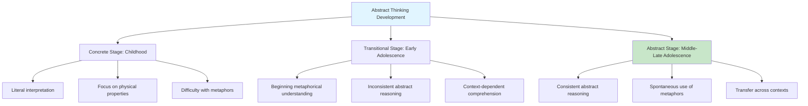
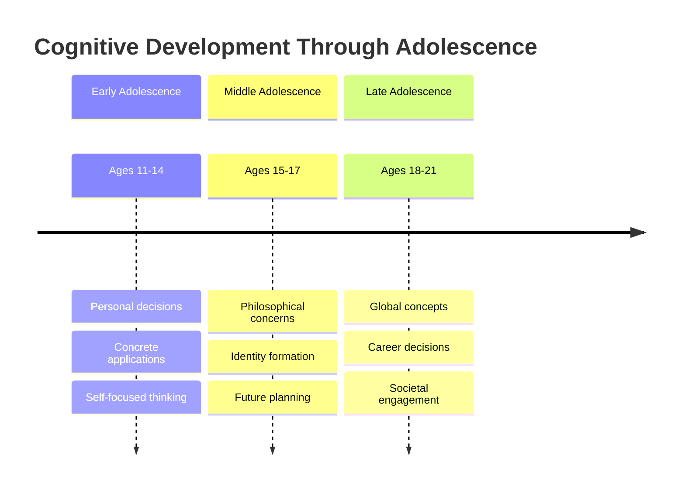
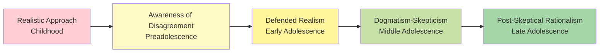

Cognitive development during adolescence represents a fundamental transformation in thinking abilities, moving from concrete operational thought to sophisticated abstract reasoning, metacognitive awareness, and multidimensional analysis.

---

**Source PDFs**: 
- 📄 [Block-3/Unit-2.pdf - Pages 17-30](/pdfs/MPC-002%20Life%20Span%20Psychology/Block-3/Unit-2.pdf)
- 📚 MPC-002 Life Span Psychology

---

## Understanding Cognitive Development

### Definition and Scope

**Cognitive Development** refers to the development of the ability to think and reason. It encompasses how a person perceives, thinks, and gains understanding of their world through the interaction of genetic and learned factors.

**Key Components**:
- Perception and attention
- Memory and information processing
- Reasoning and problem-solving
- Language and communication
- Metacognition (thinking about thinking)

:::info Real-World Application
Modern neuroscience confirms that adolescent cognitive changes correlate with ongoing brain maturation, particularly in the prefrontal cortex and limbic system. [Research from 2024](https://doi.org/10.1016/j.neuroimage.2024.120485) shows that these structural changes directly support the five major cognitive advances described in this unit.
:::

**Acceleration During Adolescence**: Cognitive development takes a fast pace during adolescence. Teenagers accumulate general knowledge and start applying learned concepts to new tasks with increasing sophistication.

### The Cognitive Transition

A major component of passage through adolescence is a **cognitive transition**. During this stage, adolescents think in ways that are:
- More **advanced** than children
- More **efficient** in processing
- Generally more **complex** in structure

This transition affects all aspects of adolescent life—school performance, relationships, decision-making, identity formation, and future planning.

## Five Major Cognitive Advances

### 1. Thinking About Possibilities (Hypothetical Thought)

**Child's Approach**:
- Thinking oriented to the **here and now**
- Focus on things and events that can be **observed directly**
- Limited to concrete, tangible reality

**Adolescent's Advance**:
- Able to consider what they observe **against a backdrop of what is possible**
- Can think **hypothetically** about situations that don't currently exist
- Generate alternative scenarios and outcomes
- Engage in "what if" reasoning

**Example**: When facing a problem, children focus on immediate visible solutions, while adolescents can generate multiple hypothetical solutions and evaluate them mentally before acting.

:::tip Clinical Example
A 12-year-old asked to solve a social conflict might say "Just apologize." A 16-year-old considering the same situation might generate multiple scenarios: "I could apologize directly, or write a note, or wait a few days, or have a friend help mediate—each approach has different possible outcomes."
:::

### 2. Abstract Thinking

**Developmental Shift**:
- Children struggle with abstract concepts
- Adolescents find it **easier to comprehend higher-order, abstract logic**

**Manifestations**:
- Understanding **puns, proverbs, metaphors, and analogies**
- Grasping symbolic meanings
- Comprehending philosophical concepts
- Dealing with theoretical ideas

**Application to Complex Domains**:
- **Interpersonal relationships**: Understanding complex social dynamics
- **Politics**: Grasping systems of governance and ideology
- **Philosophy**: Engaging with existential questions
- **Religion**: Contemplating spiritual and theological concepts
- **Morality**: Reasoning about ethical principles

**Example**: Adolescents can understand that "A rolling stone gathers no moss" is not literally about stones, but about the consequences of constant change or the benefits of staying active.

### 3. Metacognition (Thinking About Thinking)

**Definition**: The ability to think about the process of thinking itself

**Characteristics**:
- Increased **introspection** (examining own thoughts)
- Enhanced **self-consciousness** (awareness of being aware)
- Ability to monitor and evaluate own cognitive processes
- Understanding of learning strategies and memory techniques

**Benefits**:
- Better learning strategies
- Improved problem-solving
- Enhanced self-regulation
- More effective decision-making

**Potential Drawback - Adolescent Egocentrism**:
- Intense **preoccupation with the self**
- Belief that one's thoughts and experiences are unique
- **Imaginary audience**: Feeling constantly observed and judged by others
- **Personal fable**: Belief in one's own uniqueness and invulnerability

:::info Research Insight
[Duell & Steinberg (2019)](https://doi.org/10.1146/annurev-psych-010418-102934) found that metacognitive abilities show significant improvement between ages 11-17, with particular gains in strategy use and self-monitoring. However, application of these skills in emotionally charged situations develops more gradually.
:::

📊 **Metacognitive Development Timeline**

| Age Range | Metacognitive Capacity | Example Behavior |
|-----------|------------------------|------------------|
| **11-13 years** | Emerging awareness | "I know I should study, but..." |
| **14-16 years** | Active monitoring | "I'm using flashcards because they work better for me than rereading" |
| **17-19 years** | Strategic regulation | "I notice I learn best in the morning, so I'll schedule difficult subjects then" |
| **20+ years** | Flexible adaptation | "This strategy isn't working; let me try a different approach based on what I know about how I learn" |

### 4. Multidimensional Thinking

**Child's Limitation**:
- Tend to think about things **one aspect at a time**
- Single-dimension focus

**Adolescent's Capacity**:
- Can see things through **more complicated lenses**
- Simultaneously consider **multiple perspectives**
- Integrate different dimensions of a problem

**Applications**:
- **Self-descriptions**: More differentiated and complicated
- **Describing others**: Nuanced personality assessments
- **Problem analysis**: Considering multiple factors simultaneously
- **Social situations**: Understanding different viewpoints

**Example**: When evaluating a friend's behavior, adolescents can simultaneously consider the friend's intentions, circumstances, personality traits, and the observer's own biases—whereas children might focus on just one aspect.

### 5. Relativistic Thinking

**Child's View**:
- See things in **absolute terms** (black and white)
- Accept facts as unchangeable truths
- Limited questioning of authority

**Adolescent's Perspective**:
- See things as **relative** and context-dependent
- More likely to **question others' assertions**
- Less likely to **accept facts as absolute truths**
- Understand that different interpretations are possible

**Consequences**:
- **Positive**: Critical thinking, independent judgment
- **Challenging**: May question everything "just for the sake of argument"
- **Parent frustration**: Adolescents may see parents' values as "excessively relative"

**Example**: When told "That's just the way it is," children accept it, while adolescents ask "But why? Who decided? What's the evidence?"

## Progression Through Adolescent Stages

### Early Adolescence (Ages 11-14)

**Focus**: Personal decision-making in school and home environments

**Cognitive Characteristics**:
- Begin to demonstrate use of **formal logical operations** in schoolwork
- Start to **question authority and societal standards**
- Form and verbalize own thoughts and views on personally relevant topics

**Typical Concerns**:
- Which sports are better to play
- Which peer groups are desirable to join
- What personal appearances are attractive
- What parental rules should be changed

**Thinking Style**: 
- More complex than childhood
- Still largely **self-focused**
- Concrete applications of abstract thinking

:::tip Educational Implication
Teachers and parents can support early adolescent thinking by:
- Providing opportunities for hypothesis generation ("What do you think would happen if...?")
- Encouraging perspective-taking in low-stakes situations
- Teaching explicit metacognitive strategies
- Accepting and validating questioning behavior while maintaining appropriate boundaries
:::

### Middle Adolescence (Ages 15-17)

**Focus**: Philosophical and futuristic concerns expand significantly

**Cognitive Expansion**:
- Question more **extensively** (depth and breadth)
- Analyze more **systematically**
- Form own **code of ethics** ("What do I think is right?")
- Develop their **own identity** ("Who am I?")
- Consider **possible future goals** ("What do I want?")
- Make their **own plans** (short and long-term)
- Begin to think on **long-term basis**

**Social Cognition**:
- Systematic thinking begins to **influence relationships with others**
- More sophisticated understanding of social dynamics
- Ability to take others' perspectives more consistently

### Late Adolescence (Ages 18-21)

**Focus**: Less self-centered concepts and broader societal engagement

**Cognitive Maturation**:
- Think about **global concepts**: justice, history, politics, patriotism
- Develop **idealistic views** on specific topics or concerns
- Engage in **debate and discussion** (may show intolerance to opposing views initially)
- Focus thinking on **making career decisions**
- Concentrate on **emerging role in adult society**

**Characteristics**:
- More balanced integration of abstract and concrete thinking
- Better regulation of metacognitive processes
- Increasing flexibility in thought
- Growing wisdom and judgment

## Cultural Variations

**Important Context**: Adolescence can be prolonged, brief, or virtually nonexistent, depending on the type of culture.

**Simple Societies**:
- Transition from childhood to adulthood tends to occur **rather rapidly**
- Marked by **traditionally prescribed passage rites**
- Less extended adolescent period

**Complex Industrialized Societies**:
- **Prolonged adolescence** (extending into 20s)
- Extended educational requirements
- Delayed economic independence
- Complex career preparation

:::info Cross-Cultural Research
Studies from [Arnett & Jensen (2015)](https://doi.org/10.1111/jora.12195) document how cognitive development patterns vary significantly across cultures. While the basic sequence remains similar, the timing, emphasis, and cultural value placed on specific cognitive abilities differ substantially.
:::

## Development of Epistemological Understanding

**Epistemology** refers to how we understand the nature and limits of knowledge. Adolescent cognitive development includes significant changes in epistemological understanding.

### Realistic Approach (Childhood)
- Belief that knowledge is a **property of the real world**
- Assumption that there are **definite facts or truths** to be acquired
- Experts seen as knowing "the right answer"

### Awareness of Disagreement (Preadolescence)
- Recognition that **experts often disagree**
- Development of understanding that different people may **interpret the same information differently**

### Defended Realism (Early Adolescence)
- Recognition of difference between **facts and opinions**
- Beginning to evaluate sources of information
- Still searching for "right" answers

### Dogmatism-Skepticism (Middle Adolescence)
- Realization that there is **no secure basis for knowledge**
- Alternate between **blind faith in authority** and **doubting everything**
- May swing between extremes

### Post-Skeptical Rationalism (Late Adolescence/Young Adulthood)
- Understanding that while there are **no absolute truths**, there are **better or worse reasons** for holding certain views
- Development of criteria for evaluating claims
- Balanced critical thinking

## 🧠 Memory Aids

### THE FIVE A's of Adolescent Cognitive Advances

- **A**bstract thinking (understanding metaphors and symbols)
- **A**lternatives (hypothetical and possibility thinking)
- **A**wareness (metacognition - thinking about thinking)
- **A**ll-around thinking (multidimensional perspectives)
- **A**rgue everything (relativistic thinking)

### Stage Progression Mnemonic: "PLG"

- **P**ersonal concerns (Early Adolescence: 11-14)
- **L**ong-term planning (Middle Adolescence: 15-17)
- **G**lobal thinking (Late Adolescence: 18-21)

### Epistemological Development: "RADDS to Wisdom"

- **R**ealistic (childhood certainty)
- **A**wareness (noticing disagreement)
- **D**efended realism (facts vs opinions)
- **D**ogmatism-**S**kepticism (swinging extremes)
- **S**killed rationalism (post-skeptical wisdom)

## 🎥 Educational Videos

1. **[MIT OpenCourseWare: Adolescent Cognition](https://www.youtube.com/watch?v=hiduiTq1ei8)** (28 min)
   - Comprehensive overview of cognitive changes during adolescence
   - Neurobiological underpinnings of cognitive development

2. **[Khan Academy: Piaget's Stages - Formal Operational](https://www.youtube.com/watch?v=H-BOwfYvu1M)** (8 min)
   - Accessible explanation of abstract and hypothetical thinking
   - Clear examples of formal operational thought

3. **[The Brain Scoop: The Teenage Brain](https://www.youtube.com/watch?v=3IHrYp0OmWg)** (12 min)
   - Engaging discussion of neuroscience behind adolescent thinking
   - Addresses common misconceptions

## 📚 External Resources

### Academic Articles

1. **[Steinberg, L. (2005). Cognitive and affective development in adolescence. *Trends in Cognitive Sciences*, 9(2), 69-74.](https://doi.org/10.1016/j.tics.2004.12.005)**
   - Landmark review of adolescent cognitive neuroscience
   - Integration of emotional and cognitive development

2. **[Kuhn, D. (2009). Adolescent thinking. *Handbook of Adolescent Psychology*.](https://doi.org/10.1002/9780470479193.adlpsy001002)**
   - Comprehensive examination of thinking abilities
   - Educational and practical implications

3. **[Blakemore, S. J., & Choudhury, S. (2006). Development of the adolescent brain: Implications for executive function and social cognition. *Journal of Child Psychology and Psychiatry*, 47(3‐4), 296-312.](https://doi.org/10.1111/j.1469-7610.2006.01611.x)**
   - Neural basis of cognitive development
   - Executive function maturation

### Wikipedia Resources

- [Adolescent Cognitive Development](https://en.wikipedia.org/wiki/Cognitive_development#Adolescence)
- [Metacognition](https://en.wikipedia.org/wiki/Metacognition)
- [Abstract Thought](https://en.wikipedia.org/wiki/Abstraction#Thought_processes)
- [Epistemology](https://en.wikipedia.org/wiki/Epistemology)

### Additional Reading

- **[American Psychological Association: Understanding Adolescent Cognitive Development](https://www.apa.org/pi/families/resources/develop.pdf)**
- **[Society for Research in Child Development: Cognitive Development Brief](https://www.srcd.org/research)**

## 💡 Self-Assessment Questions

### Knowledge Check

1. **List and briefly describe the five major cognitive advances that occur during adolescence.**

Sample Answer

The five major cognitive advances are:
1. **Hypothetical Thinking**: Ability to consider possibilities beyond immediate reality
2. **Abstract Thinking**: Comprehension of symbolic, metaphorical, and theoretical concepts
3. **Metacognition**: Thinking about one's own thought processes
4. **Multidimensional Thinking**: Simultaneously considering multiple perspectives
5. **Relativistic Thinking**: Understanding that truth is context-dependent

2. **How does thinking change from early adolescence (11-14) to late adolescence (18-21)?**

Sample Answer

Thinking progresses from:
- **Early**: Personal, self-focused concerns about immediate environment (school, peers, appearance)
- **Middle**: Philosophical concerns, identity formation, future planning
- **Late**: Global concepts, societal engagement, career focus, integration of abstract and concrete thinking with increasing flexibility

### Application Questions

3. **A 15-year-old constantly challenges their parents' rules and asks "Why?" to everything. Using your understanding of adolescent cognitive development, explain this behavior.**

Sample Answer

This behavior reflects **relativistic thinking** and emerging **abstract reasoning**. The adolescent is:
- Moving beyond accepting rules as absolute truths
- Developing capacity to question authority
- Exercising newly developed ability to see multiple perspectives
- Practicing critical thinking skills
- Expressing cognitive developmental stage appropriate for middle adolescence

While challenging for parents, this questioning represents healthy cognitive development and should be channeled constructively rather than suppressed.

4. **How might the "imaginary audience" phenomenon affect an adolescent's behavior at school?**

Sample Answer

The imaginary audience (part of metacognitive development and adolescent egocentrism) might cause:
- **Heightened self-consciousness** about appearance and behavior
- **Reluctance to participate** in class for fear of judgment
- **Excessive concern** about small mistakes or embarrassing moments
- **Dramatic reactions** to perceived slights or criticism
- **Attention-seeking behavior** or extreme efforts to fit in
- **Social anxiety** in performance situations

Understanding this helps educators create supportive environments that reduce performance anxiety while maintaining academic standards.

### Critical Thinking

5. **How might cultural context influence the expression and development of relativistic thinking in adolescents?**

Sample Answer

Cultural context significantly shapes relativistic thinking:

**Collectivist Cultures**:
- May emphasize respect for authority and tradition
- Questioning might be channeled into specific acceptable domains
- Group harmony valued over individual critical analysis
- Development might be present but expressed differently

**Individualist Cultures**:
- Often explicitly encourage questioning and independent thinking
- Critical analysis seen as desirable trait
- Greater tolerance for adolescent challenges to authority
- Institutional support for developing this skill

**Cross-Cultural Considerations**:
- The cognitive capacity develops similarly across cultures
- Expression and cultural value vary significantly
- Educational systems either encourage or discourage relativistic thinking
- Family communication patterns shape how questioning is received

6. **Design an educational activity that would support the development of multidimensional thinking for middle adolescents (15-17 years).**

Sample Answer

**Activity: Multi-Perspective Historical Analysis**

**Objective**: Analyze a historical event from multiple stakeholder perspectives

**Structure**:
1. Select complex historical event (e.g., decision to use atomic bombs in WWII)
2. Assign students different stakeholder roles:
   - Military commanders
   - Political leaders
   - Japanese civilians
   - American soldiers
   - Scientists involved in Manhattan Project
   - International observers
3. Each group researches their perspective considering: factual situation, emotional responses, ethical considerations, long-term consequences, contextual pressures
4. Present findings emphasizing how same event looks different from each perspective
5. Facilitate synthesis discussion integrating all perspectives

**Why It Works**:
- Requires simultaneous consideration of multiple dimensions
- Develops empathy and perspective-taking
- Practices abstract and hypothetical thinking
- Engages relativistic reasoning
- Mirrors real-world complexity

## Summary

Cognitive development during adolescence represents a fundamental transformation characterized by five major advances: hypothetical thinking, abstract reasoning, metacognition, multidimensional thinking, and relativistic thinking.

**Key Takeaways**:

1. **Progressive Development**: Cognitive abilities develop through three distinct stages (early, middle, late adolescence), each with characteristic thinking patterns and concerns

2. **Neural Basis**: These cognitive changes correlate with ongoing brain maturation, particularly in prefrontal and limbic regions

3. **Individual Variation**: While the general sequence is universal, timing and expression vary based on individual differences, cultural context, and educational experiences

4. **Educational Implications**: Understanding these developmental stages helps educators and parents provide appropriate support and challenges

5. **Epistemological Growth**: Adolescents progressively develop more sophisticated understanding of knowledge itself, moving from absolute to nuanced thinking

These advances progress through three stages (early, middle, and late adolescence), each with distinct characteristics and concerns. Understanding these cognitive changes is essential for supporting adolescents through this transformative period and designing developmentally appropriate educational experiences.

---

**Related Topics**:
- [Piaget's Formal Operational Stage](/mpc-002/block-3/piaget-formal-operations)
- [Information Processing in Adolescence](/mpc-002/block-3/information-processing-adolescence)
- [School Performance and Cognitive Development](/mpc-002/block-3/school-cognitive-development)

---

**🔄 Continue Learning**: The next section explores Piaget's formal operational stage in detail, examining how abstract logical reasoning develops and its implications for adolescent problem-solving.