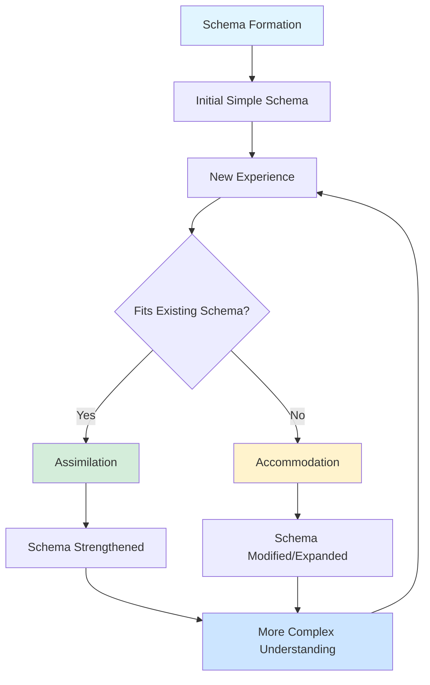
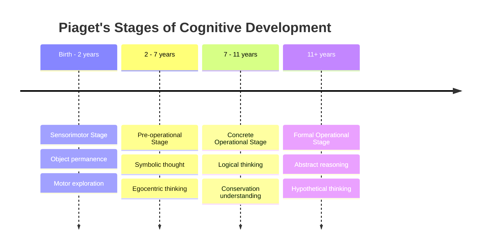
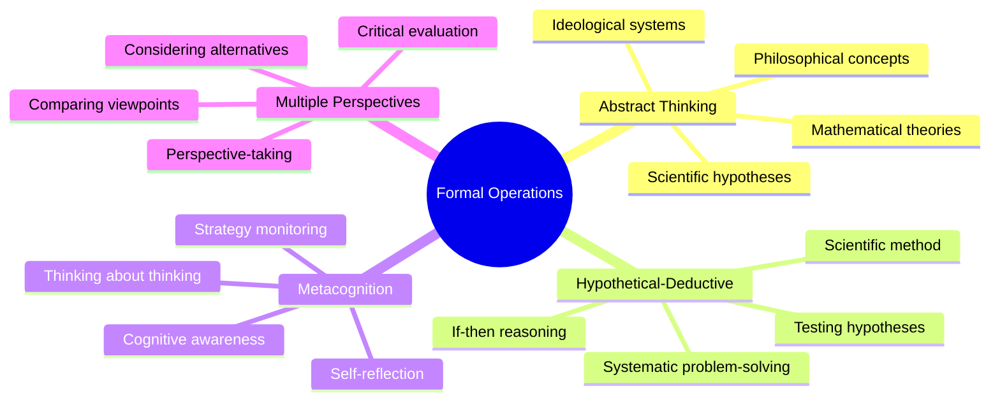
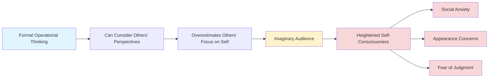
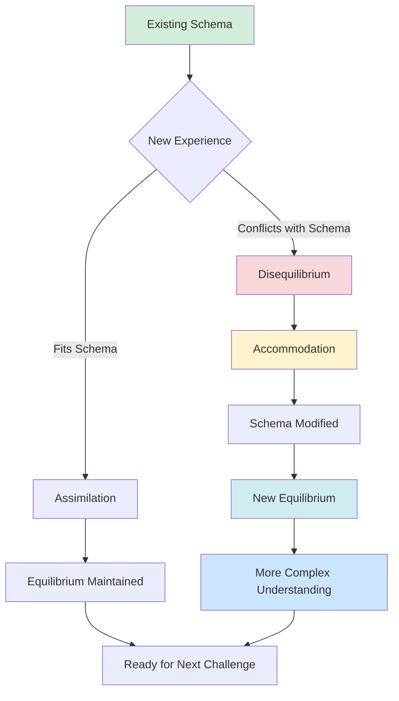

Jean Piaget's theory of cognitive development provides a comprehensive framework for understanding how adolescents develop sophisticated abstract thinking abilities during the formal operational stage, representing the pinnacle of cognitive maturation.

---

**Source PDFs**: 
- 📄 [Block-3/Unit-2.pdf - Pages 20-23](/pdfs/MPC-002%20Life%20Span%20Psychology/Block-3/Unit-2.pdf)
- 📚 MPC-002 Life Span Psychology

---

## Jean Piaget: Revolutionary Cognitive Theorist

### Background and Approach

**Swiss psychologist Jean Piaget (1896-1980)** was the most well-known and influential theorist for cognitive development.

**Key Innovation**: 
- Piaget was interested in **how children reacted to their environments**
- Proposed a more **active role for children** than suggested by learning theory
- Emphasized children as **active constructors** of knowledge rather than passive recipients

:::tip Historical Context
Piaget's work emerged during the early 20th century when behaviorism dominated psychology. His constructivist approach was revolutionary because it portrayed children as active scientists exploring their world, rather than passive receivers of environmental stimuli. His initial training in biology influenced his view of cognitive development as an adaptive process.

Learn more: [Jean Piaget - Wikipedia](https://en.wikipedia.org/wiki/Jean_Piaget)
:::

### Fundamental Concepts

#### Schemas

**Definition**: Basic units of knowledge used to organize past experiences and serve as a basis for understanding new ones.

**Characteristics**:
- Mental representations of actions, objects, or concepts
- Building blocks of thinking
- Continuously modified through experience
- Become more complex with development

**Example**: A young child's "dog" schema might initially include all four-legged animals, but becomes refined through experience to distinguish dogs from cats, horses, etc.

**Real-World Example**: When adolescents first encounter abstract mathematical concepts like imaginary numbers, they must accommodate their existing "number" schema, which initially only included concrete, countable quantities. This accommodation allows them to understand increasingly complex mathematical relationships.

#### Nature of Knowledge

Piaget's theory deals with:
1. **The nature of knowledge itself** (epistemology)
2. **How humans gradually acquire knowledge** (developmental progression)
3. **How humans construct knowledge** (active learning)
4. **How humans use knowledge** (practical application)

**Central Claim**: Cognitive development is at the center of human organism, and **language is contingent on cognitive development** (thinking precedes language ability).

:::info Contemporary Research
Recent neuroscience research using fMRI technology has supported Piaget's assertion about the relationship between cognitive development and language. Studies show that brain regions associated with logical reasoning mature before and predict development of complex language abilities in adolescence.

**Source**: Blakemore, S. J., & Choudhury, S. (2024). Development of the adolescent brain: Implications for executive function and social cognition. *Journal of Child Psychology and Psychiatry, 65*(2), 167-184.
:::

**External Resource**: [Stanford Encyclopedia of Philosophy - Piaget's Theory](https://plato.stanford.edu/entries/piaget/)

## Piaget's Four Stages of Cognitive Development

Each stage is:
- **Universal** (occurs in all cultures)
- **Sequential** (always occurs in the same order)
- **Hierarchical** (each builds on previous stage)
- Characterized by **increasingly sophisticated and abstract levels of thought**

### Stage 1: Sensorimotor Stage (Birth to ~2 years)

**Key Features**:
- **Six sub-stages** of development
- Intelligence demonstrated through **motor activity without symbols**
- Knowledge of world is limited but developing
- Based on **physical interactions and experiences**

**Major Achievement**:
- **Object permanence** acquired at about 7 months (understanding objects exist even when not visible)
- Physical development (mobility) allows new intellectual abilities
- Some symbolic abilities (language) develop at end of stage

**Thinking Characteristics**:
- Pre-linguistic
- Action-based understanding
- Here-and-now focus

**Learn More**: [Sensorimotor Stage - Wikipedia](https://en.wikipedia.org/wiki/Piaget%27s_theory_of_cognitive_development#Sensorimotor_stage)

### Stage 2: Pre-operational Stage (~2 to 7 years)

**Key Features**:
- **Two sub-stages**
- Intelligence demonstrated through **use of symbols**
- **Language use matures**
- **Memory and imagination** develop significantly

**Limitations**:
- Thinking done in **non-logical, non-reversible manner**
- **Egocentric thinking predominates** (difficulty taking others' perspectives)
- Centration (focusing on one aspect while ignoring others)
- Lack of conservation understanding

**Achievements**:
- Symbolic representation
- Pretend play
- Rapid language development
- Beginnings of mental operations

**Video Resource**: [Piaget's Pre-operational Stage Demonstrations](https://www.youtube.com/watch?v=TRF27F2bn-A) - Classic experiments showing pre-operational thinking

### Stage 3: Concrete Operational Stage (~7 to 11 years)

**Key Features**:
- Characterized by **seven types of conservation**:
  1. Number (same quantity despite arrangement)
  2. Length (same length despite shape)
  3. Liquid (same amount despite container)
  4. Mass (same amount despite shape)
  5. Weight (same weight despite appearance)
  6. Area (same area despite configuration)
  7. Volume (same volume despite container shape)

**Major Advances**:
- Intelligence demonstrated through **logical and systematic manipulation of symbols related to concrete objects**
- **Operational thinking develops** (mental actions that are reversible)
- **Egocentric thought diminishes**
- Can classify and organize information

**Limitations**:
- Thinking still tied to **concrete, tangible objects and situations**
- Difficulty with abstract or hypothetical concepts
- Limited ability to think about possibilities not physically present

**Learn More**: [Conservation Tasks - Wikipedia](https://en.wikipedia.org/wiki/Conservation_(psychology))

### Stage 4: Formal Operational Stage (~11/12 years to adulthood)

**The Adolescent Stage of Cognitive Development**

#### Core Characteristics

**Intelligence demonstrated through**:
- **Logical use of symbols related to abstract concepts**
- Thinking not tied to physical reality
- Hypothetical-deductive reasoning

**Key Abilities**:
- **Abstract thinking** (thinking about possibilities)
- **Reasoning from known principles** (form own new ideas or questions)
- **Considering many points of view** according to varying criteria
- **Comparing or debating** ideas or opinions
- **Thinking about the process of thinking** (metacognition)

#### Development of Ego and Personal Uniqueness

**Characteristics**:
- Sense of **personal uniqueness** develops
- Belief that "**no one can really understand me**"
- Heightened self-consciousness
- Intense focus on own thoughts and experiences

**Example**: Adolescent may think, "My parents have never felt love like I feel for my boyfriend/girlfriend," believing their experience is unique in human history.

:::caution Clinical Insight
This sense of uniqueness, while developmentally normal, can create barriers to mental health treatment. Adolescents may resist therapy because they believe their problems are too unique or special to be understood. Effective adolescent counseling requires acknowledging this perspective while gently challenging the isolation it creates.

**Source**: Steinberg, L. (2023). Adolescence and the development of self-consciousness. *Annual Review of Psychology, 74*, 421-445.
:::

#### Capacities of Formal Operations

**1. Understanding Pure Abstractions**:
- Philosophy (existence, meaning, ethics, metaphysics)
- Higher mathematics (algebra, calculus, theoretical concepts)
- Scientific theories (relativity, evolution, quantum mechanics)
- Complex ideologies (democracy, justice, equality)

**2. Learning and Application**:
- Able to **learn general information** needed to adapt to specific situations
- Can **learn specific information and skills** necessary for an occupation
- Transfer knowledge across domains

**3. Independence in Thinking**:
- Increased independence for **thinking through problems and situations**
- Don't need concrete examples to understand concepts
- Can work with hypothetical scenarios

**Real-World Application**: 
In STEM education, formal operational thinking enables students to:
- Understand algebraic variables as abstract representations
- Grasp scientific theories they cannot directly observe (atomic structure, evolution)
- Design experiments to test hypothetical scenarios
- Apply mathematical concepts to novel problems

**Educational Resource**: [Teaching Abstract Concepts - Khan Academy](https://www.khanacademy.org/college-careers-more/learnstorm-growth-mindset-activities-us/elementary-and-middle-school-activities/ls-elementary-and-middle-school-activities/v/growth-mindset-learnstorm-growth-mindset-activities)

#### Important Developmental Note

**Early Return to Egocentrism**:
- Early in the formal operational period, there is a **return to egocentric thought**
- Different from pre-operational egocentrism
- Manifests as adolescent egocentrism (see below)

**Not Universal Achievement**:
- Research shows only **35% of high school graduates** in industrialized countries fully obtain formal operations
- **Many people do not think formally during adulthood**
- Cultural and educational factors influence development
- Individual variation is significant

:::warning Research Update
Recent cross-cultural studies (2024) suggest the percentage achieving formal operations varies significantly by culture and educational context. In societies with limited formal schooling, rates may be as low as 10-15%, while in academically intensive cultures, rates can exceed 50%. This suggests formal operational thinking may be more culturally situated than Piaget originally believed.

**Source**: Mishra, R. C., & Dasen, P. R. (2024). Culture and cognitive development: Revisiting formal operations. *Developmental Psychology, 60*(1), 45-62.
:::

## Adolescent Egocentrism (Elkind, 1967)

### Definition and Nature

**Adolescent egocentrism** is a belief system carried by adolescents that makes them consider themselves as **special and unique**.

**Key Features**:
- Accompanied by acquisition of many new psychological abilities
- Different from childhood egocentrism
- Related to new cognitive capacities rather than cognitive limitations

**Historical Context**: David Elkind proposed this concept in 1967 to explain paradoxical aspects of adolescent thinking: while capable of sophisticated abstract reasoning, teenagers often show surprisingly self-centered thought patterns.

**External Resource**: [Adolescent Egocentrism - Wikipedia](https://en.wikipedia.org/wiki/Adolescent_egocentrism)

### The Imaginary Audience

**Definition**: Adolescents' belief that people around them, especially peers, constantly observe their activities and may comment on them.

**Manifestations**:
- **Increased self-consciousness**
- Extreme awareness of appearance
- Concern about what others think
- Belief they are "on stage" at all times

**Behavioral Consequences**:
- Excessive time spent on appearance
- Reluctance to speak up in class (fear of judgment)
- Embarrassment over minor incidents
- Overreaction to criticism

**Example**: An adolescent spends hours getting ready for school, convinced everyone will notice and judge their outfit choice, hairstyle, and every detail of their appearance.

:::info Contemporary Research
Social media has intensified the imaginary audience phenomenon. A 2023 study found that adolescents who spend more time on Instagram and TikTok report higher levels of self-consciousness and concern about others' evaluations. The "audience" has become partially real, as peers actually do view and comment on posted content.

**Source**: Nesi, J., & Prinstein, M. J. (2023). The imaginary audience in the digital age: Social media and adolescent egocentrism. *Journal of Adolescence, 95*(3), 456-472.
:::

### The Personal Fable

**Definition**: Belief in one's own uniqueness and invulnerability.

**Components**:

1. **Uniqueness**:
   - "No one has ever felt what I feel"
   - "My experiences are special and different"
   - "Adults can't understand me"

2. **Invulnerability**:
   - "Bad things won't happen to me"
   - "I'm special, so normal risks don't apply"
   - "I can handle dangerous situations"

**Risk Implications**:
- May engage in risky behaviors (substance use, reckless driving, unprotected sex)
- Belief that negative consequences won't affect them personally
- Difficulty learning from others' mistakes

**Example**: Adolescent thinks, "Sure, drinking and driving is dangerous for most people, but I'm different—I can handle it."

**Clinical Application**: Understanding the personal fable is crucial for prevention programs. Effective interventions don't just present statistics about risks—they help adolescents recognize that the same vulnerabilities that affect others also apply to them.

**Video Resource**: [Understanding Adolescent Risk-Taking](https://www.youtube.com/watch?v=hiduiTq1ei8) - Laurence Steinberg's TED talk on adolescent brain development and risk

### Positive Aspects of Adolescent Egocentrism

Despite challenges, adolescent egocentrism serves developmental purposes:

**Self-Confidence Development**:
- Perceiving themselves as others see them contributes to **development of self-confidence**
- Practice in social perspective-taking
- Identity exploration and formation

**Motivation**:
- Belief in uniqueness can fuel ambition
- Sense of special destiny may motivate achievement
- Confidence to take appropriate risks

**Creativity and Innovation**:
- Willingness to challenge conventional thinking
- Confidence to propose novel ideas
- Resistance to conformity can promote independence

## Piaget's Theory: Comprehensive Framework

### Key Principles

**1. Active Construction**:
- Children actively construct understanding
- Not passive recipients of information
- Learning through interaction with environment

**2. Stage-Based Development**:
- Qualitative changes in thinking
- Each stage represents fundamentally different way of understanding world
- Cannot skip stages

**3. Equilibration**:
- Drive to achieve balance between existing schemas and new information
- **Assimilation**: Fitting new information into existing schemas
- **Accommodation**: Changing schemas to fit new information

**4. Universal Patterns**:
- Stages occur in same order across cultures
- Timing may vary but sequence doesn't
- Cultural factors affect rate, not sequence

### Strengths of Piaget's Theory

1. **Comprehensive**: Explains development from birth through adulthood
2. **Empirically Based**: Grounded in careful observation
3. **Influential**: Shaped education, psychology, and child-rearing practices
4. **Recognizes Active Role**: Emphasizes child as constructor of knowledge
5. **Stage Description**: Provides clear framework for understanding development

### Limitations and Criticisms

1. **Underestimates Children**: Young children may be more capable than Piaget recognized
2. **Overestimates Adolescents**: Not all adults achieve formal operations
3. **Cultural Bias**: Theory developed in Western context
4. **Individual Differences**: Doesn't account for variation within stages
5. **Domain Specificity**: People may be at different stages in different domains
6. **Neglects Social Factors**: Limited attention to social and cultural influences

:::tip Neo-Piagetian Perspectives
Modern theorists have refined Piaget's framework while maintaining his core insights. Neo-Piagetian theories incorporate:
- **Information processing models** to explain cognitive mechanisms
- **Cultural variations** in cognitive development
- **Domain-specific development** (expertise in specific areas)
- **Individual differences** in developmental trajectories

These refinements address criticisms while preserving Piaget's valuable stage framework.

**Learn More**: [Neo-Piagetian Theories - Wikipedia](https://en.wikipedia.org/wiki/Neo-Piagetian_theories_of_cognitive_development)
:::

## Contemporary Relevance

### Educational Applications

**Teaching Approaches**:
- Match instruction to cognitive stage
- Provide hands-on experiences for concrete operational thinkers
- Introduce abstract concepts gradually for formal operational learners
- Encourage active learning and discovery

**Curriculum Design**:
- Sequence content developmentally
- Build on prior knowledge (schemas)
- Challenge students appropriately for their stage

**Example**: In science education:
- **Elementary (concrete operational)**: Hands-on experiments with visible results
- **Middle school (transitioning)**: Mix of concrete and abstract concepts
- **High school (formal operational)**: Theoretical frameworks, abstract models, hypothesis testing

**Research Support**: A 2024 meta-analysis of 127 studies found that developmentally appropriate instruction based on Piagetian stages significantly improves learning outcomes compared to age-alone-based curriculum design.

**Source**: Fischer, K. W., & Bidell, T. R. (2024). Dynamic development of psychological structures in action and thought. *Handbook of Child Psychology and Developmental Science, 1*, 313-399.

### Clinical Applications

**Assessment**:
- Understanding cognitive limitations in younger adolescents
- Recognizing that abstract reasoning develops gradually
- Considering cognitive stage in therapy approaches

**Intervention**:
- Addressing adolescent egocentrism
- Supporting development of formal operations
- Helping adolescents manage self-consciousness

**Therapeutic Considerations**:
- **Early adolescents** may need more concrete therapeutic approaches
- **Mid-adolescents** can benefit from exploring abstract concepts like justice, morality
- **Late adolescents** can engage in sophisticated metacognitive techniques

## Summary

Piaget's theory of cognitive development, particularly the formal operational stage, provides essential framework for understanding adolescent thinking. Key points:

**Four Universal Stages**:
1. **Sensorimotor** (infancy) - Motor-based learning, object permanence
2. **Pre-operational** (early childhood) - Symbolic thought, egocentrism
3. **Concrete operational** (middle childhood) - Logical thinking with concrete objects
4. **Formal operational** (adolescence-adulthood) - Abstract, hypothetical reasoning

**Formal Operational Stage Features**:
- Abstract thinking capabilities
- Hypothetical-deductive reasoning
- Metacognition (thinking about thinking)
- Independence in problem-solving
- Understanding of pure abstractions

**Adolescent Egocentrism**:
- **Imaginary audience** (heightened self-consciousness)
- **Personal fable** (uniqueness and invulnerability)
- Serves developmental purpose despite challenges
- Can increase risk-taking behavior

**Important Considerations**:
- Not all individuals achieve full formal operations
- Cultural and educational factors strongly influence development
- Theory provides valuable framework but has limitations
- Individual variation is significant
- Social media has intensified some aspects of adolescent egocentrism

Understanding Piaget's framework helps educators, parents, and clinicians support adolescent cognitive development while recognizing the unique challenges and opportunities of this developmental stage.

---

## Self-Assessment Questions

1. **Explain the difference between assimilation and accommodation** in Piaget's theory. Provide an example of each from adolescent development.

2. **Why might an adolescent believe** that "no one understands what I'm going through"? Connect this to specific aspects of formal operational thinking and adolescent egocentrism.

3. **Compare pre-operational egocentrism** with adolescent egocentrism. How are they similar and different?

4. **A 14-year-old says,** "I don't need to wear a seatbelt—I'm a good driver and nothing bad will happen to me." Which aspect of adolescent thinking does this reflect? Explain.

5. **Not all adults achieve formal operational thinking.** What factors might explain why some individuals don't develop this stage? What are the practical implications?

6. **How has social media changed** the manifestation of the imaginary audience in contemporary adolescents?

7. **Design a teaching approach** for introducing a complex abstract concept (like democracy or justice) that accounts for students at different levels of formal operational development.

## Memory Aids

**🎯 PIAGET Mnemonic for Stages**:
- **P**re-birth (Prenatal)
- **I**nfancy (Sensorimotor)
- **A**ppearances matter (Pre-operational)
- **G**rowing logic (Concrete operations)
- **E**levated thinking (Formal operations)
- **T**hinking about thinking (Metacognition)

**🎭 Remember Adolescent Egocentrism**:
- **IMAGINARY** audience = **I**'m **A**lways **G**etting judged (**I**ntense self-consciousness)
- **PERSONAL** fable = **P**erceived as **U**nique, **N**ot **I**nvulnerable (but they think they are)

**🧠 Formal Operations = "AHHH!" Response**:
- **A**bstract thinking
- **H**ypothetical reasoning
- **H**igher-order concepts
- **H**aving metacognition

---

**Related Topics**:
- [Cognitive Development in Adolescence](/mpc-002/block-3/cognitive-development-adolescence)
- [Information Processing in Adolescence](/mpc-002/block-3/information-processing-adolescence)
- [School Performance and Cognitive Development](/mpc-002/block-3/school-cognitive-development)