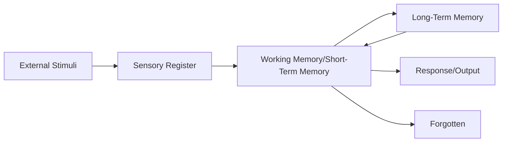

Information processing theory provides a computer-inspired framework for understanding how adolescents acquire, store, retrieve, and use information, offering insights into the mechanisms underlying cognitive development during this critical period.

---

**Source PDFs**: 
- 📄 [Block-3/Unit-2.pdf - Pages 23-27](/pdfs/MPC-002%20Life%20Span%20Psychology/Block-3/Unit-2.pdf)
- 📚 MPC-002 Life Span Psychology

---

## Understanding Information Processing

### Definition

**Information Processing** is the change (processing) of information in any manner detectable by an observer.

**Scope**:
- Describes everything that happens (changes) in the universe
- From simple physical changes to complex mental operations
- In psychology: focus on how the mind transforms, reduces, elaborates, stores, recovers, and uses information

**Key Principle**: We deal with information in sequential steps, much like a computer processes data.

### Core Concept

**Information Processing as Sequential Activity**: 
- Information comes from the external world
- Enters through sensory registers
- Moves through various processing stages
- Results in storage, retrieval, and use

**Cognitive Psychology Context**:
- Investigates internal mental processes of thought
- Includes: visual processing, memory, thinking, learning, feeling, problem-solving, and language
- Different from previous psychological approaches

## Historical Development

### Origins (1950s)

**Technological Catalyst**: Development of high-speed computers

**Key Researchers**: 
- **Herbert Simon** and colleagues demonstrated that computers could simulate human intelligence
- Realization that computer-oriented models could provide new insights into human cognition

### Revolutionary Impact

**Ended Behaviorism's Dominance**:
- Focused on **innate mental capacities** rather than externally observable behavior
- Reestablished **internal thought processes** as legitimate area of scientific inquiry

**Methodological Advance**:
- Enabled experimental psychologists to **test theories about complex mental processes** through computer simulation
- Provided rigorous scientific methods for studying consciousness

### Distinguishing Features

**Two Major Differences from Previous Approaches**:

1. **Accepts the Scientific Method**:
   - Systematic observation and experimentation
   - Testable hypotheses
   - Replicable findings

2. **Rejects Introspection as Primary Method**:
   - Unlike Freudian approach, does **not believe in symbolism** as primary data
   - Focuses on observable cognitive processes
   - Uses experimental rather than clinical methods

**Acknowledges Internal Mental States**:
- Explicitly recognizes existence of **belief, desire, and motivation**
- Studies these scientifically without relying solely on subjective reports

## The Information Processing Model

### Three-Component Structure

### 1. Sensory Register

**Function**: First point of contact for all incoming information

**Characteristics**:
- Receives all sensory information from environment
- Very brief storage (fraction of a second to few seconds)
- Large capacity (can hold vast amounts temporarily)
- Most information never reaches conscious awareness

**Types**:
- **Iconic memory**: Visual sensory register (~0.5 seconds)
- **Echoic memory**: Auditory sensory register (~3-4 seconds)
- Other sensory modalities (touch, smell, taste)

**Selection Process**:
- **Attention** determines what moves forward
- Most information decays rapidly if not attended to
- We become consciously aware only of information we focus attention on

**Example**: Walking down a busy street, sensory register receives thousands of stimuli (sights, sounds, smells), but attention selects only few for further processing.

### 2. Working Memory (Short-Term Memory)

**Function**: Conscious processing workspace

**Characteristics**:
- **Very limited capacity**: Can attend to approximately **7 items at a time** (Miller's "magical number 7 ± 2")
- **Brief duration**: Information held for ~20-30 seconds without rehearsal
- **Active processing**: Site of conscious thought and manipulation

**Three Possible Fates for Information**:

1. **Continuous Rehearsal**:
   - Keeps information active in working memory
   - Prevents decay
   - Example: Repeating phone number until you can write it down

2. **Transfer to Long-Term Memory**:
   - Through elaboration and meaningful encoding
   - Creates more permanent storage
   - Example: Understanding concept deeply enough to remember it

3. **Forgetting**:
   - Decay through lack of rehearsal
   - Displacement by new incoming information
   - Example: Phone number forgotten when attention shifts

**Attention and Focus**:
- Information enters working memory when we **consciously direct attention** to it
- Limited capacity means selective processing
- Multitasking challenges working memory limits

### 3. Long-Term Memory

**Function**: Permanent or semi-permanent storage system

**Characteristics**:
- **Unlimited capacity**: No restrictive limit on amount of information
- **Long duration**: Information can stay for years, perhaps permanently
- **No continuous rehearsal needed**: Unlike working memory
- **Organized structure**: Information stored in networks and schemas

**Types of Long-Term Memory**:

**Declarative (Explicit) Memory**:
- **Semantic Memory**: General knowledge and facts
  - Example: Knowing that Paris is capital of France
- **Episodic Memory**: Personal experiences and events
  - Example: Remembering your 16th birthday party

**Procedural (Implicit) Memory**:
- **Skills and Procedures**: How to do things
  - Example: Riding bicycle, typing, playing instrument
- **Often automatic**: Can be performed without conscious thought

**Retrieval Process**:
- To use information from long-term memory, must **move it back to working memory**
- Called **retrieval**
- Can be:
  - **Automatic** (well-learned information)
  - **Effortful** (requires conscious searching)

**Factors Affecting Retrieval**:
- Quality of original encoding
- Organization of information
- Cues and context
- Interference from similar information
- Time since encoding

## The Executive Analogy

### Understanding Information Processing Through Business Management

**The Model**:
Information processing operates like an executive managing a business:

**Incoming Information** (Working Memory):
- Mail arriving on desk
- Phone calls
- Personal interactions
- Problems to solve
- All compete for attention

**Disposal Options**:
1. **Trash it** (Forget it)
   - Irrelevant or unimportant information
   - Quick decisions not to process further

2. **File it** (Store in Long-Term Memory)
   - Important information for future use
   - Organized for later retrieval

3. **Integrate and Refile**:
   - New information + old files (retrieved from long-term memory)
   - Integration creates updated understanding
   - Refile with new connections

4. **Complex Problem-Solving**:
   - Retrieve multiple old files (various long-term memories)
   - Integrate information in new ways
   - Attack complex problems through synthesis

**The Parallel**:
- Limited desk space = Limited working memory capacity
- Filing cabinets = Long-term memory storage
- Filing and retrieval = Encoding and retrieval processes
- Executive decisions = Metacognitive control

## Information Processing Theory: Core Beliefs

### Four Main Principles

#### 1. Thinking as Information Manipulation

**When individuals think, they**:
- **Perceive** information from environment
- **Encode** information (transform into mental representation)
- **Represent** information (create internal models)
- **Store** information in memory systems

**Thinking includes**:
- Responding to constraints on memory processes
- Working within cognitive limitations
- Optimizing use of available resources

#### 2. Focus on Change Mechanisms

**Four Critical Mechanisms** work together to bring about developmental change:

**Encoding**:
- Transforming external information into internal representation
- Quality of encoding affects later retrieval
- Development improves encoding strategies

**Strategy Construction**:
- Children must encode critical information about problems
- Use encoded information and prior knowledge together
- Construct strategies to deal with problems effectively
- Strategies become more sophisticated with development

**Automatization**:
- Processes that initially require attention become automatic
- Frees working memory capacity for other tasks
- Expertise develops through automatization
- Example: Reading becomes automatic, allowing focus on comprehension

**Generalization**:
- Transfer of strategies across situations
- Recognition of similar problem structures
- Application of learned solutions to new contexts
- Hallmark of cognitive maturity

#### 3. Self-Modification Drives Development

**Active Role**:
- Like Piaget's theory, emphasizes child's **active role** in own development
- Children not passive recipients of information

**Self-Modification Process**:
- Uses knowledge and strategies acquired from **earlier problem solutions**
- Modifies responses to new situations based on past learning
- Builds newer and more sophisticated responses from prior knowledge
- Continuous refinement and optimization

**Example**: Child who learned organizational strategy for memorizing grocery list applies similar strategy to studying for test, then refines it based on effectiveness.

#### 4. Task Analysis Is Essential

**Principle**: Not only child's developmental level but also **nature of task itself** constrains performance.

**Implications**:
- Child may possess basic ability for task in simple form
- Extra or misleading information can cause confusion
- Task complexity affects performance independently of ability
- Researchers must carefully analyze task demands

**Example**: Child capable of logical reasoning on simple problem may fail on similar problem with irrelevant information added, not due to inability but due to task complexity.

## Developmental Changes in Information Processing

### Improvements During Adolescence

**1. Processing Speed**:
- Faster processing of information
- More efficient neural pathways
- Myelination continues through adolescence
- Allows handling more complex problems

**2. Capacity**:
- Increased functional capacity of working memory
- Not necessarily larger storage, but more efficient use
- Better chunking strategies
- Less cognitive resources needed for basic processes

**3. Strategies**:
- More sophisticated encoding strategies
- Better organization of information
- Effective use of elaboration
- Strategic approach to learning and problem-solving

**4. Metacognition**:
- Better awareness of own cognitive processes
- More effective monitoring and regulation
- Understanding of memory limitations
- Strategic allocation of cognitive resources

**5. Knowledge Base**:
- Larger knowledge base facilitates new learning
- Better organized knowledge structures
- More effective retrieval cues
- Domain expertise develops

## Practical Applications

### Educational Implications

**Teaching Strategies**:
- Break complex information into manageable chunks
- Provide organizational frameworks
- Teach metacognitive strategies
- Allow time for encoding and elaboration

**Study Skills**:
- Effective rehearsal techniques
- Organization and categorization
- Elaboration and connection to prior knowledge
- Distributed practice

### Clinical Applications

**Assessment**:
- Identifying processing bottlenecks
- Evaluating working memory capacity
- Assessing strategy use
- Understanding learning difficulties

**Intervention**:
- Strategy training
- Metacognitive instruction
- Accommodations for processing limitations
- Compensatory techniques

## Comparing Information Processing and Piaget

### Similarities

- Both emphasize **active role** of learner
- Both propose developmental changes
- Both focus on internal mental processes
- Both have educational implications

### Differences

| Aspect | Piaget | Information Processing |
|--------|--------|----------------------|
| **Focus** | Qualitative stages | Gradual quantitative changes |
| **Mechanisms** | Assimilation/Accommodation | Encoding/Retrieval/Strategies |
| **Development** | Stage-based reorganization | Continuous improvement |
| **Methods** | Clinical observation | Experimental manipulation |
| **Metaphor** | Biologist/Philosopher | Computer scientist |

## Summary

Information processing theory provides a detailed framework for understanding cognitive development through the lens of how information flows through the cognitive system:

**Three-Component Model**:
1. **Sensory Register**: Brief storage of all sensory input
2. **Working Memory**: Limited capacity conscious processing (7 ± 2 items)
3. **Long-Term Memory**: Unlimited capacity permanent storage

**Key Processes**:
- **Attention**: Selecting information for processing
- **Encoding**: Transforming information for storage
- **Retrieval**: Accessing stored information
- **Rehearsal**: Maintaining information in working memory

**Four Change Mechanisms**:
1. Encoding improvements
2. Strategy construction
3. Automatization
4. Generalization

**Developmental Improvements**:
- Processing speed increases
- Working memory becomes more efficient
- Strategies become more sophisticated
- Metacognition develops
- Knowledge base expands

Understanding information processing helps explain how adolescents' cognitive improvements occur gradually through enhanced efficiency rather than through qualitative stage shifts, providing practical insights for education and intervention.

---

**Related Topics**:
- [Cognitive Development in Adolescence](/mpc-002/block-3/cognitive-development-adolescence)
- [Piaget's Formal Operational Stage](/mpc-002/block-3/piaget-formal-operations)
- [School Performance and Cognitive Development](/mpc-002/block-3/school-cognitive-development)