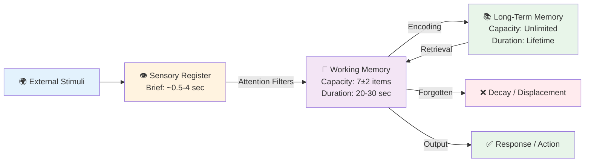
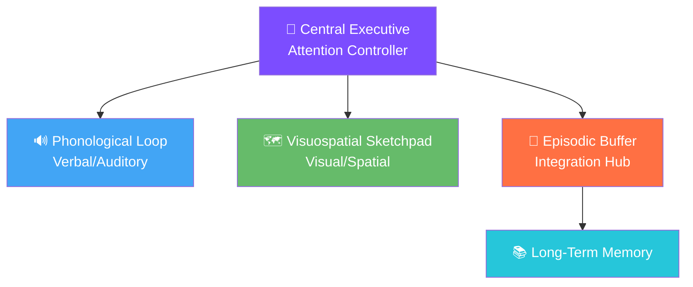
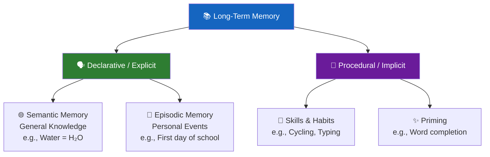
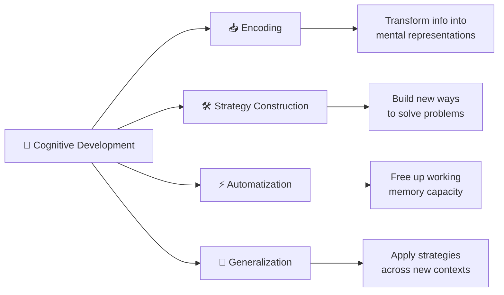

import Tabs from '@theme/Tabs';
import TabItem from '@theme/TabItem';

Information processing theory provides a computer-inspired framework for understanding how adolescents acquire, store, retrieve, and use information—offering insights into the mechanisms underlying cognitive development during this critical period. Unlike Piaget's stage model, information processing sees development as **gradual, quantitative improvements** in speed, capacity, and strategy sophistication.

---

**Source PDFs**: 
- 📄 [Block-3/Unit-2.pdf - Pages 23-27](/pdfs/MPC-002%20Life%20Span%20Psychology/Block-3/Unit-2.pdf)
- 📚 MPC-002 Life Span Psychology

---

## 🧠 Understanding Information Processing

### Definition

**Information Processing** refers to the change (processing) of information in any manner detectable by an observer. In psychology, the focus is on how the mind **transforms, reduces, elaborates, stores, recovers, and uses information**.

> **Key Principle**: We deal with information in sequential steps, much like a computer processes data — inputs enter, get manipulated, and produce outputs.

**📖 Further Reading**: [Information Processing - Wikipedia](https://en.wikipedia.org/wiki/Information_processing_(psychology))

### Historical Origins

The theory emerged in the **1950s** with the development of high-speed computers. **Herbert Simon** and colleagues demonstrated that computers could simulate human intelligence, sparking the idea that similar models could illuminate human cognition.

**Revolutionary Impact**: Information processing theory helped end behaviorism's dominance by restoring the legitimacy of studying **internal mental processes** — memory, attention, and reasoning — using experimental methods.

**📖 Further Reading**: [Cognitive Psychology - Wikipedia](https://en.wikipedia.org/wiki/Cognitive_psychology) | [Herbert Simon - Wikipedia](https://en.wikipedia.org/wiki/Herbert_A._Simon)

---

## 🖥️ The Three-Component Model

### 1. Sensory Register

**Function**: First point of contact for all incoming information from the environment.

| Feature | Detail |
|---------|--------|
| **Capacity** | Very large — receives all sensory input simultaneously |
| **Duration** | Very brief (~0.5 seconds for visual; ~3-4 seconds for auditory) |
| **Fate of unattended info** | Decays rapidly |

**Two primary types**:
- **Iconic memory**: Visual sensory register (~0.5 seconds) — studied by George Sperling
- **Echoic memory**: Auditory sensory register (~3-4 seconds)

**Attention** is the gatekeeper: of the thousands of stimuli entering the sensory register, only those attended to advance to working memory.

🎯 **Real-world example**: Walking through a crowded market, your sensory register captures hundreds of sounds, smells, and sights simultaneously — but you consciously notice only the friend calling your name.

**📖 Further Reading**: [Sensory Memory - Wikipedia](https://en.wikipedia.org/wiki/Sensory_memory)

---

### 2. Working Memory (Short-Term Memory)

Working memory is the **conscious processing workspace** of the mind — where thinking happens.

**Miller's Magic Number**: Approximately **7 ± 2 items** can be held at once (George Miller, 1956).

**Three fates of information in working memory**:
1. **Rehearsal** → Keep it active (e.g., repeating a phone number)
2. **Encoding** → Transfer to long-term memory through meaningful processing
3. **Forgetting** → Decay or displacement by new information

**Baddeley's Working Memory Model** (modern refinement) includes:
- **Phonological loop**: Handles verbal/auditory information
- **Visuospatial sketchpad**: Processes visual and spatial data
- **Episodic buffer**: Integrates information across systems
- **Central executive**: Controls attention and coordinates systems

**📖 Further Reading**: [Working Memory - Wikipedia](https://en.wikipedia.org/wiki/Working_memory) | [George Miller Magical Number - Wikipedia](https://en.wikipedia.org/wiki/The_Magical_Number_Seven,_Plus_or_Minus_Two)

---

### 3. Long-Term Memory

**Function**: Permanent or semi-permanent storage with effectively **unlimited capacity**.

**Retrieval**: To use long-term memories, information must be brought back into working memory. Retrieval can be:
- **Automatic**: Well-practiced information (recalling your own name)
- **Effortful**: Requires conscious search (recalling a formula from months ago)

**Factors affecting retrieval**: Encoding quality, organization, retrieval cues, interference, time elapsed.

**📖 Further Reading**: [Long-term Memory - Wikipedia](https://en.wikipedia.org/wiki/Long-term_memory) | [Memory Consolidation - Wikipedia](https://en.wikipedia.org/wiki/Memory_consolidation)

---

## 🔄 Four Core Change Mechanisms

Information processing theorists identify four mechanisms that drive cognitive development:

### 1. Encoding
Transforming external information into internal mental representations. Better encoding leads to better retention and retrieval. Adolescents develop richer, more elaborative encoding strategies than children.

### 2. Strategy Construction
Children and adolescents construct new cognitive strategies by using **encoded information + prior knowledge** together. Over development, strategies become more efficient and flexible.

### 3. Automatization
Processes that initially require conscious effort become **automatic through practice**, freeing working memory capacity. Example: Beginning readers must consciously decode each letter; skilled readers recognize whole words automatically, freeing mental resources for comprehension.

### 4. Generalization
The ability to **transfer strategies** learned in one context to new, structurally similar problems. This is a hallmark of mature cognitive functioning.

---

## 🧑‍💻 The Executive Analogy

A memorable way to understand information processing:

| Business Executive Analogy | Cognitive Equivalent |
|---------------------------|---------------------|
| Mail/calls on desk | Information in working memory |
| Trash it | Forget it |
| File it in cabinet | Encode to long-term memory |
| Retrieve old files | Memory retrieval |
| Integrate & refile | Learning and schema updating |
| Limited desk space | Working memory capacity limit |
| Filing cabinets | Long-term memory |

> 💡 **Memory Tip (Mnemonic)**: **SWAL** — **S**ensory register → **W**orking memory → **A**ttention & encoding → **L**ong-term memory. "**S**tudents **W**ho **A**re **L**earning" process information step by step!

---

## 📈 Adolescent Improvements in Information Processing

During adolescence, several quantitative improvements occur:

| Dimension | Change During Adolescence |
|-----------|--------------------------|
| **Processing speed** | Faster due to continued myelination and synaptic pruning |
| **Working memory capacity** | More efficient use through chunking and strategies |
| **Metacognition** | Better awareness and regulation of own cognitive processes |
| **Strategy use** | More sophisticated encoding and retrieval strategies |
| **Knowledge base** | Larger knowledge base facilitates new learning |
| **Inhibitory control** | Better suppression of irrelevant information |

**Neuroscience basis**: Continued **myelination** of prefrontal cortex connections and **synaptic pruning** during adolescence directly improves processing speed and working memory efficiency.

**📖 Further Reading**: [Adolescent Brain Development - Wikipedia](https://en.wikipedia.org/wiki/Adolescent_brain_development)

---

## 🎓 Educational Videos

- 🎥 **[Information Processing Theory | CrashCourse Psychology](https://www.youtube.com/watch?v=R-sVnmmw6WY)** — Clear overview of the model with animations (10 min)
- 🎥 **[Memory: Crash Course Psychology #13](https://www.youtube.com/watch?v=bSycdIx-C48)** — Memory systems and how they work (11 min)
- 🎥 **[Working Memory in the Classroom (MIT OpenCourseWare)](https://ocw.mit.edu/courses/9-00sc-introduction-to-psychology-fall-2011/)** — Academic lecture on memory and cognition

---

## 📰 Recent Research (2020–2024)

1. **Chai, W.J., Abd Hamid, A.I., & Abdullah, J.M. (2018/updated 2022).** "Working memory from the psychological and neurosciences perspectives: a review." *Frontiers in Psychology*. Shows that working memory training produces lasting improvements in adolescents' academic performance.

2. **Gathercole, S.E., et al. (2023).** "Working memory and learning: A practical guide for teachers." *Educational Psychology in Practice*. Demonstrates that WM capacity predicts academic achievement across all school subjects.

3. **Fandakova, Y., & Bunge, S.A. (2023).** "What connections can we draw between research on long-term memory and student learning?" *npj Science of Learning*. Reviews implications of memory science for educational practice.

4. **Baars, B.J., & Gage, N.M. (2022).** "Cognition, Brain, and Consciousness: Introduction to Cognitive Neuroscience." Updated review of information processing in the context of modern neuroscience.

5. **Bjork, R.A., & Bjork, E.L. (2020).** "Desirable difficulties in theory and practice." *Journal of Applied Research in Memory and Cognition*. Challenges traditional encoding assumptions and provides new insights for learning.

---

## 🆚 Comparing Information Processing vs. Piaget

| Aspect | Piaget's Theory | Information Processing |
|--------|----------------|----------------------|
| **Nature of change** | Qualitative stage shifts | Gradual quantitative improvements |
| **Key mechanisms** | Assimilation, accommodation | Encoding, automatization, strategies |
| **Development pattern** | Discontinuous (stages) | Continuous improvements |
| **Research method** | Clinical interviews | Experimental, computational |
| **Metaphor** | Growing organism | Computer system |
| **Active learner?** | Yes | Yes |
| **Task difficulty role?** | Less emphasized | Central — task analysis essential |

---

## ✅ Self-Assessment Questions

<Tabs>
  <TabItem value="q1" label="Question 1" default>
  
  **What are the three components of the information processing model? Briefly describe the characteristics of each.**
  
  

  
Click for Answer

  
  1. **Sensory Register**: Receives all sensory input; very large capacity but extremely brief duration (~0.5–4 seconds); most information decays unless attended to.
  
  2. **Working Memory (Short-Term Memory)**: Conscious processing space; very limited capacity (7±2 items); brief duration (~20-30 seconds without rehearsal); site of active thinking.
  
  3. **Long-Term Memory**: Permanent storage; unlimited capacity; information can last a lifetime; contains declarative (semantic + episodic) and procedural memories.
  
  

  </TabItem>
  
  <TabItem value="q2" label="Question 2">
  
  **Explain the four mechanisms that drive cognitive development according to information processing theory.**
  
  

  
Click for Answer

  
  1. **Encoding**: Transforming external information into internal mental representations. Better encoding = better retention.
  
  2. **Strategy Construction**: Building new cognitive strategies by combining encoded information with prior knowledge to solve problems more effectively.
  
  3. **Automatization**: Through practice, initially effortful processes become automatic, freeing working memory for more complex tasks.
  
  4. **Generalization**: Transferring strategies learned in one context to new, similar contexts — hallmark of cognitive maturity.
  
  

  </TabItem>
  
  <TabItem value="q3" label="Question 3">
  
  **How does information processing theory differ from Piaget's theory in explaining cognitive development?**
  
  

  
Click for Answer

  
  **Piaget**: Development occurs in qualitative stages (discrete jumps); mechanisms are assimilation and accommodation; uses clinical observation.
  
  **Information Processing**: Development is continuous and quantitative (gradual improvements in speed, capacity, strategies); key mechanisms are encoding, automatization, strategy construction, generalization; uses experimental methods and computer simulation.
  
  Both agree that learners are **active** in their own development, but differ on whether development is stage-like or continuous.
  
  

  </TabItem>
  
  <TabItem value="q4" label="Question 4">
  
  **What is Baddeley's model of working memory, and why is it considered an improvement over the simple short-term memory concept?**
  
  

  
Click for Answer

  
  Baddeley's model replaces the single "short-term memory" with a multi-component working memory:
  - **Phonological loop**: Processes verbal/auditory information
  - **Visuospatial sketchpad**: Handles visual and spatial information  
  - **Episodic buffer**: Integrates information across different systems
  - **Central executive**: Controls attention and coordinates the other components
  
  It's an improvement because it explains how we can simultaneously process verbal AND visual information (using different subsystems) and how integration with long-term memory works.
  
  

  </TabItem>
  
  <TabItem value="q5" label="Question 5">
  
  **What neuroscientific changes during adolescence explain improvements in information processing?**
  
  

  
Click for Answer

  
  - **Continued myelination**: Myelin sheaths around neural axons speed up signal transmission, increasing processing speed.
  - **Synaptic pruning**: Elimination of unused synaptic connections makes neural networks more efficient.
  - **Prefrontal cortex maturation**: Ongoing development of PFC improves inhibitory control, planning, and working memory coordination.
  - These changes lead to faster processing, better inhibition of irrelevant information, and more efficient use of working memory capacity.
  
  

  </TabItem>
</Tabs>

---

## 🏥 Clinical & Real-World Applications

### Learning Disabilities
Information processing theory helps explain learning disabilities as specific breakdowns at particular processing stages:
- **Dyslexia**: Problems at phonological encoding level
- **ADHD**: Working memory overload and attentional filtering deficits
- **Processing speed disorders**: Slow progression through the stages

### Educational Implications
- **Chunking**: Present information in 5–7 meaningful units to respect working memory limits
- **Spaced practice**: Distributes encoding across time, strengthening long-term memory traces
- **Retrieval practice**: Testing strengthens memory more than re-reading (the "testing effect")
- **Reducing cognitive load**: Minimize extraneous information competing for limited working memory

### Indian Educational Context
Indian competitive exam preparation (JEE, NEET, UPSC) places enormous demands on all three memory systems. Students who develop effective **encoding strategies** (concept mapping, mnemonics) and allow **automatization** of basic skills (arithmetic, grammar rules) free working memory for higher-order problem-solving — which explains why rote learning alone fails at advanced levels.

---

## 📋 Summary Table

| Component | Capacity | Duration | Key Process |
|-----------|----------|----------|-------------|
| Sensory Register | Very large | 0.5–4 seconds | Attention |
| Working Memory | 7±2 items | 20–30 seconds | Encoding/Rehearsal |
| Long-Term Memory | Unlimited | Lifetime | Retrieval |

**Four Development Mechanisms**: Encoding → Strategy Construction → Automatization → Generalization

**Adolescent improvements**: Processing speed ↑ | WM efficiency ↑ | Metacognition ↑ | Knowledge base ↑

---

**Related Topics**:
- [Cognitive Development in Adolescence](/mpc-002/block-3/cognitive-development-adolescence)
- [Piaget's Formal Operational Stage](/mpc-002/block-3/piaget-formal-operations)
- [School Performance and Cognitive Development](/mpc-002/block-3/school-cognitive-development)
