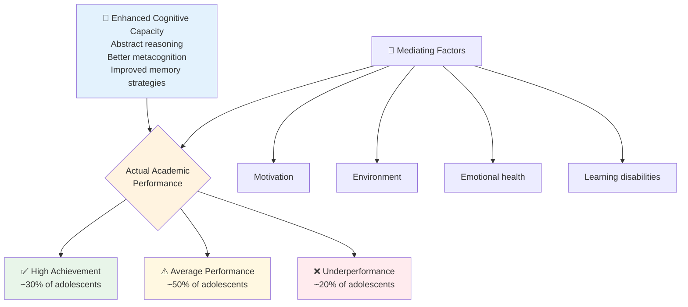
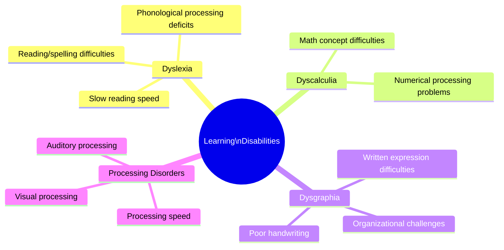
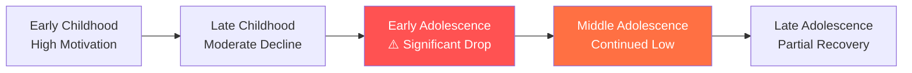
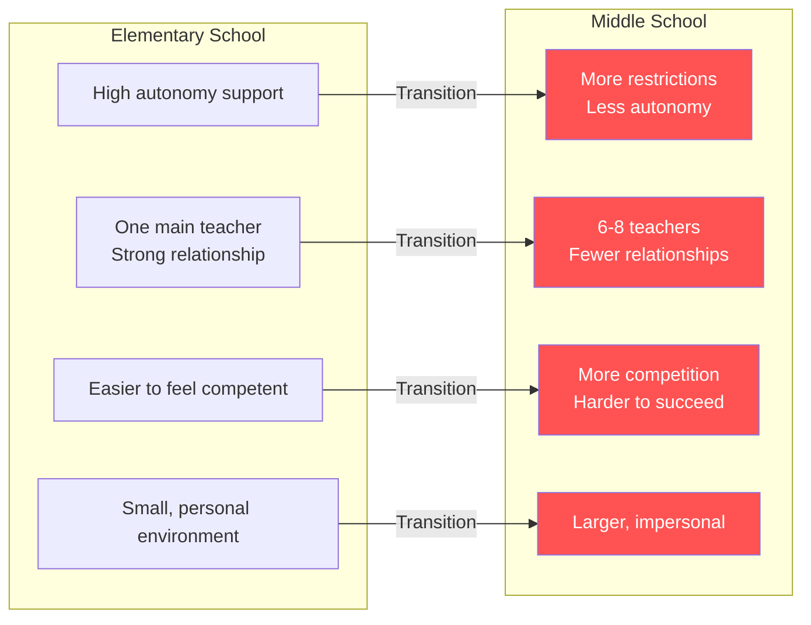
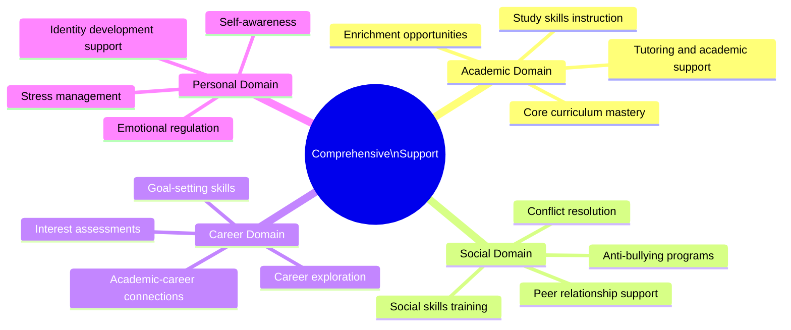

import Tabs from '@theme/Tabs';
import TabItem from '@theme/TabItem';

School performance during adolescence is shaped by a paradox: teenagers develop **more powerful cognitive tools** than children, yet many underperform academically. Understanding why — and what can be done — is essential for educators, counselors, and psychologists working with adolescents.

---

**Source PDFs**: 
- 📄 [Block-3/Unit-2.pdf - Pages 26-29](/pdfs/MPC-002%20Life%20Span%20Psychology/Block-3/Unit-2.pdf)
- 📚 MPC-002 Life Span Psychology

---

## 🤔 The Adolescent Achievement Paradox

Despite possessing enhanced cognitive capacities — abstract reasoning, improved information processing, better metacognition — many adolescents **underperform academically**, particularly during early and middle adolescence (ages 11–15).

**📖 Further Reading**: [Academic Achievement - Wikipedia](https://en.wikipedia.org/wiki/Academic_achievement) | [Adolescent Development - Wikipedia](https://en.wikipedia.org/wiki/Adolescence)

---

## ❌ Reasons for Academic Underperformance

### 1. Lack of Motivation

**Pattern**: Adolescents often show declining academic motivation compared to childhood — a well-documented phenomenon across cultures.

**Manifestations**: Incomplete homework, minimal effort, avoidance of challenging courses, classroom disengagement.

**Self-Determination Theory perspective** (Deci & Ryan): When schools undermine adolescents' needs for **autonomy, competence, and relatedness**, intrinsic motivation drops. Many middle schools inadvertently do exactly this.

---

### 2. Problems at Home or with Peers

| Home Factors | Peer Factors |
|-------------|-------------|
| Parental conflict/divorce | Negative peer pressure |
| Financial stress | Social exclusion or bullying |
| Lack of parental educational support | Peer groups devaluing academics |
| Home instability | Dating relationship stress |
| Caretaking responsibilities | Conflicts and social drama |

**Mechanism**: Emotional energy consumed by these issues leaves less available for cognitive engagement with school.

---

### 3. Poor Work Habits or Study Skills

Middle school requires a shift from **teacher-directed to self-directed learning** — but most students receive little explicit instruction in *how* to study effectively.

Common deficits: ineffective study strategies, poor time management, procrastination, inadequate note-taking, disorganization.

---

### 4. Emotional and Behavioral Problems

**Emotional Issues**: Anxiety disorders, depression, mood instability, low self-esteem, stress.

**Behavioral Problems**: Oppositional behavior, impulse control difficulties, conduct issues, substance experimentation.

**Mechanism**: Emotional and behavioral problems consume **working memory resources**, leaving less capacity for academic processing. A student experiencing severe anxiety may use 40–60% of their cognitive capacity managing emotional arousal rather than learning.

---

### 5. Learning Disabilities

Learning disabilities are **neurologically-based**, not caused by lack of effort or intelligence:

**📖 Further Reading**: [Learning Disability - Wikipedia](https://en.wikipedia.org/wiki/Learning_disability) | [Dyslexia - Wikipedia](https://en.wikipedia.org/wiki/Dyslexia)

---

### 6. ADHD

**Core symptoms** affecting school performance:

| Symptom Domain | School Impact |
|---------------|--------------|
| **Inattention** | Incomplete assignments, missed instructions, lost materials |
| **Hyperactivity** | Difficulty remaining seated, excessive talking |
| **Impulsivity** | Acting without thinking, interrupting, careless errors |

**📖 Further Reading**: [ADHD - Wikipedia](https://en.wikipedia.org/wiki/Attention_deficit_hyperactivity_disorder)

---

### 7. Intellectual Disability / Below-Average Intelligence

Characterized by significantly below-average cognitive functioning (IQ < 70) with limitations in adaptive behavior. Requires modified curriculum and individualized instruction.

---

### 8. Medical and Mental Health Issues

- **Anxiety disorders** (test anxiety, social anxiety, GAD)
- **Depression** (loss of interest, fatigue, concentration difficulties)
- **Chronic illness** affecting attendance
- **Sleep disorders** (common in adolescents due to circadian rhythm shifts)
- Medication side effects

---

## 📉 Motivational Decline During Adolescence

### The Pattern

Research consistently shows that across early and middle adolescence, students' **achievement motivation declines** along three dimensions:

**Three key declining dimensions**:

1. **Perceived Competence**: Early adolescents rate their ability lower than younger children — even when performance is comparable. "I'm just not good at math" becomes a fixed belief.

2. **Task Value**: Adolescents increasingly see school subjects as irrelevant to their lives and future. "When will I ever use this?"

3. **Intrinsic Motivation**: Shift from learning for its own sake (curiosity, mastery) to learning for external rewards (grades, avoiding punishment).

### Expectancy-Value Theory Explanation

**Eccles et al.'s Expectancy-Value Model** explains motivation through two factors:
- **Expectancy of success**: "Can I do this task?"
- **Subjective task value**: "Why would I want to do this?"

Both decline during early adolescence, creating a compounding effect on motivation and performance.

**📖 Further Reading**: [Achievement Motivation - Wikipedia](https://en.wikipedia.org/wiki/Achievement_motivation) | [Expectancy-Value Theory - Wikipedia](https://en.wikipedia.org/wiki/Expectancy-value_theory)

---

## 🏫 The Middle School Transition Challenge

The shift from elementary to middle school is one of the most studied transitions in developmental psychology. It creates a **"developmental mismatch"** where the new environment poorly fits adolescent developmental needs.

### Stage-Environment Fit

**Eccles' Stage-Environment Fit Theory**: When school environments don't match developmental needs, motivation and performance suffer. Middle schools often become less supportive exactly when adolescents most need support.

| Adolescent Developmental Need | Typical Middle School Reality |
|------------------------------|------------------------------|
| Autonomy and self-direction | More rules, less freedom than elementary |
| Close, supportive relationships | Rotating teachers, limited individual attention |
| Sense of competence | Increased competition, harder grading |
| Belonging and inclusion | Larger, more anonymous environment |

**📖 Further Reading**: [Stage-Environment Fit - Wikipedia](https://en.wikipedia.org/wiki/Stage-environment_fit)

### Cumulative Stress Model

The transition simultaneously involves:
- **Biological**: Puberty and associated changes
- **Psychological**: Identity development, increased self-consciousness  
- **Social**: New peer hierarchies, romantic interests
- **Environmental**: New school, new teachers, new expectations

Each alone would be manageable; all at once creates significant vulnerability.

---

## 🛠️ Comprehensive Support Strategies

### 1. Cooperation Among School Personnel

**Multi-professional collaboration** is the foundation of effective support:

- **School counselors**: Emotional support, academic guidance, crisis intervention
- **Teachers**: Developmentally appropriate pedagogy, early identification of struggling students
- **Administrators**: Supportive school culture, resource allocation
- **School psychologists**: Assessment, specialized intervention planning

**Benefits**: Consistent approach across settings, efficient resource use, early identification of at-risk students.

---

### 2. Parental Involvement

**Research** consistently shows that parental involvement strongly predicts academic achievement across all socioeconomic and cultural groups.

**Effective parental practices**:
- Monitoring academic progress without micromanaging
- Supporting study habits and homework routines
- Maintaining open communication with teachers
- Balancing support with adolescent autonomy needs
- Communicating that education is valued

**Challenge**: Adolescents often resist parental involvement. Solution: Focus on **process** (how studying goes) rather than content (teaching the material).

**📖 Further Reading**: [Parental Involvement in Education - Wikipedia](https://en.wikipedia.org/wiki/Parent_involvement_in_education)

---

### 3. Comprehensive Developmental Programs

Effective middle school programs address **four domains**:

---

### 4. Responsive Counseling

**ASCA Model** (American School Counselor Association) framework:

- **Individual counseling**: Personal issues, academic concerns, crisis intervention
- **Group counseling**: Common adolescent challenges (study skills, social skills, stress management)
- **Preventive programming**: Universal mental health promotion

**Accessibility**: Proactive outreach to struggling students; reduce stigma around seeking help.

---

### 5. Cultural Awareness and Sensitivity

**Culturally Responsive Teaching** (Geneva Gay's framework):

- Recognize cultural differences in learning styles and communication
- Include diverse perspectives in curriculum
- Awareness of cultural biases in standardized assessment
- Build on cultural and community strengths

**Indian Educational Context**: Parental pressure for academic excellence, particularly in competitive exam preparation, can both motivate and overwhelm adolescents. Counselors must navigate family expectations alongside student wellbeing — recognizing that both matter.

---

### 6. Universal Design for Learning (UDL)

**Three UDL principles**:
1. **Multiple means of representation**: Present information in diverse formats
2. **Multiple means of expression**: Allow students to demonstrate learning in varied ways
3. **Multiple means of engagement**: Provide multiple sources of motivation and challenge

**📖 Further Reading**: [Universal Design for Learning - Wikipedia](https://en.wikipedia.org/wiki/Universal_Design_for_Learning)

---

## 🎯 Counselor's Critical Role

### Early Identification

**Warning signs of at-risk students**:
- Declining grades (especially sudden drops)
- Increased absences
- Behavioral changes
- Social withdrawal
- Signs of emotional distress (tearfulness, irritability, hopelessness)

### Fostering Motivation

Research-based strategies counselors can share with teachers:

| Strategy | Evidence Base |
|---------|--------------|
| **Autonomy support** | Give students choices when possible |
| **Relevance framing** | Connect content to students' real interests/goals |
| **Growth mindset messages** | Emphasize that ability develops with effort |
| **Mastery orientation** | Focus on learning, not just grades |
| **Appropriate challenge** | Tasks slightly above current ability (Vygotsky's ZPD) |

---

## 🎓 Educational Videos

- 🎥 **[Crash Course Education: Why Do Students Lose Motivation?](https://www.youtube.com/crashcourse)** — Overview of motivation decline research (8 min)
- 🎥 **[The Middle School Problem | TEDx](https://www.youtube.com/watch?v=Qbhsz0MFbpw)** — Why middle school is uniquely challenging (12 min)
- 🎥 **[Growth Mindset vs. Fixed Mindset | Carol Dweck](https://www.youtube.com/watch?v=hiiEeMN7vbQ)** — Research on how mindset affects achievement (11 min)

---

## 📰 Recent Research (2020–2024)

1. **Wigfield, A., et al. (2022).** "Expectancy-value theory in cross-cultural perspective." *Educational Psychologist*. Reviews cross-cultural evidence showing universal decline in task value during early adolescence, with cultural variations in magnitude.

2. **Eccles, J.S., & Wigfield, A. (2020).** "From expectancy-value theory to situated expectancy-value theory." *Educational Research Review*. Updates the classic framework with social and contextual factors.

3. **Yeager, D.S., et al. (2022).** "A nationally representative study of growth mindset interventions in high school." *Nature*. Shows that brief mindset interventions significantly improve achievement for struggling students at scale.

4. **Lazarides, R., et al. (2021).** "Motivational profiles in secondary school science: antecedents and outcomes." *Learning and Instruction*. Identifies distinct motivational profiles among adolescents and their different outcomes.

5. **Wang, M.T., & Eccles, J.S. (2023).** "School context, achievement motivation, and academic engagement." *Developmental Psychology*. Demonstrates how school climate directly shapes motivational trajectories during adolescence.

---

## 💡 Memory Aid

**Mnemonic for barriers to school performance**: **"My Poor Emotional Learning Always Makes Me"**

- **M**otivation (lack of)
- **P**roblems at home/peers
- **E**motional/behavioral problems
- **L**earning disabilities
- **A**DHD
- **M**edical issues (anxiety, depression)
- **M**ental retardation/below average intelligence

---

## ✅ Self-Assessment Questions

<Tabs>
  <TabItem value="q1" label="Question 1" default>
  
  **Why do many adolescents underperform academically despite having more advanced cognitive abilities than children? Explain with reference to motivational decline.**
  
  

  
Click for Answer

  
  The "adolescent achievement paradox" arises because cognitive capacity alone doesn't guarantee performance — **motivation** is equally important.
  
  During early adolescence, three motivational dimensions decline:
  1. **Perceived competence** drops — teens rate their abilities lower even when objectively performing adequately
  2. **Task value** decreases — they see less relevance in school subjects
  3. **Intrinsic motivation** shifts — from learning for curiosity/mastery to learning for grades/external rewards
  
  According to Eccles' **Expectancy-Value Theory**, both "Can I succeed?" (expectancy) and "Why does this matter?" (value) must be positive for sustained motivation. When both decline simultaneously, underperformance follows despite having the cognitive tools for success.
  
  

  </TabItem>
  
  <TabItem value="q2" label="Question 2">
  
  **Describe the concept of 'stage-environment fit' and explain how the middle school transition creates a developmental mismatch.**
  
  

  
Click for Answer

  
  **Stage-environment fit** (Eccles) refers to the degree to which the school environment matches students' developmental needs. When fit is poor, motivation and performance suffer.
  
  The middle school transition creates mismatch because:
  - Adolescents need **increasing autonomy** → Middle school often imposes more rules
  - Adolescents need **close relationships** → Multiple rotating teachers reduce personal connection
  - Adolescents need **sense of competence** → Greater competition makes success harder
  - Adolescents need **belonging** → Larger schools are more anonymous
  
  This mismatch occurs during an already challenging period of biological, psychological, and social transitions, creating cumulative stress that undermines academic performance.
  
  

  </TabItem>
  
  <TabItem value="q3" label="Question 3">
  
  **List and explain the eight major reasons for academic underperformance during adolescence.**
  
  

  
Click for Answer

  
  1. **Lack of motivation**: Declining intrinsic motivation, perceived competence, and task value
  2. **Problems at home/peers**: Family conflict, peer pressure, social stress consuming emotional energy
  3. **Poor work habits/study skills**: Lack of effective strategies for self-directed learning
  4. **Emotional/behavioral problems**: Anxiety, depression, conduct issues consuming cognitive resources
  5. **Learning disabilities**: Neurologically-based difficulties (dyslexia, dyscalculia, dysgraphia)
  6. **ADHD**: Attention, hyperactivity, and impulsivity interfering with academic functioning
  7. **Below-average intelligence**: IQ limitations requiring modified curriculum
  8. **Medical/mental health issues**: Anxiety disorders, depression, chronic illness, sleep disorders
  
  

  </TabItem>
  
  <TabItem value="q4" label="Question 4">
  
  **What are the six components of a comprehensive support strategy for adolescent academic achievement?**
  
  

  
Click for Answer

  
  1. **Cooperation among school personnel**: Coordinated approach by counselors, teachers, administrators, and psychologists
  2. **Parental involvement**: Monitoring progress, supporting study habits, maintaining school communication
  3. **Comprehensive developmental programs**: Addressing academic, social, career, and personal domains
  4. **Responsive counseling**: Individual, group, and preventive counseling addressing diverse needs
  5. **Cultural awareness**: Culturally responsive practices respecting diversity in learning and communication
  6. **Advocacy for diverse needs**: UDL, accommodations for disabilities, equitable access to resources
  
  

  </TabItem>
  
  <TabItem value="q5" label="Question 5">
  
  **How does the ADHD affect school performance? What specific academic challenges do adolescents with ADHD face?**
  
  

  
Click for Answer

  
  ADHD affects school performance through three core symptom domains:
  
  **Inattention**: Difficulty sustaining focus leads to incomplete assignments, missed instructions, careless errors, and lost materials.
  
  **Hyperactivity**: Restlessness and difficulty remaining seated disrupts classroom functioning and self-regulation.
  
  **Impulsivity**: Acting without thinking leads to interrupting, difficulty waiting, and risk-taking behaviors that create social and academic problems.
  
  Specific challenges include: Inconsistent performance (good days/bad days), difficulty with multi-step assignments, poor organization, missing deadlines, and the social stigma of being perceived as "lazy" or "unmotivated" despite working hard.
  
  

  </TabItem>
</Tabs>

---

## 🌍 Real-World Applications

### School Counseling Practice
School counselors working in Indian schools face the unique challenge of balancing:
- Family expectations (high academic pressure, particularly for Class 10 and 12 board exams)
- Student wellbeing (rising rates of exam anxiety and depression)
- School demands (competitive ranking systems)

Effective counselors create **safe spaces** where adolescents can discuss academic stress, develop realistic goals, and build both skills and resilience.

### Growth Mindset Interventions
Brief, evidence-based **growth mindset interventions** (Dweck) teaching students that intelligence is malleable — not fixed — have shown significant effects on achievement for struggling students, particularly during school transitions. These can be implemented in classroom settings with minimal training.

---

## 📋 Summary

**The Paradox**: Adolescents have better cognitive tools than children but often perform worse academically.

**Eight Barriers**: Motivation decline, home/peer problems, poor study skills, emotional/behavioral issues, learning disabilities, ADHD, below-average intelligence, medical/mental health issues.

**Motivational Decline Pattern**: Perceived competence ↓ | Task value ↓ | Intrinsic motivation ↓ — especially during middle school transition.

**Stage-Environment Mismatch**: Middle school environments often poorly fit adolescent developmental needs for autonomy, relationships, competence, and belonging.

**Six Support Strategies**: School cooperation | Parental involvement | Comprehensive programs | Responsive counseling | Cultural awareness | Advocacy for diverse needs.

**Counselor's Role**: Early identification → Collaboration → Direct student support → Fostering motivation → Culturally responsive practice.

---

**Related Topics**:
- [Cognitive Development in Adolescence](/mpc-002/block-3/cognitive-development-adolescence)
- [Piaget's Formal Operational Stage](/mpc-002/block-3/piaget-formal-operations)
- [Information Processing in Adolescence](/mpc-002/block-3/information-processing-adolescence)
