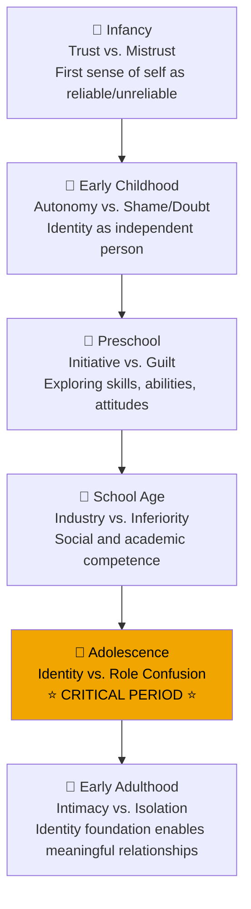

# Identity Development in Adolescence: Erikson's Framework

## Introduction

Adolescence is widely recognized as the pivotal period for identity formation — that profound psychological task of answering the question "Who am I?" Unlike any other developmental phase, adolescence brings together dramatic physical changes, expanding cognitive abilities, and intensifying social demands in a way that makes the question of identity both urgent and complex.

Erik Erikson, perhaps the most influential theorist on adolescent identity, described this period as the fifth stage of psychosocial development: **Identity vs. Role Confusion**. His framework has shaped decades of research and clinical practice in adolescent psychology.

---

**Source PDF**: 📄 [MPC-002 Block-3/Unit-3.pdf - Pages 31-41](/pdfs/MPC-002%20Life%20Span%20Psychology/Block-3/Unit-3.pdf)  
**Course**: MPC-002 Life Span Psychology

---

## What is Identity?

Identity is more than simply knowing your name or recognizing your face in a mirror. It is a deeply integrated sense of **self-unity and continuity across time** — understanding who you are, where you've come from, and where you're headed.

Erikson (1968) described identity as:
> *"A subjective sense as well as an observable quality of personal sameness and continuity, paired with some belief in the sameness and continuity of some shared world image."*

Identity is multidimensional, encompassing:
- **Physical and sexual identity** — how one relates to one's changing body and emerging sexuality
- **Occupational identity** — career aspirations and vocational direction
- **Ideological identity** — values, political beliefs, and religious commitments
- **Social identity** — one's role within family, peer groups, and broader community
- **Ethnic and cultural identity** — identification with one's cultural heritage and background

:::info Key Insight
Identity is not something that simply "happens" to adolescents — it is actively constructed through exploration, experimentation, and commitment. The process begins in infancy (when the child first distinguishes "me" from "not me") but reaches its critical apex during adolescence.
:::

## The Developmental Trajectory of Identity

Identity development doesn't begin in adolescence — it has roots stretching back to infancy. Here's how Erikson traces the thread across development:

During each earlier stage, children gather pieces of self-knowledge:
- Infants recognize their reflection and use "me," "I," "mine"
- Preschoolers describe themselves in observable terms ("I have brown eyes," "I like bikes")
- School-age children add emotional and social dimensions ("I love my dog," "I'm the best fielder on my team")
- Adolescents integrate these pieces into an abstract, coherent whole

## Erikson's Identity vs. Role Confusion Stage

The fifth psychosocial stage — **Identity vs. Role Confusion** — typically spans ages 12-18, though its effects extend well beyond.

### The Core Challenge

Adolescents face the daunting task of integrating all their previous experiences, physical transformations, cognitive expansions, and social demands into a **coherent sense of who they are**. Erikson noted that this is enormously difficult because adolescence brings:

1. **Rapid physical changes** — puberty transforms the body, often before the mind can adjust
2. **Increased sexual drive** — new desires that must be integrated into identity
3. **Expanded cognitive abilities** — abstract thinking opens new possibilities and questions
4. **Conflicting social demands** — parents, peers, schools, and society all pull in different directions

### Healthy Resolution: Identity Achievement

When adolescents successfully navigate this stage, they emerge with:
- A stable sense of who they are and what they value
- Clear direction for the future (career, relationships, beliefs)
- Psychological security that allows intimacy and commitment in adulthood
- A "lifespan construct" — an integration of past, present, and culture that links adolescent identity to adult selfhood

### Failed Resolution: Role Confusion

Without successful identity resolution, adolescents may experience **role confusion** (also called identity diffusion), characterized by:
- Uncertainty about who they are or what they want
- Difficulty making decisions or commitments
- Vulnerability to peer pressure and cult-like followings
- Risk-taking behavior as an attempt to "find oneself"

## The Two-Step Identity Development Process

Erikson and subsequent researchers have identified a two-step process in healthy identity formation:

**Step 1 — Exploration**: The adolescent must break away from childhood beliefs and parental definitions to explore alternative identities. This often manifests as:
- Rejecting parental values (or appearing to)
- Experimenting with different styles, groups, and beliefs
- Seeking role models outside the family (athletes, artists, teachers, community figures)

**Step 2 — Commitment**: After exploration, the adolescent makes deliberate commitments — choosing a career direction, adopting certain values, defining their sexual identity.

:::warning Healthy vs. Problematic "Rebellion"
What looks like adolescent rebellion is often a necessary developmental process. When teenagers reject their parents' music, fashion, or values, they're not simply being difficult — they're creating psychological space to forge their own identity. The interesting paradox: much "rebellion" is actually a form of conformity (everyone gets the same tattoo, wears the same shoes) — just conforming to peers rather than parents.
:::

## The Separation-Individuation Process

A critical component of identity formation is the gradual **separation from parents**. This process, while painful for families, is developmentally necessary.

Signs of healthy separation-individuation include:
- Preferring time with peers over family
- Embarrassment at parental presence ("Drop me off a block from school, Mom!")
- Challenging parental authority and beliefs
- Developing private thoughts, friendships, and experiences

This doesn't represent rejection of parents — research shows that adolescents who maintain warm relationships with parents while developing autonomy have the best developmental outcomes. The key is **connected autonomy** rather than complete rupture.

## The Role of Peers, Role Models, and Social Context

Identity formation doesn't happen in isolation — it is profoundly shaped by social context.

### Peer Relationships
Adolescents turn increasingly to peers because peers:
- Provide belonging when identity is in flux
- Offer age-appropriate models for emerging adult roles
- Validate (or challenge) emerging identity commitments
- Create safe spaces to experiment with new roles

### Role Models
Early adolescents (ages 12-14) are particularly susceptible to role model influence — for better or worse. They "idealize" older figures who seem to possess qualities they desperately want (confidence, status, worldliness). This is why mentors, coaches, teachers, and community figures have such an outsized impact during these years.

### The Role of School
Schools serve as identity laboratories — settings where adolescents can explore academic interests, form peer relationships, participate in clubs and sports, and receive feedback about their competencies.

## Gender, Ethnicity, and Sexual Orientation in Identity

Contemporary research emphasizes that identity formation is deeply shaped by three personal characteristics that require active integration:

**Gender identity** — understanding oneself in relation to gender norms, expectations, and one's own gender experience is a central adolescent task.

**Ethnic/racial identity** — adolescents from minority backgrounds often engage in additional identity work as they negotiate between their cultural heritage and the dominant culture. Research consistently shows that **positive ethnic identity is associated with better psychological outcomes**.

**Sexual orientation** — for many adolescents, this is a significant domain of identity exploration. LGBTQ+ adolescents face additional challenges in identity formation due to stigma and lack of representation.

## Cultural Dimensions: Identity in India

In India, adolescent identity formation occurs within specific cultural contexts that differ meaningfully from Western frameworks:

- **Collectivist values** emphasize family and community over individual self-determination
- **Arranged marriage traditions** mean occupational and social identity may be more family-determined
- **Caste and religious identities** play significant roles in adolescent self-definition
- **Rapid urbanization** creates tension between traditional expectations and modern possibilities for many Indian adolescents
- Research by Misra & Gergen (1993) found that Indian adolescents often construct identity through relational rather than individualistic frameworks

## Recent Research (2020-2024)

Recent scholarship has expanded our understanding of adolescent identity in important ways:

- **Vignoles et al. (2022)** — Cross-cultural study of 7 nations found that while identity exploration is universal, its content (individual vs. relational) varies significantly by culture
- **Meeus et al. (2021)** — Longitudinal research confirms that identity formation is more gradual and less crisis-driven than Erikson originally suggested; most adolescents show "continuous" rather than "crisis" development
- **Crocetti et al. (2023)** — Identified three processes in identity formation: commitment, in-depth exploration, and reconsideration — suggesting identity is constantly being revised
- **Digital identity research (2020-2024)** — Social media creates new "identity laboratories" where adolescents curate, experiment with, and receive feedback on possible selves (Odgers & Jensen, 2020)

## Self-Assessment Questions

1. Erikson's theory proposes that the central task of adolescence is achieving a sense of _______. What are the consequences of failing to achieve this?

2. Compare healthy identity development to role confusion. What factors support successful identity formation?

3. How does the "separation from parents" process serve identity development? Why might it look like rejection even when it isn't?

4. A 15-year-old shifts their style, beliefs, and friend group dramatically every few months. Is this healthy? How does Erikson's framework explain this behavior?

5. How might identity formation differ for an adolescent growing up in a traditional Indian joint family versus one growing up in a Western nuclear family?

## Memory Aid: EPIC Identity Framework

**E** — Exploration (must try alternatives before committing)  
**P** — Peers (social context shapes identity)  
**I** — Integration (weaving past, present, and future into coherent self)  
**C** — Commitment (identity requires deliberate choices)

## 📚 External Resources

- 🌐 [Wikipedia: Erik Erikson's Stages of Psychosocial Development](https://en.wikipedia.org/wiki/Erikson%27s_stages_of_psychosocial_development)
- 🌐 [Wikipedia: Identity vs. Role Confusion](https://en.wikipedia.org/wiki/Identity_versus_role_confusion)
- 🌐 [Wikipedia: Adolescent Identity Development](https://en.wikipedia.org/wiki/Adolescent_identity_development)
- 🎥 [Crash Course Psychology: Identity and Self-Esteem](https://www.youtube.com/watch?v=B5MBzWQaGLI)
- 🎥 [Khan Academy: Adolescent Development - Identity](https://www.khanacademy.org/test-prep/mcat/behavior/developmental-psychology-tut/v/identity-formation)
- 📖 [Erikson's Identity Theory - Simply Psychology](https://www.simplypsychology.org/Erik-Erikson.html)
- 🔬 [Crocetti (2017) - Identity Formation in Adolescence: The Dynamic of Forming and Consolidating Identity Commitments](https://doi.org/10.1177/1745691616672584) *(Perspectives on Psychological Science)*
- 🔬 [Meeus et al. (2021) - Adolescent identity development: A decade of research](https://doi.org/10.1111/cdep.12406) *(Child Development Perspectives)*
- 🔬 [Vignoles et al. (2022) - Modelling identity structure and processes across cultures](https://psycnet.apa.org/doi/10.1037/pspp0000379) *(Journal of Personality and Social Psychology)*

---

## Cross-References

- 🔗 [Cognitive Development in Adolescence](/mpc-002/block-3/cognitive-development-adolescence) — Formal operations provide the abstract thinking needed for identity work
- 🔗 [Piaget's Formal Operational Stage](/mpc-002/block-3/piaget-formal-operations) — Abstract reasoning underlies identity exploration
- 🔗 [Adolescent Development Stages](/mpc-002/block-3/adolescent-development-stages) — Overview of adolescent development phases
