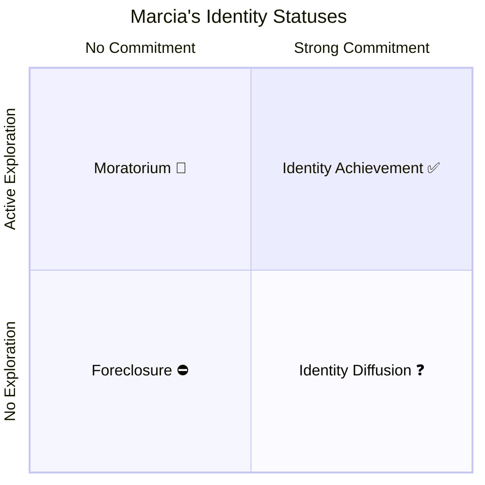

# Marcia's Identity Statuses: Four Pathways to Identity

## Introduction

While Erikson gave us the broad framework of identity development as a central adolescent task, it was James Marcia (1966, 1976, 1980) who transformed the theory into an empirically testable and practically useful model. Marcia's genius was to recognize that identity isn't simply "achieved" or "not achieved" — there are **four distinct patterns** through which adolescents (and adults) relate to the challenge of identity formation.

These four patterns — now known as **identity statuses** — have been among the most researched concepts in developmental psychology over the past 60 years.

---

**Source PDF**: 📄 [MPC-002 Block-3/Unit-3.pdf - Pages 35-36](/pdfs/MPC-002%20Life%20Span%20Psychology/Block-3/Unit-3.pdf)  
**Course**: MPC-002 Life Span Psychology

---

## Marcia's Core Framework

Marcia refined Erikson's theory by operationalizing identity through two key dimensions:

### The Two Dimensions

**1. Crisis (Exploration)**
Has the person actively explored different identity alternatives? Have they gone through a period of questioning, experimenting, and weighing options?

**2. Commitment**
Has the person made a clear, definite commitment to particular values, occupational directions, and beliefs?

In Marcia's model, every person can be classified based on whether they have (or have not) experienced exploration AND whether they have (or have not) made commitment:

### The Three Core Identity Domains

Marcia identified that identity involves the adoption of:
1. **A sexual orientation** — understanding one's romantic/sexual self
2. **A set of values and ideals** — moral and ideological commitments
3. **A vocational direction** — occupational goals and career path

A well-developed identity provides a clear sense of personal **strengths, weaknesses, and individual uniqueness**.

---

## The Four Identity Statuses

:::important Critical Note
These four statuses are **NOT stages** in a fixed sequence. A person doesn't inevitably move from diffusion → foreclosure → moratorium → achievement. Individuals can hold different statuses in different domains (e.g., achieved in career but diffused in religion) and can cycle back and forth across their lifespan.
:::

### 1. 🔒 Identity Foreclosure

**Definition**: Commitment made **without** prior exploration or crisis.

Foreclosed individuals have adopted an identity — but it is one that was essentially assigned by others (usually parents or authority figures) rather than chosen through active exploration. They have skipped the crisis phase entirely.

**Characteristics**:
- High commitment, but low exploration
- Strong, stable values — but not self-examined
- Often psychologically secure but potentially rigid
- May become threatened when their worldview is challenged
- Tend to be conformist and conventional

**Real-World Examples**:
- A medical student who never questioned whether medicine was right for them because "my family are all doctors"
- A young person who adopts their parents' religion without ever exploring alternatives
- Someone who enters the family business without considering other paths

**Indian Context**: Given India's strong family traditions, foreclosure may be more common and more culturally sanctioned here than in Western contexts. A child who follows parental career expectations may be showing filial duty (not pathology) — though this creates interesting questions about authentic identity.

**Psychological Profile**:
- High self-esteem (at least surface-level)
- Low anxiety (comfortable in their role)
- May be authoritarian in outlook
- Can show "identity foreclosure rage" when core commitments are challenged

---

### 2. 🌊 Identity Diffusion

**Definition**: Neither exploration nor commitment — a lack of engagement with the identity question.

Diffused individuals have not committed to any particular identity and are not actively exploring either. They may seem carefree but often lack direction, purpose, and psychological depth.

**Characteristics**:
- Low commitment AND low exploration
- Appears disengaged from questions of values, career, and beliefs
- "I don't know who I am, and I'm not really bothered about figuring it out"
- Often focuses on immediate pleasures rather than long-term meaning
- Can be psychologically fragile when confronted with demands for commitment

**Real-World Examples**:
- A college student who switches majors every semester without reflecting on what matters to them
- An adult who drifts from job to job without developing any consistent career direction
- Someone who avoids political, religious, or moral commitments to avoid conflict

**Psychological Profile**:
- Often socially skilled on the surface but psychologically empty
- Low self-esteem when self-examined
- High vulnerability to manipulation by cults, extreme ideologies, or charismatic leaders
- May use substances or thrill-seeking to fill the psychological void

---

### 3. 🔄 Identity Moratorium

**Definition**: Active exploration **without** yet reaching commitment.

Moratorium is the classic "identity crisis" as Erikson described it. These individuals are actively wrestling with questions of identity — exploring alternatives, questioning assumptions, trying on different roles — but haven't yet resolved their search into stable commitments.

**Characteristics**:
- High exploration, but not yet committed
- Often the most psychologically turbulent status
- Typically seen as developmentally healthy and productive
- Anxiety-provoking but growth-promoting
- Common in late adolescence and early adulthood

**Real-World Examples**:
- A college student actively exploring different major options, political ideologies, and religious paths
- A young adult questioning their career direction after realizing their initial path doesn't fit
- An adolescent who experiments with different peer groups, styles, and beliefs

**Psychological Profile**:
- High anxiety and stress (the exploration is genuinely difficult)
- Open-minded and intellectually curious
- Strong engagement with questions of meaning and values
- Highest potential for deep, authentic identity achievement
- Often perceived as "flaky" by frustrated parents, but developmentally on track

:::success The Productive Uncertainty of Moratorium
Moratorium is often misread as "failing to commit." In reality, it represents **courageous identity work** — being willing to sit with uncertainty rather than foreclosing prematurely or avoiding the questions altogether. Research shows that moratorium is the status most predictive of eventual identity achievement.
:::

---

### 4. ✅ Identity Achievement

**Definition**: Commitment made **after** active exploration and crisis.

Identity-achieved individuals have gone through the difficult work of exploration, wrestled with genuine uncertainty, and emerged with clear, self-chosen commitments. They know who they are, what they believe, and where they're headed.

**Characteristics**:
- High exploration AND high commitment
- Psychologically mature and stable
- Flexible rather than rigid — can reconsider without losing sense of self
- Able to form deep relationships (supports Erikson's next stage: Intimacy vs. Isolation)
- Tolerant of ambiguity and different worldviews

**Real-World Examples**:
- A person who explored several career paths, apprenticed in different fields, and committed to one that truly fits
- Someone who critically examined their family religion, explored alternatives, and chose their own spiritual path
- An adult who questioned gender norms, explored their identity, and arrived at an authentic self-understanding

**Psychological Profile**:
- Highest psychological wellbeing of all four statuses
- High self-esteem, stable
- Strong sense of purpose and direction
- Resilient under stress
- Best predictor of positive outcomes in relationships, career, and mental health

---

## Comparison Table: Four Identity Statuses

| Status | Exploration | Commitment | Psychological State | Example |
|--------|-------------|------------|-------------------|---------|
| **Foreclosure** | ❌ No | ✅ Yes | Secure but rigid | "I'll be a doctor like my father" |
| **Diffusion** | ❌ No | ❌ No | Disengaged, adrift | "Whatever. Doesn't matter." |
| **Moratorium** | ✅ Yes | 🔄 In process | Anxious, searching | "I'm trying to figure it out..." |
| **Achievement** | ✅ Yes | ✅ Yes | Stable, authentic | "I've decided who I am" |

---

## Marcia's Research Methodology

Marcia developed a **semi-structured interview** to assess identity status. Interview questions explored:
- Occupational identity ("What kind of work are you going to do? How did you come to that decision?")
- Political beliefs ("Are your political ideas pretty much the same as your parents'?")
- Religious beliefs ("Have you ever had any doubts about your religious beliefs?")

Responses were coded for evidence of **exploration** (crisis) and **commitment** in each domain.

This methodology allowed for domain-specific assessment — a person might be "achieved" in career identity but "diffused" in religious identity.

## Contemporary Research Extensions (2020-2024)

**Process Model of Identity (Crocetti et al., 2022)**: Extended Marcia's model by identifying three processes: commitment, in-depth exploration, and reconsideration of commitment. This three-process model better captures the dynamic, ongoing nature of identity across the lifespan.

**Identity in Digital Environments (Valkenburg et al., 2021)**: Social media creates new contexts for identity exploration (and potentially foreclosure through social comparison). Adolescents use platforms to "broadcast" identity experiments and receive immediate social feedback.

**Intersectionality and Identity Status (Umaña-Taylor et al., 2022)**: Different cultural contexts affect which identity domains are most central and which statuses are most adaptive. In collectivist cultures, interpersonal identity may be as important as individual identity.

## Self-Assessment Questions

1. A teenager adopts her parents' Muslim faith completely without questioning it. She is deeply committed and psychologically secure in this identity. Which Marcia status best describes her? Is this necessarily problematic?

2. A university student changes majors three times, experiments with different social groups, and describes himself as "figuring things out." He's anxious but intellectually engaged. Which status is he in, and why is this developmentally healthy?

3. Explain why moratorium is often predictive of identity achievement rather than being a "stuck" state.

4. Create an example of a person who is in **different** identity statuses across different domains (career, religion, relationships).

5. How does Marcia's model extend Erikson's theory? What does it add to our understanding of identity development?

## Memory Aid: F-D-M-A

**F** — **F**oreclosure: **F**amily chose for you (commitment without exploration)  
**D** — **D**iffusion: **D**rifting aimlessly (neither exploration nor commitment)  
**M** — **M**oratorium: **M**id-search (exploring but not yet committed)  
**A** — **A**chievement: **A**uthentic self (explored AND committed)

Or remember it as a journey: **D**rifting → **F**ollowing others → **M**aking your own path → **A**rriving at yourself

## 📚 External Resources

- 🌐 [Wikipedia: Identity Status Theory (Marcia)](https://en.wikipedia.org/wiki/Identity_status_theory)
- 🌐 [Wikipedia: James Marcia](https://en.wikipedia.org/wiki/James_Marcia)
- 🌐 [Wikipedia: Identity Crisis](https://en.wikipedia.org/wiki/Identity_crisis)
- 🎥 [Marcia's Identity Statuses Explained - Psychology Unlocked](https://www.youtube.com/watch?v=pJNLIKmJMIQ)
- 🎥 [Crash Course Psychology: Identity - Adolescence](https://www.youtube.com/watch?v=B5MBzWQaGLI)
- 📖 [Simply Psychology: Marcia's Identity Status Theory](https://www.simplypsychology.org/identity-status.html)
- 🔬 [Marcia, J.E. (1966). Development and validation of ego identity status](https://doi.org/10.1037/h0023281) *(Journal of Personality and Social Psychology)*
- 🔬 [Crocetti et al. (2022) - Adolescent identity development](https://doi.org/10.1080/15374416.2021.1990595) *(Journal of Clinical Child & Adolescent Psychology)*
- 🔬 [Kroger & Marcia (2011) - The Identity Statuses: Origins, Meanings, and Interpretations](https://doi.org/10.1002/9781444338386.wbeea186) *(Handbook of Identity Theory and Research)*

---

## Cross-References

- 🔗 [Identity Development in Adolescence](/mpc-002/block-3/identity-development-adolescence) — Erikson's foundational framework
- 🔗 [Self-Concept and Self-Esteem in Adolescence](/mpc-002/block-3/self-concept-self-esteem-adolescence) — How identity relates to self-evaluation
- 🔗 [Cognitive Development in Adolescence](/mpc-002/block-3/cognitive-development-adolescence) — Abstract thinking enables identity exploration
