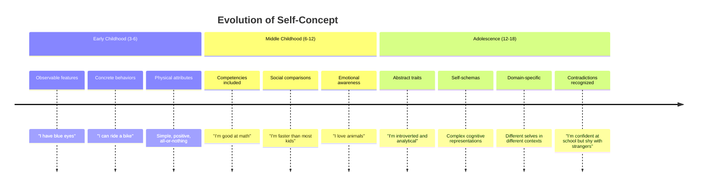
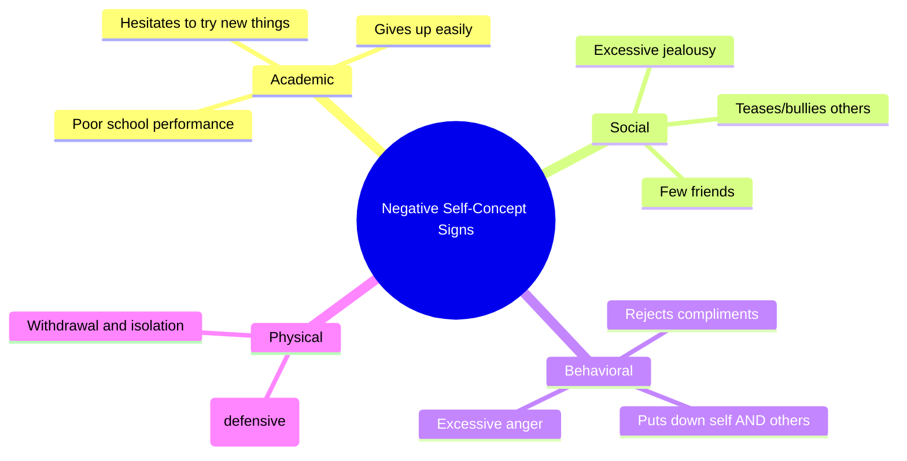
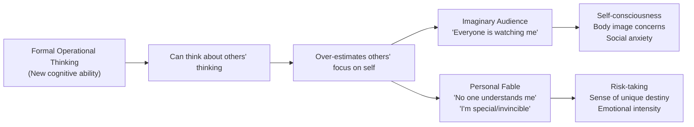

# Self-Concept and Self-Esteem in Adolescence

## Introduction

Adolescence brings a remarkable transformation in how young people see themselves. The child who once described herself as "a girl who likes horses and has brown hair" becomes a teenager capable of saying "I'm an introverted person who values authenticity but struggles with anxiety in social situations." This dramatic evolution in self-understanding — from concrete to abstract, from simple to complex — is one of the most psychologically significant changes of the adolescent years.

Two related but distinct constructs sit at the heart of adolescent self-psychology: **self-concept** (how you perceive yourself across different domains) and **self-esteem** (how you feel about yourself overall). Understanding these constructs — and how they develop, fluctuate, and affect wellbeing — is essential for anyone working with adolescents.

---

**Source PDF**: 📄 [MPC-002 Block-3/Unit-3.pdf - Pages 37-40](/pdfs/MPC-002%20Life%20Span%20Psychology/Block-3/Unit-3.pdf)  
**Course**: MPC-002 Life Span Psychology

---

## Self-Concept: Knowing Yourself

### Definition and Nature

**Self-concept** is the accumulation of knowledge about the self — beliefs regarding one's personality traits, physical characteristics, abilities, values, goals, and social roles. It represents the sum of an individual's beliefs about their own attributes.

More precisely, self-concept is:
- **Multi-dimensional** — we have different self-perceptions in different domains
- **Hierarchically organized** — some domains matter more than others
- **Dynamic** — it changes with experience and development
- **Self-referential** — it guides how we process new information about ourselves

### The Three Types of Self-Concept

| Type | Definition | Example |
|------|------------|---------|
| **Personal self-concept** | Facts/opinions about oneself | "I have brown eyes." "I'm creative." |
| **Social self-concept** | How one believes others perceive them | "People think I'm funny." "My teacher sees me as hardworking." |
| **Ideal self-concept** | What one wishes to be | "I want to be a doctor." "I wish I were more confident." |

The **gap between actual self-concept and ideal self-concept** is particularly important — a large gap is associated with lower self-esteem and greater psychological distress.

### How Self-Concept Changes in Adolescence

The key changes in adolescence:
1. **Increased abstraction** — traits rather than just behaviors
2. **Greater complexity** — recognition of contradictions within the self
3. **Social comparison** — constant evaluation against peers
4. **Domain differentiation** — separate self-concepts for academic, athletic, social, physical domains
5. **Hierarchical organization** — some domains become more central than others

### Self-Schemas

In adolescence, self-concept becomes organized into **self-schemas** — cognitive frameworks that direct how we process self-relevant information. A student with a strong academic self-schema will notice, remember, and respond to academic success and failure more intensely than to social events.

Self-schemas act as **filters** — they make us more sensitive to schema-relevant information and can create self-fulfilling prophecies. A teen with a "loser" self-schema may fail to notice compliments but hyperfocus on criticism.

## Self-Esteem: Feeling Good (or Bad) About Yourself

### Definition and Distinction

**Self-esteem** is the overall evaluative judgment one makes about oneself — a global sense of personal worth. While self-concept is descriptive ("I am..."), self-esteem is evaluative ("I am good/bad/worthless/valuable").

The distinction is critical:
- Self-concept = cognitive map of the self (what you believe about yourself)
- Self-esteem = emotional evaluation of the self (how you feel about what you see)

A person might have accurate self-knowledge (high self-concept clarity) while having low self-esteem, or might have inflated self-perceptions alongside apparently "high" self-esteem that is actually fragile.

### Adolescent Self-Esteem: Key Research Findings

**General trajectory**: Self-esteem typically dips in early adolescence (especially for girls) and gradually rises through late adolescence and into adulthood.

**Domain specificity**: Academic self-esteem and physical appearance self-esteem are particularly influential. Body image concerns are a major driver of low self-esteem in adolescent girls.

**Social comparison**: Adolescents are acutely attuned to how they compare to peers — which becomes particularly intense with social media.

**Cultural variation**: In India and other collectivist cultures, self-esteem may be more relationally defined — being a good son/daughter, meeting family expectations, and fulfilling social roles contribute significantly to self-worth.

### Self-Esteem and Academic Performance

A complex bidirectional relationship exists between self-concept and academic achievement:

- High academic self-concept → greater effort and persistence → better grades
- Better grades → improved academic self-concept

The old assumption that "boosting self-esteem will improve academic performance" has been largely overturned. Research shows that **academic success leads to academic self-concept** more reliably than the reverse. However, **non-contingent praise** (praising effort rather than ability) does support healthy academic self-concept development.

### Self-Esteem and Problematic Behaviors

Contrary to popular belief, the relationships between low self-esteem and problem behaviors are often weaker than assumed:

- **Aggression**: Contrary to the myth, aggressive adolescents do not necessarily have low self-esteem. Some research suggests narcissistic adolescents (very high but fragile self-esteem) may be more aggressive.
- **Substance use**: The link between low self-esteem and drug/alcohol use is present but modest.
- **Depression**: Low self-esteem is a symptom of depression but not a primary cause.
- **Academic failure**: Low academic self-concept predicts subsequent performance; global self-esteem is less predictive.

## Signs of Negative Self-Concept in Adolescents

The following behaviors may indicate an adolescent is struggling with negative self-concept:

:::warning Important Note
Some of these signs seem contradictory — appearing "conceited" can be a defense against deep self-doubt, while putting down others can be an attempt to raise one's relative standing. Negative self-concept rarely presents in a straightforward way.
:::

### Causes of Low Self-Esteem in Adolescents

The IGNOU text identifies several contributing factors:

**Hereditary/Temperamental**: Introverted temperament inherited from parents can contribute to social avoidance patterns.

**Environmental**: Growing up in a depriving or neglectful environment without support for achievement undermines self-worth.

**Educational**: Academic struggles, learning disabilities, or lack of educational access create self-doubt.

**Physiological**: The rapid physical changes of puberty — often occurring at different rates than peers — create body image concerns and self-consciousness.

**Societal**: Cultural restrictions on adolescent behavior (particularly gender-based) create shame and fear around normal developmental exploration.

**Future uncertainty**: Unemployment fears, financial insecurity, and unknown futures are potent sources of adolescent anxiety and self-doubt.

**Physical illness**: Chronic illness or disability creates both practical limitations and psychological burdens.

### Strategies for Building Self-Esteem

Research-backed approaches for supporting adolescent self-esteem:
- **Specific, effort-focused praise** — "You worked really hard on that" rather than "You're so smart"
- **Mastery experiences** — structured opportunities to succeed in meaningful domains
- **Safe environments for risk-taking** — where failure is normalized, not shamed
- **Strong relational support** — at least one stable, caring adult relationship is protective
- **Autonomy support** — allowing adolescents to make real choices
- **Addressing body image** — media literacy education to counter unrealistic beauty standards

## Adolescent Egocentrism: Elkind's Framework

One of the most intriguing aspects of adolescent self-perception was described by David Elkind (1967) — **adolescent egocentrism**.

### What is Adolescent Egocentrism?

Elkind observed that adolescents' newly developed formal operational thinking leads them to an **over-focus on their own thoughts and perspectives**, making it difficult to distinguish between what they are focused on and what others are thinking about. This creates a distinctive cognitive distortion.

:::info Origins
Elkind built on Piaget's observation that formal operational thinking enables adolescents to think about thinking. But this new ability comes with a side effect: an exaggerated sense that one's own thoughts, feelings, and experiences are uniquely important and universally noticed.
:::

### The Two Core Features

**1. The Imaginary Audience**

Adolescents believe they are constantly "on stage" — being watched, evaluated, and scrutinized by others. The "audience" is imaginary because peers are typically preoccupied with their own concerns, not observing the adolescent.

Manifestations:
- Intense self-consciousness about appearance ("Everyone will notice this pimple!")
- Avoiding social situations for fear of embarrassment
- Extreme sensitivity to perceived criticism or ridicule
- Spending hours getting ready for school
- Refusing to walk to the front of class to turn in homework

**2. The Personal Fable**

Adolescents believe their own experiences, feelings, and thoughts are utterly unique and unprecedented — "No one has ever felt what I feel." This contributes to a sense of invincibility and special destiny.

Manifestations:
- "No one understands what I'm going through"
- Risk-taking behavior ("Bad things happen to others, not to me")
- Sense of unique destiny ("I'm going to be famous")
- Reluctance to heed warnings ("That won't happen to me")

### Developmental Significance

Egocentrism is not pathological — it's a natural consequence of the newly emerging cognitive capacities of formal operations. It typically peaks in early adolescence (12-15) and gradually declines as:
- Perspective-taking abilities mature
- Real social feedback corrects distorted self-perceptions
- Intimacy in relationships provides genuine self-other understanding
- Experience accumulates

### Indian Context

In collectivist Indian culture, the "imaginary audience" phenomenon may manifest differently — the concern may not just be about personal appearance but about family honor (*izzat*) and social reputation. The stakes feel even higher when one's behavior reflects not just on oneself but on one's family.

## Recent Research (2020-2024)

**Social Media and Self-Concept (Fardouly et al., 2022)**: Heavy Instagram use significantly predicts body dissatisfaction and appearance-based self-esteem instability in adolescent girls. The "like" system provides a quantified, public measure of social approval that amplifies imaginary audience effects.

**Self-Compassion as Protective Factor (Neff & McGehee, 2020)**: Teaching adolescents self-compassion (treating oneself with the same kindness one would offer a friend) is more effective than boosting self-esteem at supporting resilience and wellbeing.

**Cultural Variation in Self-Concept (Vignoles et al., 2021)**: Cross-cultural research shows that while negative self-evaluation predicts depression universally, the content of self-evaluation varies — relational self-concept (being a good family member) predicts wellbeing more strongly in collectivist cultures.

## Self-Assessment Questions

1. Distinguish between self-concept and self-esteem with concrete examples from adolescent experience.

2. A student consistently fails math tests. How might this affect (a) her academic self-concept, (b) her global self-esteem, and (c) her future math performance? Consider bidirectionality.

3. Apply Elkind's concept of the "imaginary audience" to explain why an adolescent spends two hours getting ready for school.

4. What is the "personal fable," and how does it relate to adolescent risk-taking behavior?

5. A parent tells their struggling teenager "You're amazing and can do anything!" Is this an effective strategy for building self-esteem? What does the research suggest?

## Memory Aid: SEAT

**S** — **S**elf-concept: cognitive map (what you *believe* about yourself)  
**E** — **E**steem: emotional evaluation (how you *feel* about yourself)  
**A** — **A**udience (imaginary) — Elkind's contribution to egocentrism  
**T** — **T**hinking abstractly — what makes adolescent self-concept qualitatively different

## 📚 External Resources

- 🌐 [Wikipedia: Self-Concept](https://en.wikipedia.org/wiki/Self-concept)
- 🌐 [Wikipedia: Self-Esteem](https://en.wikipedia.org/wiki/Self-esteem)
- 🌐 [Wikipedia: Adolescent Egocentrism](https://en.wikipedia.org/wiki/Adolescent_egocentrism)
- 🌐 [Wikipedia: Imaginary Audience](https://en.wikipedia.org/wiki/Imaginary_audience)
- 🎥 [Crash Course Psychology: Adolescence](https://www.youtube.com/watch?v=B5MBzWQaGLI)
- 🎥 [Khan Academy: Self-Esteem in Adolescence](https://www.khanacademy.org/test-prep/mcat/behavior/developmental-psychology-tut/v/self-esteem-and-self-concept)
- 📖 [Elkind's Adolescent Egocentrism - Simply Psychology](https://www.simplypsychology.org/adolescent-egocentrism.html)
- 🔬 [Fardouly et al. (2022) - Social media and adolescent self-concept](https://doi.org/10.1016/j.bodyim.2022.01.003) *(Body Image)*
- 🔬 [Neff & McGehee (2010) - Self-compassion and psychological resilience among adolescents](https://doi.org/10.1007/s11031-009-9153-1) *(Motivation and Emotion)*
- 🔬 [Robins & Trzesniewski (2005) - Self-esteem development across the lifespan](https://doi.org/10.1111/j.0963-7214.2005.00353.x) *(Current Directions in Psychological Science)*

---

## Cross-References

- 🔗 [Identity Development in Adolescence](/mpc-002/block-3/identity-development-adolescence) — Identity and self-concept are closely intertwined
- 🔗 [Marcia's Identity Statuses](/mpc-002/block-3/marcia-identity-statuses) — Identity statuses affect self-concept development
- 🔗 [Cognitive Development in Adolescence](/mpc-002/block-3/cognitive-development-adolescence) — Formal operations enable abstract self-concept
- 🔗 [Piaget's Formal Operational Stage](/mpc-002/block-3/piaget-formal-operations) — Cognitive foundation for adolescent egocentrism
