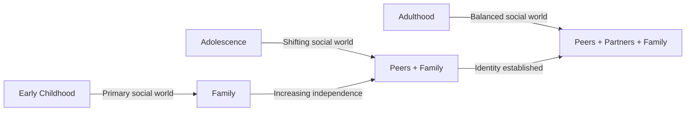
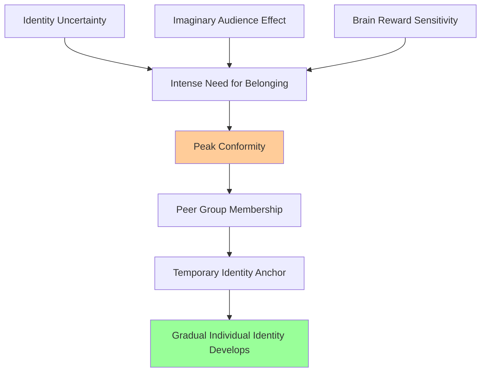

# Social Development and Peer Group Relationships in Adolescence

## Introduction

One of the most defining characteristics of adolescence is the dramatic shift in social orientation — from primarily family-centered relationships toward peer-centered ones. This shift is not simply a matter of preference; it is a developmentally driven process that serves identity formation, emotional regulation, and the preparation for adult social roles.

Understanding adolescent social development — including the psychology of peer groups, conformity dynamics, friendship patterns, and the normative push away from parental influence — is essential for anyone working with or raising adolescents.

📄 **Source PDF**: [MPC-002 Block-3/Unit-3.pdf](/pdfs/MPC-002%20Life%20Span%20Psychology/Block-3/Unit-3.pdf) — Pages 36–37

---

## The Adolescent Social Landscape

### The Shift from Parents to Peers

Adolescence marks the beginning of a normative transition: **parental influence decreases while peer influence increases**. This shift serves multiple developmental functions:

1. **Identity exploration** — Peers provide a laboratory for testing different values, styles, and behaviors
2. **Emotional support** — Friends become primary sources of validation and understanding
3. **Social skill development** — Peer interactions teach negotiation, conflict resolution, and reciprocity
4. **Separation-individuation** — Distancing from parents is necessary for developing an autonomous identity

This shift can be difficult for parents to accept but is entirely normative. The adolescent who seems to prefer friends over family is not rejecting parental love — they are doing exactly what developmental psychology predicts they should.

---

## Peer Groups: Structure and Function

### Types of Peer Groups

Adolescent peer groups exist on a spectrum of size and intimacy:

| Type | Size | Characteristics | Function |
|---|---|---|---|
| **Dyadic friendships** | 2 | Intimate, trust-based | Deep emotional support, loyalty |
| **Cliques** | 3–9 | Small, cohesive, frequent contact | Identity reinforcement, social belonging |
| **Crowds** | 15–30+ | Reputation-based, less intimate | Social identity labels (jocks, nerds, goths) |
| **Peer networks** | Broader | Looser connections | Social influence, information spread |

### Why Peer Groups Matter

Peer groups serve critical psychological functions during adolescence:

- **Belonging and acceptance** — Filling the gap left by emotional separation from parents
- **Social comparison** — Evaluating one's own traits, abilities, and values against peers
- **Norms and values** — Learning what is "normal," acceptable, and desirable in their age group
- **Identity rehearsal** — Testing different roles and identities within the safety of the group
- **Emotional co-regulation** — Managing emotions through shared experiences

---

## Conformity and Social Influence in Adolescence

### The Paradox of Adolescent Rebellion

One of the most striking observations about adolescent social behavior is its apparent paradox: adolescents who appear to be "rebelling" against societal norms are often simply conforming to **peer group norms**. True independence is actually quite rare in adolescence.

The example from the PDF captures this well: an adolescent who wants a tattoo or nose ring "because everyone else is getting them" is not demonstrating individualism — they are demonstrating conformity to a peer reference group. Platform shoes, specific music preferences, speech patterns — these represent horizontal conformity replacing vertical (parental) conformity.

### Why Conformity Peaks in Adolescence

Peer conformity peaks in early-to-middle adolescence (approximately ages 12–15) for several reasons:

1. **Identity uncertainty** — Conforming to the peer group provides a temporary sense of identity when personal identity is still being formed
2. **Approval-seeking** — The imaginary audience effect makes social approval intensely important
3. **Brain development** — The reward circuits respond more strongly to peer approval in adolescence (Blakemore & Mills, 2014)
4. **Fear of exclusion** — Ostracism feels catastrophic when peer belonging is psychologically essential

---

## Hero Worship and Role Models

### Same-Sex Hero Worship

Same-sex hero worship is common during early adolescence. Adolescents often idealize older peers, athletes, musicians, or community figures who embody qualities they aspire to possess. This idealization serves important functions:

- Provides models for identity formation
- Inspires aspirational behavior and effort
- Offers a sense of connection to something larger than the family unit

### The Critical Role of Role Models

At the stage of development when conformity is highest and personal identity is most fluid, **role models can make a decisive difference** in the choices adolescents make. Adolescents at this stage "have a strong need to idealize others, especially those who are older and more worldly."

This creates both risk and opportunity:
- **Risk**: Adolescents can be equally attracted to destructive role models (e.g., an older peer who uses drugs and drives a fancy car) as to constructive ones
- **Opportunity**: Mentors, coaches, teachers, and community leaders who actively engage adolescents can have enormous positive impact

The influence of role models highlights why community investment in positive youth programming, mentorship, and sports participation matters so much during this developmental window.

---

## Social Cognition in Adolescence

### Enhanced Social Reasoning

Adolescents' newly developed formal operational thinking allows for significantly more sophisticated social reasoning:

- **Perspective-taking** — Ability to understand others' viewpoints more deeply
- **Hypothetical social reasoning** — "What would happen if I said this?"
- **Abstract social concepts** — Understanding loyalty, betrayal, fairness in nuanced ways
- **Multiple simultaneous perspectives** — Considering how different people might view the same situation

### Mood and Social Sensitivity

Adolescents experience more frequent and more intense mood swings than younger children (Myers, 2004). This heightened emotional reactivity affects social behavior:
- Social rejections feel more catastrophic
- Social successes feel more intensely rewarding
- Peer conflicts generate more anxiety
- Misunderstandings with friends can feel devastating

This emotional intensity is partly neurobiological — the adolescent limbic system (emotional brain) is highly activated while the prefrontal cortex (regulatory brain) is still maturing.

---

## Friendship Quality vs. Popularity

Modern research distinguishes between two different dimensions of peer success in adolescence:

| Dimension | Definition | Outcomes |
|---|---|---|
| **Popularity** (sociometric) | Being well-known and socially central in a peer group | Can include both prosocial and aggressive behaviors |
| **Friendship quality** | Depth, trust, and reciprocity in close friendships | Strongly predicts positive mental health outcomes |

Research consistently shows that **friendship quality matters more than popularity** for long-term wellbeing. Adolescents with even one or two high-quality friendships show better adjustment than those with many superficial peer connections.

---

## 🔬 Recent Research (2020–2024)

**Peer Influence and Brain Reward Systems** (Telzer et al., 2021, *Developmental Cognitive Neuroscience*): fMRI research showed that adolescents' reward circuits (ventral striatum) are more activated by peer approval than by adult approval or monetary rewards, peaking at approximately age 14–15 and then declining. This provides neurobiological explanation for why peer influence peaks in mid-adolescence.

**Online vs. Offline Peer Relationships** (Orben et al., 2022, *Nature Reviews Psychology*): Research during the COVID-19 pandemic found that while digital social connections partially buffered adolescents against loneliness, they were not equivalent substitutes for in-person peer interaction. Quality face-to-face peer time remained the strongest predictor of wellbeing.

**Friendship Quality and Mental Health** (Narr et al., 2019, extended analysis 2022): Longitudinal research found that having high-quality close friendships in adolescence predicted lower anxiety, depression, and social phobia at age 25, independent of popularity or peer acceptance.

**Indian Adolescent Peer Groups** (Singh & Kapur, 2021): Research in Indian metropolitan areas found that adolescent peer groups are increasingly cross-gender (a shift from traditional same-gender segregation), particularly in urban private schools. However, peer conformity pressure around academic achievement is exceptionally high in Indian contexts.

---

## 📺 Educational Videos

- 🎬 [Peer Pressure and Social Influence in Adolescence — Crash Course Psychology](https://www.youtube.com/watch?v=OhioM0_NSTE) — Engaging, accessible overview
- 🎬 [Why Do Teens Follow the Crowd? — BrainFacts.org](https://www.brainfacts.org/thinking-sensing-and-behaving/learning-and-memory/2017/the-teen-brain-why-peer-pressure-is-so-powerful) — Neuroscience of peer conformity
- 🎬 [Social Development and Friendships — Khan Academy](https://www.khanacademy.org/science/health-and-medicine/adolescent-development) — Educational introduction

---

## 🌐 External Resources

1. 🌍 [Wikipedia: Adolescent Peer Relationships](https://en.wikipedia.org/wiki/Adolescence#Social_development) — Developmental overview
2. 🌍 [Wikipedia: Peer Pressure](https://en.wikipedia.org/wiki/Peer_pressure) — Social psychology of peer influence
3. 🌍 [Wikipedia: Social Comparison Theory](https://en.wikipedia.org/wiki/Social_comparison_theory) — Festinger's foundational theory
4. 🌍 [Wikipedia: Clique (sociology)](https://en.wikipedia.org/wiki/Clique_(sociology)) — Structure of adolescent peer groups
5. 📚 [APA: The Importance of Peer Relationships](https://www.apa.org/topics/children/peers) — Professional perspective
6. 📖 [Greater Good Science Center: Why Teens Need Friends](https://greatergood.berkeley.edu/article/item/why_teens_need_friends) — Research-based article
7. 📰 [Journal of Research on Adolescence](https://onlinelibrary.wiley.com/journal/15327795) — Peer-reviewed journal
8. 📖 [Verywell Mind: Teen Peer Pressure Guide](https://www.verywellmind.com/peer-pressure-4157076) — Practical guidance

---

## 🇮🇳 Indian Context

Adolescent peer group dynamics in India are shaped by several unique contextual factors:

**Residential schooling**: Boarding schools (common for elite and tribal education) create highly intense peer group dynamics, often replacing family as the primary social world.

**Caste and community**: In many parts of India, peer groups remain organized along caste/community lines, adding a layer of social identity to peer belonging.

**Academic pressure**: The competitive examination culture creates peer dynamics around academic performance — peer groups often become study groups, and academic ranking shapes peer status.

**Digital peer relationships**: India has one of the world's largest youth populations on social media, creating new peer relationship dynamics around likes, followers, and online identity performance.

---

## ✏️ Self-Assessment Questions

1. **Why do adolescents shift their social orientation from parents to peers?** Explain this transition using developmental psychology concepts.

2. **Explain the apparent paradox of adolescent rebellion**: How is much of what appears to be rebellion actually a form of conformity?

3. **What is same-sex hero worship?** What developmental function does it serve? Give an example from contemporary Indian culture.

4. **Compare popularity and friendship quality** in adolescence. Which is more important for long-term wellbeing? Support your answer with research.

5. **Application**: A 14-year-old student starts spending all their time with a new friend group, ignoring family, and showing new behaviors (new music, different clothing, and some risky behavior). As a school counselor, how would you approach this from a developmental psychology perspective?

---

## 🧠 Memory Aid

**PEER Model — Functions of Peer Groups**:
- **P**rotection from social exclusion (belonging)
- **E**xploration of identity and values
- **E**motional support and co-regulation
- **R**ole modeling and social learning

**Adolescent Social Shift = P → P**:
- From **P**arents → to **P**eers (the great transition of adolescence)

**Why Conformity Peaks = BIAS**:
- **B**rain reward sensitivity to peer approval
- **I**dentity uncertainty seeking anchor
- **A**pproval-seeking (imaginary audience)
- **S**ocial exclusion fear

---

## Cross-References

- [Identity Development: Erikson's Framework](/mpc-002/block-3/identity-development-adolescence) — Identity formation requiring peer context
- [Self-Concept and Self-Esteem](/mpc-002/block-3/self-concept-self-esteem-adolescence) — Peer relationships shape self-evaluation
- [Marcia's Identity Statuses](/mpc-002/block-3/marcia-identity-statuses) — Peers influence identity exploration
- [Adolescent Development Stages](/mpc-002/block-3/adolescent-development-stages) — Overview of adolescent development phases

---

**Source PDFs**:
- 📄 [Block-3/Unit-3.pdf — Pages 36–37](/pdfs/MPC-002%20Life%20Span%20Psychology/Block-3/Unit-3.pdf)
- 📚 MPC-002 Life Span Psychology
