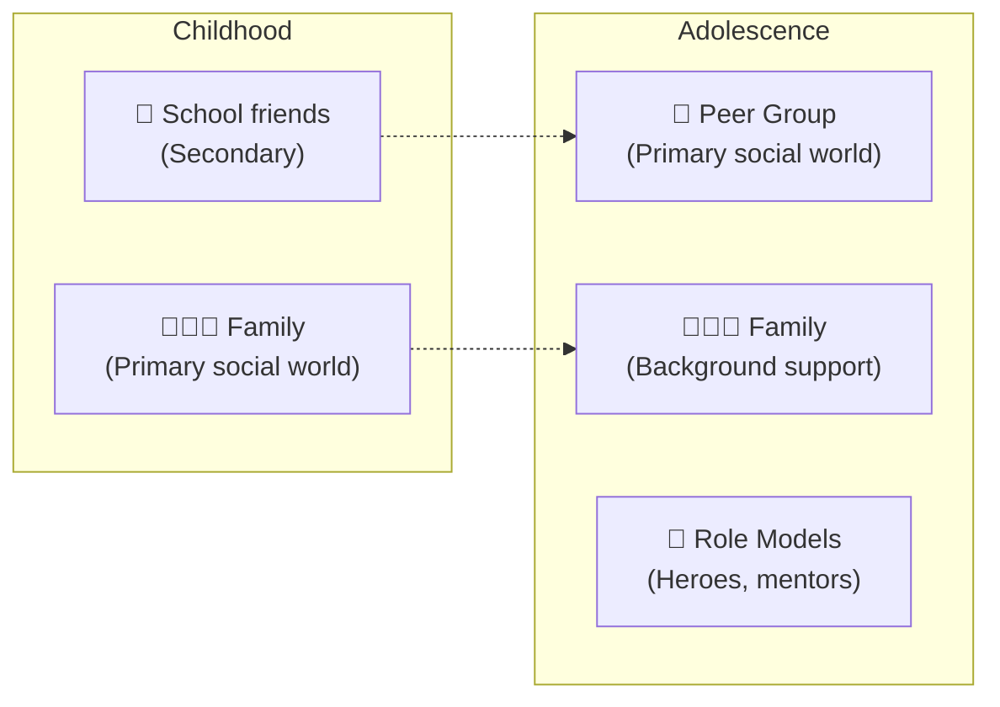

# Social Development and Peer Relationships in Adolescence

## Introduction

One of the most observable changes in adolescence is the dramatic shift in social orientation. The child who wanted to spend every weekend with family suddenly can't get enough of their friends and seems embarrassed to be seen with parents. The young person who once worshipped their parents now idolizes athletes, musicians, or classmates.

This social transformation is not mere teenage whim — it represents a profound developmental necessity. Adolescents need **peer relationships** to accomplish the central tasks of this period: identity formation, emotional regulation, and preparation for adult social life. Understanding the social world of adolescents — its patterns, functions, and risks — is essential for psychologists, parents, and educators.

---

**Source PDF**: 📄 [MPC-002 Block-3/Unit-3.pdf - Pages 36-37](/pdfs/MPC-002%20Life%20Span%20Psychology/Block-3/Unit-3.pdf)  
**Course**: MPC-002 Life Span Psychology

---

## The Social Shift in Adolescence

A fundamental feature of adolescent social development is the **shift from family-centered to peer-centered social orientation**.

### Why This Shift Happens

The movement from parental to peer influence is driven by multiple factors working together:

**Cognitive development**: Abstract thinking allows adolescents to compare and evaluate different value systems — including the possibility that their parents' values aren't the only valid ones.

**Identity development**: Building an identity requires psychological separation from parents. Peers provide an alternative source of identity validation and belonging.

**Puberty**: Sexual maturation drives interest in romantic relationships with peers.

**Social-emotional development**: Adolescents develop increasingly sophisticated capacities for peer intimacy — sharing secrets, giving support, maintaining loyalty.

**Neurological factors**: The adolescent brain's reward circuitry is particularly sensitive to social rewards (peer approval, belonging) relative to the prefrontal regulatory systems.

## Peer Groups: Functions and Dynamics

### Why Peer Groups Are Developmentally Essential

Peer groups serve multiple developmental functions in adolescence:

**Identity function**: The peer group is an identity laboratory — a place to try on different roles, values, and behaviors and receive immediate social feedback.

**Belonging function**: During the unsettled period of identity formation, peer groups provide a crucial sense of belonging and social definition.

**Socialization function**: Peers teach each other social norms, cooperation, conflict resolution, and the rules of social life.

**Emotional support function**: Peers understand the adolescent experience in a way adults cannot — they are going through the same things.

**Separation-individuation support**: The peer group provides an alternative attachment base that enables adolescents to psychologically separate from parents without experiencing total aloneness.

### The Structure of Adolescent Peer Groups

**Cliques**: Small, tight-knit groups (6-10 people) based on close friendship and shared interests. Cliques are the most intimate peer structures.

**Crowds**: Larger, more loosely defined groups defined by shared reputation or social identity ("the jocks," "the nerds," "the popular kids"). Crowd membership affects social status.

**Dyadic friendships**: The most intimate peer relationships — best friendships. These become increasingly emotionally intimate in adolescence, particularly for girls.

### The "Conformity Paradox"

One of the intriguing features of adolescent social life is what might be called the **conformity paradox**: adolescents are often desperately trying to be individual while conforming intensely to peer standards.

> A teenager who dyes her hair green to express her individuality is simultaneously doing what all her alternative peer group members are doing. The rebellion against parental conformity becomes conformity to peer norms.

This isn't hypocrisy — it's developmentally appropriate. The peer group provides the "scaffolding" within which genuinely individual identity can gradually emerge.

## Hero Worship and Role Models

The IGNOU text highlights an important but often underappreciated feature of adolescent social development: **same-sex hero worship** and intense idealization of role models.

### The Psychology of Adolescent Hero Worship

Early adolescents are primed to idealize people who seem to possess qualities they desperately want but don't yet have: confidence, status, worldliness, physical prowess, artistic talent, social ease. This idealization serves identity formation — by attaching to an idealized other, the adolescent "borrows" aspects of that identity while their own is still forming.

Typical objects of adolescent hero worship:
- **Athletes**: Embody physical excellence, discipline, and fame
- **Musicians/performers**: Represent creative self-expression and emotional authenticity
- **Film heroes**: Embody aspirational lifestyle and social power
- **Social workers and activists**: Represent idealism and moral purpose (especially valued by some adolescents)
- **Older peers (18-19 year olds)**: Represent the imminent adult world

:::warning The Double-Edged Nature of Hero Worship
At this age, teens have a strong need to idealize others, especially those older and more "worldly." They can be as easily awed by an older peer who drives a fancy car and pushes drugs as by a sports hero who espouses clean living, hard work, and dedication. This vulnerability is exactly why **positive role models** — coaches, mentors, teachers, community leaders — have such profound developmental impact.
:::

### The Importance of Role Models in Indian Culture

In India, adolescent hero worship often reflects cultural values:
- Cricket players like Sachin Tendulkar have served as national identity figures, especially for adolescent boys
- Social figures like Bhagat Singh and Swami Vivekananda remain powerful role models for adolescent idealism
- Bollywood stars function as powerful embodiments of aspirational identity

The presence of culturally embedded role models who embody prosocial values is a significant protective factor for adolescent development.

## Social Identity in Adolescence

Social identity theory (Tajfel & Turner, 1979) proposes that a significant component of self-concept derives from membership in social groups — and this is particularly salient during adolescence.

### Components of Social Identity

**Group membership**: "I am a member of [group]" — schools, sports teams, religious communities, peer groups, ethnic groups

**Evaluative comparison**: How positively or negatively the in-group is evaluated relative to out-groups

**Emotional significance**: How much one's self-esteem is tied to the group's status and reputation

### Social Identity and Adolescent Behavior

Adolescents derive significant self-esteem from their peer group identity. This creates powerful motivations:
- To maintain membership (conformity to group norms)
- To enhance the group's status relative to other groups (intergroup competition)
- To protect the group from perceived threats (hostility to out-groups)

This is why adolescents can engage in behaviors that seem individually irrational but make perfect sense from a social identity perspective: wearing uncomfortable clothes, participating in risky group activities, or denigrating rival groups.

## Adolescent Mood Variability and Social Development

The IGNOU text notes that adolescents experience **many moods and are more prone to mood swings**. Research by Reed Larson and colleagues using experience sampling methodology has documented that adolescents' emotional states shift dramatically across contexts — much more so than adults.

Key findings:
- Adolescents experience emotions more intensely than either children or adults
- Social contexts (particularly peer contexts) are the most powerful mood regulators
- The transition from family to peer social contexts is often accompanied by emotional brightening
- Social rejection by peers is among the most powerful negative experiences in adolescence

The developing cognitive capacity for **abstract reasoning** also contributes to emotional intensity — adolescents can now worry about hypothetical futures, imagine alternative pasts, and ruminate on social slights in ways children cannot.

## Social Media and Adolescent Social Development (Contemporary Issues)

Social media has fundamentally transformed the peer social landscape. Key research findings (2020-2024):

**Always-on social comparison**: Social media extends peer comparison beyond school hours into every moment of the day, potentially amplifying identity instability and self-esteem volatility.

**New forms of peer status**: "Likes," followers, and online visibility create new hierarchies that parallel (and sometimes dominate) real-world social standing.

**Cyberbullying**: Social exclusion and bullying now follow adolescents home; the school-home refuge is gone.

**Benefits**: Strong evidence that social media supports connection for isolated adolescents (LGBTQ+ youth, those with social anxiety) who might struggle in face-to-face social environments.

**The nuanced picture (Odgers & Jensen, 2020)**: Media coverage often overstates social media's negative effects. Research shows effects are highly variable — the same platform that harms one adolescent's wellbeing may significantly support another's.

## Cultural Dimensions: Peer Relationships in India

Indian adolescent peer relationships have specific characteristics shaped by cultural context:

**Gender-segregated socialization**: Traditional Indian norms often restrict mixed-gender peer interaction, particularly for girls. This shapes identity development differently than in more gender-integrated Western contexts.

**Family honor and peer behavior**: Adolescent behavior is understood as reflecting on family reputation (*izzat*), creating a different calculus around peer conformity than pure individual social identity.

**Caste and religious peer groupings**: Peer groups in India may be partly shaped by caste and religious community identity, creating complex intersections of social identity.

**Changing urban landscape**: Rapidly urbanizing India sees adolescents navigating between traditional peer norms and cosmopolitan peer cultures — a unique form of identity challenge.

## Self-Assessment Questions

1. Why is the shift from family-centered to peer-centered social orientation developmentally necessary in adolescence? What would be the consequences if this shift did NOT occur?

2. Explain the "conformity paradox" — how can adolescents be simultaneously rebelling against conformity while intensely conforming to peer norms?

3. A 14-year-old boy idolizes a local gang leader. Using psychological concepts from this unit, explain why this idolization occurs and what it means developmentally.

4. How does social identity theory explain adolescent clique behavior and intergroup rivalry?

5. How might peer relationship dynamics differ for an adolescent in a traditional Indian rural community versus an urban teenager in Mumbai?

## Memory Aid: PIERS

**P** — **P**eer groups (primary social world in adolescence)  
**I** — **I**dentity (peers provide belonging while identity forms)  
**E** — **E**gocentrism (imaginary audience makes peer evaluation feel urgent)  
**R** — **R**ole models (heroes serve as identity scaffolding)  
**S** — **S**eparation (from parents — necessary for identity development)

## 📚 External Resources

- 🌐 [Wikipedia: Adolescence - Social Development](https://en.wikipedia.org/wiki/Adolescence#Social_development)
- 🌐 [Wikipedia: Social Identity Theory](https://en.wikipedia.org/wiki/Social_identity_theory)
- 🌐 [Wikipedia: Peer Group](https://en.wikipedia.org/wiki/Peer_group)
- 🌐 [Wikipedia: Adolescent Clique](https://en.wikipedia.org/wiki/Clique_(sociology))
- 🎥 [Crash Course Psychology: Social Development in Adolescence](https://www.youtube.com/watch?v=sz68HFqPqFc)
- 🎥 [TED-Ed: Why Do Teenagers Act the Way They Do?](https://www.youtube.com/watch?v=bImfSGNDERs)
- 📖 [Adolescent Social Development - Verywell Mind](https://www.verywellmind.com/social-development-in-teenagers-2610249)
- 🔬 [Choukas-Bradley et al. (2022) - The intergenerational transmission of social media use](https://doi.org/10.1177/0165025421993095) *(International Journal of Behavioral Development)*
- 🔬 [Odgers & Jensen (2020) - Annual Research Review: Adolescent mental health in the digital age](https://doi.org/10.1111/jcpp.13190) *(Journal of Child Psychology and Psychiatry)*
- 🔬 [Prinstein & Cillessen (2021) - Peer victimization and social adjustment during adolescence](https://doi.org/10.1017/S0954579420000735) *(Development and Psychopathology)*

---

## Cross-References

- 🔗 [Identity Development in Adolescence](/mpc-002/block-3/identity-development-adolescence) — Peer context is essential for identity formation
- 🔗 [Marcia's Identity Statuses](/mpc-002/block-3/marcia-identity-statuses) — Social interactions affect identity exploration and commitment
- 🔗 [Self-Concept and Self-Esteem in Adolescence](/mpc-002/block-3/self-concept-self-esteem-adolescence) — Peer relationships profoundly shape self-esteem
- 🔗 [Adolescent Development Stages](/mpc-002/block-3/adolescent-development-stages) — Overview of developmental context
