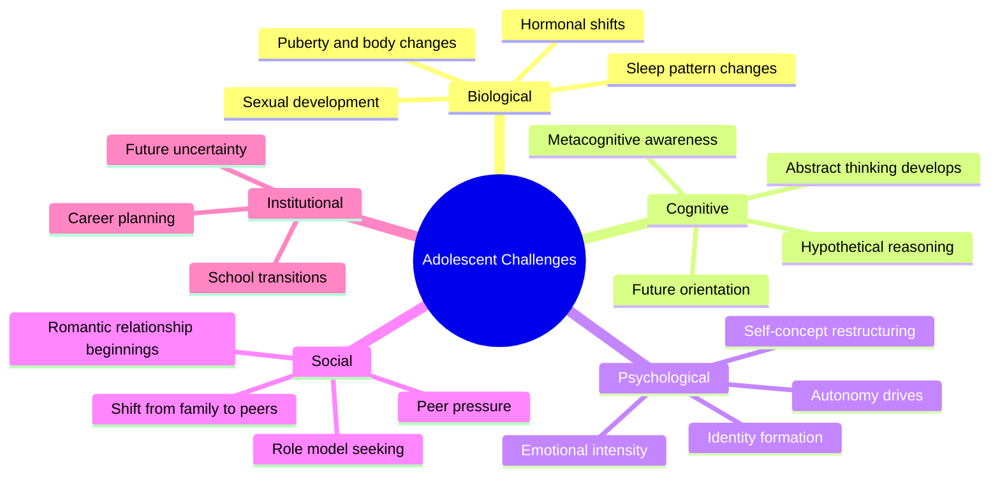

# Challenges and Issues in Adolescent Development

## Introduction

Adolescence has long been dramatized in literature, media, and popular imagination as a period of inevitable turmoil — the "stormy years," a time of explosive problems, rebellion, and crisis. Magazine covers, films, and worried parents describe teenagers as fundamentally unpredictable, difficult, and in perpetual danger.

But what does developmental science actually say? Is adolescence inherently a period of storm and stress — or is this an exaggeration?

The evidence is nuanced and important: **adolescence does present real and significant challenges**, but the notion that all adolescents inevitably suffer through a prolonged crisis is not supported by research. Most adolescents navigate this period successfully, even amid genuine difficulties. Understanding both the real challenges and the resilience capacities of adolescents is essential for anyone working with or parenting young people.

---

**Source PDF**: 📄 [MPC-002 Block-3/Unit-4.pdf - Pages 42-51](/pdfs/MPC-002%20Life%20Span%20Psychology/Block-3/Unit-4.pdf)  
**Course**: MPC-002 Life Span Psychology

---

## Defining Adolescence as a Challenge Period

Adolescence may be defined as **the period within the lifespan when most of a person's biological, cognitive, psychological, and social characteristics are changing from what is typically considered childlike to what is considered adult-like**.

What makes this definition important is the word "most" — it's not just one thing changing, but virtually everything changing simultaneously. The challenge is not any single transformation but the **synchrony and pace of multiple simultaneous changes**.

## The "Storm and Stress" Debate

### G. Stanley Hall's Original Theory

The notion of adolescence as inherently stormy dates to G. Stanley Hall (1904), who coined the term "adolescence" and described it as a period of "storm and stress" (*Sturm und Drang*) — inevitable psychological turbulence mirroring evolutionary recapitulation.

### The Contemporary Scientific View

Modern developmental psychology presents a more nuanced picture:

**What the evidence SUPPORTS**:
- Heightened emotional intensity compared to childhood and adulthood
- Increased moodiness and mood variability
- Greater risk-taking behavior
- Elevated rates of conflict with parents (especially early adolescence)
- Increased vulnerability to certain mental health problems

**What the evidence does NOT support**:
- That the majority of adolescents experience severe, prolonged psychological disturbance
- That parent-adolescent conflict is universally hostile or damaging
- That adolescent risk-taking is primarily pathological rather than developmentally functional
- That "storm and stress" is universal across all cultures

:::info Cultural Variation
Cross-cultural research shows that "storm and stress" is more pronounced in Western, individualist societies where adolescence involves a sharp transition to autonomy. In cultures with more gradual transitions to adult roles and responsibilities, adolescent turbulence is considerably less intense.
:::

## The Core Challenges

### 1. Navigating Multiple Simultaneous Changes

The most fundamental challenge of adolescence is the **sheer simultaneity** of change. Consider what an adolescent is managing at the same time:

- Body transforming through puberty (often before social-emotional readiness)
- Brain reorganizing (particularly the prefrontal cortex)
- Shifting from concrete to abstract thinking
- Identity restructuring from child-self to adult-self
- Social world reorienting from family to peers
- Institutional transitions (elementary to middle school; high school to university/work)
- Increasing performance demands and future consequences

This is an extraordinary amount of change for any person to navigate. Adults who struggle with single major life transitions (divorce, job loss, relocation) can begin to appreciate what adolescents face.

### 2. The Autonomy-Belonging Tension

Adolescents face a profound developmental contradiction: they **simultaneously need autonomy and belonging**.

On the autonomy side, identity formation requires breaking free from parental definition, testing independent judgment, and forging a unique self. This drives the classic adolescent behaviors — challenging parental authority, dismissing parental advice, seeking peer validation over parental approval.

On the belonging side, the loss of the secure, defined child-self creates vulnerability. Peer groups fill this void, providing belonging and identity anchoring during the transition.

The tension between these needs — "leave me alone" vs. "please accept me" — is at the heart of much adolescent distress and behavior.

### 3. Interindividual and Intraindividual Variability

A critical insight from developmental science: **there is no single adolescence**. Development during this period is characterized by:

- **Interindividual differences**: Between-person variation is enormous. Two 15-year-olds can be at dramatically different points in physical, cognitive, and social development.
- **Intraindividual variability**: The same adolescent can show dramatically different functioning across contexts (mature and responsible at school, volatile and impulsive at home).

This variability is *normal* — not a sign of pathology. Temperamental characteristics (mood reactivity, activity level) contribute significantly to how individual adolescents experience this period.

### 4. School Transitions

The IGNOU text specifically highlights **institutional transitions** as a significant challenge:

- **Early adolescence**: Transition from elementary to middle/junior high school
- **Late adolescence**: Transition from high school to university, work, or family roles

These transitions matter because they coincide with other developmental changes and often involve:
- New, larger, more impersonal social environments
- Greater academic demands and performance expectations
- Loss of established peer relationships
- New navigational demands (schedules, teachers, buildings)

Research consistently shows a **dip in academic motivation and achievement** at the middle school transition, which developmental psychologists attribute to a mismatch between the adolescent's developmental needs (autonomy, belonging, meaningful engagement) and typical middle school environments (impersonal, competitive, highly evaluative).

### 5. The Parent-Adolescent Relationship Challenge

For both adolescents and parents, this period requires navigating a fundamental relationship transformation. The child who adored and emulated their parents becomes a teenager who challenges, dismisses, and embarrasses their parents.

**For adolescents**: The necessary separation from parents can feel like betrayal or loss. Adolescents often simultaneously want independence and parental support — and aren't always able to ask for what they need.

**For parents**: The experience of rejection from a child they have devoted years to nurturing is genuinely painful. Parents need to maintain warmth and availability while allowing increasing autonomy — a genuinely difficult balance.

Research on parenting styles shows that **authoritative parenting** (warm, firm, responsive, autonomy-supportive) produces the best outcomes for adolescents — better than either authoritarian (controlling) or permissive (laissez-faire) approaches.

### 6. The Peer Acceptance Challenge

The adolescent's intense need for peer acceptance creates specific vulnerabilities:

- **Conformity pressure**: Doing things "out of character" to gain peer approval
- **Identity manipulation**: Hiding weaknesses, exaggerating strengths, performing rather than being authentic
- **Susceptibility to negative peer influence**: Higher risk of substance use, delinquency, and other problematic behaviors when peer groups normalize these

The irony is sharp: in trying to form an authentic individual identity, adolescents often compromise authenticity to belong to a group.

## Developmental Diversity: Adolescence Across Different Populations

The standard portrait of adolescence assumes neurotypical development. But the challenges take different forms for different populations:

### Adolescents with Autism Spectrum Disorder (ASD)

The IGNOU text gives specific attention to ASD in adolescence. Adolescents with autism face the standard developmental challenges *plus* unique challenges arising from the intersection of autism characteristics with puberty and social development.

Three key dimensions shape the ASD adolescent experience:

**Level of Interest in Peers**: Varies from very low (in moderate-severe autism) to high. For those with higher interest but social difficulties, the gap between wanting connection and difficulty achieving it creates particular pain.

**Level of Avoidance**: Social anxiety drives many adolescents with autism to avoid peer interaction entirely, even when they desire it. Importantly, anxiety-driven avoidance *looks like* disinterest but has different underlying causes and different treatment implications.

**Level of Insight**: Adolescents with autism who actively seek peer interaction but have low insight into their social difficulties may inadvertently come across as rude, overwhelming, or missing social cues — creating rejection experiences that compound their challenges.

Most adolescents with autism go through a process of **recognizing their differences** during this period — a profound psychological challenge that requires its own grieving and adaptation process (discussed in detail in the next topic).

## What Supports Adolescents Through Challenges?

Research identifies several key protective factors:

**Individual factors**: Positive temperament, strong cognitive abilities, self-regulation, problem-solving skills, and optimistic attribution styles.

**Family factors**: Warm, authoritative parenting; open communication; at least one stable, caring adult relationship; reasonable and consistent expectations.

**Peer factors**: Positive peer relationships; peer groups that model prosocial behavior; at least one close friendship.

**School factors**: Schools that provide appropriate challenge, meaningful engagement, and support for autonomy. Extracurricular activities that provide mastery experiences and belonging.

**Community factors**: Access to mentors, community organizations, and cultural supports. In India, extended family networks (*joint family system*) can serve as additional protective relationships.

## Self-Assessment Questions

1. Define adolescence and explain why the simultaneous nature of developmental changes makes this period particularly challenging.

2. Is adolescence inevitably a period of "storm and stress"? What does contemporary developmental science say, and why does the popular perception persist?

3. Describe the "autonomy-belonging tension" in adolescence. How does this tension manifest in typical adolescent behavior toward parents and peers?

4. Why do school transitions (e.g., elementary to middle school) create developmental challenges? What aspects of typical middle school environments are poorly matched to adolescent developmental needs?

5. Identify three protective factors that help adolescents navigate challenges successfully. For each, explain the mechanism by which it provides protection.

## Memory Aid: CASTLE

**C** — **C**hange (biological, cognitive, psychological, social — all at once)  
**A** — **A**utonomy tension (independence vs. belonging)  
**S** — **S**chool transitions (institutional changes add to personal challenges)  
**T** — **T**emperament variability (no single adolescence)  
**L** — **L**oss of childhood self  
**E** — **E**motion intensity (heightened but not inevitably pathological)

## 📚 External Resources

- 🌐 [Wikipedia: Adolescence](https://en.wikipedia.org/wiki/Adolescence)
- 🌐 [Wikipedia: Storm and Stress (Adolescence)](https://en.wikipedia.org/wiki/Storm_and_stress)
- 🌐 [Wikipedia: G. Stanley Hall](https://en.wikipedia.org/wiki/G._Stanley_Hall)
- 🎥 [Crash Course Psychology: Adolescence](https://www.youtube.com/watch?v=sz68HFqPqFc)
- 🎥 [TED-Ed: The Teenage Brain Explained](https://www.youtube.com/watch?v=bImfSGNDERs)
- 📖 [CDC: Adolescent Development](https://www.cdc.gov/ncbddd/childdevelopment/positiveparenting/adolescence.html)
- 🔬 [Arnett (1999) - Adolescent storm and stress reconsidered](https://doi.org/10.1037/0003-066X.54.5.317) *(American Psychologist)*
- 🔬 [Steinberg (2014) - Age of Opportunity: Lessons from the New Science of Adolescence](https://www.penguinrandomhouse.com/books/219962/age-of-opportunity-by-laurence-steinberg/) — Key review of modern adolescence research
- 🔬 [Blakemore (2012) - Imaging brain development: The adolescent brain](https://doi.org/10.1016/j.neuroimage.2011.11.080) *(NeuroImage)*

---

## Cross-References

- 🔗 [Adolescent Development Stages](/mpc-002/block-3/adolescent-development-stages) — Overview of developmental phases
- 🔗 [Identity Development in Adolescence](/mpc-002/block-3/identity-development-adolescence) — Identity as central challenge
- 🔗 [High-Risk Behaviours in Adolescence](/mpc-002/block-3/high-risk-behaviours-adolescence) — Specific challenge of risky behaviors
