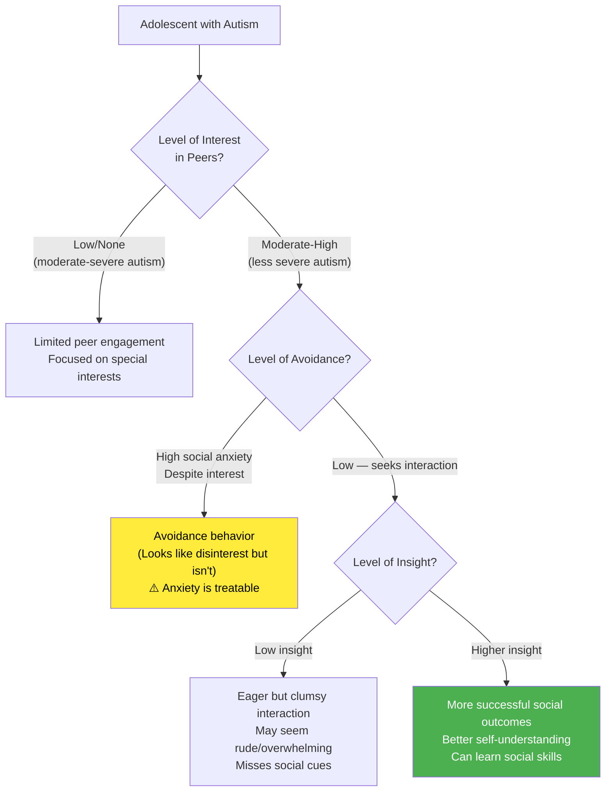

# Adolescence, Autism, Sexuality, and Coping with Loss of Normalcy

## Introduction

Every adolescent faces the challenges of identity formation, social navigation, and adjustment to a changing body and expanding world. But for adolescents with Autism Spectrum Disorder (ASD), these universal challenges intersect with the specific social-communication differences of autism — creating a uniquely complex developmental experience.

This unit addresses two particularly sensitive and often neglected dimensions of adolescence for young people with ASD: **the psychological experience of recognizing one's differences** (coping with the loss of normalcy) and **the emergence of sexuality** in the context of autism-specific social challenges.

These topics also have broader relevance — the frameworks for understanding coping, loss, and sexuality education apply across diverse adolescent populations.

---

**Source PDF**: 📄 [MPC-002 Block-3/Unit-4.pdf - Pages 44-48](/pdfs/MPC-002%20Life%20Span%20Psychology/Block-3/Unit-4.pdf)  
**Course**: MPC-002 Life Span Psychology

---

## Autism in Adolescence: The Three-Ingredient Framework

The IGNOU text uses a vivid metaphor: adolescents with autism bring their own "special flavor" to this period — a flavor determined by three key ingredients: **interest, avoidance, and insight**.

### Understanding the Three Dimensions

**Level of Interest**: Autism's core impact is on social development. Adolescents with moderate-severe autism may show little awareness of or interest in peer interaction. As severity decreases, interest in peers typically increases — but having the interest doesn't automatically bring the skills.

**Level of Avoidance**: Here is a critical clinical distinction — avoidance that *looks* like lack of interest is often driven by **social anxiety** rather than genuine disinterest. An adolescent might desperately want friends but become so anxious at the thought of approaching others that avoidance is the result. This distinction matters enormously because anxiety responds well to intervention, while genuine lack of interest requires a different approach entirely.

**Level of Insight**: For adolescents who seek interaction but lack social intuition, the quality of experience depends heavily on insight — awareness of one's own social difficulties. Low insight leads to inadvertent social errors (missing sarcasm, coming on too strong, failing to read nonverbal cues) that create rejection and confusion. Growing insight, while sometimes painful, enables learning and adaptation.

:::info Clinical Significance
This framework has important implications for intervention. Before designing support strategies, it's essential to assess all three dimensions. A one-size-fits-all approach will not serve adolescents who differ so dramatically in their social motivation, anxiety levels, and self-awareness.
:::

## Coping with Loss of Normalcy

### The Recognition Process

Most adolescents with autism reach a point — typically during adolescence — when they **recognize that they are meaningfully different from neurotypical peers**. This recognition, while ultimately important for authentic self-understanding, represents a genuine psychological loss that requires grieving and adaptation.

Three factors tend to facilitate this recognition:
1. **Higher interest in peers** — increased desire for peer connection makes the gap between desire and ability more salient
2. **Higher insight** — greater metacognitive awareness reveals the patterns of social difficulty
3. **Higher IQ** — greater cognitive capacity to observe and analyze one's own social failures

### The Coping Process: A Stage-Like Framework

The IGNOU text describes coping with loss of normalcy in terms that mirror grief models (echoing Kübler-Ross):

| Stage | Description | Manifestation |
|-------|-------------|---------------|
| **Anger** | Rage at the unfairness, directed at self, parents, or the world | Outbursts, blaming others, withdrawal |
| **Denial** | Refusing to acknowledge the difference | Insisting "I'm fine," avoiding the topic |
| **Depression** | Grief over losses (friendships, experiences, possibilities) | Withdrawal, low energy, hopelessness |
| **Acceptance** | Coming to terms with one's neurodifference | More realistic self-assessment |
| **Adaptation** | Finding ways to live well with one's differences | Developing compensatory strategies, community |

:::warning Important Caveat
These stages are **not linear**. An adolescent may experience elements of all stages simultaneously, cycle back and forth, or present different stages in different contexts. The framework is a guide for understanding, not a rigid sequence to track.
:::

### Signs of Clinical Depression in Adolescents

The IGNOU text specifically highlights the risk of **clinical depression** in adolescents navigating loss of normalcy. Parents and educators should watch for these signs (five or more present over multiple weeks warrants professional attention):

- Appearing sad most of the time
- Unusual irritability and anger over minor issues
- Sleep disturbances (insomnia, waking at night, difficulty returning to sleep)
- Excessive fatigue, napping during the day
- Significant changes in appetite (eating much less or much more)
- Persistent self-deprecation ("I'm stupid," "Nobody loves me")
- Statements about hating life or wishing they were dead
- Loss of interest in previously enjoyed activities
- Social withdrawal from family
- Inappropriate self-blame for problems

:::danger When to Seek Help
Any statements about wishing to be dead, or expressions of hopelessness about the future, warrant immediate professional consultation. This is not typical "teenage drama" — it represents a mental health emergency requiring trained evaluation.
:::

### The Role of Parents and Caregivers

The IGNOU text provides practical guidance for parents supporting adolescents through this coping process:

**Do**:
- Stay on the topic when the adolescent brings up a problem
- Listen without trying to immediately fix or minimize
- Validate feelings while gently providing reality-testing
- Maintain consistent availability and patience
- Offer professional counseling as an option (without pressure)
- Find ways to engage with the adolescent's special interests and strengths

**Don't**:
- Trivialize or minimize the problem
- Allow unchecked exaggeration or catastrophizing
- Push professional help directly if the adolescent is resistant
- Change the subject when the adolescent is discussing something difficult

**The Gift of Acceptance — Turning the Challenge Around**: Many adolescents with autism find profound identity and purpose by **making autism part of their identity**. Getting connected with autism communities, educating peers, creating online resources, or becoming advocates can transform a source of shame into a source of meaning and strength. This reframing — from "I'm broken" to "I'm different, and that difference has value" — is one of the most powerful therapeutic outcomes for adolescents with ASD.

## Acknowledging Sexuality

### The Core Reality

A critical and often overlooked fact: **adolescents with autism develop physiologically and sexually at the same pace as their neurotypical peers**. Their social development may lag, but their hormones do not. This creates a particular challenge — sexual drives and feelings emerge in adolescents who may lack the social comprehension to navigate them safely and appropriately.

### Parental Concerns and Responses

Parents of adolescents with autism commonly worry about:
- Their child being taken advantage of sexually
- Inappropriate sexual behavior in public (touching private parts, undressing, masturbating, or touching others inappropriately)
- Unwanted pregnancy (for daughters) or impregnating someone (for sons)
- Sexually transmitted infections
- Their child never having fulfilling sexual relationships

These concerns are legitimate, but the most problematic response is **avoidance** — hoping the issue resolves itself or that someone else will handle it.

### The Case for Direct Sex Education

The IGNOU text is clear: parents must **make a conscious decision to address sexuality directly rather than avoid it**. The specific approach matters:

**Step 1 — Assess first**: Ask direct questions about what the adolescent already knows, their desires, and their worries.

**Step 2 — Inform and guide**: Provide accurate, age-appropriate information. Discuss what is normal and what is not.

**Step 3 — Set clear limits**: After discussion, establish firm but respectful limits around inappropriate behavior.

**Step 4 — Model comfort**: Parents' own level of comfort communicating about sexuality sends a powerful message. Seeing that it's okay to discuss sexual feelings reduces tension and shame.

**Step 5 — Seek professional help when needed**: Appropriate professional support includes individualized sexuality assessment, needs-based sex education, and behavioral support for inappropriate sexual behaviors.

:::info The Ignorance Myth
A common parental belief is that sex education will *encourage* sexual activity. Research does not support this — in fact, comprehensive sex education is associated with delayed sexual initiation and safer sexual behavior. Ignorance does not prevent sexual activity; it makes it less safe.
:::

### Broader Application to All Adolescents

While the IGNOU text focuses on ASD, the principles of healthy sexuality education apply universally:
- Adolescents benefit from honest, non-shaming information about sexuality
- Open family communication about sexuality predicts better outcomes
- Shame and avoidance do not protect adolescents — they leave them vulnerable

## Recent Research (2020-2024)

**Sexual Development in ASD (Pecora et al., 2022)**: Study of 657 autistic adults found that sexual wellbeing is possible and common in autism, but is significantly shaped by prior education and social support received during adolescence. Adults who received good sex education as adolescents reported higher sexual satisfaction and fewer problematic experiences.

**Loss of Normalcy and Mental Health (Lever & Geurts, 2021)**: Longitudinal study found that autistic adolescents' mental health trajectories improve significantly when they have access to psychoeducation about autism and peer connection with other autistic individuals.

**Social Anxiety vs. Motivational Deficits (Cai et al., 2023)**: Neuroimaging study confirmed that many autistic adolescents show *heightened* social motivation alongside anxiety — directly supporting the clinical importance of distinguishing avoidance-from-anxiety from genuine social disinterest.

## Self-Assessment Questions

1. Describe the three "ingredients" (interest, avoidance, insight) that shape the adolescent experience for young people with autism. Why is the distinction between avoidance-from-anxiety and genuine disinterest clinically important?

2. What is "loss of normalcy" in the context of adolescence and autism? What stages of coping does the IGNOU text describe, and why are they non-linear?

3. List five signs of clinical depression in adolescents that should prompt professional consultation.

4. Why does the IGNOU text argue that parents must actively address sexuality rather than avoiding it? What specific steps are recommended?

5. Apply the concepts from this unit to a 14-year-old girl with high-functioning autism who wants friends but becomes intensely anxious when approaching peers. What is happening psychologically? What interventions might help?

## Memory Aid: LAIR for ASD Adolescence

**L** — **L**oss of normalcy (recognition and grieving of differences)  
**A** — **A**nxiety vs. avoidance (distinguish social anxiety from social disinterest)  
**I** — **I**nsight (key to successful social navigation and adaptation)  
**R** — **R**esponse (parents: stay, listen, validate, refer)

## 📚 External Resources

- 🌐 [Wikipedia: Autism Spectrum Disorder](https://en.wikipedia.org/wiki/Autism_spectrum_disorder)
- 🌐 [Wikipedia: Autism and Sexuality](https://en.wikipedia.org/wiki/Sexuality_and_gender_identity_in_autism)
- 🌐 [Wikipedia: Social Anxiety Disorder](https://en.wikipedia.org/wiki/Social_anxiety_disorder)
- 🌐 [Wikipedia: Adolescent Sexuality](https://en.wikipedia.org/wiki/Human_sexuality#Adolescence)
- 🎥 [TEDx: Sexuality Education for Youth with Autism](https://www.youtube.com/watch?v=pM6s3oqiXEI)
- 🎥 [Understanding Autism in Adolescence — Child Mind Institute](https://www.youtube.com/watch?v=GHeTQVNXW8k)
- 📖 [Autism Speaks: Puberty and Adolescence Guide](https://www.autismspeaks.org/puberty-and-adolescence)
- 🔬 [Pecora et al. (2022) - Sexual wellbeing in autistic individuals](https://doi.org/10.1177/13623613221101035) *(Autism)*
- 🔬 [Lever & Geurts (2021) - Identifying predictors of mental health challenges in adolescence with ASD](https://doi.org/10.1007/s10803-020-04726-5) *(Journal of Autism and Developmental Disorders)*
- 🔬 [Cai et al. (2023) - Social motivation and anxiety in autism](https://doi.org/10.1126/sciadv.abn4264) *(Science Advances)*

---

## Cross-References

- 🔗 [Challenges and Issues in Adolescent Development](/mpc-002/block-3/challenges-issues-adolescent-development) — General challenges of adolescence
- 🔗 [High-Risk Behaviours in Adolescence](/mpc-002/block-3/high-risk-behaviours-adolescence) — Another key adolescent challenge
- 🔗 [Self-Concept and Self-Esteem in Adolescence](/mpc-002/block-3/self-concept-self-esteem-adolescence) — Self-perception challenges
- 🔗 [Social Development and Peer Relationships](/mpc-002/block-3/social-development-peer-relationships-adolescence) — Peer context for autism challenges
