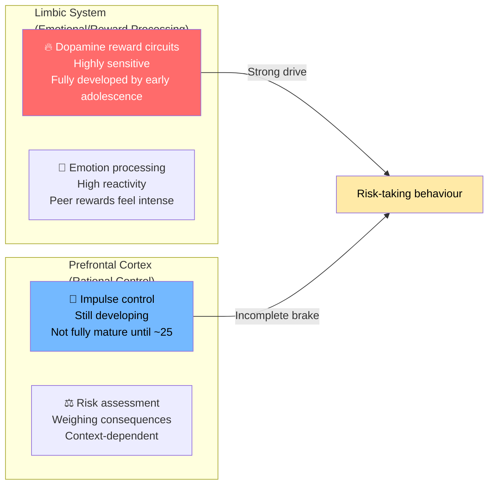
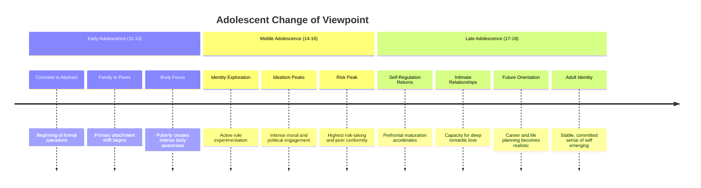

# High-Risk Behaviours and Change of Viewpoint in Adolescence

## Introduction

Late adolescence is simultaneously a period of exciting new capabilities and troubling new risks. The same brain changes that enable abstract moral reasoning and deep romantic love also lower impulse control and raise sensation-seeking. The same developmental needs that drive identity exploration — the need to test limits, prove independence, and be accepted by peers — also create vulnerability to behaviours that carry genuine health risks.

High-risk behaviours in adolescence represent one of the most pressing concerns for public health, families, and educators worldwide. They are also developmentally understandable — not random pathology, but expressions of normal developmental needs in sometimes dangerous directions.

Understanding *why* adolescents take risks — and what distinguishes protective versus destructive risk-taking — is essential for anyone working with young people.

---

**Source PDF**: 📄 [MPC-002 Block-3/Unit-4.pdf - Pages 48-50](/pdfs/MPC-002%20Life%20Span%20Psychology/Block-3/Unit-4.pdf)  
**Course**: MPC-002 Life Span Psychology

---

## The Developmental Context of Risk-Taking

Before examining specific high-risk behaviours, it's important to understand *why* risk-taking is developmentally elevated in adolescence. This isn't a design flaw — it reflects the neurological and social realities of this period.

### The Neurological Basis

The adolescent brain shows a developmental **imbalance** between two systems:

The reward system matures early; the regulatory system matures late. This mismatch creates a **window of elevated risk-taking** that is especially pronounced in the presence of peers (peer presence activates reward circuitry more strongly in adolescents than adults).

### The Social-Developmental Function

Risk-taking in adolescence is not purely neurological impulsivity — it also serves genuine developmental purposes:

- **Identity exploration**: Trying alcohol, extreme sports, or unconventional relationships is partly about discovering who one is
- **Proving adulthood**: Risk-taking signals to peers and oneself that childhood is over
- **Peer belonging**: Shared risk creates social bonds ("We did this together")
- **Sensation-seeking**: Meeting the need for novel, intense experiences

Understanding this doesn't mean accepting all risk-taking as harmless. It means that effective prevention addresses the *underlying needs* rather than simply trying to frighten adolescents.

## Common High-Risk Behaviours

### 1. Substance Use

Experimentation with alcohol, tobacco, and drugs is among the most common high-risk behaviours in adolescence globally. The IGNOU text notes this specifically as characteristic of late adolescence.

**Why adolescents use substances**:
- Peer influence and social belonging
- Stress reduction and emotional regulation
- Curiosity and experimentation
- Defiance and identity assertion
- Sensation-seeking
- Modelling from adults and media

**Risk factors that increase vulnerability**:
- Strong peer norms around substance use
- Family history of substance use disorders
- Poor parental monitoring
- High impulsivity, sensation-seeking temperament
- Mental health problems (self-medication)
- Trauma history

**Protective factors**:
- Strong family connectedness
- School engagement and academic commitment
- Positive peer norms
- Religious/spiritual involvement
- Participation in structured extracurricular activities

**Research Finding (Johnston et al., 2021)**: The "Monitoring the Future" study (USA) found that adolescents who clearly anticipate attending college show significantly lower rates of substance use — suggesting that clear future orientation is protective.

### 2. Eating Disorders

The IGNOU text specifically highlights eating disorders as **unique to this developmental period** — a health problem that emerges in late adolescence with particular force.

**Why eating disorders peak in adolescence**:
- Puberty transforms bodies, often in ways that feel uncontrollable and unwanted
- Social comparison to media-presented "ideal" bodies becomes intense
- Peer culture around appearance and attractiveness peaks
- Adolescent egocentrism (imaginary audience) amplifies concerns about being judged for appearance
- The personal fable creates a sense that thinness = specialness

**Types of eating disorders relevant to adolescence**:

| Disorder | Core Features | Warning Signs |
|----------|---------------|---------------|
| **Anorexia Nervosa** | Extreme food restriction, distorted body image | Dramatic weight loss, food avoidance, excessive exercise, denial of hunger |
| **Bulimia Nervosa** | Binge-purge cycles | Evidence of bingeing, bathroom trips after meals, dental erosion |
| **Binge Eating Disorder** | Recurrent bingeing without purging | Episodes of eating large amounts rapidly, secrecy around eating |
| **Avoidant/Restrictive Food Intake** | Restriction not driven by appearance concerns | Limited food range, growth faltering |

**India-specific context**: Eating disorder rates have been rising in India, particularly among urban adolescent girls, as Western body ideals penetrate media and social networks. Traditional Indian beauty standards (including fuller figures as signs of health and prosperity) are being displaced by thinness ideals. However, binge eating disorder is increasing across gender lines.

### 3. Sexual Risk Behaviours

Sexual activity begins for many adolescents during this period. The associated risks include:
- Sexually transmitted infections (STIs), including HIV
- Unintended pregnancy
- Emotional consequences of premature or coerced sexual experiences
- Sexual exploitation and abuse

**Key determinants of safer sexual behavior in adolescents**:
- Comprehensive, non-shame-based sex education
- Open communication with trusted adults
- Access to contraception and reproductive health services
- Strong self-efficacy and communication skills
- Postponement of sexual initiation

**Research consensus**: Abstinence-only education is ineffective at delaying sexual initiation or reducing STI/pregnancy rates. Comprehensive sex education that includes contraceptive information, consent education, and communication skills produces significantly better outcomes.

### 4. Delinquency and Antisocial Behaviour

Antisocial behavior (vandalism, theft, fighting, gang involvement) peaks in mid-to-late adolescence and then typically declines in adulthood. This is so consistent that criminologists call it the "age-crime curve."

**Types**:
- **Life-course-persistent** (begins in childhood, continues into adulthood — represents true pathology, ~5% of adolescents)
- **Adolescence-limited** (begins and ends in adolescence — far more common, represents developmentally-bounded behavior)

Most adolescent delinquency falls into the adolescence-limited category and represents:
- Status violation (proving independence, defying authority)
- Peer influence in contexts with low supervision
- Expressions of frustration and unmet needs

### 5. Adventurous and Extreme Sports

The IGNOU text includes "adventurous sport" in the list of high-risk behaviors. This is an important inclusion — risk-taking is not always substance-related. The same developmental drives that push adolescents toward extreme sports (sensation-seeking, peer status, proving capability) can be channeled into productive, managed risk.

**A note on "positive risk-taking"**: Research on positive youth development distinguishes between destructive risk-taking and *productive* risk-taking — activities that involve challenge, possibility of failure, and genuine achievement. Sports, arts performance, debate competitions, and entrepreneurship all involve risk and reward systems in developmentally healthy ways.

## Change in Adolescent Viewpoint: The Positive Dimension

While much attention focuses on adolescent risks, the IGNOU text also highlights the **positive changes in adolescent viewpoint and capabilities** that emerge during this period — changes that represent genuine developmental achievements:

**Capacity for serious relationships**: Late adolescents can love tenderly, with genuine emotional depth and capacity for intimacy.

**Self-regulation and social responsibility**: By late adolescence, most young people have developed the capacity to self-regulate, accept social norms, and engage constructively with cultural institutions.

**Moral and philosophical reasoning**: The emergence of formal operational thinking enables genuine moral philosophy — understanding rights, privileges, and abstract ethical principles.

**Goal-setting and follow-through**: Late adolescents can set meaningful goals and pursue them with sustained effort.

**Respect and dignity**: The adolescent's demand to be "treated as an adult" reflects a genuine developmental achievement — they have earned greater respect and responsibility.

These positive changes are as much a part of adolescent development as the challenges. The period ends, in Erikson's framework, with a young person ready for intimacy, meaningful work, and adult contribution — a remarkable transformation from the dependent child of a decade earlier.

## Prevention and Intervention

### Individual-Level Strategies

- **Life skills training**: Teaching decision-making, assertiveness, and refusal skills
- **Mindfulness and self-regulation**: Practices that strengthen impulse control
- **Future orientation**: Helping adolescents connect current choices to future goals
- **Mental health support**: Addressing underlying anxiety, depression, or trauma that drives risky behavior

### Family-Level Strategies

- **Authoritative parenting**: Warm, firm, responsive — research consistently shows this is most protective
- **Open communication**: Families that talk openly about risk (without lecturing) have adolescents who take fewer risks
- **Monitoring without surveillance**: Knowing where adolescents are and who they're with, without intrusive control
- **Building connection**: Strong family relationships are the single most robust protective factor

### School and Community-Level Strategies

- **Comprehensive health education**: Including sex education, substance use information, and mental health
- **Extracurricular opportunities**: Meaningful structured activities channel developmental needs productively
- **Mentoring programs**: Access to caring adult mentors outside the family
- **Safe physical environments**: Reducing availability of substances; safe recreational spaces

### Indian Context

In India, adolescent high-risk behaviour prevention must account for:
- **Gender dynamics**: Girls face specific risks around sexual exploitation and disordered eating; boys around substance use and violence
- **Rapid urbanization**: Creates new contexts for risk (nightlife, internet, anonymity) for previously protected rural adolescents
- **Family structure**: Extended family networks offer both protective monitoring and, potentially, stigmatizing responses to mental health issues
- **Digital landscape**: Growing smartphone penetration creating new risk contexts (cyberbullying, online predation, social media comparison)

## Self-Assessment Questions

1. Explain the neurological basis of elevated risk-taking in adolescence. Why does peer presence specifically amplify risk-taking behavior?

2. Why does the IGNOU text describe eating disorders as "unique to this group of late adolescents"? What developmental factors specifically predispose adolescents to eating disorders?

3. Distinguish between "adolescence-limited" and "life-course-persistent" delinquency. Why is this distinction important for intervention?

4. What is "positive risk-taking" and how does it differ from destructive risk-taking? Give two examples of how adolescent developmental needs can be channeled into constructive rather than harmful activities.

5. Design a family-level strategy for reducing adolescent substance use. Which evidence-based principles would you incorporate?

## Memory Aid: SEEDS of Risk

**S** — **S**ensation-seeking (neurological drive for novelty and intensity)  
**E** — **E**gocentrism (personal fable: "bad things won't happen to me")  
**E** — **E**motion dysregulation (brain imbalance: reward > control)  
**D** — **D**efiance (identity assertion through rule-breaking)  
**S** — **S**ocial pressure (peer influence on risk decisions)

## 📚 External Resources

- 🌐 [Wikipedia: Risk-Taking Behaviour in Adolescence](https://en.wikipedia.org/wiki/Risk-taking_behavior)
- 🌐 [Wikipedia: Eating Disorders](https://en.wikipedia.org/wiki/Eating_disorder)
- 🌐 [Wikipedia: Adolescent Substance Use](https://en.wikipedia.org/wiki/Adolescent_substance_abuse)
- 🌐 [Wikipedia: Juvenile Delinquency](https://en.wikipedia.org/wiki/Juvenile_delinquency)
- 🎥 [TED-Ed: Why Do Teenagers Take More Risks?](https://www.youtube.com/watch?v=bImfSGNDERs)
- 🎥 [Crash Course Psychology: Adolescent Development](https://www.youtube.com/watch?v=sz68HFqPqFc)
- 📖 [WHO: Adolescent Health](https://www.who.int/health-topics/adolescent-health)
- 🔬 [Steinberg (2022) - Adolescent risk-taking: How do we understand it?](https://doi.org/10.1177/09637214211002288) *(Current Directions in Psychological Science)*
- 🔬 [Solmi et al. (2021) - Age at onset of mental disorders worldwide: large-scale meta-analysis](https://doi.org/10.1038/s41380-021-01161-7) *(Molecular Psychiatry)*
- 🔬 [Kann et al. (2020) - Youth Risk Behavior Surveillance — US](https://www.cdc.gov/mmwr/volumes/69/ss/ss6901a1.htm) *(CDC MMWR Surveillance Summary)*

---

## Cross-References

- 🔗 [Challenges and Issues in Adolescent Development](/mpc-002/block-3/challenges-issues-adolescent-development) — Broader framework of adolescent challenges
- 🔗 [Adolescence, Autism, Sexuality, and Loss of Normalcy](/mpc-002/block-3/adolescence-autism-sexuality-loss-normalcy) — Specific vulnerability populations
- 🔗 [Self-Concept and Self-Esteem in Adolescence](/mpc-002/block-3/self-concept-self-esteem-adolescence) — Low self-esteem as risk factor
- 🔗 [Social Development and Peer Relationships](/mpc-002/block-3/social-development-peer-relationships-adolescence) — Peer influence on risk-taking
