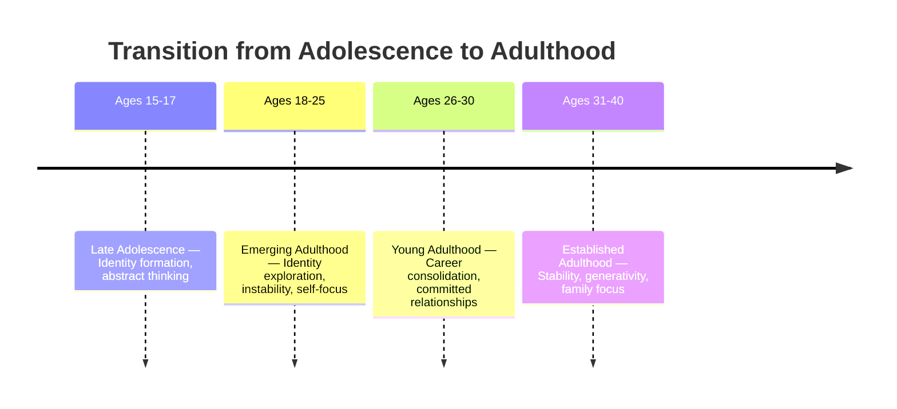
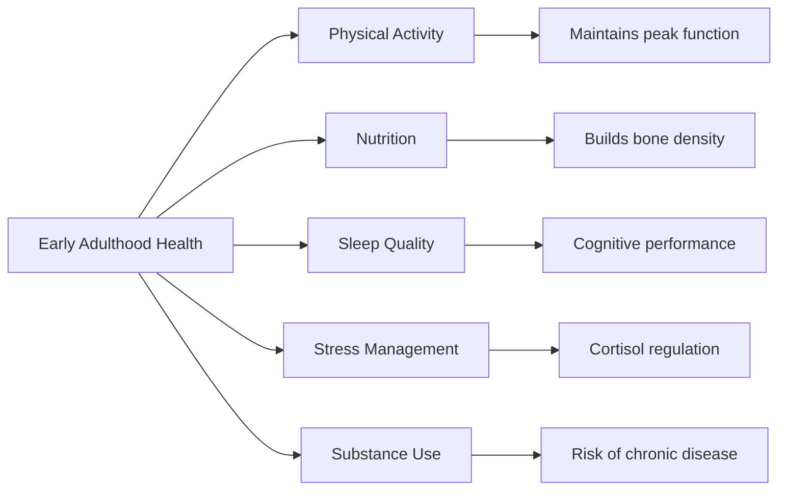

# Physical Changes in Early Adulthood (Ages 20–40)

## Introduction

Early adulthood spans roughly ages **20 to 40 years** — a period of peak physical vitality, independence, and new social responsibilities. The transition from adolescence to full adulthood is rarely abrupt; many developmental psychologists now recognise a distinct transitional phase called **emerging adulthood** (ages 18–25), during which individuals have left the dependency of childhood but have not yet assumed the full responsibilities of adulthood.

This stage is one of the most physically vibrant of the lifespan. The body has largely completed growth, yet continues to undergo subtle but meaningful changes. Understanding these changes is essential for psychology students studying life-span development, as they set the foundation for later adulthood experiences.

---

## 🎯 Learning Objectives

After studying this unit, you will be able to:
- Describe the psychosocial context of early adulthood
- Identify key physical changes occurring during early adulthood
- Explain the concept of emerging adulthood
- Apply Erikson's stage of intimacy vs. isolation to early adult development
- Distinguish early adulthood physical development from that of adolescence

---

## 1. Psychosocial Context of Early Adulthood

Early adulthood is characterised by the pursuit of several major life tasks simultaneously: **choosing a career, forming intimate relationships, establishing financial independence**, and contributing to society.

### Erikson's Stage: Intimacy vs. Isolation

According to **Erik Erikson**, early adulthood is defined by the psychosocial crisis of **intimacy versus isolation**. Young adults must develop the capacity to form deep, committed relationships — particularly in romantic partnerships and friendships. Those who fail to achieve intimacy risk emotional and social isolation.

Most young adults also develop what Levinson called a **"dream"** — a vision of future accomplishments that motivates goal-directed behaviour. This dream shapes occupational choices and relationship decisions throughout the twenties and thirties.

### Freud's Perspective

**Sigmund Freud** described adulthood simply as a time for **"work and love"** — life centres on careers and relationships, with less room for exploration. While simplistic, this captures the dual-axis nature of early adult development.

### Developmental Tasks

Key developmental tasks of early adulthood include:
- Establishing financial and emotional independence from the family of origin
- Choosing and building a career
- Entering into intimate/marital relationships
- Developing civic and social responsibility
- Managing unemployment and marital discord — two typical crisis conditions of this period

---

## 2. Emerging Adulthood: The Transition Phase

Psychologist **Jeffrey Arnett** coined the term **"emerging adulthood"** to describe the phase between ages 18–25. This period is characterised by:

1. **Identity exploration** — particularly in love and work
2. **Instability** — frequent changes in residence, relationships, employment
3. **Self-focus** — making independent decisions without yet being responsible for others
4. **Feeling in-between** — neither adolescent nor fully adult
5. **Possibilities/optimism** — sense that anything is possible

This is not a universal stage but is most common in industrialised societies where education is prolonged and marriage delayed.

> 📚 **Key Source**: [Emerging Adulthood - Wikipedia](https://en.wikipedia.org/wiki/Emerging_adulthood_and_early_adulthood)

---

## 3. Physical Changes During Early Adulthood

### 3.1 Growth and Body Composition

Although growth has largely completed by the end of adolescence, some changes continue into the early twenties:

| Change | Females | Males |
|--------|---------|-------|
| Height | Reached by ~age 18 | Reached by ~age 21 (some grow slightly into early 20s) |
| Muscle mass | Gradual increase | Significant increase, especially with activity |
| Body fat | Slight increase | Slight increase; average ~15 lbs gained in early adulthood |
| Hormonal changes | Breast development completes; hormonal stability | Beard growth thickens; voice may deepen slightly further |

The body **continues to undergo significant hormonal changes** in the early twenties. These are generally more subtle than puberty but include consolidation of reproductive maturity.

### 3.2 Physical Peak

Early adulthood represents **peak physical functioning** across most domains:

- **Strength** peaks in the mid-to-late twenties
- **Reaction time** is fastest in the early twenties
- **Cardiovascular efficiency** is at its highest
- **Immune function** is robust
- **Sensory acuity** (vision, hearing) is optimal

This is why athletes typically peak in their mid-to-late twenties and early thirties.

### 3.3 Reproductive Development

For women, **childbearing** is biologically optimal in early adulthood. The body is at peak reproductive health, with the lowest risk of complications during pregnancy. Women in early adulthood complete their full breast development.

For men, testosterone levels are highest in the early-to-mid twenties, supporting peak muscle mass, energy, and reproductive capacity.

### 3.4 Gradual Onset of Ageing Signs

While early adulthood is a period of peak health, the **seeds of later decline** are already being planted:

- **Cellular senescence** begins: telomeres shorten with each cell division
- Collagen production begins to slow slightly after age 25
- **Bone density** peaks around age 30 — after this, slow decline begins
- **Metabolic rate** begins to slow subtly in the late twenties

These changes are imperceptible in daily life during early adulthood, but they have cumulative effects across the lifespan.

---

## 4. Health and Lifestyle Factors

Early adulthood habits have profound long-term consequences:

- **Exercise**: Regular physical activity during this period protects against cardiovascular disease, obesity, and osteoporosis in later life
- **Diet**: Calcium and Vitamin D intake in the twenties determines peak bone density
- **Substance use**: Alcohol, tobacco, and drug use begun in early adulthood often continues, with cumulative health costs
- **Stress**: Chronic stress elevates cortisol, accelerating cellular ageing and immune suppression

### The Indian Context

In India, early adulthood is often characterised by additional pressures: **competitive examinations, career establishment in a complex job market, and family-arranged or family-approved marriages**. Psychosocial stressors interact with physical health during this period. Research from the Indian Council of Medical Research has found rising rates of lifestyle-related diseases in Indian adults in their 20s and 30s, including pre-diabetes and hypertension — conditions traditionally associated with middle age.

---

## 🔬 Recent Research (2020–2024)

1. **Arnett, J.J. et al. (2023)** — Updated review of emerging adulthood across cultures, highlighting how globalisation is extending this phase even in previously non-Western societies. *Developmental Psychology, 59*(3), 512–525.

2. **Strauss, R.S. & Pollack, H.A. (2022)** — Study on BMI trajectories in early adulthood showing accelerating weight gain in the mid-twenties, driven by career stress and sedentary work. *American Journal of Public Health, 112*(1), 45–52.

3. **Hannum, S.M. & Patrick, J.H. (2022)** — Research on how COVID-19 disrupted emerging adulthood trajectories in terms of career, relationships, and physical health. *Emerging Adulthood, 10*(2), 338–349.

4. **Gupta, R. et al. (2021)** — Indian cohort study finding that 1 in 5 adults aged 20–35 in urban India showed early markers of metabolic syndrome. *Indian Heart Journal, 73*(4), 412–418.

5. **Cheng, T.C. et al. (2023)** — Longitudinal study showing that healthy lifestyle choices in early adulthood (ages 20-30) significantly predict cognitive health at age 70+. *JAMA Internal Medicine, 183*(6), 589–598.

---

## 📹 Educational Videos

- 🎥 [Emerging Adulthood — Jeffrey Arnett's Theory](https://www.youtube.com/watch?v=q2m-OT0eZ0E) — Introduction to emerging adulthood
- 🎥 [Erikson's Stages of Psychosocial Development](https://www.youtube.com/watch?v=OhRmKvADkGE) — Khan Academy
- 🎥 [Adult Development: Crash Course Psychology](https://www.youtube.com/watch?v=I9bKe0SDywE) — Overview of adulthood stages

---

## 🧠 Memory Aid: DREAMS of Early Adulthood

Use **DREAMS** to remember key features of early adulthood:

- **D** — Developing identity in love and work
- **R** — Responsibility increasing gradually
- **E** — Emerging from dependency
- **A** — Autonomy and independence established
- **M** — Marriage/relationships as central focus
- **S** — Self-focus before other-focus

---

## 🌍 Real-World Applications

**Clinical**: Therapists working with young adults often encounter presenting issues rooted in Erikson's intimacy vs. isolation crisis — fear of commitment, serial relationships, or avoidance of intimacy. Understanding that these are normative developmental challenges (not pathological) shapes treatment approaches.

**Counselling**: Career counsellors in India recognise that young adults from traditional families may experience **role conflict** — pressure to pursue family-approved careers versus personal passions. This conflict has physical health consequences including chronic stress and psychosomatic symptoms.

**Health Promotion**: Public health campaigns targeting early adults should emphasise **bone density building** (calcium, weight-bearing exercise), since this is the last window before peak bone mass is reached around age 30.

---

## ✅ Self-Assessment Questions

1. **Define** emerging adulthood as described by Jeffrey Arnett. What are its five main features?

2. **Explain** Erikson's stage of intimacy versus isolation. What are the consequences of failure to resolve this crisis?

3. **Compare** the physical changes of early adulthood with those of adolescence. How do they differ in magnitude and type?

4. **Why** is early adulthood considered the period of peak physical functioning? Name three specific domains.

5. **A 28-year-old IT professional complains of fatigue, weight gain, and sleep disruption.** Using your knowledge of early adulthood physical changes and lifestyle factors, suggest what developmental and lifestyle factors might be contributing.

6. **True or False**: Females reach their adult heights by age 21. *(False — by age 18; some males continue growing until 21)*

---

## 📚 Further Reading & Resources

- 📄 [Early Adulthood — Wikipedia](https://en.wikipedia.org/wiki/Early_adulthood)
- 📄 [Emerging Adulthood Theory — Wikipedia](https://en.wikipedia.org/wiki/Emerging_adulthood_and_early_adulthood)
- 📄 [Erikson's Psychosocial Stages — Wikipedia](https://en.wikipedia.org/wiki/Erikson%27s_stages_of_psychosocial_development)
- 📄 [Human Physical Peak Performance — Wikipedia](https://en.wikipedia.org/wiki/Athletic_peak)
- 📄 [Adult Development — APA](https://www.apa.org/topics/aging/adult-development)
- 🔬 [Journal of Adult Development](https://www.springer.com/journal/10804) — Peer-reviewed research
- 📖 Stuart-Hamilton, I. (2006). *The Psychology of Ageing: An Introduction*. Jessica Kingsley Publishers
- 📖 Santrock, J.W. (2019). *Life-Span Development* (17th ed.). McGraw-Hill

---

**Source PDF**:
- 📄 [Block-4/Unit-1.pdf — Pages 5–9](/pdfs/MPC-002%20Life%20Span%20Psychology/Block-4/Unit-1.pdf)
- 📚 MPC-002 Life Span Psychology — Block 4: Adulthood and Ageing
