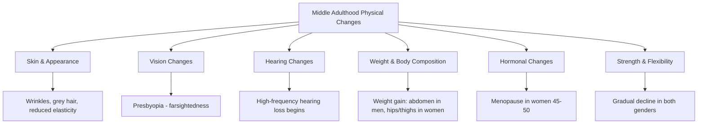

# Physical Changes in Middle Adulthood (Ages 40–65)

## Introduction

Middle adulthood — spanning approximately **ages 40 to 65** — is a period of significant transition. While still capable and productive, the body begins to show unmistakable signs of ageing. This period is also, paradoxically, one of great psychological maturity, social contribution, and often peak career achievement.

The IGNOU curriculum frames middle adulthood as a complex mix of **decline and generativity** — where the best intellectual and creative work often emerges even as the body begins its gradual retreat. As Erikson noted, this is the stage of **generativity versus self-absorption**: the challenge of contributing meaningfully to future generations rather than withdrawing into self-concern.

---

## 🎯 Learning Objectives

After studying this unit, you will be able to:
- Identify and describe the major physical changes of middle adulthood
- Explain presbyopia, menopause, and related conditions
- Apply Erikson's generativity vs. stagnation framework
- Describe the "age thirty transition" and midlife crisis concepts
- Compare physical changes in men and women during this period

---

## 1. Psychosocial Context: Generativity vs. Stagnation

**Erik Erikson** characterised middle adulthood as the stage of **generativity versus self-absorption (stagnation)**. Generativity refers to:

- Concern for guiding the next generation
- Contributing through family, work, and community
- Creating something that outlasts oneself

Those who fail to develop generativity may become **self-absorbed**, preoccupied with their own needs and regrets.

**Midlife Transition**: The "turbulence of the forties" — a period of reappraisal in which individuals question their earlier choices. Many people in their early-to-mid thirties undergo an **"age thirty transition"** — a reassessment of career and social choices before settling into the stability of middle adulthood.

Interestingly, research consistently shows that the **best creative works** of scientists, artists, and writers are produced during the **late forties and early fifties** — suggesting that cognitive wisdom and experience offset physical decline during this period.

---

## 2. Physical Changes Overview



---

## 3. Skin and Appearance

The most **visually apparent** change in middle adulthood is the skin:

- **Loss of elasticity** — particularly in the face, leading to lines, wrinkles, and sagging
- **Thinning of subcutaneous fat** — contributes to hollowed cheeks and visible bone structure
- **Hair changes** — graying begins (pigment-producing melanocytes decline); thinning hair in both genders
- **Shorter stature** — most individuals lose a small amount of height through spinal compression (vertebral disc thinning)
- **Dental changes** — teeth may yellow; gum recession begins

Many adults respond to these changes by seeking **anti-ageing interventions**: plastic surgery, hair dye, exercise programmes, and vitamin supplements. These responses reflect the psychological significance of physical appearance to identity in middle adulthood.

---

## 4. Vision: Presbyopia and Other Changes

### Presbyopia (Ages 40+)

One of the most reliable physical markers of middle adulthood is **presbyopia** (from Greek: "old eye"):

- The **crystalline lens** of the eye becomes less flexible and less elastic
- Reduced ability to **accommodate** (change focus for near objects)
- Reading glasses or bifocals become necessary for many people by their mid-forties
- Increased **sensitivity to glare** — for example, on wet roads, windshields, or brightly lit stores

### Progressive Vision Changes (50s)

- Slower **dark adaptation** — takes longer to adjust when entering a dark room or going outside on a bright day
- Increased need for **ambient lighting** for reading and close work
- Onset of other conditions such as **cataracts** (clouding of the lens) becomes more likely

> 📚 **Key Source**: [Presbyopia — Wikipedia](https://en.wikipedia.org/wiki/Presbyopia)

---

## 5. Hearing: Presbycusis

**Presbycusis** (age-related hearing loss) typically begins in the forties and fifties:

- High-frequency sounds are lost first — difficulty hearing consonants, sirens, or high-pitched voices
- Difficulty distinguishing speech in **noisy environments**
- Men typically experience hearing loss earlier and more severely than women
- Many individuals over 50 show some measurable hearing loss on audiometry

> 📚 **Key Source**: [Age-related Hearing Loss — Wikipedia](https://en.wikipedia.org/wiki/Presbycusis)

---

## 6. Weight and Body Composition

| Feature | Men | Women |
|---------|-----|-------|
| Weight gain location | Abdominal region ("beer belly") | Hips and thighs |
| Muscle mass | Gradual decline (sarcopenia begins) | Gradual decline |
| Bone density | Slow loss begins | Accelerates after menopause |
| Metabolic rate | Continues to slow | Continues to slow |

The **redistribution of body fat** is partly hormonal:
- In men, declining testosterone shifts fat towards visceral (abdominal) distribution — higher risk of cardiovascular disease
- In women, declining oestrogen after menopause shifts fat from peripheral to central distribution

---

## 7. Hormonal Changes

### Menopause (Women, Ages 45–50)

**Menopause** is defined as the permanent cessation of menstruation, marking the end of reproductive capacity:

- Typically occurs between **ages 45 and 55** (average: ~51 in Western populations, slightly earlier in Indian women)
- Preceded by **perimenopause** — a transition phase of 2–8 years of irregular cycles
- Caused by declining **oestrogen and progesterone** production as follicles are depleted

**Symptoms associated with menopause**:
- Hot flashes (vasomotor symptoms) — sudden feelings of heat, flushing, sweating
- Night sweats disrupting sleep
- Vaginal dryness and changes in sexual response
- Mood fluctuations, irritability
- Accelerated **bone density loss** (osteoporosis risk increases)
- Cardiovascular risk increases as oestrogen's protective effects diminish

> 📚 **Key Source**: [Menopause — Wikipedia](https://en.wikipedia.org/wiki/Menopause)

### Men: Andropause / Male Climacteric

Men do not experience a sudden hormonal shift like menopause, but **testosterone levels** decline gradually (about 1% per year after age 30):
- Reduced muscle mass and strength
- Changes in sexual function and libido
- Increased fatigue
- Some men experience **emotional lability** akin to midlife crisis

---

## 8. Strength, Flexibility, and Physical Performance

- **Muscular strength** peaks in the late twenties and declines gradually from the thirties
- **Flexibility** decreases as connective tissue loses elasticity
- **Reaction time** slows moderately
- Recovery from **injury or illness** takes longer
- Men in middle adulthood often show heightened concern about **health, strength, power, and sexual potency**

Regular exercise remains highly effective in **slowing** these declines. Studies show that physically active middle-aged adults maintain functional capacity comparable to sedentary individuals 15–20 years younger.

---

## 9. The "Midlife Crisis" Debate

```mermaid
graph LR
    A[Midlife Crisis] --> B[Levinson's Theory]
    A --> C[Empirical Evidence]
    B --> D[Inevitable turbulence in 40s: "Season of Life"]
    C --> E[Not universal - affects ~10-20% of adults]
    C --> F[Cultural and social factors strongly influence experience]
    C --> G[Many experience midlife as satisfaction, not crisis]
```

The concept of the "midlife crisis" is popularly believed to be universal, but research suggests it is **not inevitable**. Levinson (1978) described the midlife transition as a period of questioning and potential upheaval. However, large-scale studies (e.g., MIDUS Study: Midlife in the United States) find that:

- Most middle-aged adults do **not** experience a dramatic crisis
- Many report **high levels of life satisfaction** and purpose
- Cultural expectations and life events (job loss, divorce, bereavement) influence the experience more than age itself

In Indian culture, middle adulthood is often framed as a period of **dharmic responsibility** — fulfilling duties to family and society — which may buffer against Western-style midlife crisis experiences.

---

## 🔬 Recent Research (2020–2024)

1. **Finch, C.E. & Kirkwood, T.B.L. (2023)** — Review of the biology of middle-aged physical decline, emphasising that lifestyle factors explain more variance than genetics alone. *Nature Aging, 3*(2), 120–135.

2. **Bromberger, J.T. & Epperson, C.N. (2022)** — Longitudinal study on menopause-related mood changes, showing that psychological stress amplifies hormonal symptom severity. *JAMA Psychiatry, 79*(4), 355–362.

3. **Bhattacharya, A. et al. (2021)** — Indian study on early menopause in urban working women, finding average age of menopause dropping to 46.2 years, linked to stress and lifestyle. *Journal of Obstetrics and Gynecology India, 71*(3), 289–294.

4. **Lachman, M.E. et al. (2022)** — MIDUS study update showing that midlife adults report the highest sense of purpose and control of any age group, challenging negative stereotypes. *Psychological Science, 33*(7), 1089–1104.

5. **Santosa, S. & Jensen, M.D. (2021)** — Hormonal influences on sex-specific fat distribution changes during middle adulthood. *Obesity Reviews, 22*(5), e13186.

---

## 📹 Educational Videos

- 🎥 [Middle Adulthood — Crash Course Psychology](https://www.youtube.com/watch?v=I9bKe0SDywE) — Development in middle age overview
- 🎥 [Menopause Explained — Khan Academy Health](https://www.khanacademy.org/science/health-and-medicine/reproductive-system-diseases) — Clear explanation of hormonal changes
- 🎥 [Erikson's Generativity vs Stagnation Stage](https://www.youtube.com/watch?v=OhRmKvADkGE) — Psychosocial development video

---

## 🧠 Memory Aid: WARM Changes of Middle Adulthood

Use **WARM** to remember key physical changes:

- **W** — Wrinkles and weight redistribution
- **A** — Ageing sensory systems (presbyopia, presbycusis)
- **R** — Reduced strength, flexibility, and hormones (menopause)
- **M** — Metabolic slowing and muscle mass loss

---

## 🌍 Real-World Applications

**Clinical Application**: Understanding menopause is essential for counsellors working with women in their forties and fifties. Many women conflate **psychological symptoms** (depression, anxiety) with hormonal changes, when in fact psychosocial stressors (empty nest, ageing parents, career pressures) may be primary drivers.

**Health Counselling**: Middle-aged adults benefit from **anticipatory guidance** about vision changes. Encouraging regular eye examinations from age 40 onwards, and normalising reading glasses as an expected rather than stigmatised change, improves health-seeking behaviour.

**Indian Context**: In India, menopause is often experienced through a cultural lens of social role changes (grandparenthood, reduced household authority) rather than purely biomedical terms. Counsellors should be sensitive to these cultural dimensions when providing support.

---

## ✅ Self-Assessment Questions

1. **Explain** presbyopia. At what age does it typically begin, and what visual changes characterise it?

2. **Describe** the physical changes that occur during menopause and explain why they occur.

3. **Compare** weight distribution patterns in middle-aged men and women. What hormonal factors explain these differences?

4. **Explain** Erikson's concept of generativity. How does it relate to the psychological experience of middle adulthood?

5. **Is the midlife crisis universal?** Summarise the evidence for and against this claim.

6. **Fill in the blanks**: A decline in near vision is called ___________. Women between the ages of 45 and 50 typically experience ___________. *(Presbyopia; Menopause)*

---

## 📚 Further Reading & Resources

- 📄 [Middle Adulthood — Wikipedia](https://en.wikipedia.org/wiki/Middle_age)
- 📄 [Menopause — Wikipedia](https://en.wikipedia.org/wiki/Menopause)
- 📄 [Presbyopia — Wikipedia](https://en.wikipedia.org/wiki/Presbyopia)
- 📄 [Presbycusis (Age-Related Hearing Loss) — Wikipedia](https://en.wikipedia.org/wiki/Presbycusis)
- 📄 [Erikson's Generativity vs. Stagnation — Wikipedia](https://en.wikipedia.org/wiki/Erikson%27s_stages_of_psychosocial_development)
- 🔬 [MIDUS Study — University of Wisconsin](https://midus.wisc.edu/) — Landmark longitudinal study of midlife in the USA
- 📖 Stuart-Hamilton, I. (2006). *The Psychology of Ageing: An Introduction*. Jessica Kingsley Publishers
- 📖 Lachman, M.E. (Ed.) (2001). *Handbook of Midlife Development*. Wiley

---

**Source PDF**:
- 📄 [Block-4/Unit-1.pdf — Pages 7–9](/pdfs/MPC-002%20Life%20Span%20Psychology/Block-4/Unit-1.pdf)
- 📚 MPC-002 Life Span Psychology — Block 4: Adulthood and Ageing
