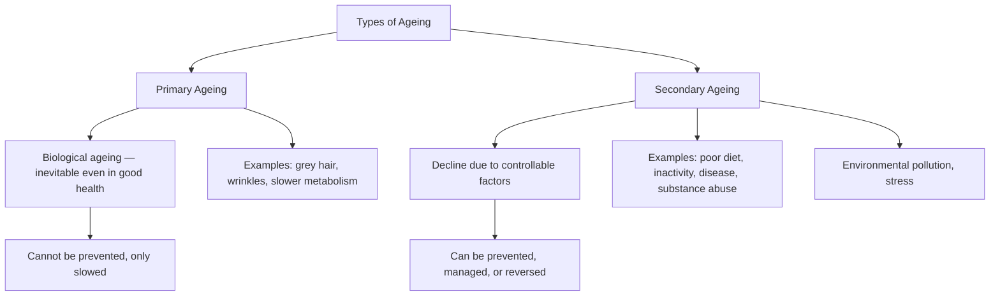
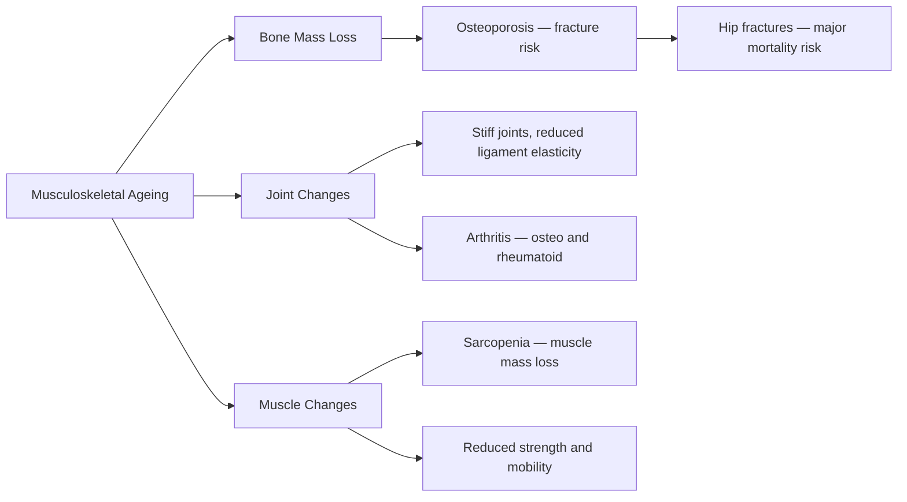

# Physical Changes in Old Age (Ages 65+)

## Introduction

Late adulthood or **old age** begins at approximately **65 years of age** and encompasses the final phase of the human lifespan. This period is not a single homogeneous stage — gerontologists distinguish between the **"young-old"** (65–74), **"middle-old"** (75–84), and **"oldest-old"** (85+), each with different physical profiles and functional capacities.

Old age is marked by a complex interplay of **primary ageing** (inevitable biological decline) and **secondary ageing** (decline due to disease, lifestyle, and environmental factors). Understanding this distinction is clinically critical: many changes previously attributed to ageing are, in fact, consequences of **preventable or treatable conditions**.

This is the most comprehensive section of MPC-002/Block-4/Unit-1, covering the widest range of body systems affected by ageing.

---

## 🎯 Learning Objectives

After studying this unit, you will be able to:
- Define and distinguish primary and secondary ageing
- Describe sensory changes in old age (vision, hearing, taste, smell, touch)
- Explain cardiovascular, respiratory, and immune system changes
- Discuss physical disabilities common in late adulthood
- Apply the concept of functional age to understanding individual differences
- Identify preventive strategies for maintaining health in old age

---

## 1. Primary vs. Secondary Ageing

**Functional age** — the actual competence and performance a person displays, regardless of chronological age — is a key concept here. People age biologically at very different rates:

- **Young-old elderly**: appear physically young for their years, maintain high functional capacity
- **Old-old elderly**: appear frail, show clear signs of decline

The concept of functional age explains why chronological age alone is a poor predictor of an elderly person's capabilities.

---

## 2. External Physical Changes

The most visible signs of ageing include:

- **Hair**: Becomes distinctly grey (complete loss of melanin production) and eventually white; may thin out significantly
- **Skin**: Less elastic, more wrinkled, drier, and thinner; wrinkles form partly due to loss of subcutaneous fatty tissue
- **Posture**: Height decreases further due to continued vertebral compression
- **Nails**: Grow more slowly; may become brittle or thick

These changes reflect the cumulative effects of cellular ageing, reduced collagen synthesis, and decreased regenerative capacity.

---

## 3. Sensory Changes

### 3.1 Vision

Vision changes are among the most functionally significant in old age:

| Vision Change | Description | Functional Impact |
|--------------|-------------|-------------------|
| Presbyopia | Continued loss of lens flexibility | Near vision severely affected |
| Reduced peripheral vision | Visual field narrows | Must turn head to see sides; driving hazard |
| Dark adaptation slowing | Longer time to adjust to light changes | Difficulty in cinemas, at night |
| Colour vision changes | Lens yellows; red/yellow/orange easier to see than blue/green | Affects colour perception in clothing, art |
| Cataracts | Clouding of the lens | Blurred vision, glare, potential blindness if untreated |
| Macular degeneration | Breakdown of central retina cells | Loss of central vision; eventual blindness |
| Reduced depth perception | Binocular vision declines | Risk of falls, difficulty at stairs |

**Cataracts** are the leading cause of blindness globally and are almost universal in the very old if untreated. Surgery is highly effective and is performed routinely under local anaesthesia.

**Macular degeneration** is more serious and harder to treat. A diet high in antioxidants (vitamins C, E, zinc, lutein) may delay progression.

> 📚 [Age-Related Macular Degeneration — Wikipedia](https://en.wikipedia.org/wiki/Macular_degeneration)
> 📚 [Cataract — Wikipedia](https://en.wikipedia.org/wiki/Cataract)

### 3.2 Hearing

- **30%** of people over 60 have some hearing impairment
- **33%** of those aged 75–84 have hearing loss
- **~50%** of those over 85 have significant hearing loss
- **High-pitched tones** are lost first (presbycusis)
- Difficulty hearing speech in **noisy backgrounds** (cocktail party effect lost)

Hearing loss has profound **social consequences**: withdrawal from conversations, social isolation, and increased risk of depression. Many elderly individuals avoid social situations due to embarrassment at mishearing conversations.

> 📚 [Presbycusis — Wikipedia](https://en.wikipedia.org/wiki/Presbycusis)

### 3.3 Taste and Smell

- **Taste** loss is minor and generally does not begin until well after age 70
- **Smell** declines moderately — olfactory receptor cells reduce in number
- Many complaints about food being "tasteless" in old age are actually due to:
  - **Loneliness** at meals (eating alone reduces appetite)
  - Difficulty **chewing** due to dental problems
  - Financial constraints limiting food variety

### 3.4 Touch and Temperature Sensitivity

- **Reduced sensitivity** to touch, pressure, and pain — older adults may not notice minor injuries, burns, or pressure sores forming
- **Greater sensitivity to cold** — caused by reduced sweat gland activity, thinning skin, and poorer circulation
- Skin **tears more easily** — increased infection risk

The therapeutic value of **touch** in elderly care is well established. Physical contact during communication signals care, reduces isolation, and supports emotional well-being.

---

## 4. Musculoskeletal Changes

### Bones

- Bone mass and strength continue to decline
- **Osteoporosis** — significant bone density loss, especially in post-menopausal women
- **30%** of those over 65, and **40%** of those over 80 have fallen in the past year
- **Hip fractures** are the most serious consequence — associated with 12–20% increase in mortality
- Over 50% of hip fracture patients never regain the ability to walk without assistance

> 📚 [Osteoporosis — Wikipedia](https://en.wikipedia.org/wiki/Osteoporosis)

### Arthritis

Two main types affect the elderly:

**Osteoarthritis** ("degenerative joint disease"):
- Most common type of arthritis
- Deterioration of cartilage on bone ends in joints
- Causes pain and stiffness with movement, especially in knees, hips, and hands
- Obesity dramatically worsens this condition by placing abnormal pressure on joints

**Rheumatoid Arthritis**:
- Autoimmune disease affecting the whole body
- Inflammation of connective tissue — stiffness, inflammation, aching
- Leads to deformed, immobile joints
- Affects more women than men

> 📚 [Osteoarthritis — Wikipedia](https://en.wikipedia.org/wiki/Osteoarthritis)

---

## 5. Cardiovascular and Respiratory Changes

### Cardiovascular System

- Heart muscle becomes **more rigid**; some cells enlarge, thickening the left ventricle
- Arteries stiffen and accumulate **arterial plaque** (atherosclerosis)
- Heart pumps with **less force**; blood flow slows
- Reduced oxygen delivery to tissues during activity
- Blood vessels lose elasticity — blood may **pool** in extremities (oedema/swelling in feet and legs)
- Heart must **pump harder** to compensate for vascular resistance

**Clinical implications**:
- **Transient Ischaemic Attacks (TIAs)** — "little strokes" — become more common. Symptoms include headache, vision disturbances, balance loss, confusion, and dizziness when standing rapidly
- TIAs are harbingers of **major stroke** — the 4th most common cause of death in the elderly
- Stroke results in blockage of blood flow in the brain → death of neural tissue → loss of function

### Respiratory System

- Lung tissue loses **elasticity** — capacity reduced by up to 50% in very old adults
- Blood absorbs **less oxygen** and expels **less carbon dioxide** with each breath
- **Breathlessness** during exercise increases
- Risk of **pneumonia** increases as immune system declines

> 📚 [Cardiovascular Disease — Wikipedia](https://en.wikipedia.org/wiki/Cardiovascular_disease)

---

## 6. Immune System Decline

- **T cells become less effective** — both producing fewer and functioning poorly
- **Autoimmune responses** increase — the immune system may attack normal body tissues
- Higher risk of: infectious diseases, cardiovascular disease, cancers, rheumatoid arthritis, diabetes

The degree of immune impairment is strongly influenced by **lifestyle factors**: exercise, nutrition, stress management, and sleep quality all modulate immune function even in old age.

---

## 7. Sleep Changes in Old Age

- Older adults sleep **fewer total hours**, sleep **more lightly**, and have greater **difficulty initiating sleep**
- **Men** have more sleep problems than women, partly due to prostate enlargement causing nocturnal urination
- **Sleep apnoea**: breathing ceases for 10+ seconds during sleep, causing arousal; more common in overweight men
- **Restless leg syndrome**: rapid involuntary leg movements disrupt sleep
- **Consequences**: daytime fatigue, cognitive impairment, depression — a downward spiral

Prescriptions for sleep aids in elderly adults are high, but these carry risks of **rebound insomnia**, falls (due to sedation), and cognitive side effects.

---

## 8. Digestive System Changes

- **Constipation** is common due to reduced muscle tone in the GI tract and reduced thirst
- Prevention: regular exercise (daily walking), high-fibre diet (bran, fruits, vegetables), adequate fluid intake
- **Dehydration** is a serious risk — older adults have a **diminished sense of thirst** and reduced capacity to conserve water
- Dehydration is worsened by laxative abuse, diuretics, alcohol, or caffeine use
- **Appetite** is often reduced by loneliness, depression, or worry

---

## 9. Sexuality in Old Age

Sexual desires and capacity continue **throughout the lifespan**. Key points:

- Loss of interest in sex in old age is usually due to **emotional causes, medications, or disease** — not necessarily ageing itself
- Changes in sexual response (slower arousal, less intense orgasm) lead to changes in frequency and pattern
- **Emotional intimacy** remains important even when physical sexual activity decreases
- Older partners who are **both healthy and willing** can maintain satisfying sexual relationships

This is an important counter-narrative to the cultural assumption that old age means asexuality.

---

## 10. Physical Disabilities and Disease

### Common Diseases of Late Adulthood

| Condition | Description | Notes |
|-----------|-------------|-------|
| Cardiovascular Disease (CVD) | Heart disease, hypertension | Leading cause of death |
| Cancer | All types increase | Lung, colorectal, prostate, breast |
| Stroke | Blocked blood flow to brain | 4th most common killer in elderly |
| Osteoporosis | Bone density loss | Fracture risk |
| Adult-onset Diabetes | Insulin resistance | High blood sugar damages vessels, nerves, eyes |
| Arthritis | Joint inflammation | Osteo and rheumatoid |
| Emphysema | Loss of lung elasticity | Mostly from smoking |
| Pneumonia | Lung inflammation | Increased risk with immune decline |

### Adult-Onset Diabetes

- Occurs when the **pancreas cannot control blood sugar** adequately
- High blood sugar damages: blood vessels, eyes, kidneys, nerves
- Can result in **amputations and blindness** in severe cases
- Managed with diet, oral medications, or insulin injections

> 📚 [Type 2 Diabetes — Wikipedia](https://en.wikipedia.org/wiki/Type_2_diabetes)

---

## 11. Falls and Unintentional Injuries

Falls are a **major cause of morbidity and mortality** in old age:

- **30%** of those over 65 and **40%** of those over 80 fall each year
- Serious injury (especially hip fractures) results ~10% of the time
- Hip fractures increase 20% between ages 65 and 85 and are associated with 12–20% increased mortality
- Over 50% of hip fracture patients **never regain the ability to walk** without assistance

**Motor vehicle accidents** account for ~25% of injury mortality in late life. Older adults have higher rates of accidents per mile than any age group except teenagers.

**Prevention strategies**:
- Corrective eyewear and hearing aids
- Home safety modifications (grab bars, non-slip mats, improved lighting)
- Regular balance and strength exercises (tai chi is particularly effective)
- Medication review to reduce sedating drugs
- Family involvement in transportation decisions

> 📚 [Falls in Older Adults — Wikipedia](https://en.wikipedia.org/wiki/Falls_in_older_adults)

---

## 🔬 Recent Research (2020–2024)

1. **GBD 2023 Ageing Study** — Global Burden of Disease researchers report that physical inactivity explains more age-related functional decline than any other single factor. *The Lancet, 402*(10402), 550–570.

2. **Welmer, A.K. et al. (2022)** — Study showing that maintaining sensory health (vision and hearing) in old age significantly reduces dementia risk. *JAMA Internal Medicine, 182*(7), 712–719.

3. **Rao, S.S. et al. (2021)** — Indian study on fall prevention in community-dwelling elderly, showing that structured exercise programmes reduced fall incidence by 35%. *Indian Journal of Gerontology, 35*(2), 145–160.

4. **Cesari, M. et al. (2022)** — Review of sarcopenia (muscle loss) in old age, emphasising that resistance training even in the very old (80+) produces measurable gains. *Age and Ageing, 51*(3), afac019.

5. **Walker, M.P. (2020)** — Research on sleep disruption in elderly adults and its links to Alzheimer's disease pathology (amyloid accumulation during wakefulness). *Nature Reviews Neuroscience, 21*(4), 193–208.

---

## 📹 Educational Videos

- 🎥 [The Ageing Body — Crash Course Anatomy & Physiology](https://www.youtube.com/watch?v=6FMUiFLrOLc) — Systems-level overview
- 🎥 [Gerontology Basics — Khan Academy](https://www.khanacademy.org/science/health-and-medicine) — Ageing biology
- 🎥 [Falls Prevention in the Elderly — National Institute on Aging](https://www.youtube.com/watch?v=6Ybr3xTq7v0)

---

## 🧠 Memory Aid: SCHEME for Old Age Physical Changes

Use **SCHEME** to remember major systems affected:

- **S** — Sensory decline (vision, hearing, taste, smell, touch)
- **C** — Cardiovascular and circulatory changes
- **H** — Hair, skin, and height changes (external)
- **E** — Energy reduction (sleep, fatigue, reduced stamina)
- **M** — Musculoskeletal changes (bones, joints, muscles)
- **E** — Every system: immune, digestive, reproductive all affected

---

## 🌍 Real-World Applications

**Geriatric Counselling**: Psychologists working with elderly clients must be attuned to the psychological impact of physical decline — particularly the loss of independence. Driving cessation, for example, is experienced as a profound loss of autonomy. Counsellors can help clients develop new meaning structures that accommodate physical limitations.

**Health Promotion in India**: India's elderly population (65+) will exceed 200 million by 2030. Traditional joint family structures that historically supported elderly care are weakening with urbanisation and migration. Health psychologists have a critical role in supporting both elderly individuals and their caregivers.

**Clinical Application — Polypharmacy**: Many elderly patients take 5 or more medications simultaneously, increasing the risk of drug interactions that mimic or worsen age-related symptoms (e.g., sedation → falls; diuretics → dehydration). Medication reviews are a key preventive intervention.

---

## ✅ Self-Assessment Questions

1. **Distinguish** between primary and secondary ageing with examples of each.

2. **Describe** the sensory changes of old age across at least four senses, and explain the functional and social consequences of each.

3. **What is presbycusis?** How does hearing loss in old age affect social behaviour and mental health?

4. **Compare** osteoarthritis and rheumatoid arthritis in terms of cause, symptoms, and affected populations.

5. **Explain why falls are a major health concern in old age.** What are the most serious consequences and how can they be prevented?

6. **A 75-year-old man complains that food no longer tastes good and he has lost 5 kg in the past year.** Using your knowledge of old age physical changes, what factors might be contributing, and what interventions would you suggest?

7. **True or False**: Sexual desire completely disappears in old age. *(False — desire and capacity continue; changes are in pattern and frequency)*

8. **Fill in the blank**: Immune system declines as __________ become less effective. *(T cells)*

---

## 📚 Further Reading & Resources

- 📄 [Old Age — Wikipedia](https://en.wikipedia.org/wiki/Old_age)
- 📄 [Gerontology — Wikipedia](https://en.wikipedia.org/wiki/Gerontology)
- 📄 [Osteoporosis — Wikipedia](https://en.wikipedia.org/wiki/Osteoporosis)
- 📄 [Sleep Apnoea — Wikipedia](https://en.wikipedia.org/wiki/Sleep_apnea)
- 📄 [Type 2 Diabetes — Wikipedia](https://en.wikipedia.org/wiki/Type_2_diabetes)
- 🔬 [National Institute on Aging (NIA)](https://www.nia.nih.gov/) — Leading US research organisation on ageing
- 🔬 [World Health Organization — Ageing and Health](https://www.who.int/news-room/fact-sheets/detail/ageing-and-health)
- 📖 Stuart-Hamilton, I. (2006). *The Psychology of Ageing: An Introduction*. Jessica Kingsley Publishers
- 📖 Gilmer, D.F. & Aldwin, C.M. (2003). *Health, Illness, and Optimal Ageing: Biological and Psychosocial Perspectives*. Sage Publications

---

**Source PDF**:
- 📄 [Block-4/Unit-1.pdf — Pages 8–16](/pdfs/MPC-002%20Life%20Span%20Psychology/Block-4/Unit-1.pdf)
- 📚 MPC-002 Life Span Psychology — Block 4: Adulthood and Ageing
