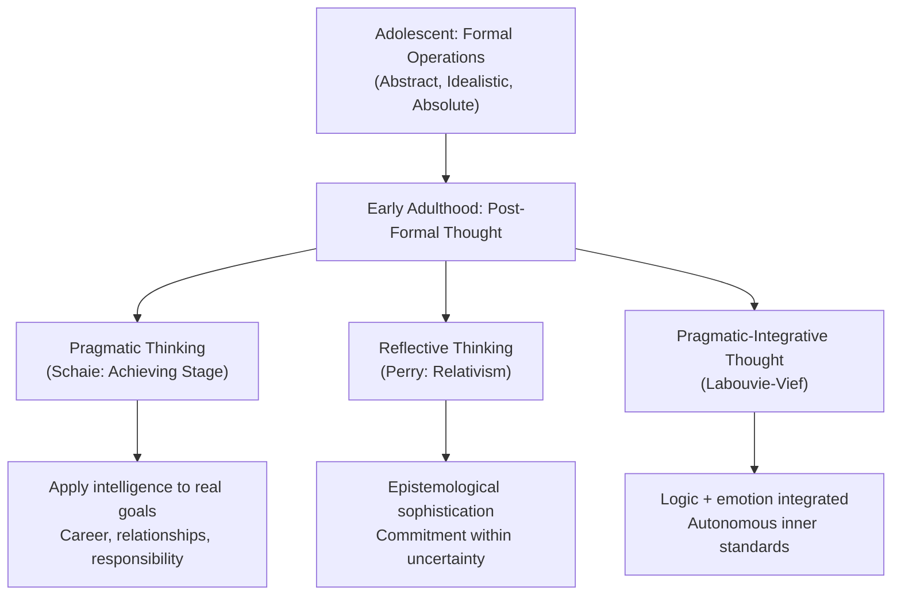

# Cognitive Changes in Early Adulthood: Post-Formal Thinking & Beyond Piaget

## Introduction

Early adulthood, spanning roughly ages 20–40, is a period of remarkable cognitive transformation. Unlike the dramatic physical growth of childhood or the neurological reorganisation of adolescence, cognitive development in early adulthood is subtler yet profound. Adults do not simply accumulate more knowledge—they fundamentally *change how they think*. They move from the idealistic, absolute reasoning of adolescence toward flexible, pragmatic, and contextually sensitive thought.

Piaget famously stopped his stage theory at formal operations, suggesting that adolescents had reached the apex of cognitive development. However, decades of research have revealed that adult cognition has distinctive qualities that Piaget's framework simply does not capture. Post-formal thinking, relativistic reasoning, and the integration of emotion and logic are hallmarks of adult cognitive maturity.

---

**Source PDF**:
- 📄 [Block-4/Unit-2.pdf – Pages 17–21](/pdfs/MPC-002%20Life%20Span%20Psychology/Block-4/Unit-2.pdf)
- 📚 MPC-002 Life Span Psychology, Block-4: Adulthood and Ageing

---

## 2.1 The Cognitive Landscape of Early Adulthood

Young adulthood is the period when most individuals complete their formal education, establish careers, form intimate partnerships, and begin families. According to Erikson's psychosocial framework, this stage centres on **intimacy vs. isolation**—the developmental challenge of building stable, committed relationships. This social context profoundly shapes cognition: adults must now think not just about abstract possibilities (as adolescents do) but about real-world constraints, responsibilities, and consequences.

### Piaget's View of Adult Cognition

Piaget believed that young adults were **quantitatively** more advanced than adolescents—they possess more knowledge and domain-specific expertise—but **qualitatively** similar, both operating at the formal operational level. He argued that adults simply extend and apply formal operational thinking across more domains.

However, subsequent researchers challenged this view. They argued that adult thinking has *qualitatively different* features that emerge from the demands and experiences of adult life—features that constitute genuine new stages of cognitive development.

---

## 2.2 K. Warner Schaie's Stage Theory of Adult Cognitive Development

K. Warner Schaie proposed that adults move beyond mere *acquisition* of knowledge (which characterises childhood and adolescence) toward the *application* and *integration* of knowledge in socially responsible ways. His theory describes how the *use* of intellect—rather than its raw capacity—changes across the lifespan.

### Achieving Stage (Early Adulthood)

In the **Achieving Stage**, young adults apply their intelligence to situations with profound real-world consequences—particularly around career goals and long-term planning. This is not just academic problem-solving; it involves:

- Mastering cognitive self-monitoring (metacognition)
- Acquiring independence and making consequential decisions
- Applying abstract reasoning to life-defining choices (career selection, partnership, lifestyle)

The key shift is from *learning for its own sake* to *learning for achievement and life goals*.

### Responsibility Stage (Late Early to Middle Adulthood)

The **Responsibility Stage** overlaps early and middle adulthood. Here, cognitive demands expand beyond the self to encompass others—a spouse, children, employees, and community members. Adults must:

- Balance competing demands (family, work, community)
- Think prospectively about others' wellbeing
- Develop executive-level cognition: planning, coordination, and delegation

Schaie later added additional stages for middle and late adulthood (Executive Stage, Reorganisational Stage, Reintegrative Stage), but the Achieving and Responsibility stages are central to early adulthood.

---

## 2.3 Labouvie-Vief: Pragmatic Thought and Autonomous Reasoning

Gisela Labouvie-Vief proposed that young adults develop a **new integration of thought** that transcends adolescent idealism. She observed that:

- Young adults rely *less* on pure logical analysis and more on pragmatic judgment
- Idealised, hypothetical thinking is replaced by **commitment** and real-world engagement
- Adults develop an inner standard of autonomous reasoning—they construct their own frameworks rather than accepting external authority

According to Labouvie-Vief, adolescent logic is characterised by **intrasystemic reasoning** (working within a given system of logic). Adult cognition adds **intersystemic reasoning**: the ability to move *between* logical systems and recognise that different frameworks each have validity. This is the cognitive foundation of mature ethical and professional judgment.

---

## 2.4 William Perry's Scheme of Intellectual Development

William Perry's longitudinal study of Harvard students produced a landmark theory of how young adults develop epistemologically—that is, how their *understanding of knowledge itself* evolves.

### Stages of Perry's Scheme

**1. Dualistic Thinking (Adolescent Baseline)**
Everything is viewed in binary, absolute terms: right/wrong, good/bad, true/false. Authority (teachers, parents, experts) holds all the answers. This is the typical epistemic stance entering university.

**2. Multiplicity**
Students begin encountering diverse opinions and perspectives. They recognise that even authority figures disagree with each other. The response is often relativistic: "Everyone has their own opinion, so who can say what's right?"

**3. Relativism**
The student moves beyond "all opinions are equal" to recognise that some views are *better supported* than others. Personal opinions are challenged and refined through evidence and argument. Relativism is active and engaged—not passive.

**4. Full Relativism (Commitment within Relativism)**
The mature epistemic position: truth is contextual and constructed, not absolute. Yet the adult makes *commitments*—chooses careers, values, partners—while acknowledging fallibility and openness to revision. This is Perry's ideal endpoint: disciplined engagement with uncertainty.

### Why Perry Matters for Psychology Students

Perry's scheme explains why university students often become *more uncertain* as they advance—a paradox that actually reflects cognitive growth, not regression. Understanding this helps counsellors and educators recognise healthy intellectual development vs. confusion or disengagement.

---

## 2.5 Post-Formal Thought

**Post-formal thought** is the umbrella term for cognitive advances beyond Piaget's formal operations. Key characteristics include:

| Feature | Formal Operations (Adolescent) | Post-Formal Thought (Adult) |
|---|---|---|
| **Orientation** | Hypothetical-deductive | Pragmatic, contextual |
| **View of truth** | Absolute, objective | Relative, constructed |
| **Logic** | Single, universal | Multiple, situation-dependent |
| **Emotion** | Excluded from reasoning | Integrated into reasoning |
| **Uncertainty** | Problem to solve | Accepted reality to navigate |
| **Answers** | One correct answer | Multiple valid perspectives |

Post-formal thinkers understand that:
- The correct answer may vary across situations
- Emotion and subjectivity legitimately influence reasoning
- The search for truth is ongoing, never fully complete
- Real-world problems rarely have clean, logical solutions

This is why experienced doctors, lawyers, and counsellors often reason better than brilliant but inexperienced students: they integrate domain knowledge with experiential wisdom and tolerance for ambiguity.

---

## 2.6 Cognitive Development Diagram

---

## 2.7 Realistic vs. Idealistic Thinking: The Critical Shift

A key developmental task of early adulthood is replacing adolescent *idealism* with adult *realism*—not a pessimistic abandonment of dreams, but a pragmatic engagement with real constraints.

**Realistic thinking** involves:
- Evaluating situations from multiple angles (positive, negative, neutral)
- Acknowledging complexity and trade-offs
- Making decisions based on actual circumstances, not ideal scenarios
- Taking responsibility for outcomes

Schaie argues that young adults "switch" from acquiring knowledge to *applying* it. The cognitive energy that drove academic achievement is redirected toward solving actual life problems: How do I build a career I find meaningful? How do I maintain this relationship? What do I owe my community?

This is not cognitive decline—it is cognitive *maturation*.

---

## 2.8 Real-World Applications

### In Counselling Practice
Understanding post-formal thought helps counsellors appreciate why adult clients reason differently from adolescent clients. An adult presenting a "problem" may not be seeking a logical solution—they may need help integrating competing values and perspectives. Counsellors should validate this complexity rather than offering simplistic answers.

### In Educational Settings
Adult learners (e.g., MAPC students) engage most productively when instruction acknowledges that knowledge is contested and contextual. Facilitating discussion of multiple theoretical perspectives—rather than presenting psychology as a set of fixed facts—aligns with post-formal cognitive development.

### In the Workplace
Managerial and leadership roles explicitly require post-formal thinking: weighing incomplete information, balancing stakeholder interests, making ethically complex decisions. Understanding cognitive development helps HR professionals design appropriate training and assessment for different career stages.

### Indian Context
In Indian society, early adulthood is particularly dense with cognitive demands: managing joint family obligations, navigating arranged versus love marriages, pursuing higher education amid family financial pressures, and balancing cultural traditions with career aspirations. Research suggests that collectivist contexts may accelerate the Responsibility Stage as young adults assume family duties earlier than in Western samples.

---

## 2.9 Memory Aid: Post-Formal Thinking — "PREC"

**P** – **P**ragmatic (realistic, context-sensitive)
**R** – **R**elativistic (truth varies by situation)
**E** – **E**motional integration (feelings are valid data)
**C** – **C**ommitment under uncertainty (choosing while acknowledging fallibility)

---

## 2.10 Self-Assessment Questions

**Basic Recall**
1. What did Piaget believe about adult cognition in relation to adolescent cognition? What did subsequent researchers find instead?
2. Name and describe the two cognitive stages K. Warner Schaie identified for early adulthood.
3. How does dualistic thinking (Perry) differ from full relativism? Give an example.

**Applied Understanding**
4. A 26-year-old MBA student tells her professor, "I used to think there was always one right answer in business—now I think it totally depends on the situation, but that makes it hard to decide anything!" Which stage of Perry's scheme does this reflect, and what further development would she undergo?
5. Labouvie-Vief argues that adult thought integrates emotion and logic. Give an example from clinical psychology where this integration is essential.

**Critical Analysis**
6. Is post-formal thought truly a new *stage* of cognitive development, or simply greater application of formal operations? Argue both sides.

---

## 2.11 External Resources

### Academic Sources
- 📖 [Schaie, K.W. & Willis, S.L. (2000). A Stage Theory Model of Adult Cognitive Development Revisited. *Societal Mechanisms for Maintaining Competence in Old Age.*](https://www.researchgate.net/publication/284551456)
- 📖 [Perry, W.G. (1970). *Forms of Intellectual and Ethical Development in the College Years.* Holt, Rinehart & Winston](https://www.amazon.com/Forms-Intellectual-Ethical-Development-College/dp/0787941603)
- 📖 [Labouvie-Vief, G. (1992). Neo-Piagetian perspectives on adult cognitive development. *Adult Information Processing.* Academic Press](https://www.sciencedirect.com/book/9780120885053)

### Wikipedia
- 🌐 [Post-formal thought](https://en.wikipedia.org/wiki/Post-formal_thought)
- 🌐 [Perry's scheme of intellectual development](https://en.wikipedia.org/wiki/Perry%27s_scheme_of_intellectual_and_ethical_development)
- 🌐 [Cognitive development](https://en.wikipedia.org/wiki/Cognitive_development)

### Educational Videos
- 🎥 [Cognitive Development in Early Adulthood – Crash Course Psychology](https://www.youtube.com/watch?v=4CZ9gCogc6g)
- 🎥 [Adult Cognitive Development – Khan Academy](https://www.khanacademy.org/science/health-and-medicine/human-development-and-aging)
- 🎥 [Post-Formal Thinking and Adult Learning – MIT OpenCourseWare](https://ocw.mit.edu/courses/9-00sc-introduction-to-psychology-fall-2011/)

### Recent Research (2020–2024)
- 📄 [Zedelius, C.M., et al. (2021). Mindfulness and cognitive flexibility in young adults. *Psychological Science*, 32(4), 598–611.](https://journals.sagepub.com/doi/10.1177/0956797620981996)
- 📄 [Whitbourne, S.K., & Whitbourne, S.B. (2020). *Adult Development and Aging: Biopsychosocial Perspectives* (6th ed.). Wiley.](https://www.wiley.com/en-us/Adult+Development+and+Aging%3A+Biopsychosocial+Perspectives-p-9781119609780)
- 📄 [Hartshorne, J.K., & Germine, L.T. (2023). When does cognitive functioning peak? Revisiting lifespan trajectories. *Psychological Science*, 34(1), 104–119.](https://journals.sagepub.com/doi/10.1177/09567976221146015)

### Cross-References
- ➡️ [Cognitive Development in Adolescence](/mpc-002/block-3/cognitive-development-adolescence)
- ➡️ [Cognitive Changes in Middle Adulthood](/mpc-002/block-4/cognitive-changes-middle-adulthood)
- ➡️ [Piaget's Formal Operational Stage](/mpc-002/block-3/piaget-formal-operations)

---

## Summary

Early adulthood brings cognitive transformations that go beyond what Piaget's formal operations describe. K. Warner Schaie showed that adults shift from *acquiring* knowledge to *applying* it within achieving and responsibility contexts. Labouvie-Vief identified pragmatic-integrative thinking as the hallmark of adult cognition—where emotion and logic work together rather than in opposition. William Perry traced how young adults move from dualistic, absolute thinking through multiplicity and relativism to committed, contextually aware reasoning. Post-formal thought—realistic, relativistic, emotionally integrated, and comfortable with uncertainty—is the cognitive signature of mature adulthood. These changes have deep implications for education, counselling, and professional development.
