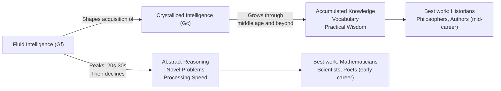

# Cognitive Changes in Middle Adulthood: Intelligence, Memory & Expertise

## Introduction

Middle adulthood—spanning roughly ages 40 to 65—is one of the most cognitively complex periods of human life. It is a time of both loss and gain: some cognitive capacities begin to decline, while others continue to grow. The middle-aged adult is often at the height of professional expertise, social influence, and reflective wisdom, even as processing speed and working memory show measurable decrements.

Understanding cognitive changes in middle adulthood requires abandoning simplistic "decline" narratives. The picture is multidirectional, multidimensional, and deeply shaped by education, lifestyle, culture, and the type of cognitive demand being measured. This unit explores the major dimensions of cognitive change across the midlife years.

---

**Source PDF**:
- 📄 [Block-4/Unit-2.pdf – Pages 20–23](/pdfs/MPC-002%20Life%20Span%20Psychology/Block-4/Unit-2.pdf)
- 📚 MPC-002 Life Span Psychology, Block-4: Adulthood and Ageing

---

## 2.1 The Character of Middle Adulthood

Middle age is characterised by competence, maturity, responsibility, and stability. Erikson's psychosocial stage for this period is **Generativity vs. Stagnation**: the challenge of contributing meaningfully to society—through parenting, mentoring, professional work, or civic engagement—rather than becoming self-absorbed and stagnant.

Cognitively, middle adulthood is a period of remarkable productivity. Many historians, philosophers, and prose writers produce their most significant works in their 40s and 50s. Scientists and mathematicians, however, tend to peak earlier—a pattern that reflects the differential reliance on fluid vs. crystallized intelligence across fields.

The cognitive landscape of middle adulthood includes:
- Shifts in intelligence (fluid vs. crystallized)
- Changes in information processing speed
- Memory changes (with effective compensatory strategies)
- Dramatic increases in expertise and practical wisdom
- Changes in career identity and work satisfaction
- Deepening engagement with religion, spirituality, and life meaning

---

## 2.2 The Central Distinction: Fluid vs. Crystallized Intelligence

The most important framework for understanding adult intelligence is the **Horn-Cattel model** distinguishing fluid and crystallized intelligence.

### Fluid Intelligence (Gf)

**Fluid intelligence** refers to the capacity for reasoning, problem-solving, and processing novel information—particularly in situations where prior knowledge provides limited help.

Key characteristics:
- Abstract reasoning and pattern recognition
- Speed of information processing
- Working memory capacity
- Novel logic problems and non-verbal puzzles
- Peaks in the **20s and early 30s**, then gradually declines
- Decline is linked to structural brain changes (prefrontal cortex, hippocampus)
- Mathematicians, physicists, and poets do their landmark work early—reflecting fluid intelligence demands

### Crystallized Intelligence (Gc)

**Crystallized intelligence** refers to accumulated knowledge, vocabulary, verbal comprehension, and the ability to apply learned strategies to familiar problems.

Key characteristics:
- Verbal reasoning and general knowledge
- Cultural and educational accumulation
- Reflects a lifetime of learning and experience
- **Continues to grow** through middle adulthood into the 70s and beyond
- Historians, philosophers, novelists, and leaders produce best work in their 40s–50s
- Assessed by vocabulary tests, general information, reading comprehension

### The Interaction Between Fluid and Crystallized Intelligence

Importantly, fluid and crystallized intelligence are not independent. The *quality* of crystallized intelligence depends in part on the fluid intelligence available during its acquisition. Adults who had higher fluid intelligence in youth build richer, more organised crystallized knowledge stores. As Horn and Hofer (1992) noted, the nature-nurture distinction here is "probably invalid"—both forms of intelligence are shaped by biology and experience in complex, interacting ways.

---

## 2.3 Sternberg's Triarchic Intelligence in Middle Adulthood

Robert Sternberg's **Triarchic Theory** provides additional texture to understanding middle adult cognition, particularly in professional contexts.

### Analytic (Academic) Intelligence

Middle adults with strong analytic intelligence develop extensive, highly organised domain knowledge. They tend to:
- Show increased work satisfaction and commitment
- Have greater physical and psychological well-being
- Demonstrate efficient learning within their area of expertise
- Excel at structured problem-solving

### Creative Intelligence

Creativity in middle adulthood shows interesting patterns. Writing, for instance, peaks during middle adulthood—reflecting the integration of creative intelligence with the accumulated life experience and emotional depth that crystallized intelligence provides.

Creatively intelligent middle adults:
- Are flexible and innovative when facing novel situations
- Use life experience to generate solutions novices cannot imagine
- Prefer making their own decisions and plans
- Show imaginative, non-formulaic thinking
- Try new avenues rather than relying on established rules

### Practical (Contextual) Intelligence

Practical intelligence—the ability to adapt to real-world demands—is often at its apex in middle adulthood. Practically intelligent adults:
- Read situational demands accurately and adapt accordingly
- Navigate workplace politics and interpersonal dynamics effectively
- Manage leisure time and personal development strategically
- Prepare thoughtfully for retirement transitions

---

## 2.4 Information Processing and Memory in Middle Adulthood

During middle adulthood, measurable changes occur in information processing efficiency:

**Processing Speed**: Reaction time slows, and the rate at which information is processed decreases. This can affect performance on timed cognitive tests.

**Working Memory**: The capacity of working memory—the cognitive "workspace" for active information manipulation—begins to decline, particularly for complex multi-step tasks.

**Memory Strategies**: Middle adults who use active encoding strategies (elaboration, organisation, mnemonics) substantially reduce memory decline. The *use* of strategies, not just their availability, becomes increasingly important.

**Ecological Validity of IQ Tests**: Standard IQ tests often rely on processing speed and timed tasks—domains where middle adults are disadvantaged. Their performance may underestimate real-world cognitive competence, where experience and strategic thinking compensate for speed decrements.

### Cross-Sectional vs. Longitudinal Findings

A critical methodological point: **cross-sectional studies** (comparing different age groups at one time) consistently show intelligence declining with age. However, **longitudinal studies** (following the same people over time) show *increases* in most cognitive abilities at least into the 50s. The cross-sectional decline likely reflects **cohort effects**—older adults grew up with less schooling and different cognitive demands, not just age-related decline.

---

## 2.5 Expertise: The Signature Achievement of Middle Adulthood

Perhaps the most striking cognitive feature of middle adulthood is the development of profound **expertise**. Expert cognition differs qualitatively from novice cognition in ways that compensate for any fluid intelligence decline:

| Feature | Novice | Expert |
|---|---|---|
| **Knowledge organisation** | Fragmented, surface-level | Deeply structured, interconnected |
| **Problem recognition** | Slow, effortful | Rapid pattern recognition |
| **Strategy selection** | Trial-and-error | Efficient, principled |
| **Error detection** | Poor | Rapid self-monitoring |
| **Novel situations** | Rigid, confused | Flexible adaptation |
| **Metacognition** | Limited | Sophisticated self-regulation |

Experts in their 40s and 50s often outperform younger novices on domain-relevant tasks, even when general processing speed favours the younger group. This is why experienced surgeons, judges, therapists, and architects often perform at their professional peaks in middle adulthood.

---

## 2.6 Career, Work, and Leisure

### Career Development in Middle Adulthood

By the 40s, most individuals have settled into career identities. Characteristic patterns include:
- **Career plateau**: Many stop advancing hierarchically by age 40–45, shifting focus from promotion to mastery and mentoring
- **Increased job satisfaction and commitment**: Typically peaks in the 50s and 60s
- **Midlife career change**: A minority (motivated by unmet goals or external pressures) change careers mid-life—requiring significant cognitive flexibility

### Leisure as Cognitive Resource

Leisure in middle adulthood serves multiple cognitive functions:
- Provides buffer against occupational stress
- Maintains cognitive flexibility through novel activities
- Social leisure reduces isolation and supports cognitive health
- Physical leisure (exercise) has documented protective effects on cognitive decline

---

## 2.7 Religion, Spirituality, and the Search for Meaning

A significant cognitive development in middle adulthood is **increased reflective engagement with existential questions**. Viktor Frankl's existential perspective is particularly relevant: examining the finiteness of existence leads naturally to exploration of life's meaning.

Research findings include:
- **Women** show stronger religious interest than men on average
- **Religiosity increases** significantly in middle adulthood
- Religious participation is positively associated with **longevity and health**
- **Religious coping** (using faith to manage stress) has psychological benefits
- Middle adults engage in what Erikson called **generative reflection**—evaluating legacy, purpose, and impact

This is not merely spiritual sentiment. The cognitive engagement with meaning, mortality, and legacy represents sophisticated **reflective cognition** that draws on both crystallized intelligence and accumulated life experience.

---

## 2.8 Midlife Crisis: Myth or Reality?

The popular concept of the "midlife crisis"—a dramatic life upheaval triggered by confronting aging and mortality—has been both overstated and misunderstood.

Research indicates:
- Most middle adults do *not* experience a dramatic crisis
- However, significant **life review and reassessment** occurs in most adults (Levinson's work)
- Unaccomplished goals may produce sadness or reorientation
- Adjustment to realistic possibilities (rather than youthful ideals) is a normative developmental task
- For a minority, this reassessment precipitates genuine career or relationship changes

Cognitively, the midlife reassessment reflects mature **meta-cognitive capacity**: the ability to evaluate one's own life trajectory from an outside perspective and make principled adjustments.

---

## 2.9 Memory Aid: The "FICCM" Framework for Middle Adult Cognition

**F** – **F**luid intelligence declines (gradual, from early adulthood)
**I** – **I**ntelligence is multidirectional (gains and losses coexist)
**C** – **C**rystallized intelligence continues growing
**C** – **C**areer expertise compensates for processing speed
**M** – **M**eaning-seeking intensifies (existential, religious engagement)

---

## 2.10 Self-Assessment Questions

**Basic Recall**
1. Distinguish fluid intelligence from crystallized intelligence. How does each change across middle adulthood?
2. Describe Sternberg's three types of intelligence and give one example of each in the context of a middle-aged professional.
3. Why do cross-sectional studies show more cognitive decline in middle age than longitudinal studies?

**Applied Understanding**
4. A 50-year-old experienced nurse who had always performed excellently now scores slightly lower on a timed memory test but continues to outperform junior nurses on complex patient assessment. Explain this pattern using the concepts from this unit.
5. How might religious coping benefit a middle-aged person facing serious illness? Integrate psychological evidence into your answer.

**Critical Analysis**
6. Is "midlife crisis" a culturally specific phenomenon? How might Indian societal contexts shape midlife reassessment differently from Western contexts?

---

## 2.11 External Resources

### Academic Sources
- 📖 [Horn, J.L. & Hofer, S.M. (1992). Major abilities and development in the adult period. *Intellectual Development.* Cambridge University Press.](https://www.cambridge.org/core)
- 📖 [Sternberg, R.J. (1985). *Beyond IQ: A Triarchic Theory of Human Intelligence.* Cambridge University Press.](https://www.cambridge.org/core)
- 📖 [Willis, S.L. & Reid, J.D. (1999). *Life in the Middle: Psychological and Social Development in Middle Age.* Academic Press.](https://www.sciencedirect.com/book/9780125242905)

### Wikipedia
- 🌐 [Fluid and crystallized intelligence](https://en.wikipedia.org/wiki/Fluid_and_crystallized_intelligence)
- 🌐 [Middle age](https://en.wikipedia.org/wiki/Middle_age)
- 🌐 [Expertise](https://en.wikipedia.org/wiki/Expert)
- 🌐 [Midlife crisis](https://en.wikipedia.org/wiki/Midlife_crisis)

### Educational Videos
- 🎥 [Middle Adulthood – Cognitive Development – Crash Course Psychology](https://www.youtube.com/watch?v=2Cm8_MUPcqE)
- 🎥 [Fluid vs. Crystallized Intelligence – Khan Academy](https://www.khanacademy.org/science/health-and-medicine/human-development-and-aging)
- 🎥 [Adult Development – MIT OpenCourseWare](https://ocw.mit.edu/courses/9-00sc-introduction-to-psychology-fall-2011/pages/adult-development/)

### Recent Research (2020–2024)
- 📄 [Tucker-Drob, E.M. (2021). Cognitive aging and dementia: A life-span perspective. *Annual Review of Developmental Psychology*, 3, 177–200.](https://www.annualreviews.org/doi/10.1146/annurev-devpsych-050720-103501)
- 📄 [Lachman, M.E., et al. (2022). Middle age as a pivotal period for cognitive development: Challenges and opportunities. *Current Directions in Psychological Science*, 31(4), 267–274.](https://journals.sagepub.com/doi/10.1177/09637214221076022)
- 📄 [Salthouse, T.A. (2023). Longitudinal assessment of cognitive change. *Assessment*, 30(1), 125–136.](https://journals.sagepub.com/doi/10.1177/10731911211073398)

### Cross-References
- ➡️ [Cognitive Changes in Early Adulthood](/mpc-002/block-4/cognitive-changes-early-adulthood)
- ➡️ [Cognitive Changes in Old Age](/mpc-002/block-4/cognitive-changes-old-age)
- ➡️ [Physical Changes in Middle Adulthood](/mpc-002/block-4/physical-changes-middle-adulthood)

---

## Summary

Middle adulthood is a period of rich cognitive complexity. Fluid intelligence—the capacity for novel reasoning—peaks in early adulthood and gradually declines, while crystallized intelligence—accumulated knowledge and verbal expertise—continues growing through the 60s and beyond. Sternberg's triarchic model illuminates how analytic, creative, and practical intelligence interact in professional contexts. Information processing slows, but deep expertise develops to compensate—a hallmark achievement of the midlife years. Religion and meaning-seeking intensify as adults engage in generative reflection. Midlife is not simply a period of decline but a complex interplay of losses and gains, best understood through the multidirectional, multidimensional framework of lifespan developmental psychology.
