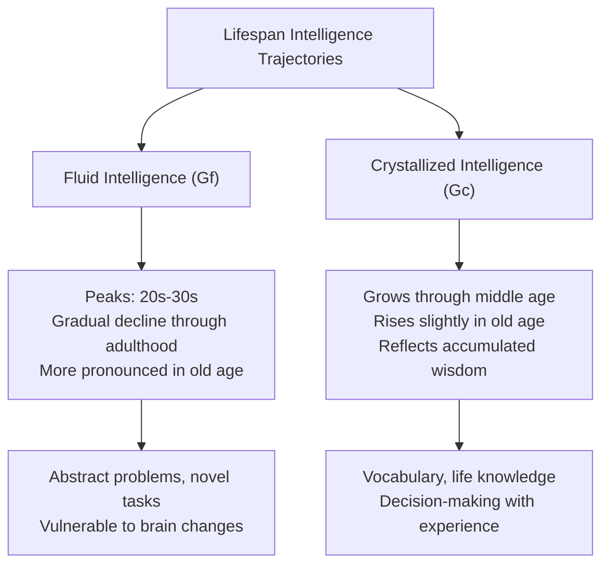
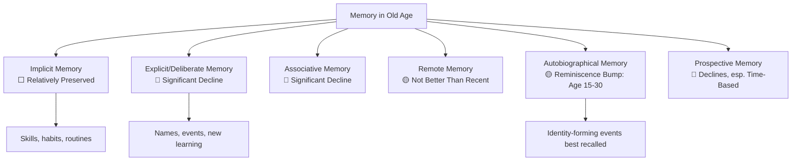
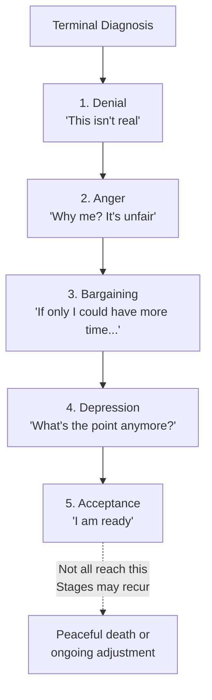

# Cognitive Changes in Old Age: Memory, Wisdom, and Successful Ageing

## Introduction

Late adulthood—generally considered to begin around age 65—is one of the most misunderstood periods of human development. Popular culture often portrays old age as a time of inevitable, uniform cognitive decline. The scientific picture is far more nuanced: while certain cognitive capacities do diminish, others remain stable or even improve, and individual variation in old age is greater than at any other life stage.

Erik Erikson's final psychosocial stage captures the essential developmental challenge: **Ego Integrity vs. Despair**. Older adults who can look back on their lives with satisfaction and a sense of meaning achieve integrity; those who feel their lives were misspent or wasted experience despair. The cognitive work of old age is thus deeply tied to meaning-making, life review, and adaptation.

This unit examines the multiple dimensions of cognitive change in old age—from specific memory types to wisdom, language processing, problem-solving, and the end-of-life processes of retirement, widowhood, and death.

---

**Source PDF**:
- 📄 [Block-4/Unit-2.pdf – Pages 23–29](/pdfs/MPC-002%20Life%20Span%20Psychology/Block-4/Unit-2.pdf)
- 📚 MPC-002 Life Span Psychology, Block-4: Adulthood and Ageing

---

## 2.1 Gerontology: The Science of Ageing

**Gerontology** is an interdisciplinary field studying the process of ageing and the ageing population. It draws on psychology, biology, sociology, medicine, economics, and public health to understand how and why people age—and how to optimise wellbeing in later life.

Key distinctions in gerontological research:
- **Primary ageing**: Universal, biologically programmed changes (e.g., slowing of neural processing)
- **Secondary ageing**: Disease-related changes that are not universal (e.g., dementia, cardiovascular disease)
- **Successful ageing**: The maintenance of physical, cognitive, and social functioning in later life
- **Terminal decline**: A marked, steady decrease in cognitive functioning in the final years before death

---

## 2.2 Theories of Successful Ageing

Two classic theories describe how older adults adjust to the social and role changes of late adulthood.

### Disengagement Theory (Cumming & Henry, 1961)

The disengagement theory proposes that as people age, gradual **mutual withdrawal** from society is both *normal* and *desirable*. The older adult withdraws from social roles, and society simultaneously withdraws from the individual (through retirement, reduced expectations). This mutual disengagement:
- Relieves older adults of demanding responsibilities
- Opens opportunities for younger generations
- Allows time for reflection and introspection

**Critique**: Subsequent research showed that forced disengagement is often *harmful* rather than beneficial. Many older adults who remain active report higher life satisfaction, better health, and longer lives.

### Activity Theory (Havighurst, 1961)

The activity theory directly contradicts disengagement theory, arguing that **maintaining activity** is the key to successful ageing. The principle: "use it or lose it."

Activity theory proposes that:
- People who remain physically, mentally, and socially active age better
- Activities of earlier years should be maintained as long as possible
- When roles are lost (through retirement, widowhood), they should be replaced with new activities
- Quality of life is proportional to level of meaningful activity

**Research support**: Extensive longitudinal research (e.g., the MacArthur Study of Successful Aging) supports activity theory—cognitively and socially active older adults show slower rates of cognitive decline and higher wellbeing.

---

## 2.3 Intelligence in Old Age: The Fluid-Crystallized Trajectory

Building on the middle adulthood framework, intelligence in old age follows predictable but individually variable patterns:

- **Fluid intelligence** (abstract reasoning, novel problem-solving): Continues to decline, now more noticeably
- **Crystallized intelligence** (accumulated knowledge, verbal ability): **Rises slightly** across the entire lifespan, even in late adulthood
- K. Warner Schaie and Sherry Willis found that cognitive decline could be **reversed in 40–60% of elderly people** given targeted remedial training—a remarkable finding with major implications for cognitive intervention

---

## 2.4 Selective Optimisation with Compensation (SOC)

One of the most important frameworks for understanding adaptive cognition in old age is Paul Baltes' model of **Selective Optimisation with Compensation (SOC)**.

Older adults adapt to cognitive limitations by:

1. **Selection**: Narrowing goals to the most personally valued activities (e.g., focusing on a few cherished relationships rather than maintaining a large social network)
2. **Optimisation**: Maximising returns from energy invested in selected domains (practising, using strategies, leveraging experience)
3. **Compensation**: Developing strategies to offset losses (using notes, reminders, external aids; relying on routine)

The pianist Arthur Rubinstein famously described this process: to maintain concert performance in old age, he reduced his repertoire (selection), practised the selected pieces more intensively (optimisation), and played slower before fast passages to make the fast sections seem faster by contrast (compensation).

---

## 2.5 Memory Changes in Old Age

Memory is perhaps the most discussed aspect of cognitive ageing. However, memory is not a single faculty—it is a collection of systems with different developmental trajectories.

### Key Memory Changes

**Overall Pattern**:
- Information intake is slower
- Strategy use declines
- Inhibition of irrelevant information weakens (the ability to "filter out" distractions)
- Retrieval from long-term memory becomes harder
- Recognition memory declines less than **free recall**
- Slower processing speed means less is retained from ongoing activities

### Types of Memory in Old Age

#### Implicit vs. Explicit (Deliberate) Memory
- **Implicit memory** (unconscious, automatic—e.g., riding a bike, knowing how to type): Remains relatively **intact** in normal ageing
- **Explicit/Deliberate memory** (conscious recall—e.g., remembering where you put your keys, learning new names): Shows significant decline

#### Associative Memory
- **Associative memory deficit**: Difficulty in creating and retrieving *links* between items (e.g., linking a name to a face, or an event to its context)
- More pronounced in older adults than in younger adults
- Reflects hippocampal changes that affect relational memory binding

#### Remote Memory
- **Remote memory**: Very long-term recall (events from decades ago)
- Contrary to popular belief, remote memory is *not* significantly clearer or more reliable than recent memory for most seniors
- The myth that "elders remember the past better" reflects selective recall of emotionally significant events rather than superior access to historical memory

#### Autobiographical Memory
- **Autobiographical memory**: Memory for personally experienced events
- **Reminiscence bump**: Older adults best recall events from **adolescence and early adulthood** (ages 15–30)—periods of novelty, identity formation, and emotionally charged life choices (marriage, career, education)
- These memories are rehearsed frequently and form core elements of personal identity and life narrative

#### Prospective Memory
- **Prospective memory**: Remembering to do planned future activities ("take medication at 6pm," "call the doctor tomorrow")
- Prospective memory difficulties contribute significantly to the practical challenges of daily living in old age
- **Event-based** prospective memory (do X when Y happens) is better preserved than **time-based** prospective memory (do X at a specific time)
- External aids (calendars, alarms, checklists) substantially compensate for prospective memory decline

---

## 2.6 Language Processing in Old Age

Language processing shows characteristic changes in late adulthood:

**Word Finding Difficulties**: The "tip-of-the-tongue" phenomenon (knowing a word but being unable to retrieve it) increases significantly. Older adults struggle particularly with proper nouns and low-frequency words.

**Speech Production Changes**:
- More pronouns used (with unclear referents)
- Slower speaking rate with more pauses
- More hesitations, false starts, and sentence fragments
- Word repetitions increase
- **Grammatical simplification**: Older adults often use simpler grammatical structures to facilitate word retrieval—a compensatory strategy

**Comprehension**: Reading comprehension and listening comprehension are generally better preserved than production, particularly for familiar content and slower speech. Contextual support (knowing the topic, visual aids) substantially aids comprehension.

**Planning Discourse**: The ability to plan *what* to say and *how* to say it—metacognitive monitoring of speech—shows decline. Older adults may be less effective at organising narratives coherently.

---

## 2.7 Problem Solving in Old Age

Problem-solving in late adulthood shows both losses and adaptive compensations:

**Decline areas**:
- Novel, abstract problem-solving (fluid intelligence dependent)
- Problems requiring rapid information processing
- Multi-step problems in unfamiliar domains

**Preserved or enhanced areas**:
- Problems in domains of personal expertise or experience
- Health-related problem-solving (older adults feel competent here)
- Collaborative problem-solving: Married older adults increasingly collaborate—the dyad as a cognitive unit often outperforms the individual

**Wisdom as Meta-Cognitive Resource**: Wise problem-solving doesn't just involve knowing *what* to do—it involves knowing *when* to act, *whom* to consult, and *how* to manage uncertainty. This grows with age.

---

## 2.8 Wisdom: The Cognitive Achievement of Late Life

**Wisdom** is perhaps the most distinctive cognitive achievement of late adulthood. Paul Baltes and the Berlin Wisdom Paradigm define wisdom as expert knowledge in the fundamental pragmatics of life, encompassing:

1. **Factual knowledge** about human nature, social relationships, and emotional life
2. **Procedural knowledge**: Effective strategies for making life decisions, handling conflict, and giving counsel
3. **Lifespan contextualism**: Seeing people's behaviour within the full context of their life trajectories and social circumstances
4. **Relativism of values**: Respect for individual and cultural differences in what constitutes a good life
5. **Acknowledgment and management of uncertainty**: Recognising that many life problems have no perfect solution, and finding workable paths forward

Wise individuals tend to have:
- Better education and broader experience
- Greater physical and psychological health
- Positions of leadership and responsibility (business, politics, religion)
- High emotional maturity and excellent listening skills

Wisdom is not automatic with age—many older adults do not develop it. It emerges from *reflective engagement* with life's difficulties combined with a fundamentally compassionate orientation toward others.

---

## 2.9 Ageism: Prejudice Against the Elderly

**Ageism** refers to prejudice or discrimination based on age, most commonly directed against older adults. It manifests as:
- Negative stereotypes ("She drives like a little old lady")
- Forced early retirement
- Underestimation of older adults' capabilities
- Patronising communication ("elderspeak")
- Exclusion from social and professional roles

Ageism has measurable cognitive effects: older adults who internalize negative age stereotypes perform worse on cognitive tests than those with positive self-perceptions of ageing. Combating ageism is therefore both a social justice and a public health priority.

---

## 2.10 Retirement

Retirement—conventionally at age 65—represents a major cognitive and psychosocial transition.

**Factors predicting happy retirement**:
- Voluntary retirement (not forced before readiness)
- Adequate income to maintain living standards
- Active use of retirement time (travel, learning, social engagement)
- Pre-retirement planning and positive attitudes

**Cognitive effects of retirement**:
- Retirement itself is not cognitively harmful when retirement activities are mentally stimulating
- "Cognitive holidays" (disengaged retirement) are associated with faster cognitive decline
- Lifelong learning programmes (e.g., Elderhostel, senior university programmes) sustain cognitive vitality
- Physical health management becomes increasingly critical for cognitive functioning

---

## 2.11 Widowhood

Women tend to marry men older than themselves and live an average of 5–7 years longer than men. As a result, widowhood is a far more common female experience. Key findings:

- **Timing matters**: Widowhood is particularly stressful when it occurs unexpectedly early in life
- **Social support** is critical: close friendships, particularly with other widowed individuals, significantly buffer the psychological impact
- Cognitive decline can accelerate after widowhood due to loss of the collaborative cognitive system that marriage provides
- Grief counselling and support groups are cognitively as well as emotionally beneficial

---

## 2.12 Death and Dying: Kübler-Ross's Five Stages

The most influential framework for understanding the psychological experience of dying is Elisabeth Kübler-Ross's **Five Stage Model**, derived from interviews with terminally ill patients.

### The Five Stages

**1. Denial**
Initial refusal to accept the reality of death: "This can't be happening to me." An attempt to isolate oneself from the terrifying news. Denial provides psychological protection while the person gathers resources to cope.

**2. Anger**
As denial breaks down, anger emerges: "Why me? It's not fair!" The dying person may envy the living and direct anger at family, medical staff, or God. Understanding that this anger is not personal helps caregivers respond compassionately.

**3. Bargaining**
The person pleads for more time—with God, with doctors, with fate: "If I can just live to see my grandchild born..." Bargaining represents a partial acceptance of the situation coupled with an attempt to negotiate the outcome.

**4. Depression**
As the reality of death becomes inescapable—separation from loved ones, loss of future possibilities—deep depression emerges. This is not pathological; it is a form of preparatory grief. Exhaustion and futility are common.

**5. Acceptance**
If death is not sudden, acceptance often follows: finding peace with the inevitable. The person withdraws from external concerns and enters a quiet, reflective state. Acceptance is not happiness—it is equanimity.

**Important caveats**: Kübler-Ross herself emphasised that the stages do not proceed in fixed sequence. People may move back and forth, skip stages, or not experience all five. The model is a descriptive framework, not a prescriptive sequence.

### Hospice Care

A **hospice** is a facility or programme for terminally ill patients focused on maintaining quality of life—managing pain, supporting dignity, and including family in the process—rather than pursuing curative treatment. Hospice care reflects a shift from "fighting death" to "living well until death."

### Grief After Loss

Following bereavement, grief typically proceeds: initial **shock** → **grief** (acute emotional pain) → **apathy and depression** (may last weeks) → gradual **adaptation**. Support groups and professional counselling aid this process and help prevent complicated grief.

---

## 2.13 Cognitive Interventions in Old Age

The finding that cognitive decline can be reversed or slowed has generated substantial interest in interventions.

### Selective Optimisation with Compensation (SOC)
Training older adults in SOC strategies improves daily functioning across cognitive domains.

### Remedial Training (Schaie & Willis)
Targeted training in reasoning and spatial orientation reversed cognitive decline in 40–60% of elderly participants—even when cognitive decline had been ongoing for 14 years.

### Lifelong Learning
- **Elderhostel** (now Road Scholar): Encourages older adults to take courses on college campuses and travel globally for educational experiences
- Many universities offer free or reduced-cost courses for senior learners
- Benefits: New knowledge, new social connections, broader perspectives, reduced stereotyping

### Physical Activity
Aerobic exercise is one of the most evidence-based cognitive interventions for older adults. Regular moderate exercise preserves hippocampal volume, improves working memory, and reduces dementia risk.

---

## 2.14 Memory Aid: Memory Types in Old Age — "IDRAP"

**I** – **I**mplicit memory: relatively preserved
**D** – **D**eliberate (explicit) memory: declines significantly
**R** – **R**emote memory: not better than recent (myth busted)
**A** – **A**utobiographical memory: adolescence/early adulthood best recalled (reminiscence bump)
**P** – **P**rospective memory: declines, especially time-based

---

## 2.15 Self-Assessment Questions

**Basic Recall**
1. Define gerontology. What disciplines does it draw upon?
2. Compare disengagement theory and activity theory of ageing. Which has more empirical support?
3. List and define five types of memory and describe how each is affected by ageing.
4. Describe Kübler-Ross's five stages of dying. What are the limitations of this model?

**Applied Understanding**
5. An 80-year-old retired teacher says she remembers her wedding day vividly but forgot she had a doctor's appointment yesterday. Explain these two memory patterns using concepts from this unit.
6. A counselling psychologist working in a hospice notices that a 72-year-old patient oscillates between anger and depression, refusing to "accept" his terminal diagnosis. How would you help the patient's family understand this?

**Critical Analysis**
7. Baltes argues wisdom increases with age—but many older adults are not wise. What individual differences or environmental factors determine whether wisdom develops?
8. How do cultural factors shape the experience of death and dying? Compare Indian cultural practices around death with Kübler-Ross's framework.

---

## 2.16 External Resources

### Academic Sources
- 📖 [Baltes, P.B. & Staudinger, U.M. (2000). Wisdom: A metaheuristic to orchestrate mind and virtue. *American Psychologist*, 55(1), 122–136.](https://doi.org/10.1037/0003-066X.55.1.122)
- 📖 [Kübler-Ross, E. (1969). *On Death and Dying.* Macmillan.](https://www.simonandschuster.com/books/On-Death-and-Dying/Elisabeth-Kubler-Ross/9781476775548)
- 📖 [Schaie, K.W. & Willis, S.L. (2002). *Handbook of the Psychology of Aging* (5th ed.). Academic Press.](https://www.sciencedirect.com/book/9780121012700)

### Wikipedia
- 🌐 [Gerontology](https://en.wikipedia.org/wiki/Gerontology)
- 🌐 [Kübler-Ross model](https://en.wikipedia.org/wiki/K%C3%BCbler-Ross_model)
- 🌐 [Selective optimization with compensation](https://en.wikipedia.org/wiki/Selective_optimization_with_compensation)
- 🌐 [Wisdom](https://en.wikipedia.org/wiki/Wisdom)
- 🌐 [Ageism](https://en.wikipedia.org/wiki/Ageism)

### Educational Videos
- 🎥 [Cognitive Aging and Memory – Crash Course Psychology](https://www.youtube.com/watch?v=ntu1TM7nSOs)
- 🎥 [Grief, Dying, and Death – Khan Academy](https://www.khanacademy.org/science/health-and-medicine/human-development-and-aging)
- 🎥 [Wisdom and Aging – TED Talk by Laura Carstensen](https://www.ted.com/talks/laura_carstensen_older_people_are_happier)

### Recent Research (2020–2024)
- 📄 [Rowe, J.W. & Kahn, R.L. (2022). Successful aging 2.0: Conceptual expansions for the 21st century. *The Journals of Gerontology: Series B*, 77(6), 1–5.](https://doi.org/10.1093/geronb/gbab214)
- 📄 [Grossman, I., et al. (2020). Wisdom in a polarized world: Can wisdom scale? *Psychological Inquiry*, 31(2), 184–197.](https://doi.org/10.1080/1047840X.2020.1781243)
- 📄 [Bhome, R., et al. (2023). Subjective cognitive decline and conversion to dementia: Systematic review and meta-analysis. *British Journal of Psychiatry*, 222(5), 192–200.](https://doi.org/10.1192/bjp.2022.163)

### Cross-References
- ➡️ [Cognitive Changes in Middle Adulthood](/mpc-002/block-4/cognitive-changes-middle-adulthood)
- ➡️ [Physical Changes in Old Age](/mpc-002/block-4/physical-changes-old-age)
- ➡️ [Challenges in Adolescent Development](/mpc-002/block-3/challenges-issues-adolescent-development)

---

## Summary

Old age brings a complex mixture of cognitive changes. Fluid intelligence and many memory systems decline, while crystallized intelligence rises slightly and wisdom deepens with experience. The SOC model shows how older adults adaptively narrow, optimise, and compensate for cognitive changes. Memory losses are selective: implicit memory is relatively preserved while explicit, associative, and prospective memory show significant decline. Language production changes more than comprehension. Problem-solving adapts through collaboration and expertise. Wisdom—deep knowledge of the human condition combined with emotional maturity—is the signature cognitive achievement of late adulthood. Retirement, widowhood, and preparation for death are major life transitions that have cognitive as well as emotional dimensions. Cognitive interventions—from targeted training to lifelong learning to physical activity—can meaningfully slow or partially reverse age-related decline, affirming that the ageing brain retains remarkable plasticity.
