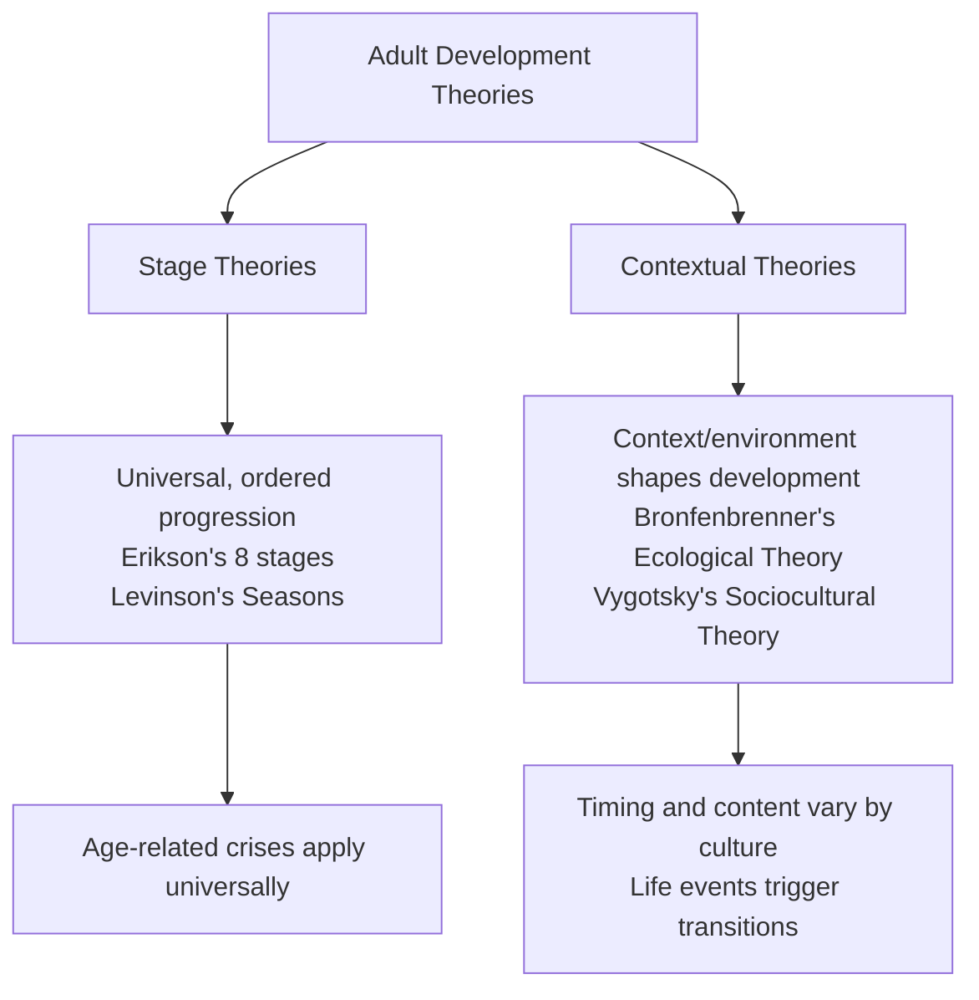

# Psychosocial Changes in Early Adulthood: Erikson, Levinson & Relationships

## Introduction

Early adulthood—spanning roughly ages 20 to 40—is one of the most socially and emotionally complex periods of the human lifespan. Young adults are simultaneously navigating questions of identity, intimacy, career, family, and independence. Unlike the physical peak of early adulthood or the cognitive maturation discussed elsewhere, the *psychosocial* dimension of this stage concerns how adults form relationships, build life structures, establish careers, and begin families.

Two major theoretical frameworks anchor our understanding: **Erikson's stage theory**, which frames early adulthood as a crisis of intimacy versus isolation, and **Levinson's Seasons of Life theory**, which describes how adults construct and periodically revise the underlying design of their lives. Together with research on attachment styles and romantic love, these frameworks paint a rich picture of early adult development.

---

**Source PDF**:
- 📄 [Block-4/Unit-3.pdf – Pages 30–39](/pdfs/MPC-002%20Life%20Span%20Psychology/Block-4/Unit-3.pdf)
- 📚 MPC-002 Life Span Psychology, Block-4: Adulthood and Ageing

---

## 3.1 Development During Adult Years: Stage Theories vs. Contextual Approach

Before examining specific changes, it is important to understand the two major frameworks psychologists use to explain adult development.

### Stage Theories

Stage theories propose that all human beings—regardless of culture, era, or circumstance—move through an **orderly, universal progression of developmental stages**. Each stage involves a specific challenge or crisis that must be resolved before the next stage can be successfully navigated. This progression is hierarchical: earlier resolutions form the foundation for later development, much like the structural floors of a building.

Erikson's eight-stage theory is the most prominent stage model of adult development. During adulthood, three major psychosocial crises are relevant:
1. **Intimacy vs. Isolation** (Early Adulthood)
2. **Generativity vs. Stagnation** (Middle Adulthood)
3. **Ego Integrity vs. Despair** (Late Adulthood)

### Contextual Approach

Contextual theories argue that development is shaped primarily by **environment, culture, and unique life circumstances** rather than by a universal biological timetable. Bronfenbrenner's Ecological Systems Theory is the landmark contextual model, positing five nested environmental systems:

- **Microsystem**: Immediate environment (family, peers, school)
- **Mesosystem**: Linkages between microsystems (e.g., parent-teacher relationships)
- **Exosystem**: Indirect environmental influences (e.g., parent's workplace)
- **Macrosystem**: Cultural values and societal beliefs
- **Chronosystem**: Changes over time, including historical events

Vygotsky similarly emphasised the role of social and cultural tools in shaping cognitive and social development.

**The key debate**: Stage theorists predict that a 30-year-old in Mumbai and a 30-year-old in New York face the same developmental crisis (intimacy vs. isolation). Contextual theorists argue that the content, timing, and resolution of developmental challenges vary profoundly across cultures. Most contemporary developmental psychologists adopt an **integrative position**: universal biological tendencies unfold within—and are shaped by—cultural and environmental contexts.

---

## 3.2 Erikson's Theory: Intimacy vs. Isolation

The central psychosocial challenge of early adulthood, according to Erikson, is the tension between **Intimacy and Isolation**.

### The Nature of Intimacy

Intimacy is not merely physical closeness or sexual relationship. It involves:
- The capacity to form **deep, emotionally committed** relationships with others
- The willingness to **sacrifice some independence** in order to include another person's needs and goals within one's own life project
- The ability to love, care, and remain committed through difficulty
- **Cooperative, tolerant, and accepting** behaviour toward others
- Comfort with periods of aloneness *without* the fear of loneliness

True intimacy requires that a person has first developed a secure sense of identity (Erikson's earlier adolescent stage): you cannot meaningfully merge with another person if you do not have a self to bring to the relationship.

### Isolation

Those who fail to develop intimacy experience **isolation**: persistent fear of forming close relationships, often rooted in:
- Fear of losing identity or freedom through closeness
- More **competitive than cooperative** relational patterns
- Feeling threatened when people "get too close"
- Difficulty accepting others' differences
- Inability to sustain intimate, lasting relationships

### The Path Forward: Generativity

Successful resolution of intimacy vs. isolation allows the individual to progress to the next developmental challenge: **generativity** (caring for the next generation). Intimacy is the prerequisite for generativity—you cannot meaningfully contribute to the welfare of others if you have not first learned to love and commit to particular others.

---

## 3.3 Levinson's Seasons of Life Theory

Daniel Levinson's theory, derived from intensive interviews with adult men and later extended to women, describes adult development as alternating between **stable periods** (when people build and live within a life structure) and **transitional periods** (when they evaluate and revise that structure).

### Key Concepts

**Life Structure**: The underlying design or pattern of a person's life at a given time, shaped primarily by:
- Relationships with significant others (spouse, children, friends, mentors)
- Occupational commitments and career identity

Life structure functions to **harmonize inner needs with outer demands**—what the person wants from life with what the social environment makes possible.

**The Dream**: In the early adult transition (ages 17–22), most people construct a **Dream**—an imagined vision of themselves in the adult world that motivates and guides decisions.
- Men's dreams are typically **individualistic**: professional success, achievement, status
- Women's dreams have historically been more **relational**: often incorporating a supportive role within another's dream, though this is changing rapidly in contemporary society
- The specificity of the Dream correlates with its motivating power

### Periods of Early Adulthood (Levinson)

| Period | Approximate Age | Key Task |
|---|---|---|
| Early Adult Transition | 17–22 | Leave the pre-adult world; begin the Dream |
| Entering Adult World | 22–28 | Build initial life structure; explore career and relationships |
| Age-30 Transition | 28–33 | Re-evaluate initial choices; deepen or change commitments |
| Settling Down | 33–40 | Establish a stable niche; pursue the Dream with commitment |

**The Age-30 Transition** is particularly significant. Single individuals may begin seeking partners; individuals who prioritised career may reassert relational needs; those embedded in family may seek more individualistic expression. For some this is genuinely a crisis period if neither career nor relationships is satisfying.

**Settling Down for Men** means focusing commitments, establishing social position, and building toward the Dream—leaving other possibilities behind.

**Continued Instability for Women**: Women often face delays in achieving the stability men typically achieve in their early 30s, due to the competing demands of child-bearing and family responsibilities that interrupt professional development.

---

## 3.4 The Social Clock

The **social clock** refers to culturally shared, age-graded expectations for major life events: first job, marriage, parenthood, home ownership, retirement. These implicit timelines exert powerful normative pressure on individuals.

Research on the social clock (Helson et al.) found:

**Women following a "feminine" social clock** (marriage and childbearing in the 20s):
- Rated as responsible, caring, and self-controlled
- BUT reported declining self-esteem with age and increased vulnerability

**Women following a "masculine" social clock** (early career focus):
- Became more dominant, independent, intellectually effective, and sociable
- Greater sense of agency and self-efficacy

**Women who followed neither clock**:
- More likely to report self-doubt, feelings of incompetence, and loneliness
- The absence of clear identity markers (whether relational or professional) created greater uncertainty

The social clock concept is particularly relevant in India, where normative pressures around marriage timing (especially for women), family formation, and career expectations operate with significant cultural force.

---

## 3.5 Attachment Patterns and Romantic Relationships

Early childhood attachment patterns—established with primary caregivers—create **internal working models** that shape expectations about love relationships in adulthood.

### Adult Attachment Styles

**Secure Attachment**
- View self as likeable; open to others; comfortable with closeness
- Describe love relationships as trusting, happy, with partner as friend
- Willing to seek comfort from partner; report satisfying intimacy
- Parents: warm, responsive, consistent

**Avoidant Attachment**
- Independent but mistrustful; anxious when others get close
- Believe true love is rare or short-lived; relationships characterised by jealousy and emotional distance
- Little enjoyment of physical intimacy; may become workaholics or have affairs
- Parents: demanding, critical, disrespectful

**Resistant (Anxious-Preoccupied) Attachment**
- Intense relationships characterised by fear of abandonment and smothering
- Extreme emotional highs and lows; poor interpersonal boundaries
- Tend to disclose too much too soon; highly vulnerable to rejection
- Parents: unpredictable, inconsistent, sometimes intrusive

**Critical insight**: Partner characteristics *also* shape relationship quality. A secure partner can help someone from an insecure background develop more positive relational patterns over time. Attachment is not destiny.

### Sternberg's Triangular Theory of Love

Robert Sternberg proposed that love comprises three components:

1. **Intimacy**: Emotional closeness, warmth, vulnerability, and caring
2. **Passion**: Physical arousal, sexual attraction, romantic excitement
3. **Commitment**: The decision to maintain the relationship long-term

Different combinations of these components yield different types of love:

| Type | Components Present |
|---|---|
| Infatuation | Passion only |
| Empty love | Commitment only |
| Romantic love | Intimacy + Passion |
| Companionate love | Intimacy + Commitment |
| Fatuous love | Passion + Commitment |
| Consummate love | All three components |

**Passionate love** (intimacy + passion) characterises the beginning of relationships—intense, idealised, and naturally declining as partners become fully known. **Companionate love** (intimacy + commitment) is the basis for stable, enduring partnerships. Long-term satisfying relationships involve both types at different relationship stages.

### Friendship Patterns in Early Adulthood

- **Same-sex friendships**: More intimate for women (talking, emotional disclosure) than men (activity-based, competitive barriers to vulnerability)
- **Other-sex friendships**: Less common and shorter-lived; men disclose more to women; women learn objectivity and male perspectives from male friends
- **Sibling relationships**: Sister bonds tend to be closest; rivalries from childhood subside as adults develop new supportive relational patterns
- **Close sibling relationships predict better mental health** across adulthood

---

## 3.6 Indian Context: Grihastha Ashram

The Indian tradition frames the adult period as **Grihastha Ashram**—the householder stage. This represents one of the four ashrams (stages of life) in the Hindu life cycle, in which the individual accepts the dual responsibilities of:
- **Family life**: marriage, parenthood, household management
- **Social life**: career, community contribution, dharmic duty

Grihastha Ashram explicitly recognises the psychosocial themes that Erikson and Levinson identify from a Western scientific perspective: intimacy, generativity, and social responsibility. The Indian cultural context adds a layer of **collective obligation**—the adult is not merely pursuing personal happiness but fulfilling duties toward family, community, and cosmos.

Contemporary Indian young adults navigate a complex intersection: traditional family expectations (arranged marriage, joint family living, early parenthood) alongside rapidly modernising career aspirations and globalised notions of individual self-determination. This intersection makes the psychosocial challenges of early adulthood particularly nuanced in the Indian context.

---

## 3.7 Memory Aid: Levinson's Early Adult Periods — "TEAS"

**T** – **T**ransition (17–22): Leave pre-adult world, begin the Dream
**E** – **E**ntering Adult World (22–28): First life structure, career, relationships
**A** – **A**ge-30 Transition (28–33): Re-evaluate and revise commitments
**S** – **S**ettling Down (33–40): Establish stable niche, pursue the Dream

---

## 3.8 Self-Assessment Questions

**Basic Recall**
1. What does Erikson mean by "intimacy" in the context of early adulthood? Why is it not simply about sexual relationships?
2. Describe Levinson's concept of the "Dream." How do men's and women's dreams differ according to Levinson?
3. What is the social clock? Give two examples of how it operates differently for men and women.

**Applied Understanding**
4. A 32-year-old woman who married at 24 and has two children is now feeling intensely dissatisfied and wants to return to her career in architecture. Using Levinson's theory, identify which period she is likely in and what developmental task she is navigating.
5. A client in counselling reports that she consistently chooses emotionally unavailable partners, fears abandonment but also pushes partners away. Which attachment style does this reflect, and what early experiences might have shaped it?

**Critical Analysis**
6. Erikson's theory suggests all adults face the same intimacy vs. isolation crisis. A contextual theorist might disagree. Evaluate both positions with reference to cross-cultural evidence.

---

## 3.9 External Resources

### Academic Sources
- 📖 [Erikson, E.H. (1950). *Childhood and Society.* Norton.](https://www.wwnorton.com/books/9780393310689)
- 📖 [Levinson, D.J. (1978). *The Seasons of a Man's Life.* Ballantine Books.](https://www.amazon.com/Seasons-Mans-Life-Daniel-Levinson/dp/0345339010)
- 📖 [Sternberg, R.J. (1986). A triangular theory of love. *Psychological Review*, 93(2), 119–135.](https://doi.org/10.1037/0033-295X.93.2.119)

### Wikipedia
- 🌐 [Erik Erikson – Stages of Psychosocial Development](https://en.wikipedia.org/wiki/Erikson%27s_stages_of_psychosocial_development)
- 🌐 [Triangular theory of love](https://en.wikipedia.org/wiki/Triangular_theory_of_love)
- 🌐 [Attachment in adults](https://en.wikipedia.org/wiki/Attachment_in_adults)
- 🌐 [Social clock](https://en.wikipedia.org/wiki/Social_clock)

### Educational Videos
- 🎥 [Erikson's Stages of Psychosocial Development – Crash Course Psychology](https://www.youtube.com/watch?v=OhRmKOvpihM)
- 🎥 [Love and Relationships – Khan Academy](https://www.khanacademy.org/science/health-and-medicine/human-development-and-aging)
- 🎥 [Attachment Theory – TED-Ed](https://www.youtube.com/watch?v=WjOowWxOXCg)

### Recent Research (2020–2024)
- 📄 [Arnett, J.J. (2022). Emerging adulthood: A theory of development from the late teens through the twenties. *American Psychologist*, 55(5), 469–480. (Classic revisited 2022)](https://doi.org/10.1037/0003-066X.55.5.469)
- 📄 [Chopik, W.J., et al. (2021). Adult attachment across the lifespan. *Journal of Personality and Social Psychology*, 120(5), 1343–1363.](https://doi.org/10.1037/pspp0000343)
- 📄 [Willoughby, B.J., & Carroll, J.S. (2023). Marriage timing and development. *Journal of Family Psychology*, 37(2), 178–191.](https://doi.org/10.1037/fam0001060)

### Cross-References
- ➡️ [Identity Development in Adolescence](/mpc-002/block-3/identity-development-adolescence)
- ➡️ [Psychosocial Changes in Middle Adulthood](/mpc-002/block-4/psychosocial-changes-middle-adulthood)
- ➡️ [Family Life Cycle & Career Development](/mpc-002/block-4/family-life-cycle-career)

---

## Summary

Early adulthood is psychosocially shaped by the tension between intimacy and isolation (Erikson), the construction and revision of life structures (Levinson), and the formation of romantic and friendship bonds built on early attachment patterns. The Dream—a motivating vision of oneself in the adult world—guides the initial life structure of the early 20s, which is then re-evaluated at the Age-30 Transition. Social clocks create normative pressures that affect both men and women, though their content differs substantially by gender and culture. Sternberg's triangular theory distinguishes passionate from companionate love, helping explain why the intensity of early romantic relationships transforms into the warmth and commitment that sustain long-term partnerships. In the Indian context, these developmental tasks unfold within the framework of Grihastha Ashram—a culturally embedded expectation of family and social responsibility that both channels and enriches the psychosocial work of early adulthood.
