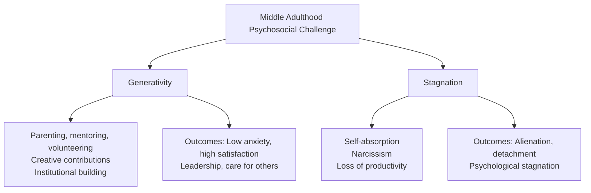

# Psychosocial Changes in Middle Adulthood: Generativity, Identity & Relationships

## Introduction

Middle adulthood—roughly ages 40 to 65—is a period of profound psychosocial transformation. It is simultaneously the stage of greatest social influence and contribution, and a time of deep self-examination. The central developmental challenge Erikson identified—generativity versus stagnation—captures the essential tension: will the middle-aged adult expand outward to guide, mentor, and enrich others, or contract inward into self-absorption and narcissism?

This period is also characterised by significant identity revision. Possible selves narrow; idealistic dreams are revised; relationships with children, parents, and siblings shift. The personality changes of middle adulthood often show increasing integration of masculine and feminine qualities, greater self-acceptance, and deepening coping capacity. Understanding these changes is essential for counsellors, educators, and anyone working with adults in the second half of life.

---

**Source PDF**:
- 📄 [Block-4/Unit-3.pdf – Pages 40–44](/pdfs/MPC-002%20Life%20Span%20Psychology/Block-4/Unit-3.pdf)
- 📚 MPC-002 Life Span Psychology, Block-4: Adulthood and Ageing

---

## 3.1 Erikson's Theory: Generativity vs. Stagnation

The primary psychosocial task of middle adulthood (ages 45–65), according to Erikson, is developing **generativity**: the desire and ability to expand one's influence and commitment beyond the self to family, society, and future generations.

### Generativity

Generativity encompasses all the ways a middle-aged adult contributes to the world in ways that can outlive them:

- **Parenting**: Raising children with values, resilience, and capability
- **Mentoring**: Guiding younger colleagues, students, or community members in their careers and lives
- **Volunteering**: Contributing time and skills to community organisations
- **Creative work**: Art, writing, research, or innovation that enriches culture
- **Institutional care**: Building or sustaining organisations, schools, or movements that serve future generations

**The generative person**:
- Is low in anxiety and depression
- Shows high self-acceptance and life satisfaction
- Is open to different viewpoints
- Has leadership qualities and cares about others' welfare
- Values meaningful work over financial gain
- Fatherhood, in particular, appears to enhance generativity in men

### Stagnation

Stagnation—the failure to develop generativity—results in:
- Self-centred preoccupation with personal comfort and security
- Emotional detachment, even from one's own children
- Focus on what one can *get* from others rather than give
- Loss of interest in productivity, creativity, and talent development
- A kind of psychological stagnation—becoming stuck in self-indulgence

Erikson described stagnation as "self-absorption with its associated self-indulgence and invalidism." It is not simply selfishness but a failure of the developmental impulse to connect one's life to something larger.

---

## 3.2 Levinson's Seasons of Life: Middle Adulthood

Levinson described middle adulthood as beginning with a transition and proceeding through alternating periods of stability and evaluation:

| Period | Approximate Age | Key Focus |
|---|---|---|
| Midlife Transition | 40–45 | Evaluate success; confront mortality; big life changes |
| Entering Middle Adulthood | 45–50 | Build new life structure post-transition |
| Age-50 Transition | 50–55 | Re-evaluate the new structure |
| Culminating Life Structure | 55–60 | Settle into final middle adult identity |

### The Midlife Transition

The midlife transition (around age 40) is characterised by:
- **Life review**: Evaluating how well current goals and achievements match the early Dream
- **Awareness of mortality**: The recognition that more time has passed than remains
- **Inward focus**: Turning attention to inner needs rather than external achievement
- **Potential for major change**: Career shifts, relationship changes, or lifestyle restructuring

Crucially, Levinson distinguished between the **normative crisis model** (fixed age-related stages) and the **timing of events model** (transitions triggered by actual life events such as children leaving, parents dying, or health changes). Contemporary lifespan development leans toward the timing-of-events model—midlife transition occurs when the *psychological reckoning* begins, not necessarily at a specific age.

---

## 3.3 Four Developmental Tasks of Middle Adulthood

Levinson identified four fundamental psychological tasks that middle-aged adults must navigate:

### 1. Young–Old

The task of integrating youthful and mature qualities. Middle adults must:
- Relinquish youthful qualities that no longer fit
- Discover new, positive meanings in the changes of ageing
- Find ways to remain vibrant and engaged without pretending youth

This is not about denial of ageing, but about genuine psychological integration of what it means to be simultaneously experienced and still growing.

### 2. Destruction–Creation

A moral and relational reckoning. Middle adults:
- Re-evaluate past harmful acts toward others
- May seek to apologise, make amends, or repair damaged relationships
- Develop greater creativity, generosity, and other-orientation
- Move from the competitive striving of early adulthood toward more constructive, relational values

### 3. Masculinity–Femininity

One of the most researched aspects of midlife development is the **crossover** in gender identity:
- **Men** become more empathic, nurturing, and caring
- **Women** become more assertive, autonomous, and self-confident
- Both sexes tend toward greater **androgyny**: the integration of traditionally masculine and feminine traits

This shift has a biological component (changing sex hormone ratios) and a social/psychological component (relaxation of gender role constraints as external social pressure decreases). Research consistently shows that more androgynous individuals are more psychologically adaptive and resilient.

### 4. Engagement–Separateness

The task of finding a new balance between:
- **Engagement** with the outer world (work, family, community)
- **Separateness**: time for inner reflection, solitude, and self-development

Men typically pull back from occupational ambition in middle adulthood, making more room for relationships and inner life. Women often shift outward—moving from family focus to career or community engagement and accomplishment. Both movements represent maturation, not regression.

---

## 3.4 Stability and Change in Personality and Self-Concept

### Possible Selves

**Possible selves** (Markus & Nurius) are the set of ideas a person holds about who they might become, fear becoming, or hope to become.

- In the **20s**: Possible selves are numerous, varied, optimistic, and idealised
- In **middle adulthood**: Possible selves narrow, become more realistic and fewer, and focus on domains where competence is already established
- The future no longer seems infinitely open; people adjust their aspirations to match realistic circumstances—a process of **adaptive coping**

### Self-Acceptance, Autonomy, and Environmental Mastery

Middle adults typically show:
- Greater **introspection**: Looking inward, evaluating life choices
- Increased **autonomy**: Preference for self-direction over external guidance
- **Environmental mastery**: A sense of competence in managing one's life environment
- More sophisticated **coping strategies**: Finding "silver linings," planning strategically, using humour adaptively

### Individual Differences in Personality Traits

Some individuals show **remarkable consistency** in core personality traits (the Big Five remain relatively stable across adulthood). Others show meaningful change, particularly in **openness to experience** (which may decline or remain stable) and **agreeableness** (which tends to increase). The debate between stability and change in adult personality is one of the most active in developmental psychology.

---

## 3.5 Relationships in Middle Adulthood

### Marriage and the "Empty Nest"

The period when children leave home—formerly called the "empty nest"—was once characterised as a uniformly depressing loss. Contemporary research contradicts this:
- Most middle-aged parents (especially women) experience **relief, renewed freedom, and increased marital satisfaction** when children leave
- This phase can last 20+ years, representing a significant period of renewed partnership and self-development
- Adults between 45 and 54 have the **highest annual incomes** of any age group, enabling new freedoms in travel, learning, and lifestyle

Divorce in midlife, while emotionally challenging, is described as more manageable than younger divorces. Women who leave marriages due to poor communication, abuse, or autonomy needs tend to adjust better post-divorce than women who leave for other reasons.

### Grandparenthood

Grandparenthood represents a major new role in middle adulthood with deep psychological significance. Research identifies several key meanings:

- **Valued elder**: Social role and community status
- **Immortality through descendants**: Biological and psychological continuity beyond one's own death
- **Reinvolvement with personal past**: Reliving and reinterpreting one's own earlier life
- **Indulgence**: Enjoying relationship rewards without primary discipline responsibilities

Grandparent-grandchild relationships evolve with the child's development. With young children, grandparents engage in **play**; as children grow, relationships shift toward **warmth, information, advice, and emotional support**. Geographic proximity strongly predicts relationship closeness.

### Sibling Relationships

Midlife sibling contact typically declines during the busy 40s and 50s but increases around life events—weddings, births, divorces, parental illness or death. Sibling reconnection often occurs spontaneously as children leave home and adults rediscover the pleasure of sibling companionship.

**Sister-sister** relationships are typically the closest across the lifespan. **Unequal burden-sharing** in elder care—where one sibling carries the primary responsibility—can generate serious resentment and conflict.

### Friendships

- Number of friends declines with age as adults become more selective
- Close friendships are maintained with greater intentional care
- Women report more intimate friendships and more emotional support exchange than men
- Friendships provide emotional support, pleasure, enhanced wellbeing, and protection from the impact of loss

---

## 3.6 Career Dynamics in Middle Adulthood

### Career Plateau and Satisfaction

By the 40s, most workers have settled into their career trajectories. Characteristic patterns:
- **Career plateau**: Advancement typically slows or stops by 40–45
- **Job satisfaction increases**: Typically peaks in the 50s–60s, as workers refine their expertise and accept realistic career ceilings
- **Commitment remains high**: Experienced workers are often highly dedicated to their organisations and roles

### Gender and the Glass Ceiling

The **glass ceiling**—the invisible barrier to advancement for women and ethnic minorities—remains a significant structural problem. Women managers are rated as equally or more effective than male managers (particularly on inspirational leadership and consideration), yet they face persistent barriers to executive-level positions.

### Career Change at Midlife

Midlife career changes are usually incremental (moving within a related field) rather than dramatic. Motivations include:
- Seeking more stimulating or meaningful work
- Reducing demanding schedules for better work-life balance
- Responding to burnout or values shifts

**Drastic job shifts** (e.g., corporate executive to artist) are relatively rare and typically signal a deeper personal crisis or identity reorganisation.

### Unemployment at Midlife

Unemployment hits middle-aged workers particularly hard because:
- They recognise they may be less attractive to employers than younger candidates
- They are unlikely to command equivalent salaries in new positions
- Their identity is often more deeply embedded in occupational role than younger workers
- These factors combine to produce serious **threats to self-worth and purpose**

---

## 3.7 Memory Aid: Four Developmental Tasks — "YDME"

**Y** – **Y**oung-Old (integrate youth and maturity)
**D** – **D**estruction-Creation (make amends; move toward generativity)
**M** – **M**asculinity-Femininity (integrate both; become more androgynous)
**E** – **E**ngagement-Separateness (balance outer world and inner life)

---

## 3.8 Self-Assessment Questions

**Basic Recall**
1. Distinguish Erikson's generativity from stagnation. Give two examples of generative behaviour that do not involve biological parenthood.
2. Describe Levinson's four developmental tasks of middle adulthood. Which do you think is most psychologically demanding, and why?
3. What is meant by the "empty nest" period? What does research tell us about its actual psychological impact?

**Applied Understanding**
4. A 52-year-old male executive begins volunteering with underprivileged youth and describes it as "finally feeling like his life matters beyond business." Using Erikson's framework, analyse this development.
5. Describe how a grandparent's relationship with a grandchild changes from when the child is 3 years old to when the grandchild is 16. What psychological functions does grandparenthood serve for the elder?

**Critical Analysis**
6. Levinson argued that men and women both experience midlife transition but at different times and with different content. Evaluate whether this gender difference holds in contemporary Indian society.

---

## 3.9 External Resources

### Academic Sources
- 📖 [Erikson, E.H. (1963). *Childhood and Society* (2nd ed.). Norton.](https://www.wwnorton.com/)
- 📖 [Levinson, D.J. (1986). A conception of adult development. *American Psychologist*, 41(1), 3–13.](https://doi.org/10.1037/0003-066X.41.1.3)
- 📖 [Markus, H. & Nurius, P. (1986). Possible selves. *American Psychologist*, 41(9), 954–969.](https://doi.org/10.1037/0003-066X.41.9.954)

### Wikipedia
- 🌐 [Generativity](https://en.wikipedia.org/wiki/Generativity)
- 🌐 [Middle age](https://en.wikipedia.org/wiki/Middle_age)
- 🌐 [Grandparent](https://en.wikipedia.org/wiki/Grandparent)
- 🌐 [Glass ceiling](https://en.wikipedia.org/wiki/Glass_ceiling)

### Educational Videos
- 🎥 [Generativity vs. Stagnation – Erik Erikson Explained](https://www.youtube.com/watch?v=xXB4RtMNbVs)
- 🎥 [Middle Adulthood – Psychosocial Development](https://www.youtube.com/watch?v=2Cm8_MUPcqE)
- 🎥 [Adult Development Theories – Khan Academy](https://www.khanacademy.org/science/health-and-medicine/human-development-and-aging)

### Recent Research (2020–2024)
- 📄 [Gruenewald, T.L., et al. (2021). Generativity and subjective well-being across midlife. *Psychology and Aging*, 36(5), 588–603.](https://doi.org/10.1037/pag0000615)
- 📄 [Antonucci, T.C., et al. (2022). Midlife relationships and wellbeing: Social convoy theory revisited. *Gerontologist*, 62(4), 512–521.](https://doi.org/10.1093/geront/gnab073)
- 📄 [Fingerman, K.L., et al. (2023). Grandparent-grandchild relationships and psychological adjustment. *Developmental Psychology*, 59(3), 411–426.](https://doi.org/10.1037/dev0001465)

### Cross-References
- ➡️ [Psychosocial Changes in Early Adulthood](/mpc-002/block-4/psychosocial-changes-early-adulthood)
- ➡️ [Psychosocial Changes in Old Age](/mpc-002/block-4/psychosocial-changes-old-age)
- ➡️ [Cognitive Changes in Middle Adulthood](/mpc-002/block-4/cognitive-changes-middle-adulthood)

---

## Summary

Middle adulthood's central psychosocial task is generativity—expanding care, contribution, and guidance to the next generation—versus the stagnation of self-absorption. Levinson's framework traces the midlife transition and four developmental tasks: integrating Young-Old, Destruction-Creation, Masculinity-Femininity, and Engagement-Separateness. Personality becomes more integrated and androgynous; possible selves narrow from idealistic to realistic. The empty nest, grandparenthood, and shifting sibling and friendship dynamics mark the relational landscape of middle adulthood. Career trajectories plateau but satisfaction increases, while gender-related barriers (glass ceiling, role overload) persist. Understanding these dynamics equips counsellors and educators to support adults through one of life's richest and most demanding developmental periods.
