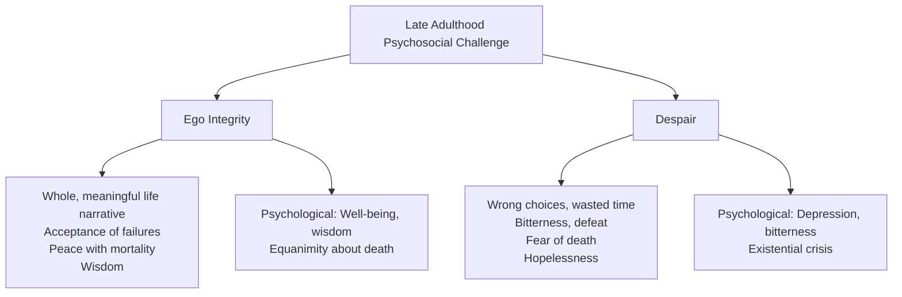

# Psychosocial Changes in Old Age: Integrity, Relationships & Successful Ageing

## Introduction

Late adulthood—beginning around age 65—presents a unique psychosocial landscape. Older adults face a convergence of significant losses (physical health, social roles, spouses, friends) alongside the deepening satisfactions of accumulated wisdom, long-term relationships, and hard-won self-knowledge. Erik Erikson's final psychosocial stage—**Ego Integrity vs. Despair**—frames the essential developmental task: to look back on one's life and find it worthy of having been lived.

But late adulthood is not only about looking backward. It is also a time of active social engagement, spiritual deepening, personality integration, and—in healthy ageing—surprising emotional wellbeing. Research consistently shows that older adults report higher emotional satisfaction than younger adults in many domains, a paradox known as the **positivity effect** or the "ageing paradox." Understanding the psychosocial dimensions of old age is essential for counsellors, healthcare workers, gerontologists, and anyone who cares for or works with older populations.

---

**Source PDF**:
- 📄 [Block-4/Unit-3.pdf – Pages 45–49](/pdfs/MPC-002%20Life%20Span%20Psychology/Block-4/Unit-3.pdf)
- 📚 MPC-002 Life Span Psychology, Block-4: Adulthood and Ageing

---

## 3.1 Erikson's Final Stage: Ego Integrity vs. Despair

### Ego Integrity

Ego integrity is achieved when an older adult can look back on their life with a sense of:
- **Wholeness**: Life choices, successes, and failures form a coherent, meaningful narrative
- **Satisfaction**: Goals were achieved, values were expressed, relationships were meaningful
- **Acceptance**: Setbacks and disappointments are understood as part of a full human life
- **Equanimity about mortality**: The recognition that death is inevitable is met with peace rather than terror

People who achieve integrity feel whole and complete. Increased age is associated with greater maturity and wellbeing for those who resolve this crisis positively. Integrity does not require a perfect life—it requires the capacity to *integrate* one's actual life, flaws included, into a meaningful whole.

### Despair

Despair occurs when older adults:
- Feel they made irreparable wrong choices
- Believe they wasted their lives or failed to achieve what mattered
- Experience bitterness, defeat, and anxious fear of death
- See no possibility of restarting or repairing their life's direction (time is too short)

Despair is not simply regret—it is the inability to find meaning in one's actual life trajectory. It manifests as depression, bitterness, and existential hopelessness.

---

## 3.2 Peck's Three Tasks of Ego Integrity

Robert Peck extended Erikson's framework by identifying three specific psychological tasks within the broad challenge of ego integrity:

### 1. Ego Differentiation vs. Work-Role Preoccupation

Many people's identity is heavily invested in their career. Retirement forces the question: **Who am I if not my job?** The task is to find other sources of self-worth—relationships, hobbies, community roles, wisdom-sharing—that provide meaning and identity beyond occupational achievement. Those who cannot make this transition experience a profound identity crisis in retirement.

### 2. Body Transcendence vs. Body Preoccupation

Physical changes in old age (chronic illness, pain, reduced mobility, loss of beauty) are universal. The developmental task is to **transcend** physical limitations—finding value, meaning, and satisfaction through:
- Cognitive strengths and intellectual engagement
- Social relationships and emotional bonds
- Spiritual or philosophical frameworks
- Creative expression

Those who remain preoccupied with their declining bodies experience misery; those who transcend physical limitations report surprising emotional wellbeing.

### 3. Ego Transcendence vs. Ego Preoccupation

The ultimate task: confronting the reality of one's own death not with terror but with **generative purpose**. Elders who achieve ego transcendence find meaning through their contributions to the next generation—children, grandchildren, students, communities—whose lives will continue beyond their own mortality. This is Erikson's generativity transformed into its final, mortality-aware form.

---

## 3.3 Labouvie-Vief: Emotional Expertise in Old Age

Gisela Labouvie-Vief's work highlights a remarkable achievement of old age: **emotional expertise**—the capacity to reflect on one's emotional life with nuance, depth, and maturity.

Early adulthood is characterised by pragmatic problem-solving—finding workable solutions to concrete challenges. In contrast, older adults:
- Become **more in touch with their feelings**
- Use emotional experience as a resource for **reflecting on and understanding life**
- Develop **emotional self-regulation**: the ability to detach from immediate emotional reactions and choose more considered responses
- Are **less impulsively emotional** in coping and problem-solving than younger adults

This emotional maturation partially explains the "ageing paradox": older adults report more emotional satisfaction and fewer intense negative emotions than younger adults, despite their greater objective losses. They have learned to regulate emotional experience more effectively.

---

## 3.4 Reminiscence and Life Review

### Reminiscence

**Reminiscence** is the act of telling stories about one's past—recounting people, events, feelings, and meanings from earlier life. It serves multiple psychological functions:
- **Identity consolidation**: Strengthening the sense of a coherent life narrative
- **Social bonding**: Sharing memories deepens connections with family and friends
- **Meaning-making**: Finding significance in past events
- **Entertainment and pleasure**: Revisiting positive memories

### Life Review

**Life review** (Butler, 1963) is a deeper, more systematic form of reminiscence in which the older adult:
- Reflects on past experiences with the explicit goal of **achieving greater self-understanding**
- Evaluates choices, regrets, and achievements
- Works toward **psychological integration** of the whole life arc
- Attempts to resolve unfinished emotional business

Research indicates that **middle age is typically rated as the most satisfying life period** by older adults looking back, with childhood and adolescence rated as less satisfying—reflecting the social productivity and relationship richness of midlife.

Life review is a powerful **therapeutic tool** with older adults. Structured reminiscence groups and individual life review therapy have documented benefits for reducing depression, increasing self-esteem, and enhancing sense of meaning in older populations.

---

## 3.5 Stability and Change in Personality and Self-Concept

### A More Secure, Multifaceted Self-Concept

After a lifetime of self-knowledge and self-observation, older adults typically:
- Feel **more secure** in their sense of self
- Have a **more complex and multifaceted self-concept** (more aware of their own contradictions and nuances)
- Show **greater consistency** between their stated values and actual behaviour

### Personality Shifts in Old Age

Three notable personality shifts characterise healthy late adulthood:

**Agreeableness**: Greater generosity, good-naturedness, and willingness to accommodate others—reflecting reduced competitive motivation and increased compassion.

**Sociability**: Tends to *decrease* somewhat, as older adults become more selective about relationships. Preferred networks shrink to the most meaningful bonds—consistent with socioemotional selectivity theory (Carstensen).

**Acceptance of change**: Increased capacity to accept life's uncertainties and adapt resiliently to adversity. Well-being is associated with flexibility and equanimity, not resistance to change.

### Spirituality and Religiosity

Spirituality deepens significantly in late adulthood:
- Religious participation provides **ritual, community, and meaning** that stabilise life
- Spiritual engagement advances to a more **reflective, contemplative** level—more comfortable with mystery, paradox, and unknowable dimensions of existence
- Older adults often develop a heightened sense of **beauty in art, nature, and relationships**
- Religious coping is associated with better health outcomes, lower mortality, and higher wellbeing

---

## 3.6 Individual Differences in Psychological Well-Being

### Dependency and Control

Two problematic patterns emerge in elder care contexts:

**Dependency-support script**: When dependent behaviours are attended to immediately (by caregivers), this reinforces dependency rather than promoting autonomy. The message, unintentionally, is: "You get help by being helpless."

**Independence-ignore script**: When independent behaviours are ignored and only dependent behaviours get a response, the elder is again reinforced toward dependency.

Both patterns undermine the elder's sense of agency, contributing to depression and reduced wellbeing. The most effective caregiving responds to *both* dependent and independent behaviours—supporting needs while actively affirming and encouraging competence.

### Elder Suicide

Elder suicide is often indirect and difficult to detect:
- Refusing to eat or take medications
- Abandoning medical treatment
- Withdrawing from all relationships
- Refusing activities that previously provided meaning

Older adults—particularly white men in Western countries—have the highest suicide rates of any age group, a fact often obscured by attention to adolescent suicide. Counsellors and healthcare workers should be vigilant for signs of passive suicidality and hopelessness in older clients.

### Health as Predictor of Well-Being

Physical health is one of the strongest predictors of psychological wellbeing in old age. Chronic illness and disability produce:
- Loss of personal control and helplessness
- Social isolation (reduced mobility limits social activity)
- Mental health decline, which further worsens physical health (poor nutrition, sedentary behaviour, reduced engagement)

The health-wellbeing feedback loop makes integrated physical and mental health care for older adults both ethically important and economically rational.

---

## 3.7 Relationships in Late Adulthood

### The Social Convoy

The **social convoy** (Kahn & Antonucci) is the cluster of close relationships that surrounds an individual throughout life—family members and friends who provide support, security, and continuity. Characteristics of the social convoy in old age:

- Some bonds become **closer** with age
- Others become **more distant** as circumstances change
- A few new bonds are **gained** (new friendships, grandchildren)
- Some relationships **drift away** through death or geographical separation

Older adults actively work to **maintain meaningful social networks** to preserve security and life continuity, even as the convoy inevitably shrinks.

### Marriage in Late Adulthood

Married older adults tend to be happier than single older adults—though those who have *never* married often cope better with late-life loneliness than those who are widowed. Marital satisfaction in late adulthood:
- **Rises** from middle age if partners perceive fairness and equity in the relationship
- Is enhanced by **joint leisure activities** and more positive, less conflictual communication
- Benefits from the removal of child-rearing demands and role pressures

### Sibling and Friendship Bonds

**Siblings** in old age engage in reminiscence together, creating a sense of family continuity and shared life review. Sister-sister bonds remain particularly close. Siblings who outlive other family members may become primary social anchors.

**Friendships** serve distinct functions: intimacy, companionship, acceptance, link to wider community, and emotional protection from loss. Women maintain both intimate and secondary friendship networks more effectively than men in old age.

---

## 3.8 Retirement and Leisure

### The Decision to Retire

Retirement timing is shaped by:
- **Affordability**: Adequate pension, savings, or social security
- **Health status**: Poor health often precipitates early retirement
- **Early retirement incentives**: Employer packages encouraging earlier exit
- **Gender and ethnicity**: Women often retire earlier due to family demands; minority groups may face financial constraints that delay retirement

### Adjustment to Retirement

Successful retirement adjustment is predicted by:
- Voluntary choice (not forced retirement)
- Financial stability and adequate income
- **Sense of personal control** over the retirement decision
- Development of **meaningful post-retirement activities** before retiring
- **Strong social support** and marital satisfaction
- Health maintenance through lifestyle choices (exercise, nutrition, cognitive engagement)

People who enter retirement without developed interests or social connections are at high risk for **depression, boredom, and cognitive decline**. "Retiring to something" rather than "retiring from something" is associated with significantly better outcomes.

### Leisure Activities

Leisure in old age:
- Relates to both physical and mental health
- Is associated with **reduced mortality**
- Provides social connection and meaning
- Best developed *before* retirement and then deepened post-retirement

---

## 3.9 Successful Ageing: An Integrative Framework

Successful ageing occurs when elders **minimise losses while maximising gains**. The social and material environment plays a critical enabling role:

| Environmental Support | Impact |
|---|---|
| Well-funded social security | Reduces financial stress |
| Quality healthcare | Maintains physical and cognitive health |
| Safe, adaptable housing | Preserves independence |
| Social services and community | Combats isolation |
| Lifelong learning opportunities | Sustains cognitive vitality |
| Sensitive elder care | Preserves dignity and agency |

At the individual level, successful ageing involves the **SOC model** (Selective Optimisation with Compensation)—adapting strategically to losses while investing fully in what remains meaningful.

**Socioemotional Selectivity Theory** (Carstensen): As time horizons shrink, older adults prioritise emotionally meaningful goals and relationships over information-seeking and novel experience. This shift explains both the "positivity effect" (greater positive emotional experience) and the narrowing of social networks—a psychologically *adaptive* response to the reality of limited future time.

---

## 3.10 Memory Aid: Peck's Three Tasks — "EBE"

**E** – **E**go Differentiation (find identity beyond work role)
**B** – **B**ody Transcendence (find meaning beyond physical limitations)
**E** – **E**go Transcendence (find purpose beyond one's own mortality)

---

## 3.11 Self-Assessment Questions

**Basic Recall**
1. Distinguish ego integrity from despair (Erikson). What kind of life review leads to integrity rather than despair?
2. Describe Peck's three tasks of ego integrity. How do they extend Erikson's framework?
3. What is the social convoy? How does it change in late adulthood?
4. List four factors that predict successful adjustment to retirement.

**Applied Understanding**
5. A 74-year-old retired judge says she feels "at peace" with her life despite several significant regrets—including estrangement from one child. Using Erikson's framework, explain how ego integrity is compatible with having regrets.
6. An 82-year-old widower has stopped eating regularly and refuses his heart medication. He says "What's the point?" Using concepts from this unit, analyse this situation and suggest an approach for a counsellor working with him.

**Critical Analysis**
7. Carstensen's socioemotional selectivity theory suggests that older adults' preference for emotionally meaningful over novel relationships is *adaptive*. Do you agree? What might be lost as well as gained through this narrowing?

---

## 3.12 External Resources

### Academic Sources
- 📖 [Erikson, E.H. & Erikson, J.M. (1997). *The Life Cycle Completed (Extended Version).* Norton.](https://www.wwnorton.com/books/9780393316148)
- 📖 [Carstensen, L.L. (2006). The influence of a sense of time on human development. *Science*, 312(5782), 1913–1915.](https://doi.org/10.1126/science.1127488)
- 📖 [Butler, R.N. (1963). The life review: An interpretation of reminiscence in the aged. *Psychiatry*, 26(1), 65–76.](https://doi.org/10.1080/00332747.1963.11023339)

### Wikipedia
- 🌐 [Ego integrity vs. despair](https://en.wikipedia.org/wiki/Erikson%27s_stages_of_psychosocial_development#Stage_8:_Integrity_vs._Despair)
- 🌐 [Reminiscence therapy](https://en.wikipedia.org/wiki/Reminiscence_therapy)
- 🌐 [Socioemotional selectivity theory](https://en.wikipedia.org/wiki/Socioemotional_selectivity_theory)
- 🌐 [Successful aging](https://en.wikipedia.org/wiki/Successful_ageing)

### Educational Videos
- 🎥 [Ego Integrity vs. Despair – Erik Erikson's Last Stage](https://www.youtube.com/watch?v=Sl9VT6KY10g)
- 🎥 [Laura Carstensen: Older People Are Happier – TED Talk](https://www.ted.com/talks/laura_carstensen_older_people_are_happier)
- 🎥 [Gerontology and Ageing – Khan Academy](https://www.khanacademy.org/science/health-and-medicine/human-development-and-aging)

### Recent Research (2020–2024)
- 📄 [Carstensen, L.L., & DeLiema, M. (2021). The positivity effect: A negativity bias in youth fades with age. *Current Opinion in Behavioral Sciences*, 19, 7–12.](https://doi.org/10.1016/j.cobeha.2017.07.009)
- 📄 [Wiest, M., et al. (2023). Reminiscence therapy outcomes in older adults. *Clinical Psychology Review*, 98, 102219.](https://doi.org/10.1016/j.cpr.2022.102219)
- 📄 [Rowe, J.W., & Kahn, R.L. (2022). Successful aging 2.0: Conceptual expansions. *Journals of Gerontology: Series B*, 77(6), 1–5.](https://doi.org/10.1093/geronb/gbab214)

### Cross-References
- ➡️ [Psychosocial Changes in Middle Adulthood](/mpc-002/block-4/psychosocial-changes-middle-adulthood)
- ➡️ [Cognitive Changes in Old Age](/mpc-002/block-4/cognitive-changes-old-age)
- ➡️ [Physical Changes in Old Age](/mpc-002/block-4/physical-changes-old-age)

---

## Summary

Old age brings the culminating psychosocial challenge: achieving ego integrity—a sense that one's life was meaningful and worth living—rather than falling into despair over perceived failures. Peck's three tasks refine this challenge: finding identity beyond work, transcending physical decline, and accepting mortality through generative contribution. Labouvie-Vief's emotional expertise framework explains why older adults often show surprising emotional wellbeing despite objective losses. Reminiscence and life review serve as powerful tools for psychological integration. Personality in old age trends toward greater agreeableness, more selective sociability, and deeper spiritual engagement. The social convoy narrows but deepens; marriage and friendship remain critical wellbeing resources. Successful retirement requires voluntary timing, financial security, and meaningful post-retirement activities. Successful ageing overall is enabled by both individual adaptive strategies (SOC model, socioemotional selectivity) and supportive social environments—making it a collective as much as an individual achievement.
