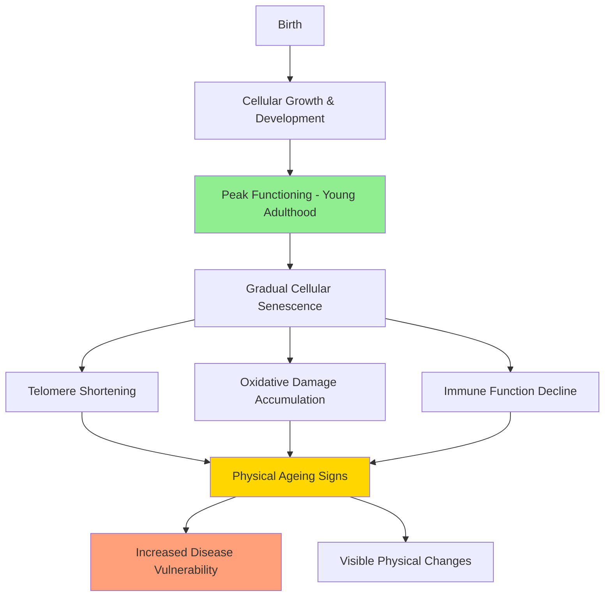
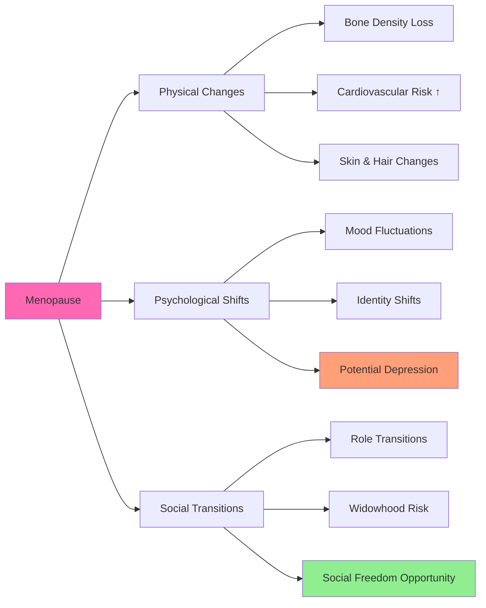
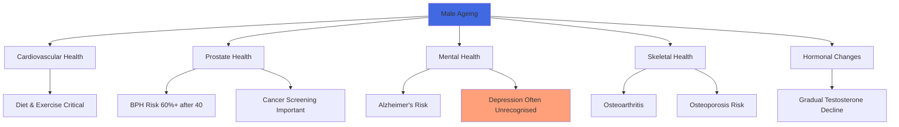

# The Ageing Process: Understanding Gender Differences

## Introduction

Ageing is one of the most universal yet deeply personal human experiences. From the moment we are born, our bodies begin a continuous process of change — cells multiply, tissues develop, and systems mature. Yet the fascinating truth about ageing is that while the process is universal, the *experience* of ageing is remarkably individualised. Two people born the same day may age at dramatically different rates, with genetics, lifestyle, culture, and environment all playing shaping roles.

In this unit, we explore the **ageing process** as a complex biopsychosocial phenomenon — one that touches every aspect of human existence. Crucially, we examine how ageing manifests differently in women and men, recognising that biological sex differences and social expectations create distinct ageing trajectories.

:::info Source
📄 [MPC-002 Block-4/Unit-4.pdf - Pages 50-55](/pdfs/MPC-002%20Life%20Span%20Psychology/Block-4/Unit-4.pdf)  
📚 MPC-002 Life Span Psychology, IGNOU
:::

---

## What is Ageing?

**Ageing** (also spelled "ageing" in British English) refers to the cumulative changes that occur in organisms over time. In the human context, ageing is a **multidimensional process** involving:

- **Physical changes** — alterations in appearance, organ function, and cellular mechanisms
- **Psychological changes** — shifts in cognition, emotional regulation, and personality
- **Social changes** — changing roles, relationships, and societal expectations
- **Cultural changes** — how one's community frames and responds to growing older

Ageing is **not synonymous with old age**. It begins at birth and continues throughout the lifespan. A newborn replaces dead cells and grows new ones daily; a teenager's height is determined by genetic programming; an adult's metabolism gradually slows — all part of one continuous ageing process.

:::tip Key Distinction
Ageing ≠ Deterioration. Many age-related changes are simply *adaptations* rather than declines. Gray hair, shifting body composition, and changing sleep patterns are normal aspects of biological ageing, not necessarily signs of disease.
:::

### The Cellular Basis of Ageing

At the cellular level, ageing involves:

1. **Cellular senescence** — a reduction in the rate of cell multiplication, meaning damaged or worn cells accumulate rather than being replaced efficiently
2. **Telomere shortening** — the protective caps on chromosomes shorten with each cell division, eventually limiting cell replication
3. **Mitochondrial dysfunction** — energy production in cells becomes less efficient
4. **Accumulation of oxidative damage** — free radicals damage DNA, proteins, and cell membranes over time
5. **Impaired immune function** — reduced ability to recognise and destroy pathogens and abnormal cells

These cellular changes contribute to the visible and systemic changes we associate with ageing, including reduced wound healing, increased cancer risk, and declining organ function.

### Determinants of Ageing Rate

The speed at which an individual ages is shaped by an interaction of:

| Factor | Influence |
|--------|-----------|
| **Genetic makeup** | Strongest determinant of lifespan variation between individuals |
| **Diet and nutrition** | Antioxidant-rich diets may slow cellular damage |
| **Exercise** | Regular activity preserves muscle, bone, and cardiovascular health |
| **Social engagement** | Active social lives linked to cognitive preservation |
| **Spirituality and purpose** | Sense of meaning associated with better health outcomes |
| **Stress levels** | Chronic stress accelerates cellular ageing (telomere shortening) |
| **Environmental exposures** | UV radiation, pollution, and toxins add to cellular burden |

Research increasingly shows that **genetic factors are more powerful than environmental ones** in determining large differences in ageing rates across individuals. Yet environmental factors remain highly significant, particularly because they are the ones we can most readily modify.

---

## Theories of Biological Ageing

Understanding *why* we age has occupied scientists for centuries. Several major theories have emerged:

### 1. Programmed Ageing Theories
These suggest ageing follows a biological "clock" embedded in our genes. The **telomere theory** is the most influential: each cell division shortens telomeres, and when they become too short, cells stop dividing. This is linked to the **Hayflick Limit** — the observation that human cells can divide only a fixed number of times (approximately 50).

### 2. Damage/Error Theories
These propose that ageing results from accumulated damage over time:
- **Free radical theory** (Harman, 1956): Reactive oxygen species damage DNA, proteins, and lipids
- **DNA damage theory**: Unrepaired genetic damage accumulates and compromises cell function
- **Wear and tear theory**: Cells simply "wear out" from use over time

### 3. Evolutionary Theories
- **Disposable soma theory** (Kirkwood): Organisms evolved to invest limited energy in either reproduction or repair — humans optimised for reproduction, so repair declines post-reproductive years
- **Antagonistic pleiotropy**: Genes beneficial early in life may have harmful effects in old age

### 4. Epigenetic Clock Theory
Recent research (Horvath, 2013) has identified an **epigenetic clock** — methylation patterns in DNA that correlate precisely with biological age and may better predict health and lifespan than chronological age.

:::note Recent Research
A 2023 study in *Nature Aging* found that biological age, measured via epigenetic clocks, can be **reversed** through lifestyle interventions including diet, exercise, and stress reduction — offering hope that the rate of ageing is more malleable than previously thought.

- **Source**: Fahy, G.M. et al. (2023). Reversal of epigenetic aging in older adults. *Nature Aging*, 3(4), 396-409.
:::

---

## Ageing in Women: A Multidimensional Challenge

Ageing in women is shaped by a powerful biological transition — **menopause** — as well as by deeply embedded social expectations around femininity, beauty, and reproductive capacity.

### The Hormonal Transition: Menopause

Women's lives are structured around two broad hormonal phases:
- **Premenopausal**: Reproductive years, when oestrogen and progesterone cycle regularly
- **Postmenopausal**: Following the final menstrual period, when ovarian hormone production sharply declines

**Menopause** typically occurs around age 50-51 in Indian women (slightly earlier than the global average of 51-52). The **perimenopause** transition can last 4-10 years before, with irregular cycles and hormonal fluctuations.

### Physical Challenges for Women

**Bone and Muscle:**
The sharp decline in oestrogen during menopause accelerates **bone density loss**, making women at high risk for **osteoporosis** — a condition where bones become brittle and fracture easily. India has a particularly high osteoporosis burden, with studies estimating that 35-50 million Indian women over 50 have low bone density.

**Cardiovascular:**
Oestrogen provides some cardiovascular protection. After menopause, women's heart disease risk increases and eventually approaches that of men, though it typically lags by about a decade.

**Skin and Appearance:**
- Reduced collagen production leads to skin thinning, wrinkles, and dryness
- Redistribution of body fat, often from hips to abdomen
- Hair thinning and texture changes

**Immune System:**
Declining oestrogen is associated with reduced immune function, increasing vulnerability to autoimmune conditions and infections.

### Psychological Challenges for Women

The psychological impact of ageing in women is often underestimated and underdiagnosed:

**Mood and Depression:**
- Hormonal fluctuations during perimenopause are linked to increased rates of depression and anxiety
- The cessation of fertility can be psychologically significant, even for women who did not wish to bear more children — it represents a major identity shift
- Social messaging that equates women's value with youth and appearance can trigger profound grief and identity disruption

**Cognitive Effects:**
- Many women report "brain fog" during perimenopause — difficulty concentrating and memory lapses
- Research suggests these may be temporary effects of hormonal fluctuation rather than permanent decline
- Post-menopausal women show variable cognitive trajectories depending on lifestyle factors

**Emotional Insecurity:**
The text raises an important concern: fear that reduced physical attractiveness may affect romantic relationships. While this reflects harmful societal norms, these fears are real psychological experiences that require compassionate attention. Feminist psychologists emphasise that these fears arise from **internalised ageism and sexism** rather than reflecting reality.

### Social Challenges for Women

In many cultural contexts, particularly in India, women's social roles shift dramatically as they age:

- **Transition from caregiving to care-receiving** — a major role reversal
- **Empty nest** — children leaving the family home
- **Widowhood** — women typically outlive men; widowhood is disproportionately a female experience
- **Social withdrawal** — some women disengage from social life due to health or cultural expectations of older women

Yet ageing also brings **social freedom** that many women embrace. With children independent and financial stability established, post-menopausal women often describe finding a new sense of self — what anthropologist Margaret Mead called the "postmenopausal zest." Many Indian women, freed from menstrual restrictions and reproductive duties, take on new social and spiritual roles.

---

## Ageing in Men: The Overlooked Transition

Men's ageing is culturally framed differently — often as a decline in **vitality, strength, and potency** — with a strong stigma that prevents men from seeking appropriate healthcare.

### Andropause: The Male Equivalent?

Unlike menopause, which involves a relatively sharp hormonal decline, men experience a more gradual reduction in **testosterone** of approximately 1-2% per year starting in their 30s. This **late-onset hypogonadism** (sometimes called "andropause" or "male menopause") can contribute to:

- Reduced muscle mass and strength
- Increased body fat, particularly abdominal ("middle-age spread")
- Reduced libido and potential erectile dysfunction
- Fatigue and reduced vitality
- Mood changes, including irritability and depression

However, the male hormonal transition is far more gradual and variable than female menopause, and many men maintain healthy testosterone levels well into old age.

### Key Health Challenges for Ageing Men

**1. Cardiovascular Health**
Cardiovascular disease is the **leading cause of death** among men worldwide and in India. Men are at risk earlier than women (due to the absence of oestrogen's protective effects in their younger years). Risk factors include hypertension, high cholesterol, diabetes, smoking, and sedentary lifestyle.

Management: High-fibre diet, reduced saturated fat, daily moderate exercise, and stress reduction have demonstrated strong protective effects even in men with existing heart disease.

**2. Prostate Health**
From age 40 onwards, prostate health becomes a primary concern:
- **Benign Prostatic Hyperplasia (BPH)** — enlarged prostate — affects approximately 60% of men over 40 and up to 90% of men over 80
- **Prostate cancer** — risk increases steadily with age; elevated dihydrotestosterone (DHT) is implicated
- **Prostatitis** — inflammation, which can affect men of any age

**3. Mental Health**
Men are less likely to seek mental health support and more likely to exhibit "masked depression" — presenting as irritability, risk-taking, or substance use rather than classic sadness. Alzheimer's disease and other dementias are significant concerns in late ageing.

**4. Skeletal Health**
While women are more at risk for osteoporosis, men are far from immune. One in six men will fracture a hip in their lifetime. Decades of sports injuries, physical labour, and inadequate calcium intake compound to create significant joint and bone vulnerability in older men.

**5. Whole Health Integration**
A comprehensive approach for ageing men includes:
- Antioxidant-rich diet (vegetables, fruits, whole grains)
- Consistent moderate aerobic and resistance exercise
- Stress management (meditation, social connection)
- Regular health screenings (PSA tests, cardiovascular checks, colonoscopy)

---

## Comparing Male and Female Ageing

| Domain | Women | Men |
|--------|-------|-----|
| **Hormonal transition** | Sharp (menopause, ~50) | Gradual (andropause, 30s-70s) |
| **Bone density risk** | Higher (post-menopause) | Lower but significant |
| **Cardiovascular risk timing** | Later (post-menopause) | Earlier (no oestrogen protection) |
| **Longevity** | Generally live longer | Die earlier on average |
| **Primary health concerns** | Osteoporosis, breast cancer, dementia | Heart disease, prostate cancer |
| **Social role changes** | Often dramatic | Often career-related |
| **Cultural framing** | Focus on appearance/fertility | Focus on strength/productivity |
| **Help-seeking behaviour** | More likely to seek care | Stigma prevents help-seeking |
| **Depression presentation** | Internalising (sadness, withdrawal) | Externalising (irritability, risk-taking) |

---

## The Indian Context

Ageing in India is shaped by unique cultural, familial, and economic factors:

**Family Structure:** The traditional Indian joint family system has historically provided a strong support network for ageing adults. Grandparents are often deeply integrated into family life, contributing to childcare and household wisdom while receiving care and companionship. However, increasing urbanisation and nuclear family structures are changing this dynamic.

**Societal Attitudes:** In many Indian traditions, old age is associated with wisdom and respect — concepts embedded in the Sanskrit "Vanaprastha" (forest-dweller) and "Sannyasa" (renunciation) stages of life. Yet globalisation has also brought Western youth-obsessed beauty standards that are being internalised, particularly by urban Indian women.

**Healthcare Access:** Access to geriatric healthcare remains unequal across India. Urban elites have access to sophisticated care, while rural elderly often rely on family networks and traditional medicine. The National Programme for Health Care of the Elderly (NPHCE) was launched to address this gap.

**Economic Security:** India lacks a universal pension system, leaving many elderly dependent on family support. Women are particularly vulnerable — lower lifetime earnings, career interruptions for caregiving, and longer life expectancy combine to create financial insecurity in old age.

---

## Memory Aids

**For Women's Ageing Challenges:**
**BPSSS** = Bones, Psychological, Skin, Social, Sexuality — the five domains of female ageing

**For Men's Ageing Health Priorities:**
**CHAMP** = Cardiovascular, Heart, Androgen (testosterone), Mental health, Prostate

**For Ageing Determinants:**
**GDESSS** = Genetics, Diet, Exercise, Social engagement, Spirituality, Stress management

---

## Self-Assessment Questions

1. Distinguish between the concepts of "ageing" and "old age." Why is this distinction important for developmental psychology?

2. Describe three biological theories of ageing. Which do you find most convincing and why?

3. A 52-year-old woman is experiencing significant mood swings, sleep disturbances, and a sense of loss of identity. What psychosocial factors related to menopause might be contributing, and how would you approach supporting her from a life-span psychology perspective?

4. Why is cardiovascular health a more urgent concern for younger men than for young women? How does this change after women reach menopause?

5. Critically evaluate the statement: "Ageing in women is more challenging than in men." Use evidence from the unit to support or challenge this view.

6. How do Indian cultural contexts shape the experience of ageing differently from Western contexts? Give specific examples.

---

## External Resources

### Wikipedia Articles
- [Ageing](https://en.wikipedia.org/wiki/Ageing) — comprehensive overview of biological, psychological, and social aspects
- [Menopause](https://en.wikipedia.org/wiki/Menopause) — detailed coverage of the female reproductive transition
- [Benign Prostatic Hyperplasia](https://en.wikipedia.org/wiki/Benign_prostatic_hyperplasia) — BPH overview
- [Telomere](https://en.wikipedia.org/wiki/Telomere) — cellular mechanism of ageing

### Educational Videos
- 🎥 [The Science of Ageing - TED-Ed](https://www.youtube.com/watch?v=QRt7LjqJ45k) — accessible overview of why we age
- 🎥 [Menopause: What You Need to Know - NIH](https://www.youtube.com/watch?v=HuGxBBT_SjQ) — evidence-based menopause information
- 🎥 [Men's Health and Ageing - MIT OpenCourseWare Series](https://ocw.mit.edu) — health considerations for ageing men

### Research Papers (2020-2024)
- Fahy, G.M. et al. (2023). Reversal of epigenetic aging. *Nature Aging*. DOI: 10.1038/s43587-023-00426-2
- Maki, P.M. & Jaff, N.G. (2022). Cognitive effects of menopause. *Nature Reviews Endocrinology*, 18(10), 599-612.
- Travison, T.G. et al. (2022). Testosterone levels and male ageing. *Journal of Clinical Endocrinology & Metabolism*, 107(3).

### Additional Reading
- [National Institute on Aging - How the Aging Body Changes](https://www.nia.nih.gov/health/how-your-body-changes-as-you-age)
- [WHO - Ageing and Health](https://www.who.int/news-room/fact-sheets/detail/ageing-and-health)
- [Indian National Programme for Health Care of the Elderly](https://nhm.gov.in/index4.php?lang=1&level=0&linkid=423&lid=344)

---

## Cross-References

- Related: [Physical Changes in Middle Adulthood](/mpc-002/block-4/physical-changes-middle-adulthood)
- Related: [Physical Changes in Old Age](/mpc-002/block-4/physical-changes-old-age)
- Related: [Psychosocial Changes in Old Age](/mpc-002/block-4/psychosocial-changes-old-age)
- Upcoming: [Ageing Issues in Early and Middle Adulthood](/mpc-002/block-4/ageing-issues-early-middle-adulthood)

---

**Source PDFs**:
- 📄 [Block-4/Unit-4.pdf - Pages 50-55](/pdfs/MPC-002%20Life%20Span%20Psychology/Block-4/Unit-4.pdf)
- 📚 MPC-002 Life Span Psychology, IGNOU
