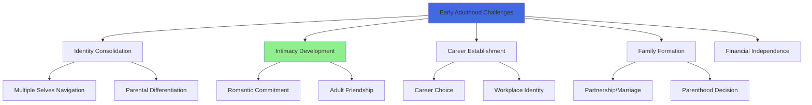
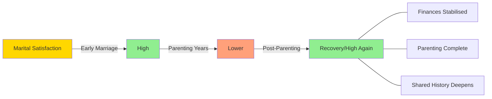

# Ageing Issues and Challenges in Early and Middle Adulthood

## Introduction

Every phase of adulthood brings its own constellation of challenges and opportunities. While we often associate "ageing challenges" with old age, the truth is that significant developmental issues emerge throughout early and middle adulthood — shaping identity, relationships, health, and purpose. This unit explores these challenges systematically, recognising that how we navigate early and middle adulthood has profound implications for our quality of life in later years.

:::info Source
📄 [MPC-002 Block-4/Unit-4.pdf - Pages 55-59](/pdfs/MPC-002%20Life%20Span%20Psychology/Block-4/Unit-4.pdf)  
📚 MPC-002 Life Span Psychology, IGNOU
:::

---

## Early Adulthood (Ages 20-40): Challenges and Issues

Early adulthood — roughly ages 20 to 40 — is often portrayed as the "prime of life." And in many respects, it is: physical health is at or near peak, cognitive abilities are strong, and social possibilities are vast. Yet this phase is also characterised as "one of the hardest times in our lives after teenage years," filled with competing demands, identity negotiations, and the weight of life decisions that will shape decades to come.

### The Central Challenge: Intimacy vs. Isolation

Following Erikson's framework, early adulthood is dominated by the psychosocial conflict of **Intimacy vs. Isolation**. Young adults must develop the capacity for:
- Deep, committed romantic relationships
- Close, reciprocal friendships
- Meaningful work relationships and group memberships

Failure to develop intimacy — often rooted in unresolved identity issues from adolescence — leads to **isolation**: a sense of aloneness and disconnection that can persist throughout life.

Crucially, neither intimacy nor individual development can exist alone. Healthy development requires *both* a strong sense of self *and* the ability to connect deeply with others. The birth of a child, a committed partnership, or close friendships all initiate ongoing mutual adaptation — a dynamic, evolving relationship between self and others.

### Identity Formation Continued

Contrary to popular belief, identity formation does not end with adolescence. Young adults continue to:

**1. Navigate Multiple Selves**
For the first time, many young adults recognise that their personality shifts across contexts — they are different with their boss, their partner, their parents, and their friends. This experience of *multiple selves* can be unsettling. The developmental task is to construct a **coherent narrative of self** — a life story that provides continuity and meaning across these different contexts.

**2. Differentiate from Parents**
Young adults must complete the psychological work of separating from parental authority while maintaining emotional connection. This involves recognising parents as fallible human beings rather than idealised authority figures — and integrating both the strengths and limitations they inherited.

**3. Establish Adult Friendships**
As Erikson and subsequent researchers have noted, the nature of friendship shifts in early adulthood. Adolescent friendships were about exploring identity; adult friendships are about **mutual support, shared values, and authentic connection**. Young adults seek friends who can witness their growth and provide stability amid life's turbulence.

### Key Early Adulthood Challenges

**Maturity and Responsibility**
The transition to adulthood in the contemporary world is more complex than in previous generations. Young adults must:
- Manage finances, housing, and healthcare independently
- Navigate relationships without parental oversight
- Build careers in an uncertain economic landscape
- Make major life decisions (marriage, parenthood, career) often without clear societal scripts

**Friendship Dynamics**
The social world of early adulthood is characterised by both richness and loss. While young adults form some of their most enduring friendships during this period, the demands of career and family can simultaneously shrink social time. The quality of co-constructive dialogue — building each other's understanding and identity through conversation — matters more than quantity.

**Intimate Relationships**
Robert Sternberg's **Triangular Theory of Love** proposes three components of complete love:
- **Passion** — physical attraction and romantic excitement
- **Intimacy** — emotional closeness and connection
- **Commitment** — the decision to maintain the relationship

**Consummate love** (complete love) integrates all three. Early romantic relationships often begin with high passion and developing intimacy, with commitment growing over time.

**Career Establishment**
Young adulthood is typically the period of **career establishment**, characterised by:
- Exploration (trying different roles and organisations)
- Stabilisation (settling into a career path)
- Building expertise and professional identity

The pressure to "succeed" early can generate significant anxiety, particularly in cultures like India where career achievement is closely tied to family honour and social status.

---

## Middle Adulthood (Ages 40-65): Challenges and Issues

Middle adulthood represents a significant developmental inflection point. The body begins to show more visible signs of ageing; relationships enter new phases; and questions of meaning, legacy, and generativity become central. This is the period Erikson described as the battle between **Generativity vs. Stagnation**.

### Physical Changes and Challenges

**Appearance:**
Middle adulthood brings unmistakable physical changes:
- Hair grays or whitens; in men, hairlines may recede
- Skin develops more wrinkles; teeth may yellow
- Weight shifts — often toward the abdomen
- Strength and reaction time gradually diminish

These changes are normal and universal, yet they are psychologically significant, particularly in a culture that prizes youth. Many middle adults experience these changes as confrontations with their own mortality.

**Hearing and Vision:**
- **Hearing loss** begins to become noticeable around age 40 in many people, particularly for high-pitched sounds. Men experience hearing loss at roughly twice the rate of women at this life stage.
- **Presbyopia** — declining ability to focus on near objects — becomes common in the 40s, requiring reading glasses for many.

**Health and Disease:**
Middle adulthood sees a shift from predominantly infectious to **chronic disease**. The most significant health threats include:

*Gender differences in health risk:*
- **Men** are at significantly elevated risk for heart disease, cancer, and stroke — particularly following divorce, which appears to be an independent risk factor
- **Women** are more susceptible to non-fatal chronic illnesses (arthritis, gout, goiter, autoimmune conditions) and have higher rates of diabetes, though lower mortality rates than men in this period

:::note Research Insight
A 2022 study in the *Journal of the American Medical Association* found that divorce in middle adulthood was associated with a 23% increased risk of cardiovascular events in men within the first 5 years post-divorce. Women showed different patterns, with social isolation being the stronger risk factor.
:::

**Sexuality:**
- Women typically experience **menopause** during middle adulthood (average age ~51), ending reproductive capacity
- Men retain fertility but typically experience declining libido and may encounter erectile dysfunction
- Despite these changes, many middle adults maintain active and fulfilling sexual relationships, often with greater emotional intimacy than in earlier years

### Relationships in Middle Adulthood

Relationships are the central developmental drama of middle adulthood. Multiple relationship types undergo significant transformation simultaneously.

**Marriage and Romantic Partnership**

*The U-Curve of Marital Satisfaction:*
Research consistently shows that marital satisfaction follows a **U-shaped trajectory**:
- Highest in the early years of marriage
- Declines during the parenting years (competing demands, reduced couple time)
- Recovers and often increases after children leave home and finances stabilise

The ideal form of love in middle adulthood is **consummate love** — encompassing passion, intimacy, and commitment. In practice, many middle-adult couples find passion has faded, leaving **companionate love** — deeply committed and intimate, but less passionate. This is not necessarily problematic; many couples report that the deepened understanding and trust of long partnership is profoundly fulfilling.

*What makes relationships last?*
Research on long-term successful couples consistently identifies:
- Viewing the relationship as a long-term commitment (not contingent on circumstances)
- Regular verbal and physical expressions of appreciation and love
- Emotional support, especially during difficulty
- Regarding each other as a best friend
- Practicing effective, ongoing communication

**Divorce**
Middle adults are not immune to relationship dissolution. Common factors include:
- Inability to handle extended crisis periods
- Growing in different directions (divergent personal development)
- Fundamental incompatibility that was masked in earlier years
- Empty-nest disruption — when the shared project of parenting ends, couples may find little else connecting them

Both partners typically contribute to relationship failure. Framing divorce as one person's "fault" is almost always an oversimplification.

**Relationships with Children**
As middle adults' own children enter adolescence, a fascinating developmental collision occurs:
- Adolescents are searching for **identity**
- Middle adults are grappling with **generativity** — concern about what they are contributing to the next generation

These two crises are not always compatible. Some middle adults project their unresolved desires onto their children, seeking to create "improved versions" of themselves. Others use their children's adolescence as a mirror for their own ageing — confronting mortality and unmet ambitions.

After children leave home (the "empty nest"), relationships between parents and adult children typically remain close and mutually valued, though roles shift dramatically. Middle adults often report continuing to give more than they receive from adult children — financial support, practical help — yet still value the relationships deeply.

**Relationships with Ageing Parents**
One of the defining challenges of middle adulthood is the **reversal of the caregiving relationship**: adult children often find themselves caring for their own ageing parents. This can involve:
- Financial assistance
- Physical care (in some cases, parents moving in)
- Emotional support as parents' social worlds contract
- Medical decision-making and advocacy

**Daughters and daughters-in-law** are statistically the most common primary caregivers of ageing parents in both Western and Indian contexts, though this gendered caregiving burden is increasingly recognised as inequitable and unsustainable.

The emotional complexity of watching a parent die of a lingering illness is well-documented. Adult children may simultaneously hope for a cure and for a peaceful death, experiencing **ambivalence** that can generate guilt. Normalising this ambivalence is an important part of supporting caregivers.

**Friendships**
In middle adulthood, life responsibilities reach their peak — career, children, ageing parents, and community commitments all compete for time. The result is typically **fewer friendships but of greater depth**. Where socialising was once frequent and casual, it becomes more deliberate and meaningful. Quality, not quantity, characterises middle-adult friendships.

### The Midlife Crisis: Myth or Reality?

The concept of a "midlife crisis" — a dramatic period of identity disruption, sometimes accompanied by impulsive life changes — entered popular culture through Daniel Levinson's work in the 1970s. Contemporary research presents a more nuanced picture:

- Approximately **10-20% of middle adults** experience significant psychological distress during midlife
- The majority transition through middle age without dramatic crisis
- **Midlife transition** (a more neutral term) is experienced by most adults — a period of reassessment and reorientation rather than crisis
- Men who experience more intensive midlife disruption often do so in response to **perceived failure** to meet life goals
- Women's midlife experiences are increasingly distinct from prior generations as work, relationships, and social roles diversify

:::tip Indian Context
The concept of the "midlife crisis" as described in Western literature may manifest differently in Indian contexts. Research by Sharma & Gupta (2021) found that Indian middle adults, particularly those in joint families, often experience midlife reassessment as **spiritual deepening** and increased engagement with dharmic values, rather than the consumer-driven reinvention often portrayed in Western media.
:::

---

## Memory Aids

**For Middle Adulthood Challenges:**
**RALPH** = Relationships, Appearance, Lifestyle diseases, Physical decline, Health management

**For Relationship Success Factors:**
**CALES** = Commitment, Appreciation, Love-expression, Emotional support, Support (as friends)

**For Early Adulthood Developmental Tasks:**
**FIIC** = Friendship, Intimacy, Identity-completion, Career

---

## Self-Assessment Questions

1. Explain what is meant by the "multiple selves" challenge in early adulthood. How does resolving this challenge contribute to psychological health?

2. What does research tell us about the U-curve of marital satisfaction? What factors are associated with the recovery of satisfaction in the later years of middle adulthood?

3. Critically discuss the role of gender in health risks during middle adulthood. Why do men face higher mortality risks than women during this period?

4. Describe the "role collision" that can occur between middle-adult parents and adolescent children. What developmental conflicts are each navigating, and why might these conflict?

5. How does the caregiving of ageing parents challenge middle adults? What psychological processes (including ambivalence) characterise this experience?

6. A 45-year-old woman reports feeling "stuck," questioning all her life choices, and wondering if there's "more to life." How would you distinguish between a normal midlife transition and a clinical concern that requires intervention?

---

## External Resources

### Wikipedia Articles
- [Midlife Crisis](https://en.wikipedia.org/wiki/Midlife_crisis) — the research behind the popular concept
- [Marital Satisfaction](https://en.wikipedia.org/wiki/Marital_satisfaction) — factors and research overview
- [Empty Nest Syndrome](https://en.wikipedia.org/wiki/Empty_nest_syndrome) — psychological impact of children leaving home
- [Consummate Love](https://en.wikipedia.org/wiki/Triangular_theory_of_love) — Sternberg's triangular theory

### Educational Videos
- 🎥 [Middle Adulthood - CrashCourse Psychology](https://www.youtube.com/watch?v=N5auSFqPbBw) — developmental overview
- 🎥 [Erikson's Stages in Adulthood - Khan Academy](https://www.khanacademy.org/test-prep/mcat/behavior/human-development) — generativity and intimacy
- 🎥 [The Science of Love - TED Talk by Helen Fisher](https://www.ted.com/talks/helen_fisher_the_brain_in_love) — neuroscience of long-term relationships

### Research Papers (2020-2024)
- Luhmann, M. & Buecker, S. (2022). Marital satisfaction across the lifespan: Longitudinal evidence from 14 countries. *Psychological Science*, 33(11), 1786-1798.
- Infurna, F.J. et al. (2020). Midlife crisis: Myth or reality? *American Psychologist*, 75(4), 478-490.
- Kessler, R.C. et al. (2023). Mental health in middle adulthood: Global patterns. *Lancet Psychiatry*, 10(2), 135-147.

### Additional Reading
- [Midlife in the United States (MIDUS) Study](https://midus.wisc.edu) — landmark longitudinal research on midlife development
- [Psychology Today - Middle Adulthood](https://www.psychologytoday.com/us/basics/middle-age) — accessible overview
- [NIH - Life Stages: Middle Adulthood](https://www.nichd.nih.gov/) — health resources

---

## Cross-References

- Related: [Ageing Process and Gender Differences](/mpc-002/block-4/ageing-process-gender-differences)
- Related: [Psychosocial Changes in Middle Adulthood](/mpc-002/block-4/psychosocial-changes-middle-adulthood)
- Related: [Physical Changes in Middle Adulthood](/mpc-002/block-4/physical-changes-middle-adulthood)
- Upcoming: [Ageing Issues in Late Adulthood](/mpc-002/block-4/ageing-issues-late-adulthood)

---

**Source PDFs**:
- 📄 [Block-4/Unit-4.pdf - Pages 55-59](/pdfs/MPC-002%20Life%20Span%20Psychology/Block-4/Unit-4.pdf)
- 📚 MPC-002 Life Span Psychology, IGNOU
