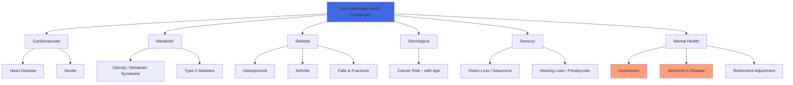
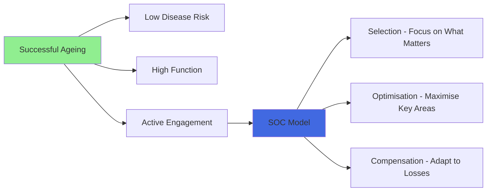

# Ageing Issues and Challenges in Late Adulthood

## Introduction

Late adulthood — generally considered to begin around age 65, though this boundary is increasingly fluid as people remain healthy and active longer — is the stage where the cumulative impact of decades of ageing becomes most visible. Yet it is also a stage that defies simple characterisation. Look at a group of 70-year-olds and you will find profound variation: some are vigorous, engaged, and sharp; others manage multiple chronic conditions; still others lie somewhere in between.

This variability is itself one of the most important things to understand about late adulthood: **as we age, we become less like each other, not more**. Our life experiences — habits, relationships, traumas, triumphs — accumulate to create increasingly unique health and wellbeing profiles.

This unit examines the major challenges of late adulthood systematically, covering physical health, mental wellbeing, and social circumstances, while also attending to the important distinction between normal ageing and disease, and the growing body of research on **successful ageing**.

:::info Source
📄 [MPC-002 Block-4/Unit-4.pdf - Pages 59-63](/pdfs/MPC-002%20Life%20Span%20Psychology/Block-4/Unit-4.pdf)  
📚 MPC-002 Life Span Psychology, IGNOU
:::

---

## The Diversity of Late Adulthood

Scientists and policymakers increasingly distinguish between **sub-stages** of late adulthood:

- **Young-old** (65-74): Most are relatively healthy and independent
- **Old-old** (75-84): Health challenges become more common; some require assistance
- **Oldest-old** (85+): The fastest-growing age group globally; highest rates of frailty, but also remarkable stories of resilience

This differentiation matters because stereotyping "the elderly" as uniformly frail ignores the enormous heterogeneity of this population. Importantly, **chronological age has little bearing on biological age** — the number of candles on a birthday cake says very little about one's actual health status.

---

## Physical Changes and Health Challenges

### Basic Physical Changes

The ageing body undergoes several fundamental changes:
- **Muscle and tissue elasticity declines** — blood vessels, skin, and other tissues lose their ability to stretch and rebound
- **Cardiac efficiency decreases** — the heart must work harder to maintain adequate circulation
- **Bones become weaker** — reduced density increases fracture risk
- **Metabolism slows** — caloric needs decrease, but nutritional needs remain high
- **Immune function declines** — slower, less accurate immune responses

### Skin Changes

The most visually apparent changes of ageing involve the skin:

**Wrinkles:** Collagen and elastin fibres — which give skin its firmness and elasticity — break down with age, a process accelerated by **UV radiation exposure** throughout life. Reduced subcutaneous fat makes the skin appear less supple, and gravity compounds this by causing sagging.

**Dry Skin:** Older adults produce less sweat and skin oil (sebum), leading to dryness. Excessively dry skin can accentuate the appearance of wrinkles.

**Age Spots (Liver Spots):** Dark, irregular patches — most common on hands, arms, face, and feet — result from cumulative sun exposure and the overproduction of melanin. Despite the name, they are unrelated to liver function.

:::tip
Sun protection throughout life is one of the most evidence-based strategies for slowing visible skin ageing. Broad-spectrum SPF 30+ sunscreen, shade, and protective clothing are the most effective interventions.
:::

### Major Health Conditions in Late Adulthood

Late adulthood is characterised by an increasing prevalence of **chronic conditions** — persistent, long-lasting diseases that typically require ongoing management rather than cure.

#### Obesity and Metabolic Syndrome

Prevalence of overweight and obesity increases through middle age and into early late adulthood. Obesity is strongly linked to:
- Type 2 diabetes
- Cardiovascular disease
- Breast and colorectal cancer
- Gallbladder disease
- High blood pressure (hypertension)
- Osteoarthritis (mechanical loading on joints)

**Gender Patterns:** Women in perimenopause and menopause tend to accumulate fat around the waist and hips; men tend toward abdominal fat accumulation. Both patterns increase cardiometabolic risk.

**Dietary Considerations:**
- Reduce calorie intake and alcohol (alcohol calories are readily converted to abdominal fat)
- Increase omega-3 fatty acids (found in fish, flaxseed, walnuts) and unsaturated fats
- Eliminate trans fats completely
- Avoid foods sweetened with high-fructose corn syrup (linked to metabolic syndrome)

#### Arthritis

Arthritis affects nearly **half of the elderly population** and is a leading cause of disability globally and in India. Two main types:

**Osteoarthritis (OA):** Wear-and-tear degeneration of joint cartilage, most common in knees, hips, and hands. Associated with prior sports injuries, obesity, and repetitive joint use.

**Rheumatoid Arthritis (RA):** An autoimmune condition that attacks joint tissue, more common in women.

*Prevention and management:*
- Maintain healthy weight (reduces load on joints)
- Regular, consistent, gentle exercise (not "weekend warrior" bursts)
- Stop if pain occurs — overuse worsens OA
- Early physiotherapy to maintain function

#### Osteoporosis and Falls

**Osteoporosis** — the progressive loss of bone density — affects the majority of adults over 50. The National Osteoporosis Association emphasises: osteoporosis is **not** an inevitable part of ageing. Healthy behaviours and, when appropriate, medical treatment can prevent or minimise it.

In India, osteoporosis is a major public health concern, exacerbated by:
- Widespread Vitamin D deficiency (despite abundant sunshine — clothing coverage and indoor lifestyles are factors)
- Calcium-poor diets in some populations
- Low physical activity in older adults

**Falls** — the leading cause of injury in older adults — are often precipitated by osteoporosis (fractures from minor impacts), combined with balance problems, medication effects, and environmental hazards. Hip fractures are particularly dangerous, with high rates of post-fracture mortality in the elderly.

*Prevention:*
- Weight-bearing exercise (walking, resistance training)
- Adequate calcium and Vitamin D intake
- Home safety modifications (grab bars, non-slip surfaces, good lighting)
- Regular medication reviews (many common drugs affect balance)

#### Cancer

Cancer risk increases progressively with age — a function of cumulative DNA damage, declining immune surveillance, and longer time for slow-growing tumours to become clinically significant.

**Gender-specific patterns:**
- *Women:* Cervical cancer risk decreases with age; endometrial and breast cancer risk increases
- *Men:* Prostate cancer risk increases substantially with age; Black men have higher rates than white men

**Key screening guidelines:**
- Breast cancer: Regular mammograms from age 40-50 (varies by guidelines and risk)
- Colon cancer: Colonoscopy starting at 50 (or earlier with family history)
- Prostate cancer: PSA testing discussion with physician from age 50 (or 40 for high-risk groups)
- Cervical cancer: Pap smears and HPV testing

**Lung cancer** remains the deadliest cancer type globally, causing more deaths than breast, prostate, and colorectal cancers combined.

#### Vision and Hearing Loss

**Vision:**
Age-related eye diseases are common from age 40 onwards:

| Condition | Characteristics |
|-----------|-----------------|
| **Macular Degeneration** | Central vision loss; antioxidant-rich diets may slow progression |
| **Cataract** | Clouding of the lens; highly treatable surgically |
| **Glaucoma** | Increased intraocular pressure damaging the optic nerve; called "the sneak thief of sight" because symptoms begin only after vision is lost — which cannot be restored |
| **Diabetic Retinopathy** | Blood vessel damage in the retina from long-term diabetes |

Regular eye examinations are essential for early detection, particularly for glaucoma.

**Hearing:**
Hearing loss increases dramatically with age. **Presbycusis** — age-related hearing loss — typically affects high-frequency sounds first (making speech comprehension in noisy environments particularly difficult).

Hearing loss has significant quality-of-life consequences:
- Depression and social withdrawal (people avoid situations where they can't follow conversation)
- Cognitive decline (emerging evidence suggests hearing loss is an independent risk factor for dementia)
- Relationship strain

Hearing aids can dramatically improve function, yet only 1 in 4 people who could benefit from them actually use them — citing cost, stigma, and discomfort as barriers.

---

## Mental Health in Late Adulthood

Mental health is profoundly important in late adulthood and significantly underattended. Two major concerns are depression and cognitive decline.

### Depression

**Depression is not a normal part of ageing** — yet it is frequently dismissed as such by older adults, families, and even healthcare providers. Late-life depression is common (affecting approximately 7% of adults over 60 globally) and is associated with:
- Chronic illness and pain
- Social isolation and bereavement
- Loss of independence and functional capacity
- Retirement and loss of occupational identity

**Retirement as a psychological transition:**
For many people, occupational identity is central to self-concept. Retirement therefore represents a profound identity disruption. Without careful psychological preparation, retirement can lead to:
- Loss of purpose and structure
- Social isolation (work was a primary source of social contact)
- Elevated depression rates
- In extreme cases, elevated suicide risk

Men are particularly vulnerable to retirement-related depression, especially if their identity was heavily invested in occupational achievement.

*Signs of late-life depression to watch for:*
- Persistent sadness, hopelessness, or emptiness
- Loss of interest in previously enjoyed activities
- Changes in sleep, appetite, and energy
- Withdrawal from social contact
- Unexplained physical symptoms (pain, fatigue)
- In older adults specifically: irritability, anxiety, cognitive complaints

### Cognitive Decline and Alzheimer's Disease

**Normal age-related cognitive changes** include:
- Slower processing speed
- Mildly slower recall (tip-of-the-tongue phenomenon more frequent)
- Reduced efficiency of multitasking

These changes are qualitatively different from dementia, which involves significant functional impairment.

**Alzheimer's Disease** is the most common form of dementia and represents one of the most significant health challenges of ageing populations globally. Key facts:
- Risk doubles approximately every 5 years after age 65
- Women have higher prevalence (partly due to longer life expectancy)
- Characterised by progressive loss of memory, language, orientation, and eventually basic function
- Currently no cure, though medications can slow progression in some patients
- Strong evidence that lifestyle factors (physical activity, cognitive engagement, social connection, Mediterranean diet, management of cardiovascular risk) can reduce risk

:::note Recent Research (2024)
A landmark 2024 study in *The Lancet* identified **14 modifiable risk factors** that together account for approximately 45% of dementia cases globally. These include: hypertension, physical inactivity, hearing loss (emerging risk factor), traumatic brain injury, air pollution, excessive alcohol, obesity, smoking, depression, social isolation, and low education. Addressing these factors represents the most evidence-based approach to dementia prevention currently available.

- **Source**: Livingston, G. et al. (2024). Dementia prevention, intervention, and care: 2024 report of the Lancet Standing Commission. *The Lancet*, 404(10452), 572-628.
:::

**Staying Mentally Active:**
Evidence supports the following for cognitive health in late adulthood:
- Regular aerobic exercise (most consistently protective)
- Intellectual engagement (learning new skills, reading, social discourse)
- Social connection
- Adequate sleep (the brain clears amyloid plaques during sleep)
- Management of cardiovascular risk factors

---

## Social Dimensions of Late Adulthood

### Elder Care

**Elder care** encompasses a broad range of services and support for older adults who have reduced capacity for independent living. This includes:
- Meals and socialisation programmes
- Personal care assistance (bathing, dressing, medication management)
- Light housekeeping
- Residential facilities (nursing homes, assisted living)
- Adult day care programmes
- Palliative and hospice care

In India, elder care has traditionally been provided within the family, consistent with the joint family system. However, demographic and social changes are creating new challenges:
- Smaller families have fewer potential caregivers
- Geographic mobility separates families
- Women (traditional caregivers) are increasingly in paid employment
- The population of oldest-old is growing faster than support systems

The **Maintenance and Welfare of Parents and Senior Citizens Act** (2007, amended 2019) mandates that adult children and relatives provide for the maintenance of senior citizens in India. The amendment also established state-run homes for seniors without adequate family support.

### Social Networks and Isolation

Social connection is one of the strongest predictors of health and longevity in old age. Conversely, **social isolation** is now recognised as a serious health risk — associated with:
- Elevated cortisol and inflammation
- Poorer cognitive function
- Higher rates of depression
- Increased mortality (comparable in impact to smoking 15 cigarettes daily, according to some research)

### Bereavement and Loss

Late adulthood involves confronting multiple losses:
- Death of spouse or partner (a profoundly disorienting loss)
- Death of lifelong friends and contemporaries
- Loss of familiar roles (worker, parent of dependent children, etc.)
- Loss of physical capacities

**Widowhood** — significantly more common for women (who outlive men on average) — requires major life reorganisation: financial management, independent housing, new social identity. Bereavement support and social integration are critical for widowed older adults.

---

## Successful Ageing

The concept of **successful ageing** has transformed gerontological research since Rowe and Kahn introduced the framework in 1987. Rather than focusing exclusively on what goes wrong, researchers now ask: what characterises those who age well?

**Rowe and Kahn's Model of Successful Ageing:**
1. **Low risk of disease and disability** — absence of major disease and risk factors
2. **High cognitive and physical function** — maintaining abilities
3. **Active engagement with life** — social relationships and productive activities

**Baltes and Baltes' SOC Model (Selection, Optimisation, Compensation):**
Successful ageing involves:
- **Selection:** Narrowing goals and activities to those most valued (accepting reduced scope)
- **Optimisation:** Putting effort and resources into maintaining the most important domains
- **Compensation:** Using strategies, technology, or assistance to maintain function when direct capacity declines

**Wisdom and Post-formal Development:**
Many elderly adults demonstrate a form of **practical wisdom** (what the ancient Greeks called *phronesis*) — the ability to navigate complex, ambiguous life situations with equanimity and insight. This wisdom, developed over decades of experience, is a genuine developmental gain of late adulthood.

---

## The Indian Context: Ageing in a Transitioning Society

India is experiencing a **demographic transition** — a rapidly growing older population intersecting with changing family structures, urbanisation, and economic development:

- India had approximately 140 million people over 60 in 2021; this is projected to double by 2050
- The **National Policy on Older Persons** (1999) and subsequent programmes aim to ensure health, social protection, and dignity for older Indians
- **Ayurvedic traditions** offer rich frameworks for healthy ageing, with emphasis on *rasayana* (rejuvenation therapies), balanced diet (sattvic food), yoga, and meditation
- Spirituality remains a significant resource for many Indian older adults — association with religious practice, pilgrimage, and devotional activities provides meaning, community, and even cognitive stimulation
- Traditional respect for elders (*Pitru Paksha* rituals, the concept of *seva* or service to elders) provides important psychological benefits to older adults in contexts where these are maintained

---

## Memory Aids

**For Late Adulthood Health Issues:**
**COACH MAC** = Cancer, Osteoporosis, Arthritis, Cognitive decline, Heart disease, Metabolic syndrome, Alzheimer's, Cataracts

**For Successful Ageing:**
**SOC** = Selection, Optimisation, Compensation (Baltes & Baltes model)

**For Warning Signs of Late-Life Depression:**
**SHESWA** = Sadness, Hopelessness, Energy loss, Social withdrawal, Sleep changes, Weight/appetite changes, Anhedonia (loss of pleasure)

---

## Self-Assessment Questions

1. Explain why late adulthood is characterised by *increasing* diversity rather than greater similarity among age peers. What factors contribute to this divergence?

2. Distinguish between normal age-related cognitive decline and Alzheimer's disease. What are the key differences in presentation and progression?

3. Critically evaluate the statement that "depression is a natural consequence of old age." What does research tell us about the prevalence, causes, and treatability of late-life depression?

4. What is the "successful ageing" model proposed by Rowe and Kahn? What are its strengths and what critiques have been raised about it?

5. Describe the impact of retirement on psychological health. What individual and social factors determine whether retirement is experienced as positive or negative?

6. How does the provision of elder care differ between traditional Indian joint family structures and contemporary nuclear family arrangements? What challenges arise from this transition?

---

## External Resources

### Wikipedia Articles
- [Successful Ageing](https://en.wikipedia.org/wiki/Successful_ageing) — theoretical frameworks
- [Alzheimer's Disease](https://en.wikipedia.org/wiki/Alzheimer%27s_disease) — comprehensive overview
- [Presbycusis](https://en.wikipedia.org/wiki/Presbycusis) — age-related hearing loss
- [Osteoporosis](https://en.wikipedia.org/wiki/Osteoporosis) — bone disease overview
- [Elder Care](https://en.wikipedia.org/wiki/Elder_care) — types and global perspectives

### Educational Videos
- 🎥 [Aging Gracefully - National Geographic](https://www.youtube.com/watch?v=GbcqBw7bF5o) — documentary on longevity
- 🎥 [What Makes a Good Life? - Robert Waldinger TED Talk](https://www.ted.com/talks/robert_waldinger_what_makes_a_good_life_lessons_from_the_longest_study_on_happiness) — Harvard Study of Adult Development
- 🎥 [Dementia Prevention - Lancet Commission 2024](https://www.youtube.com/results?search_query=lancet+dementia+2024+modifiable+risk+factors) — latest evidence

### Research Papers (2020-2024)
- Livingston, G. et al. (2024). Dementia prevention, intervention, and care: 2024 report of the Lancet Standing Commission. *The Lancet*, 404(10452), 572-628.
- Steptoe, A. & Fancourt, D. (2023). Social isolation and health in old age. *Annual Review of Public Health*, 44, 175-192.
- Rowe, J.W. & Kahn, R.L. (2022). Successful Aging 2.0: Conceptual expansions for the 21st century. *Journals of Gerontology: Psychological Sciences*, 77(6), 1174-1184.

### Additional Reading
- [WHO - Ageing and Health Fact Sheet](https://www.who.int/news-room/fact-sheets/detail/ageing-and-health)
- [Alzheimer's Association](https://www.alz.org/) — comprehensive patient and professional resources
- [National Programme for Health Care of the Elderly, India](https://nhm.gov.in/index4.php?lang=1&level=0&linkid=423&lid=344)
- [HelpAge India](https://www.helpageindia.org/) — Indian NGO focused on elder welfare

---

## Cross-References

- Related: [Ageing Process and Gender Differences](/mpc-002/block-4/ageing-process-gender-differences)
- Related: [Ageing Issues in Early and Middle Adulthood](/mpc-002/block-4/ageing-issues-early-middle-adulthood)
- Related: [Cognitive Changes in Old Age](/mpc-002/block-4/cognitive-changes-old-age)
- Related: [Psychosocial Changes in Old Age](/mpc-002/block-4/psychosocial-changes-old-age)
- Related: [Physical Changes in Old Age](/mpc-002/block-4/physical-changes-old-age)

---

**Source PDFs**:
- 📄 [Block-4/Unit-4.pdf - Pages 59-63](/pdfs/MPC-002%20Life%20Span%20Psychology/Block-4/Unit-4.pdf)
- 📚 MPC-002 Life Span Psychology, IGNOU
