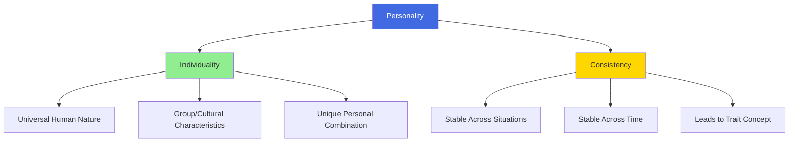
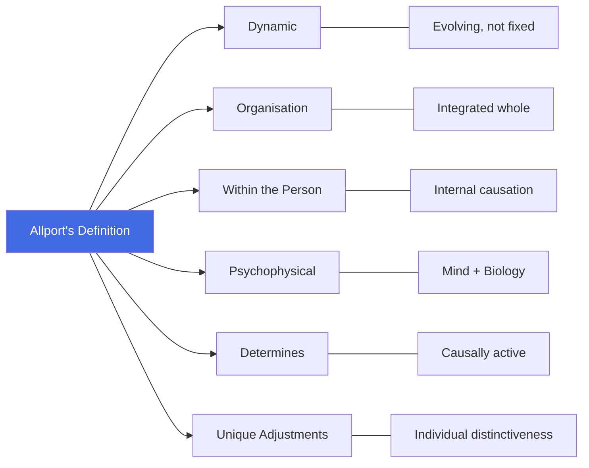

# Definition and Concept of Personality

## Introduction

What do we mean when we say someone has a "great personality"? In everyday conversation, we often mean they are charming, attractive, socially skilled, or impressive to meet. But this lay understanding is fundamentally different from how psychologists define personality — and understanding this difference is the first step toward the scientific study of personality psychology.

MPC-003 (Personality: Theories and Assessment) is a foundational course that explores how psychologists have attempted to understand the most complex object in the known universe: the human person. This first unit lays the groundwork by asking: *What is personality?* and *How does it develop?*

:::info Source
📄 [MPC-003 Block-1/Unit-1.pdf - Pages 5-8](/pdfs/MPC-003%20Personality%20Theories%20and%20Assessment/Block-1/Unit-1.pdf)  
📚 MPC-003 Personality: Theories and Assessment, IGNOU
:::

---

## Why the Common Understanding of Personality Falls Short

The everyday understanding of personality as "social attractiveness" is scientifically inadequate for two important reasons identified by psychologists:

1. **It limits scope:** Defining personality as social appeal restricts which behaviours are considered worth studying. It privileges extroversion, charm, and appearance — leaving out vast domains of personality like temperament, cognitive styles, emotional patterns, and unconscious motivations.

2. **It implies some people lack personality:** If personality = attractiveness, then those who are introverted, disabled, or unattractive would be said to "have no personality" — a clearly absurd conclusion. Every human being has a personality, regardless of how it appears to others.

:::tip Exam Focus
A common exam question asks you to identify *why* defining personality in terms of social attractiveness is scientifically inadequate. The two reasons above — limiting scope and implying personality-less people — are the standard IGNOU answer.
:::

---

## The Scientific Concept of Personality

Psychologists have converged on two essential concepts in defining personality: **individuality** and **consistency**.

### Individuality

Each person is simultaneously:
- Like **all** other persons (we share human nature — language, emotion, basic needs)
- Like **some** other persons (we share cultural, familial, or group characteristics)
- Like **no** other person who has ever existed or will exist (we each have a unique combination of traits)

This observation, articulated by Kluckhohn and Murray (1953), captures the fundamental paradox of human personality: we are deeply social and shared creatures who are simultaneously irreducibly unique. The study of personality attempts to understand both dimensions — the universal and the particular.

### Consistency

Personality is not simply *how* someone behaves in one situation — it is how they *consistently* behave across situations and over time. If someone is cheerful with their family but hostile in every other context, we would not say cheerfulness is a personality trait. But if they consistently display warmth across contexts — with friends, at work, with strangers — we would say warmth is part of their personality.

This observation of consistency leads directly to the concept of **personality traits**: stable, enduring dispositions that shape how a person responds to their environment.

### The Composite Definition

Combining individuality and consistency, personality can be defined as:

> **"The distinctive and unique ways in which each individual thinks, feels and acts, which characterise a person's response throughout life."**

Or equivalently: **Personality refers to all those relatively permanent traits, dispositions or characteristics within the person that give some measure of consistency to the person's behaviour.**

These traits may be:
- **Unique** to an individual (idiosyncratic patterns)
- **Common** to some groups (cultural, familial, occupational)
- **Shared** by all humans (species-level traits)

But their *pattern* and *combination* will be different for every individual — creating the irreducible uniqueness of each person.

---

## Three Characteristics of Personality-Reflecting Behaviours

Not every behaviour reflects personality. Behaviours are considered to reflect personality when they have three specific characteristics:

| Characteristic | Description |
|----------------|-------------|
| **Behavioural Identity** | They distinguish the individual — they mark what makes this person *this* person rather than someone else |
| **Internal Causation** | They are primarily caused by internal factors (traits, motives, values) rather than situational pressures |
| **Organisation and Structure** | They fit together in a coherent, meaningful pattern — they are not random but systematic |

This third characteristic is especially important: personality behaviours form an integrated whole. A kind person doesn't just act kindly sometimes — their kindness is woven through how they think, what they value, how they communicate, and what they notice in the world.

Importantly, this organisation is **dynamic** — it can and does change over time. Personality is not a fixed, static entity but a living, evolving system of responses to an ever-changing environment.

---

## Allport's Classic Definition

The most celebrated and enduring definition in personality psychology was offered by **Gordon Allport** (1937, 1961):

> *"Personality is the dynamic organisation within the person of those psychophysical systems that determine the unique adjustments to one's environment."*

This definition deserves careful unpacking — each word carries weight:

- **Dynamic**: Personality is not fixed; it is an evolving, active process
- **Organisation**: Personality elements are integrated into a coherent whole — not a random collection of traits
- **Within the person**: Personality is internal — it guides behaviour from inside, not from external pressures
- **Psychophysical**: Personality involves both psychological (mind, motivation, cognition) and physical (biological, neurological) systems — it is embodied
- **Determine**: Personality is causally active — it actually *produces* and *shapes* behaviour
- **Unique adjustments**: Every person's way of adapting to their environment is distinctive and cannot be fully replicated

Allport is considered the father of personality psychology as a scientific discipline. Before his foundational work, personality was primarily the domain of philosophy and clinical observation. He conducted a systematic analysis of 50 definitions of personality before offering his own — an exercise that itself models the scientific rigour he brought to the field.

---

## Personality, Character, and Temperament: Key Distinctions

Personality must be distinguished from two related but different concepts:

### Character
**Character** refers to **value judgements** made about a person's moral values or ethical behaviour. When we say someone has "good character," we are evaluating them morally — their honesty, integrity, courage, or compassion. Character is fundamentally an evaluative concept, while personality is descriptive.

### Temperament
**Temperament** refers to **inborn, enduring characteristics** of emotional reactivity — such as:
- Adaptability (how quickly one adjusts to change)
- Irritability (threshold for frustration and anger)
- Activity level (intrinsic energy and pace)
- Sociability (natural orientation toward or away from social stimulation)

Temperament is largely biologically based and is present from birth. You can observe temperamental differences in newborns before any socialisation has occurred. Research by Thomas and Chess (1977) identified nine temperament dimensions, and their classification of "easy," "difficult," and "slow-to-warm-up" temperamental types remains influential.

:::note Key Distinction
**Temperament** = the *how* of behaviour (the biological style)  
**Character** = the *worth* of behaviour (the moral evaluation)  
**Personality** = the *whole* integrated system — including temperament, character, and much more
:::

Both character and temperament are **vital parts of personality**, but personality is the broader, encompassing construct.

---

## Allport's Historical Contribution

Allport's 1937 book *Personality: A Psychological Interpretation* is widely considered the founding text of scientific personality psychology. His contributions include:

- Distinguishing personality psychology from abnormal psychology (most early work focused on pathology)
- Introducing the concept of the **proprium** — the self-as-known, the experienced sense of self
- Developing the **trait theory** approach (discussed in later units)
- Emphasising **idiographic** methods — studying the individual in depth — alongside nomothetic (group comparison) methods
- Arguing that personality must be understood both scientifically and humanistically

Allport was notably resistant to purely reductionist accounts of personality. He insisted that the whole person could not be understood by summing their parts — an insight that aligns with modern systems perspectives on personality.

---

## Contemporary Perspectives on Personality

Modern personality psychology has expanded enormously beyond Allport's foundations. Key developments include:

**The Big Five / OCEAN Model:** The most empirically supported personality taxonomy today, identifying five broad factors: Openness to Experience, Conscientiousness, Extraversion, Agreeableness, and Neuroticism. These emerge consistently across cultures, ages, and measurement methods.

**Neuroscience of Personality:** Research has linked personality traits to specific brain structures and neurochemistry. For example, extraversion is associated with dopamine sensitivity; neuroticism with amygdala reactivity.

**Cultural Psychology of Personality:** Research increasingly shows that personality — while having universal features — is also deeply shaped by cultural context. Individualism vs. collectivism, for instance, shapes how personality expresses itself and is valued.

:::note Recent Research (2023)
A 2023 study in *Nature Human Behaviour* by Soto et al. tracked personality across 63 countries and found that while the Big Five structure is universal, **mean trait levels differ substantially across cultures** — raising important questions about what "personality" means across different social contexts.

- **Source**: Soto, C.J. et al. (2023). Big Five personality traits across cultures. *Nature Human Behaviour*, 7, 457-469.
:::

---

## The Indian Perspective on Personality

Indian psychological traditions offer rich frameworks for understanding personality that predate Western psychology by millennia:

**The Gunas (Triguna Theory):** The *Samkhya* and *Ayurvedic* traditions classify personality according to three fundamental qualities:
- **Tamas** (inertia, darkness, lethargy)
- **Rajas** (activity, passion, restlessness)
- **Sattva** (clarity, harmony, wisdom)

Every person contains all three gunas in different proportions, and this proportion shapes their personality, cognitive style, and moral character.

**Panchakosha Model:** The *Taittiriya Upanishad* describes personality as layered — from the gross physical body (*annamaya kosha*) through vital energy (*pranamaya*), mind (*manomaya*), intelligence (*vijnanamaya*), to the deepest bliss-consciousness (*anandamaya kosha*). This holistic, multilayered model anticipates modern integrative approaches.

These indigenous frameworks are increasingly being integrated with mainstream personality psychology in the emerging field of **Indian Psychology** — a movement to recover and systematise India's vast psychological heritage.

---

## Memory Aids

**ALLPORT's Definition keywords:**  
**DOPWUD** = Dynamic, Organisation, Psychophysical, Within the person, Unique, Determines

**Personality vs Character vs Temperament:**  
**P-C-T rule:**  
- **P**ersonality = the whole integrated **P**attern  
- **C**haracter = **C**onduct evaluated morally  
- **T**emperament = biological **T**emperament from birth

**Three characteristics of personality behaviours:**  
**BIO** = Behavioural identity | Internal causation | Organisation

---

## Self-Assessment Questions

1. Why is defining personality in terms of social attractiveness considered scientifically inadequate? Give two specific reasons.

2. Explain the concepts of **individuality** and **consistency** as foundations of the personality concept. How do they combine to define personality?

3. Analyse Allport's definition of personality word by word. What does each key term contribute to the overall meaning?

4. Distinguish between personality, character, and temperament. Provide an example of each.

5. What three characteristics must a behaviour have to be considered a reflection of personality? Explain each with examples.

6. How does the Indian Triguna theory of personality compare to Western trait theories? What does each emphasise?

---

## External Resources

### Wikipedia Articles
- [Personality psychology](https://en.wikipedia.org/wiki/Personality_psychology) — comprehensive overview of the field
- [Gordon Allport](https://en.wikipedia.org/wiki/Gordon_Allport) — biography and contributions
- [Temperament](https://en.wikipedia.org/wiki/Temperament) — biological bases of personality styles
- [Big Five personality traits](https://en.wikipedia.org/wiki/Big_Five_personality_traits) — dominant modern taxonomy

### Educational Videos
- 🎥 [Personality Psychology - CrashCourse Psychology #22](https://www.youtube.com/watch?v=OfmHFYfMxqY) — accessible introduction
- 🎥 [Gordon Allport's Trait Theory - Explained](https://www.youtube.com/watch?v=iqUsqiEKbWo) — overview of Allport's contributions
- 🎥 [What is Personality? - Khan Academy](https://www.khanacademy.org/test-prep/mcat/behavior/personality-in-psychology/a/what-is-personality) — foundational introduction

### Research Papers (2020-2024)
- Soto, C.J. et al. (2023). Big Five personality traits across cultures. *Nature Human Behaviour*, 7, 457-469.
- DeYoung, C.G. (2022). Personality neuroscience: A developmental perspective. *Personality Neuroscience*, 5, e3.
- Roberts, B.W. & Nickel, L.B. (2021). A critical evaluation of the neo-socioanalytic model of personality. *Personality and Individual Differences*, 169, 110009.

### Additional Reading
- [APA - Personality](https://www.apa.org/topics/personality) — American Psychological Association overview
- [Gordon Allport's Personality: A Psychological Interpretation (summary)](https://www.simplypsychology.org/gordon-allport.html)
- [Indian Psychology - Overview](https://www.ipi.org.in) — Indian Psychology Institute resources

---

## Cross-References

- Next: [Personality Development: Determinants and Factors](/mpc-003/block-1/personality-development-determinants)
- Related: [MPC-001 - Individual Differences in Cognition](/mpc-001/block-2/nature-intelligence-definitions)

---

**Source PDFs**:
- 📄 [Block-1/Unit-1.pdf - Pages 5-8](/pdfs/MPC-003%20Personality%20Theories%20and%20Assessment/Block-1/Unit-1.pdf)
- 📚 MPC-003 Personality: Theories and Assessment, IGNOU
