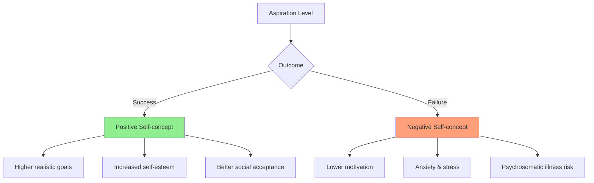

# Personality Development: Biological, Psychological, and Environmental Determinants

## Introduction

Personality does not emerge from a vacuum — it develops through a complex, ongoing interaction between our biology, our inner psychological life, and our social and physical environment. Understanding *how* personality develops is as important as understanding *what* personality is.

This unit systematically examines the three major categories of determinants that shape personality development. The classic IGNOU formulation captures this beautifully:

**Personality Development = Physical × Psychological × Environmental**

Note that this is a **multiplicative** formula, not additive. This means the factors interact — none operates independently. A child with excellent biological foundations but a toxic home environment will develop differently than one with the same biology in a nurturing home. The whole is shaped by all three sets of factors together.

:::info Source
📄 [MPC-003 Block-1/Unit-1.pdf - Pages 8-19](/pdfs/MPC-003%20Personality%20Theories%20and%20Assessment/Block-1/Unit-1.pdf)  
📚 MPC-003 Personality: Theories and Assessment, IGNOU
:::

---

## Overview: Three Sets of Determinants

```mermaid
graph TD
    PD[Personality Development] --> BF[1. Biological Factors]
    PD --> PSF[2. Psychological Factors]
    PD --> EF[3. Environmental Factors]
    
    BF --> B1[Body Build]
    BF --> B2[Physical Attractiveness]
    BF --> B3[Homeostasis]
    BF --> B4[Physical Defects]
    BF --> B5[Health Conditions]
    
    PSF --> P1[Intellectual Factors]
    PSF --> P2[Emotional Factors]
    PSF --> P3[Self-Disclosure]
    PSF --> P4[Aspiration & Achievement]
    PSF --> P5[Goal Setting]
    
    EF --> E1[Social Acceptance]
    EF --> E2[Social Deprivation]
    EF --> E3[Educational Factors]
    EF --> E4[Family Determinants]
    EF --> E5[Home Climate & Ordinal Position]
    EF --> E6[Family Size]
    
    style PD fill:#4169E1,color:#fff
    style BF fill:#FF6B6B
    style PSF fill:#4ECDC4
    style EF fill:#95E1D3
```

---

## 1. Biological (Physical) Determinants

Biological determinants — sometimes called physical determinants — emphasise that bodily structure and functioning directly shape personality. These are not simply background conditions but active shapers of how we experience ourselves and how others respond to us.

### 1.1 Body Build

William Sheldon (1940s) famously proposed a typology of body builds (*somatotypes*) linked to personality, a classification that IGNOU adopts:

| Somatotype | Description | Characteristic Tendencies |
|------------|-------------|--------------------------|
| **Ectomorph** | Tall, thin, lean | Superior in speed and endurance; tends toward introversion (in Sheldon's original theory) |
| **Endomorph** | Round, soft, heavy | Social, relaxed; less speed/endurance than ectomorphs |
| **Mesomorph** | Muscular, strong, athletic | Superior in speed, endurance, and agility; assertive, active |

Body build influences personality through two pathways:

**Direct pathway:** Physical structure determines what activities a person can do well. A mesomorphic child excels at sports, earning praise and status. An ectomorphic child may excel at dance or endurance events but struggle in strength sports. These experiential outcomes shape self-concept.

**Indirect pathway:** Body build affects how others respond to us, which shapes our self-concept. If your body build is socially prized (muscular in a sports-oriented culture), social feedback is positive, contributing to a favourable self-concept. If your build is stigmatised (obese in a thin-obsessed culture), social feedback may be negative, damaging self-concept.

:::note Critical Evaluation
Sheldon's somatotype theory is now considered oversimplified and largely discredited. Research found that his correlations between body type and personality were weak and methodologically flawed. However, the underlying insight — that physical characteristics influence personality through social feedback and lived experience — remains valid and important.
:::

### 1.2 Physical Attractiveness

Attractiveness is one of the most powerful social influences on development — not because beauty creates personality, but because **others respond differently to attractive vs. unattractive individuals**, and these differential responses cumulatively shape personality.

Research findings (Brislin & Lewis, 1968, among many others) consistently show:
- Attractive children are judged less harshly for misbehaviour ("pretty privilege")
- Attractive workers are more likely to be promoted, even when less competent
- Attractive individuals receive more social approach, warmth, and opportunity

Through repeated exposure to these differential responses, attractive individuals tend to develop:
- Greater social confidence
- More positive self-concept
- Greater ease in social situations

While unattractive individuals may develop compensatory traits (greater reliance on intelligence, humour, or competence), or may internalise negative social messages, depending on other protective factors.

### 1.3 Homeostasis

**Homeostasis** refers to the maintenance of a stable internal environment — normal body temperature, blood sugar, blood pressure, oxygen levels, water balance, and so on. When homeostatic balance is disrupted, both behaviour and personality development are affected.

**Direct effects of homeostatic disturbance:**
- Disturbed blood sugar → depressive mental states
- Severe Vitamin B complex deficiency → heightened emotionality and depression
- High blood pressure → neuroticism (personality trait characterised by emotional instability)
- Anoxia (reduced oxygen, as in asthma) → emotional outbursts, mental confusion, self-criticism

**Indirect effects:**
Homeostatic disturbances affect personality indirectly through how the person *interprets* others' reactions to their physical condition. For example, a person who is abnormally large (perhaps due to hormonal excess) will respond very differently depending on whether others view this size admiringly or dismissively. The social meaning of the physical condition matters as much as the condition itself.

### 1.4 Physical Defects

Alfred Adler's theory of **organ inferiority** (the first scientific framework examining physical defects and personality) proposed that people with physical deficiencies or inferiorities develop compensatory strivings — often overachieving in other areas to compensate.

Obesity is highlighted as a particularly significant physical defect in terms of personality impact:
- Creates direct social handicap (difficulty keeping pace with peers in physical activities)
- Creates indirect effects through awareness of others' negative attitudes → feelings of inferiority and social scorn
- Severely obese individuals may develop increased psychological disturbance due to cumulative adverse feedback

### 1.5 Health Conditions

Good health is a **personality asset**; poor health is a **personality liability**. This relationship operates across all ages and both sexes.

Key findings:
- Illness during childhood (when personality is in formative stages) can produce lasting personality changes even after the illness resolves
- Chronic illness (e.g., diabetes) causes frustration in meeting social demands → aggression → poor social adjustment
- Female irregular menstrual cycles can cause emotional instability, irritability, depression → poor social adjustment and negative self-concept

The crucial insight is that it is not only the illness itself that shapes personality, but the **psychological and social responses** to illness — how the person and others interpret, respond to, and adapt to health conditions.

---

## 2. Psychological Determinants

Beyond biology, several internal psychological factors powerfully shape the trajectory of personality development.

### 2.1 Intellectual Determinants (Intelligence)

Intellectual capacity shapes personality development through two channels:
1. **Direct:** How well one can make personal and social adjustments
2. **Indirect:** How others evaluate and respond to one's intellectual performance

**Average intelligence:** Generally associated with good personal and social adjustment; individuals can navigate social demands effectively.

**Above-average intelligence:** Associated with broader interests (theoretical and aesthetic domains), introspection, creativity, adventurousness, and strong concern with meaning and values. Such individuals typically have better self-control.

**Markedly superior intelligence (very high IQ):** Paradoxically, exceptional intelligence can *impair* personality development in some ways by creating social problems not encountered by merely bright individuals. Exceptional intellectual gifts can lead to:
- Negativism and intolerance (impatience with others' slower thinking)
- Habits of chicanery (using intelligence to manipulate)
- Emotional conflicts (alienation from peers)
- Solitary pursuits
- Self-sufficiency bordering on arrogance
- Dominance

This is a reminder that intellectual ability is not the same as wisdom or social-emotional maturity.

### 2.2 Emotional Determinants

Emotions are fundamental personality determinants because they so profoundly shape adjustment. Key emotional factors include:

**Dominant emotions:** Some people predominantly experience pleasant emotions (joy, curiosity, love); others predominantly experience unpleasant emotions (fear, anger, envy). This emotional orientation fundamentally colours personality — cheerful people see the bright side even in difficulty; apprehensive people feel depressed even in happy situations.

**Emotional balance:** The condition in which pleasant emotions outweigh unpleasant ones — considered essential to good personal and social adjustment.

**Emotional deprivation:** Being deprived of love, happiness, and positive emotional experiences has lasting personality consequences. It leads to:
- Poor personal and social adjustment
- Emotional insecurity
- Adolescent and adult rebellion against authority (stemming from insecure early attachment)

The impact of emotional deprivation depends on:
- Extent and duration of deprivation
- Age at which it occurs (earlier deprivation is generally more damaging)

**Emotional expression:** How one expresses emotions affects personality through social feedback. Socially appropriate emotional expression creates positive social responses and a good "mirror image" of self. Repression of emotions (anger, fear, jealousy) leads to gloominess, morbidity, and ultimately poor adjustment.

**Emotional catharsis:** The release of pent-up emotions restores homeostasis, allowing more realistic self-evaluation and better adjustment. Healthy outlets for emotional expression — conversation, creative activity, physical exercise — are essential for personality health.

**Emotional stress:** Chronic states of anxiety, frustration, jealousy, and envy impair adjustment. People with low self-esteem are more adversely affected by emotional stress than those with high self-esteem. Intense, unmanaged emotional stress can produce:
- Psychosomatic illness
- Defeatist attitude
- Belief in one's own inadequacy

### 2.3 Excessive Love and Affection

While emotional deprivation harms personality, the opposite extreme is also damaging. Freud cautioned that excessive parental love "awakens a disposition for neurotic disorders." Strecker (1956) showed that **overprotective mothers** (excessive mothering) produce immature, dependent adults.

Healthy personality development requires a *balance* — adequate emotional warmth and security, combined with appropriate autonomy and the opportunity to face challenges and develop competence.

This is consistent with modern attachment research: **secure attachment** (warm but not smothering) produces the most adaptive personality outcomes.

### 2.4 Self-Disclosure

**Self-disclosure** — the ability and willingness to share one's inner thoughts, feelings, and experiences with others — is considered basic to mental health. Sidney Jourard's research showed that healthy self-disclosure:
- Promotes authentic relationships
- Creates a positive social mirror (others respond favourably to openness)
- Contributes to healthy personality patterns
- Allows for psychological relief and processing

Importantly, self-disclosure must be appropriately calibrated to the relationship and context — oversharing with strangers can be as problematic as chronic self-concealment.

### 2.5 Aspiration, Achievement, and Goal Setting

These three interconnected factors are among the most powerful psychological determinants of personality:

**Aspiration** = longing for and striving toward something higher than one's current status. Types:
- Positive (approach success) vs. Negative (avoid failure)
- Realistic vs. Unrealistic
- Remote vs. Immediate

Remote, realistic, positive aspirations provide the strongest motivating forces. Negative aspirations are weaker motivators than positive ones.

**Level of aspiration:** The gap between what one has achieved and what one hopes to achieve. When this gap is large and the person fails to bridge it, self-concept is severely damaged — not only through one's own self-judgment but through the judgments of others who observed the gap.

**Achievement:** Evaluated both objectively (compared to peers) and subjectively (compared to one's own aspirations). Success and failure are subjective interpretations of achievement outcomes.

**Effects of Success:**
- Builds favourable self-concept and positive self-image
- Raises self-esteem and self-confidence
- Makes goal-setting more realistic
- Enhances social acceptance → further strengthens self-concept
- *Caveat:* Extraordinary early success can sometimes weaken motivation or arouse jealousy in others

**Effects of Failure:**
- Ego-deflating and self-confidence undermining
- Gradually destroys belief in one's own capability
- Weakens achievement motivation even for achievable goals
- Severe, repeated failure produces stress, anxiety, and psychosomatic illness
- Most damaging aspect: not achieving goals when others who competed did

---

## 3. Environmental Determinants

Even with identical biology and psychological makeup, individuals raised in different environments develop very different personalities. Environmental factors exert powerful and lasting influence throughout development.

### 3.1 Social Acceptance

Every individual exists within social groups that evaluate behaviour according to group norms — regarding conformity, role performance, and appropriate behaviour. This social judgment becomes the basis for self-evaluation. The social group thus shapes self-concept and personality.

**Two key conditions** determine how much social acceptance influences personality:
1. **Security in social status:** The more secure one feels in their group position, the less susceptible to social influence
2. **Importance attached to social acceptance:** Those who value group acceptance highly are more influenced by it

**Effects of high social acceptance:**
- More outgoing, flexible, active, and daring behaviour
- But sometimes superficial — difficulty forming deep, close relationships
- Risk of aloofness stemming from a sense of superiority

**Social isolation** (the opposite extreme):
- Creates feelings of rejection and resentment
- Produces depression, sadness, unhappiness
- May lead to antisocial or delinquent personality patterns in the long run
- Early unfavourable social experiences → unsocial or antisocial personality development

### 3.2 Social Deprivation

**Social deprivation** means being deprived of opportunities for social contact, love, and affection. It causes social isolation, which severely impacts personality. Two age groups are most vulnerable:

**Very young children:** Deprivation of parental/guardian contact prevents healthy, normal personality development. Harlow's famous research with rhesus monkeys (who developed profoundly disturbed personalities without maternal contact) dramatically illustrates this principle.

**Elderly people:** Social deprivation makes them self-bound and selfish, leading to unfavourable social and self-judgements. *Crucially*, voluntary withdrawal (the elderly person's own choice) produces far less personality damage than involuntary withdrawal. Choice and agency are essential.

Extended, prolonged social deprivation → unhealthy social attitudes and mental illness.

### 3.3 Educational Factors

Schools, colleges, and teachers have significant and lasting impacts on personality development. The influence operates through:

**Attitude toward education:** When students enjoy learning and have warm relationships with teachers and peers, education builds self-confidence and self-esteem. Negative attitudes produce the reverse.

**Emotional climate of institution:** The social-emotional atmosphere of a school directly affects student motivation, behaviour, and ultimately self-evaluation. Schools that are warm, stimulating, and respectful produce different personalities than those that are harsh, competitive, and humiliating.

**Student-teacher relationship:** A warm, friendly teacher relationship dramatically improves academic achievement and self-concept. A hostile, punitive, or rejecting teacher relationship depresses achievement and damages self-esteem. The teacher functions as a significant adult authority figure whose evaluation matters enormously to developing children.

### 3.4 Family Determinants

The family is the single most powerful environmental determinant of personality. Family influence operates throughout all ages, shaping personality both directly and indirectly.

**Direct influence:**
- Child-rearing methods (authoritative, authoritarian, permissive, neglectful) directly shape personality patterns
- Transmission of attitudes, interests, and values through explicit instruction

**Indirect influence (through identification and imitation):**
- Children identify with parents and develop similar personality patterns
- Anxious, nervous parents produce anxious children
- Warm, affectionate, loving parents produce socially gregarious, caring children

**Parenting style effects:**
- **Strict, demanding, punitive parents:** Children rely on external controls → become impulsive when out of parental sight
- **Warm, supportive parents:** Children develop internal control, social interest, and secure attachment

### 3.5 Emotional Climate of Home and Ordinal Position

The **emotional climate at home** is a crucial personality determinant:
- Favourable home climate → calm responses to frustration, tolerant interactions with people
- Conflict-ridden, friction-filled home climate → hostility, aggression, poor interpersonal relationships

**Ordinal Position** (birth order) effects on personality, as revealed by research:

| Position | Personality Characteristics |
|----------|---------------------------|
| **Firstborn** | More conforming, dependent, affiliative; susceptible to group pressure; more introverted; more selfish/self-centred after achievement; persistent sense of insecurity (from sibling displacement) |
| **Lastborn** | Dependent, affiliative needs; lacks self-confidence; low frustration tolerance; defies authority; relatively weak achievement motivation (family invests less as children accumulate) |
| **Middle/Second-born** | Less family-oriented, more peer-oriented; develops strong peer relationship skills; more popular among peers; better personal and social adjustment overall |

Frank Sulloway's influential book *Born to Rebel* (1996) presented extensive historical evidence for these birth order patterns, arguing that firstborns identify with parents and authority, while laterborns develop openness, creativity, and rebelliousness as evolutionary strategies to find their niche in the family system.

### 3.6 Family Size

**Large families:**
- Children learn independence and mature earlier (less parental protection available)
- But: authoritarian parenting style (common in large families for manageability) produces resentment and rebellion
- Less individual attention per child

**Small families:**
- Parents have more time for each child → self-confidence, self-assurance, guidance
- But: intense competition for parental attention → jealousy and envy (especially targeting the firstborn)

No family size is ideally optimal — each brings advantages and disadvantages.

---

## The Interaction of All Three Sets

The IGNOU formula — **Personality Development = Physical × Psychological × Environmental** — is not merely descriptive but captures an important truth: these determinants interact multiplicatively.

**Watson's behaviourist extreme** (only environment matters) is now thoroughly rejected. His famous claim that he could make any child a doctor, beggar, engineer, or thief regardless of their abilities ignores the powerful biological and psychological constraints on development.

**Modern consensus:** Biological factors set a **boundary range** for personality development — they define what is possible. Within that range, psychological and environmental factors determine what actually develops. The result is the complex, unique personality of each individual.

This interactionist view is supported by decades of behaviour genetics research, showing that personality traits are approximately **40-60% heritable** — meaning roughly half the variation in personality is explained by genetic factors, and roughly half by environmental factors. No single determinant fully explains personality.

---

## Memory Aids

**For Biological Factors:**  
**BAPHH** = Body build, Attractiveness, Physical defects, Homeostasis, Health conditions

**For Psychological Factors:**  
**IESAG** = Intelligence, Emotions, Self-disclosure, Aspiration, Goal-setting/Achievement

**For Environmental Factors:**  
**SSEFF** = Social acceptance, Social deprivation, Educational factors, Family determinants, Family size (+ ordinal position)

**Ordinal Position shortcuts:**  
- **First** = Fearful (insecure), Conforming  
- **Last** = Lacks confidence, Rebellious  
- **Middle** = Most socially adjusted, Peer-oriented

---

## Self-Assessment Questions

1. Describe the three types of body build (somatotypes) discussed in the unit. How does body build influence personality both directly and indirectly?

2. Explain what is meant by homeostasis. Provide two examples of how homeostatic disturbance affects personality.

3. Why does markedly superior intelligence sometimes lead to *unfavourable* personality traits? What specific traits may develop?

4. Distinguish between emotional balance, emotional deprivation, and emotional catharsis. How does each influence personality development?

5. Explain the concept of "level of aspiration." How does a large discrepancy between aspiration and achievement affect personality?

6. Compare the personality characteristics typically associated with firstborn, middle, and lastborn children. What family dynamics explain these differences?

7. What is the essential argument of J.B. Watson's behaviourism regarding personality? Why is this position now rejected by personality psychologists?

8. A student who was consistently top of their class suddenly faces academic failure in university. Applying the concepts from this unit, explain the likely psychological impacts and what factors might buffer or worsen these effects.

---

## External Resources

### Wikipedia Articles
- [Somatotype and constitutional psychology](https://en.wikipedia.org/wiki/Somatotype_and_constitutional_psychology) — Sheldon's body type theory
- [Birth order](https://en.wikipedia.org/wiki/Birth_order) — research on ordinal position and personality
- [Parenting styles](https://en.wikipedia.org/wiki/Parenting_styles) — Baumrind's authoritative/authoritarian/permissive framework
- [Emotional intelligence](https://en.wikipedia.org/wiki/Emotional_intelligence) — related psychological factor
- [Self-disclosure](https://en.wikipedia.org/wiki/Self-disclosure) — psychological research on self-disclosure

### Educational Videos
- 🎥 [Nature vs Nurture in Personality - Sprouts](https://www.youtube.com/watch?v=dFQHrX6GKnc) — clear introduction to determinants
- 🎥 [Birth Order and Personality - Psychology Today](https://www.youtube.com/watch?v=qFrmRnD0BoU) — ordinal position research
- 🎥 [Parenting Styles and Child Outcomes - CrashCourse](https://www.youtube.com/watch?v=8-d7G-tC3ro) — family determinants

### Research Papers (2020-2024)
- Damian, R.I. & Roberts, B.W. (2022). Settling the debate on birth order and personality. *PNAS*, 119(9).
- Briley, D.A. & Tucker-Drob, E.M. (2021). Genetic and environmental continuity in personality development. *Psychological Science*, 32(6), 895-906.
- Soto, C.J. (2021). Personality development across the lifespan. *Annual Review of Psychology*, 72, 219-245.

### Additional Reading
- [Frank Sulloway - Born to Rebel (overview)](https://www.sulloway.org/borntorebel.html)
- [APA - Personality Development](https://www.apa.org/monitor/2019/05/ce-corner-development)
- [Nature vs Nurture in Personality - Simply Psychology](https://www.simplypsychology.org/naturevsnurture.html)

---

## Cross-References

- Previous: [Definition and Concept of Personality](/mpc-003/block-1/definition-concept-personality)
- Next: MPC-003 Block-1, Unit-2 (coming soon)
- Related: [Life Span Psychology - Developmental Factors](/mpc-002/block-1/characteristics-life-span-development)

---

**Source PDFs**:
- 📄 [Block-1/Unit-1.pdf - Pages 8-19](/pdfs/MPC-003%20Personality%20Theories%20and%20Assessment/Block-1/Unit-1.pdf)
- 📚 MPC-003 Personality: Theories and Assessment, IGNOU
