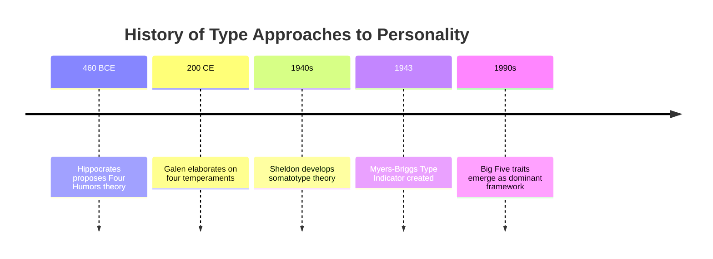
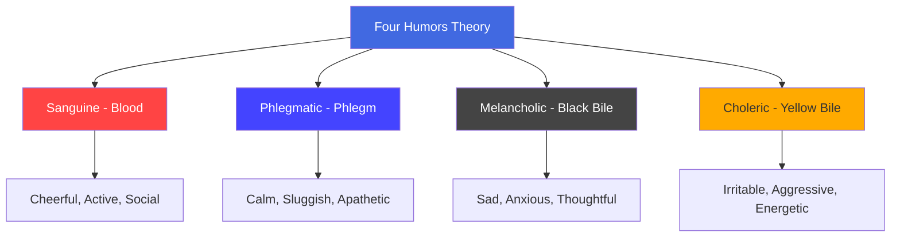

# Type Approaches to Personality: Historical and Modern Typologies

## Introduction

One of the oldest human impulses is to sort people into categories — to say "she's a type A person" or "he's definitely an introvert." This impulse gave rise to the first systematic personality theories in the form of **type approaches**: systems that classify people into discrete, mutually exclusive categories.

Type approaches to personality are among the earliest systematic attempts to understand individual differences. Though largely superseded by trait approaches in modern psychology, they laid essential conceptual groundwork and their legacy persists — most famously in the wildly popular (if psychologically controversial) Myers-Briggs Type Indicator used by millions today.

:::info Source
📄 [MPC-003 Block-1/Unit-2.pdf - Pages 21-24](/pdfs/MPC-003%20Personality%20Theories%20and%20Assessment/Block-1/Unit-2.pdf)  
📚 MPC-003 Personality: Theories and Assessment, IGNOU
:::

---

## What Are Type Approaches?

Type approaches classify human personality into **discrete, all-or-nothing categories**. The fundamental assumption is that there are qualitatively distinct types of people, and that any given individual belongs fully to one type rather than another.

This is like sorting people into blood groups (A, B, AB, O) — you are either A or you are not; there is no "halfway A." Type theorists assume personality works similarly.

**Key characteristics of type approaches:**
- **Categorical:** People fall into distinct, non-overlapping types
- **Discontinuous:** The differences between types are qualitative, not just quantitative
- **Holistic:** The type as a whole describes the person better than any single characteristic
- **Predictive:** Knowing someone's type should allow prediction of their behaviour

---

## 1. Hippocrates' Four Humors Theory (Ancient Greece)

The oldest systematic personality typology comes from **Hippocrates** (c. 460–370 BCE), the "father of medicine," later elaborated by the Roman physician **Galen**. This theory classified personality according to four bodily fluids (**humors**), with the dominant fluid determining temperament.

| Dominant Humor | Temperament | Characteristics |
|----------------|-------------|-----------------|
| **Blood** | Sanguine | Cheerful, active, optimistic, sociable |
| **Phlegm** | Phlegmatic | Apathetic, sluggish, calm, unemotional |
| **Black Bile** | Melancholic | Sad, brooding, thoughtful, anxious |
| **Yellow Bile** | Choleric | Irritable, excitable, aggressive, energetic |

This theory remained influential for nearly two millennia — a testament to how intuitively appealing the four temperament categories feel. Hippocrates also made an early observation connecting body type to disease vulnerability: short, thick-bodied people seemed prone to stroke, while tall, thin people seemed prone to tuberculosis.

**Modern status:** The four humors theory is now regarded as scientifically baseless — personality is not driven by bodily fluids. However, the four temperament categories have remarkable parallels to modern personality dimensions (the melancholic/sanguine distinction echoes Neuroticism; the sanguine/phlegmatic distinction echoes Extraversion), suggesting Hippocrates was observing real personality variation even if his causal explanation was wrong.

:::note Historical Significance
The four humors persisted in European medicine until the 18th century. Even today, the words *sanguine* (optimistic), *phlegmatic* (calm), *melancholic* (sad), and *choleric* (irritable) remain common English adjectives — linguistic fossils of Hippocrates' framework.
:::

---

## 2. Sheldon's Somatotype Theory (1940s)

American physician **William Sheldon** attempted to revive the ancient connection between body and personality through his **somatotype** (body build) theory. Using photographs and measurements of thousands of people, he proposed three basic body types, each linked to a specific temperament:

| Somatotype | Physical Description | Personality/Temperament |
|------------|---------------------|------------------------|
| **Ectomorph** | Thin, long, fragile | Artistic, brainy, introverted, restrained |
| **Endomorph** | Fat, soft, round | Relaxed, sociable, fond of eating and comfort |
| **Mesomorph** | Muscular, strong, rectangular | Affective, dominant, energetic, courageous |

Sheldon claimed high correlations between physique and personality — correlations around .80, which would be remarkable if true.

**Critical evaluation of Sheldon's theory:**

Sheldon's theory has not been substantiated and has proved of little predictive value (Tyler, 1965). Problems include:
1. **Methodological flaws:** Sheldon himself both rated the body types and the personality — creating massive rater bias
2. **Not all bodies fit:** Many people have mixed body types or fall between categories
3. **Weak independent replication:** When others independently rated physique and personality, correlations dropped dramatically
4. **Biological determinism:** The theory implies personality is fixed by physique, leaving no room for development or change
5. **Cultural bias:** What body types are idealised varies across cultures and eras

Despite its scientific failure, Sheldon's theory had lasting influence. The somatotype vocabulary (ectomorph, endomorph, mesomorph) remains in use in fitness and health contexts today.

---

## 3. Myers-Briggs Type Indicator (MBTI)

The most widely used personality type system today is the **Myers-Briggs Type Indicator (MBTI)**, developed by Katharine Cook Briggs and her daughter Isabel Briggs Myers during World War II. The MBTI is based on **Carl Jung's theory of psychological types** (1921).

### The Four Dimensions

The MBTI assesses personality on **four dimensions**, each with two poles:

| Dimension | Poles | What It Measures |
|-----------|-------|-----------------|
| **E/I** | Extraversion vs. Introversion | Where you direct your energy — outward or inward |
| **S/N** | Sensing vs. Intuition | How you take in information — concrete facts or patterns |
| **T/F** | Thinking vs. Feeling | How you make decisions — logic or values |
| **J/P** | Judging vs. Perceiving | How you relate to the outside world — structured or flexible |

The J/P dimension was added by Myers (not Jung) and distinguishes whether a person's dominant function (rational judging vs. irrational perceiving) is oriented toward the external world.

### The 16 Types

By combining one pole from each dimension, the MBTI generates **16 personality types**, each described by a four-letter code. For example:

- **ESFP** (Extraverted-Sensing-Feeling-Perceiving): Outgoing, easygoing, friendly, practical, good with people
- **INTJ** (Introverted-Intuition-Thinking-Judging): Strategic, independent, analytical, determined
- **ENFJ** (Extraverted-Intuition-Feeling-Judging): Charismatic, empathetic, visionary, inspiring

### Strengths and Criticisms of MBTI

**Strengths:**
- Based on theoretically rich Jungian foundations
- Categories are distinct and descriptively useful
- Widely used in corporate training, career counselling, team building
- Generates useful self-reflection

**Criticisms:**
- **Forced categorisation:** People are assigned to one pole of each dimension even when they score near the middle — the same person may get different types on retesting
- **Poor test-retest reliability:** Up to 50% of people get a different type code when retested just 5 weeks later
- **Scientific validity questioned:** Critics argue people should be described by their actual *scores* on each dimension rather than forced into discrete types
- **Barnum effect:** MBTI descriptions are often vague enough to apply to most people
- **No predictive power:** Research shows MBTI types do not reliably predict job performance or outcomes

---

## Why Type Approaches Fall Short: The Move to Traits

Type approaches ultimately fail as comprehensive personality classification systems because:

1. **Too many people don't fit:** Types are ideal categories, but real people are messy and don't cleanly belong to one type
2. **They rob uniqueness:** By forcing unique individuals into pre-set categories, type systems flatten the very individual differences they claim to capture
3. **Types are in the eye of the beholder:** They reflect the theorist's conceptual categories, not necessarily naturally occurring personality clusters
4. **Traits exist within people:** As Allport argued, traits are internal, real psychological structures — types are merely convenient labels imposed from outside

The critical insight: **Types exist in the eye of the beholder; traits exist within the person.**

This led personality psychologists to prefer **trait approaches** — which describe people in terms of dimensions (continua) rather than discrete categories — allowing for the infinite variation of human personality.

---

## The Persistence of Type Thinking

Despite scientific limitations, type thinking persists because it is:
- **Cognitively simple:** Four types are easier to remember and apply than 30+ trait dimensions
- **Socially useful:** Type categories facilitate communication ("she's very phlegmatic")
- **Personally meaningful:** People enjoy self-categorisation and finding their "type"
- **Culturally embedded:** Type vocabularies (introvert/extravert, choleric/sanguine) have become part of everyday language

Modern personality science has found a middle ground: the **Big Five** framework uses five *dimensional* traits that capture much of the same information as type systems, but with greater precision, reliability, and scientific validity.

---

## Indian Typological Traditions

Indian philosophical traditions offer their own personality typologies that parallel and in some ways surpass Western type theories:

**Triguna System (Samkhya philosophy):** Personality classified by the proportion of three *gunas* (fundamental qualities):
- **Tamas** (inertia, darkness, passivity) — comparable to phlegmatic/melancholic
- **Rajas** (activity, passion, aggression) — comparable to choleric/sanguine
- **Sattva** (clarity, harmony, wisdom) — the ideal balanced state

Unlike Western type theories, the Triguna system is explicitly *developmental* — it holds that one can cultivate sattva and reduce tamas through spiritual practice, diet, and lifestyle. This makes it more dynamic than Hippocrates' fixed four humors.

**Ayurvedic Prakriti Types (Doshas):** Vata (air/movement), Pitta (fire/transformation), Kapha (earth/stability) — with implications for personality, health, and optimal lifestyle.

These Indian systems are increasingly being studied empirically, with preliminary research showing some correspondence between Prakriti types and modern personality dimensions like the Big Five.

---

## Memory Aids

**Four Humors — SPMC:**  
**S**anguine (blood) | **P**hlegmatic (phlegm) | **M**elancholic (black bile) | **C**holeric (yellow bile)

**Sheldon's Somatotypes — ECM:**  
**E**ctomorph (thin, artistic) | **C**anadian... wait: **E**cto-**E**gghead (thin, brainy) | **E**ndo-**E**ater (round, sociable) | **M**eso-**M**uscle (muscular, dominant)

**MBTI dimensions — EIST JP:**  
**E/I** = Energy direction | **S/N** = Information intake | **T/F** = Decision style | **J/P** = Lifestyle structure

---

## Self-Assessment Questions

1. What is meant by a "type approach" to personality? How does it differ fundamentally from a "trait approach"?

2. Describe Hippocrates' four-humor theory. Name each humor, its associated temperament, and the key personality characteristics of each type.

3. Why has Sheldon's somatotype theory been largely discredited? Identify at least three specific methodological or conceptual problems.

4. Explain the four dimensions assessed by the MBTI. Why do critics argue that people should be described by their scores on each dimension rather than assigned to types?

5. What does Allport mean when he says "types exist in the eye of the beholder; traits exist within the person"? Do you agree? Explain with an example.

6. How do Indian typological traditions (Triguna/Doshas) compare to Western type approaches? What makes them more dynamic?

---

## External Resources

### Wikipedia Articles
- [Humorism](https://en.wikipedia.org/wiki/Humorism) — the four humors theory
- [Somatotype and constitutional psychology](https://en.wikipedia.org/wiki/Somatotype_and_constitutional_psychology) — Sheldon's theory
- [Myers–Briggs Type Indicator](https://en.wikipedia.org/wiki/Myers%E2%80%93Briggs_Type_Indicator) — comprehensive overview
- [Carl Jung's psychological types](https://en.wikipedia.org/wiki/Psychological_Types)

### Educational Videos
- 🎥 [The Myers-Briggs Type Indicator - CrashCourse](https://www.youtube.com/watch?v=7kX7nEMFJhQ) — balanced overview with critique
- 🎥 [Personality Type vs Personality Trait - Psychology Explained](https://www.youtube.com/watch?v=vp-qBPQFsEA)
- 🎥 [History of Personality Psychology - Sprouts](https://www.youtube.com/watch?v=RlBXroSFrFI)

### Research Papers (2020-2024)
- Boyle, G.J. (2022). Myers-Briggs Type Indicator (MBTI): Some psychometric limitations. *Australian Psychologist*, 57(2), 82-95.
- Pittenger, D.J. (2020). Measuring the MBTI: Reliability and validity. *Journal of Career Planning*, 35(4), 23-41.
- Soto, C.J. (2021). Do links between personality and life outcomes replicate? *Journal of Research in Personality*, 94, 104-133.

### Additional Reading
- [Why the Myers-Briggs Test Is Totally Meaningless - Vox](https://www.vox.com/2014/7/15/5881947/myers-briggs-personality-test-meaningless)
- [APA - History of Personality Psychology](https://www.apa.org/monitor/2011/04/history-personality)

---

## Cross-References

- Previous: [Personality Development: Determinants](/mpc-003/block-1/personality-development-determinants)
- Next: [Allport and Cattell Trait Theories](/mpc-003/block-1/allport-cattell-trait-theories)
- Related: [Definition and Concept of Personality](/mpc-003/block-1/definition-concept-personality)

---

**Source PDFs**:
- 📄 [Block-1/Unit-2.pdf - Pages 21-24](/pdfs/MPC-003%20Personality%20Theories%20and%20Assessment/Block-1/Unit-2.pdf)
- 📚 MPC-003 Personality: Theories and Assessment, IGNOU
