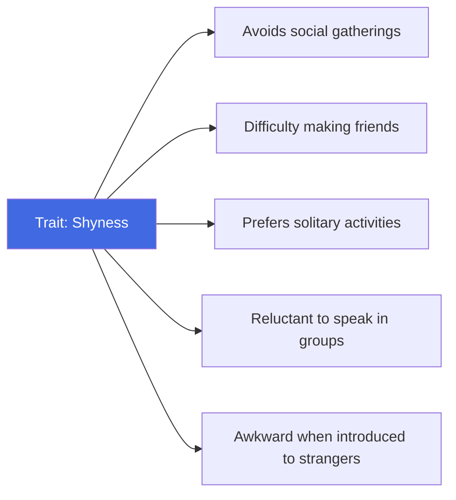
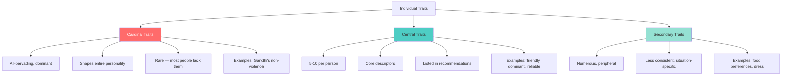
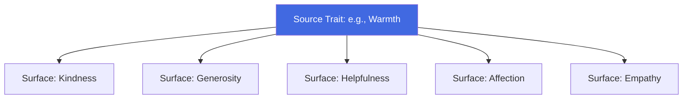

# Trait Theories of Personality: Allport and Cattell

## Introduction

If type theories place people into boxes, **trait theories** describe people as unique points in a multi-dimensional space. Where types say "she is an introvert," trait approaches say "she scores 72nd percentile on introversion" — preserving the full richness of individual variation.

Trait approaches define personality in terms of **traits**: relatively stable, consistent personal characteristics that predispose individuals to respond in particular ways across situations. Two of the most influential early trait theorists are **Gordon Allport** and **Raymond Cattell** — who, while sharing the basic trait framework, differed profoundly in method and emphasis.

:::info Source
📄 [MPC-003 Block-1/Unit-2.pdf - Pages 23-28](/pdfs/MPC-003%20Personality%20Theories%20and%20Assessment/Block-1/Unit-2.pdf)  
📚 MPC-003 Personality: Theories and Assessment, IGNOU
:::

---

## The Trait Approach: Core Assumptions

Trait approaches share several foundational assumptions that distinguish them from type approaches:

| Feature | Type Approach | Trait Approach |
|---------|--------------|----------------|
| Structure | Discrete categories | Continuous dimensions |
| Individual differences | Qualitative (different kinds) | Quantitative (different amounts) |
| Where differences lie | Between types | Along trait dimensions |
| Prediction | Type membership predicts behaviour | Trait scores predict behaviour |
| Uniqueness | Lost in categorisation | Preserved in unique trait profiles |

A **trait** is defined as any relatively stable and consistent personal characteristic that distinguishes individuals from one another. Traits are:
- **Internal:** They exist within the person, not just in situations
- **Inferred:** We infer them from behavioural consistency across situations
- **Dimensional:** They vary in amount (how much), not just kind (which type)
- **Predictive:** Higher trait scores predict more trait-consistent behaviour

---

## Gordon Allport's Trait Theory

### Background and Approach

Gordon Allport (1897–1967) is considered by many the founder of personality psychology as a scientific discipline. He brought an **idiographic** orientation — meaning he believed each person must be understood as a unique individual, not just as an instance of general categories.

His famous 1936 study with Odbert combed through the English dictionary and identified **17,953 words** describing personal traits. This **lexical approach** was based on the assumption that if a trait is important to human social life, human languages will have a word for it — and conversely, the existence of trait words in language tells us something about real psychological structures.

From this vast list, Allport sought to identify the core traits that actually structure personality — but he insisted this must be done idiographically (for the individual) rather than nomothetically (across groups).

### Traits as Building Blocks

For Allport, **traits are the building blocks of personality and the source of individuality.** Key properties of traits:

- Traits are **real**: they are not mere labels but actual neuropsychological structures ("located somewhere in the nervous system")
- Traits are **invisible**: we infer their existence from behavioural consistency
- Traits are **generative**: they cause behaviour — they are not just descriptions of it
- **Dissimilar stimuli** tend to arouse the same trait: a shy person shows shyness whether at a party, in a meeting, or meeting a stranger

The trait (shyness) is inferred from observing consistency across these different behavioural manifestations. The behaviours are "equivalent" in expressing the same underlying trait.

### Common Traits vs. Individual Traits

Allport distinguished two major categories:

**Common Traits:** Traits shared broadly across members of a culture. These are the "baseline" traits — politeness in Indian culture, for example, or independence in American culture. Common traits are important for comparing individuals on the same dimension.

**Individual Traits (Personal Dispositions):** Traits unique to a specific person. These are the traits that make someone irreducibly *themselves*. Allport considered individual traits more fundamental to understanding personality, because personality is ultimately about the individual.

Individual traits are further classified into three hierarchical levels based on their pervasiveness and centrality:

### The Three Levels of Individual Traits

#### Cardinal Traits

A **cardinal trait** is so pervasive, dominant, and central that virtually *every aspect* of the person's behaviour can be traced to its influence. It is the master passion that organises the entire personality around it.

Most people do not have cardinal traits — they are rare. Those who do are often identified with that trait by name:
- **Mahatma Gandhi:** peace-loving, non-violence
- **Don Quixote (fictional):** idealistic chivalry
- **Scrooge (fictional):** miserliness

Cardinal traits are sometimes called by the person's name as adjectives: to be "quixotic" or to be "machiavellian" (from Machiavelli) — these eponymous adjectives indicate that the person embodied a cardinal trait so completely they became associated with it.

#### Central Traits

**Central traits** are the 5–10 most outstanding traits in a person's personality — the ones that would appear in a carefully written character reference or letter of recommendation. They are not as overwhelming as cardinal traits but are highly characteristic and consistently expressed.

Examples: friendliness, dominance, self-centredness, creativity, honesty, reliability. These are the adjectives that someone who knows you well would use to describe you most accurately.

#### Secondary Traits

**Secondary traits** are the most numerous and peripheral — they are less consistent, less generalised, and less relevant to the overall personality. They appear only in specific circumstances or reveal preferences rather than deep character.

Examples: food preferences (vegetarian), specific attitudes (dislikes jazz), style habits (always wears formal clothes), situational reactions (gets nervous in doctor's offices).

### Motivational vs. Stylistic Traits

All individual traits possess **motivational power** — they energise behaviour. But Allport distinguished:

- **Motivational traits:** Intensely experienced traits that powerfully drive behaviour (e.g., strong ambition, deep generosity)
- **Stylistic traits:** Less intensively experienced but shape the *manner* of behaviour (e.g., speaking slowly, tending toward perfectionism)

### The Role of the Proprium (Self)

Allport did not believe personality was just a bundle of unrelated traits. Rather, he argued that personality has **unity, consistency, and integration** — and this integration is accomplished by the **Proprium** (self).

The Proprium is Allport's term for the "self as felt and known" — the evolving sense of self that gives coherence and direction to personality. It develops continuously from infancy to death, passing through distinct stages as self-awareness, self-image, and self-extension develop.

:::note Allport's Central Insight
Personality is not the *sum* of traits but their *integration* — a living whole greater than its parts, unified by the developing self (Proprium).
:::

---

## Raymond Cattell's Trait Theory

### Background and Approach

Raymond Cattell (1905–1998) approached personality through the rigorous statistical technique of **factor analysis** — a mathematical method for identifying the underlying dimensions (factors) that explain patterns of correlation among observed variables.

Where Allport relied primarily on linguistic analysis and clinical observation, Cattell used objective measurement and sophisticated statistics. His goal was to identify the *smallest number of traits* that could explain the *maximum amount of personality variation* — producing a parsimonious but comprehensive trait taxonomy.

### Surface Traits vs. Source Traits

Cattell made his most famous distinction between:

**Surface Traits:** The observable qualities of personality — kindness, honesty, helpfulness, generosity. These are what you can directly observe when interacting with someone. Allport would have called these central traits.

**Source Traits:** The deeper, underlying factors responsible for the correlations among surface traits. When you observe that someone who is kind is also honest, helpful, and generous — this cluster of correlated surface traits suggests an underlying source trait (perhaps something like "prosociality" or "agreeableness").

Key properties:
- **Source traits are smaller in number** than surface traits but better predictors of behaviour
- **Everyone possesses the same source traits** but in different amounts (like everyone having intelligence, but in different degrees)
- Source traits **underlie and explain** surface trait clusters

### Cattell's 16 Source Traits and the 16PF

Through extensive factor analysis of questionnaire and observational data from thousands of participants, Cattell identified **23 source traits** in normal persons, of which **16** he studied in detail. These 16 became the basis for his famous personality test: the **Sixteen Personality Factor Questionnaire (16PF)**.

The 16 bipolar factors measured by 16PF include:

| # | Bipolar Trait |
|---|---------------|
| 1 | Reserved ↔ Outgoing |
| 2 | Less intelligent ↔ More intelligent |
| 3 | Emotional ↔ Stable |
| 4 | Humble ↔ Assertive |
| 5 | Sober ↔ Happy-go-lucky |
| 6 | Expedient ↔ Conscientious |
| 7 | Shy ↔ Venturesome |
| 8 | Tough-minded ↔ Tender-minded |
| 9 | Trusting ↔ Suspicious |
| 10 | Practical ↔ Imaginative |
| 11 | Forthright ↔ Shrewd |
| 12 | Placid ↔ Apprehensive |
| 13 | Conservative ↔ Experimenting |
| 14 | Group-tied ↔ Self-sufficient |
| 15 | Casual ↔ Controlled |
| 16 | Relaxed ↔ Tense |

Later, Cattell identified **12 additional factors** measuring psychopathological traits (e.g., hypochondriasis, anxious depression, paranoia, schizophrenia), which were combined with the 16PF to create the **Clinical Analysis Questionnaire (CAQ)** — designed to assess both normal and abnormal personality.

### Constitutional Traits vs. Environmental-Mold Traits

Cattell also distinguished the origins of source traits:

**Constitutional Traits (Nature):** Determined by biology/heredity — the genetic contribution to personality.

**Environmental-Mold Traits (Nurture):** Shaped by experience and interaction with the environment — the learned contribution to personality.

To disentangle genetic from environmental influences on specific traits, Cattell developed a sophisticated statistical procedure called **MAVA (Multiple Abstract Variance Analysis)**, which compared people of the same family reared together vs. apart, and members of different families reared together vs. apart.

Most surface traits, for Cattell, reflect a **mixture** of both heredity and environment — anticipating modern behaviour genetics research.

### Ability, Temperament, and Dynamic Traits

Cattell further subdivided traits into three functional categories:

| Category | Definition | Examples |
|----------|-----------|---------|
| **Ability Traits** | Skill in dealing with the environment and its challenges | Intelligence, specific aptitudes |
| **Temperament Traits** | Stylistic tendencies showing *how* one moves toward goals | Moodiness, irritability, easygoing nature |
| **Dynamic Traits** | Motivational forces that energise action toward goals | Ambition, power-seeking, sports orientation |

Dynamic traits are the most motivationally charged. They include three subtypes:

1. **Attitudes:** Dynamic surface traits — specific manifestations of underlying motives
2. **Ergs:** Constitutional dynamic source traits — innately determined motivational drives. Cattell identified 10 ergs: hunger, sex, gregariousness, parental protectiveness, curiosity, escape, pugnacity, acquisitiveness, self-assertion, and narcissistic sex
3. **Sentiments:** Environmental-mold dynamic source traits — socially shaped motivational structures focusing on social objects (e.g., love of a sport, attachment to one's country)

---

## Comparing Allport and Cattell

| Dimension | Allport | Cattell |
|-----------|---------|---------|
| **Method** | Lexical analysis, clinical observation | Factor analysis, objective measurement |
| **Orientation** | Idiographic (individual-focused) | Nomothetic (group-focused) |
| **Trait levels** | Cardinal, central, secondary | Surface, source |
| **Key construct** | Individual trait / personal disposition | Source trait |
| **Assessment tool** | No single test; emphasised qualitative methods | 16PF, CAQ |
| **Integration** | Proprium (self) unifies traits | Mathematical factor structure |
| **Nature/nurture** | Both, with emphasis on the whole person | Explicitly modelled via MAVA |

Both Allport and Cattell agreed that traits are real, internal psychological structures that causally influence behaviour — not mere labels or statistical abstractions.

---

## Evaluation of Early Trait Theories

**Strengths:**
- Provide systematic, measurable ways to describe individual differences
- Move beyond crude types to capture the continuous variation of human personality
- Grounded in observable, consistent behaviour patterns
- Have generated useful assessment tools (16PF remains widely used today)

**Limitations:**
- Primarily descriptive — explain *what* personality is like, less so *why* it developed
- The number of "fundamental" traits varies across theorists (Allport: many; Cattell: 16; Eysenck: 3)
- Early approaches underestimated situational influences on behaviour
- Factor analysis finds different factors depending on the data and method used

---

## Memory Aids

**Allport's Trait Levels — CCS:**  
**C**ardinal (all-pervading master trait) | **C**entral (5-10 core traits) | **S**econdary (peripheral, specific)

**Cattell's Main Distinctions:**  
**SuSo** = **Su**rface traits (observable) → **So**urce traits (underlying)  
**ConEnv** = **Con**stitutional (nature) vs. **Env**ironmental (nurture)  
**ATD** = **A**bility | **T**emperament | **D**ynamic traits

**Ergs vs. Sentiments:**  
**E**rgs = **E**ndowed (innate, biological drives)  
**S**entiments = **S**ocially **S**haped (learned, cultural)

---

## Self-Assessment Questions

1. Distinguish between common traits and individual traits in Allport's theory. Which does Allport consider more fundamental, and why?

2. Explain the three levels of individual traits (cardinal, central, secondary) with an example for each. What makes a trait "cardinal"?

3. What is Allport's concept of the Proprium? How does it contribute to personality integration?

4. Explain the distinction between surface traits and source traits in Cattell's theory. Why are source traits considered more scientifically useful?

5. What is the 16PF? Describe its basis and explain how it was constructed from Cattell's factor-analytic research.

6. Distinguish between ability traits, temperament traits, and dynamic traits in Cattell's system. Where do "ergs" and "sentiments" fit in this classification?

7. Critically compare Allport's and Cattell's approaches to personality traits. What are the key methodological and conceptual differences between them?

---

## External Resources

### Wikipedia Articles
- [Gordon Allport](https://en.wikipedia.org/wiki/Gordon_Allport) — biography and theory overview
- [Trait theory](https://en.wikipedia.org/wiki/Trait_theory) — general overview
- [Raymond Cattell](https://en.wikipedia.org/wiki/Raymond_Cattell) — biography and 16PF
- [16PF Questionnaire](https://en.wikipedia.org/wiki/16PF_Questionnaire) — the test itself
- [Factor analysis](https://en.wikipedia.org/wiki/Factor_analysis) — the statistical method underlying Cattell's work

### Educational Videos
- 🎥 [Allport's Trait Theory - Simply Psychology](https://www.youtube.com/watch?v=iqUsqiEKbWo)
- 🎥 [Cattell's 16 Personality Factors - Overview](https://www.youtube.com/watch?v=BvS1TwXUHzA)
- 🎥 [Trait Theory of Personality - CrashCourse](https://www.youtube.com/watch?v=78cJnVPXxU4)

### Research Papers (2020-2024)
- Fleeson, W. & Jayawickreme, E. (2021). Whole trait theory: A new synthesis. *Advances in Experimental Social Psychology*, 63, 1-48.
- De Fruyt, F. & Wille, B. (2022). Allport's legacy in contemporary personality psychology. *European Journal of Personality*, 36(3), 385-400.
- Lüdtke, O. & Roberts, B.W. (2021). Personality trait structures across time. *Journal of Research in Personality*, 90, 104-057.

### Additional Reading
- [16PF Test Information - Institute for Personality and Ability Testing](https://www.16pf.com)
- [Allport's Idiographic Approach - Simply Psychology](https://www.simplypsychology.org/allport.html)
- [Cattell's Trait Theory - Simply Psychology](https://www.simplypsychology.org/raymond-cattell.html)

---

## Cross-References

- Previous: [Type Approaches to Personality](/mpc-003/block-1/type-approaches-personality)
- Next: [Eysenck, Guilford, and the Big Five](/mpc-003/block-1/eysenck-guilford-big-five)
- Related: [Definition and Concept of Personality](/mpc-003/block-1/definition-concept-personality)

---

**Source PDFs**:
- 📄 [Block-1/Unit-2.pdf - Pages 23-28](/pdfs/MPC-003%20Personality%20Theories%20and%20Assessment/Block-1/Unit-2.pdf)
- 📚 MPC-003 Personality: Theories and Assessment, IGNOU
