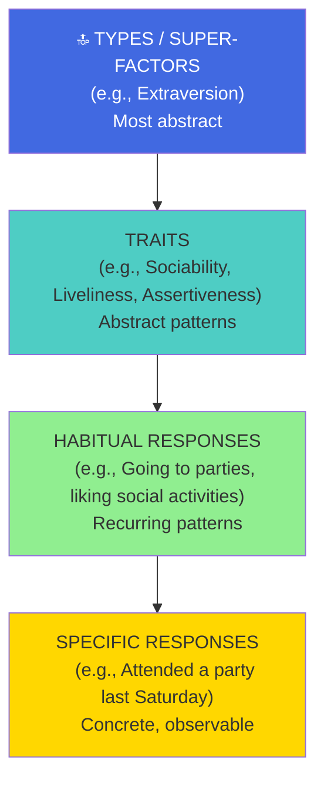
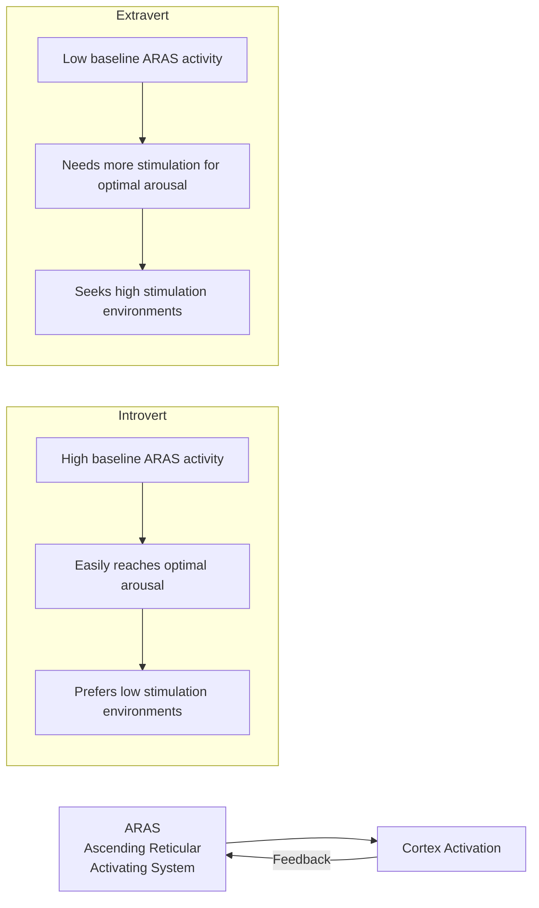
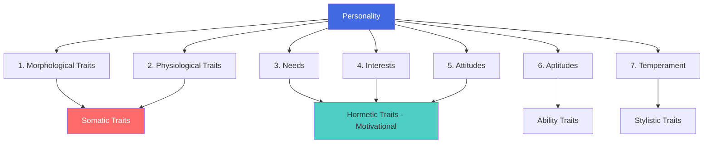

# Eysenck's Type-Trait Hierarchy, Guilford's Trait Theory, and the Big Five Model

## Introduction

The mid-to-late 20th century saw personality trait theory mature from the pioneering conceptual work of Allport and Cattell into biologically grounded, statistically refined frameworks with serious predictive and explanatory power. Three major contributions stand out:

1. **Hans Eysenck's** hierarchical model rooted in neurobiological theory
2. **J.P. Guilford's** comprehensive seven-modality trait framework
3. The **Five Factor Model (Big Five/OCEAN)** — the dominant contemporary personality taxonomy

Together, these frameworks represent the arc of personality psychology from the 1950s to the present day.

:::info Source
📄 [MPC-003 Block-1/Unit-2.pdf - Pages 28-39](/pdfs/MPC-003%20Personality%20Theories%20and%20Assessment/Block-1/Unit-2.pdf)  
📚 MPC-003 Personality: Theories and Assessment, IGNOU
:::

---

## Hans Eysenck's Type-Trait Hierarchy

### Core Theoretical Commitment

British psychologist **Hans Eysenck** (1916–1997) brought a strongly biological orientation to personality psychology. His central conviction: **personality is largely determined by genes**, with environmental factors playing a relatively minor role. For Eysenck, personality is "a more or less stable and enduring organisation of a person's character, temperament, intellect and physique."

### The Hierarchical Organisation of Personality

Eysenck proposed that personality is **hierarchically organised** — from specific, concrete responses at the bottom to abstract types at the top:

**The logic of the hierarchy:**
- Specific **responses** are observed on individual occasions
- When responses recur consistently, they form **habits**
- Related habits cluster together into **traits**
- Correlated traits cluster into **types** (super-factors)

This hierarchy explains how broad personality dimensions (types) can predict specific behaviours (responses) — through intermediate levels of traits and habits.

### Three Major Personality Dimensions

Eysenck derived his dimensions through factor analysis of personality data from multiple populations:

#### 1. Extraversion / Introversion (E)

**Extraverts:**
- Sociable, impulsive, seek excitement
- Oriented toward external reality — people, events, activities
- Actively seek stimulation: parties, social gatherings, variety

**Introverts:**
- Introspective, reflective, prefer inner world
- Oriented toward inner reality — thoughts, feelings, ideas
- Prefer quiet, solitary activities: reading, writing, individual pursuits
- Tend toward a well-ordered, predictable lifestyle

#### 2. Neuroticism / Stability (N)

**High Neuroticism (emotionally unstable):**
- Prone to excessive anxiety, disproportionate to actual situations
- Emotionally volatile, moody, often worried
- May show obsessional, impulsive, or phobic symptoms
- Reacts strongly to minor stressors

Some neurotics may be free from obvious anxiety — in this group, Eysenck included **psychopaths**, who fail to anticipate consequences of actions and behave antisocially regardless of punishment.

**Low Neuroticism (emotionally stable):**
- Calm, relaxed, even-tempered
- Responds proportionately to situations
- Resilient and consistent in mood

#### 3. Psychoticism / Impulse Control (P)

Added later based on further analyses:

**High Psychoticism:**
- Insensitive to others, hostile, at times cruel and inhuman
- Solitary, troublesome, non-conformist
- Indifferent to social norms

Eysenck provocatively proposed that **high-P individuals also tend to be creative** — based on his research with schizophrenics who gave many original responses on the Rorschach test. This suggests a relationship between psychoticism and creative divergent thinking.

### The EPQ: Measuring Eysenck's Dimensions

To measure his three dimensions, Eysenck developed the **Eysenck Personality Questionnaire (EPQ)**. The EPQ also includes a "lie scale" (L-scale) to detect socially desirable responding.

### Neurobiological Theories: Why Types Differ

Eysenck's greatest contribution was attempting to explain *why* introverts and extraverts behave differently through neurobiological mechanisms.

#### Inhibition Theory (Earlier)

Drawing on Pavlov and Teplov's work on nervous system properties, Eysenck proposed that extraverts and introverts differ in their balance of cortical excitation and inhibition:

| | Extraverts | Introverts |
|---|-----------|-----------|
| Inhibitory processes | Strong | Weak |
| Excitatory processes | Weak | Strong |
| Nervous system strength | Strong (high capacity for stimulation) | Weak (low stimulation tolerance) |

Result: Extraverts' brains react *slowly and weakly* to stimuli — they crave more stimulation to reach optimal arousal (hence: parties, excitement-seeking). Introverts' brains react *quickly and strongly* — they reach optimal arousal with little stimulation (hence: preference for quiet, avoiding crowds).

#### Arousal Theory (Later — Replaced Inhibition Theory)

Inhibition and excitation were theoretically useful but hard to measure. Eysenck replaced the framework with **Arousal Theory**, identifying specific physiological systems:

**For Extraversion/Introversion:**
The key structure is the **Ascending Reticular Activating System (ARAS)** — a network of fibres in the brainstem that projects upward to the thalamus and cortex, and downward to influence bodily muscles and the autonomic nervous system.

**Introverts** have innately **higher baseline ARAS arousal** → more sensitive to stimulation → prefer quieter environments.  
**Extraverts** have innately **lower baseline ARAS arousal** → need more stimulation → seek excitement.

**For Neuroticism:**
The seat of neuroticism lies in the **visceral brain (limbic system)** — including the hippocampus, amygdala, cingulum, septum, and hypothalamus. High neuroticism individuals have lower thresholds for limbic activation and greater sympathetic nervous system reactivity:

- Faster heart rate and breathing in response to stress
- Faster digestion disruption
- Greater emotional reactivity to even mild provocation

This neurobiological specificity was revolutionary — Eysenck was the first personality theorist to systematically link personality dimensions to specific brain systems.

:::note Recent Research (2021)
A 2021 meta-analysis in *Psychological Bulletin* by Luciano et al. confirmed that Eysenck's proposed link between extraversion and ARAS/dopaminergic activity has substantial empirical support, while neuroticism's link to limbic/amygdala reactivity is also well-supported by neuroimaging studies.
:::

---

## Guilford's Trait Theory

### Core Definition and Approach

**J.P. Guilford** (1897–1987) defined personality as **"the individual's unique pattern of traits"** — where a trait is **"any distinguishable, relatively enduring way in which one person differs from another."**

Using factor analysis, Guilford identified **seven modalities of traits** — seven different perspectives from which the whole person can be understood.

:::note Important Conceptual Point
Guilford emphasised that the seven modalities are **not seven separate parts** of personality. Personality is an **integrated whole** — the seven modalities are seven different *directions* from which that whole can be viewed, like examining a diamond from different angles.
:::

### The Seven Modalities

#### 1 & 2. Somatic Traits: Morphological and Physiological

**Morphological traits:** Physical attributes — physique, head size, limb proportions, ear size, spinal curvature. These are structural characteristics of the body.

**Physiological traits:** Physical functions — heart rate, breathing rate, hormone levels, blood sugar, brain wave patterns. These are process characteristics of the body.

Note: Guilford (1959) found little substantial relationship between morphological and physiological traits — despite Sheldon's earlier claims of high correlations between physique and temperament.

#### 3, 4 & 5. Hormetic Traits: Needs, Interests, and Attitudes

Guilford called these **hormetic** (from Greek *hormē* = impulse) because they directly motivate action:

**Needs:** Relatively permanent dispositions that motivate toward particular conditions. Examples: need for prestige (motivates status-seeking behaviour), need for food (motivates foraging when hungry).

**Interests:** Generalised tendencies to be attracted by certain stimuli — broad orientations rather than specific responses. Interests are positively valued (you like certain things) and include the inclination to perform activities (you enjoy certain pursuits).

**Attitudes:** Dispositions to favour or not favour a social object or action. Attitudes are:
- **Cognitive** (what you believe about the object)
- **Affective** (how you feel about the object)
- **Conative** (how you act toward the object)

Examples: attitudes toward premarital sex, divorce, gender equality.

#### 6. Aptitudes

Aptitudes refer to **how well an individual can perform a given activity** — they are more specific than general abilities ("all aptitudes are abilities, but not all abilities are aptitudes").

Guilford identified three primary aptitudes:
1. **Perceptual aptitudes:** Visual, auditory, kinaesthetic sensitivity
2. **Psychomotor aptitudes:** Physical coordination, fine motor control (needed by dancers, athletes, human engineers)
3. **Intelligence (general aptitude):** Guilford's famous **Structure-of-Intellect (SOI) model**

**The Structure-of-Intellect Model:** Guilford proposed that intelligence could be decomposed along three parameters:
- **Operations** (what the mind does): originally 5 categories, expanded to 6
- **Products** (what is produced): 6 categories
- **Contents** (what information is processed): originally 4 categories, expanded to 5

Original total: 5 × 6 × 4 = **120 distinct intelligence factors**  
Revised total: 6 × 6 × 5 = **180 distinct intelligence factors**

This was far more comprehensive than any prior model of intelligence and challenged the dominant view of intelligence as a single general factor (g).

#### 7. Temperament

For Guilford, temperament refers to the **manner** in which a person performs behaviour — not what they do or why, but *how* they do it. Whether someone is impulsive or deliberate, tolerant or critical, reveals their temperament.

Guilford assessed temperament with the **Guilford-Zimmerman Temperament Survey (GZTS)**, which measures 10 bipolar traits:

| Factor | Bipolar Dimension |
|--------|------------------|
| G | General Activity ↔ Inactivity |
| R | Restraint ↔ Impulsiveness |
| A | Ascendance ↔ Submissiveness |
| S | Sociability ↔ Shyness |
| E | Emotional Stability ↔ Depression |
| O | Objectivity ↔ Subjectivity |
| F | Friendliness ↔ Hostility |
| T | Thoughtfulness ↔ Unreflectiveness |
| P | Personal Relations ↔ Criticalness |
| M | Masculinity ↔ Femininity |

### Three Levels of Trait Generality

Guilford identified three levels at which traits operate:

1. **Hexic level:** Trait displayed only in specific situations (e.g., Mohan who is generally shy but shows dominance when competing with friends — dominance here is a hexic-level trait)

2. **Primary trait level:** Trait manifested across a broader range of behaviour (e.g., Shyam who shows dominance and aggression most of the time — these are primary traits for him)

3. **Type level:** When behaviours cluster around a single dominant disposition (the least emphasized by Guilford, most emphasized by Eysenck)

---

## The Five Factor Model (Big Five / OCEAN)

### Origins and Development

The **Five Factor Model (FFM)**, also known as the **Big Five**, is the dominant paradigm in contemporary personality psychology. It emerged from multiple independent lines of research converging on the same five factors:

- **Lewis Goldberg (1981):** Reanalysed Allport & Odbert's lexical data and identified five robust factors
- **McCrae and Costa (1987):** Named and described the five factors, developed the NEO-PI-R

The term "Big Five" refers to the finding that **each factor subsumes a very large number of specific traits** — they are broad, abstract dimensions comparable in scope to Eysenck's super-factors.

### The Five Dimensions: OCEAN

```mermaid
graph TD
    BIG5[Big Five / OCEAN] --> O[Openness to Experience]
    BIG5 --> C[Conscientiousness]
    BIG5 --> E[Extraversion]
    BIG5 --> A[Agreeableness]
    BIG5 --> N[Neuroticism]
    
    O --> O1["High: Curious, creative, aesthetic, imaginative"]
    O --> O2["Low: Conventional, practical, uncurious, traditional"]
    
    C --> C1["High: Organised, dependable, disciplined, thorough"]
    C --> C2["Low: Impulsive, careless, disorganised, unreliable"]
    
    E --> E1["High: Sociable, active, talkative, optimistic, fun-loving"]
    E --> E2["Low: Reserved, quiet, solitary, task-oriented"]
    
    A --> A1["High: Trusting, cooperative, helpful, forgiving, soft-hearted"]
    A --> A2["Low: Suspicious, uncooperative, hostile, manipulative"]
    
    N --> N1["High: Anxious, moody, nervous, insecure, irritable"]
    N --> N2["Low: Calm, stable, unemotional, relaxed, confident"]
    
    style BIG5 fill:#4169E1,color:#fff
    style O fill:#FFD700
    style C fill:#90EE90
    style E fill:#FF6B6B,color:#fff
    style A fill:#4ECDC4
    style N fill:#9B59B6,color:#fff
```

#### Openness to Experience (O)

Assesses **proactive seeking and appreciation of experience** for its own sake — curiosity, creativity, aesthetic sensitivity, and tolerance for novelty and ambiguity.

- **High scorers:** Creative, curious, imaginative, broad interests, aesthetically sensitive, intellectually adventurous
- **Low scorers:** Conventional, practical, prefer routine, conservative in values, less curious

#### Conscientiousness (C)

Assesses **organisation, persistence, and goal-directed motivation** — the capacity to control impulses, plan, and carry through.

- **High scorers:** Dependable, organised, hard-working, responsible, reliable, thorough, self-disciplined
- **Low scorers:** Disorganised, undependable, unreliable, impulsive, irresponsible, lazy, negligent

*Conscientiousness is the single strongest personality predictor of job performance across occupations.*

#### Extraversion (E)

Assesses **quality and intensity of interpersonal interaction** and energy level.

- **High scorers:** Sociable, active, talkative, person-oriented, optimistic, fun-loving, affectionate
- **Low scorers:** Reserved, sober, aloof, task-oriented, quiet, retiring

#### Agreeableness (A)

Assesses **interpersonal orientation** — the spectrum from compassion to antagonism in thinking, feeling, and action.

- **High scorers:** Soft-hearted, good-natured, trusting, helpful, straightforward, forgiving
- **Low scorers:** Cynical, suspicious, uncooperative, vengeful, irritable, manipulative

#### Neuroticism (N)

Assesses **emotional instability** — the tendency to experience negative emotions and to be psychologically distressed.

- **High scorers:** Moody, irritable, nervous, insecure, anxious, hypochondriacal
- **Low scorers:** Calm, relaxed, unemotional, hardy, self-satisfied, composed

### Measuring the Big Five: The NEO-PI-R

**Costa and McCrae (1992)** developed the most widely used Big Five instrument: the **NEO Personality Inventory — Revised (NEO-PI-R)**.

Structure:
- **5 factors** (N, E, O, A, C)
- **6 facets per factor** (specific sub-traits)
- **8 items per facet**
- **Total items:** 5 × 6 × 8 = **240 items**

McCrae and Costa's strong claim: the Big Five is **necessary and sufficient** to describe basic personality dimensions. No other system, they argue, is "as complete and yet so parsimonious."

### Evaluation of the Big Five

**Strengths:**
- **Universal structure:** Cross-cultural research in 50+ countries confirms the five-factor structure, with strong consistency across languages and cultures
- **Longitudinal stability:** Traits remain highly stable over periods of 3–30 years (McCrae & Costa, 1990)
- **Broad predictive power:** Big Five traits predict health, relationships, job performance, academic achievement, political behaviour, and even longevity
- **Psychometric rigor:** High reliability and validity across populations

**Limitations and Criticisms:**
- **Descriptive, not explanatory:** The Big Five describes personality dimensions but does not explain *why* people develop them or *how* they cause behaviour (unlike Eysenck's biological model)
- **Situation underweighted:** Early trait approaches generally ignored situational influences
- **Person-Situation Debate:** Walter Mischel (1968) argued that situations, not traits, determine behaviour. His challenge initiated the person-situation debate — now resolved: both person (traits) and situation interact to shape behaviour
- **Cultural limitations:** While the five factors emerge cross-culturally, some researchers argue they reflect Western, individualistic personality conceptions

:::note Recent Research (2023)
A 2023 longitudinal study in *Journal of Personality and Social Psychology* by Briley et al. tracking 3,000 participants over 12 years found that Big Five traits show **mean-level change** across adulthood (people typically become more conscientious, agreeable, and emotionally stable as they age — a pattern called "the maturity principle") while **rank-order stability** (who is more conscientious relative to others) also increases with age.
:::

---

## Comparing the Three Frameworks

| | Eysenck | Guilford | Big Five |
|--|---------|---------|---------|
| **Number of dimensions** | 3 (P, E, N) | 7 modalities, 10 temperament factors | 5 factors |
| **Biological basis** | Strong (ARAS, limbic system) | Acknowledged | Less emphasised |
| **Key assessment tool** | EPQ | GZTS | NEO-PI-R |
| **Breadth** | Very broad super-factors | Most comprehensive | Broad factors with facets |
| **Method** | Factor analysis + neuroscience | Factor analysis | Factor analysis (lexical + questionnaire) |
| **Popularity today** | Moderate (especially in Europe) | Moderate | Dominant worldwide |

---

## Memory Aids

**Eysenck's Three Dimensions:**  
**PEN** = **P**sychoticism | **E**xtraversion | **N**euroticism  
*(Think: Eysenck holds a PEN to write personality)*

**Eysenck's Hierarchy — Bottom to Top:**  
**RHAT** = **R**esponses → **H**abits → **A**djacent traits → **T**ypes  
*(Or: Real Humans Are Typed)*

**Guilford's 7 Modalities:**  
**MP-NIA-AT** = **M**orphological, **P**hysiological, **N**eeds, **I**nterests, **A**ttitudes, **A**ptitudes, **T**emperament  
*(Morphology & Physiology = Somatic; N-I-A = Hormetic; Aptitudes & Temperament = ability/style)*

**OCEAN Big Five:**  
**O**penness | **C**onscientiousness | **E**xtraversion | **A**greeableness | **N**euroticism  
*(Think: OCEAN = the vast sea of human personality)*

**High scorers — easy descriptions:**  
O = Open-minded | C = Careful | E = Energetic | A = Affable | N = Nervous

---

## Self-Assessment Questions

1. Explain Eysenck's hierarchical model of personality. Draw and explain the hierarchy from specific responses to types.

2. Distinguish between Eysenck's three major personality dimensions (E, N, P). Describe the characteristics of high and low scorers on each.

3. Explain the Arousal Theory and the role of the ARAS in Eysenck's account of introversion/extraversion differences. Why did Eysenck replace Inhibition Theory with Arousal Theory?

4. What is the "seat of neuroticism" according to Eysenck's arousal theory? Which brain structures are involved?

5. Explain Guilford's concept of "hormetic traits." What are the three types, and why are they called hormetic?

6. What is the Structure-of-Intellect model? How many intelligence factors does the revised model identify, and how is this number calculated?

7. Name and explain each of the Big Five personality dimensions. For each, give characteristics of high and low scorers.

8. "The Big Five is both necessary and sufficient to describe basic personality." Critically evaluate this claim.

9. What was Walter Mischel's criticism of trait approaches? How has the person-situation debate been resolved?

---

## External Resources

### Wikipedia Articles
- [Hans Eysenck](https://en.wikipedia.org/wiki/Hans_Eysenck) — biography and theory
- [Eysenck's three dimensions](https://en.wikipedia.org/wiki/Eysenck_Personality_Questionnaire)
- [Big Five personality traits](https://en.wikipedia.org/wiki/Big_Five_personality_traits) — comprehensive overview
- [NEO PI-R](https://en.wikipedia.org/wiki/Revised_NEO_Personality_Inventory) — the standard Big Five instrument
- [Reticular activating system](https://en.wikipedia.org/wiki/Reticular_activating_system) — the ARAS

### Educational Videos
- 🎥 [Eysenck's Personality Theory - Simply Psychology](https://www.youtube.com/watch?v=2YDVE2MFkHs)
- 🎥 [The Big Five Personality Traits - CrashCourse Psychology](https://www.youtube.com/watch?v=GCOp8PTBOFU)
- 🎥 [Big Five Personality Test Explained - Sprouts](https://www.youtube.com/watch?v=tEBFLM6NTUA)

### Research Papers (2020-2024)
- Briley, D.A. et al. (2023). Big Five personality change across adulthood. *Journal of Personality and Social Psychology*, 124(4), 845-862.
- Soto, C.J. et al. (2022). Cross-cultural replication of Big Five personality structure. *Nature Human Behaviour*, 6, 887-901.
- Strickhouser, J.E. et al. (2021). The role of personality in health and longevity: Big Five meta-analysis. *Psychological Bulletin*, 147(5), 453-489.

### Additional Reading
- [Big Five Personality Test (free) - Open Psychometrics](https://openpsychometrics.org/tests/IPIP-BFFM/)
- [Eysenck's Biological Theory of Personality - Simply Psychology](https://www.simplypsychology.org/hans-eysenck.html)
- [The Person-Situation Debate Resolved - Psychology Today](https://www.psychologytoday.com/us/blog/rabble-rouser/201311/the-person-situation-debate)

---

## Cross-References

- Previous: [Allport and Cattell Trait Theories](/mpc-003/block-1/allport-cattell-trait-theories)
- Previous: [Type Approaches to Personality](/mpc-003/block-1/type-approaches-personality)
- Next: MPC-003 Block-1, Unit-3 (coming soon)

---

**Source PDFs**:
- 📄 [Block-1/Unit-2.pdf - Pages 28-39](/pdfs/MPC-003%20Personality%20Theories%20and%20Assessment/Block-1/Unit-2.pdf)
- 📚 MPC-003 Personality: Theories and Assessment, IGNOU
