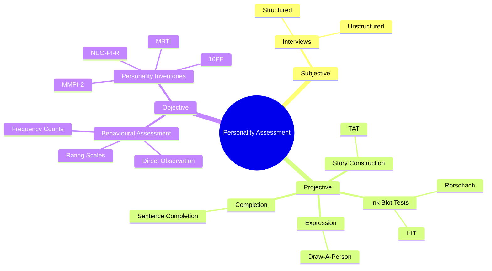
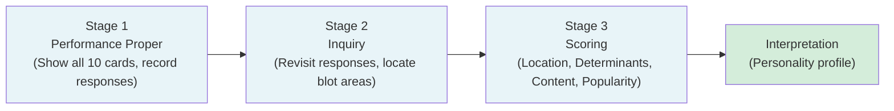

import Tabs from '@theme/Tabs';
import TabItem from '@theme/TabItem';

# Assessment of Personality: Methods and Techniques

## Introduction

Personality assessment refers to the estimation of a person's characteristic behaviour patterns and stable psychological characteristics. Because different theories conceptualise personality differently, the methods used to assess it also vary. Most psychological professionals take an **eclectic approach** — drawing on multiple methods and perspectives rather than being tied to a single theoretical viewpoint.

Personality assessment serves different purposes:
- **Self-understanding** — helping individuals gain insight into their own characteristics
- **Classification** — categorising persons according to personality traits for research or selection
- **Diagnosis** — identifying personality disorders for clinical intervention

Broadly, personality assessment methods fall into three categories: **subjective**, **objective**, and **projective**.

:::info Source
📄 [MPC-003 Block-1/Unit-3.pdf - Pages 40-54](/pdfs/MPC-003%20Personality%20Theories%20and%20Assessment/Block-1/Unit-3.pdf)
📚 MPC-003 Personality: Theories and Assessment, IGNOU
:::

---

## 🎬 Video Resources

Before diving in, these videos provide excellent visual context:

- 📺 [**Psychological Testing & Personality Assessment** — Crash Course Psychology](https://www.youtube.com/watch?v=1hs-JQf7IVA) — Overview of major personality assessment approaches (15 min)
- 📺 [**The Rorschach Test Explained** — Psych2Go](https://www.youtube.com/watch?v=LYi19ambwBk) — How the inkblot test works and what it measures (8 min)
- 📺 [**Projective Tests in Psychology** — Dr. Todd Grande](https://www.youtube.com/watch?v=Rj0gDdGPhlI) — Clinical use of projective techniques (12 min)

---

## Needs and Aims of Assessment

Testing has become increasingly important across all areas of psychology. Personality testing is essential for:
- Identifying the various constituents of personality
- Providing measures of emotional and motivational traits
- Understanding individual differences and intraindividual reactions under different circumstances
- Aiding diagnosis of personality disorders by clinical psychologists, counsellors, and psychiatrists

> 📖 **Wikipedia**: [Psychological testing](https://en.wikipedia.org/wiki/Psychological_testing) — Overview of standardised procedures used to measure psychological traits.

---

## Methods of Personality Assessment

---

### 1. Interviews

An interview is a method in which the interviewee answers questions asked by a professional, in either a **structured** or **unstructured** fashion.

**Limitations of Interviews:**
- **Self-report bias:** Clients can misinform, distort facts, or hide true information for social desirability
- **Interviewer bias:** The interviewer's personal beliefs or prejudices can affect interpretation
- **Halo effect:** The tendency to form a favourable or unfavourable first impression and then interpret all subsequent behaviour in light of that impression — those who make a good first impression appear to have a "halo" that positively colours everything they do

> 📖 **Wikipedia**: [Structured interview (psychology)](https://en.wikipedia.org/wiki/Structured_interview) — Systematic approach to interview-based assessment.

---

### 2. Projective Techniques

Projective techniques are designed to reveal central aspects of personality that lie in the **unconscious** — hidden desires, unconscious motivations, inner fears, and complexes.

**Key features:**
- Present **relatively unstructured tasks** that permit a wide range of responses
- Based on the hypothesis that the way test material is perceived and interpreted reflects fundamental aspects of psychological functioning
- The test material serves as a "screen" onto which respondents **project** their characteristic thought processes, anxieties, conflicts, and needs
- Represent **disguised testing** — test-takers are unaware of the psychological interpretation to be made of their responses

**Historical note:** The history of projective techniques dates to the 15th century when Leonardo da Vinci selected pupils based on their ability to find shapes in ambiguous forms. Galton constructed a word association test in 1879; Carl Jung used similar tests clinically. Frank (1939, 1948) formally introduced the term "projective method."

> 📖 **Wikipedia**: [Projective test](https://en.wikipedia.org/wiki/Projective_test) — Psychological tests that use ambiguous stimuli to reveal unconscious aspects of personality.

---

### Classification of Projective Techniques

Frank's Classification (with limitations due to overlap):

| Category | Description | Example |
|----------|-------------|---------|
| **Constructive** | Examinee constructs something (draw a human figure) | Draw-A-Person Test |
| **Constitutive** | Examinee imposes structure on unstructured material | Rorschach Inkblot Test |
| **Cathartic** | Examinee releases wishes/conflicts through manipulative tasks | Play therapy |
| **Interpretative** | Examinee adds detailed meaning to a given situation | TAT, Word Association Test |
| **Refractive** | Examinee depicts personality through drawing/painting | Graphology |

Limitation: The same test can fall into multiple categories, causing considerable overlap — Frank's classification is therefore not widely adopted.

---

### Specific Projective Techniques

**Association Techniques:** The examinee responds with associations after seeing or hearing stimulus material.

Word Association Test: A list of words is presented; the examinee says the first word that comes to mind for each stimulus word. Response time and content are analysed to reveal personality dynamics.

**Construction Techniques:** The examinee constructs a story from stimulus material within a time limit. Examples: TAT, Object Relations Test, Draw-A-Person Test.

**Completion Techniques:** Incomplete sentences are presented; the examinee completes them freely. Example: Rotter's Incomplete Sentences Blank (e.g., "I want...", "I feel excited about..."). Sometimes considered semi-projective.

**Expressive Techniques:** Manipulative tasks (role playing, finger painting, drawing) are used. The manner in which materials are handled is of primary interest to the examiner.

---

## Ink Blot Techniques

### The Rorschach Inkblot Test

Developed in 1921 by Swiss psychiatrist **Hermann Rorschach**. Consists of **10 inkblots** — 5 in black ink, 5 in coloured inks, all on white backgrounds.

Purpose: Measures both intellectual and non-intellectual personality traits; used for personality description, diagnosis of mental disorders, and behaviour prediction.

> 📖 **Wikipedia**: [Rorschach test](https://en.wikipedia.org/wiki/Rorschach_test) — Comprehensive overview of the most widely known projective test.

**Administration — Three Stages:**

**Stage 1 — Performance Proper**
- Subject is shown each card and asked: "What do you think this could be?"
- Examiner records reaction time, position of card (coded as v, ^, &lt;, &gt;), verbatim responses, and total time per card
- All 10 plates presented sequentially. Total responses (R) typically range from 15–30 for adults

**Stage 2 — Inquiry**
- After all 10 cards, subject revisits responses using a location sheet
- Purpose: Gather information needed for accurate scoring
- Subject locates the exact area of the blot used in each response

**Stage 3 — Scoring**

| Scoring Category | What It Captures | Codes |
|-----------------|-----------------|-------|
| **Location** | Which part of blot used | W (whole), D (common detail), d (unusual detail), Dd |
| **Determinants** | What shaped the response | F (form), C (colour), S (shading), M (movement) |
| **Content** | What was seen | H (human), A (animal), Hd (human detail), Ad |
| **Popularity** | Frequency across examinees | P (popular) |

Qualitative interpretation: "Whole" responses suggest conceptual thinking; colour responses reflect emotionality and fantasy life.

**Limitations:** Variable total number of responses; examiner effects; poor inter-scorer reliability. Five major US scoring systems with vast differences (documented by Exner, 1969, who developed a unified system). Originally developed as a clinical diagnostic aid, not a psychometric tool.

:::note Recent Research
A 2021 meta-analysis in *Psychological Assessment* (Mihura et al.) found that the Rorschach Performance Assessment System (R-PAS) demonstrates better validity than older scoring systems, with stronger evidence for measuring thought disorder, perceptual accuracy, and complexity of thinking. The debate over Rorschach's validity continues, though standardised scoring has improved its scientific standing.
:::

---

### The Holtzman Inkblot Test (HIT)

Developed by **Holtzman et al. (1961)** to overcome Rorschach's technical limitations.

- Two parallel forms (A and B) with 45 cards each
- Only **one response per card** eliminates the productivity ratio problem
- Each response scored on **22 variables**
- Better standardised than Rorschach; satisfactory scorer reliability and validity
- **HIT 25** (25-card variant, 1988) successfully diagnoses schizophrenia

---

### The Thematic Apperception Test (TAT)

Developed by **Henry Murray and colleagues** (Morgan and Murray, 1935).

- **20 black-and-white pictures** of people in deliberately ambiguous situations
- Subject tells a story about each picture: what is happening, what caused it, what happened before, what will happen next
- Psychologist analyses responses for hidden emotions projected onto characters
- **Scoring:** Examiner identifies the "hero" and analyses content using Murray's "needs" and "press" (environmental forces facilitating or interfering with needs)
- Achievement, affiliation, and aggression are common needs identified

Limitation: High variation in administration and scoring makes psychometric evaluation difficult.

> 📖 **Wikipedia**: [Thematic Apperception Test](https://en.wikipedia.org/wiki/Thematic_apperception_test) — History, administration, and contemporary use of the TAT.

:::note Indian Context
In India, the TAT has been adapted as the **Indian Adaptation of TAT** with culturally relevant pictures depicting Indian scenes and characters. The adaptation addresses cultural validity concerns and is widely used in clinical and vocational guidance settings across the country.
:::

---

### Sentence Completion Tests

- Incomplete sentences completed freely (e.g., "I feel very...", "I wish my mother...")
- Responses analysed for personality portrait
- Example: **Rotter's Incomplete Sentences Blank**
- Related tests: Draw-A-Person Test, House-Tree-Person Test

---

### Limitations of Projective Tests

- Basically subjective; require deep analytic skill to interpret
- Persistent reliability and validity problems
- No standardised grading scales
- Varying mood changes responses day to day
- Examiner characteristics and changed instructions influence scores
- Eysenck (1959): No empirical evidence for relationship between projective indicators and personality traits
- Most studies methodologically flawed; not guided by consistent, testable theories
- Generally poor predictive ability for real-life outcomes

:::note Recent Research (2022)
A systematic review in *Clinical Psychology Review* (2022) found that while projective tests still face validity criticisms, newer scoring approaches (e.g., R-PAS for the Rorschach) show moderate predictive validity for clinical constructs such as psychosis and thought disorder. The authors recommend using projective tests as one component of a multi-method assessment battery rather than in isolation.
:::

---

## Behavioural Assessment

Based on the behaviourist assumption that personality is a composite set of learned responses to stimuli.

**Methods:**
- **Direct observation:** Psychologist observes client in natural settings (home, school, workplace)
- **Rating scales:** Numeric ratings assigned to specific behaviours
- **Frequency counts:** Number of occurrences of specific behaviours counted within a time period

Both methods are used in educational settings for diagnosing problems like attention deficit disorder.

**Limitations:** Observer bias is the major limitation. No control over external environment may lead to misinterpretation.

> 📖 **Wikipedia**: [Behavioural assessment](https://en.wikipedia.org/wiki/Behavioral_assessment) — Systematic observation and measurement of behaviour in psychology.

---

## Personality Inventories

A personality inventory is a printed form with statements or questions requiring standardised close-ended answers ("yes", "no", "cannot decide") — making them **objective** in nature.

Common inventories: Cattell's 16PF, NEO-PI-R (Costa and McCrae), MBTI, EPQ, California Psychological Inventory.

### The MMPI-2

The **Minnesota Multiphasic Personality Inventory, Version II (MMPI-2)** is the most widely used personality inventory, designed to assess abnormal behaviour patterns.

- **567 statements** requiring "True", "False", or "Cannot say"
- **10 clinical scales** (ranging from mild to serious disorders including schizophrenia and depression)
- **8 validity scales** (assess honesty of responding)
- Various subscales

Validity scales detect faking: if someone answers "True" to "I am contented with whatever I have," it raises suspicion. Multiple such responses indicate dishonest responding.

> 📖 **Wikipedia**: [Minnesota Multiphasic Personality Inventory](https://en.wikipedia.org/wiki/Minnesota_Multiphasic_Personality_Inventory) — History, scales, and contemporary use of the MMPI.

:::note Recent Research
The **MMPI-3** (released in 2020) further updated the inventory with 335 items (compared to MMPI-2's 567), improved psychometric properties, and updated normative samples. A 2023 study in *Journal of Personality Assessment* found MMPI-3 demonstrates superior factorial validity and reduced item overlap compared to its predecessor.
:::

---

## Summary Comparison

| Method | Strengths | Limitations | Objectivity | Depth |
|--------|-----------|-------------|-------------|-------|
| **Personality Inventories (MMPI)** | Standardised, reliable | Faking possible | High | Moderate |
| **Behavioural Assessment** | Direct observation | Observer bias | High | Moderate |
| **Structured Interview** | Systematic, comparable | Interviewer bias | Moderate | Moderate |
| **Sentence Completion** | Semi-projective | Subjective scoring | Low-Moderate | High |
| **TAT** | Rich narrative data | Low reliability | Low | Very High |
| **Rorschach** | Accesses unconscious | Validity concerns | Low | Very High |
| **Unstructured Interview** | Flexible, rapport | Halo effect | Low | High |

---

## 🌐 External Resources

- 📰 [**Personality Assessment** — American Psychological Association](https://www.apa.org/topics/personality) — APA's overview of personality theory and assessment
- 📰 [**The Rorschach Inkblot Test: Uses, Controversy, and Future** — Verywell Mind](https://www.verywellmind.com/what-is-the-rorschach-inkblot-test-2795806) — Clear explanation of the test's history and validity debates
- 📰 [**MMPI: What It Is, What It Measures** — Healthline](https://www.healthline.com/health/mmpi) — Plain-language guide to the MMPI-2 and its clinical scales
- 📖 [**Psychological Assessment** — Wikipedia](https://en.wikipedia.org/wiki/Psychological_assessment) — Broad overview of the field
- 🔬 [**R-PAS: Rorschach Performance Assessment System**](https://www.r-pas.org) — The modern standardised scoring system for the Rorschach

---

## 🧠 Memory Aids

### PROJECTIVE — The 7 Features
> **P**erception-based · **R**eveals unconscious · **O**pen-ended stimuli · **J**ungian roots · **E**motional depth · **C**linical use · **T**ask variety

### Rorschach Scoring — **L.D.C.P.**
> **L**ocation (where?) → **D**eterminants (what feature drove it?) → **C**ontent (what was seen?) → **P**opularity (how common?)

### Types of Projective Techniques — **ACCIE**
> **A**ssociation (Word Association) · **C**onstruction (TAT) · **C**ompletion (Sentence Completion) · **I**nterpretation (stories) · **E**xpressive (drawing/play)

---

## ✅ Self-Assessment Questions

<Tabs>
<TabItem value="basic" label="Basic">

1. What is personality assessment? What are the three broad categories of assessment methods?
2. What is the halo effect, and how does it affect interview-based assessment?
3. Explain the underlying hypothesis of projective techniques. How do they differ from objective tests?
4. What is the TAT? Describe its administration and how responses are interpreted.
5. What is the MMPI-2? How do its validity scales function?

</TabItem>
<TabItem value="intermediate" label="Intermediate">

6. Describe the three stages of administering the Rorschach Inkblot Test and the main scoring categories.
7. How does the Holtzman Inkblot Test improve on the Rorschach?
8. List four specific limitations of projective tests.
9. Compare personality inventories with projective tests on reliability, validity, and objectivity.

</TabItem>
<TabItem value="exam" label="Exam Focus">

10. A clinical psychologist is assessing a patient with suspected depression. Which combination of personality assessment methods would you recommend, and why? What are the limitations of each method chosen?
11. Critically evaluate the Rorschach Inkblot Test as a tool for personality assessment. Does it meet psychometric standards? What improvements have modern scoring systems introduced?
12. "Projective tests are clinically useful despite their poor psychometric properties." Discuss with reference to specific tests.

</TabItem>
</Tabs>

---

## 🔗 Related Topics

- [Definition and Concept of Personality](/mpc-003/block-1/definition-concept-personality)
- [Type and Trait Approaches to Personality](/mpc-003/block-1/type-approaches-personality)
- [Key Issues in Personality](/mpc-003/block-1/key-issues-personality)

---

**Source PDFs**:
- 📄 [Block-1/Unit-3.pdf - Pages 40-54](/pdfs/MPC-003%20Personality%20Theories%20and%20Assessment/Block-1/Unit-3.pdf)
- 📚 MPC-003 Personality: Theories and Assessment, IGNOU
