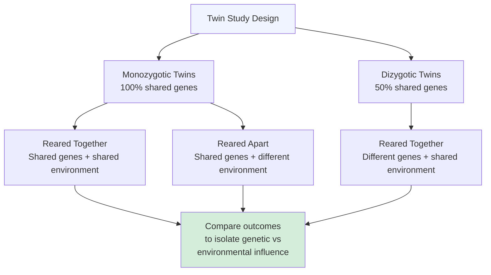
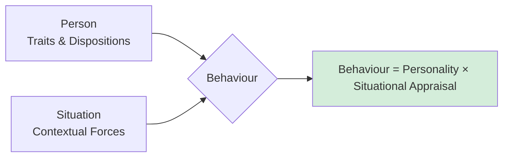
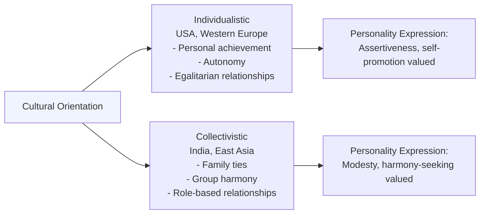

import Tabs from '@theme/Tabs';
import TabItem from '@theme/TabItem';

# Key Issues in Personality: Nature-Nurture, Person-Situation, and Cross-Cultural Debates

## Introduction

Beyond the grand theories of personality lie several fundamental debates that remain live and contested in personality psychology. These issues cut across theories and methods, raising questions about what personality is, how it develops, how consistent it is, and whether our frameworks for studying it are universally applicable.

This unit examines six major issues:
1. Genes and personality (nature vs. nurture)
2. The person-situation controversy
3. Interactionist approaches
4. Nomothetic vs. idiographic approaches
5. Cross-cultural issues
6. Debates about theoretical models

:::info Source
📄 [MPC-003 Block-1/Unit-4.pdf - Pages 55-72](/pdfs/MPC-003%20Personality%20Theories%20and%20Assessment/Block-1/Unit-4.pdf)
📚 MPC-003 Personality: Theories and Assessment, IGNOU
:::

---

## 🎬 Video Resources

- 📺 [**Nature vs. Nurture in Psychology** — Crash Course Psychology](https://www.youtube.com/watch?v=_wvuBtBMCOE) — The classic debate explained clearly (11 min)
- 📺 [**Person-Situation Debate** — Dr. Todd Grande](https://www.youtube.com/watch?v=Ke6qBHVz3hA) — Mischel's challenge and the interactionist resolution (10 min)
- 📺 [**Cross-Cultural Psychology** — TED-Ed](https://www.youtube.com/watch?v=0-5aJhMgPyE) — How culture shapes personality and behaviour (8 min)

---

## 1. Genes and Personality: The Nature vs. Nurture Debate

### Historical Background

"Nature versus nurture" is probably the oldest issue in psychology — a term coined by English polymath **Francis Galton** regarding the influence of heredity and environment on development. The debate concerns the relative importance of inherent traits versus personal experiences in producing individual differences.

Two broad camps:
- **Nature theorists:** Genetic predispositions and biological instincts drive behaviour
- **Nurture theorists:** Behavioural aspects originate from environmental forces in upbringing

Modern consensus: both nature and nurture play crucial roles — a position known as **interactionism**.

> 📖 **Wikipedia**: [Nature versus nurture](https://en.wikipedia.org/wiki/Nature_versus_nurture) — The long-running debate in developmental psychology.

---

### The Nature Theory — Heredity

Scientists have demonstrated that traits like eye and hair colour are determined by specific genes. Nature theorists extend this to argue that more abstract traits — intelligence, personality, aggression, sexual orientation — are also encoded in DNA, giving rise to the concept of **behavioural genes**.

Evidence cited by nature theorists:
- Fraternal twins reared under the same environment still closely resemble each other more than non-twin siblings — suggesting genetic influence beyond shared environment
- Heritability of attitudes shows partial correlation with genetic factors

:::note Recent Research (2021)
A landmark genome-wide association study (GWAS) published in *Nature Human Behaviour* (2021) analysed data from over 1.5 million people and identified hundreds of genetic variants associated with personality traits, particularly neuroticism. The study confirmed that personality traits are highly polygenic — influenced by thousands of small-effect genetic variants rather than a few "personality genes."
:::

---

### The Nurture Theory — Environment

Nurture theorists argue that genetic tendencies ultimately do not matter — behavioural aspects originate entirely from environmental forces.

Key figures:
- **John Watson:** Demonstrated that disorders like phobia could be explained by classical conditioning
- **B.F. Skinner:** Proved human behaviour could be conditioned in the same way as animal behaviour

Evidence cited by nurture theorists: Even if reared apart, identical twins are not exactly the same — showing environment has a role.

---

### Twin Studies

Twin studies are the primary tool for resolving the nature-nurture argument.

> 📖 **Wikipedia**: [Twin study](https://en.wikipedia.org/wiki/Twin_study) — Research designs that use twins to separate genetic from environmental influences.

| Twin Type | Description | Use |
|-----------|-------------|-----|
| **Monozygotic (identical)** | Exact duplicate genotypes | Best indicator of biological dispositions |
| **Dizygotic (fraternal)** | Share 50% of genes | Comparison baseline for identical twins |

**Key findings:**

A study on attitude heritability among twins showed partial correlation between attitudes and genetic factors. Non-shared environmental experiences were the strongest cause of attitude variances — overshadowing both genetic predispositions and shared environment (Olson et al., 2001).

A Swedish study on extraversion and neuroticism among twin pairs found that genotype-environment interaction is crucial. Two types were identified:
- **Type I:** Environment plays a more significant role with low-scoring genotypes
- **Type II:** Environment has more impact on high-scoring genotypes

---

### Infant Shyness — Adoption Studies

An adoption study investigated why some infants are open and responsive while others are withdrawn. Key finding:
- In non-adoptive families, parents with high shyness rates had shy infants
- Biological mothers who rated high on shyness had their adopted-away babies also rated as shy
- This suggests a **genetic link to shyness** even across different family environments (Daniels and Plomin, 1985)

---

### Antisocial Personality Disorder — Adoption Studies

Research on children at risk for antisocial personality disorder revealed:
- Antisocial personality disorder is more prevalent in adopted children with biological risk factors
- If both biological and adoptive parents have criminal backgrounds, there is high incidence of criminal tendencies in offspring
- Interpretation is difficult because adoptive environments may simulate biological environments

---

### Family Studies

Family studies identify the degree of risk of developing mental disorders among relatives. Less valid than twin and adoption studies, they use molecular genetic methods (DNA analysis from blood samples) to project observed behavioural outcomes.

:::note Current Heritability Estimates
Contemporary research (meta-analyses across 50+ years of twin studies) estimates **heritability of personality traits at approximately 40–60%** (Vukasović & Bratko, 2015, *Psychological Bulletin*). Extraversion and Neuroticism tend to show the highest heritability (~50%), while Agreeableness and Conscientiousness show somewhat lower heritability (~40%).
:::

---

## 2. The Person-Situation Controversy

### Mischel's Challenge (1968)

The person-situation debate was sparked by **Walter Mischel's** 1968 book targeting the trait approach. His argument:
1. Literature review shows personality traits only correlate about **.30** with behaviour in a given situation
2. Cross-situational consistency of behaviour is also only **.20–.30**
3. Conclusion: **Situations, not personality traits, are better predictors of behaviour**

> 📖 **Wikipedia**: [Person–situation debate](https://en.wikipedia.org/wiki/Person%E2%80%93situation_debate) — The classic controversy in personality psychology.

---

### The Response from Trait Psychologists

Personality psychologists argued that low personality-behaviour correlations do not prove situational variables are more valuable. Further research found the actual personality-behaviour relationship to be higher than **.40**.

**Epstein (1983):** Although traits do not predict single behaviours, they are good at predicting **aggregates** of behaviour.

A hypothetical study by Brody and Ehrlichman (1998) demonstrated this:
1. Measured behaviour in 20 situations relevant to conscientiousness
2. Divided situations into two groups of 10
3. Aggregated behavioural indices showed meaningful correlation
4. Conclusion: **Personality is a stronger predictor of behaviour across situations** — though not a strong predictor of behaviour at a specific moment in a specific situation

---

### The Behavioural Consistency Controversy

Hartshorne and May (1928) conducted a classic study on honesty in children. Result: Children were not consistently honest or dishonest; they were **situation-specific** in their behaviour.

Later (1985), Mischel modified his position: people do exhibit **consistent modes of responding**, but consistency appears especially in situations where people behave characteristically.

---

### Resolution: The Interactionist Approach

The debate ultimately led to a synthesis: **Behaviour = Personality × Appraisal of the situation**

Key insights from the resolution:
- **High self-monitors** adapt more to situations — showing less cross-situational consistency
- Traits do not produce consistent behaviour in every situation, but emerge in particular situational contexts
- Personality is predictive of behaviour distributions over time, even if not at specific moments
- **Situations and traits have roughly equivalent predictive power** (correlations of 0.36–0.42 each)

The Milgram obedience experiments illustrate situational power: 65% of ordinary people administered apparent electric shocks when instructed by authority figures — far beyond what experts predicted. This shows how strong situational forces can override personality-based predictions.

**New definition of personality:** Personality is one's pattern of **behavioural stability and change** arising from the unique combination of having certain traits and being in certain situations.

:::note Recent Research (2020)
A large-scale longitudinal study (Bleidorn et al., 2020, *Journal of Personality and Social Psychology*) following over 14,000 people across 20 years found that personality traits show **rank-order stability** of approximately 0.65 over long periods — confirming that people do have consistent traits, while also showing meaningful situational variability. The study supports the interactionist view: traits are real and stable, but situations substantially moderate their expression.
:::

---

## 3. Nomothetic vs. Idiographic Approaches

### Nomothetic Approach

Nomothetic approaches see personality as **constant, hereditary, and resistant to change**, with minimal environmental influence. The goal is to discover **universal principles** that apply across all people.

- Relies on quantitative research methods: self-report questionnaires, psychometric testing, experiments, correlational studies
- Describes people in terms of common trait dimensions that can be measured across populations
- Allport (1934) identified this approach — though he used it alongside the idiographic approach

Example: Factor analysis of the Big Five across thousands of people — identifying universal dimensions of personality.

### Idiographic Approach

The idiographic approach regards every individual as a **unique system** that must be independently analysed. No general laws beyond the individual are considered primary.

- Relies on qualitative methods: case studies, informal interviews, unstructured observation, personal documents
- Each person's unique pattern of cardinal, central, and secondary traits is the focus
- Championed by **Allport** as essential for truly understanding persons

Example: In-depth case study of a single individual — analysing their unique configuration of traits, life history, and personal documents (Allport's study of "Jenny" through her personal letters).

### Comparison

| Feature | Nomothetic | Idiographic |
|---------|-----------|-------------|
| Goal | Universal laws | Understanding the individual |
| Methods | Quantitative (surveys, experiments) | Qualitative (case studies, interviews) |
| Unit of analysis | Groups and populations | Single individuals |
| Nature of traits | Common dimensions | Unique personal dispositions |
| Example | Big Five factor analysis | Allport's "Letters from Jenny" |

> 📖 **Wikipedia**: [Nomothetic and idiographic](https://en.wikipedia.org/wiki/Nomothetic_and_idiographic) — The philosophical distinction between universal laws and individual understanding.

The two approaches are **complementary rather than mutually exclusive** — personality science benefits from both universal frameworks and deep individual understanding.

---

## 4. Cross-Cultural Issues

> 📖 **Wikipedia**: [Cross-cultural psychology](https://en.wikipedia.org/wiki/Cross-cultural_psychology) — The study of similarities and differences in psychological functioning across cultures.

Personality and culture are deeply interwoven yet their relationship is complex. Culture is not the sole determiner of personality, but it significantly shapes its expression.

**Individualism vs. Collectivism** (Hofstede, 2001) is one major framework:

Caution: Applying the individualism-collectivism framework to individuals risks **stereotyping** — it describes cultural tendencies, not individual characteristics.

:::note Indian Context
India presents a unique context for personality research. Traditional Indian concepts of the self (rooted in Hindu philosophy) emphasise the **interdependent self** embedded in family and community — contrasting sharply with the Western independent self. Research by Sinha and colleagues (2004) has documented how collectivistic values shape personality expression in Indian populations, with implications for the validity of Western personality tests used in Indian clinical and organisational settings.
:::

### The Five Factor Model Across Cultures

Lexical studies of personality trait adjectives from different languages have shown mixed results:
- **E (Extraversion), A (Agreeableness), and C (Conscientiousness)** almost always appear across cultures
- **N (Neuroticism) and O (Openness)** sometimes disappear from non-Western language studies

:::note Recent Research (2023)
A 2023 cross-cultural study in *Nature Human Behaviour* (Lukaszewski et al.) across 62 countries found robust cross-cultural evidence for all Big Five dimensions, but noted significant **mean-level differences** in trait scores across cultures. Asian cultures showed lower Extraversion and Openness on average, while African cultures showed higher Conscientiousness — challenging assumptions about universal personality baselines.
:::

---

## 5. Issues Relating to Theoretical Models

Each major personality theory offers a partial but incomplete view:
- **Psychoanalytic theory:** Emphasises intra-psychic processes and the conscious-unconscious distinction
- **Behaviourist model:** Rejects inner processes; emphasises learning and environment
- **Humanistic model:** Focuses on growth, meaning, and self-actualisation

No single model captures all aspects of personality — and features of each model may be redundant, irrelevant, or invalid when viewed from another model's perspective. The need for an **eclectic model** that integrates valid features of multiple approaches is widely recognised.

### Eight Fundamental Theoretical Debates

| Debate | Position A | Position B |
|--------|-----------|-----------|
| 1. Free will vs. Determinism | Intrinsic freedom guides behaviour | Ultimately determined forces control behaviour |
| 2. Uniqueness vs. Universality | Each person is unique | Universal behavioural patterns exist |
| 3. Physiological vs. Purposive Motivation | Pushed by biological needs | Pulled by goals, values, principles |
| 4. Conscious vs. Unconscious Motivation | Conscious forces determine behaviour | Unconscious forces are primary |
| 5. Stage vs. Non-Stage Development | Predetermined genetic stages | Continuous flexible development |
| 6. Cultural Determinism vs. Transcendence | Personality moulded by culture | Transcendence beyond cultural forces |
| 7. Early vs. Late Personality Formation | Fixed in early childhood | Flexible throughout adulthood |
| 8. Optimism vs. Pessimism | Humans are basically good | Humans are basically bad |

---

## Summary

The major issues in personality psychology remain productive tensions rather than resolved disputes. Key conclusions:

- **Nature and nurture both matter** — interactionism is the dominant modern view; heritability of personality traits is approximately 40–60%
- **Both person and situation matter** — behaviour = personality × situational appraisal; neither alone is sufficient
- **Nomothetic and idiographic approaches are complementary** — universal frameworks and individual case studies both contribute
- **The Big Five appears cross-culturally robust** for E, A, and C — but N and O show cultural variation
- **No single theory is complete** — an eclectic, integrative approach is needed

---

## 🌐 External Resources

- 📰 [**Nature vs Nurture Debate** — Simply Psychology](https://www.simplypsychology.org/naturevsnurture.html) — Clear summary of the debate with research evidence
- 📰 [**Person-Situation Debate in Personality Psychology** — Verywell Mind](https://www.verywellmind.com/the-person-situation-debate-2795396) — Accessible overview of Mischel's challenge and its resolution
- 📰 [**Cross-Cultural Research on the Big Five** — APA](https://www.apa.org/pubs/journals/features/psp-0000141.pdf) — Key cross-cultural findings on personality dimensions
- 📖 [**Behavioural genetics** — Wikipedia](https://en.wikipedia.org/wiki/Behavioural_genetics) — How genes and environment interact to shape personality
- 📖 [**Idiographic vs Nomothetic** — Wikipedia](https://en.wikipedia.org/wiki/Nomothetic_and_idiographic) — The philosophical foundations of these approaches
- 🔬 [**Human Genome Project and Personality** — NIH](https://www.genome.gov/human-genome-project) — Ongoing research on genes and behaviour

---

## 🧠 Memory Aids

### Nature-Nurture Resolution — **GEI**
> **G**enes set predispositions · **E**nvironment shapes expression · **I**nteractionism is the answer

### Person-Situation Formula
> **B = P × S** — Behaviour = Personality × Situation  
> Neither alone is sufficient; both multiply together

### Nomothetic vs. Idiographic — **UNI vs UNI**
> **UNI**versal laws (Nomothetic) vs **UNI**que individuals (Idiographic)

### The 6 Key Issues — **GPI NTC**
> **G**enes (nature-nurture) · **P**erson-situation · **I**nteractionism · **N**omothetic-idiographic · **T**ranscultural issues · **C**onflicting theoretical models

### Eight Theoretical Debates — **FUP CSE CO**
> **F**ree will · **U**niqueness · **P**hysiological vs purposive · **C**onscious vs unconscious · **S**tage vs non-stage · **E**arly vs late · **C**ultural determinism · **O**ptimism vs pessimism

---

## ✅ Self-Assessment Questions

<Tabs>
<TabItem value="basic" label="Basic">

1. Explain the nature vs. nurture debate in personality psychology. What is the modern consensus?
2. How do twin studies help resolve the nature-nurture debate? Distinguish between monozygotic and dizygotic twins.
3. What did Mischel (1968) argue about personality traits and behaviour?
4. Distinguish between nomothetic and idiographic approaches to personality.
5. What is the individualism-collectivism framework?

</TabItem>
<TabItem value="intermediate" label="Intermediate">

6. How did trait psychologists respond to Mischel's challenge? What is the interactionist resolution?
7. State the formula for behaviour according to the interactionist approach and explain what each element represents.
8. What do cross-cultural studies of the Big Five show? Which factors are most and least culturally universal?
9. List and briefly explain four of the eight fundamental theoretical debates in personality psychology.

</TabItem>
<TabItem value="exam" label="Exam Focus">

10. "The person-situation controversy has been resolved in favour of interactionism." Critically evaluate this statement with reference to empirical evidence.
11. Compare and contrast the nomothetic and idiographic approaches to personality. Which approach is more valuable for clinical psychology, and why?
12. Discuss the cross-cultural validity of the Five Factor Model of personality. What are the implications for personality assessment in India?

</TabItem>
</Tabs>

---

## 🔗 Related Topics

- [Definition and Concept of Personality](/mpc-003/block-1/definition-concept-personality)
- [Type and Trait Approaches to Personality](/mpc-003/block-1/type-approaches-personality)
- [Personality Assessment Methods](/mpc-003/block-1/personality-assessment-methods)
- [Freud's Psychoanalytic Theory](/mpc-003/block-2/freud-psychoanalytic-theory)

---

**Source PDFs**:
- 📄 [Block-1/Unit-4.pdf - Pages 55-72](/pdfs/MPC-003%20Personality%20Theories%20and%20Assessment/Block-1/Unit-4.pdf)
- 📚 MPC-003 Personality: Theories and Assessment, IGNOU
