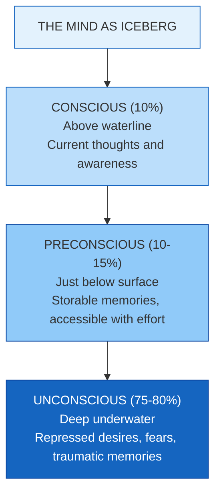
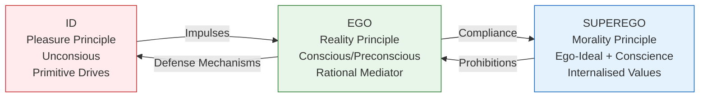
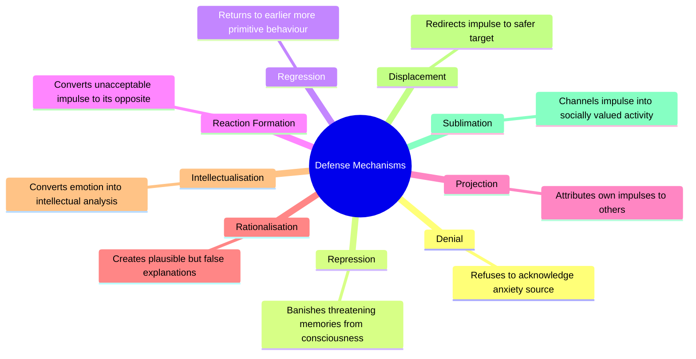

import Tabs from '@theme/Tabs';
import TabItem from '@theme/TabItem';

# Freud's Psychoanalytic Theory: Structure, Dynamics, and Development of Personality

> *"The mind is like an iceberg; it floats with one-seventh of its bulk above water."* — Sigmund Freud

Sigmund Freud's psychoanalytic theory stands as one of the most influential and controversial frameworks in the history of psychology. Developed between the 1890s and 1930s, it forms the cornerstone of the broader **psychodynamic perspective** — a family of theories that view human behaviour as shaped by the dynamic interplay of conscious and unconscious forces, early experiences, and competing internal drives.

---

**Source PDFs**:
- 📄 [Block-2/Unit-1.pdf - Pages 6-13](/pdfs/MPC-003%20Personality%20Theories%20and%20Assessment/Block-2/Unit-1.pdf)
- 📚 MPC-003 Personality Theories and Assessment

---

## 🎯 Learning Objectives

After studying this topic, you will be able to:
- Define the psychodynamic approach and distinguish it from Freudian psychoanalysis specifically
- Explain Freud's topographical model (conscious, preconscious, unconscious)
- Describe the three structures of personality: id, ego, and superego
- Analyse the role of defense mechanisms in managing anxiety
- Trace personality development through the five psychosexual stages
- Critically evaluate the merits and limitations of Freud's theory

---

## 1. The Psychodynamic Framework: Core Assumptions

The **psychodynamic approach** encompasses all theories that view human functioning through the lens of internal drives and forces — particularly unconscious ones. Freud's psychoanalysis was the *original* psychodynamic theory, later expanded and modified by Jung, Adler, Erikson, Karen Horney, Erich Fromm, and Sullivan.

Key assumptions shared across psychodynamic theories:

1. **Unconscious motivation**: Behaviour and feelings are powerfully shaped by unconscious forces
2. **Childhood primacy**: Adult personality and psychological problems are rooted in early childhood experiences
3. **Psychic determinism**: All behaviour has a cause (usually unconscious); nothing is truly accidental — even slips of the tongue (Freudian slips)
4. **Tripartite personality**: Personality consists of three parts: id, ego, and superego
5. **Instinctual drives**: Behaviour is motivated by Eros (life/sex instinct) and Thanatos (death/aggression instinct)
6. **Intrapsychic conflict**: The unconscious id and superego are in constant conflict with the conscious ego

:::note Psychodynamic vs Psychoanalytic
The terms are often confused. Freud's theory is **psychoanalytic**; psychoanalysis is both a theory AND a therapy. **Psychodynamic** is the broader umbrella covering Freud *and* his successors.
:::

---

## 2. The Topographical Model: States of Consciousness

Freud's **topographical model** maps the mind into three levels of awareness. The classic metaphor is an iceberg:

### The Three Levels

**Conscious**: Whatever you are thinking about at this moment. It is immediate, limited, and transient. As you read these words, you are operating consciously.

**Preconscious (Subconscious)**: Memories and information not currently active but retrievable. If asked "What did you have for breakfast?", the answer moves from preconscious to conscious. These stored memories, wishes, and feelings can be recalled with effort.

**Unconscious**: The vast repository of material we are completely unaware of. This includes:
- Material that was *never* conscious (innate drives)
- Material that *was* conscious but caused so much anxiety it was **repressed** — pushed out of awareness
- Hostile feelings, taboo sexual cravings, desperate fears too threatening to consciously acknowledge

:::info The Iceberg Metaphor
Visible above water = Conscious (10%). Just below surface = Preconscious (10-15%). Deep underwater = Unconscious (75-80%). Unconscious material "leaks" into consciousness through dreams, slips of the tongue, and free association — which is why Freud used these as therapeutic tools.
:::

---

## 3. The Dynamic/Structural Model: Id, Ego, and Superego

Finding the topographical model insufficient, Freud proposed a **structural model** with three agencies of the mind engaged in perpetual conflict:

### 3.1 Id: The Primitive Core

The **id** is present from birth, entirely unconscious, and operates solely on the **pleasure principle** — seeking immediate gratification of needs without regard for reality or consequences. It houses both instinctual drives:

- **Eros** (life instinct): includes sexual drive (libido) and self-preservation
- **Thanatos** (death instinct): aggression and destructive impulses

The id cannot tolerate frustration; it demands satisfaction *now*.

### 3.2 Ego: The Reality Navigator

The **ego** develops from the id as the infant encounters the real world's limitations. It operates on the **reality principle** — it acknowledges reality's constraints while still trying to satisfy the id's desires. The ego involves perception, reasoning, and learning; planning and delay of gratification; and mediating between id demands, superego prohibitions, and external reality.

The ego is not purely conscious — parts of it operate preconsciously and unconsciously (especially defense mechanisms).

### 3.3 Superego: The Internal Moral Authority

The **superego** develops as children internalise parental values and societal norms. It has two components:

| Component | Function |
|-----------|----------|
| **Ego-ideal** | The model of ideal behaviour to aspire toward |
| **Conscience** | Creates guilt when moral standards are violated |

The superego can be harsh and punishing, creating neurotic guilt even for normal impulses. Like the ego, it spans all three consciousness levels.

---

## 4. Defense Mechanisms: The Ego's Toolkit

When conflict between id impulses and superego prohibitions produces **anxiety**, the ego deploys **defense mechanisms** — unconscious strategies to reduce that anxiety.

**Repression** is the foundational mechanism — it automatically banishes threatening material from consciousness. All other defenses build upon repression.

**Sublimation** was Freud's "highest" defense: channelling primitive drives into culturally valued creative or intellectual work. He believed great civilisational achievements resulted from effective sublimation of sexual and aggressive urges.

**Projection**: The unfaithful spouse who constantly accuses their partner of cheating is projecting their own guilt outward.

**Reaction Formation**: Marked by *excessive* behaviour in the opposite direction — as when a person deeply angry with their boss becomes excessively kind and courteous to them.

:::tip Exam Tip
Defense mechanisms are **unconscious** — the person using them is unaware they are doing so. This distinguishes them from conscious coping strategies.
:::

---

## 5. Psychosexual Development: Stages of Personality Formation

Freud proposed that personality develops through **five stages** tied to different erogenous zones. **Fixation** at any stage (due to excessive gratification or deprivation) leaves lasting personality effects.

| Stage | Age | Erogenous Zone | Fixation Effects |
|-------|-----|----------------|-----------------|
| **Oral** | Birth–18 months | Mouth | Dependence, smoking, overeating, sarcasm |
| **Anal** | 18 months–3 years | Anus | Retentive: orderly, controlling; Expulsive: messy, reckless |
| **Phallic** | 3–6 years | Genitals | Sexual deviancy, weak gender identity, neurosis |
| **Latency** | 6 years–puberty | None (dormant) | Social skills develop; relatively stable period |
| **Genital** | Puberty onwards | Genitals | Mature adult relationships; sexual maturity |

**The Oedipus Complex** (phallic stage): Boys develop unconscious sexual desire for mother and rivalry with father. Resolution through identification with father → forms masculine identity and superego. Girls' **Electra Complex** (desire for father) is resolved by identifying with mother.

:::tip Mnemonic
**O**ld **A**ge **P**eople **L**ike **G**irls = **O**ral, **A**nal, **P**hallic, **L**atency, **G**enital
:::

---

## 6. Critical Evaluation

### Merits
- First comprehensive theory linking personality, development, and psychopathology
- Revolutionised understanding of unconscious motivation
- Defense mechanism framework remains clinically invaluable
- Sparked the field of psychotherapy
- Highlighted profound importance of early childhood experiences

### Limitations
- Core constructs (id, libido) are not empirically measurable or falsifiable
- Case studies were small, retrospective, potentially selective
- Overemphasis on sexuality at the expense of social and cultural factors
- Gender bias — penis envy, Electra complex reflect Victorian patriarchal assumptions
- Psychic determinism allows little room for free will
- Role of environment and culture is underestimated

---

## 7. Contemporary Relevance

Despite criticisms, Freudian concepts have generated significant modern research:

Modern **cognitive neuroscience** has confirmed the existence of unconscious processing, though mechanisms differ from Freud's conception. Studies using priming, implicit memory, and subliminal perception demonstrate that much cognition occurs outside awareness.

The **Defence Style Questionnaire** operationalises Freud's mechanisms for empirical study. Research confirms that mature defenses (sublimation, humour) correlate with psychological wellbeing, while immature defenses (denial, projection) correlate with pathology.

Jonathan Shedler's (2010) meta-analysis in *American Psychologist* demonstrated that **psychodynamic therapy** has effect sizes comparable to other evidence-based therapies, giving empirical support to the clinical utility of the approach.

---

## 8. Indian Context

Psychoanalysis arrived in India in the 1920s through **Girindrasekhar Bose**, who founded the **Indian Psychoanalytic Society in 1922** — the first psychoanalytic society outside Europe or North America. Bose corresponded with Freud and proposed modifications, particularly suggesting that Indian patients showed different phenomenology around castration anxiety.

Contemporary Indian clinicians integrate psychodynamic concepts with cultural understanding: the joint family system shapes superego development differently than nuclear Western families; filial piety and parental authority influence Oedipal dynamics differently; and concepts of *dharma* (duty) function as powerful superego-like structures.

---

## 📚 External Resources

### Wikipedia
- 🌐 [Sigmund Freud](https://en.wikipedia.org/wiki/Sigmund_Freud) — Biography and intellectual legacy
- 🌐 [Psychoanalysis](https://en.wikipedia.org/wiki/Psychoanalysis) — Theory and therapy overview
- 🌐 [Defence mechanisms](https://en.wikipedia.org/wiki/Defence_mechanisms) — Comprehensive list with examples
- 🌐 [Psychosexual development](https://en.wikipedia.org/wiki/Psychosexual_development) — Stage descriptions and criticism

### Educational Videos
- 🎥 [Freud's Psychoanalytic Theory on Instincts — Crash Course Psychology #28](https://www.youtube.com/watch?v=ategNFa9e_I) — 12 min excellent overview
- 🎥 [Defense Mechanisms — Khan Academy](https://www.youtube.com/watch?v=r_Jln9y_jVk) — Animated explanations
- 🎥 [Psychosexual Stages of Development — Simply Psychology](https://www.youtube.com/watch?v=5aolFJoNe2I)

### Research Papers
- 📖 Shedler, J. (2010). The efficacy of psychodynamic psychotherapy. *American Psychologist*, 65(2), 98-109.
- 📖 Westen, D. (1999). The scientific status of unconscious processes. *Journal of the American Psychoanalytic Association*, 47(4), 1061-1106.
- 📖 Cramer, P. (2006). *Protecting the self: Defense mechanisms in action*. Guilford Press.
- 📖 Bornstein, R.F. (2005). Psychodynamic theory and personality disorders. *Journal of Personality Disorders*, 19(6), 560-575.

---

## 🧠 Memory Aids

**Psychosexual Stages**: "Old Age People Like Girls" → Oral, Anal, Phallic, Latency, Genital

**Defense Mechanisms "DRRRIPDS"**: Denial, Repression, Regression, Reaction formation, Intellectualisation, Projection, Displacement, Sublimation

**Id-Ego-Superego**: Id = "I want it NOW"; Ego = "Let's be realistic"; Superego = "That's wrong!"

---

## ✅ Self-Assessment Questions

**Q1: What are the core assumptions of psychodynamic theory? How does psychoanalysis differ from the broader psychodynamic approach?**

Psychodynamic theories share five core assumptions: (1) unconscious motivation shapes behaviour; (2) childhood experiences determine adult personality; (3) psychic determinism — all behaviour is caused; (4) tripartite personality structure; (5) instinctual drives fuel behaviour. **Psychoanalysis** specifically refers to Freud's theory and therapeutic method. **Psychodynamic** is the broader category encompassing Freud plus successors (Adler, Jung, Erikson, Horney, Sullivan, etc.) who modified his core ideas.

**Q2: Explain the structural model. How do id, ego, and superego interact to shape behaviour?**

The **id** (primitive, unconscious, pleasure principle) generates impulses demanding immediate satisfaction. The **superego** (internalised morality) sets ideals and triggers guilt for violations. The **ego** (reality principle) mediates between id demands and superego prohibitions while negotiating reality. When id impulses conflict with superego prohibitions, anxiety results. The ego deploys defense mechanisms to manage this anxiety.

**Q3: Distinguish between repression and sublimation. Why did Freud consider sublimation most adaptive?**

**Repression** automatically banishes threatening impulses from consciousness — the material remains unresolved, exerting underground influence. **Sublimation** transforms unacceptable impulses into socially valued activities (e.g., aggression → competitive sport). Freud considered sublimation most adaptive because it discharges psychic energy, satisfies the drive in modified form, AND produces social value. Repression merely hides the drive, which continues pressing for expression through symptoms and dreams.

**Q4: What is the Oedipus complex? How does its resolution shape personality development?**

During the **phallic stage** (ages 3-6), boys develop unconscious sexual desire for their mother and see the father as a rival. Fearing castration by the powerful father, the boy resolves this by **identifying with the father** — adopting masculine identity and internalising paternal values. This identification is crucial for gender identity formation and superego development. Girls undergo the Electra complex, resolved through identification with the mother.

**Q5: What are the main criticisms of Freud's theory? Which aspects are supported by modern research?**

**Main criticisms**: unfalsifiable constructs; overemphasis on sexuality; gender bias; small clinical samples; no operational definitions for psychic energy; cultural bias. **Modern support**: cognitive neuroscience confirms unconscious processing (though mechanisms differ). Research on implicit memory supports non-conscious influence on behaviour. Defence Style Questionnaire research confirms mature defenses predict wellbeing. Psychodynamic therapy has demonstrated efficacy in meta-analyses (Shedler, 2010).

---

## 🔗 Cross-References

- [Karen Horney's Personality Theory](/mpc-003/block-2/karen-horney-personality-theory) — Neo-Freudian critique and reformulation
- [Trait Theories of Personality](/mpc-003/block-1/allport-cattell-trait-theories) — Alternative approaches
- [Personality Assessment Methods](/mpc-003/block-1/personality-assessment-methods) — Projective techniques rooted in psychoanalysis
