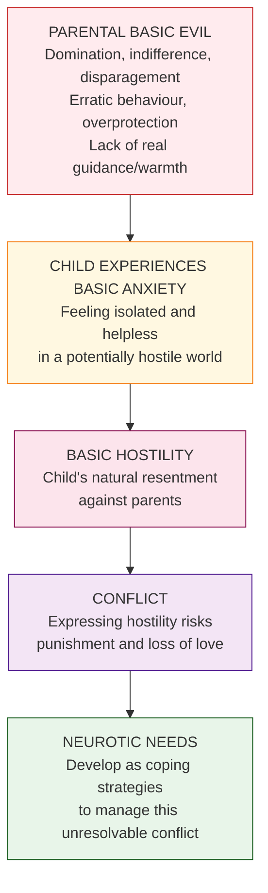
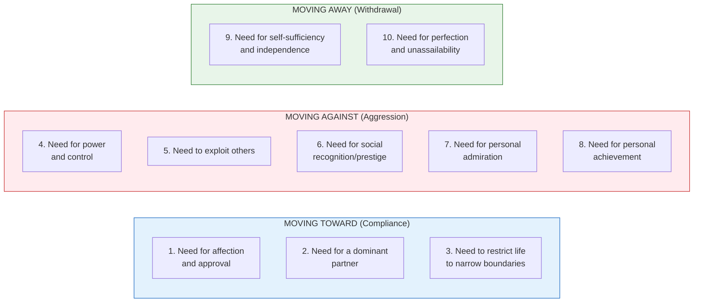
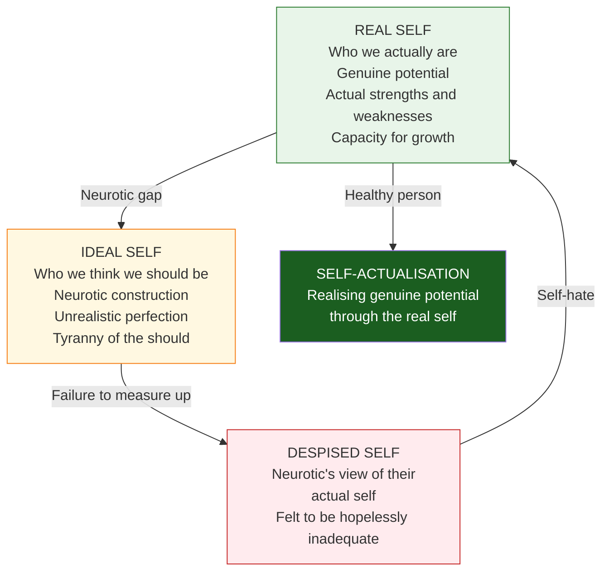

# Karen Horney's Social Foundation of Personality: Basic Anxiety, Neurotic Needs, and the Self

> *"The perfect normal person is rare in our culture."* — Karen Horney

Karen Horney (1885–1952) stands as one of the most significant neo-Freudian thinkers in the history of personality psychology. Where Freud emphasised biology and instincts, Horney redirected attention to **social and cultural forces** as the primary shapers of personality — particularly those that generate neurosis. Her work was simultaneously a critique of Freudian orthodoxy and a constructive reformulation that remains highly relevant in contemporary clinical practice.

---

**Source PDFs**:
- 📄 [Block-2/Unit-1.pdf - Pages 13-18](/pdfs/MPC-003%20Personality%20Theories%20and%20Assessment/Block-2/Unit-1.pdf)
- 📚 MPC-003 Personality Theories and Assessment

---

## 🎯 Learning Objectives

After studying this topic, you will be able to:
- Identify key biographical factors that shaped Horney's theoretical perspective
- Define basic anxiety and explain its origins in childhood parent-child relationships
- List and categorise the ten neurotic needs into three coping strategies
- Distinguish between Horney's "real self" and "ideal self"
- Evaluate Horney's contributions and limitations
- Compare Horney's theory with Freud's psychoanalytic approach

---

## 1. Biographical Context and Intellectual Background

Karen Horney was born in Hamburg, Germany in 1885 and began her psychoanalytic career at the **Berlin Institute for Psychoanalysis**, where Karl Abraham considered her one of his most gifted analysts. After emigrating to the United States, she served as Associate Director of the Chicago Institute for Psychoanalysis and later in New York, where she became colleagues with Erich Fromm and Harry Stack Sullivan.

By 1941, Horney's dissatisfaction with orthodox Freudian approaches led her to establish the **American Institute for Psychoanalysis** and found the *American Journal of Psychoanalysis*. She taught and practised until her death in 1952.

### Her Critique of Freud

Horney was among the most incisive critics of Freudian theory:

- **Penis envy**: Horney argued this reflected not a biological reality but women's justified resentment of men's social power. She proposed **womb envy** as equally valid — men's drive for achievement partly compensates for their inability to bear children
- **Oedipus complex**: Rather than a universal biological phenomenon, Horney argued the child's clinging to one parent and jealousy of the other results from **anxiety** caused by disturbed parent-child relationships
- **Female psychology**: As one of the first female psychiatrists, she pioneered feminine psychiatry, presenting the first paper on the topic and compiling 14 papers into *Feminine Psychology* (1967)

---

## 2. Basic Anxiety: The Foundation of Neurosis

**Basic anxiety** is the cornerstone concept in Horney's theory — the psychological engine that drives all neurotic development.

### Definition

Basic anxiety refers to the feeling a child has of being **isolated and helpless in a potentially hostile world**. It is not caused by specific traumatic events but by the general *atmosphere* of the parent-child relationship.

### The "Basic Evils" That Generate Basic Anxiety

Horney catalogued the adverse parental behaviours that instil basic anxiety in children:

- Direct or indirect domination
- Erratic, unpredictable behaviour
- Lack of respect for the child's individual needs
- Lack of real guidance or warmth
- Disparaging attitudes and absence of admiration
- Too much or too little responsibility assigned
- Overprotection or isolation from peers
- Injustice, discrimination, and unkept promises
- Hostile atmosphere, taking sides in parental disagreements

:::note Key Distinction from Freud
Freud located the source of neurosis in **biological instincts** (Oedipus complex, libidinal fixation). Horney located it in **interpersonal relationships** — specifically, the quality of early parent-child interaction. This shift from biology to culture is Horney's most fundamental contribution.
:::

---

## 3. The Ten Neurotic Needs

From her extensive clinical experience, Horney identified **ten neurotic needs** — exaggerated, distorted versions of universal human needs. What makes them neurotic is not the need itself but its **intensity, rigidity, and unrealistic nature**.

### The Ten Neurotic Needs Detailed

**1. Need for affection and approval** — Indiscriminate need to please everyone and be liked. The neurotic expects affection from *everyone*, at *all times*, in *all circumstances*. Any hint of disapproval triggers intense panic.

**2. Need for a dominant partner** — Belief that love will solve all problems; extreme dependency on one person to take over one's life. Normal desire for partnership becomes desperate need for rescue.

**3. Need to restrict life to narrow boundaries** — Driven need to be inconspicuous, satisfied with little, undemanding. A retreat from the complexity of life.

**4. Need for power and control** — Dominance for its own sake; contempt for the weak; belief in the supremacy of one's rational powers. Power is sought to ward off helplessness, not for genuine leadership.

**5. Need to exploit others** — Manipulation and instrumental use of people; fear of being used or looking foolish. People who love practical jokes but cannot tolerate being the butt of one.

**6. Need for social recognition/prestige** — Overwhelmingly concerned with appearances, popularity, and status. Fear of being thought "uncool" or ignored.

**7. Need for personal admiration** — Compulsive need to be seen as important and extraordinary. "Nobody recognises genius" type. Fear of being thought ordinary.

**8. Need for personal achievement** — Obsession with being number one. Devalues anything they cannot excel in. Driven not by love of the activity but by terror of failure.

**9. Need for self-sufficiency and independence** — Pathological refusal to need anyone. Reluctance to commit to relationships; refuses help even when needed.

**10. Need for perfection and unassailability** — Driven to be above criticism; cannot tolerate making mistakes; needs to be in control at all times. The imposter syndrome of perpetual self-correction.

---

## 4. Three Coping Strategies: Compliance, Aggression, Withdrawal

Horney observed that neurotic needs cluster into three broad **interpersonal orientations** or coping strategies — each representing a different way of relating to others to manage basic anxiety:

| Strategy | Direction | Needs Involved | Core Fear | Core Goal |
|----------|-----------|----------------|-----------|-----------|
| **Compliance** | Moving toward people | 1, 2, 3 | Abandonment, helplessness | Safety through love and approval |
| **Aggression** | Moving against people | 4, 5, 6, 7, 8 | Exploitation, weakness | Safety through power and control |
| **Withdrawal** | Moving away from people | 9, 10 | Dependency, vulnerability | Safety through self-sufficiency |

### 4.1 Compliance: The Self-Effacing Solution

Children who face **parental indifference** often respond with compliance — seeking safety through love and approval. Compliant people say: *"I should be sweet, self-sacrificing, saintly."*

They need affection from everyone, seek a partner to solve their problems, and restrict their life to avoid standing out. Their basic fear is abandonment; their strategy is to be so agreeable and self-effacing that no one could possibly reject them.

### 4.2 Aggression: The Expansive Solution

When indifference provokes **anger**, children respond aggressively — seeking safety through power over others. Aggressive people say: *"I should be powerful, recognised, a winner."*

They need to control, exploit, be admired, and dominate. Their contempt for weakness is partly a defense against their own feared helplessness. Success and recognition must be *relentlessly* maintained.

### 4.3 Withdrawal: The Resigning Solution

When neither compliance nor aggression resolves basic anxiety, children **withdraw** — seeking safety through detachment and self-sufficiency. Withdrawing people say: *"I should be independent, aloof, perfect."*

They cannot allow themselves to need others, must be beyond criticism, and maintain emotional distance as a shield against hurt.

:::info Normal vs Neurotic Orientation
Every person uses all three strategies at different times — this is healthy flexibility. The **neurotic** rigidly applies one strategy compulsively in all situations regardless of appropriateness. The healthy person *chooses* their interpersonal stance based on what the situation calls for.
:::

---

## 5. Theory of the Self: Real Self vs Ideal Self

Horney, sharing Maslow's humanistic vision, believed that **self-actualisation** — the realisation of one's genuine potential — is the core goal of human psychological life.

### The Real Self

The **real self** is who we actually are — with genuine potential for growth, happiness, realisation of gifts, but also real limitations and deficiencies. The healthy person acknowledges the real self and works to actualise its genuine capacities.

### The Ideal Self

The **ideal self** is the neurotic construction of who we *should* be — a perfectionistic, unrealistic image driven by the **"tyranny of the should"**. Horney's famous phrase captures the cruel demands the neurotic imposes on themselves:

- The compliant person: "I should be sweet, saintly, never angry"
- The aggressive person: "I should be the best, recognised, never weak"
- The withdrawing person: "I should be perfectly independent, need no one"

### The Neurotic Cycle

When the real self fails to match the ideal self (as it inevitably must), the neurotic does not revise the ideal — they **devalue the real self** into a *despised self*. The person then oscillates between grandiose fantasies of the ideal self and crushing self-hatred of the despised self, never finding rest in the actual real self. Horney called this the "search for glory" — a hopeless quest that prevents authentic self-actualisation.

---

## 6. Evaluation of Horney's Theory

### Contributions and Strengths

- **Cultural emphasis**: Redirected personality theory from biology toward social and cultural determinants, anticipating later cultural psychology
- **Gender equity**: Challenged Freudian male-centric assumptions; proposed womb envy as counterpart to penis envy; pioneered feminine psychiatry
- **Humanistic integration**: Bridged psychodynamic and humanistic perspectives through her concept of self-actualisation
- **Clinical utility**: Neurotic needs framework remains therapeutically valuable, particularly in understanding character disorders
- **Social relationships**: Foreshadowed interpersonal psychiatry (Sullivan), attachment theory (Bowlby), and relational psychoanalysis

### Limitations

- **Limited scope**: Theory focused primarily on neurosis, leaving out psychosis and genuinely healthy personality
- **Cultural bias**: Theories developed primarily from middle-class American patients
- **Lack of empirical operationalisation**: Neurotic needs were clinically derived rather than empirically validated
- **Optimism bias**: Her humanistic assumption that people naturally strive toward health may be too optimistic

---

## 7. Horney vs Freud: A Comparative Analysis

| Dimension | Freud | Horney |
|-----------|-------|--------|
| **Primary cause of neurosis** | Biological instincts (Oedipus, libidinal fixation) | Social/cultural forces (basic anxiety from parent-child relationship) |
| **Oedipus complex** | Universal, biological, sexually driven | Result of anxiety from disturbed parent-child relationship |
| **Penis envy** | Universal female experience | Occasional neurotic symptom; womb envy equally real in men |
| **Personality structure** | Id, ego, superego as fixed structures | Moving toward/against/away as dynamic interpersonal orientations |
| **Gender** | Male-centric; female psychology as deviation | Gender differences culturally constructed |
| **Psychotherapy goal** | Insight into unconscious conflicts | Authentic self-actualisation through the real self |
| **View of human nature** | Pessimistic (drives vs civilization) | Cautiously optimistic (natural drive toward growth) |

---

## 8. Contemporary Relevance and Research

Horney's influence pervades several modern therapeutic approaches:

**Cognitive Therapy**: Karen Horney's "tyranny of the should" directly anticipated Aaron Beck's cognitive distortions and Albert Ellis's *musturbation* (irrational "should" statements). Her neurotic needs map onto cognitive schemas.

**Attachment Theory**: Horney's three coping orientations (compliance/aggression/withdrawal) parallel Bowlby and Ainsworth's attachment styles (anxious-preoccupied, dismissive-avoidant, fearful-avoidant).

**Self-Psychology**: Kohut's concepts of the idealised self and the need for mirroring echo Horney's real vs ideal self.

🔬 **Research**: Coolidge et al. (2001) found empirical support for Horney's three orientations using personality questionnaires, suggesting they capture meaningful dimensions of interpersonal behaviour.

📄 **Key paper**: Paris, B.J. (1994). *Karen Horney: A Psychoanalyst's Search for Self-Understanding*. Yale University Press.

📄 **Key paper**: Millon, T. (2004). Masters of the mind: Exploring the story of mental illness. *Wiley* — includes substantial analysis of Horney's contributions to personality disorders theory.

---

## 9. Indian Cultural Context

Horney's emphasis on cultural factors in personality formation is particularly relevant to Indian psychology:

- **Collectivist values vs neurotic compliance**: In Indian family systems, self-effacement and compliance are *culturally valorised*, not necessarily neurotic. Distinguishing culturally appropriate compliance from neurotic compliance requires cultural sensitivity.
- **Joint family dynamics**: Extended family hierarchies can amplify basic anxiety through complex authority structures, divided loyalties, and competing demands.
- **Gender and womb envy**: Horney's concept of men's envy of women's reproductive capacity resonates with Indian cultural practices celebrating fertility and motherhood (e.g., *Mata*-worship, fertility rituals).
- **Arranged marriage and neurotic need for a partner**: The second neurotic need (partner will solve all problems) takes a culturally specific form when marriage is expected to provide complete personal fulfilment.

---

## 📚 External Resources

### Wikipedia
- 🌐 [Karen Horney](https://en.wikipedia.org/wiki/Karen_Horney) — Biography and theoretical overview
- 🌐 [Neurosis](https://en.wikipedia.org/wiki/Neurosis) — Historical and contemporary definitions
- 🌐 [Self-actualisation](https://en.wikipedia.org/wiki/Self-actualisation) — Humanistic psychology context
- 🌐 [Neo-Freudianism](https://en.wikipedia.org/wiki/Neo-Freudianism) — Horney's place in the broader movement

### Educational Videos
- 🎥 [Karen Horney's Theory of Neurosis — Psychology Unlocked](https://www.youtube.com/watch?v=IbpX1KwAOtw) — 15 min accessible overview
- 🎥 [Neo-Freudian Theories — Crash Course Psychology](https://www.youtube.com/watch?v=i8nkxHLVp5E) — Includes Horney alongside Adler and Jung
- 🎥 [Karen Horney: Basic Anxiety and Neurotic Needs — MedCircle](https://www.youtube.com/watch?v=BnPBsP5bDCo)

### Research Papers
- 📖 Paris, B.J. (2011). Horney and Maslow: Humanistic psychoanalysis. *American Journal of Psychoanalysis*, 71(2), 103-107.
- 📖 Coolidge, F.L. et al. (2001). Horney's three neurotic trends: Towards a measure for moving against, away and toward. *Personality and Individual Differences*, 31(4), 479-488.
- 📖 Rubins, J.L. (1978). *Karen Horney: Gentle rebel of psychoanalysis*. Dial Press.
- 📖 Miletic, M.P. (2002). The introduction of a feminine psychology to psychoanalysis. *Contemporary Psychoanalysis*, 38(2), 287-310.

---

## 🧠 Memory Aids

### The Three Coping Strategies: "CAW" (Like a crow's call)
**C**ompliance (Moving Toward) — **A**ggression (Moving Against) — **W**ithdrawal (Moving Away)

### Neurotic Needs Numbers
Compliance: Needs **1, 2, 3** (the "small" numbers — shrinking, small, self-effacing)
Aggression: Needs **4, 5, 6, 7, 8** (the "big" numbers — power, prestige, achievement)
Withdrawal: Needs **9, 10** (the "high" numbers — self-sufficient, perfect)

### Horney vs Freud Core Distinction
**Freud**: Personality shaped by **Biology** (instincts, libido, Oedipus)
**Horney**: Personality shaped by **Culture** (anxiety, social relationships, parenting)

---

## ✅ Self-Assessment Questions

**Q1: What is basic anxiety? How does it differ from Freudian anxiety?**

**Basic anxiety** (Horney) is the child's pervasive feeling of being isolated and helpless in a potentially hostile world, arising from parental indifference, domination, or erratic behaviour — i.e., from disturbed *interpersonal relationships*. **Freudian anxiety** arises from intrapsychic conflict between id impulses and superego prohibitions, or from realistic external threats. The key difference: Freud's anxiety is rooted in biology and inner drives; Horney's is rooted in the social/cultural environment, specifically the quality of parent-child relationships.

**Q2: Describe Horney's three coping strategies. How does the healthy person differ from the neurotic in using these strategies?**

Horney identified three strategies for managing basic anxiety: **Compliance** (moving toward people — seeking safety through love and approval), **Aggression** (moving against people — seeking safety through power and control), and **Withdrawal** (moving away from people — seeking safety through self-sufficiency). A **healthy person** flexibly uses all three strategies as situations require — being cooperative when helpful, assertive when necessary, and self-reliant when appropriate. A **neurotic** rigidly applies *one* strategy compulsively in *all* situations, regardless of whether it fits, because their anxiety drives them to maintain one interpersonal mode as protection against overwhelming fear.

**Q3: Explain the "tyranny of the should" and its role in neurotic suffering.**

The **"tyranny of the should"** refers to the relentless, harsh internal demands neurotic individuals impose on themselves based on their idealised self-image. The compliant neurotic says "I should always be sweet and saintly"; the aggressive neurotic says "I should always be dominant and successful"; the withdrawing neurotic says "I should be perfectly independent." Because these demands are unrealistic and perfectionist, the real self inevitably fails to meet them. Rather than revising the impossible ideals, the neurotic degrades their actual self into a **despised self** — an internalised self-hatred. This oscillation between a grandiose ideal self and a contemptible despised self prevents authentic self-actualisation.

**Q4: How does Horney's criticism of the Oedipus complex represent a broader difference in her theory from Freud's?**

Freud saw the Oedipus complex as a **universal biological phenomenon** arising from innate sexual drives — the boy's libidinal desire for his mother and castration fear of his father. Horney reinterpreted this as a **social/relational phenomenon**: the child's clinging to one parent and rivalry with the other reflects anxiety caused by disturbed parent-child relationships, not innate sexuality. This reinterpretation exemplifies Horney's broader project: replacing Freud's biological determinism with social and cultural explanations. For Horney, what shapes personality is not which erogenous zone is being frustrated but how parents treat the child emotionally.

**Q5: Evaluate Horney's concept of the real self vs ideal self. How does this relate to contemporary psychology?**

Horney argued the **real self** contains genuine potential for growth and self-actualisation, while the **ideal self** is a neurotic, perfectionist construction that the real self can never match. Neurosis results when the real self is abandoned in pursuit of the impossible ideal, creating a despised self of self-hatred. This framework anticipates: (1) **Cognitive therapy's** irrational beliefs and "should" statements (Ellis, Beck); (2) **Self-discrepancy theory** (Higgins, 1987) distinguishing actual, ideal, and ought selves; (3) **Self-compassion research** (Neff, 2003) showing that harsh self-judgment correlates with psychopathology. Horney's clinical insight has thus found empirical validation in multiple subsequent research programmes.

---

## 🔗 Cross-References

- [Freud's Psychoanalytic Theory](/mpc-003/block-2/freud-psychoanalytic-theory) — The foundation Horney built upon and critiqued
- [Sullivan's Interpersonal Theory](/mpc-003/block-2/sullivan-interpersonal-theory-personality) — Parallel emphasis on social relationships
- Maslow's Humanistic Approach (MPC-003 Block-3, coming soon) — Shared emphasis on self-actualisation
- [Personality Assessment Methods](/mpc-003/block-1/personality-assessment-methods) — Clinical techniques rooted in dynamic traditions
