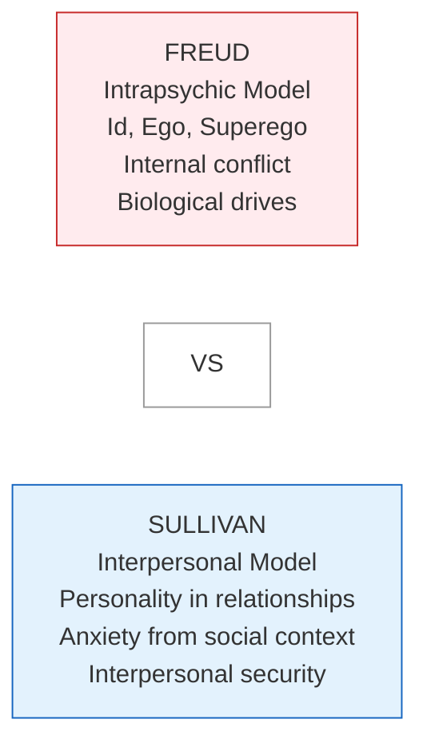
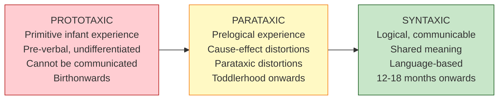
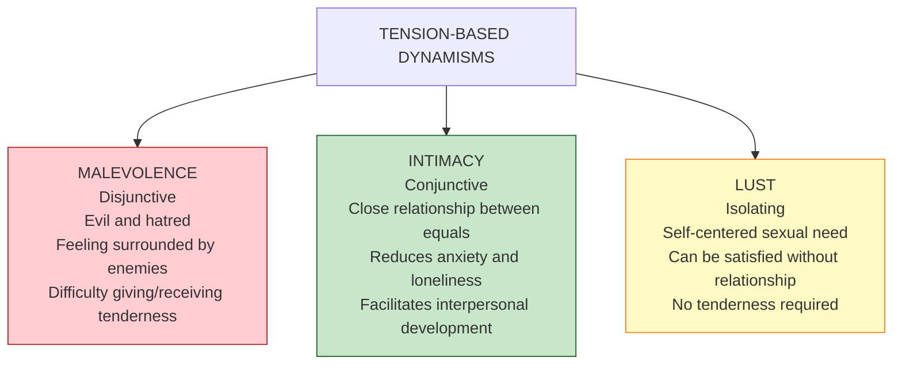
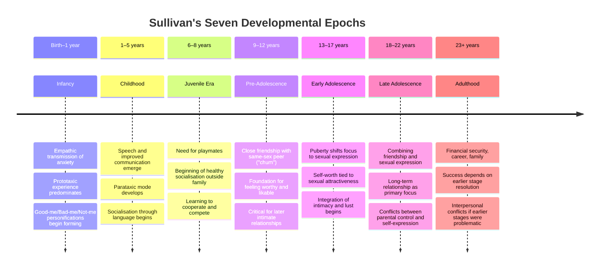

# Sullivan's Interpersonal Theory of Personality: Dynamics, Enduring Aspects, and Developmental Epochs

> *"The basic need of all people is for interpersonal security — the freedom from anxiety in relating to others."* — Harry Stack Sullivan

Harry Stack Sullivan (1892–1949) developed one of the most original and distinctive approaches to personality psychology. While Freud asked *what goes on inside* people, Sullivan asked *what goes on between* people. His **interpersonal theory of psychiatry** fundamentally repositioned personality as an interpersonal — not intrapsychic — phenomenon, making him a pivotal figure in the shift toward relational and social approaches to psychology.

---

**Source PDFs**:
- 📄 [Block-2/Unit-1.pdf - Pages 19-24](/pdfs/MPC-003%20Personality%20Theories%20and%20Assessment/Block-2/Unit-1.pdf)
- 📚 MPC-003 Personality Theories and Assessment

---

## 🎯 Learning Objectives

After studying this topic, you will be able to:
- Explain Sullivan's core claim that personality is fundamentally interpersonal
- Describe the dynamics of personality: tensions, needs, anxiety, and levels of cognition
- Define and distinguish dynamism, self-system, and personification
- Trace personality development through Sullivan's seven developmental epochs
- Compare Sullivan's epochs with Freud's psychosexual stages
- Evaluate the strengths and limitations of Sullivan's interpersonal theory

---

## 1. The Interpersonal Foundation: A Radical Reframing

Sullivan's most fundamental contribution is a **conceptual reframing** of what personality is and how it should be studied:

> "Personality is a hypothetical entity that cannot be observed or studied apart from interpersonal situations wherein it is made manifest."

For Sullivan, personality does not exist inside the person as some internal structure to be mapped. It exists **only in the spaces between people** — in the patterns of relating that emerge across interpersonal situations. This means:

- The unit of psychological study is not the **individual** but the **interpersonal situation**
- Personality can only be known through **interpersonal interactions**
- Psychiatric problems are fundamentally disturbances in **relationships**, not in internal structures

This represents a direct counterpoint to Freud's drive model (all about internal biology) and anticipates modern **relational psychoanalysis**, **interpersonal therapy (IPT)**, and social psychology's focus on situational determinism.

---

## 2. Dynamics of Personality: Energy, Tensions, and Anxiety

Sullivan conceptualised personality as an **energy system**, with energy existing in two forms:

| Energy Form | Description | Example |
|-------------|-------------|---------|
| **Tension** | Potentiality for action | Hunger, anxiety, need for intimacy |
| **Energy transformations** | The actions themselves | Eating, seeking reassurance, connecting with others |

### 2.1 Needs

Sullivan divided tensions into **needs** and **anxiety**. Needs come in two categories:

**General needs** related to overall well-being:
- Physiological: food, oxygen, warmth
- Interpersonal: tenderness, intimacy, companionship

**Zone-specific needs** related to particular body zones (mouth, genitals) — Sullivan retained a modified version of Freud's zone theory here.

Needs are **conjunctive** — they call for specific actions that reduce them (eating reduces hunger; seeking connection reduces loneliness).

### 2.2 Anxiety: The Chief Disruptive Force

Unlike needs, **anxiety** is **disjunctive** — it does not call for any consistent set of actions for its relief. Anxiety is the most important concept in Sullivan's system and represents the **primary disruptive force in interpersonal relations**.

Critical insight: Infants learn to be anxious through the **empathic relationship** with their primary caregiver (the "mothering one"). When the mother is anxious, the infant *empathically* becomes anxious, even without any external threat. Anxiety is thus **interpersonally transmitted** from the very beginning of life.

**Euphoria** = the complete absence of anxiety and all other tensions — a theoretical extreme of pure comfort.

### 2.3 Levels of Cognition: Prototaxic, Parataxic, Syntaxic

Sullivan identified three modes of experiencing and organising experience:

**Prototaxic mode**: The raw, undifferentiated experience of infancy — a stream of sensations with no organisation, no before-and-after, no cause-and-effect. Impossible to put into words or communicate to others. Newborns experience the world almost entirely this way.

**Parataxic mode**: Prelogical experience that *resembles* logical thought but is not genuinely logical. Crucially, parataxic experience involves **erroneous cause-and-effect assumptions** — Sullivan called these **parataxic distortions**. For example, a child who always got comfort when crying might "learn" (in a parataxic way) that crying *causes* comfort, even when it does not. These distortions persist into adulthood and underlie many interpersonal misunderstandings.

**Syntaxic mode**: Experience that can be accurately communicated to others because it uses shared symbolic systems (primarily language). Children begin operating syntaxically at 12-18 months when words begin to carry consensually agreed meanings. In healthy adults, the syntaxic mode predominates in interpersonal relations.

:::info Clinical Application: Parataxic Distortions
Parataxic distortions are Sullivan's equivalent of Freud's *transference* — the tendency to misperceive current relationships through the lens of past interpersonal experiences. When a patient treats a therapist as if they were a childhood authority figure, they are operating parataxically. Sullivan's therapy aimed to identify and correct these distortions through **consensual validation** — checking one's perceptions against others' views.
:::

---

## 3. Enduring Aspects of Personality

Sullivan identified three enduring structures within personality — the stable patterns that persist across interpersonal situations:

### 3.1 Dynamism: Sullivan's Version of Traits

**Dynamism** is Sullivan's equivalent of what trait theorists call personality traits — a characteristic, *relatively enduring* pattern of energy transformation that defines a person's typical way of relating.

Sullivan distinguished two main categories:

**Zone-specific dynamisms**: Patterns related to satisfying particular bodily needs (e.g., oral dynamism for feeding, genital dynamism for sexuality).

**Tension-based dynamisms** — three critical subtypes:

**Malevolence**: The disjunctive dynamism of evil and hatred. Children who develop malevolence have been repeatedly hurt when they sought tenderness. They conclude that people are fundamentally hostile and withdraw from genuine connection. Malevolence makes it profoundly difficult to give or receive tenderness in adulthood.

**Intimacy**: The conjunctive dynamism of close personal relationship between two people of *equal status* (importantly, not a dependency relationship). Intimacy facilitates interpersonal development while decreasing both anxiety and loneliness. Sullivan saw the capacity for intimacy (developed in pre-adolescence) as crucial for adult psychological health.

**Lust**: An *isolating* dynamism — self-centred and capable of being satisfied without an intimate relationship. Sullivan sharply distinguished lust (purely sexual) from intimacy (involving tenderness and equality). In adolescence, the developmental task is integrating lust with the capacity for intimacy into mature adult relationships.

### 3.2 The Self-System: Protector Against Anxiety

The **self-system** is the most comprehensive and important dynamism — the pattern of behaviours that protects the person from anxiety and maintains interpersonal security.

The self-system develops from the child's learning about which behaviours receive approval and which receive anxiety-laden disapproval from caregivers. Over time, the child internalises this into a self-regulatory system that automatically avoids anxiety-provoking behaviours.

**Key characteristics of the self-system:**
- It is a *conjunctive* dynamism, but primarily serves protection rather than growth
- It tends to **stifle personality change** — experiences inconsistent with our self-system threaten our security
- It uses **security operations** to reduce interpersonal tensions

Two important security operations:
- **Dissociation**: Blocking *all* awareness of certain experiences — the interpersonal equivalent of Freudian repression
- **Selective inattention**: Blocking *specific* experiences from awareness while remaining accessible to others

:::warning The Self-System as Double-Edged Sword
The self-system protects us from anxiety and enables interpersonal functioning, but it also **resists growth**. Experiences that challenge our self-system — even positive ones — trigger defensive security operations. This is why genuine personality change is difficult and why therapy must address the self-system directly.
:::

### 3.3 Personifications: Mental Models of Self and Others

Through social interactions and our selective attention, we develop **personifications** — mental images or schemas that help us understand ourselves and the world. These are cognitive representations built from accumulated interpersonal experience.

#### Personifications of the Self

Sullivan identified three self-personifications:

| Personification | Description | Example |
|----------------|-------------|---------|
| **Good-me** | Aspects of self associated with parental approval and absence of anxiety | "I am competent, likeable, capable" |
| **Bad-me** | Aspects associated with parental disapproval and anxiety | Embarrassing memories; sources of guilt |
| **Not-me** | Aspects so anxiety-provoking they cannot be acknowledged as part of self | Traumatic, deeply shameful, or terrifying experiences |

The **not-me** is kept from awareness by dissociation — it is Sullivan's equivalent of Freud's unconscious. Experiences classified as not-me may emerge during extreme anxiety (nightmares, psychotic episodes) as overwhelming terror.

#### Personifications of Others

Early caregiving experiences produce personalifications of others — "good mother" (soothing, nurturing) and "bad mother" (threatening, absent) — which become templates for understanding subsequent relationships.

Importantly, Sullivan recognised that these personifications are often **parataxic distortions** — they do not accurately represent real people but rather the interpersonal patterns learned from early experience.

---

## 4. Developmental Epochs: The Seven Stages

Like Freud, Sullivan believed that personality is substantially shaped by development through sequential stages. Unlike Freud, however, Sullivan believed personality could continue developing **throughout adolescence and into adulthood**, and that adolescence receives special emphasis.

### Stage-by-Stage Analysis

**Infancy (Birth–1 year)**: Sullivan de-emphasised this period compared to Freud. The critical process is the *empathic transmission* of anxiety from caregiver to infant, and the beginning of the good-me/bad-me/not-me differentiation.

**Childhood (1–5 years)**: The emergence of **speech** is the defining developmental achievement. Language enables syntaxic experience and transforms the child's capacity for interpersonal communication and socialisation.

**Juvenile Era (6–8 years)**: The child's world expands beyond the family. The primary developmental task is the **need for playmates** — learning to cooperate, compete, and socialise with peers. This is when the child begins correcting family-induced parataxic distortions through exposure to other families and social contexts.

**Pre-Adolescence (9–12 years)**: Sullivan considered this the most **critically important stage** for adult interpersonal functioning. The defining feature is the capacity to form a close, egalitarian friendship — a "chumship" — with a same-sex peer. This is the first genuine intimacy relationship. The chum relationship:
- Teaches the child that another person's needs matter as much as their own
- Builds the foundation for feeling worthy and likable
- Directly prepares for the intimate partnerships of adulthood

Children who cannot form chum relationships in pre-adolescence face profound difficulties with adult intimacy.

**Early Adolescence (13–17 years)**: The onset of puberty introduces the **lust dynamism**. Sexual desire emerges as a powerful new motivation. The self-worth becomes entangled with sexual attractiveness and acceptance by opposite-sex peers. The developmental task is beginning to integrate the need for intimacy (from pre-adolescence) with the new need for sexual expression.

**Late Adolescence (18–22/23 years)**: The need for intimacy and the need for sexual expression must be **fully integrated** into a single, coherent relationship orientation. Long-term relationship commitment becomes primary. Conflicts between parental authority and self-expression are common. Overuse of selective inattention in previous stages can result in distorted self-perception.

**Adulthood (23+ years)**: Adult life involves financial security, career, and family. Successful navigation of adult interpersonal life depends heavily on how well earlier stages — especially the pre-adolescent chum relationship and adolescent integration of intimacy and lust — were resolved.

---

## 5. Comparison: Sullivan vs Freud on Development

| Dimension | Freud | Sullivan |
|-----------|-------|----------|
| **Stage basis** | Erogenous zones (biological) | Interpersonal tasks (social) |
| **Personality completion** | Largely set by end of phallic stage | Can develop through adolescence into adulthood |
| **Most important stage** | Phallic (Oedipal conflict) | Pre-adolescence (chum relationship) |
| **Adolescence** | Two stages (latency, genital) | Three stages (juvenile, pre-adolescent, early/late adolescent) |
| **Core mechanism** | Libidinal fixation | Interpersonal security/anxiety |
| **Pathology origin** | Intrapsychic conflict | Disrupted interpersonal development |
| **Therapy goal** | Insight into unconscious | Consensual validation, correct parataxic distortions |

---

## 6. Evaluation of Sullivan's Theory

### Strengths

- **Relational emphasis**: Anticipated the relational and interpersonal turn in contemporary psychotherapy
- **Cultural sensitivity**: By grounding personality in social interaction, Sullivan's theory is naturally more adaptable across cultures than Freud's biologically deterministic framework
- **Adolescent focus**: Sullivan's extended and detailed account of adolescent development anticipated later work by Erikson and developmental psychologists
- **Clinical impact**: Interpersonal Therapy (IPT), one of the best-evidenced psychotherapies for depression, is directly descended from Sullivan's work
- **Chum relationship**: Sullivan's insight about the critical importance of pre-adolescent same-sex friendship has been empirically supported by developmental research

### Limitations

- **Low falsifiability**: Core concepts (dynamisms, not-me, empathic anxiety transmission) are difficult to operationalise and test empirically
- **Limited research generation**: Despite influence, the theory has generated relatively little systematic research
- **Imprecise concepts**: Terms like "dynamism," "syntaxic," and "personification" lack the operational clarity needed for rigorous study
- **Neglect of biology**: In reacting against Freud's biological determinism, Sullivan arguably underweights biological contributions to personality
- **Low parsimony**: The theory is complex and requires considerable conceptual apparatus to apply

---

## 7. Contemporary Relevance

### Interpersonal Therapy (IPT)

**Interpersonal Therapy** — developed by Klerman and Weissman in the 1970s based directly on Sullivan's concepts — is one of the most empirically supported psychotherapies for depression. IPT focuses on identifying and resolving interpersonal problems (role disputes, grief, role transitions, interpersonal deficits) that maintain depression.

📄 **Key paper**: Cuijpers, P. et al. (2016). Interpersonal psychotherapy for mental health problems: A comprehensive meta-analysis. *American Journal of Psychiatry*, 173(7), 680-687.

### Attachment Theory Connection

Sullivan's emphasis on the critical importance of early caregiving relationships and the interpersonal transmission of anxiety directly prefigures Bowlby's **attachment theory**. The chum relationship in Sullivan's pre-adolescence parallels Bowlby's concept of the attachment figure as a secure base for exploration.

### Relational Psychoanalysis

Contemporary **relational psychoanalysis** (Mitchell, Greenberg, Benjamin) can be traced directly to Sullivan's relational turn away from Freud's drive model. The shift from "one-person psychology" (what goes on inside the patient) to "two-person psychology" (what goes on between patient and therapist) is Sullivan's most lasting institutional legacy.

🔬 **Research**: Bowlby and Ainsworth's attachment research has provided substantial empirical support for Sullivan's core claim that the quality of early interpersonal relationships shapes personality and psychological health. Studies on adolescent friendship (Berndt, 1982; Hartup, 1996) have confirmed Sullivan's insight about the developmental importance of the pre-adolescent chumship.

---

## 8. Indian Cultural Context

Sullivan's interpersonal theory translates meaningfully to Indian cultural contexts:

- **Collective identity**: In Indian culture, where individual identity is substantially constituted through relationships (family, caste, community), Sullivan's interpersonal model is a better fit than Freud's individualistic intrapsychic model
- **Extended family as interpersonal matrix**: The joint family system provides an especially rich and complex interpersonal environment, with multiple authority figures, sibling relationships, and inter-generational dynamics all shaping the self-system
- **Guru-shishya relationship**: The traditional teacher-student relationship in Indian education exemplifies Sullivan's concept of how critical interpersonal relationships shape the self-system and correct parataxic distortions
- **Pre-adolescent friendships**: Research in Indian adolescent samples has confirmed the importance of same-sex peer friendships during pre-adolescence, consistent with Sullivan's developmental epochs

---

## 📚 External Resources

### Wikipedia
- 🌐 [Harry Stack Sullivan](https://en.wikipedia.org/wiki/Harry_Stack_Sullivan) — Biography and theoretical overview
- 🌐 [Interpersonal psychoanalysis](https://en.wikipedia.org/wiki/Interpersonal_psychoanalysis) — Sullivan's school and contemporary developments
- 🌐 [Interpersonal therapy](https://en.wikipedia.org/wiki/Interpersonal_therapy) — Evidence-based therapy derived from Sullivan's work
- 🌐 [Parataxic distortion](https://en.wikipedia.org/wiki/Parataxic_distortion) — Sullivan's concept and its clinical applications

### Educational Videos
- 🎥 [Harry Stack Sullivan's Interpersonal Theory — Psychotherapy.net](https://www.youtube.com/watch?v=j0QjXEMmMxo) — Overview of key concepts
- 🎥 [Interpersonal Therapy (IPT) Explained — MedCircle](https://www.youtube.com/watch?v=GU8K9f9IGCA) — Sullivan's clinical legacy
- 🎥 [Neo-Freudians: Horney, Adler, Sullivan — Bozeman Science](https://www.youtube.com/watch?v=4pOFM_OhBUQ)

### Research Papers
- 📖 Cuijpers, P. et al. (2016). Interpersonal psychotherapy for mental health problems: A comprehensive meta-analysis. *American Journal of Psychiatry*, 173(7), 680-687.
- 📖 Mitchell, S.A. & Black, M.J. (1995). *Freud and beyond: A history of modern psychoanalytic thought*. Basic Books — includes detailed Sullivan chapter.
- 📖 Perry, H.S. (1982). *Psychiatrist of America: The life of Harry Stack Sullivan*. Harvard University Press.
- 📖 Chatelaine, K.L. (2019). Sullivan's theory: Lessons for contemporary interpersonal theory. *Contemporary Psychoanalysis*, 55(1-2), 196-221.

---

## 🧠 Memory Aids

### Sullivan's Three Enduring Aspects: "DPS"
**D**ynamism (personality patterns/traits) → **P**ersonification (self and other schemas) → **S**elf-system (anxiety protection)

### Levels of Cognition: "PPS — Progressive Precision"
**P**rototaxic (primitive, pre-verbal) → **P**arataxic (prelogical, distorted) → **S**yntaxic (shared, logical)

### Sullivan's Developmental Epochs Mnemonic: "I Can Jump Pretty Easy Later, Adult"
**I**nfancy → **C**hildhood → **J**uvenile → **P**re-adolescence → **E**arly adolescence → **L**ate adolescence → **A**dulthood

### Sullivan vs Freud Core Distinction
**Freud**: What goes on **INSIDE** people (intrapsychic)
**Sullivan**: What goes on **BETWEEN** people (interpersonal)

---

## ✅ Self-Assessment Questions

**Q1: What is Sullivan's fundamental claim about the nature of personality? How does this differ from Freud's position?**

Sullivan's fundamental claim: **personality is a hypothetical entity that cannot be observed or studied apart from interpersonal situations**. Personality exists not within individuals but in the patterns of interaction between people. The unit of psychological study is the *interpersonal situation*, not the individual person. Freud, by contrast, located personality firmly within the individual — id, ego, and superego as internal structures in intrapsychic conflict, driven by biological instincts. For Freud, the social world is where the conflicts play out; for Sullivan, relationships *are* personality.

**Q2: Distinguish between the three levels of cognition Sullivan identified. What is a parataxic distortion and why is it clinically important?**

**Prototaxic**: Primitive, undifferentiated experience of infancy — pre-verbal, impossible to communicate, no cause-and-effect organisation. **Parataxic**: Prelogical experience involving *distorted* cause-and-effect assumptions. When experiences occur together repeatedly, they become erroneously linked (e.g., "When I cry, good things happen"). **Syntaxic**: Logically organised, communicable experience using shared symbolic systems (language). A **parataxic distortion** is a misperception of a current relationship based on patterns learned from past relationships — similar to Freudian transference. It is clinically important because it is the primary mechanism through which childhood interpersonal learning distorts adult relationships. Sullivan's therapy aimed to identify and correct these distortions through consensual validation.

**Q3: What is the self-system in Sullivan's theory? Why does it tend to resist personality change?**

The **self-system** is the most comprehensive dynamism — the pattern of behaviours that protects the person from anxiety and maintains interpersonal security. It develops from the infant's learning about which behaviours earn approval (low anxiety) and which earn disapproval (anxiety) from caregivers. The self-system tends to resist personality change because: (1) experiences inconsistent with the established self-system are *threatening* — they signal potential anxiety; (2) the self-system deploys security operations (dissociation, selective inattention) to block or ignore inconsistent experiences; (3) maintaining a consistent self-image feels safer than the uncertainty of change, even when the current self-system is maladaptive.

**Q4: What is the pre-adolescent chum relationship and why did Sullivan consider it so critical for adult development?**

The **chum relationship** is a close, egalitarian friendship with a same-sex peer that Sullivan considered the primary developmental achievement of pre-adolescence (ages 9-12). It represents the child's first genuine *intimacy* — a relationship where both partners' needs matter equally. It is critical because: (1) it teaches the child that another person's wellbeing is as important as their own — the foundation of genuine love; (2) it builds the sense of being worthy and likable through sustained mutual regard; (3) it provides a corrective interpersonal experience that can partially counteract family-induced parataxic distortions; (4) it directly prepares for the intimate partnerships of late adolescence and adulthood. Children unable to form chum relationships typically struggle profoundly with adult intimacy.

**Q5: Compare Sullivan's seven developmental epochs with Freud's five psychosexual stages. What are the key differences in assumptions and emphasis?**

**Key differences**: (1) **Basis**: Freud's stages are based on erogenous zones (biological); Sullivan's are based on interpersonal developmental tasks (social). (2) **Completion**: Freud saw personality as largely determined by the phallic stage; Sullivan believed development continues meaningfully through adolescence into adulthood. (3) **Most important stage**: Freud emphasised the phallic stage (Oedipal conflict); Sullivan emphasised pre-adolescence (chum relationship). (4) **Adolescence**: Freud gave adolescence two stages (latency, genital); Sullivan gave it three, recognising its complexity. (5) **Pathology**: Freud explained pathology through libidinal fixation; Sullivan through disrupted interpersonal development and parataxic distortions. (6) **Therapy goal**: Freud aimed for insight into unconscious conflicts; Sullivan aimed to identify and correct parataxic distortions through consensual validation.

---

## 🔗 Cross-References

- [Freud's Psychoanalytic Theory](/mpc-003/block-2/freud-psychoanalytic-theory) — The foundational psychodynamic theory Sullivan both built upon and critiqued
- [Karen Horney's Personality Theory](/mpc-003/block-2/karen-horney-personality-theory) — Parallel emphasis on social/cultural factors over biology
- [Erikson's Psychosocial Development](/mpc-002/block-3/identity-development-adolescence) — Another interpersonal-developmental framework covering similar territory
- [Adolescent Development](/mpc-002/block-3/adolescent-development-stages) — Empirical research on the developmental periods Sullivan theorised
