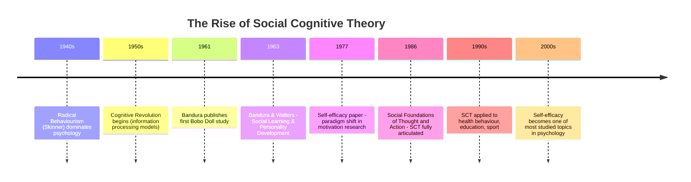

# Social Cognitive Theory of Personality: Foundations and Main Tenets

## Introduction

Personality psychology has been shaped by many competing frameworks—psychodynamic, trait, humanistic—but one of the most empirically robust and practically influential is **Social Cognitive Theory (SCT)**. Developed primarily by **Albert Bandura**, SCT fundamentally changed how psychologists understood learning, behaviour, and personality by insisting that *cognition matters*.

Where Skinner saw only observable stimulus-response chains, Bandura saw thinking, believing, imagining, and planning. Where traditional trait theorists catalogued stable dispositions, Bandura showed how personality emerges from the ongoing interaction between persons, their behaviour, and the environments they inhabit.

---

**Source PDFs**:
- 📄 [Block-2/Unit-2.pdf - Pages 28-39](/pdfs/MPC-003%20Personality%20Theories%20and%20Assessment/Block-2/Unit-2.pdf)
- 📚 MPC-003 Personality Theories and Assessment

---

## What Is Social Cognitive Theory?

Social Cognitive Theory is fundamentally a **social learning theory** built on the premise that people learn by watching what others do, and that human thought processes are central to understanding personality. The term "social" highlights that much of human learning occurs in social contexts; "cognitive" emphasises that mental processes—not just overt behaviour—shape who we are.

SCT explains behaviour in terms of a **continuous reciprocal interaction** among cognitive, behavioural, and environmental determinants. No single factor rules; all three continually influence each other.

:::info Key Insight
Unlike purely behaviourist theories, SCT insists that people are **active agents** who interpret their environments, set goals, and regulate their own behaviour—not passive reactors to external stimuli.
:::

### Distinguishing SCT from General Social Learning Theory

| Feature | General Social Learning | Social Cognitive Theory (Bandura) |
|---------|------------------------|-----------------------------------|
| Role of cognition | Limited | Central |
| Role of reinforcement | Necessary for learning | Necessary only for performance, not acquisition |
| Self-regulation | Minimal | Core construct (self-system) |
| Emphasis | Environmental shaping | Triadic reciprocal causation |
| Key concept | Conditioning | Self-efficacy |

---

## Historical Background: Albert Bandura

Albert Bandura (1925–2021) was born in Mundare, a small town in Northern Alberta, Canada. His academic journey:

- **1949**: B.Sc. in Psychology, University of British Columbia
- **1952**: Ph.D. in Clinical Psychology, University of Iowa
- **1953**: Joined Stanford University faculty (where he remained for his entire career)
- **1973**: President of the American Psychological Association
- **1980**: APA Distinguished Scientific Contributions Award
- **2016**: U.S. National Medal of Science recipient

His major publications trace the evolution of his thinking:

| Year | Publication | Significance |
|------|-------------|--------------|
| 1959 | *Adolescent Aggression* (with Walters) | Applied social learning to personality development |
| 1963 | *Social Learning and Personality Development* | Formalized social learning principles |
| 1969 | *Principles of Behaviour Modification* | Applied learning principles clinically |
| 1973 | *Aggression: A Social Learning Analysis* | Unified framework for aggression |
| 1986 | *Social Foundations of Thought and Action* | Comprehensive SCT framework |
| 1997 | *Self-Efficacy: The Exercise of Control* | Definitive statement on self-efficacy |

Bandura renamed his "Social Learning Theory" to "Social Cognitive Theory" in the 1980s to better capture the essential role of cognitive processes.

---

## Main Tenets of Social Cognitive Theory

### 1. Vicarious Learning (Learning Through Observation)

People learn by **observing others**, even without directly performing behaviours themselves or receiving personal reinforcement. This is called **vicarious learning** or **observational learning**.

However, learning does not automatically produce behaviour change. Whether a learned behaviour is actually performed depends on:
- **Perceived consequences**: What happened to the model?
- **Anticipated outcomes**: What does the observer expect to happen?
- **Personal motivation**: Does the observer want to perform the behaviour?

### 2. The Centrality of Cognition

Unlike strict behaviourism, SCT places cognition at the centre. Mental processes—expectations, beliefs, goals, self-perceptions—mediate between environment and behaviour.

> "People do not simply react to external influences. They reflect on them, interpret them, and act on the basis of what they perceive." — Bandura (1986)

### 3. Self-Efficacy as a Core Determinant

**Self-efficacy** (belief in one's ability to achieve goals) directly affects learning, motivation, and behaviour. Higher self-efficacy leads to greater effort, persistence, and resilience in the face of setbacks.

> People with high self-efficacy view challenges as tasks to be mastered; those with low self-efficacy avoid challenges and focus on failures.

### 4. Triadic Reciprocal Determinism

Behaviour, personal/cognitive factors, and environment interact **bidirectionally**—each influences and is influenced by the others. This is not a one-way causal chain but a dynamic system.

### 5. Identification and Modeling

People are more likely to follow behaviours modeled by someone they:
- Perceive as similar to themselves
- Admire or view as competent
- Feel emotionally connected to

### 6. Reinforcement Shapes Performance, Not Acquisition

Bandura departed from Skinner by arguing that reinforcement is not required for *learning* to occur. Observing a model is sufficient to acquire knowledge. Reinforcement determines whether that knowledge is *performed*.

---

## The Cognitive Revolution: How SCT Emerged

SCT arose within the broader **Cognitive Revolution** (1950s–1970s) that transformed psychology. Prior to this revolution, behaviourism—with its exclusive focus on observable stimulus-response relationships—dominated. The Cognitive Revolution restored mental processes to scientific psychology.

---

## SCT vs. Competing Theories

| Dimension | Behaviourism (Skinner) | Psychoanalysis (Freud) | Social Cognitive Theory (Bandura) |
|-----------|----------------------|----------------------|----------------------------------|
| View of human nature | Passive, shaped by environment | Driven by unconscious instincts | Active, self-regulating agents |
| Role of cognition | Irrelevant | Unconscious processes | Central, conscious and conscious |
| Learning mechanism | Conditioning | Identification, fixation | Observation, modeling |
| Determinism | Environmental determinism | Psychic determinism | Reciprocal determinism |
| Personality change | Change reinforcement contingencies | Psychoanalysis | Modify self-efficacy, model new behaviours |
| Empirical basis | Strong | Weak | Very strong |

---

## Applications of Social Cognitive Theory

SCT has been applied across an extraordinarily wide range of domains:

**Health Psychology**: SCT informs behaviour change interventions for smoking cessation, physical activity, dietary change, and medication adherence. Enhancing self-efficacy is a key mechanism.

**Education**: Teachers trained in SCT create mastery experiences, use effective peer modeling, and provide constructive feedback to build students' academic self-efficacy.

**Organizational Behaviour**: Leadership development, training, and performance management draw on SCT principles—particularly vicarious learning and self-efficacy enhancement.

**Media Studies**: Bandura's concern with TV modeling led to research on how media violence, prosocial content, and advertising shape behaviour through observational learning.

**Clinical Psychology**: Cognitive-behavioural therapy (CBT) incorporates SCT principles—particularly the focus on cognitions, self-efficacy, and behavioural modeling.

**Indian Context**: In India, SCT is applied in:
- Designing health promotion campaigns that use respected community figures as models
- Teacher training programs that emphasise modeling of learning strategies
- Addressing gender stereotypes by providing young girls with competent female role models
- Promoting pro-environmental behaviour through community observational learning

---

## 🎓 Educational Videos

- 🎥 [Albert Bandura - Social Cognitive Theory (Stanford Memorial)](https://www.youtube.com/watch?v=l-mRME9lLBM) — Bandura's own overview
- 🎥 [Bandura's Social Learning Theory - Crash Course Psychology](https://www.youtube.com/watch?v=Hhp_NRJMTJY) — accessible introduction
- 🎥 [Social Cognitive Theory - Simply Psychology](https://www.youtube.com/watch?v=kHN-NJKkJaw) — core concepts

---

## 🔗 External Resources

- 📖 [Wikipedia: Social Cognitive Theory](https://en.wikipedia.org/wiki/Social_cognitive_theory)
- 📖 [Wikipedia: Albert Bandura](https://en.wikipedia.org/wiki/Albert_Bandura)
- 📖 [Wikipedia: Social Learning Theory](https://en.wikipedia.org/wiki/Social_learning_theory)
- 🔗 [Simply Psychology: Bandura's Social Learning Theory](https://www.simplypsychology.org/bandura.html)
- 🔗 [APA Profile: Albert Bandura](https://www.apa.org/news/obituaries/bandura)
- 📄 [Bandura (1986) - Social Foundations of Thought and Action (Overview)](https://psycnet.apa.org/record/1986-98370-000)
- 📄 [Research: Social Cognitive Theory in Health Education (2020)](https://www.ncbi.nlm.nih.gov/pmc/articles/PMC7339070/)
- 📄 [Research: SCT and Academic Performance (2022)](https://www.frontiersin.org/articles/10.3389/fpsyg.2022.877568/full)
- 🔗 [Bandura's Legacy - Stanford Psychology](https://psychology.stanford.edu/people/albert-bandura)

---

## 🧠 Memory Aid

**"LOVE" framework for SCT main tenets:**
- **L** — Learning occurs vicariously (by watching others)
- **O** — Observation + Cognition = Personality formation
- **V** — Variables that influence: Person × Behaviour × Environment (triadic)
- **E** — Efficacy (self-efficacy) drives motivation and performance

---

## ✅ Self-Assessment Questions

**Conceptual:**
1. How does Social Cognitive Theory differ from classical behaviourism in explaining personality development? What is the specific role of cognition in Bandura's framework?

2. "SCT views humans as active agents, not passive reactors." Explain what this means with reference to Bandura's main tenets.

3. Why did Bandura rename his theory from "Social Learning Theory" to "Social Cognitive Theory"? What change in emphasis does this signal?

**Application:**
4. A student who has repeatedly failed mathematics begins to believe she is "just not a math person." Using SCT principles, explain how this belief formed and how it could be changed.

5. A public health program wants to reduce tobacco use in a rural Indian district using SCT principles. Describe at least three specific strategies the program should include, citing specific SCT tenets.

**Critical Thinking:**
6. Some critics argue that SCT lacks sufficient attention to biological and hormonal factors in personality. Do you agree? What would Bandura likely respond to this critique?

---

## Summary

Social Cognitive Theory represents a landmark in personality psychology, bridging the gap between purely behavioural accounts and cognitive/humanistic perspectives. Its core insights—that people learn by observing others, that cognition mediates behaviour, and that self-efficacy powerfully shapes motivation and performance—have proven remarkably generative across decades of research and application.

The theory's empirical grounding, clear concepts, and applied utility make it one of the most influential frameworks in all of psychology. Understanding SCT is essential not only for academic psychology but for anyone working in education, health, clinical practice, or organizational settings.

---

*Next: [Reciprocal Determinism - The Three-Way Dynamic](/mpc-003/block-2/reciprocal-determinism-bandura)*
