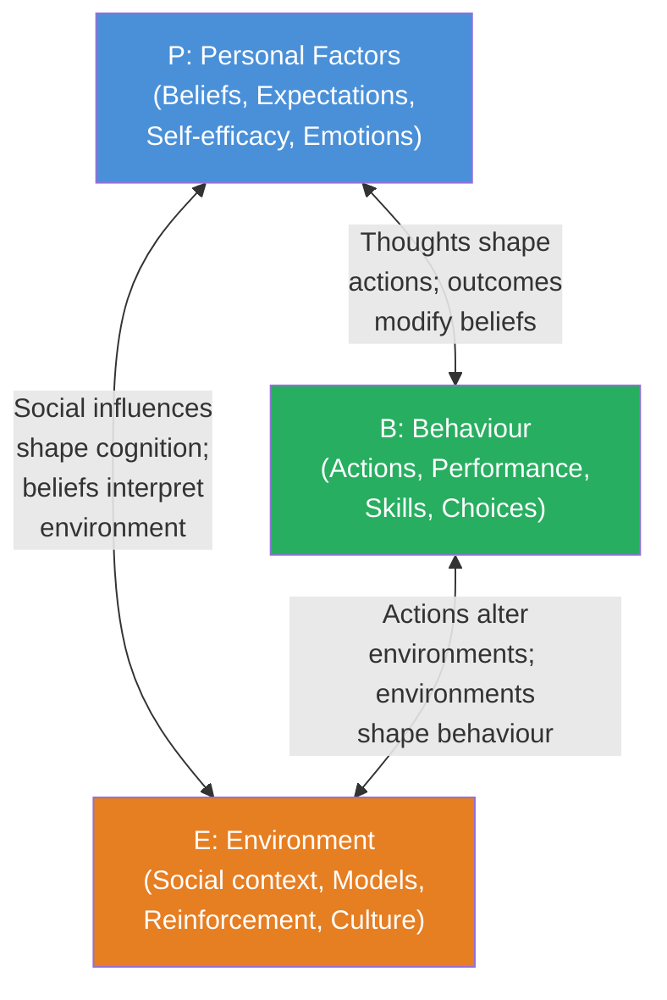
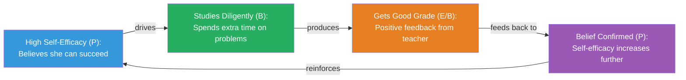

# Reciprocal Determinism: Bandura's Triadic Model of Causation

## Introduction

At the heart of Bandura's Social Cognitive Theory (SCT) lies a deceptively simple but profoundly powerful idea: **human behaviour cannot be understood by looking at any single cause**. Neither environment alone, nor personality traits alone, nor behaviour itself alone explains why people do what they do.

Instead, Bandura proposed **reciprocal determinism** — the principle that **behaviour (B), personal/cognitive factors (P), and environmental influences (E) all operate as interacting determinants that influence each other bidirectionally**.

This triadic model fundamentally challenged both the environmental determinism of behaviourism and the internal determinism of trait and psychodynamic theories.

---

**Source PDFs**:
- 📄 [Block-2/Unit-2.pdf - Pages 30-32](/pdfs/MPC-003%20Personality%20Theories%20and%20Assessment/Block-2/Unit-2.pdf)
- 📚 MPC-003 Personality Theories and Assessment

---

## What Is Reciprocal Determinism?

**Reciprocal determinism** refers to the model of causation in which:

- **B** (Behaviour) ↔ **P** (Personal factors: cognitive, affective, biological) ↔ **E** (External Environment)

All three forces interact **bidirectionally** — each influences and is influenced by the others. It is not a linear causal chain (A → B → C) but a **dynamic, mutually influencing system**.

:::note Bandura's Formulation
"In this model of reciprocal causation, behaviour, cognition and other personal factors, and other environmental influences all operate as interacting determinants that influence each other bidirectionally." — Bandura (1986)
:::

### Key Clarifications

1. **Not equal strength**: The three factors do not necessarily exert equal influence. In some situations, environment dominates; in others, personal factors lead.

2. **Not simultaneous**: Influences take time to unfold. A change in environment doesn't instantly change behaviour; there are temporal lags.

3. **Not static**: The relationship among B, P, and E changes across situations and across the lifespan.

---

## The Three Bidirectional Links

### 1. The P ↔ B Link: Thought, Affect, and Action

**Personal factors influence behaviour, and behaviour modifies personal factors.**

- Expectations, beliefs, self-perceptions, goals, and intentions give **shape and direction to behaviour**
- What people *think, believe, and feel* affects how they **behave**
- Conversely, the **outcomes of behaviour** feed back to modify beliefs and self-evaluations

**Example**: A student who *believes* she is good at science (P) is more likely to study hard, participate in class, and attempt challenging problems (B). If she succeeds, her self-confidence grows (P modified). If she fails repeatedly, her belief in her ability may erode (P modified in the opposite direction).

**Indian Context**: A first-generation college student from a rural family may have limited self-belief about academic success (P), which affects his study behaviours (B). However, if mentored and given early academic successes, his beliefs transform, creating a new cycle of engagement.

### 2. The E ↔ P Link: Social Influences and Personal Characteristics

**Environment shapes personal factors; personal characteristics influence how environment is perceived and constructed.**

- Human expectations, beliefs, emotional tendencies, and cognitive competencies are **developed and modified by social influences**
- People don't passively receive environmental inputs—they *interpret* them through existing cognitive frameworks (P)
- A person's characteristics also **determine which environments they enter** and what features they attend to

**Example**: Growing up in an academically stimulating environment with educated parents (E) shapes beliefs about the value of learning (P). Conversely, a child who believes learning is enjoyable (P) seeks out libraries, museums, and educational activities (selecting environments, E).

### 3. The B ↔ E Link: Behaviour Alters Environments

**Behaviour changes environmental conditions; changed environments then influence future behaviour.**

- In everyday life, behaviour **alters environmental conditions** and is in turn altered by the very conditions it creates
- Because of this bidirectional influence, people are both **products AND producers** of their environment
- People **select** situations to enter, **create** situations through their actions, and **evoke** responses from others

**Example**: A student who asks questions in class (B) may prompt the teacher to provide richer explanations (E), which in turn encourages further questioning (B reinforced). An employee who consistently delivers high-quality work (B) may receive more challenging assignments (E), which further develops their skills (B enhanced).

---

## Contrasting Determinism Models

| Model | Key Assertion | Problem |
|-------|---------------|---------|
| **Environmental Determinism** (Skinner) | Environment shapes behaviour | Ignores cognitive agency; can't explain individual differences in same environment |
| **Internal Determinism** (Freud, trait theories) | Internal factors drive behaviour | Ignores situational variation; underestimates environmental impact |
| **Reciprocal Determinism** (Bandura) | B, P, and E mutually influence each other | Complexity makes it harder to predict specific behaviours |

---

## Illustrative Case: The Cycle of Academic Success

And the **vicious cycle of academic failure**:

A student with **low self-efficacy** (P) avoids studying (B) → scores poorly on tests (E) → confirms belief that she "can't do it" (P reinforced negatively) → avoids more (B worsens) → continues to fail (E worsens).

This illustrates why **intervening at any point in the cycle can disrupt negative patterns**—a key application of SCT in education and therapy.

---

## The Concept of Human Agency

Reciprocal determinism preserves **human agency** while acknowledging environmental and cognitive constraints. People are:

- **Forethoughtful**: They anticipate consequences before acting
- **Self-reactive**: They set standards and evaluate their own performance
- **Self-reflective**: They reflect on their thinking and beliefs, adjusting as needed
- **Intentional**: They act in accordance with goals and plans

This conception of agency is distinct from both the helpless passivity of behaviourism and the radical free will of existentialism. It is **constrained agency**—real choices made within real biological and social constraints.

---

## Reciprocal Determinism in Research and Practice

### Research Evidence

Studies consistently support the reciprocal relationships Bandura proposed:

- **Self-efficacy and performance** mutually influence each other (Stajkovic & Luthans, 1998)
- **Environmental feedback** modifies efficacy beliefs, which then modify subsequent effort and performance
- **Behavioural choices** shape the social environments people create for themselves (Magnusson & Stattin, 2006)

A 2021 meta-analysis in *Psychological Bulletin* reviewed 313 studies and found robust bidirectional relationships among self-efficacy (P), effort/persistence (B), and social feedback (E)—strongly supporting the reciprocal model.

### Clinical Applications

In **Cognitive-Behavioural Therapy (CBT)**, therapists work on all three points of the triangle:
- Changing **cognitions** (P): challenging distorted beliefs
- Changing **behaviours** (B): behavioural activation, exposure
- Changing **environments** (E): social support, removing triggers

This triadic approach, grounded in reciprocal determinism, is more effective than approaches targeting only one component.

### Organizational Applications

Leadership development programs based on SCT use:
- **Mastery experiences** (B): Giving employees challenging but achievable tasks
- **Feedback** (E→P): Providing performance information that builds efficacy beliefs
- **Modeling** (E→B→P): Exposing employees to competent role models

---

## Limitations and Criticisms

Despite its influence, reciprocal determinism faces some challenges:

1. **Measurement complexity**: Measuring all three components simultaneously and their mutual influences is methodologically demanding.

2. **Situational variability**: Critics note that behaviour is sometimes *more consistent* across situations than Bandura's model predicts, suggesting stronger trait-like factors.

3. **Biological neglect**: The model pays limited attention to biological, hormonal, and genetic determinants of personality.

4. **The integration problem**: The concepts within SCT (self-efficacy, observational learning, reciprocal determinism) have been well-researched individually but the overall theoretical integration remains somewhat loose.

---

## 🎓 Educational Videos

- 🎥 [Bandura - Reciprocal Determinism Explained](https://www.youtube.com/watch?v=6DQfGtKTXGc) — clear visual explanation
- 🎥 [Social Cognitive Theory & Behaviour Change](https://www.youtube.com/watch?v=FrxqMwP_AXU) — applied focus
- 🎥 [Reciprocal Determinism in Practice - Psychology Tutorials](https://www.youtube.com/watch?v=3jlFWFSBpMc)

---

## 🔗 External Resources

- 📖 [Wikipedia: Reciprocal Determinism](https://en.wikipedia.org/wiki/Reciprocal_determinism)
- 📖 [Wikipedia: Social Cognitive Theory](https://en.wikipedia.org/wiki/Social_cognitive_theory)
- 🔗 [Simply Psychology: Bandura's Reciprocal Determinism](https://www.simplypsychology.org/bandura.html#rec)
- 🔗 [Verywell Mind: Reciprocal Determinism](https://www.verywellmind.com/what-is-reciprocal-determinism-2795907)
- 📄 [Bandura (1986) - Social Foundations of Thought and Action](https://psycnet.apa.org/record/1986-98370-000)
- 📄 [Research: Reciprocal relationships in self-regulated learning (2022)](https://www.sciencedirect.com/science/article/pii/S0959475221001195)
- 📄 [Meta-analysis: SCT and health behaviours (2020)](https://www.ncbi.nlm.nih.gov/pmc/articles/PMC7339070/)
- 🔗 [APA: Understanding Behaviour Through SCT](https://www.apa.org/education-career/guide/subfields/cognitive-behavioral)

---

## 🧠 Memory Aid

**"BPE Roundabout"** — Reciprocal Determinism as a traffic roundabout:
- **B**ehaviour, **P**erson, **E**nvironment are all roads entering and exiting the roundabout
- Traffic (influence) flows in both directions on every road
- No single road is the "start" — they all feed into each other
- The roundabout itself represents the *dynamic system* of personality

**Acronym: TIP**
- **T** — Triadic (three factors)
- **I** — Interactive (mutually influencing)
- **P** — Perpetual (ongoing, not one-time)

---

## ✅ Self-Assessment Questions

**Conceptual:**
1. Define reciprocal determinism. How does it differ from environmental determinism and from internal (trait) determinism?

2. Explain the three bidirectional links in Bandura's triadic model with original examples for each link.

3. Bandura states that "people are both products and producers of their environment." What does this mean? Provide a concrete example.

**Application:**
4. Mohan is a 16-year-old who grew up watching his older siblings fail at school. He believes school is pointless (P) and rarely attends (B), leading teachers to ignore him (E). Using reciprocal determinism, trace how this negative cycle developed AND suggest how to break it.

5. Design a workplace training program using the principles of reciprocal determinism. What changes would you make to P (cognitive factors), B (behaviour), and E (environment)?

**Critical Thinking:**
6. Some critics argue that reciprocal determinism makes SCT untestable because "everything influences everything." How might a researcher design a study to test specific reciprocal links in the model?

---

## Summary

Reciprocal determinism is the cornerstone of Social Cognitive Theory, explaining how personality and behaviour emerge from the ongoing, dynamic interplay of personal cognitive factors, behaviour, and environmental conditions. By rejecting one-sided determinism in favour of this triadic model, Bandura positioned humans as active, self-determining agents who shape and are shaped by their worlds.

This principle has profound implications for how we understand personality development, design psychological interventions, and create educational and organizational environments that help people flourish.

---

*Next: [Self-System and Self-Efficacy: The Inner Architecture of Agency](/mpc-003/block-2/self-system-self-efficacy-bandura)*
