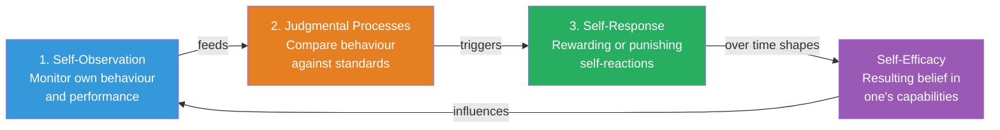
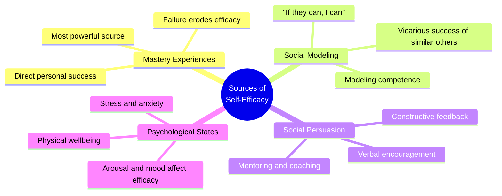

# Self-System and Self-Efficacy: Bandura's Framework for Personal Agency

## Introduction

If reciprocal determinism is the engine of Social Cognitive Theory, the **self-system** is the driver—and **self-efficacy** is the driver's confidence in their own abilities. Together, these concepts explain *how* individuals regulate their own behaviour, set goals, evaluate their progress, and maintain or abandon effort in the face of challenges.

These are among the most influential concepts in all of modern psychology. Self-efficacy alone has been the subject of thousands of studies, demonstrating its predictive power across domains from academic achievement to cancer recovery to athletic performance.

---

**Source PDFs**:
- 📄 [Block-2/Unit-2.pdf - Pages 31-34](/pdfs/MPC-003%20Personality%20Theories%20and%20Assessment/Block-2/Unit-2.pdf)
- 📚 MPC-003 Personality Theories and Assessment

---

## The Self-System: Overview

In Bandura's Social Cognitive Theory, the **self-system** is not a fixed personality structure or a psychic entity that controls behaviour from the inside. Rather, it is a set of **cognitive structures and functions** used for:

- **Perception**: How we see ourselves in relation to standards and goals
- **Evaluation**: How we assess our own behaviour against those standards
- **Regulation**: How we adjust our behaviour based on those evaluations

> "In social learning theory, a self-system is not a psychic agent that controls behaviour. Rather it refers to cognitive structures that provide reference mechanisms to set of functions for perception, evaluation and regulation of behaviour." — Bandura

The self-system is the **starting point** of reciprocal determinism—while all three factors (P, B, E) interact bidirectionally, the self-system within the person provides the initial reference point for all self-regulatory activity.

### Three Component Processes of the Self-System

#### 1. Self-Observation

The first component is **actively monitoring our own behaviour**. This means paying attention to:
- The quality of our performance
- The consistency of our behaviour
- The effects of our actions on outcomes

This is not passive awareness but active self-monitoring—keeping tabs on what we do. Without self-observation, there is nothing to evaluate.

**Example**: A medical student tracks how many hours she studies, whether she completed practice questions, and how she performed on mock exams. This self-observation gives her the data for evaluation.

#### 2. Judgmental Processes

We don't observe behaviour in a vacuum—we **compare what we see against standards**. These standards may be:

| Standard Type | Example |
|---------------|---------|
| **Absolute standards** | "I should study 6 hours daily" |
| **Social comparison** | "I want to score higher than the class average" |
| **Personal comparison** | "I want to do better than I did last semester" |
| **Cultural/traditional norms** | "Professionals should be punctual" |
| **Normative standards** | "Average performance for a student at this level" |

The judgmental process also considers:
- **Personal valuation**: How important is this domain to me?
- **Attributions**: Did I succeed/fail because of ability, effort, or luck?
- **Outcome vs. Process**: Did I achieve the goal? Or perform the right process?

#### 3. Self-Response

Based on the evaluation, we generate **self-responses**:

**Positive self-responses** (when performance meets standards):
- Internal: Pride, satisfaction, confidence
- External: Treating oneself, taking a break, celebrating

**Negative self-responses** (when performance falls short of standards):
- Internal: Shame, disappointment, guilt
- External: Self-criticism, working harder, seeking help

:::caution Important
Negative self-responses are not simply punishment—they can be motivating (prompting effort) or debilitating (producing helplessness). The key is whether the person *believes* they can improve their performance.
:::

---

## Self-Efficacy: The Core of Personal Agency

Self-efficacy emerged from Bandura's work on the self-system as its most critical and consequential component.

### Definition

> **Self-efficacy** is "the belief in one's capabilities to organise and execute the courses of action required to manage prospective situations." — Bandura (1995)

In simpler terms: **self-efficacy is a person's belief in their ability to succeed in a specific situation or domain**.

:::warning Self-Efficacy ≠ Self-Esteem
- **Self-esteem** is a general sense of self-worth ("I am a good person")
- **Self-efficacy** is domain-specific confidence in capability ("I can complete this calculus problem")
- A person can have high self-esteem but low self-efficacy in a particular area (and vice versa)
:::

### How Self-Efficacy Affects People

Bandura showed that self-efficacy beliefs determine how people **think, feel, behave, and motivate** themselves:

| Domain | High Self-Efficacy | Low Self-Efficacy |
|--------|--------------------|-------------------|
| **Challenges** | Viewed as tasks to master | Avoided as threats |
| **Effort** | Greater effort and persistence | Gives up easily |
| **Setbacks** | Quick recovery | Slow recovery, lasting doubt |
| **Stress** | Managed effectively | High anxiety and stress |
| **Goal setting** | Sets challenging goals | Sets easy goals or none |
| **Interest** | Develops deeper interest | Superficial engagement |
| **Attribution** | Failure due to insufficient effort | Failure due to lack of ability |

---

## Four Sources of Self-Efficacy

Bandura identified four main mechanisms through which self-efficacy beliefs develop and change:

### 1. Mastery Experiences (Most Powerful)

The most effective way to build self-efficacy is through **directly succeeding at tasks**. Success builds efficacy; failure undermines it.

However, **easy successes** don't build robust efficacy—people need to experience challenges they overcome through effort. Success that comes without effort provides limited information about capability.

**Implications**:
- In education: Scaffold tasks so students experience genuine success with appropriate challenge
- In therapy: Behavioural activation and graded task assignment build mastery experiences
- In sports: Progressive skill development before competition

**Example**: A child who successfully completes increasingly difficult math problems develops strong mathematical self-efficacy. A child who is kept on too-easy work never learns her true capability.

### 2. Social Modeling (Vicarious Experiences)

Observing **similar others succeed** through sustained effort raises the observer's belief that they too possess the capabilities to succeed.

**Key factor**: The model must be perceived as *similar* to the observer. Watching a genius succeed tells us little about our own ability. Watching someone "just like us" succeed powerfully raises efficacy.

**Types of models**:
- **Coping models**: Show initial struggle followed by mastery (especially effective for those who doubt themselves)
- **Mastery models**: Show effortless competence (effective for building aspirational standards)

**Example**: A first-year MBA student from a non-business background watches peers from similar backgrounds successfully complete financial modelling. This raises her belief that she can do it too.

**Indian Context**: In India, the success stories of first-generation professionals from rural or lower-income backgrounds serve as powerful models for students facing similar challenges. Programs like IIT graduates returning to mentor students in their hometowns use this principle explicitly.

### 3. Social Persuasion (Verbal Encouragement)

People's self-efficacy can be **enhanced through encouragement** from trusted others. When someone we respect tells us we have the skills to succeed, this boosts our confidence.

However, **persuasion alone is limited**:
- If feedback is excessively optimistic and doesn't match reality, it eventually backfires
- Negative verbal feedback (discouragement) is more powerful in reducing efficacy than positive feedback is in building it
- The *credibility* of the source matters greatly

**Effective encouragement**:
- Focuses on effort and strategy, not ability ("You worked really hard on this")
- Is specific ("Your analysis of the data was thorough")
- Is realistic about challenges while expressing confidence in the person's capacity

### 4. Psychological and Physiological States

How people **feel** in a situation influences their efficacy beliefs. Physical and emotional states provide *information* that people use to judge their capabilities:

- **Anxiety before a task** → Interpreted as "I can't handle this" → Reduces efficacy
- **Excitement before a task** → Interpreted as "I'm energized and ready" → Can enhance efficacy
- **Physical fatigue** → Interpreted as "I'm not competent today" → Reduces efficacy

Importantly, SCT doesn't say these states *cause* efficacy changes—they provide *information* that is then *interpreted* within a cognitive framework. This is why **reappraisal** (reinterpreting arousal as excitement rather than anxiety) is an effective efficacy-enhancement strategy.

---

## Generality of Self-Efficacy

Self-efficacy is inherently **domain-specific**, but there is also a concept of **generalized self-efficacy** — a broader sense of one's ability to handle diverse challenges. Research suggests:

- Domain-specific efficacy (e.g., academic, occupational, social) predicts domain-specific outcomes most powerfully
- Generalized self-efficacy predicts general wellbeing and resilience
- Efficacy in one domain can partially transfer to related domains

---

## Development of Self-Efficacy Across the Lifespan

Self-efficacy beliefs begin forming in **early childhood** and continue evolving throughout life:

| Life Stage | Self-Efficacy Development |
|------------|--------------------------|
| **Infancy** | Learning that actions produce effects (sense of agency) |
| **Early childhood** | Social comparisons with peers begin; family feedback shapes domain efficacy |
| **Middle childhood** | School performance provides massive efficacy information |
| **Adolescence** | Identity formation; efficacy in social, academic, vocational domains |
| **Early adulthood** | Career and relationship challenges test efficacy beliefs |
| **Middle adulthood** | Accumulated mastery often strengthens efficacy; major life events can disrupt it |
| **Later adulthood** | Health challenges can reduce physical efficacy; wisdom and life mastery can sustain general efficacy |

---

## Research on Self-Efficacy

Self-efficacy is one of the **most studied concepts in psychology**. Key research findings:

### Academic Achievement
- Bandura et al. (2001): Self-efficacy predicted academic achievement above and beyond prior achievement and general ability
- Pajares (2003): Academic self-efficacy consistently predicts mathematics performance, writing quality, and science achievement

### Health Behaviour
- Self-efficacy predicts adherence to exercise, dietary change, smoking cessation, medication adherence
- Scherer et al. (2020) meta-analysis: SCT-based interventions improving self-efficacy significantly enhanced health behaviour change

### Clinical Psychology
- Self-efficacy mediates recovery from depression, anxiety disorders, and phobias
- CBT works partly by rebuilding self-efficacy in specific domains
- Bandura (1988): Phobia treatment is effective insofar as it restores perceived self-efficacy

### Work Performance
- Stajkovic & Luthans (1998) meta-analysis: Self-efficacy explains 28% of variance in work performance
- Manager self-efficacy predicts team performance and organizational success

### Sport
- Athletes' self-efficacy predicts performance in competition, particularly in high-pressure situations
- Mental imagery (imagining successful performance) builds self-efficacy without physical practice

---

## Enhancing Self-Efficacy: Practical Strategies

Based on Bandura's four sources, practitioners can use:

**For Mastery Experiences:**
- Scaffold tasks to ensure early success
- Gradually increase challenge as competence grows
- Help people attribute success to ability and effort, not luck

**For Vicarious Experiences:**
- Connect people with peer role models (not just experts)
- Use "coping" models who show struggle followed by success
- Group work with similar-ability peers

**For Verbal Persuasion:**
- Provide specific, credible encouragement
- Focus feedback on process and effort, not innate ability
- Challenge distorted self-assessments with evidence

**For Managing Physiological States:**
- Teach relaxation and stress management
- Reframe anxiety as excitement ("arousal reappraisal")
- Ensure adequate sleep, nutrition, and physical health before important tasks

---

## 🎓 Educational Videos

- 🎥 [Self-Efficacy Theory - Albert Bandura](https://www.youtube.com/watch?v=Hhp_NRJMTJY) — Bandura explains the concept
- 🎥 [Self-Efficacy: The Belief That Changes Everything](https://www.youtube.com/watch?v=pqGnGmFEEUE) — TEDx talk
- 🎥 [Crash Course Psychology: Social Thinking](https://www.youtube.com/watch?v=UGxGDdQnC1Y) — includes self-efficacy

---

## 🔗 External Resources

- 📖 [Wikipedia: Self-Efficacy](https://en.wikipedia.org/wiki/Self-efficacy)
- 📖 [Wikipedia: Albert Bandura - Self-Efficacy](https://en.wikipedia.org/wiki/Albert_Bandura#Self-efficacy)
- 🔗 [Simply Psychology: Bandura's Self-Efficacy](https://www.simplypsychology.org/self-efficacy.html)
- 🔗 [Verywell Mind: What Is Self-Efficacy?](https://www.verywellmind.com/what-is-self-efficacy-2795954)
- 📄 [Bandura (1977) - Self-Efficacy: Toward a Unifying Theory of Behavioural Change](https://psycnet.apa.org/record/1977-25733-001)
- 📄 [Meta-analysis: Self-efficacy and academic performance (2023)](https://www.ncbi.nlm.nih.gov/pmc/articles/PMC10088433/)
- 📄 [Research: Self-efficacy in health behaviour change (2020)](https://www.ncbi.nlm.nih.gov/pmc/articles/PMC7339070/)
- 🔗 [Bandura's Self-Efficacy Resources](https://www.uky.edu/~eushe2/Bandura/BanduraBio.html)

---

## 🧠 Memory Aid

**"JUMP" for the Self-System:**
- **J** — Judgment (compare performance to standards)
- **U** — Universal self-monitoring (self-observation)
- **M** — Motivational self-response (reward or punish self)
- **P** — Personal agency (self-efficacy emerges from this process)

**"MAPS" for Sources of Self-Efficacy:**
- **M** — Mastery experiences (most powerful)
- **A** — Affect/physiological states
- **P** — Persuasion (verbal encouragement)
- **S** — Social modeling (watching similar others)

---

## ✅ Self-Assessment Questions

**Conceptual:**
1. Define the self-system as described by Bandura. What are its three component processes and how do they relate to each other?

2. What is self-efficacy? How does it differ from self-esteem? Why does Bandura consider it one of the most important determinants of behaviour?

3. Describe the four sources of self-efficacy. Which does Bandura consider the most powerful and why?

**Application:**
4. Priya has always been shy and avoids public speaking. Using Bandura's framework, trace how her low self-efficacy in public speaking developed through self-system processes, and design a specific intervention using all four sources of self-efficacy to help her.

5. A school in rural India wants to improve students' academic self-efficacy. Design a program incorporating all four sources of self-efficacy, paying attention to the cultural context.

**Critical Thinking:**
6. A student who has high self-efficacy but low actual ability might persist on a task long after it's productive to do so. Does self-efficacy always benefit performance? Under what conditions might high self-efficacy be detrimental?

---

## Summary

The self-system and self-efficacy represent Bandura's most significant contributions to personality psychology. By demonstrating that people's beliefs about their own capabilities powerfully shape how they think, feel, and behave—and that these beliefs are not fixed traits but learned, modifiable cognitions—Bandura opened the door to a genuinely optimistic psychology of human potential.

Understanding the mechanisms through which self-efficacy develops (mastery experiences, social modeling, persuasion, and physiological states) provides concrete, actionable guidance for educators, therapists, managers, and individuals seeking to develop their own capacities.

---

*Next: [Observational Learning and Vicarious Learning](/mpc-003/block-2/observational-vicarious-learning-bandura)*
