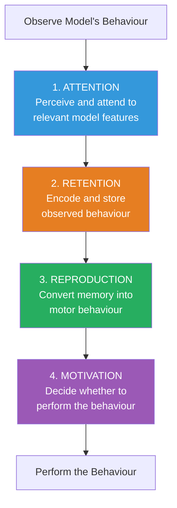

# Observational and Vicarious Learning: Bandura's Theory of Social Learning

## Introduction

In 1961, Albert Bandura and his colleagues conducted an experiment that would change how psychologists understood learning. Children watched adults punch, kick, and berate an inflatable Bobo doll—and then, when given the opportunity, imitated those actions with startling precision. No one had rewarded the children for imitating. No one had taught them directly.

The **Bobo Doll experiment** demonstrated that learning could occur through *observation alone*, without direct reinforcement, direct experience, or conscious instruction. This finding fundamentally challenged behaviourism and established **observational learning** as a central mechanism of personality development and social behaviour.

---

**Source PDFs**:
- 📄 [Block-2/Unit-2.pdf - Pages 33-38](/pdfs/MPC-003%20Personality%20Theories%20and%20Assessment/Block-2/Unit-2.pdf)
- 📚 MPC-003 Personality Theories and Assessment

---

## What Is Observational Learning?

**Observational learning** (also called **modeling**) is the process of acquiring new behaviours, attitudes, or emotional reactions through observing others—without performing the behaviour oneself and without receiving direct reinforcement.

Bandura challenged the traditional learning theory assumption that all learning requires:
- **Direct experience** of consequences
- **Reinforcement** or punishment of responses

He demonstrated that people can:
1. **Acquire** new behaviours simply by watching others
2. **Strengthen or weaken** existing behaviours based on observed consequences to others
3. **Learn abstract rules and principles**, not just specific responses

> "Learning can occur simply through observation of models and in the absence of reinforcement." — Bandura

### The Distinction Between Acquisition and Performance

One of Bandura's key insights was separating **learning (acquisition)** from **performing (execution)**:

| Aspect | Traditional View | Bandura's View |
|--------|-----------------|----------------|
| **Reinforcement role** | Required for learning | Required for performance, not acquisition |
| **Learning mechanism** | Direct experience | Observation sufficient |
| **Cognitive mediation** | Minimal | Essential |

**Example**: A student watches a professor model a complex statistical analysis. She *learns* the technique through observation. Whether she *applies* it depends on her motivation, self-efficacy, and the availability of appropriate situations.

---

## The Bobo Doll Experiments

### Original 1961 Study

Bandura, Ross, and Ross conducted a landmark study with nursery school children (ages 3-5):

**Procedure**:
1. Children watched an adult model interact with a Bobo doll (inflatable clown figure)
2. **Experimental group**: Watched adult aggressively hit, punch, kick, and verbally abuse the doll
3. **Control group**: Watched adult play quietly with other toys
4. Both groups were mildly frustrated by being denied access to attractive toys
5. Children were then placed in a room with a Bobo doll and various objects

**Results**:
- Children who observed aggressive model showed **significantly more aggression** toward the Bobo doll
- They replicated specific aggressive acts and verbalisations quite precisely
- The control group showed minimal aggression

**Significance**: Children changed their behaviour *without reinforcement*, demonstrating pure observational learning.

### Variations and Refinements

Bandura conducted numerous follow-up studies to explore moderating factors:

| Variation | Finding |
|-----------|---------|
| **Model rewarded** | More imitation than model punished condition |
| **Model punished** | Less spontaneous imitation (but same learning when offered incentive) |
| **Live vs. filmed model** | Both effective (important for TV/media implications) |
| **Same-sex model** | Somewhat more imitation |
| **High-status model** | More imitation |
| **Similar model** | More imitation |
| **Live clown** | Children aggressed against live clown too (not just inanimate object) |

The punishment condition was particularly theoretically important: children who watched a model being punished showed *less imitation* than those who watched a rewarded model. But when offered incentives to perform, they showed they had *learned* just as much. This demonstrated that **reinforcement affects performance, not acquisition**.

### Legacy and Controversies

The Bobo Doll experiments became iconic but also controversial:
- **Ecological validity concerns**: Bobo dolls *are* supposed to be hit—they bob back up
- **Demand characteristics**: Children may have inferred from the experimental setup that aggression was expected
- **Short-term vs. long-term effects**: Questions about lasting behavioural changes

Despite limitations, the experiments launched decades of research on media effects, social modeling, and observational learning that continue today.

---

## Four Processes of Observational Learning

Bandura identified four cognitive and motivational processes that govern what is learned from models and whether that learning translates into performance:

### Process 1: Attentional Processes

**Learning requires attention.** You cannot learn from a model you're not paying attention to.

Factors that influence attention to a model:

**Model characteristics that attract attention:**
- Attractiveness, prestige, and competence
- Perceived similarity to the observer
- Novelty and distinctiveness of behaviour
- Emotional salience of the model's behaviour

**Observer characteristics affecting attention:**
- Arousal level (overly anxious or drowsy observers learn less)
- Perceptual capacities
- Past experience with similar behaviour
- Motivation and interest in the domain

**Applications**:
- Teachers who are engaging, use varied presentations, and connect material to students' interests capture attention more effectively
- Health campaigns use attractive, credible, and relatable spokespeople to maximise observational learning
- In India, educational programs using Bollywood actors or cricketers as models for healthy behaviour exploit attentional mechanisms

### Process 2: Retentional Processes

**Learning requires memory.** Observed behaviour must be encoded and stored in ways that allow later retrieval and reproduction.

Bandura described two main retention systems:

| System | Description | Example |
|--------|-------------|---------|
| **Imaginal coding** | Storing observed behaviour as mental images | Visualising a surgical technique after watching |
| **Verbal coding** | Encoding behaviour as verbal descriptions | "First, hold the racket loosely; then watch the ball" |

Factors that enhance retention:
- **Rehearsal** (mental or physical replay of observed behaviour)
- **Meaningful organisation** (linking new information to existing knowledge)
- **Reduced interference** from competing information
- **Sleep** (memory consolidation during sleep)

Mental rehearsal—imagining oneself performing the observed behaviour—has been shown to significantly improve later performance. This is the basis for **mental imagery training** used extensively in sport psychology.

### Process 3: Motor Reproduction Processes

**Learning requires capability to reproduce.** Observers must have the physical and cognitive capabilities to translate stored representations into action.

Factors affecting reproduction:
- **Physical capabilities**: Age, strength, coordination (a 5-year-old watching a martial arts expert cannot immediately replicate complex moves)
- **Available component skills**: Complex behaviours build on simpler ones
- **Feedback and correction**: Observing one's own performance (through recording, feedback, etc.) allows comparison and adjustment
- **Practice**: Reproduction improves with practice, even mental practice

An important finding: **imagining oneself performing** a behaviour (mental simulation) improves motor reproduction even without physical practice. This is why surgeons rehearse operations mentally, and why athletes use visualisation techniques.

### Process 4: Motivational Processes

**Learning does not guarantee performance.** People perform what they have learned only if they are *motivated* to do so.

Three sources of motivation in observational learning:

**1. External reinforcement (consequences to self)**:
- Positive reinforcement for performing the behaviour
- Punishment for performing the behaviour

**2. Vicarious reinforcement (consequences to model)**:
- Watching a model be rewarded → increases likelihood of imitating
- Watching a model be punished → decreases likelihood of imitating (but doesn't prevent learning)

**3. Self-reinforcement (personal standards)**:
- If the behaviour aligns with personal goals and standards → self-reward → motivated to perform
- If behaviour conflicts with personal values → self-criticism → not performed despite learning

Bandura emphasised that punishment is less effective at deterring behaviour than reinforcement is at encouraging it, and punishment of observed behaviour typically only delays imitation rather than preventing it.

---

## Vicarious Learning

**Vicarious learning** is the process of learning from *other people's behaviour and its consequences*, rather than from one's own direct experience.

It is closely related to observational learning but specifically emphasises learning from consequences observed in others—particularly the *outcomes* of others' behaviour.

### Significance of Vicarious Learning

Without vicarious learning, humans would need to directly experience every possible situation to learn from it—an impossibly slow and often dangerous process. Vicarious learning allows:

- **Efficiency**: Learn from others' mistakes without making them yourself
- **Safety**: Avoid dangerous situations by learning from others who experienced them
- **Cultural transmission**: Pass complex behaviours and rules across generations without direct instruction
- **Acceleration**: Compress learning that would take years into much shorter timescales

> "Virtually all learning phenomena resulting from direct experience can occur vicariously by observing people's behaviour and its consequences for them." — Bandura (1986)

### Symbolic Modeling

A particularly powerful form of vicarious learning is **symbolic modeling**—learning from verbal descriptions, written text, film, television, or other symbolic representations of behaviour.

**Why symbolic modeling is uniquely powerful**:
- **Multiplicative power**: A single model (a book, a film, a televised demonstration) can teach millions simultaneously
- **Cross-cultural transmission**: Knowledge and behaviour patterns transmit across cultural and geographic boundaries
- **Historical transmission**: Written and recorded models can teach people separated by centuries

The psychological and social power of television, social media, and digital content as modeling agents is immense—they shape attitudes, behaviours, aspirations, and social norms across populations.

---

## Comparing Observational and Vicarious Learning

| Feature | Observational Learning | Vicarious Learning |
|---------|----------------------|------------------|
| Focus | Acquiring new behaviours by watching | Learning from consequences observed in others |
| Key mechanism | Attention, retention, reproduction, motivation | Emotional/motivational responses to observed outcomes |
| Result | New skills, behaviours, knowledge | Modified motivation and emotional responses |
| Example | Learning a recipe by watching a chef | Feeling relief after watching someone narrowly avoid an accident |

In practice, the two processes often operate together—observing a model involves both learning the behaviour and learning from the consequences they experience.

---

## Evaluation of Bandura's Theory

### Strengths

1. **Empirical grounding**: Exceptionally well-researched with clear operational definitions
2. **Ecological validity**: Explains real-world learning in natural social contexts
3. **Applied value**: Direct applications in education, health, clinical psychology, organizational behaviour
4. **Human agency**: Preserves the role of cognition and self-determination
5. **Developmental breadth**: Applicable from infancy through old age

### Limitations

1. **Consistency of behaviour**: Behaviour may be more cross-situationally consistent than SCT implies, suggesting stronger dispositional factors
2. **Biological neglect**: Limited attention to hormonal, genetic, and neurobiological influences on behaviour
3. **Theoretical integration**: Concepts like self-efficacy and observational learning are well-researched individually but the integration among them is not fully specified
4. **The "when" problem**: SCT is better at explaining what is learned and whether it's performed than at specifying when different processes dominate

---

## Applications of Observational and Vicarious Learning

### Education
- Teachers model not just content but **how to think about content** (metacognitive modeling)
- Cooperative learning uses peer modeling effectively
- Video-based learning (Khan Academy, YouTube tutorials) leverages symbolic modeling

### Health Behaviour Change
- Programs like Sesame Street (international versions) use modeling to teach health behaviours
- HIV prevention campaigns in sub-Saharan Africa using entertainment-education (soap operas with healthy behaviour models) have shown significant effects

### Clinical Psychology
- **Participant modeling** (therapist models behaviour, client observes then attempts) is highly effective for phobias
- **Video self-modeling**: Patients watch edited videos of themselves performing behaviours successfully—powerfully builds self-efficacy
- **Group therapy**: Members vicariously learn from each other's successes and struggles

### Media and Society
- Research consistently links media exposure to behavioural modeling (prosocial and antisocial)
- Video game violence, prosocial characters, and representation in media all function as modeling influences
- Social media influencers represent a modern, massive-scale modeling phenomenon

### Indian Context
- ASHA workers (Accredited Social Health Activists) in India function as local models for health behaviour change in rural communities
- Bollywood films have been studied as sources of observational learning for social attitudes, relationship behaviours, and health practices
- Educational television programs like *Buniyaad* and *Tarang* have used SCT principles explicitly

---

## 🎓 Educational Videos

- 🎥 [Bandura's Bobo Doll Experiment - Original footage clips](https://www.youtube.com/watch?v=zerCK0lRjp8)
- 🎥 [Observational Learning - Khan Academy](https://www.youtube.com/watch?v=Hhp_NRJMTJY)
- 🎥 [Social Learning Theory Explained Simply](https://www.youtube.com/watch?v=rSNMdEgVxqg)

---

## 🔗 External Resources

- 📖 [Wikipedia: Observational Learning](https://en.wikipedia.org/wiki/Observational_learning)
- 📖 [Wikipedia: Bobo Doll Experiment](https://en.wikipedia.org/wiki/Bobo_doll_experiment)
- 📖 [Wikipedia: Vicarious Learning](https://en.wikipedia.org/wiki/Vicarious_learning)
- 🔗 [Simply Psychology: Bobo Doll Study](https://www.simplypsychology.org/bobo-doll.html)
- 🔗 [Verywell Mind: Observational Learning](https://www.verywellmind.com/what-is-observational-learning-2795402)
- 📄 [Bandura et al. (1961) - Transmission of Aggression Through Imitation - Original Paper](https://psycnet.apa.org/record/1963-01128-001)
- 📄 [Research: Observational learning and motor skill acquisition (2022)](https://www.frontiersin.org/articles/10.3389/fpsyg.2022.889945/full)
- 📄 [Research: Vicarious learning in clinical settings (2021)](https://www.ncbi.nlm.nih.gov/pmc/articles/PMC7901193/)
- 🔗 [APA: Bandura's Social Learning Theory Overview](https://www.apa.org/topics/learning-theory)

---

## 🧠 Memory Aid

**"ARRM" for the Four Processes of Observational Learning:**
- **A** — Attention (must notice the model)
- **R** — Retention (must remember it)
- **R** — Reproduction (must be able to do it)
- **M** — Motivation (must want to do it)

**Memory trick for Bobo Doll significance:**
> "Bobo showed us: Kids COPY without CANDY" — learning can happen without reinforcement

**Vicarious vs. Observational Learning:**
> Observational = **WHAT** to do (the behaviour)
> Vicarious = **WHETHER** to do it (based on consequences to others)

---

## ✅ Self-Assessment Questions

**Conceptual:**
1. What did the Bobo Doll experiments demonstrate that traditional behaviourism could not explain? Why was the finding that children who saw a model punished *had* learned as much (when incentivized) so theoretically significant?

2. Describe the four processes involved in observational learning. How might a deficiency in any single process prevent learning from translating into performance?

3. Distinguish between vicarious learning and observational learning. How are they related and how do they differ?

**Application:**
4. A parent is concerned that their 10-year-old child is becoming more aggressive after watching violent video games. Using Bandura's four processes of observational learning, explain how this might occur and what the parent could do to disrupt the process.

5. You are designing a health education program to encourage hand-washing in primary schools in rural India. Design the program to use observational and vicarious learning principles, incorporating Bandura's four processes.

**Critical Thinking:**
6. Critics have argued that Bandura's theory overestimates how much behaviour people learn from media, given that most people who watch violence don't become violent. How might SCT respond to this criticism, using the concepts of self-regulation and the distinction between acquisition and performance?

---

## Summary

Observational and vicarious learning represent Bandura's most empirically grounded contributions to psychology. The Bobo Doll experiments demonstrated unambiguously that people learn by watching—and that reinforcement, while important for performance, is not necessary for acquisition. The four processes model (Attention, Retention, Reproduction, Motivation) provides a comprehensive framework for understanding when and how modeled behaviours translate into performance.

These principles have been applied with impressive success across education, health promotion, clinical psychology, and organizational development. Understanding them equips psychologists and practitioners with powerful tools for facilitating learning and behaviour change in individuals and communities.

---

*Cross-reference: [Social Cognitive Theory - Foundations](/mpc-003/block-2/social-cognitive-theory-personality) | [Reciprocal Determinism](/mpc-003/block-2/reciprocal-determinism-bandura) | [Self-System and Self-Efficacy](/mpc-003/block-2/self-system-self-efficacy-bandura)*
