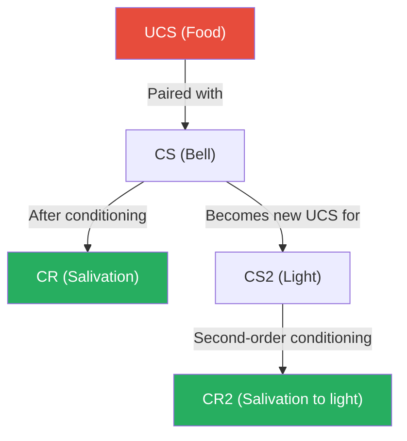
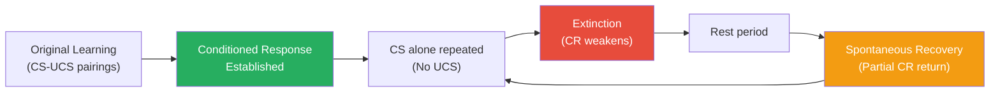

# Pavlov's Learning Theory of Personality: Classical Conditioning

## Overview

Ivan Petrovich Pavlov (1849–1936) approached personality from a radically different angle than his psychoanalytic contemporaries. While Freud delved into the unconscious and Sullivan mapped interpersonal fields, Pavlov built his theory of personality on **observable behaviour and the principles of learning**. For Pavlov, personality is no more (and no less) than a collection of learned behaviour patterns — shaped, maintained, and modified through conditioning.

This unit explores Pavlov's classical conditioning model, its core principles, and how those principles illuminate personality development, psychopathology, and behaviour modification.

> 📄 **Source PDF**: [MPC-003/Block-2/Unit-3.pdf — Pages 40–57](/pdfs/MPC-003%20Personality%20Theories%20and%20Assessment/Block-2/Unit-3.pdf)
> 📚 **Course**: MPC-003 Personality Theories and Assessment

---

## 1. Who Was Pavlov? A Brief Biography

Born in Ryazan, Russia, Pavlov trained as a physiologist and received the **Nobel Prize in 1904** for his work on the physiology of digestion — the very research that serendipitously led him to discover classical conditioning. Working with dogs fitted with salivary fistulas, he observed that dogs began salivating not just to food, but to stimuli reliably associated with food (the technician's footsteps, the sound of a bell).

Pavlov spent the last decades of his life (until 1936) working across three laboratories in St Petersburg, refining conditioning principles that would become foundational to 20th-century psychology.

**Key intellectual commitment**: Science and measurable evidence. Pavlov dismissed introspection; he sought objective, replicable laws governing behaviour.

---

## 2. Pavlov's View of Personality

Pavlov viewed **individual differences in personality as the product of learning and environmental experience**. Two people differ in personality not because of hidden psychic conflicts or unconscious drives, but because they have accumulated different conditioning histories.

He explained personality by variation in **nervous system excitation patterns** — particularly differences in the balance between excitatory and inhibitory processes. This grounded his theory in neurophysiology as much as psychology.

```
Behaviourist Core Principle:
Personality = Accumulated learned behaviour patterns
Behaviour = Measurable, observable responses to environmental stimuli
```

---

## 3. The Process of Classical Conditioning

### 3.1 The Original Experiment

Pavlov conducted a precise laboratory experiment using dogs. A rubber tube was surgically inserted into the salivary gland to measure saliva output objectively. Then:

```
Step 1: Present neutral stimulus (bell / CS) — no salivation
Step 2: Follow immediately with food powder (UCS) — causes salivation (UCR)
Step 3: Repeat pairings many times
Step 4: Bell alone now triggers salivation → Conditioned Response (CR) established
```

| Term | Abbreviation | Definition |
|------|-------------|------------|
| Unconditioned Stimulus | UCS | Stimulus that naturally elicits a response (food) |
| Unconditioned Response | UCR | Natural, unlearned response (salivation to food) |
| Conditioned Stimulus | CS | Previously neutral stimulus (bell) |
| Conditioned Response | CR | Learned response to CS (salivation to bell) |

### 3.2 Higher-Order Conditioning

Pavlov demonstrated that a conditioned stimulus can itself serve as the basis for **further conditioning**:

- **First-order conditioning**: Bell (CS) paired with food (UCS) → Bell elicits salivation
- **Second-order conditioning**: Light (new neutral stimulus) paired with bell (now CS) → Light elicits salivation
- Rescorla (1973) demonstrated that under appropriate conditions, **third-order conditioning** is achievable

This has profound implications for personality: complex, seemingly irrational responses may be several steps removed from any original traumatic experience.



---

## 4. Principles of Classical Conditioning

### 4.1 Acquisition

Two factors determine how strongly a conditioned response develops:

**Factor 1 — Number of pairings**: The more times CS and UCS are paired, the stronger (greater magnitude, shorter latency, higher probability) the conditioned response becomes.

**Factor 2 — Timing (ISI)**: The interval between CS presentation and UCS presentation. For most responses, conditioning is maximal at approximately **0.50 seconds**. However, research by Garcia, McGowan, and Green (1972) demonstrated that **taste-aversion learning** can occur even when the interval between the taste (CS) and illness (UCS) is over an hour — demonstrating that biological preparedness can stretch standard timing rules.

**Personality implications of acquisition**:
- Phobias, fetishes, prejudices, and hostile feelings are acquired through repeated CS-UCS pairings
- A child repeatedly frightened near a pet may develop persistent animal phobia
- Sexual fetishes develop when neutral objects (clothing article) are repeatedly paired with sexual arousal
- Racial prejudice can be conditioned through repeated pairing of social group with negative stimuli

### 4.2 Generalisation and Discrimination

**Stimulus Generalisation**: Once conditioned to one stimulus, the organism responds to *similar* stimuli as well. A child who was bitten by a large brown dog may fear all large dogs, then all dogs, then any barking animal — generalising outward from the original CS.

Generalisation is **biologically adaptive**: it allows rapid learning from single experiences. The sounds of dangerous animals are similar enough that fear generalises usefully across species.

**Stimulus Discrimination**: The opposite process — learning to respond to one stimulus but *not* to a similar one. This occurs when:
- Stimulus A is consistently followed by UCS (reinforced)  
- Stimulus B is never followed by UCS (non-reinforced)

Over trials, responses to A strengthen while responses to B weaken.

**Experimental Neurosis** (Shenger-Krestovnika, 1921): When discrimination demands exceed the organism's capacity:
- Dogs trained to discriminate between a circle (fed) and an ellipse (not fed)
- When the ellipse was gradually made more circle-like until indistinguishable...
- Dogs became agitated, aggressive, ceased performing formerly easy discriminations
- Pavlov attributed this to **disturbed balance between excitation and inhibition**
- Extrapolation: extreme anxiety and breakdown can result when environmental demands require discriminations beyond neurological limits

### 4.3 Extinction and Spontaneous Recovery

**Extinction**: Repeated presentation of CS *without* the UCS gradually weakens the conditioned response until it disappears.

**Spontaneous Recovery**: If the extinguished CS is presented again after a time interval, the conditioned response *reappears* — though typically weaker than the original. This demonstrates that extinction doesn't erase the original learning; it creates new inhibitory learning that can decay.

**Personality significance**: Without extinction mechanisms, we would accumulate useless, maladaptive conditioned responses throughout life. The natural extinction process is a psychological "editing" system for outdated learning.



---

## 5. Behaviour Modification Through Classical Conditioning

### 5.1 Clinical Applications

Pavlov's principles became a powerful toolkit for **behavioural therapy**:

**Flooding**: Prolonged exposure to the CS without UCS until extinction eliminates phobic responses. Used for anxiety disorders, PTSD, and phobias. The therapist relies on extinction — the CS loses its power when repeatedly presented without consequence.

**Systematic Desensitisation** (Wolpe, building on Pavlov): Pairing relaxation responses with progressive exposure to feared stimuli, working up a fear hierarchy. Successfully treats:
- Examination anxiety
- Specific phobias
- Nightmares
- Stuttering
- Obsessions
- Impotence
- Anorexia nervosa

### 5.2 Counter-Conditioning and Aversion Therapy

**Counter-conditioning** works by pairing the CS (which currently elicits a desired — but maladaptive — response like pleasure from alcohol) with a new unpleasant UCS (nausea-inducing drug like apomorphine).

The original CS-UCR relationship is *overridden* by a new, stronger, aversive association.

**Aversion Therapy** clinical example:
- Alcohol (CS) previously paired with pleasure (UCR)
- Apomorphine (drug) paired with alcohol → severe nausea
- Alcohol now elicits nausea instead of pleasure
- Successfully applied to alcohol and nicotine addiction (Schwartz & Lacey, 1982)

**Why simple abstinence fails** (Pavlovian analysis): "Simply not presenting a conditioned stimulus does not eliminate the relation between it and the unconditioned stimuli." — The taste of the substance, its smell, the social context — all remain active conditioned stimuli. One exposure can re-establish the full association.

---

## 6. Evaluation of Pavlov's Theory

### Strengths

- **Scientific rigour**: Based on objective, replicable laboratory experiments
- **Explanatory power for pathology**: Phobias, fetishes, prejudice, addiction — all receive parsimonious, testable explanations
- **Therapeutic utility**: Directly generated effective clinical techniques still in use today
- **Neurobiological grounding**: Connected personality to nervous system function, anticipating later neuroscience

### Limitations

- **Incomplete theory**: Explains specific behaviour patterns, not the total integrated personality
- **Animal-to-human generalisation**: Many principles drawn from dog experiments — questionable applicability to complex human behaviour
- **Ignores cognition**: No role for beliefs, goals, expectations, or conscious processing
- **Culture and language**: Cannot explain why personality varies systematically across cultures in ways unrelated to simple conditioning histories

---

## 7. Contemporary Research Connections

**Conditioned Fear and the Amygdala** (LeDoux, 2000): Neuroimaging has confirmed that classical fear conditioning involves rapid amygdala processing — demonstrating the neural substrate Pavlov intuitively sought. The amygdala consolidates CS-UCS associations without hippocampal involvement, explaining why phobias resist rational override.

**Evaluative Conditioning** (De Houwer et al., 2020): Research shows that attitudes toward neutral social groups, brands, and products are shaped by classical conditioning principles — updating Pavlov's insight for social psychology.

**Conditioned Immune Responses** (Ader & Cohen, 1975): Landmark study showing conditioning could modify immune function — demonstrating that Pavlovian conditioning reaches far deeper into physiology than Pavlov himself imagined.

---

## 8. 🧠 Memory Aid: The CAGE Framework

| Letter | Principle | Key idea |
|--------|-----------|----------|
| **C** | Conditioning | Neutral stimulus + UCS = learned response |
| **A** | Acquisition | Strength builds with pairings + timing |
| **G** | Generalisation | Response spreads to similar stimuli |
| **E** | Extinction | No UCS = response fades (but recoverable) |

And the complementary process: **DISC**
- **D**iscrimination — learning *not* to respond to similar stimuli
- **I**nhibition — excitation/inhibition balance underpins personality
- **S**pontaneous Recovery — extinguished learning isn't erased
- **C**ounter-conditioning — override maladaptive CRs therapeutically

---

## 9. 🔗 External Resources

### Foundational Reading
- [Classical Conditioning — Wikipedia](https://en.wikipedia.org/wiki/Classical_conditioning)
- [Ivan Pavlov — Wikipedia](https://en.wikipedia.org/wiki/Ivan_Pavlov)
- [Behaviorism — Wikipedia](https://en.wikipedia.org/wiki/Behaviorism)
- [Phobia — Wikipedia](https://en.wikipedia.org/wiki/Phobia)

### Educational Videos
- 🎥 [Classical Conditioning — Crash Course Psychology #11 (YouTube)](https://www.youtube.com/watch?v=hhqumfpxuzI) — excellent visual overview with examples
- 🎥 [Pavlov's Dogs — SciShow Psychology (YouTube)](https://www.youtube.com/watch?v=jxKHfW1hFXQ) — how the discovery happened
- 🎥 [Systematic Desensitisation explained (YouTube)](https://www.youtube.com/watch?v=6z5TOsmFiNY)

### Research Papers
- LeDoux, J. E. (2000). Emotion circuits in the brain. *Annual Review of Neuroscience*, 23, 155–184.
- De Houwer, J., et al. (2020). Evaluative conditioning: A review of theoretical and empirical developments. *Psychological Bulletin*, 146(10), 817–848.
- Garcia, J., McGowan, B. K., & Green, K. F. (1972). Biological constraints on conditioning. In *Classical Conditioning II*. Appleton-Century-Crofts.
- Rescorla, R. A. (1973). Pavlovian conditioning: It's not what you think it is. *American Psychologist*, 43, 151–160.
- Schwartz, B., & Lacey, H. (1982). *Behaviourism, Science, and Human Nature*. Norton.

---

## 10. 📝 Self-Assessment Questions

### Conceptual Understanding
1. Differentiate between unconditioned stimulus (UCS), conditioned stimulus (CS), unconditioned response (UCR), and conditioned response (CR) using an example from everyday personality development.

2. Pavlov explained personality as reflecting "variation in nervous system excitation." What does this mean, and how does it differ from psychoanalytic and trait approaches to personality?

3. Why is spontaneous recovery theoretically significant for personality? What does it imply about the permanence of conditioning?

### Applied Analysis
4. A student who was publicly humiliated in class (UCS → emotional distress) while holding a specific textbook (CS) now feels anxious whenever they see that textbook. Apply the principles of acquisition, generalisation, and extinction to this scenario.

5. How would Pavlov's theory explain the development of a phobia of heights in someone who has never had a direct traumatic experience with heights? (Hint: Think about higher-order conditioning and observational context.)

6. A therapist is treating a client with severe examination anxiety using systematic desensitisation. Explain the Pavlovian principles underlying this technique and why it should work.

### Critical Thinking
7. Evaluate Pavlov's theory against the following critique: "Pavlov's experiments were conducted on dogs in artificial laboratory settings. Human personality is far too complex to be explained by salivation studies." To what extent is this critique valid?

8. Compare and contrast extinction (classical conditioning) with repression (psychoanalytic). Both seem to involve "forgetting" an emotional response. What does spontaneous recovery tell us about the difference?

---

## Summary

Pavlov's learning theory offers a **scientific, evidence-based account of personality** as a cumulative product of conditioning history. The core processes — acquisition, generalisation, discrimination, extinction, and spontaneous recovery — provide tools for understanding how normal personality develops and how psychopathological patterns (phobias, addictions, prejudices, fetishes) emerge and can be therapeutically modified.

While incomplete as a total theory of personality, Pavlov's contribution to clinical psychology — through systematic desensitisation, flooding, and aversion therapy — remains practically invaluable. His vision of personality as measurable, modifiable behaviour remains a cornerstone of behavioural and cognitive-behavioural traditions.

---

*Next: [Skinner's Operant Conditioning Theory of Personality →](/mpc-003/block-2/skinner-operant-conditioning-personality)*
