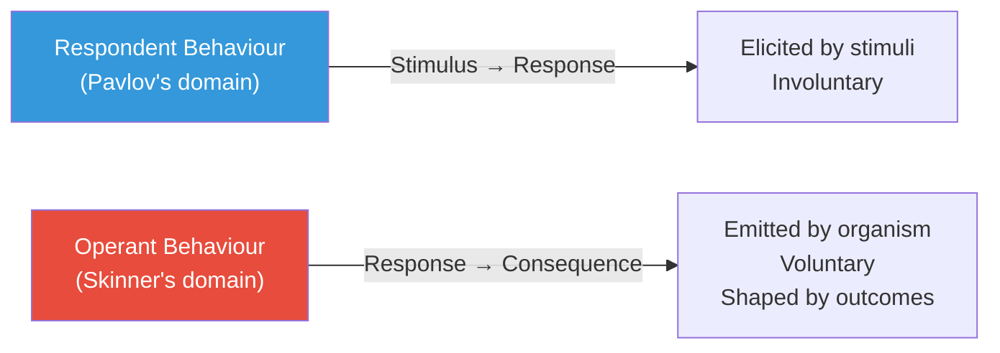
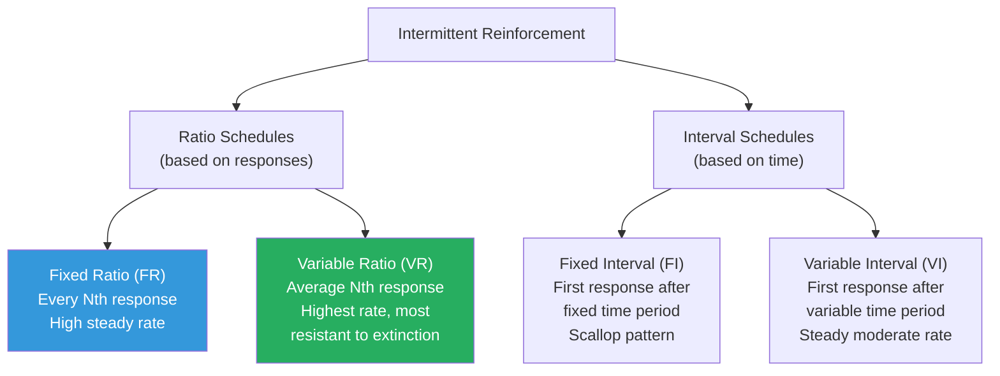
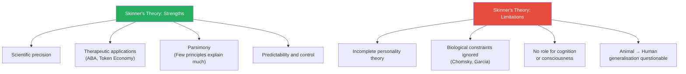

# Skinner's Learning Theory of Personality: Operant Conditioning

## Overview

Burrhus Frederic Skinner (1904–1990) extended the behaviourist tradition with a theory of personality grounded in **operant conditioning** — a form of learning in which behaviour is shaped by its consequences. Where Pavlov showed how passive, reflexive responses could be conditioned, Skinner focused on **voluntary, active behaviours** and how reinforcement and punishment mould them into the patterns we call personality.

Skinner became, arguably, the most influential psychologist of the 20th century after Freud. Unlike Freud, however, Skinner rejected inner mental structures entirely — for him, **what you observe IS the personality**.

> 📄 **Source PDF**: [MPC-003/Block-2/Unit-3.pdf — Pages 46–57](/pdfs/MPC-003%20Personality%20Theories%20and%20Assessment/Block-2/Unit-3.pdf)
> 📚 **Course**: MPC-003 Personality Theories and Assessment

---

## 1. Skinner's View of Personality

Skinner's starting point is radical: **there is no "personality" lurking behind behaviour**. The self, the ego, the trait structure — these are convenient fictions. What actually exists are patterns of behaviour shaped by genetic endowment and reinforcement history.

> "The study of personality can be done on the basis of systematic and precise evaluation of individual's genetic and idiosyncratic learning history." — Skinner

This means understanding a person's personality requires studying:
1. Their unique reinforcement history (what has been rewarded/punished)
2. Their genetic constitution (biologically-given response tendencies)
3. The environmental contingencies currently governing their behaviour

**Skinner's assumptions about behaviour**:
- Behaviour is **lawful** (follows discoverable rules)
- Behaviour is **predictable** (given enough history)
- Behaviour is **controllable** (through environmental manipulation)

Skinner emphasised: **determinism, elementalism, changeability, objectivity, reactivity, knowability** — and rejected rationality-irrationality and homeostasis as concepts because they invoke unmeasurable internal states.

---

## 2. Respondent vs. Operant Behaviour

Skinner distinguished two fundamental categories of behaviour:

| Feature | Respondent Behaviour | Operant Behaviour |
|---------|---------------------|-------------------|
| Triggered by | Known, identifiable stimulus | No specific eliciting stimulus |
| Nature | Involuntary, automatic | Voluntary, spontaneous |
| Examples | Pupil constriction, salivation | Pressing a lever, speaking, working |
| Learning type | Classical conditioning | Operant conditioning |
| Control point | Stimulus precedes response | Consequence follows response |

**Critical insight**: Skinner argued that **human personality is overwhelmingly operant in nature**. Most of what we think, say, and do is emitted voluntarily and shaped by what follows — not pulled out by triggering stimuli.



---

## 3. The Skinner Box and Operant Conditioning

Skinner devised the **operant conditioning chamber** (colloquially, the "Skinner box") — an enclosed environment with:
- A lever/bar on one wall
- A food delivery mechanism triggered by lever-pressing
- A recording device to track response frequency

The basic operant conditioning sequence:

```
1. Rat explores cage → accidentally presses lever
2. Food pellet delivered (reinforcer appears)
3. Probability of lever-pressing INCREASES
4. Lever-pressing is now "operantly conditioned"
```

**The key principle**: *A reinforcer is any stimulus event that, when it follows a response in proper temporal relation, tends to maintain or increase the strength of that response.*

Reinforcers can be:
- **Positive** — adding something pleasant (food, praise, money)
- **Negative** — removing something unpleasant (turning off a loud noise when a rat presses a lever)

Both types *increase* the probability of the preceding behaviour.

---

## 4. Schedules of Reinforcement

One of Skinner's most important discoveries: behaviour is not just shaped by *whether* reinforcement occurs, but by *when* it occurs — the **schedule of reinforcement**.

### 4.1 Continuous Reinforcement (CRF)
Every response → reinforcement. Fastest acquisition but weakest resistance to extinction.

### 4.2 Intermittent Reinforcement Schedules



| Schedule | Pattern | Human Example | Resistance to Extinction |
|----------|---------|---------------|--------------------------|
| Fixed Ratio | Piecework pay | Factory workers paid per item | Moderate |
| Variable Ratio | Random wins | Gambling (slot machines) | **Highest** |
| Fixed Interval | Scheduled check | Students cramming before exams | Low (post-reinforcement pause) |
| Variable Interval | Random checks | Checking email; fishing | High |

**Personality insight**: Variable ratio schedules create the most **persistent, compulsive behaviour patterns** — explaining why gambling addiction is so resistant to extinction. The unpredictability of the reward keeps the behaviour alive indefinitely.

---

## 5. Aversive Stimuli: Punishment and Its Limits

Aversive stimuli are stimuli we find unpleasant or painful. They appear in two forms:

**Punishment**: Aversive stimulus follows behaviour → decreases response probability
- Child throws toys → parent spanks → child throws fewer toys

**Negative Reinforcement**: Removal of an aversive stimulus follows behaviour → increases response probability
- Electric shock turns off when rat stands on hind legs → rat stands on hind legs more often

### 5.1 Why Skinner Opposed Punishment

Skinner famously argued that punishment is **ineffective** — not for ethical reasons, but for scientific ones:

1. Punishment **suppresses** behaviour; it doesn't **extinguish** it
2. The original reinforcer for the bad behaviour hasn't been removed — it's merely "covered" by the aversive stimulus
3. When punishment is absent, the original behaviour returns (even stronger, on a variable schedule)
4. Punishment creates **side effects**: fear, aggression, avoidance of the punisher

**Example**: Punishing a child for lying — the reinforcer (avoiding trouble) remains active. The child merely learns to lie more cleverly when the punisher isn't present.

---

## 6. Secondary Reinforcement

Not all reinforcement involves primary needs (food, water, sex). Neutral stimuli can acquire reinforcing properties by association with primary reinforcers.

A click sound in the Skinner box, paired consistently with food delivery, eventually becomes a **secondary reinforcer** on its own.

**Most powerful human secondary reinforcer: Money**

Money has no intrinsic value but through association with countless primary reinforcers (food, shelter, pleasure, status), it becomes universally reinforcing. This explains:
- Work motivation across diverse cultures
- Why people work harder for money even when not immediately hungry
- The development of "workaholism" as a conditioned pattern

Secondary reinforcement vastly extends the range of human personality formation — allowing complex social behaviours, status-seeking, and achievement motivation to develop through conditioning chains.

---

## 7. Shaping and Successive Approximation

How does complex behaviour develop? Skinner's answer: **shaping** — the method of successive approximations.

The process:
1. Identify the **target behaviour** (e.g., a child speaking in full sentences)
2. Reinforce any behaviour that is even slightly **in the direction** of the target
3. Gradually raise the standard — reinforce only behaviours that are *closer* to the target
4. Continue until the full target behaviour is established

```
Target: Pigeon presses a specific button
Step 1: Reinforce any movement toward the correct wall
Step 2: Reinforce only approaching the button
Step 3: Reinforce only touching near the button
Step 4: Reinforce only pressing the button
```

**Personality applications of shaping**:
- **Parenting**: Parents inadvertently shape children's personality through differential reinforcement of successive approximations to desired behaviours
- **Language development**: Vocabulary and grammar are shaped through parental reinforcement of closer and closer approximations to adult speech
- **Social skills**: Assertiveness, cooperation, and leadership can be systematically shaped through behavioural training

---

## 8. Superstitious Behaviour

When reinforcement occurs by chance *at the moment* a behaviour is performed, a **spurious CS-reinforcer relationship** is established — the organism believes (functionally) that the behaviour caused the reinforcement.

Skinner demonstrated this experimentally by delivering food to pigeons at fixed time intervals regardless of their behaviour. Each pigeon developed idiosyncratic "superstitious" rituals — one turned counterclockwise, another bobbed its head — whatever it happened to be doing when food appeared.

**Indian cultural example** (from the PDF): A student travelling to an exam sees a cat cross the road; later does poorly. Subsequent association: cat = bad luck. The student now avoids black cats — a classically conditioned superstition maintained by variable reinforcement.

**Broader cultural patterns**: Rain-making dances in tribal societies; lucky clothing for athletes; pre-performance rituals — all explicable as superstitious conditioning where accidental temporal contiguity created a spurious belief.

---

## 9. Abnormal Behaviour: A Behavioural Account

Skinner categorically rejected psychodynamic explanations of pathology:
- No "repressed wishes"
- No "ego-id conflicts"
- No "identity crisis"

**Abnormal behaviour follows the same conditioning principles as normal behaviour** — it is simply learning that has gone wrong or learned patterns that are maladaptive in the current context.

**Two pathways to abnormality**:
1. **Maladaptive conditioning**: Learning fearful, aggressive, or withdrawn responses through classical conditioning
2. **Distorted reinforcement history**: Variable reinforcement of antisocial behaviour; punishment of prosocial behaviour

**Treatment implications**:
- **Extinction**: Remove the reinforcer → the behaviour decreases
- **Differential reinforcement**: Reinforce adaptive alternatives simultaneously
- **Token Economy**: Used in psychiatric hospitals and schools — appropriate behaviour earns tokens exchangeable for rewards. Highly effective for autism, schizophrenia, juvenile delinquency

**Token Economy components**:
- Explicit behavioural rules
- Token delivery for rule-following (poker chips, stickers, points)
- Exchange system (tokens → desired items/privileges)
- Consistent application by all staff

---

## 10. Evaluation of Skinner's Theory

### Strengths

- **Empirical rigour**: Built on experimental evidence, not clinical intuition
- **Therapeutic effectiveness**: Applied Behaviour Analysis (ABA), token economies, and behaviour modification programmes have strong evidence bases
- **Social engineering vision**: *Walden Two* (1948) outlined a utopia designed on conditioning principles — stimulating debate about scientific social planning
- **Radical parsimony**: Explains enormous behavioural variety with a small set of principles

### Weaknesses and Critiques

- **Not a theory of personality**: Skinner himself admitted his framework addresses specific behaviours and behaviour change — the word "personality" is largely absent
- **Ignores biological factors**: Cognitive and biological constraints on conditioning (Garcia effect, instinctive drift) show learning is not infinitely malleable
- **Language problem** (Chomsky, 1959): Operant conditioning cannot explain:
  - How children produce sentences they've never heard
  - Universal similarities in language acquisition across cultures
  - The *Language Acquisition Device* (LAD) — a biologically prepared mechanism for grammar
- **Human complexity underestimated** (Boulding, 1984): General laws from rat behaviour cannot simply be extrapolated to complex human social behaviour
- **Dehumanisation concern**: Treating humans as operant organisms denies agency, consciousness, and meaning



---

## 11. Comparing Pavlov and Skinner

| Dimension | Pavlov | Skinner |
|-----------|--------|---------|
| Type of behaviour | Respondent (reflexive) | Operant (voluntary) |
| Learning mechanism | CS-UCS pairing | Response-consequence |
| Role of stimulus | Precedes response | Follows response |
| Type of response | Elicited (passive) | Emitted (active) |
| Reinforcement | Not central | Central mechanism |
| Key contribution | Phobia/fear conditioning | Complex behaviour shaping |
| Personality model | Nervous system balance | Reinforcement history |

---

## 12. 🧠 Memory Aid: SOAR for Skinner

| Letter | Concept | Key point |
|--------|---------|-----------|
| **S** | Shaping | Complex behaviour built step-by-step |
| **O** | Operant | Voluntary behaviour shaped by consequences |
| **A** | Aversive | Punishment suppresses but doesn't extinguish |
| **R** | Reinforcement Schedules | VR = strongest persistence |

And for schedules: **"Casinos use VR because it's the most Venomously Resistant to extinction"**

---

## 13. 🔗 External Resources

### Foundational Reading
- [Operant Conditioning — Wikipedia](https://en.wikipedia.org/wiki/Operant_conditioning)
- [B.F. Skinner — Wikipedia](https://en.wikipedia.org/wiki/B._F._Skinner)
- [Reinforcement — Wikipedia](https://en.wikipedia.org/wiki/Reinforcement)
- [Applied Behaviour Analysis — Wikipedia](https://en.wikipedia.org/wiki/Applied_behavior_analysis)
- [Token Economy — Wikipedia](https://en.wikipedia.org/wiki/Token_economy)

### Educational Videos
- 🎥 [Operant Conditioning — Crash Course Psychology #11 (YouTube)](https://www.youtube.com/watch?v=I_ctJqjlrHA)
- 🎥 [Schedules of Reinforcement explained (YouTube)](https://www.youtube.com/watch?v=qy_mIEnnlF4)
- 🎥 [Skinner's Behaviourism — Theory of Knowledge (YouTube)](https://www.youtube.com/watch?v=yhvySGM4oMw)

### Research Papers
- Skinner, B. F. (1938). *The Behaviour of Organisms*. Appleton-Century-Crofts.
- Chomsky, N. (1959). A review of Skinner's *Verbal Behaviour*. *Language*, 35(1), 26–58.
- Cooper, J. O., et al. (2020). *Applied Behaviour Analysis* (3rd ed.). Pearson. — Gold standard text for ABA
- Boulding, K. E. (1984). B. F. Skinner: A dissident view. *Behavioural and Brain Sciences*, 7, 483–484.
- McLeod, S. A. (2022). Skinner — Operant Conditioning. SimplyPsychology.

### Indian Context
- ABA is increasingly applied in India for autism spectrum disorder (NIMHANS, Bangalore)
- Token economy principles are used in Indian correctional institutions
- Behaviour modification programmes in Indian schools for learning disabilities

---

## 14. 📝 Self-Assessment Questions

### Conceptual Understanding
1. Distinguish between respondent and operant behaviour. Why did Skinner argue that human personality is overwhelmingly operant in nature?

2. Explain the concept of a "reinforcer" in Skinner's theory. How do positive and negative reinforcement differ? (Note: Many students confuse negative reinforcement with punishment — be precise.)

3. What are schedules of reinforcement? Why does the variable ratio schedule produce the most persistent behaviour, and what personality patterns does this explain?

### Applied Analysis
4. A child throws tantrums and parents occasionally give in when the child becomes sufficiently distressed. Using Skinner's principles, explain: (a) why the tantrum behaviour escalates over time, and (b) what the most effective intervention would be.

5. Apply the concept of **secondary reinforcement** to explain why a student might develop a passion for academic achievement, even when the immediate rewards (grades) seem insufficient motivation.

6. How would Skinner explain the development of a gambling addiction? Which schedule of reinforcement is involved, and why does this make gambling so resistant to treatment?

### Critical Thinking
7. Chomsky (1959) argued that Skinner's operant conditioning cannot account for language acquisition. Summarise Chomsky's critique and evaluate how fatal it is to Skinner's personality theory.

8. "Skinner's token economy is behaviourist brainwashing." Evaluate this ethical criticism using Skinner's own arguments. Is behaviour modification morally different from other forms of social influence?

9. Compare Skinner's approach to abnormal behaviour with Freud's. Which approach has stronger empirical support? Which is more clinically useful?

---

## Summary

Skinner's operant conditioning provides a **powerful, scientifically precise** framework for understanding how personality — defined as characteristic patterns of behaviour — develops and is maintained. Through reinforcement, punishment, shaping, and schedules of reinforcement, environmental contingencies sculpt each individual's unique behavioural repertoire.

While Skinner's framework captures much of human learning, it is incomplete as a personality theory: it neglects biological constraints, cognitive processes, and the full complexity of human consciousness and meaning-making. Nevertheless, its practical applications — Applied Behaviour Analysis, token economies, behaviour modification programmes — represent some of the **most evidence-based interventions** in clinical and educational psychology.

---

*Previous: [← Pavlov's Classical Conditioning](/mpc-003/block-2/pavlov-classical-conditioning-personality)*  
*Next: [Schedules, Shaping, and Real-World Applications →](/mpc-003/block-2/learning-theory-applications-behaviour-modification)*
